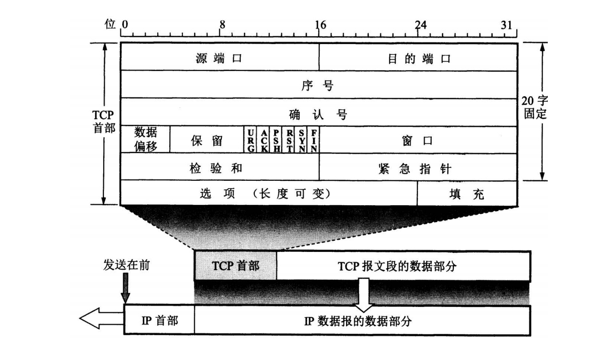
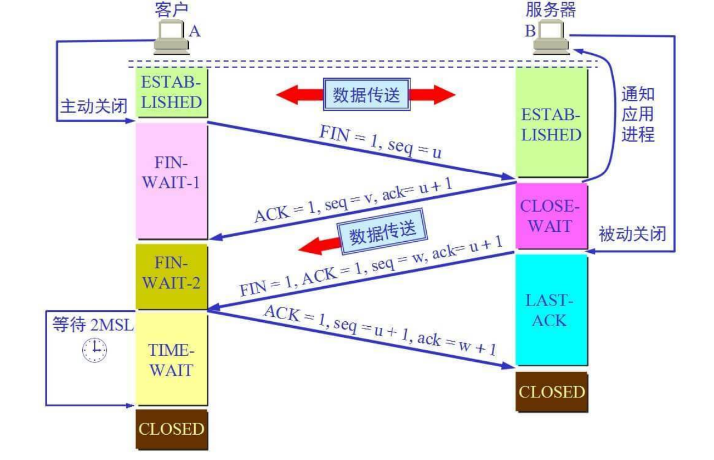
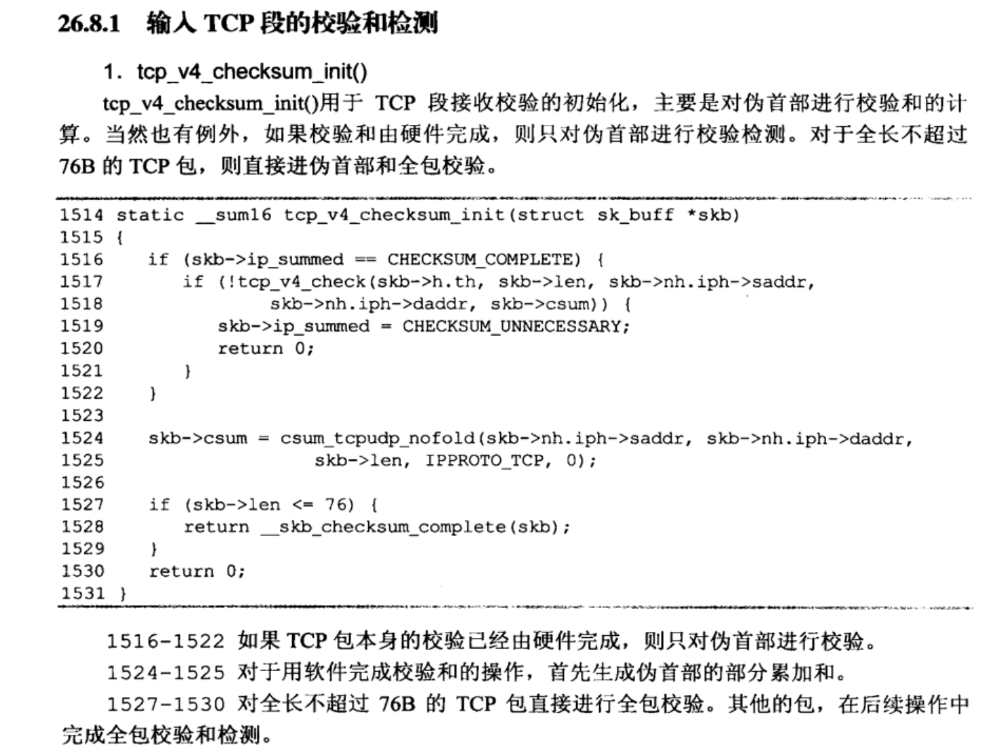

# 计算机网络

## 四、五、七层模型

### OSI七层模型

应用层：面向用户提供服务

表示层：数据处理，加密解密，压缩解压

会话层：管理应用程序之间的会话（建立维护重连）

传输层：为两台主机进程之间的通信提供数据传输服务（端到端传输）

网络层：路由、寻址

数据链路层：成帧、MAC寻址、可靠交付、差错检测纠正

物理层：比特流和光信号、电信号的转换，负责底层数据传输

## 应用层

### Cookie和Session的区别

- **作用范围不同**，Cookie 保存在客户端，Session 保存在服务器端。
- **有效期不同**，Cookie 可设置为长时间保持，比如我们经常使用的默认登录功能，Session 一般失效时间较短，客户端关闭或者 Session 超时都会失效。
- **隐私策略不同**，Cookie 存储在客户端，容易被窃取；Session 存储在服务端，安全性相对 Cookie 要好一些。
- **存储大小不同**， 单个 Cookie 保存的数据（一般）不能超过 4K；对于 Session 来说存储没有上限，但出于对服务器的性能考虑，Session 内不要存放过多的数据，并且需要设置 Session 删除机制。

Cookie是在服务端生成的，保存在客户端的一种信息载体。浏览器再次向服务器发起请求的时候，请求里面就会携带这个cookie。通常，cookie是用于告知服务端两个请求是否来自同一浏览器，比如要保持用户的登录状态的时候，就要使用到cookie。

用户在提交第一次请求的时候，服务器就会生成cookie，封装到响应头里面去。客户端接收到这个响应后，就会把cookie保存到客户端。客户端再次发送请求的时候，请求里面就会携带上保存在客户端的cookie数据，发送到服务端。

Session 也是一种会话状态的跟踪技术，不同的是cookie将会话状态保存在客户端，而session把会话状态保存在了服务器。什么是会话，当用户打开浏览器，发出第一次请求，一直到关闭浏览器，一次会话就算结束。

两者如何结合：

用户第一次请求服务器的时候，服务器创建对应的 Session ，请求返回时将此 Session 的唯一标识信息 SessionID放到cookie里面，返回给客户端，浏览器接收到这个 SessionID之后，就会放在浏览器缓存里面

用户再次提交请求的时候，就会把缓存里的cookie发送到服务器那边

session是一种机制，除了利用cookie来实现session机制，还可以通过在URL末尾那里附加ID来追踪session

### token

特定时间有大量用户访问服务器的时候，服务器可能需要存储大量SessionID，但是如果有多台服务器，一台服务器存储了SessionID，又会面临需要分享SessionID给其他服务器的情况，因为可能出现这台服务器的超载，需要分配一些用户到其他服务器，其他服务器需要通用的SessionID才可以避免用户再次输入用户名和密码。但是服务器这样分享也不是办法（你这一台服务器上有这个sessionid，但是其他的服务器不一定有）

1. 客户端发送请求给服务器，服务器会签发一个token，把这个token发给客户端
2. 客户端收到 token 以后，会把它存储起来，比如放在 cookie 里或者 localStorage 里
3. 客户端每次向服务端请求资源的时候需要带着服务端签发的 token
4. 服务端收到请求，然后去验证客户端请求里面带着的 token ，如果验证成功，就向客户端返回请求的数据

- **每一次请求都需要携带 token，需要把 token 放到 HTTP 的 Header 里**
- **基于 token 的用户认证是一种服务端无状态的认证方式，服务端不用存放 token 数据。==用解析 token 的计算时间换取 session 的存储空间==，从而减轻服务器的压力，减少频繁的查询数据库**
- **token 完全由应用管理，所以它可以避开同源策略**

### HTTP

| 序号 | 方法    | 描述                                                         |
| :--- | :------ | :----------------------------------------------------------- |
| 1    | GET     | 请求指定的页面信息，并返回实体主体。                         |
| 2    | HEAD    | 类似于 GET 请求，只不过返回的响应中没有具体的内容，用于获取报头 |
| 3    | POST    | 向指定资源提交数据进行处理请求（例如提交表单或者上传文件）。数据被包含在请求体中。POST 请求可能会导致新的资源的建立和/或已有资源的修改。 |
| 4    | PUT     | 从客户端向服务器传送的数据取代指定的文档的内容。             |
| 5    | DELETE  | 请求服务器删除指定的页面。                                   |
| 6    | CONNECT | HTTP/1.1 协议中预留给能够将连接改为管道方式的代理服务器。    |
| 7    | OPTIONS | 允许客户端查看服务器的性能。                                 |
| 8    | TRACE   | 回显服务器收到的请求，主要用于测试或诊断。                   |
| 9    | PATCH   | 是对 PUT 方法的补充，用来对已知资源进行局部更新 。           |

### HTTPS

#### 对称加密与非对称加密

##### 对称加密

对称加密指加密和解密使用同一密钥，优点是运算速度快，缺点是如何安全将密钥传输给另一方。常见的对称加密算法有DES、AES等。

##### 非对称加密

非对称加密指的是加密和解密使用不同的密钥（公钥 私钥），公钥加密的信息只有私钥才能解密，私钥加密的信息只有公钥才能解密。优点是解决了对称加密中存在的问题。缺点是运算速度慢。常见的非对称加密算法有RSA、DSA、ECC等。

HTTPS实质上是非对称加密传输对称密钥，对称加密传输报文，从而保证通信效率。

**简化流程：**服务端生成一对非对称密钥，将公钥发给客户端。客户端生成对称密钥，用服务端发来的公钥进行加密，加密后发给服务端。服务端收到后用私钥进行解密，得到客户端的对称密钥。然后通信双方就可以使用对称密钥进行高效的通信了。

#### HTTPS加密过程

1. 客户端向服务器发起第一次握手请求，告诉服务器客户端所支持的SSL的版本、加密算法以及密钥长度等信息。
2. 服务端将自己的公钥发给数字认证机构，数字认证机构利用自己的私钥对服务器的公钥进行数字签名，并给服务器颁发公钥证书。
3. 服务端将证书发给客户端。
4. 客户端利用数字认证机构的公钥，向数字证书认证机构验证公钥证书上的数字签名，确认服务器公开密钥的真实性。
5. 客户端使用服务端公开密钥加密自己生成的对称密钥，发给服务端。
6. 服务端收到后利用私钥解密信息，获得客户端发来的对称密钥。
7. 通信双方可用对称密钥来加密解密信息。

<div align='center'>
    
    <br/><br/>HTTPS加密过程
</div>


## 传输层

### 传输控制协议（Transmission Control Protocol，TCP）

<div align='center'>
    
    <br/><br/>TCP包头
</div>


#### 三次握手

<div align='center'>
    
    <br/><br/>TCP三次握手
</div>
##### 为什么三次握手

主要有两方面的原因：

1. TCP是双工通信，为了确保客户端->服务器、服务器->客户端之间的链路都是通的，需要三次握手。服务端能收到客户端的SYN包说明客户端->服务器之间的链路是通的，但不能保证服务器发给客户端的SYN包能顺利到达，假若是两次（一次）握手并且服务器发给客户端的这个SYN包丢失了，会导致出现问题，客户端认为服务端没有和它建立链接，而服务端认为它已经和客户端建立了链接，再如果这时候服务端已经分配了相关资源还会造成资源的浪费。
2. 防止已失效的请求到达服务端（这点最重要），如果是已失效的报文，如果是两次（一次）握手的话，服务端会直接建立链接会造成资源浪费。

##### 建立链接是初始序列号怎么得来的

根据双方地址、端口计算得到的

```c
//net/ipv4/tcp_ipv4.c
	/*
	 * 如果write_seq字段值为零，则说明该传输控制块还
	 * 未设置初始序号，因此需调用secure_tcp_sequence_number()，
	 * 根据双方的地址、端口、系统时间计算初始序列号，同时根据
	 * 发送需要和当前时间得到用于设置IP首部ID域的值。
	 */
	if (!tp->write_seq)
		tp->write_seq = secure_tcp_sequence_number(inet->inet_saddr,
							   inet->inet_daddr,
							   inet->inet_sport,
							   usin->sin_port);

	inet->inet_id = tp->write_seq ^ jiffies;
```

```c
#ifdef CONFIG_INET
static u32 seq_scale(u32 seq)
{
	/*
	 *	As close as possible to RFC 793, which
	 *	suggests using a 250 kHz clock.
	 *	Further reading shows this assumes 2 Mb/s networks.
	 *	For 10 Mb/s Ethernet, a 1 MHz clock is appropriate.
	 *	For 10 Gb/s Ethernet, a 1 GHz clock should be ok, but
	 *	we also need to limit the resolution so that the u32 seq
	 *	overlaps less than one time per MSL (2 minutes).
	 *	Choosing a clock of 64 ns period is OK. (period of 274 s)
	 */
	return seq + (ktime_get_real_ns() >> 6);
}
#endif

u64 siphash_3u32(const u32 first, const u32 second, const u32 third,
		 const siphash_key_t *key)
{
	u64 combined = (u64)second << 32 | first;
	PREAMBLE(12)
	v3 ^= combined;
	SIPROUND;
	SIPROUND;
	v0 ^= combined;
	b |= third;
	POSTAMBLE
        
    /*
    /lib/siphash.c
    #define PREAMBLE(len) \
	u64 v0 = 0x736f6d6570736575ULL; \
	u64 v1 = 0x646f72616e646f6dULL; \
	u64 v2 = 0x6c7967656e657261ULL; \
	u64 v3 = 0x7465646279746573ULL; \
	u64 b = ((u64)(len)) << 56; \
	v3 ^= key->key[1]; \
	v2 ^= key->key[0]; \
	v1 ^= key->key[1]; \
	v0 ^= key->key[0];
	
	#define SIPROUND \
	do { \
	v0 += v1; v1 = rol64(v1, 13); v1 ^= v0; v0 = rol64(v0, 32); \
	v2 += v3; v3 = rol64(v3, 16); v3 ^= v2; \
	v0 += v3; v3 = rol64(v3, 21); v3 ^= v0; \
	v2 += v1; v1 = rol64(v1, 17); v1 ^= v2; v2 = rol64(v2, 32); \
	} while (0)
	
	#define POSTAMBLE \
	v3 ^= b; \
	SIPROUND; \
	SIPROUND; \
	v0 ^= b; \
	v2 ^= 0xff; \
	SIPROUND; \
	SIPROUND; \
	SIPROUND; \
	SIPROUND; \
	return (v0 ^ v1) ^ (v2 ^ v3);
    */
}

u32 secure_tcp_seq(__be32 saddr, __be32 daddr,
		   __be16 sport, __be16 dport)
{
	u32 hash;

	net_secret_init();
	hash = siphash_3u32((__force u32)saddr, (__force u32)daddr,
			    (__force u32)sport << 16 | (__force u32)dport,
			    &net_secret);
	return seq_scale(hash);
}
```


#### 四次挥手

<div align='center'>
    
    <br/><br/>TCP四次挥手
</div>

##### 为什么四次挥手

双工通信，确保两个链接都正常关闭。

##### TIME-WAIT和CLOSE-WAIT的区别

TIME-WAIT是主动关闭形成的，当第四次挥手报文发出后，主动关闭链接的一方进入TIME-WAIT状态。

CLOSE-WAIT是被动关闭形成的，当收到主动关闭链接方的FIN报文后，返回ACK报文并进入CLOSE-WAIT状态


#### 拥塞控制

#### 流量控制

#### 滑动窗口

#### TCP如何保证可靠重传

- 校验和

	TCP校验和覆盖TCP首部及TCP数据，而IP首部中的校验和只覆盖IP的首部，不覆盖IP数据报中的任何数据。

	计算校验和与IP类似，每16位字取反后相加，但TCP长度可以为奇数字节，在计算校验和时不足16位的填充0，但填充的字节可能不会被传送。

	计算校验和时TCP段包含一个12B的伪首部，目的是让TCP double check 检查数据是否已经正确到达目的地（IP有没有错接，接受非本IP的，接受非本应用的）。

	如果校验和为0，则最终校验结果为16位全1（65535，二进制反码），如果传送的校验和为0，则说明发送端没有计算校验和。

	<div align='center'>
	    
	    <br/><br/>计算校验和的伪首部
	</div>


	<div align='center'>
	    
	    
	    <br/><br/>输入TCP段的校验和检测
	    
	    <br/><br/>输出TCP段的校验和检测
	</div>


​	

- 序列号

- 超时重传

- 流量控制

- 拥塞避免

#### TCP粘包

### 用户数据报协议（User Datagram Protocol， UDP）

### TCP与UDP区别

|      | 是否面向连接 | 可靠性 | 传输形式   | 传输效率 | 消耗资源 | 应用场景      | 首部字节 |
| ---- | ------------ | ------ | ---------- | -------- | -------- | ------------- | -------- |
| TCP  | 面向连接     | 可靠   | 字节流     | 慢       | 多       | 文件/邮件传输 | 20-60    |
| UDP  | 无连接       | 不可靠 | 数据报文段 | 块       | 少       | 视频/语音传输 | 8        |


## 网络层	

### IP与MAC的区别

IP为逻辑地址，MAC为硬件地址。IP有可能发生变化，不固定，屏蔽了硬件差异。MAC地址是固定的，每个硬件唯一。

IP地址是地域相关的，对于同一个子网上的设备，IP前缀是一样的，便于路由，而MAC分布不规律。

IP地址可以理解为快递的收件地址，MAC地址可以理解为收件人，在一次网络通信中二者是缺一不可的。

## 物理链路层