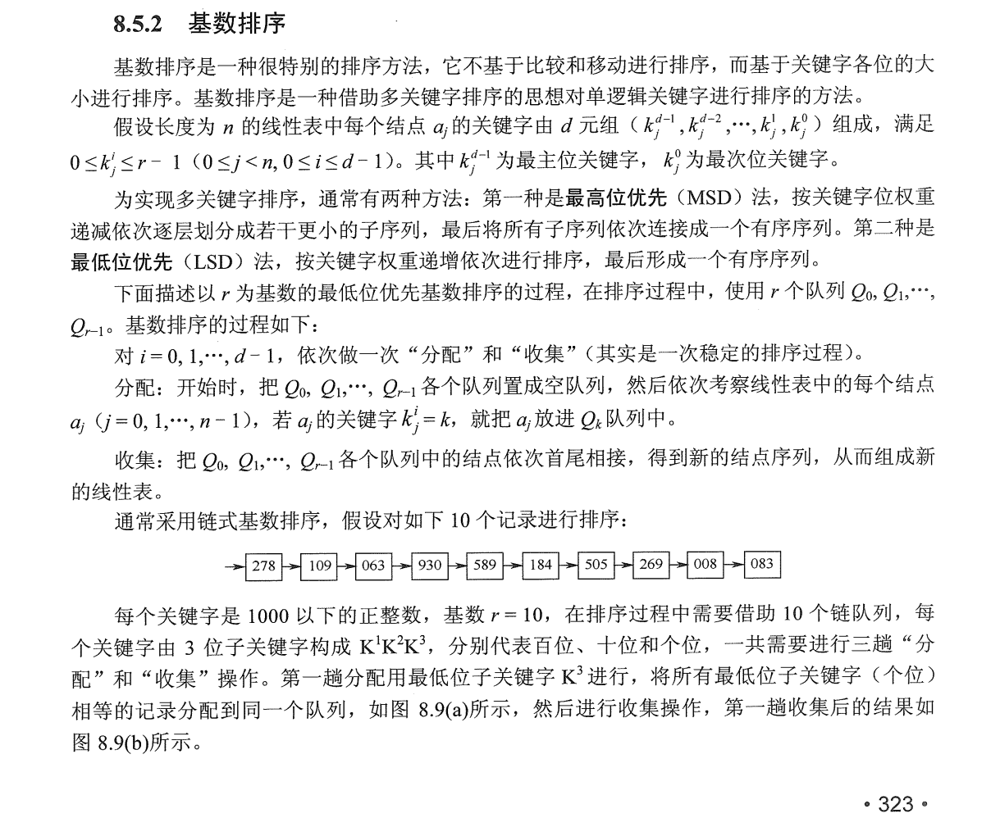
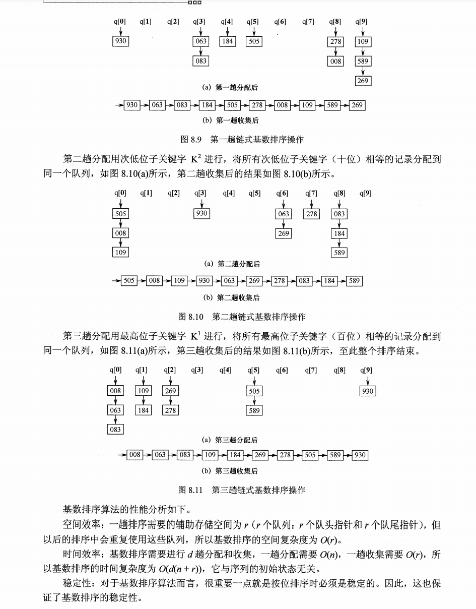

#  数据结构

##  排序

###  插入排序

- 直接插入排序

线性（挨个）比较，找到待插入位置后，移动元素，插入待插入元素

```java
void InsertSort(ElemType[] A, int n) {
	for(int i = 2; i <= n; i++) { //依次将A[2]-A[n]插入前面已排序序列
		if(A[i] < A[i - 1]) {	//若A[i]小于A[i - 1],将A[i]插入有序表
			A[0] = A[i];		//复制为哨兵
			for(int j = i - 1; A[0] < A[j]; --j) { //从后往前查找待插入位置
				A[j + 1] = A[j];
			}
			A[j + 1] = A[0];
		}
	}
}
```

- 折半插入排序

二分比较过程，先确定待插入位置，然后移动元素，将待插入元素复制到待插入位置

```java
void InsertSort(ElemType[] A, int n) {
	for(int i = 2; i <= n; i++) {
		A[0] = A[i];
		int low = 1, high = i - 1, mid;
        //二分待插入位置
		while(low <= high) {
			mid = (low + high) >> 1;
			if(A[mid] > A[0]) {
				high = mid - 1;
			} else {
				low = mid + 1;
			}
		}
		
        //元素后移，空出待插入位置
		for(int j = i - 1; j >= high + 1; j--) {
			A[j + 1] = A[j];
		}
		
		A[high + 1] = A[0];
	}
}
```

- 希尔排序

```java
void ShellSort(ElemType[] A, int n) {
	for(dk = n >> 1; dk >= 1; dk >>= 1) {
		for(int i = dk + 1; i <= n; i++) {
			if(A[i] < A[i - dk]) {
				A[0] = A[i];
				for(int j = i - dk; j > 0 && A[0] < A[j]; j-= dk) {
					A[j + dk] = A[j];
				}
				A[j + dk] = A[0];
			}
		}
	}
}
```

###  交换排序

- 冒泡排序

```java
void BubbleSort(ElemType[] A, int n) {
	boolean flag = false;
	for(int i = 0; i < n - 1; i++) {
		flag = false;
		for(int j = n - 1; j > i; j--) {
			if(A[j - 1] > A[j]) {
				int temp = A[j - 1];
				A[j - 1] = A[j];
				A[j] = temp;
				flag = true;
			}
		}
		if(flag == false) {
			return;
		}
	}
}
```

- 快速排序

```java
void QuickSort(ElemType A[], int low, int high) {
	if(low < high) {
		//Partition() 划分操作 将表A[low,high]划分为满足条件的两个子表（以第一个元素为哨兵，左边子表均小于它，右			//边子表均大于它）
		int pivotpos = Partition(A, low, high);//划分
		QuickSort(A, low, povptpos-1); //依次对两个子表进行递归排序
		QuickSort(A, pivotpos+1, high);
	}
}

//一趟划分操作
int Partition(ElemType A[], int low, int high) {
	ElemType pivot = A[low]; //将当前表中第一个元素设为枢轴，对表进行划分
	while(low < high) {
		while(low < high && A[high] >= pivot) {
			--high;
		}
		A[low] = A[high]; //将比枢轴小的元素移动到左端
		
		while(low < high && A[low] <= pivot) {
			++low;
		}
		A[high] = A[low]; //将比枢轴大的元素移动到右端
	}
	A[low] = pivot; //枢轴元素存放的最终位置
	return low; //返回存放枢轴的最终位置
}
```

###  选择排序

- 简单选择排序

每一趟在后面n-i+1(i=1,2,···,n-1)个待排序元素中选取关键字最小的元素，作为有序子序列的第i个元素，知道第n-1躺做完。

```java
//贪心 每次选择当前子列表最小的放在子列表首部
void SelectSort(ElemType[] A, int n) {
	for(int i = 0; i < n - 1; i++) {
		min = i;
		for(int j = i + 1; j < n; j++) {
			if(A[j] < A[min]) {
				min = j;
			}
		}
		if(min != i) {
			swap(A[i], A[min]);
		}
	}
}
```

- 堆排序（大根堆、小根堆）

堆顶最大（小）

```java
void BuildMaxHeap(ElemType[] A, int len) {
	for(int i = len >> 1; i > 0; i--) { //从 i=[n>>1] ~ 1,反复调整堆
		HeadAdjust(A, i, len);
	}
}

void HeadAdjust(ElemType[] A, int k, int len) {
	//将元素k为根的子树进行调整
	A[0] = A[k]; //A[0] temp store the root of subTree
	for(i = k << 1; i <= len; i <<= 1) { //沿k较大的子节点向下筛选
		if(i < len && A[i] < A[i+1]) {
			i++; //取key较大的子节点的下标
		}
		
		if(A[0] >= A[i]) {
			break;
		} else {
			A[k] = A[i]; //将A[i]调整到双亲节点上
			k = i;
		}
	}
	A[k] = A[0]; //被筛选的结点的值放入最终位置
}

void HeapSort(ElemType[] A, int len) {
    BuildMaxHeap(A, len);
    for(i = len; i > 1; i--) { //n-1 趟交换和建堆
        Swap(A[i], A[1]); //输出堆顶元素（和堆底元素交换）
        HeadAdjust(A, 1, i - 1); //调整，把剩余的i-1个元素整理成堆
    }
}
```


###  归并排序和基数排序

```java
   //合并两个有序数组
   public static int[] mergeSort(int[] nums1, int[] nums2) {
        if(nums1 == null || nums1.length == 0) {
            return nums2;
        } else if(nums2 == null || nums2.length == 0) {
            return nums1;
        }

        int n1Len = nums1.length, n2Len = nums2.length;
        int[] res = new int[n1Len + n2Len];
        int p1 = 0, p2 = 0, count = 0;
        while (p1 < n1Len && p2 < n2Len) {
            while (p1 < n1Len && p2 < n2Len && nums1[p1] <= nums2[p2]) {
                res[count++] = nums1[p1];
                p1++;
            }

            while (p2 < n2Len && p1 < n1Len && nums1[p1] > nums2[p2]) {
                res[count++] = nums2[p2];
                p2++;
            }
        }

        if(p1 == n1Len) {
            for (int i = p2; i < n2Len; i++) {
                res[count++] = nums2[i];
            }
        } else if(p2 == n2Len) {
            for (int i = p1; i < n1Len; i++) {
                res[count++] = nums1[i];
            }
        }
        return res;
    }
```

<div align='center'>
    
     
</div>


### 常用内部排序比较


| 算法种类     | 时间复杂度 |            |            | 空间复杂度 | 是否稳定 |
| ------------ | ---------- | ---------- | ---------- | ---------- | -------- |
|              | 最好情况   | 平均情况   | 最坏情况   |            |          |
| 直接插入排序 | O(n)       | O(n^2)     | O(n^2)     | O(1)       | 是       |
| 冒泡排序     | O(n)       | O(n^2)     | O(n^2)     | O(1)       | 是       |
| 简单选择排序 | O(n^2)     | O(n^2)     | O(n^2)     | O(1)       | 否       |
| 希尔排序     | -          | -          | -          | O(1)       | 否       |
| 快速排序     | O(nlog2 n) | O(nlog2 n) | O(n^2)     | O(log2 n)  | 否       |
| 堆排序       | O(nlog2 n) | O(nlog2 n) | O(nlog2 n) | O(1)       | 否       |
| 2路归并排序  | O(nlog2 n) | O(nlog2 n) | O(nlog2 n) | O(n)       | 是       |
| 基数排序     | O(d(n+r))  | O(d(n+r))  | O(d(n+r))  | O(r)       | 是       |
|              |            |            |            |            |          |

## 树

### B树

平衡的多路查找树。

### B+树

### 红黑树