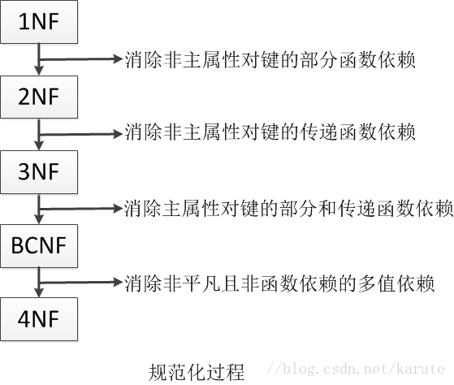
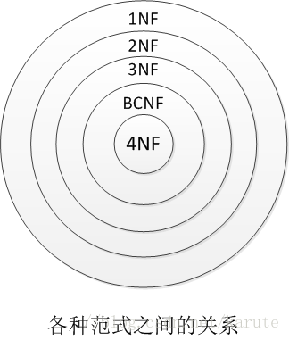

# 数据库

### 三/五范式

- 第一范式：确保每列保持原子性，数据表中的所有字段值都是不可分解的原子值。
- 第二范式：确保表中的每列都和主键相关。
- 第三范式：确保每列都和主键列直接相关而不是间接相关。
- BC范式（BCNF）：消除主属性对键的部分和传递函数依赖。
- 第四范式：消除非平凡且非函数依赖的多值依赖。

    
      规范化过程

    
      各种范式之间的关系

### 主键和外键

|      | 主键                                       | 外键                                                 | 索引                               |
| ---- | ------------------------------------------ | ---------------------------------------------------- | ---------------------------------- |
| 定义 | 唯一标识一条记录，不能有重复的，不允许为空 | 表的外键是另一表的主键, 外键可以有重复的, 可以是空值 | 该字段没有重复值，但可以有一个空值 |
| 作用 | 用来保证数据完整性                         | 用来和其他表建立联系用的                             | 是提高查询排序的速度               |
| 个数 | 主键只能有一个                             | 一个表可以有多个外键                                 | 一个表可以有多个索引               |

### 数据库的事务

#### 什么是数据库的事务

数据库事务是访问并可能操作各种数据项的一个数据库操作序列，这些操作要么全部执行，要么全部不执行，是一个不可分割的工作单位。事务由事务开始与事务结束之间执行的全部数据库操作组成。

#### 事务的四大特性（ACID）

- 原子性：指包含事务的操作要么全部执行成功，要么全部失败回滚。
- 一致性：指事务在执行前后状态是一致的。
- 隔离性：一个事务所进行的修改在最终提交之前，对其他事务是不可见的。
- 持久性：数据一旦提交，其所作的修改将永久地保存到数据库中。

#### 数据库并发一致性问题

当多个事务并发执行时，可能会出现以下问题：

- 脏读：事务A更新了数据，但还没有提交，这时事务B读取到事务A更新后的数据，然后事务A回滚了，事务B读取到的数据就成为脏数据了。

- 不可重复度：事务A对数据进行多次读取，事务B在事务A多次读取的过程中执行了更新操作，并提交了，导致事务A多次读取到的数据并不一致。

- 幻读：事务A在读取数据后，事务B向事务A读取的数据中插入了几条数据，事务A再次读取数据的时候发现多了几条数据，和之前读取的数据不一致。

- 丢失修改：事务A和事务B都对同一个数据进行修改，事务A先修改，事务B随后修改，事务B的修改覆盖了事务A的修改。

#### 数据库的隔离级别

- 未提交读：一个事务在提交前，它的修改对其他事务也是可见的

- 提交读：一个事务提交后，它的修改才能被其他事务看到

- 可重复度：在同一个事务中多次读取到的数据是一致的

- 串行化：需要加锁实现，会前置事务串行执行

事务的隔离级别分别可以解决数据库的脏读、不可重复读、幻读等问题。

| 隔离级别 | 脏读   | 不可重复读 | 幻读   |
| -------- | ------ | ---------- | ------ |
| 未提交读 | 允许   | 允许       | 允许   |
| 提交读   | 不允许 | 允许       | 允许   |
| 可重复读 | 不允许 | 不允许     | 允许   |
| 串行化   | 不允许 | 不允许     | 不允许 |

##### 隔离级别如何实现

事务的隔离机制主要是依靠锁机制和MVCC实现的，提交读和可重复读可以通过MVCC实现，串行化可以通过锁机制实现。

#### MVCC

MVCC(multiple version concurrent control)是一种控制并发的方法，主要用来提高数据库的并发性能。

### 索引

索引是对数据库表中的一列或者多列的值进行排序一种结构，使用索引可以快速访问数据表中的特定信息。

#### 索引优缺点

**优点**：

- 加快检索速度

- 将随机IO变为顺序IO（B+树的叶子结点是连接在一起的）

- 加快表与表之间的连接

**缺点**：

- 占用物理空间

- 创建和维护索引都需要花费时间（对数据进行增删改的时候都要维护索引）

#### 索引的数据结构

B+树、哈希表（B+树、哈希索引）。InnoDB引擎的索引类型有B+树、哈希索引，默认索引类型为B+树索引。

B+树索引

#### 索引的种类

- 主键索引：数据列不允许重复，不能为null，一个表只能有一个主键索引。

- 组合索引：由多个列值组成的索引。

- 唯一索引：数据列不允许重复，可以为null，索引列的值必须唯一，如果是组合索引，则列值的组合必须唯一。

- 全文索引：对文本的内容进行索引。

- 普通索引：基本的索引类型，可以为null。

#### B树和B+树的区别

#### 索引为什么使用B+树而不用B树

#### 聚簇索引和非聚簇索引

主要区别是**数据和索引是否分开存储**。

**聚簇索引：**将数据和索引放到一起存储，索引结构的叶子结点保留了数据行。

**非聚簇索引：**将数据和索引分开存储，索引叶子结点存储的是指向数据行的地址。

#### 索引的使用场景

- 对于中大型表建立索引非常有效，对于非常小的表，一般全部表扫描。
- 对于超大型的表，建立和维护索引的代价也会非常高，可以考虑分区。
- 增删改非常多的，查询比较少的没必要建立索引。
- 多个字段经常被查询的可以考虑联合索引。
- 字段多且字段值没有重复的时候考虑唯一索引。
- 字段多且有重复的时候考虑普通索引。

#### 如何对索引进行优化

- 索引列不能是表达式的一部分。
- 将区分度高的索引放在前面
- 尽量少使用select *

#### 创建与删除索引

#### 索引的设计原则

- 出现在where后面的列或者连接句子中指定的列，不会出现在where条件中的字段不适合创建索引。
- 索引列值的可能越多，索引效果越好（唯一性太差的字段不适合建立索引）。
- 尽量使用短索引，对于较长字符串进行索引时应该指定一个较短的前缀长度，较小的索引涉及到的磁盘I/O较少，并且索引高速缓存中的块可以容纳更多的键值，会使得查询速度更快。
- 尽量使用最左前缀。
- 不要过度使用索引，每个索引都需要额外的物理空间，维护也需要花费时间，所以索引不是越多越好。

- 较频繁作为查询条件的字段

- 更新太频繁的字段不适合创建索引

#### 索引在什么情况下会失效

- 条件中有 or。
- 索引列参与计算。
- 在索引的类型上进行数据类型的隐形转换
- 在索引中使用函数
- 在使用like查询时以%开头（模糊查询）
- 在索引上使用！、=、<>进行判断
- 索引字段上使用 is null/is not null判断时

# 保证数据库和缓存一致性

## References

1. https://mp.weixin.qq.com/s/olmqhogDIW1dE3_RwQ78Bg