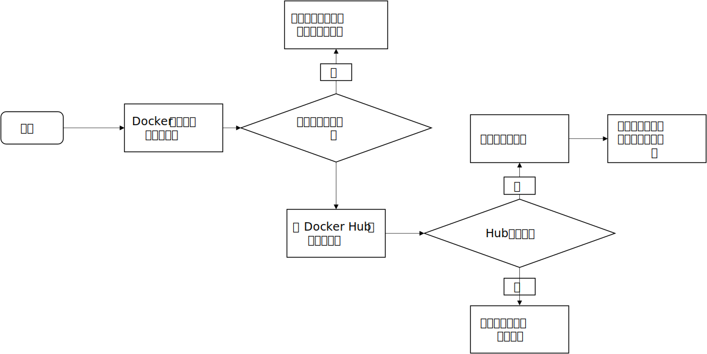

# 基础

## 简介

<div align='center'>
    
    Docker architecture
</div>

### 是什么

为了消除团队协作编码时不同机器环境问题，Docker提供了一个标准化解决方案--系统平滑移植、容器虚拟化技术。

Docker是基于Go语言实现的云开源项目。

Docker的主要目标是“Build，Ship and Run Any App,Anywhere”，也就是通过对应用组件的封装、分发、部署、运行等生命周期的管理，使用户的APP（可以是一个WEB应用或数据库应用等等）及其运行环境能够做到“一次镜像，处处运行”。

Linux容器技术的出现就解决了这样一个问题，而 Docker 就是在它的基础上发展过来的。将应用打成镜像，通过镜像成为运行在Docker容器上面的实例，而 Docker容器在任何操作系统上都是一致的，这就实现了跨平台、跨服务器。只需要一次配置好环境，换到别的机子上就可以一键部署好，大大简化了操作。

一句话总结就是：**Docker解决了运行环境和配置问题的软件容器，方便做持续集成并有助于整体发布的容器虚拟化技术**

### 容器与虚拟机比较

**虚拟机（virtual machine）**就是带环境安装的一种解决方案。

缺点：资源占用多、冗余步骤多、启动慢

**Linux容器(Linux Containers， LXC)**

Linux容器是与系统其他部分隔离开的一系列进程，从另一个镜像运行，并由该镜像提供支持进程所需的全部文件。容器提供的镜像包含了应用的所有依赖项，因而在从开发到测试再到生产的整个过程中，它都具有可移植性和一致性。

Linux 容器不是模拟一个完整的操作系统而是对进程进行隔离。有了容器，就可以将软件运行所需的所有资源打包到一个隔离的容器中。容器与虚拟机不同，不需要捆绑一整套操作系统，只需要软件工作所需的库资源和设置。系统因此而变得高效轻量并保证部署在任何环境中的软件都能始终如一地运行。

**Docker**容器是在操作系统层面上实现虚拟化，直接复用本地主机的操作系统，传统的虚拟机则是在硬件层面实现虚拟化。

优点：启动快、占用资源少。

#### Docker与传统虚拟化不同之处

- 传统虚拟机技术是虚拟出一套硬件后，在其上运行一个完整操作系统，在该系统上再运行所需应用进程
- 容器内的应用进程直接运行于宿主的内核，容器内没有自己的内核且也没有进行硬件虚拟。因此容器要比传统虚拟机更为轻便。
- 每个容器之间互相隔离，每个容器有自己的文件系统 ，容器之间进程不会相互影响，能区分计算资源。

|            | Docker容器             | 虚拟机（VM）            |
| ---------- | ---------------------- | ----------------------- |
| 操作系统   | 与宿主机共享OS         | 宿主机OS上运行虚拟机OS  |
| 存储空间   | 镜像下，便于存储与传输 | 镜像庞大（vdmk、vdi等） |
| 运行性能   | 几乎无额外性能损失     | 有额外消耗              |
| 移植性     | 轻便、灵活             | 与虚拟化技术耦合程度高  |
| 硬件亲和性 | 面向软件开发者         | 面向硬件运维者          |
| 部署速度   | 快速                   | 较慢                    |


### 能干嘛

一次构建、随处运行：

- 更快速的应用交付和部署
- 更便捷的升级和扩/缩容
- 更简单的系统运维
- 更高效的计算资源利用

### 去哪下

docker官网：http://www.docker.com

Docker 仓库官网: https://hub.docker.com/

## Docker安装

### 基本组成

- 镜像（image）
	- 只读的模板，用来创建容器，一个镜像可创建很多容器。
- 容器（container）
	- 使用image创建的运行实例
	- 可以看做是一个简易版的Linux环境（包括root用户权限、进程空间、用户空间和网络空间等）和运行在其中的应用程序
- 仓库（repository）
	- 集中存放镜像文件的场所
	- 公开/私有
	- Docker Hub、阿里云、网易云

### 安装

1. Centos7以上

2. yum安装gcc相关

   1. yum -y install gcc
   2. yum -y install gcc-c++

3. 安装所需要的软件包

   1. [官网需求](https://docs.docker.com/desktop/linux/install/)
   2. 执行命令 yum install -y yum-utils

4. 设置stable镜像仓库

   1. 推荐

      1. ```shell
         yum-config-manager --add-repo http://mirrors.aliyun.com/docker-ce/linux/centos/docker-ce.repo
         ```

5. 更新yum软件包索引

   1. ```shell
      yum makecache fast
      ```

6. 安装docker ce

   1. ```shell
      yum -y install docker-ce docker-ce-cli containerd.io
      ```

7. 启动docker

   1. ```shell
      systemctl start docker
      ```

8. 测试

   1. ```shell
      docker version
      docker run hello-world
      ```

9. 卸载

   1. ```shell
      systemctl stop docker
      yum remove docker-ce docker-ce-cli containerd.io
      rm -rf /var/lib/docker
      rm -rf /var/lib/containerd
      ```

### 阿里云镜像加速

阿里云个人账号下有一个专属的加速器地址

https://cr.console.aliyun.com/cn-hangzhou/instances/mirrors

### Hello World

#### docker run hello-world干了什么？

<div align='center'>
    
</div>

### 为什么比虚拟机块

1. 有着比虚拟机更少的抽象层
2. 直接利用宿主机内核，无需加载新的操作系统/内核

## 常用命令

### 帮助启动类命令

```shell
#启动
systemctl start docker
#停止
systemctl stop docker
#重启
systemctl restart docker
#查看状态
systemctl status docker
#开机启动
systemctl enable docker
#查看该要信息
docker info
#查看帮助文档
docker --help
#查看具体命令帮助
docker cmd --help
```

### 镜像命令

```shell
#列出本地主机上的镜像 
#options 
## -a 列出本地所有镜像（含历史）
## -q 只显示镜像ID
docker images

#查找某个镜像
#options
## --limit 只列出N个镜像，默认25个
docker serach imageName

#拉取镜像 TAG（版本）
docker pull imageName[:TAG]

#查看镜像/容器/数据卷所占的空间
docker system df

#删除镜像
#options
##docker rmi -f imageID 删除单个
##docker rmi -f imageName1:TAG imageName2:TAG 删除多个
##docker rmi -f $(docker images -qa)
docker rmi imageID
```

#### docker虚悬镜像是什么？

仓库名、标签都是<none>的镜像，也称虚悬镜像（dangling image）

## 容器命令

### 常用

有镜像才能创建容器（前提）

```shell
#新建+启动容器
## options
### --name="imageNewName" 为容器指定名称
### -d 后台运行并返回容器ID（启动守护式容器）
### -i 以交互模式运行容器，通常与-t同时使用
### -t 为容器重新分配一个伪输入终端，通常与-i同时使用（交互式容器，前台有伪终端，等待交互）
### -P 随机端口映射
### -p 指定端口映射 hostPort:containerPort
### -p ip:hostPort:containerPort
### -p ip::containerPort 随机分配端口
### -p hostPort:containerPort:udp 根据端口和协议指定宿主机端口
### -p port1:port0 --p port11:port00 指定范围端口
docker run [options] image [cmd] [args]
docker run -it ubuntu /bin/bash

#列出当前所有正在运行的容器
## options
### -a 列出当前所有正在运行的容器+历史上运行过的
### -l 显示最近创建的容器
### -n x 显示最近x个创建的容器
### -q 静默模式，只显示容器编号
docker ps [options]
#退出容器
exit #exit退出 容器停止
ctrl+p+q #退出 容器不停止
#启动已停止运行的容器
docker start containerID/containerName
#重启容器
docker restart containerID/containerName
#停止容器
docker stop containerID/containerName
#强制停止容器
docker kill containerID/containerName
#删除已停止的容器
docker rm containerID
##一次性删除多个容器实例
docker rm -f $(docker ps -a -q)
docker ps -a -q | xargs docker rm
```

### 启动守护式容器（后台服务器）

大部分场景下，希望docker的服务是后台运行的

有些容器使用-d是不行的（比如ubuntu），Docker容器后台运行，就必须有一个前台进程。容器运行的命令如果不是那些一直挂起的命令（top，tail），就会自动退出。最佳解决方案是，==将要运行的程序以前台进程的形式运行，常见的就是命令行模式==

```shell
docker run -d containerName
```

### 查看容器日志

```shell
docker logs containerID
```

### 查看容器内部细节

```
docker inspect containerID
```

### 进入正在运行的容器进行交互

```shell
docker exec -it containerId bashShell

#重新进入
docker attach containerID

#区别
##attach 直接进入容器启动命令的终端，不会启动新的进程 用exit退出会导致容器的停止
##exec是在容器中打开新的终端，并且可以启动新的进程，用exit退出不会导致容器的停止
#推荐使用 docker exec
```

一般先试用-d进入后台，然后使用exec重新进入应用干活。

### 从容器内拷贝文件到主机

```shell
docker cp containerID:容器内路径 目标主机路径
```

### 导入和导出容器

export 导出容器的内容流作为一个tar归档文件

import 从tar包中的内容创建一个新的文件系统再导入为镜像

```shell
docker export containerID > fileName.tar
cat fileName.tar | docker import - imageUser/imageName:TAG
```

## Docker镜像

### 镜像

是一种轻量级、可执行的独立软件包，它包含运行某个软件所需要的所有内容。把应用程序和配置依赖打包好行成一个可交付的运行环境（包括代码、运行时所需要的库、环境变量和配置文件等），这个打包好的运行环境就是image镜像文件。

只有通过镜像文件才能生成Docker容器实例。

### UnionFS（联合文件系统）

是一种分层、轻量级并且高性能的文件系统，==支持对文件系统的修改作为一次提交来一层层的叠加==，同时可以将不同目录挂载到同一个虚拟文件系统下（unite several directories into a single virtual filesystem）。Union文件系统是Docker镜像的基础。==镜像可以通过分层来进行继承==，基于基础镜像（没有父镜像），可以制作各种具体到应用的镜像。

特性：一次同时加载多个文件系统，但从外面看来，只能看到一个文件系统，联合加载会把各层文件系统叠加起来，这样最终的文件系统会包含所有底层的文件和目录。

### Docker镜像加载原理

docker镜像是由多层文件系统（UnionFS）组成。最底层是引导文件系统bootfs。

bootfs（boot file system），主要包含bootloader和kernel，bootloader主要是引导加载kernel，Linux刚启动时会加载bootfs文件系统。这一层与典型Linux/Unix系统一致。

rootfs（root file system），在bootfs之上（Linux中/dev、/bin、/etc等目录和文件）相当于Linux不同发行版（Ubuntu、Centos等）。

在docker中，对于一个精简的OS，rootfs可以很小，只需要包括最进本的命令、工具和程序库就可以了，底层可以直接使用宿主机的kernel。

### 分层的镜像

镜像分层最大的好处就是资源共享，方便复制迁移和复用。

==Docker镜像层是只读的，容器层是可写的。==当容器启动时，一个新的可写层（容器层）会被加载到镜像的顶部，容器层之下的都叫镜像层。

### Docker镜像commit操作案例

docker commit提交容器副本使之成为一个新的镜像

docker commit -m="commit message" -a="author" containerID imageName:[TAG]

```shell
docker commit -m="vim add ok" -a="simple" ffbe511356b9 simple/myubuntu:1.1
```

## 本地镜像发布到阿里云

### 新镜像生成

commit生成、DockerFile创建

### 将本地镜像推送到阿里云

### 将阿里云上的镜像下载到本地

#### 阿里云容器镜像服务

选择个人实例，设置命名空间、仓库名称，创建镜像仓库

```shell
#登陆
docker login --username=15319446196 registry.cn-hangzhou.aliyuncs.com

#拉取镜像
docker pull registry.cn-hangzhou.aliyuncs.com/simple-xjb/simple:[镜像版本号]

#推送镜像
docker login --username=15319446196 registry.cn-hangzhou.aliyuncs.com
docker tag [ImageId] registry.cn-hangzhou.aliyuncs.com/simple-xjb/simple:[镜像版本号]
docker push registry.cn-hangzhou.aliyuncs.com/simple-xjb/simple:[镜像版本号]
```

## 本地镜像发布到私有仓库

Docker Registry是官方提供的工具，可以用于构建私有镜像仓库。-

1. 下载镜像 Docker Registry
   1. docker pull registry
2. 运行私有库，相当于本地有个私有Docker hub
   1.  docker run -d -p 5000:5000 -v /home/simple/myregistry/:/tmp/registry --privileged=true registry
3. 创建新镜像
4. curl验证私服库上有什么镜像
5. 将新镜像修改符合私服规范的Tag
6. 修改配置文件使支持http
7. push推送到私服库
8. curl再次验证私服库上有什么镜像