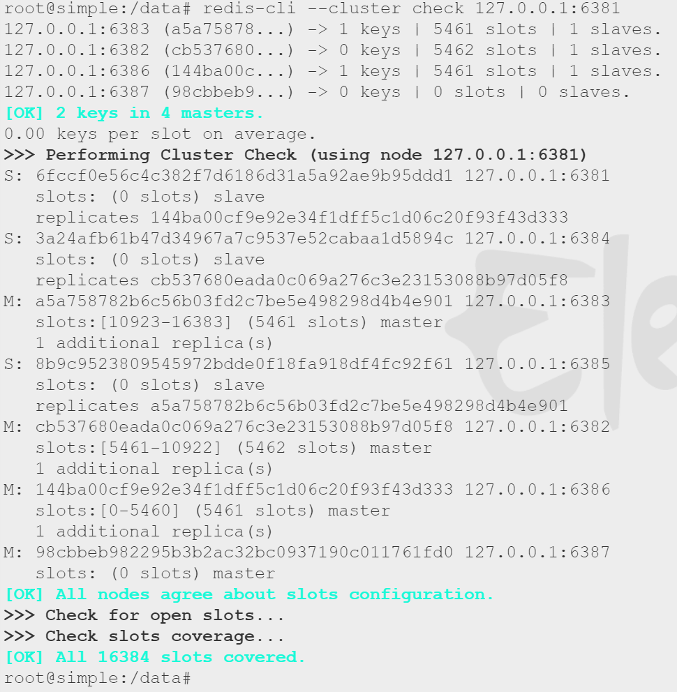

# 基础

## 简介

<div align='center'>
    
    Docker architecture
</div>

### 是什么

为了消除团队协作编码时不同机器环境问题，Docker提供了一个标准化解决方案--系统平滑移植、容器虚拟化技术。

Docker是基于Go语言实现的云开源项目。

Docker的主要目标是“Build，Ship and Run Any App,Anywhere”，也就是通过对应用组件的封装、分发、部署、运行等生命周期的管理，使用户的APP（可以是一个WEB应用或数据库应用等等）及其运行环境能够做到“一次镜像，处处运行”。

Linux容器技术的出现就解决了这样一个问题，而 Docker 就是在它的基础上发展过来的。将应用打成镜像，通过镜像成为运行在Docker容器上面的实例，而 Docker容器在任何操作系统上都是一致的，这就实现了跨平台、跨服务器。只需要一次配置好环境，换到别的机子上就可以一键部署好，大大简化了操作。

一句话总结就是：**Docker解决了运行环境和配置问题的软件容器，方便做持续集成并有助于整体发布的容器虚拟化技术**

### 容器与虚拟机比较

**虚拟机（virtual machine）**就是带环境安装的一种解决方案。

缺点：资源占用多、冗余步骤多、启动慢

**Linux容器(Linux Containers， LXC)**

Linux容器是与系统其他部分隔离开的一系列进程，从另一个镜像运行，并由该镜像提供支持进程所需的全部文件。容器提供的镜像包含了应用的所有依赖项，因而在从开发到测试再到生产的整个过程中，它都具有可移植性和一致性。

Linux 容器不是模拟一个完整的操作系统而是对进程进行隔离。有了容器，就可以将软件运行所需的所有资源打包到一个隔离的容器中。容器与虚拟机不同，不需要捆绑一整套操作系统，只需要软件工作所需的库资源和设置。系统因此而变得高效轻量并保证部署在任何环境中的软件都能始终如一地运行。

**Docker**容器是在操作系统层面上实现虚拟化，直接复用本地主机的操作系统，传统的虚拟机则是在硬件层面实现虚拟化。

优点：启动快、占用资源少。

#### Docker与传统虚拟化不同之处

- 传统虚拟机技术是虚拟出一套硬件后，在其上运行一个完整操作系统，在该系统上再运行所需应用进程
- 容器内的应用进程直接运行于宿主的内核，容器内没有自己的内核且也没有进行硬件虚拟。因此容器要比传统虚拟机更为轻便。
- 每个容器之间互相隔离，每个容器有自己的文件系统 ，容器之间进程不会相互影响，能区分计算资源。

|            | Docker容器             | 虚拟机（VM）            |
| ---------- | ---------------------- | ----------------------- |
| 操作系统   | 与宿主机共享OS         | 宿主机OS上运行虚拟机OS  |
| 存储空间   | 镜像下，便于存储与传输 | 镜像庞大（vdmk、vdi等） |
| 运行性能   | 几乎无额外性能损失     | 有额外消耗              |
| 移植性     | 轻便、灵活             | 与虚拟化技术耦合程度高  |
| 硬件亲和性 | 面向软件开发者         | 面向硬件运维者          |
| 部署速度   | 快速                   | 较慢                    |


### 能干嘛

一次构建、随处运行：

- 更快速的应用交付和部署
- 更便捷的升级和扩/缩容
- 更简单的系统运维
- 更高效的计算资源利用

### 去哪下

docker官网：http://www.docker.com

Docker 仓库官网: https://hub.docker.com/

## Docker安装

### 基本组成

- 镜像（image）
	- 只读的模板，用来创建容器，一个镜像可创建很多容器。
- 容器（container）
	- 使用image创建的运行实例
	- 可以看做是一个简易版的Linux环境（包括root用户权限、进程空间、用户空间和网络空间等）和运行在其中的应用程序
- 仓库（repository）
	- 集中存放镜像文件的场所
	- 公开/私有
	- Docker Hub、阿里云、网易云

### 安装

1. Centos7以上

2. yum安装gcc相关

   1. yum -y install gcc
   2. yum -y install gcc-c++

3. 安装所需要的软件包

   1. [官网需求](https://docs.docker.com/desktop/linux/install/)
   2. 执行命令 yum install -y yum-utils

4. 设置stable镜像仓库

   1. 推荐

      1. ```shell
         yum-config-manager --add-repo http://mirrors.aliyun.com/docker-ce/linux/centos/docker-ce.repo
         ```

5. 更新yum软件包索引

   1. ```shell
      yum makecache fast
      ```

6. 安装docker ce

   1. ```shell
      yum -y install docker-ce docker-ce-cli containerd.io
      ```

7. 启动docker

   1. ```shell
      systemctl start docker
      ```

8. 测试

   1. ```shell
      docker version
      docker run hello-world
      ```

9. 卸载

   1. ```shell
      systemctl stop docker
      yum remove docker-ce docker-ce-cli containerd.io
      rm -rf /var/lib/docker
      rm -rf /var/lib/containerd
      ```

### 阿里云镜像加速

阿里云个人账号下有一个专属的加速器地址

https://cr.console.aliyun.com/cn-hangzhou/instances/mirrors

### Hello World

#### docker run hello-world干了什么？

<div align='center'>
    
</div>

### 为什么比虚拟机块

1. 有着比虚拟机更少的抽象层
2. 直接利用宿主机内核，无需加载新的操作系统/内核

## 常用命令

### 帮助启动类命令

```shell
#启动
systemctl start docker
#停止
systemctl stop docker
#重启
systemctl restart docker
#查看状态
systemctl status docker
#开机启动
systemctl enable docker
#查看该要信息
docker info
#查看帮助文档
docker --help
#查看具体命令帮助
docker cmd --help
```

### 镜像命令

```shell
#列出本地主机上的镜像 
#options 
## -a 列出本地所有镜像（含历史）
## -q 只显示镜像ID
docker images

#查找某个镜像
#options
## --limit 只列出N个镜像，默认25个
docker serach imageName

#拉取镜像 TAG（版本）
docker pull imageName[:TAG]

#查看镜像/容器/数据卷所占的空间
docker system df

#删除镜像
#options
##docker rmi -f imageID 删除单个
##docker rmi -f imageName1:TAG imageName2:TAG 删除多个
##docker rmi -f $(docker images -qa)
docker rmi imageID
```

#### docker虚悬镜像是什么？

仓库名、标签都是<none>的镜像，也称虚悬镜像（dangling image）

## 容器命令

### 常用

有镜像才能创建容器（前提）

```shell
#新建+启动容器
## options
### --name="imageNewName" 为容器指定名称
### -d 后台运行并返回容器ID（启动守护式容器）
### -i 以交互模式运行容器，通常与-t同时使用
### -t 为容器重新分配一个伪输入终端，通常与-i同时使用（交互式容器，前台有伪终端，等待交互）
### -P 随机端口映射
### -p 指定端口映射 hostPort:containerPort
### -p ip:hostPort:containerPort
### -p ip::containerPort 随机分配端口
### -p hostPort:containerPort:udp 根据端口和协议指定宿主机端口
### -p port1:port0 --p port11:port00 指定范围端口
docker run [options] image [cmd] [args]
docker run -it ubuntu /bin/bash

#列出当前所有正在运行的容器
## options
### -a 列出当前所有正在运行的容器+历史上运行过的
### -l 显示最近创建的容器
### -n x 显示最近x个创建的容器
### -q 静默模式，只显示容器编号
docker ps [options]
#退出容器
exit #exit退出 容器停止
ctrl+p+q #退出 容器不停止
#启动已停止运行的容器
docker start containerID/containerName
#重启容器
docker restart containerID/containerName
#停止容器
docker stop containerID/containerName
#强制停止容器
docker kill containerID/containerName
#删除已停止的容器
docker rm containerID
##一次性删除多个容器实例
docker rm -f $(docker ps -a -q)
docker ps -a -q | xargs docker rm
```

### 启动守护式容器（后台服务器）

大部分场景下，希望docker的服务是后台运行的

有些容器使用-d是不行的（比如ubuntu），Docker容器后台运行，就必须有一个前台进程。容器运行的命令如果不是那些一直挂起的命令（top，tail），就会自动退出。最佳解决方案是，==将要运行的程序以前台进程的形式运行，常见的就是命令行模式==

```shell
docker run -d containerName
```

### 查看容器日志

```shell
docker logs containerID
```

### 查看容器内部细节

```
docker inspect containerID
```

### 进入正在运行的容器进行交互

```shell
docker exec -it containerId bashShell

#重新进入
docker attach containerID

#区别
##attach 直接进入容器启动命令的终端，不会启动新的进程 用exit退出会导致容器的停止
##exec是在容器中打开新的终端，并且可以启动新的进程，用exit退出不会导致容器的停止
#推荐使用 docker exec
```

一般先试用-d进入后台，然后使用exec重新进入应用干活。

### 从容器内拷贝文件到主机

```shell
docker cp containerID:容器内路径 目标主机路径
```

### 导入和导出容器

export 导出容器的内容流作为一个tar归档文件

import 从tar包中的内容创建一个新的文件系统再导入为镜像

```shell
docker export containerID > fileName.tar
cat fileName.tar | docker import - imageUser/imageName:TAG
```

## Docker镜像

### 镜像

是一种轻量级、可执行的独立软件包，它包含运行某个软件所需要的所有内容。把应用程序和配置依赖打包好行成一个可交付的运行环境（包括代码、运行时所需要的库、环境变量和配置文件等），这个打包好的运行环境就是image镜像文件。

只有通过镜像文件才能生成Docker容器实例。

### UnionFS（联合文件系统）

是一种分层、轻量级并且高性能的文件系统，==支持对文件系统的修改作为一次提交来一层层的叠加==，同时可以将不同目录挂载到同一个虚拟文件系统下（unite several directories into a single virtual filesystem）。Union文件系统是Docker镜像的基础。==镜像可以通过分层来进行继承==，基于基础镜像（没有父镜像），可以制作各种具体到应用的镜像。

特性：一次同时加载多个文件系统，但从外面看来，只能看到一个文件系统，联合加载会把各层文件系统叠加起来，这样最终的文件系统会包含所有底层的文件和目录。

### Docker镜像加载原理

docker镜像是由多层文件系统（UnionFS）组成。最底层是引导文件系统bootfs。

bootfs（boot file system），主要包含bootloader和kernel，bootloader主要是引导加载kernel，Linux刚启动时会加载bootfs文件系统。这一层与典型Linux/Unix系统一致。

rootfs（root file system），在bootfs之上（Linux中/dev、/bin、/etc等目录和文件）相当于Linux不同发行版（Ubuntu、Centos等）。

在docker中，对于一个精简的OS，rootfs可以很小，只需要包括最进本的命令、工具和程序库就可以了，底层可以直接使用宿主机的kernel。

### 分层的镜像

镜像分层最大的好处就是资源共享，方便复制迁移和复用。

==Docker镜像层是只读的，容器层是可写的。==当容器启动时，一个新的可写层（容器层）会被加载到镜像的顶部，容器层之下的都叫镜像层。

### Docker镜像commit操作案例

docker commit提交容器副本使之成为一个新的镜像

docker commit -m="commit message" -a="author" containerID imageName:[TAG]

```shell
docker commit -m="vim add ok" -a="simple" ffbe511356b9 simple/myubuntu:1.1
```

## 本地镜像发布到阿里云

### 新镜像生成

commit生成、DockerFile创建

### 将本地镜像推送到阿里云

### 将阿里云上的镜像下载到本地

#### 阿里云容器镜像服务

选择个人实例，设置命名空间、仓库名称，创建镜像仓库

```shell
#登陆
docker login --username=15319446196 registry.cn-hangzhou.aliyuncs.com

#拉取镜像
docker pull registry.cn-hangzhou.aliyuncs.com/simple-xjb/simple:[镜像版本号]

#推送镜像
docker login --username=15319446196 registry.cn-hangzhou.aliyuncs.com
docker tag [ImageId] registry.cn-hangzhou.aliyuncs.com/simple-xjb/simple:[镜像版本号]
docker push registry.cn-hangzhou.aliyuncs.com/simple-xjb/simple:[镜像版本号]
```

## 本地镜像发布到私有仓库

Docker Registry是官方提供的工具，可以用于构建私有镜像仓库。-

1. 下载镜像 Docker Registry

   1. docker pull registry

2. 运行私有库，相当于本地有个私有Docker hub

   1.  docker run -d -p 5000:5000 -v /home/simple/myregistry/:/tmp/registry --privileged=true registry

3. 创建新镜像

   1. commit

4. curl验证私服库上有什么镜像

   1. curl -XGET http://127.0.0.1:5000/v2/_catalog

   2. ```shell
      (base) [root@simple ~]# curl -XGET http://127.0.0.1:5000/v2/_catalog
      {"repositories":[]}
      ```

5. 将新镜像修改符合私服规范的Tag

   1. docker tag simple/myubuntu:1.2 127.0.0.1:5000/myubuntu:1.2

   2. ```shell
      (base) [root@simple ~]# docker tag simple/myubuntu:1.2 127.0.0.1:5000/myubuntu:1.2
      (base) [root@simple ~]# docker images
      REPOSITORY                TAG       IMAGE ID       CREATED         SIZE
      simple/myubuntu           1.2       d8fc33d70575   6 minutes ago   110MB
      127.0.0.1:5000/myubuntu   1.2       d8fc33d70575   6 minutes ago   110MB
      tomcat                    latest    fb5657adc892   4 months ago    680MB
      registry                  latest    b8604a3fe854   6 months ago    26.2MB
      ubuntu                    latest    ba6acccedd29   7 months ago    72.8MB
      hello-world               latest    feb5d9fea6a5   7 months ago    13.3kB
      centos                    latest    5d0da3dc9764   8 months ago    231MB
      redis                     6.0.8     16ecd2772934   18 months ago   104MB
      ```

6. 修改配置文件使支持http

   1. 修改配置文件 vi /etc/docker/daemon.json

   2. ```json
      {
        "registry-mirrors": ["https://zufhy2tk.mirror.aliyuncs.com"],
        "insecure-registries":["127.0.0.1:5000"]
      }
      ```

7. push推送到私服库

   1. ```shell
      docker push 127.0.0.1:5000/myubuntu:1.2
      ```

8. curl再次验证私服库上有什么镜像

   1. ```shell
      (base) [root@simple ~]# curl -XGET http://127.0.0.1:5000/v2/_catalog
      {"repositories":["myubuntu"]}
      ```

9. 

   1. ```shell
      docker pull 127.0.0.1:5000/myubuntu:1.2
      ```

## Docker容器数据卷

### 简介

docker挂载主机目录访问如果出现cannot open directory.:Permission denied

解决方法：在挂载目录后加上 --privileged=true。

CentOS安全模块问题，加上该参数扩大容器的权限，是container内的root拥有真正的root权限。

卷就是目录或文件，存在于一个或多个容器中，由docker挂载到容器，但不属于联合文件系统，因此能够绕过UnionFS提供的一些用于持续存储或共享数据的特性。

卷的设计目的就是==数据的持久化==，完全独立于容器的生存周期，因此Docker不会在容器删除时删除其挂载的数据卷。

**运行一个带有容器卷的容器实例：**

```shell
docker run it --privileged=true -v /hostAbsDir:/containerDir imageName
```

**特点：**

1. 数据卷可以在容器之间共享或重用数据 
2. 卷中更改可直接实时生效
3. 数据卷中的更改不会包含在镜像的更新中
4. 数据卷的生命周期可持续到没有容器使用为止

### 案例

#### 卷的读写规则

```shell
#默认rw权限
docker run -it --privileged=true -v /home/simple/ubuntu01_data:/tmp/docker_data --name=u1 ubuntu

docker run -it --privileged=true -v /home/simple/ubuntu01_data:/tmp/docker_data:rw --name=u1 ubuntu

#只读
docker run -it --privileged=true -v /home/simple/ubuntu01_data:/tmp/docker_data:ro --name=u1 ubuntu


```

#### 卷的继承和共享

```shell
#volumes-from
docker run -it --privileged=true --volumes-from u1 --name=u2 ubuntu
```

## Docker常规安装简介

### 总体步骤

1. 搜索镜像
2. 拉取镜像
3. 查看镜像
4. 启动镜像
   1. 端口映射
   2. 设置容器卷
5. 停止容器
6. 移除容器

### 安装Tomcat

```
docker search tomcat
docker pull tomcat
docker run -it -p 8080:8080 tomcat
```

访问首页404，是因为webapps目录为空

```shell
#将/usr/local/tomcat目录前 webapps.dist 改为 webapps即可
rm -r webapps
mv webapps.dist webapps
```

### 安装MySQL

```shell
#简单版 当容器被删除后，数据也被删除
docker search mysql
docker run -p host_port:container_port -e MYSQL_ROOT_PASSWORD=123456 -d mysql:5.7
```

```shell
#进阶版 将数据库数据挂载到宿主机上
docker run -d -p host_port:container_port --privileged=true -v /home/simple/mysql5.7/log:/var/log/mysql -v /home/simple/mysql5.7/data:/var/lib/mysql -v /home/simple/mysql5.7/conf:/etc/mysql/conf.d -e MYSQL_ROOT_PASSWORD=123456 --name mysql5.7 mysql:5.7
```

### 安装Redis

```shell
#入门版 容器被删除数据也会被删除
docker pull redis:6.0.8
docker run -d -p host_port:container_port redis:6.0.8
```

```shell
#进阶版
#安装与入门版一致
#加容器卷 将配置文件复制到容器卷目录下
docker run -d -p 63790:6379 --name=redis6.0.8 --privileged=true -v /home/simple/redis6.0.8/redis.conf:/etc/redis/redis.conf -v /home/simple/redis6.0.8/data:/data redis:6.0.8 redis-server /etc/redis/redis.conf
```

# 进阶

## Docker复杂安装

### 安装mysql主从复制

#### 主从复制原理

#### 主从搭建

1. 新建主服务器容器实例 3307

2. 进入/mydata/mysql-master/conf目录下新建my.cnf

   1. ```conf
      [mysqld]
      ## 设置server_id，同一个局域网需要唯一
      server_id=101
      ## 指定不需要同步的数据库名称
      binlog-ignore-db=mysql
      ## 开启二进制日志功能
      log-bin=mall-mysql-bin
      ## 设置二进制日志使用内存大小（事务）
      binlog_cache_size=1M
      ## 设置使用二进制日志格式（mixed,statement,row）
      binlog_format=mixed
      ## 二进制日志过期清理时间。默认为0，表示不自动清理
      expire_logs_days=7
      ## 跳过主从复制中遇到的所有错误或指定类型的错误，避免slave端复制中断
      ## 如L:1062错误是指一些主键重复，1032错误是因为主从数据库数据不一致
      slave_skip_errors=1062
      ```

3. 修改完配置后重启master容器

4. 进入mysql-master容器

5. master容器内创建数据同步用户

   1. ```shell
      #创建用户并授权
      create user 'slave'@'%' identified by '123456';
      grant replication slave, replication client on *.* to 'slave'@'%';
      ```

6. 新建从服务器3308

7. 进入/mydata/mysql-slave/conf目录下新建my.cnf

   1. ```conf
      [mysqld]
      ## 设置server_id，同一个局域网需要唯一
      server_id=102
      ## 指定不需要同步的数据库名称
      binlog-ignore-db=mysql
      ## 开启二进制日志功能，以备slave作为其他数据库实例的master时使用
      log-bin=mall-mysql-slave1-bin
      ## 设置二进制日志使用内存大小（事务）
      binlog_cache_size=1M
      ## 设置使用二进制日志格式（mixed,statement,row）
      binlog_format=mixed
      ## 二进制日志过期清理时间。默认为0，表示不自动清理
      expire_logs_days=7
      ## 跳过主从复制中遇到的所有错误或指定类型的错误，避免slave端复制中断
      ## 如L:1062错误是指一些主键重复，1032错误是因为主从数据库数据不一致
      slave_skip_errors=1062
      ## relay_log 配置中继日志
      relay_log=mall-mysql-relay-bin
      ##log_slave_updates 表示slave将复制事件写入自己的二进制日志
      log_slave_updates=1
      ## slave设置为只读（具有super权限的用户除外）
      read_only=1
      ```

8. 重启slave实例

9. 在主数据库中查看主从同步状态

   1. ```
      mysql> show master status;
      +-----------------------+----------+--------------+------------------+-------------------+
      | File                  | Position | Binlog_Do_DB | Binlog_Ignore_DB | Executed_Gtid_Set |
      +-----------------------+----------+--------------+------------------+-------------------+
      | mall-mysql-bin.000001 |      774 |              | mysql            |                   |
      +-----------------------+----------+--------------+------------------+-------------------+
      ```

10. 进入mysql-slave容器

11. 在从数据库中配置主从复制

    1. ```
       change master to master_host='tx.snnukf.tech', master_user='slave', master_password='123456', master_port=3307, master_log_file='mall-mysql-bin.000001', master_log_pos=774, master_connect_retry=30;
       ```

12. 在从数据库中查看主从同步状态

    1. ```
       show slave status \G;
       
       
       mysql> show slave status \G;
       *************************** 1. row ***************************
                      Slave_IO_State:
                         Master_Host: tx.snnukf.tech
                         Master_User: slave
                         Master_Port: 3307
                       Connect_Retry: 30
                     Master_Log_File: mall-mysql-bin.000001
                 Read_Master_Log_Pos: 774
                      Relay_Log_File: mall-mysql-relay-bin.000001
                       Relay_Log_Pos: 4
               Relay_Master_Log_File: mall-mysql-bin.000001
                    Slave_IO_Running: No
                   Slave_SQL_Running: No
       ```

13. 在从数据库中开启主从同步

    1. ```
       start slave;
       ```

14. 查看从数据库同步状态

    1. ```
       mysql> show slave status \G;
       *************************** 1. row ***************************
                      Slave_IO_State: Waiting for master to send event
                         Master_Host: tx.snnukf.tech
                         Master_User: slave
                         Master_Port: 3307
                       Connect_Retry: 30
                     Master_Log_File: mall-mysql-bin.000001
                 Read_Master_Log_Pos: 774
                      Relay_Log_File: mall-mysql-relay-bin.000002
                       Relay_Log_Pos: 325
               Relay_Master_Log_File: mall-mysql-bin.000001
                    Slave_IO_Running: Yes
                   Slave_SQL_Running: Yes
       ```

15. 主从复制测试

    1. 主机新建库-使用库-新建表-插入数据
    2. 从机使用库-查看记录

### 安装redis集群

cluster（集群）模式-docker版 哈希槽分区进行亿级数据存储

#### 面试题

1-2亿条数据需要缓存，如何设计这个存储案例。

一般业界有3种方案：

1. 哈希取余分区（hash(key)）
   1. 优点：实现简单，负载均衡
   2. 缺点：无容灾能力，不能动态扩/缩容
2. 一致性哈希算法分区
   1. 主要作用
      1. 为解决1种的问题，当服务器个数发生变化时，尽量减少影响客户端到服务器的映射关系
      2. 将整个hash空间变为环
   2. 3大步骤
      1. 算法构建一致性hash环（0-((2^32)-1)）
      2. 服务器IP节点映射(节点在环上)
      3. key落到服务器的落键规则（与1类似）
   3. 优点：可扩/缩容，具有一定容灾能力
   4. 缺点：数据倾斜问题（数据分布不够均匀）
3. 哈希槽分区
   1. 主要作用
      1. 解决2种数据不均匀问题
      2. hash槽（slot），[0,(2^14)-1]
      3. 在数据和节点之间又加了一层，用于管理数据和节点间的关系。
      4. 一个集群只能有16384(2^14)个槽。分配策略没有要求，可以指定哪些编号的槽分配给哪个主节点（可人工干预）。slot = CRC16(key)%16384。
   2. 槽位为什么只有16384个
      1. redis集群主节点数量不可能超过1000个
      2. 如果槽位为65536，发送消息的心跳包比较大
      3. 槽位越小（bitmap存储），节点少的情况下，压缩比高，容易传输

#### 3主3从redis集群扩缩容配置案例架构

1. 新建6个docker容器实例

	```shell
	docker run -d --name redis6.0.8-node-6 --network host --privileged=true -v /home/simple/redis6.0.8-cluster/redis6.0.8-node-6:/data 16ecd2772934 --cluster-enabled yes --appendonly yes --port 6386
	```

2. 进入node1并为6台机器构建集群关系

	```shell
	redis-cli --cluster create 127.0.0.1:6381 127.0.0.1:6382 127.0.0.1:6383 127.0.0.1:6384 127.0.0.1:6385 127.0.0.1:6386 --cluster-replicas 1
	
	#--cluster-replicas 1 一主一副
	```

	<div align='center'>
	    
	    
		</br></br>配置结果图
	</div>

3. 进入node1查看集群状态

	<div align='center'>
	    
		</br></br>查看集群信息
	</div>

#### 3主3从Redis主从容错切换迁移案例

**数据读写存储**

1. 启动集群中的redis，并通过exec进入

2. 为防止路由失效加参数-c并新增两个key（不能使用单机版命令，单机版命令有可能出错）

	1. ```shell
		redis-cli -p 6381 -c
		```

3. 查看集群信息
    1. ```shell
        redis-cli --cluster check 127.0.0.1:6381
        ```

    2. <div align='center'>
            
        </div>


**容错切换迁移**

1. 主6381和从机切换，先停止主机6381（停之前6386从属于6381）

2. 查看集群信息（停之后6386变为主）

	<div align='center'>
	    
	</div>

3. 当6381恢复后（6386依然为主，6381为从）

	<div align='center'>
	    
	</div>

#### 主从扩容案例

新加入一主一从。

1. 新建6387、6388两个节点、启动，查看是否启动成功

2. 进入6387内部

3. 将新增的6787节点（空槽号）作为master节点加入原集群

	```shell
	redis-cli --cluster add-node 127.0.0.1:6387 127.0.0.1:6381
	```

	<div align='center'>
	    
	</div>

4. 查看集群信息（新增主节点还没有分配槽位号）

	<div align='center'>
	    
	</div>

5. 重新分配槽号

	```shell
	redis-cli --cluster reshard 127.0.0.1:6381
	```

6. 将6388加入集群并作为6387的从节点

	```shell
	# 98cbbeb982295b3b2ac32bc0937190c011761fd0 主节点id
	redis-cli --cluster add-node 127.0.0.1:6388 127.0.0.1:6387 --cluster-slave --cluster-master-id 98cbbeb982295b3b2ac32bc0937190c011761fd0
	```

	<div align='center'>
	    
	</div>

7. 再次查看集群信息

	<div align='center'>
	    
	</div>

#### 主从缩容案例

1. 将从节点6388删除

	```shell
	redis-cli --cluster del-node 127.0.0.1:6388 c079049ff03ef0c313db405626b7db79d981ddb5
	```

	<div align='center'>
	    
	</div>

2. 查看集群信息

	<div align='center'>
	    
	</div>

3. 重新分配槽号

	```shell
	#对整个集群 槽位进行重新分配
	redis-cli --cluster reshard 127.0.0.1:6381
	```

4. 查看集群信息

	<div align='center'>
	    
	</div>

5. 删除6387主节点

	<div align='center'>
	    
	</div>

6. 查看集群信息

	<div align='center'>
	    
	</div>

## DockerFile解析

### 是什么

用来构建Docker镜像的文本文件，是由一条条构建镜像所需的指令和参数构成的脚本。

构建三步骤：

1. 编写Dockerfile文件
2. docker build构建镜像
3. docker run image

### DockerFile构建过程

#### 基础知识

1. 每条保留字指令都必须为大写字母且后面至少跟随一个参数
2. 指令按照从上到下，顺序执行
3. #表示注释
4. 每条指令都会创建一个新的镜像层并对镜像进行提交

#### Docker执行DockerFile大致流程

1. 从基础镜像运行一个容器
2. 执行一条指令并对容器做出修改
3. 执行类似docker commit的操作提交一个新的镜像层
4. docker再基于刚提交的镜像运行一个新容器
5. 执行dockerfile中的下一条指令知道所有指令都执行完成

#### 总结

从应用软件的角度来看，DockerFile、Docker镜像和Docker容器分别代表软件的三个不同阶段。

1. DockerFile是软件的原材料
2. Docker镜像是软件的交付品
3. Docker容器则可以认为是软件镜像的运行态，即依照镜像运行的容器实例

DockerFile面向开发，Docker镜像成为交付标准，Docker容器则涉及部署与运维。

### 常用保留字指令

[tomcat的dockerfile](https://github.com/docker-library/tomcat)

==FORM==基础镜像，当前新镜像是基于哪个镜像的，指定一个已经存在的镜像作为模板，第一条必须是from。

==MAINTAINER==，镜像维护者的姓名和邮箱地址。

RUN：

1. 容器构建时需要运行的命令
2. 两种格式
	1. shell格式 RUN <命令行命令>
	2. exec格式 RUN ["可执行文件", "参数1", "参数2"]
3. 在docker build时运行

EXPOSE：当前容器对外暴露的端口。

WORKDIR：指定在创建容器后，终端默认登陆的进来工作目录，一个落脚点。

USER：指定该镜像以什么样的用户去执行，如果都不指定，默认是root。

ENV：用来在构建镜像过程中设置环境变量。

- ENV MY_PATH /usr/mytest
	这个环境变量可以在后续的任何RUN指令中使用，这就如同在命令前面指定了环境变量前缀一样；
	也可以在其它指令中直接使用这些环境变量，

	比如：WORKDIR $MY_PATH

ADD：将宿主机目录下的文件拷贝进镜像且会自动处理URL和解压tar压缩包。

COPY：

- 类似ADD，拷贝文件和目录到镜像中。
- 将从构建上下文目录中<源路径>的文件/目录 复制到新的一层镜像没的 <目标路径>位置。
	- COPY src dest
	- COPY ["src", "dest"]
	- <src源路径>:源文件或者源目录
	- <dest目标路径>：容器内的指定路径，该路径不用事先创建好，路径不存在会自动创建。

VOLUME：容器数据卷，用于数据保存和持久化工作。

CMD：

- 指定容器启动后要干的事情
	- shell格式 CMD <命令>
	- exec格式 CMD ["可执行文件", "参数1", "参数2" …]
	- 参数列表格式 CMD ["参数1", "参数1" …]，在指定了ENTRYPOINT指令后，用CMD指定具体的参数
- Dockerfile中可以有多个CMD命令，但只有最后一个生效，CMD会被docker run 之后的参数替换。
- 与RUN区别
	- RUN是在docker build时运行
	- CMD是在docker run时运行

ENTRYPOINT：

- 用来指定一个容器启动时要运行的命令
- 类似CMD，但是不会被docker run后面的命令覆盖，而且这些命令行参数会被当做参数送给ENTRYPOINT指令指定的程序，一般CMD中是变参，可以传递给ENTRYPOINT
- ENTRYPOINT ["<executeable>", "<param1>", "<param2>",  …]
- 在执行docker run的时候可以指定 ENTRYPOINT运行所需要的参数
- 如果dockerfile中存在多个ENTRYPOINT指令，仅最后一个生效

总结：

<div align='center'>
    
</div>

### 案例

#### 自定义centos+java9镜像

1. 要求

	1. Centos7镜像具备 vim+ifconfig+jdk8
	2. [jdk下载地址](https://jdk.java.net/archive/)

2. 编写dockerfile文件

	```dockerfile
	#java8
	FROM centos:7
	MAINTAINER simple<jb.xue@qq.com>
	
	ENV MYPATH /usr/local
	WORKDIR $MYPATH
	
	#安装vim
	RUN yum -y install vim
	#安装net-tools
	RUN yum -y install net-tools
	#安装java8的lib库
	RUN yum -y install glibc.i686
	RUN mkdir /usr/local/java
	#ADD 是相对路径jar 把 jdk压缩包添加到容器中，安装包必须要和Dockerfile文件放在同一位置
	ADD jdk-8u311-linux-x64.tar.gz /usr/local/java/
	#配置java环境变量
	ENV JAVA_HOME /usr/local/java/jdk1.8.0_311
	
	ENV JRE_HOME $JAVA_HOME/jre
	ENV CLASSPATH $JAVA_HOME/lib/dt.jar:$JAVA_HOME/lib/tools.jar:$JRE_HOME/lib:$CLASSPATH
	ENV PATH $JAVA_HOME/bin:$PATH
	
	EXPOSE 80
	
	CMD echo $MYPATH
	CMD echo "success ---------------- ok"
	CMD /bin/bash
	```

	```dockerfile
	#java9
	FROM centos:7
	MAINTAINER simple<jb.xue@qq.com>
	
	ENV MYPATH /usr/local
	WORKDIR $MYPATH
	
	#安装vim
	RUN yum -y install vim
	#安装net-tools
	RUN yum -y install net-tools
	#安装java的lib库 这里不确定java9是否需要
	RUN yum -y install glibc.i686
	RUN mkdir /usr/local/java
	#ADD 是相对路径jar 把 jdk压缩包添加到容器中，安装包必须要和Dockerfile文件放在同一位置
	ADD openjdk-9_linux-x64_bin.tar.gz /usr/local/java/
	#配置java环境变量
	ENV JAVA_HOME /usr/local/java/jdk-9
	
	ENV CLASSPATH $JAVA_HOME/lib/jrt-fs.jar:$CLASSPATH
	ENV PATH $JAVA_HOME/bin:$PATH
	
	EXPOSE 80
	
	CMD echo $MYPATH
	CMD echo "success ---------------- ok"
	CMD /bin/bash
	```

	```dockerfile
	#java11 使用yum安装不用配环境变量
	FROM centos:7
	MAINTAINER simple<jb.xue@qq.com>
	
	ENV MYPATH /usr/local
	WORKDIR $MYPATH
	
	#安装vim
	RUN yum -y install vim
	#安装net-tools
	RUN yum -y install net-tools
	#安装java11的lib库 没必要后面安装还会再将这些库安装一遍
	# RUN yum -y install java-11-openjdk-static-libs.x86_64
	
	#安装java11
	RUN yum -y install java-11-openjdk-devel.x86_64
	
	EXPOSE 80
	
	CMD echo $MYPATH
	CMD echo "success ---------------- ok"
	CMD /bin/bash
	```

	

3. 构建

	```shell
	#docker build -t newImageName:TAG .
	docker build -t centosjava9:1.0 .
	```

4. 运行

	```shell
	docker run -it imageID /bin/bash
	```

#### 虚悬镜像

仓库名、标签都是<none>的镜像，也称为dangling image。

一般是build出现错误等原因会出现。

查看虚悬镜像：

- ```shell
	docker images ls -f dangling=true
	```

删除虚悬镜像：

- ```shell
	docker image prune
	```

### 总结

<div align='center'>
    
</div>

## Docker微服务实战

通过dockerfile发布微服务部署到docker容器。

1. IDEA中创建项目并打包好jar包。

2. 编写Dockerfile，并将jar包和Dockerfile放入同一个目录下。

	```dockerfile
	# 基础镜像使用java
	FROM java:8
	# 作者
	MAINTAINER simple<jb.xue@qq.com>
	# VOLUME 指定临时文件目录为/tmp，在主机/var/lib/docker目录下创建了一个临时文件并链接到容器的/tmp
	VOLUME /tmp
	# 将jar包添加到容器中
	ADD docker_boot-1.0.jar docker_boot-1.0.jar
	# 运行jar包
	RUN bash -c 'touch /docker_boot-1.0.jar.jar'
	ENTRYPOINT ["java","-jar","/docker_boot-1.0.jar"]
	#暴露10022端口作为微服务
	EXPOSE 10022
	```

3. 构建镜像

	```shell
	docker build -t docker_boot:1.0 .
	```

4. 运行容器

	```shell
	docker run -d -p 10022:10022 docker_boot:1.0 --name docker-boot
	```

5. 访问测试

	<div align='center'>
	    
	</div>

## Docker网络

容器间的互联和通信以及端口映射。


<div align='center'>
    
    <br/><br/>安装docker后会创建的网络
</div>
### 常用命令

<div align='center'>
    
    <br/><br/>--help查看所有命令
</div>

1. 查看网络

	```
	docker network ls
	```

2. 查看网络源数据

	```
	docker network inspect networkName
	```

3. 删除网络

	```scala
	docker network rm networkName
	```

### 网络模式


| 网络模式  | 简介                                                         | 使用                |
| --------- | ------------------------------------------------------------ | ------------------- |
| bridge    | 为每个容器分配、设置IP等，并将容器连接到一个docker0的虚拟网桥，默认为该模式 | --network bridge    |
| host      | 容器直接使用宿主机的IP和端口                                 | --network host      |
| none      | 容器有独立的Network namespace，但并没有对其进行任何网络设置（相当于只有回环地址） | --network none      |
| container | 和一个指定的容器共享IP、端口范围等（两个容器除了网络其他的还是隔离的，并且被共享的那个如果被删除了，后面那个就不能正常使用了） | --network container |
| 自定义网络| 新建一个自定义网络，然后该网络内的容器都可以互相通信，并且自定义网络本身就维护好了主机名和IP的对应关系（网络内的容器可以通过主机名或者IP相互ping通） | docker network create networkName |

### Docker整体架构

<div align='center'>
    
    <br/><br/>Docker整体架构
</div>

## Docker-compose容器编排

Docker官方的开源项目，负责对Docker容器集群的快速编排。

Compose允许用户通过一个单独的docker-compose.yml模板文件（YAML 格式）来定义一组相关联的应用容器为一个项目（project）。

可以很容易地用一个配置文件定义一个多容器的应用，然后使用一条指令安装这个应用的所有依赖，完成构建。Docker-Compose 解决了容器与容器之间如何管理编排的问题。

[官网](https://docs.docker.com/compose/install/)

[下载](https://github.com/docker/compose/releases/)

```shell
#安装
curl -L "https://github.com/docker/compose/releases/download/1.29.2/docker-compose-$(uname -s)-$(uname -m)" -o /usr/local/bin/docker-compose
chmod +x /usr/local/bin/docker-compose
docker-compose --version

#卸载 直接删除就好
```

### 核心概念

1. 一个文件 docker-compose.yml
2. 两要素
	1. 服务 一个应用容器实例对应一个服务
	2. 工程 由一组服务（容器）构成，在docker-compose.yml文件中定义。

### 如何使用

1. 编写Dockerfile定义各个微服务应用并构建出响应的镜像文件
2. 使用docker-compose.yml定义一个完整业务单元，安排好整体应用中的各个容器服务
3. 执行docker-compose up命令启动并运行整个应用程序，完成一键部署上线

### 常用命令

```shell
Compose常用命令
docker-compose -h                           # 查看帮助
docker-compose up                           # 启动所有docker-compose服务
docker-compose up -d                        # 启动所有docker-compose服务并后台运行
docker-compose down                         # 停止并删除容器、网络、卷、镜像。
docker-compose exec  yml里面的服务id                 # 进入容器实例内部  docker-compose exec docker-compose.yml文件中写的服务id /bin/bash
docker-compose ps                      # 展示当前docker-compose编排过的运行的所有容器
docker-compose top                     # 展示当前docker-compose编排过的容器进程
 
docker-compose logs  yml里面的服务id     # 查看容器输出日志
docker-compose config     # 检查配置
docker-compose config -q  # 检查配置，有问题才有输出
docker-compose restart   # 重启服务
docker-compose start     # 启动服务
docker-compose stop      # 停止服务
```

### Compose编排微服务案例

