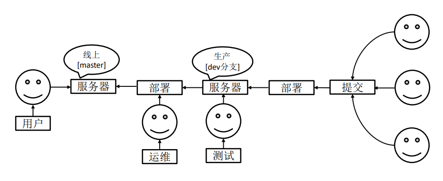

# 概述

Git是一个免费、开源的**分布式版本控制系统**。

## 什么是版本控制

版本控制是一种记录文件内容变化，以便将来查阅特定版本修订情况的系统。 

版本控制其实最重要的是可以记录文件修改历史记录，从而让用户能够查看历史版本， 方便版本切换。

## Git工作机制

<div align='center'>
    
	<br/><br/>git工作机制
</div>

## Git和代码托管中心

代码托管中心是基于网络服务器的远程代码仓库，一般简称为远程库。

- 私有/个人
	- GitLab
	- gogs
- 公共
	- GitHub
	- Gitee（码云）

# Git使用

## 常用命令

| 命令名称                                 | 作用           |
| ---------------------------------------- | -------------- |
| git config --global user.name username   | 设置用户签名   |
| git config --global user.email useremail | 设置用户签名   |
| git init                                 | 初始化本地库   |
| git status                               | 查看本地库状态 |
| git add filename                         | 添加到暂存区   |
| git commit -m 'message' [filename]       | 提交到本地库   |
| git reflog                               | 查看历史记录   |
| git reset --hard versionNum              | 切换版本       |

## 分支操作

<div align='center'>
    
</div>

### 为什么使用分支

同时推进多个功能开发，提高开发效率。

如果某个分支开发失败，不会影响其他分支。

### 常用分支操作

| 命令名称            | 作用                         |
| ------------------- | ---------------------------- |
| git branch 分支名   | 创建分支                     |
| git branch -v       | 查看分支                     |
| git checkout 分支名 | 切换分支                     |
| git merge 分支名    | 把指定的分支合并到当前分支上 |

### 团队协作

<div align='center'>
    
</div>
### 跨团队协作

<div align='center'>
    
</div>


## 代码统计

### 统计每个人在指定时间内的代码量

```bash
$ git log --format='%aN' | sort -u | while read name; do echo -en "$name\t"; git log --author="$name" --pretty=tformat: --since ==2021–10-01 --until=2021-10-30 --numstat | awk '{ add += $1; subs += $2; loc += $1 - $2 } END { printf "added lines: %s, removed lines: %s, total lines: %s\n", add, subs, loc }' -; done
```

### 统计某段时间内所有人的代码量

```bash
$ git log --format='%aN' | sort -u | while read name; do echo -en "$name\t"; git log --author="$name" --pretty=tformat: --since ==2021–10-01 --until=2021-10-30 --numstat | awk '{ add += $1; subs += $2; loc += $1 - $2 } END { printf "added lines: %s, removed lines: %s, total lines: %s\n", add, subs, loc }' -; done
```

### 查看排名前N的提交者

```bash
$ git log --pretty='%aN' | sort | uniq -c | sort -k1 -n -r | head -n N
```

### git log参数说明

```bash
--author   指定作者
--stat   显示每次更新的文件修改统计信息，会列出具体文件列表
--shortstat    统计每个commit 的文件修改行数，包括增加，删除，但不列出文件列表：  
--numstat   统计每个commit 的文件修改行数，包括增加，删除，并列出文件列表：
   
-p 选项展开显示每次提交的内容差异，用-2 则仅显示最近的两次更新,例如：git log -p  -2
--name-only 仅在提交信息后显示已修改的文件清单
--name-status 显示新增、修改、删除的文件清单
--abbrev-commit 仅显示 SHA-1 的前几个字符，而非所有的 40 个字符
--relative-date 使用较短的相对时间显示（比如，“2 weeks ago”）
--graph 显示 ASCII 图形表示的分支合并历史
--pretty 使用其他格式显示历史提交信息。可用的选项包括 oneline，short，full，fuller 和 format（后跟指定格式）,例如： git log --pretty=oneline ; git log --pretty=short ; git log --pretty=full ; git log --pretty=fuller
--pretty=tformat:   可以定制要显示的记录格式，这样的输出便于后期编程提取分析
       例如：git log --pretty=format:""%h - %an, %ar : %s""
       下面列出了常用的格式占位符写法及其代表的意义。                   
       选项       说明                  
       %H      提交对象（commit）的完整哈希字串               
       %h      提交对象的简短哈希字串               
       %T      树对象（tree）的完整哈希字串                   
       %t      树对象的简短哈希字串                    
       %P      父对象（parent）的完整哈希字串               
       %p      父对象的简短哈希字串                   
       %an     作者（author）的名字              
       %ae     作者的电子邮件地址                
       %ad     作者修订日期（可以用 -date= 选项定制格式）                   
       %ar     作者修订日期，按多久以前的方式显示                    
       %cn     提交者(committer)的名字                
       %ce     提交者的电子邮件地址                    
       %cd     提交日期                
       %cr     提交日期，按多久以前的方式显示              
       %s      提交说明  
       
--since  限制显示输出的范围，
       例如： git log --since=2.weeks    显示最近两周的提交
       选项 说明                
       -(n)    仅显示最近的 n 条提交                    
       --since, --after 仅显示指定时间之后的提交。                    
       --until, --before 仅显示指定时间之前的提交。                  
       --author 仅显示指定作者相关的提交。                
       --committer 仅显示指定提交者相关的提交。
```

## 修改commit信息

### 修改最近一次commit

刚刚commit还没push或者刚刚push都适用。

```bash
#1.查看提交日志
git log
#2.修改最后一次commit信息
git commit --amend
#3.查看log，commit信息已经修改好了
git log
#4.如果该commit已经提交到了远程库
git push --force origin master
```

### 修改历史commit信息

```bash
#1.使用 git rebase -i HEAD~n，进入编辑界面。其中的n为记录数
git rebase -i HEAD~10
#2.找到你要修改的那条记录，然后将行开头的‘pick’替换成‘edit’，输入:wq保存并退出。
#3.查看git log，要修改的那条记录，已经变成最新的提交记录了。
git log
#4.修改最后一次提交的commit信息。
git commit --amend
#5.查看git log，commit信息已经改好了。
git log
#6.结束rebase
git rebase --continue
#7.查看git log，commit信息的顺序也恢复了。
git log
#8.提交到远程库。
```


# Reference

1. [Git代码统计](https://blog.csdn.net/cherish1112365/article/details/122749576)
1. [git修改commit信息](https://blog.csdn.net/qq_29518275/article/details/119787728)