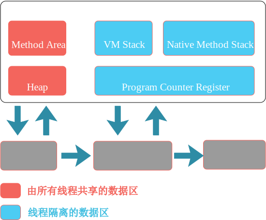
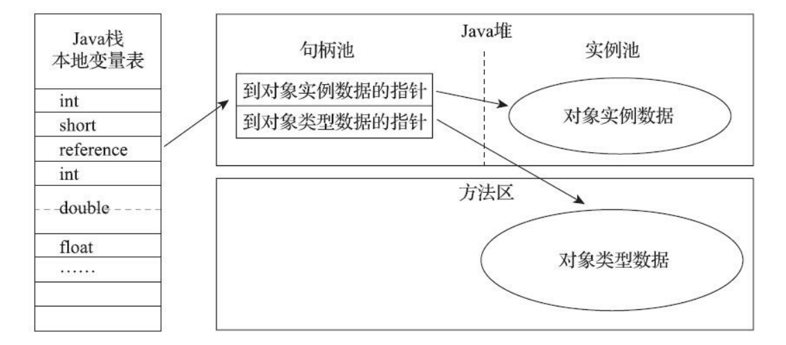
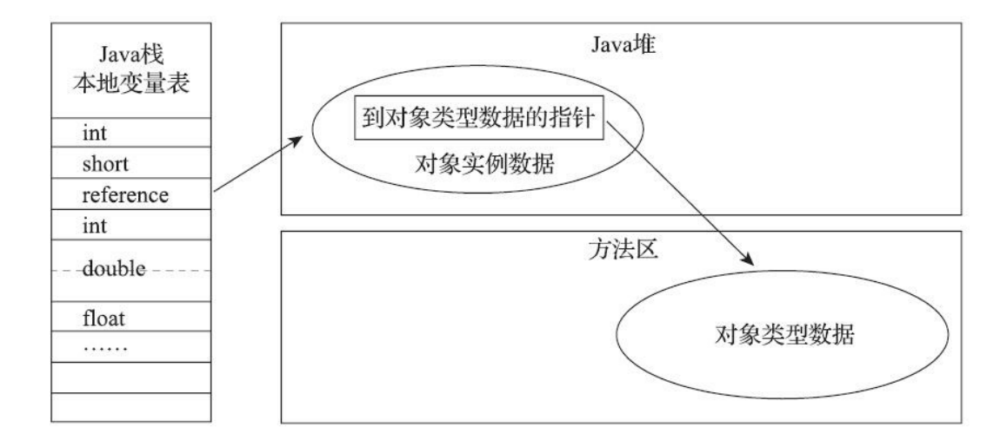
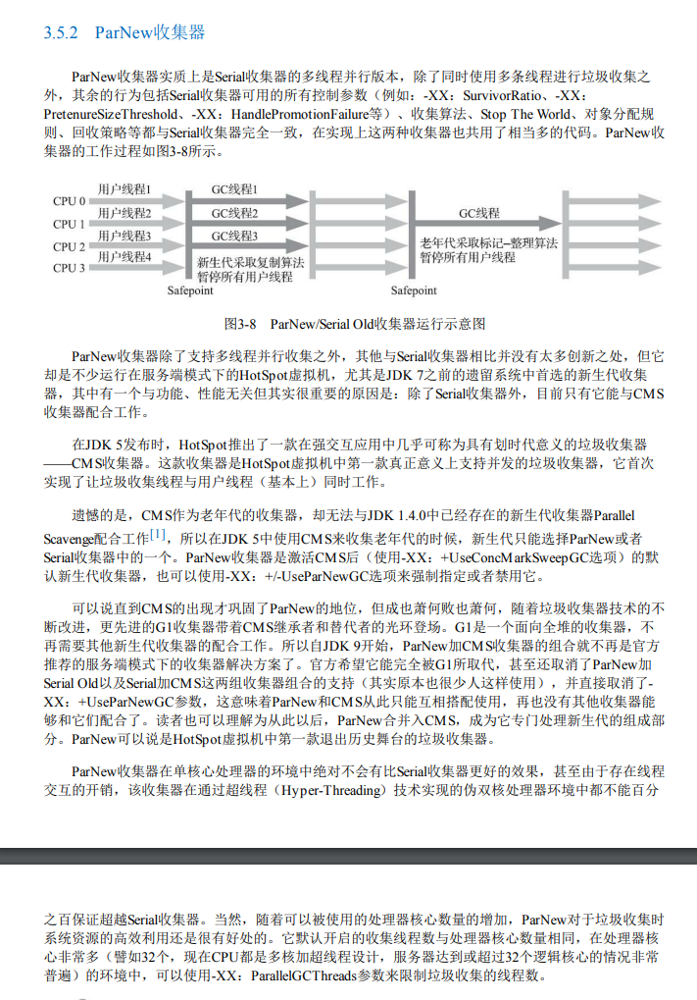
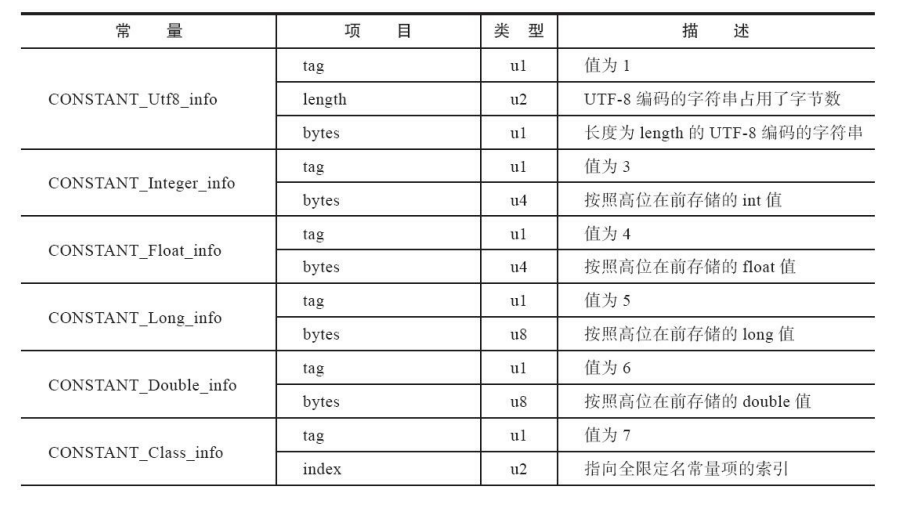
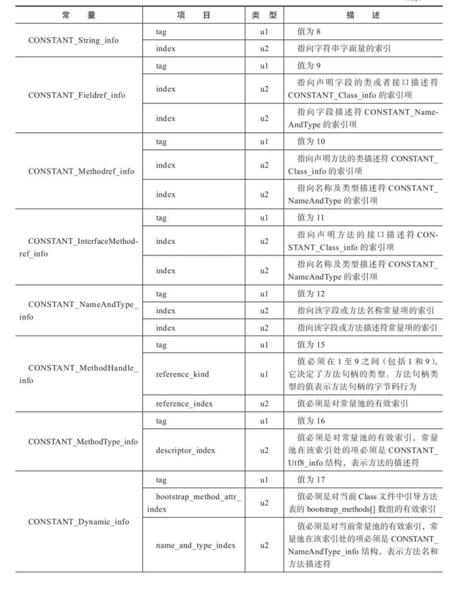
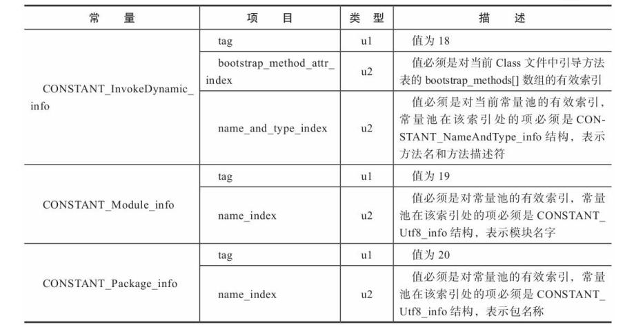
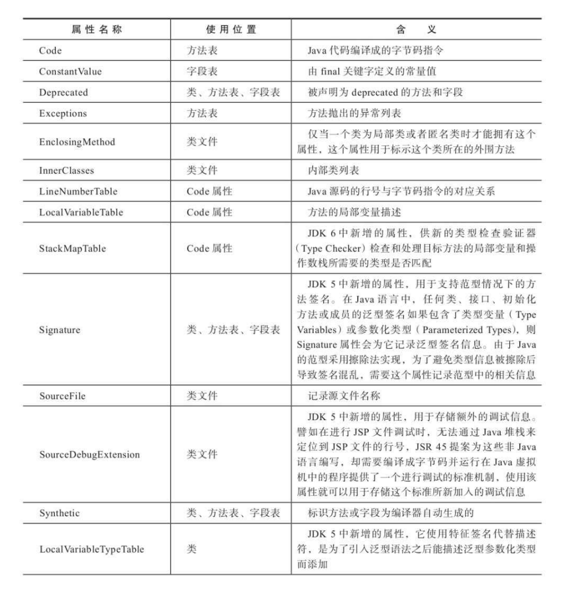
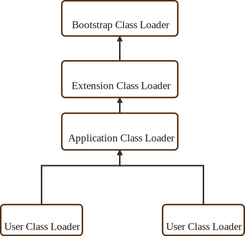
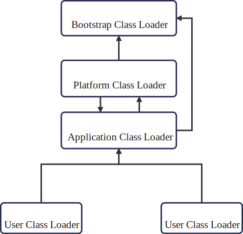

# JVM

## References

[1]	（日） 中村成洋著.深入Java虚拟机 JVM G1GC的算法与实现[M].北京：人民邮电出版社.2021.
[2] 	周志明著.深入理解Java虚拟机[M].北京：机械工业出版社.2019.
[3] 	华保健著.深入浅出 Java虚拟机设计与实现[M].北京：机械工业出版社.2020.
[4] 	周志明著.深入理解Java虚拟机 JVM高级特性与最佳实践[M].北京：机械工业出版社.2013.

## JAVA内存区域

### 运行时数据区

<div align='center'>
    
    </br></br>Java虚拟机运行时数据区
</div>

#### 程序计数器

当前线程所执行的字节码行号指示器（线程私有）。

如果正在执行的是一个Java方法，则记录的是正在执行的虚拟机字节码指令的地址；如果执行的是本地方法（Native），则这个计数器的值为空（Undefinde）。并且程序计数器内存区域是唯一一个在《Java虚拟机规范》中没有规定任何OutOfMemoryError情况的区域。

#### Java虚拟机栈

线程私有，生命周期与线程相同。虚拟机栈描述的是Java方法执行的线程内存模型：每个方法被执行的时候，Java虚拟机都 会同步创建一个栈帧（Stack Frame）用于存储局部变量表、操作数栈、动态连接、方法出口等信 息。每一个方法被调用直至执行完毕的过程，就对应着一个栈帧在虚拟机栈中从入栈到出栈的过程。

局部变量表存放了编译期可知的各种Java虚拟机基本数据类型（boolean、byte、char、short、int、 float、long、double）、对象引用（reference类型，它并不等同于对象本身，可能是一个指向对象起始 地址的引用指针，也可能是指向一个代表对象的句柄或者其他与此对象相关的位置）和returnAddress 类型（指向了一条字节码指令的地址）。

在《Java虚拟机规范》中，对这个内存区域规定了两类异常状况：如果线程请求的栈深度大于虚 拟机所允许的深度，将抛出StackOverflowError异常；如果Java虚拟机栈容量可以动态扩展（HotSpot不可动态扩展，申请栈空间成功不会有OOM ，如果申请时失败会出现OOM），当栈扩 展时无法申请到足够的内存会抛出OutOfMemoryError异常。

#### 本地方法栈

与虚拟机栈作用相似，区别在于虚拟机栈为虚拟机执行Java方法（字节码）服务，而本地方法则是为虚拟机使用到本地（Native）方法服务。

《Java虚拟机规范》对本地方法栈中使用的语言、方式与数据结构并没有任何强制规定。Hotspot虚拟机中将本地方法栈与虚拟机栈合二为一。本地方法栈也会在栈深度溢出或者栈扩展失败时分别抛出StackOverflowError和OutOfMemoryError异常。

#### Java堆

虚拟机所管理的内存中最大的一块，被所有线程共享的一块内存区域。唯一目的就是存放对象实例。是垃圾收集器管理的内存区域（因此有些地方也称为GC堆）。

#### 方法区

与Java堆一样被各个线程共享，用于存储已被虚拟机加载的类型信息、常量、静态变量、即时编译器编译后的代码缓存等数据。

#### 运行时常量池

运行时常量池（Runtime Constant Pool）是方法区的一部分。预置的常量（int、boolean等的常量池）以及动态添加的常量（String类的intern()方法）。

#### 直接内存

不是虚拟机运行时数据区的一部分，也不是《Java虚拟机规范》中定义的内存区域。

JDK1.4中新引入了NIO（New Input/Output）类，一种基于通道和缓冲区的I/O方式，可以直接使用Native函数库直接分配堆外内存，然后通过存储在Java堆上的DirectByteBuffer对象作为这块内存的引用进行操作。这一操作在一些场景下能够显著提升性能，避免了在Java堆和Native堆中来回复制数据。

直接内存的使用使得分配内存不受Java堆内存大小的限制，但还是会受物理内存总大小限制，因此还是有可能导致OutOfMemoryError异常。

### HotSpot虚拟机对象

#### 对象的内存布局

对象在堆内存中的存储布局可划分为三个部分：对象头（Header）、实例数据（Instance Data）和对齐填充（Padding）。

​																			HotSpot虚拟机对象头 Mark Word

| 存储内容                             | 标志位 | 状态               |
| ------------------------------------ | ------ | ------------------ |
| 对象哈希码、对象分代年龄             | 01     | 未锁定             |
| 指向锁记录的指针                     | 00     | 轻量级锁定         |
| 指向重量级锁的指针                   | 10     | 膨胀（重量级锁定） |
| 空，不需要记录信息                   | 11     | GC标记             |
| 偏向线程ID、偏向时间戳、对象分代年龄 | 01     | 可偏向             |

对象头的另外一部分是类型指针，即对象指向它的类型元数据的指针，Java虚拟机通过这个指针 来确定该对象是哪个类的实例。

实例数据部分是对象真正存储的有效信息，这部分的存储顺序会 受到虚拟机分配策略参数（-XX：FieldsAllocationStyle参数）和字段在Java源码中定义顺序的影响。 HotSpot虚拟机默认的分配顺序为longs/doubles、ints、shorts/chars、bytes/booleans、oops（Ordinary Object Pointers，OOPs）。相同宽度的字段总是被分配到一起存 放，在满足这个前提条件的情况下，在父类中定义的变量会出现在子类之前。如果HotSpot虚拟机的 +XX：CompactFields参数值为true（默认就为true），那子类之中较窄的变量也允许插入父类变量的空 隙之中，以节省出一点点空间。

对齐填充，这并不是必然存在的，也没有特别的含义，它仅仅起着占位符的作用（类似IP中的填充）。

#### 对象的访问定位

句柄访问和直接指针访问。句柄稳定，对象地址改变只需更改句柄中的地址即可，直接指针效率高，速度快，HotSpot使用直接指针进行对象访问。

<div align='center'>
    
    </br></br>句柄访问
	
	</br></br>直接指针访问
</div>


## 垃圾回收

### 概述

Garbage Collection：哪些内存需要回收、什么时候回收、如何回收

#### 判断对象是否可回收

#### 引用计数法

<div align='center'>
    
    
    
    </br></br>引用计数法
</div>


#### 可达性分析法

<div align='center'>
    
    </br></br>引用计数法
</div>
在Java技术体系里面，固定可作为GC Roots的对象包括以下几种： 

- 在虚拟机栈（栈帧中的本地变量表）中引用的对象，譬如各个线程被调用的方法堆栈中使用到的 参数、局部变量、临时变量等。 
- 在方法区中类静态属性引用的对象，譬如Java类的引用类型静态变量。 
- 在方法区中常量引用的对象，譬如字符串常量池（String Table）里的引用。 
- 在本地方法栈中JNI（即通常所说的Native方法）引用的对象。 
- Java虚拟机内部的引用，如基本数据类型对应的Class对象，一些常驻的异常对象（比如 NullPointExcepiton、OutOfMemoryError）等，还有系统类加载器。 
- 所有被同步锁（synchronized关键字）持有的对象。
- 反映Java虚拟机内部情况的JMXBean、JVMTI中注册的回调、本地代码缓存等。 
- 除了这些固定的GC Roots集合以外，根据用户所选用的垃圾收集器以及当前回收的内存区域不 同，还可以有其他对象“临时性”地加入，共同构成完整GC Roots集合。

#### 引用类型

##### 强引用

引用赋值，类似 Object obj = new Object()。无论何种情况，只要强引用关系存在，垃圾收集器就不会回收这类对象。

##### 软引用

一些还有用，但非必须的对象。被软引用关联的对象，在系统要发生内存溢出之前，回吧这些对象列入回收范围内进行二次回收，如果这次回收还没有足够的内存，则会抛出内存溢出异常。（since JDK1.2）SoftReference类来实现软引用。

##### 弱引用

非必须的对象。比软引用更弱，只能生存到下一次垃圾收集之前。（since JDK1.2）WeakReference类来实现弱引用。

##### 虚引用

也称为“幽灵引用”或者“幻影引用”，最弱的一种引用关系。一个对象是否是虚引用对其生存时间不构成影响，也无法通过虚引用获得一个对象实例。为一个对象设置虚 引用关联的唯一目的只是为了能在这个对象被收集器回收时收到一个系统通知。（since JDK1.2）PhantomReference类来实现虚引用。

#### 回收方法区

主要收集废弃的常量（没有任何引用）和不再使用的类型。

判定一个类型是否属于“不再被使用的类”的条件就 比较苛刻了。需要同时满足下面三个条件：

- 该类所有的实例都已经被回收，也就是Java堆中不存在该类及其任何派生子类的实例。 
- 加载该类的类加载器已经被回收，这个条件除非是经过精心设计的可替换类加载器的场景，如 OSGi、JSP的重加载等，否则通常是很难达成的。 
- 该类对应的java.lang.Class对象没有在任何地方被引用，无法在任何地方通过反射访问该类的方 法。

### 垃圾收集算法

#### 分代收集理论

概述：根据不同年代选取算法，新生代（少量存活），复制算法，老年代（大量存活），标记清理/标记整理

<div align='center'>
    
    </br></br>分代收集算法
</div>

建立在以下假说下：

1.  弱分代假说（Weak Generational Hypothesis）：绝大多数对象都是朝生夕灭的。
2.  强分代假说（Strong Generational Hypothesis）：熬过越多次垃圾收集过程的对象就越难以消 亡。
3.  跨代引用假说（Intergenerational Reference Hypothesis）：跨代引用相对于同代引用来说仅占极 少数。

部分收集（Partial GC）：指目标不是完整收集整个Java堆的垃圾收集，其中又分为： 

- 新生代收集（Minor GC/Young GC）：指目标只是新生代的垃圾收集。

- 老年代收集（Major GC/Old GC）：指目标只是老年代的垃圾收集。目前只有CMS收集器会有单独收集老年代的行为。（有时与Full GC混淆，需要判别）

- 混合收集（Mixed GC）：指目标是收集整个新生代以及部分老年代的垃圾收集。目前只有G1收 集器会有这种行为。

整堆收集（Full GC）：收集整个Java堆和方法区的垃圾收集。

#### 标记-清除算法

概述：分为标记和清除两个阶段

缺点：产生大量不连续碎片，有可能导致后续提前触发新的垃圾回收

<div align='center'>
    
    </br></br>标记-清除算法
</div>


#### 复制算法

概述：将总内存分为两半，每次只使用一半，当需要收集时把存活的对象复制到未使用的另一半上，当前空间直接清除。

缺点：可用最大内存为总内存的一半，代价太大。

<div align='center'>
    
    
    </br></br>复制算法
</div>


#### 标记-整理算法

<div align='center'>
    
    </br></br>标记-整理算法
</div>
### Hotspot垃圾回收算法细节

#### 根节点枚举

由于目前主流Java虚拟机使用的都是准确式垃圾收集，所以当用户线程停顿下来之后，其实并不需要一个不漏地检查完所有 执行上下文和全局的引用位置，虚拟机应当是有办法直接得到哪些地方存放着对象引用的。在HotSpot 的解决方案里，是使用一组称为Oop Map的数据结构来达到这个目的。一旦类加载动作完成的时候， HotSpot就会把对象内什么偏移量上是什么类型的数据计算出来，在即时编译过程中，也 会在特定的位置记录下栈里和寄存器里哪些位置是引用。这样收集器在扫描时就可以直接得知这些信 息了，并不需要真正一个不漏地从方法区等GC Roots开始查找。

#### 安全点

虚拟机不可能为每条指令都生成Oop Map，只会在“特定的位置”记录这些信息，而这些位置就被成为安全点（Safepoint）。当用户程序执行到达安全点后才能够暂停进行垃圾收集。安全点的选取，既不能让垃圾收集器等待太长时间，也不能太过频繁增大运行时的内存负荷。

对于安全点，还需考虑如何在垃圾收集发生时让所有线程（不包括执行JNI调用的线程）都跑到最近的安全点，然后停顿下来。主要有两种方案选择，抢先式中断（Preemptive Suspension）和主动式中断（Voluntary Suspension）。

抢先式中断不需要线程的执行代码主动去配合，在垃圾收集发生时，系统首先把所有用户线程全部中断，如果发现有用户线程中断的地方不在安全点上，就恢复这条线程执行，让它一会再重新中断，直到跑到安全点上。几乎没有虚拟机实现采用抢先式中断来暂停线程响应GC事件。

而主动式中断的思想是当垃圾收集需要中断线程的时候，不直接对线程操作，仅仅简单地设置一 个标志位，各个线程执行过程时会不停地主动去轮询这个标志，一旦发现中断标志为真时就自己在最 近的安全点上主动中断挂起。轮询标志的地方和安全点是重合的，另外还要加上所有创建对象和其他需要在Java堆上分配内存的地方，这是为了检查是否即将要发生垃圾收集，避免没有足够内存分配新对象。

由于轮询操作在代码中会频繁出现，这要求它必须足够高效。HotSpot使用内存保护陷阱的方式， 把轮询操作精简至只有一条汇编指令的程度。

#### 安全区域

安全点只考虑了程序始终都在执行的情况，但实际情况是，程序是走走停停，有可能某一时刻某个线程没有到安全点，但是这个时候也没有分配到时间片，这个时候线程无法响应虚拟机中断请求，不能自行中断挂起自己，对于这种情况就必须引入安全区域（Safe Region）来解决。

安全区域是指能够确保在某一段代码片段之中，引用关系不会发生变化，因此，在这个区域中任 意地方开始垃圾收集都是安全的。安全区域也可以看作是被拉长了的安全点。

当用户线程执行到安全区域里面的代码时，首先会标识自己已经进入了安全区域，那样当这段时间里虚拟机要发起垃圾收集时就不必去管这些已声明自己在安全区域内的线程了（直接进行根节点枚举）。当线程要离开安全 区域时，它要检查虚拟机是否已经完成了根节点枚举（或者垃圾收集过程中其他需要暂停用户线程的 阶段），如果完成了，那线程继续执行；否则它就必须一直等待，直到收到可以 离开安全区域的信号为止。

#### 记忆集与卡表

为解决对象跨代引用所带来的问题，垃圾收集器在新生代中建 立了名为记忆集（Remembered Set）的数据结构，用以避免把整个老年代加进GC Roots扫描范围。所有涉及部分区域收集（Partial GC）行为的 垃圾收集器，典型的如G1、ZGC和Shenandoah收集器，都会面临相同的问题。

记忆集是一种用于记录从非收集区域指向收集区域的指针集合的抽象数据结构。记忆集几个可供选择的记录精度：

- 字长精度：每个记录精确到一个机器字长，该字包含跨代指针。
- 对象精度：每个记录精确到一个对象，该对象里有字段含有跨代指针。
- 卡精度：每个记录精确到一块内存区域，该区域内有对象含有跨代指针。

卡精度使用的是“卡表”（Card Table）的方式去实现记忆集。

卡表最简单的形式可以只是一个字节数组，如下

```java
CARD_TABLE [this address >> 9] = 0; //卡表一项对应一个卡页  大小为2^9B this address >> 9
```

#### 写屏障

使用记忆集可以缩减GC Roots扫描范围的问题，但是还没有解决卡表元素如何维护的问题，例如它们如何变脏、谁来把它们变脏等。

有其他分代区域中对象引用了本区域对象时，其对应的卡表元素就应该变脏，变脏时间点原则上应该发生在引用类型字段赋值的那一刻。解释执行的字节码，虚拟机有充分的接入时机。但是对于编译执行场景中，经过即时编译后的代码为纯粹的机器码，这样就得设计一个手段，在机器码层面维护卡表。

在HotSpot虚拟机里是通过写屏障（Write Barrier）技术维护卡表状态的。写屏障可以看作在虚拟机层面对“引用类型字段赋值”这个动作的AOP切 面[2]，在引用对象赋值时会产生一个环形（Around）通知，供程序执行额外的动作，也就是说赋值的 前后都在写屏障的覆盖范畴内。在赋值前的部分的写屏障叫作写前屏障（Pre-Write Barrier），在赋值 后的则叫作写后屏障（Post-Write Barrier）。HotSpot虚拟机的许多收集器中都有使用到写屏障，但直 至G1收集器出现之前，其他收集器都只用到了写后屏障。

```c++
//写后屏障更新卡表
void oop_field_store(oop* field, oop new_value) {
    // 引用字段赋值操作
    *field = new_value;
    // 写后屏障，在这里完成卡表状态更新
    post_write_barrier(field, new_value);
}
```

应用写屏障后，虚拟机就会为所有赋值操作生成相应的指令，一旦收集器在写屏障中增加了更新 卡表操作，无论更新的是不是老年代对新生代对象的引用，每次只要对引用进行更新，就会产生额外 的开销，不过这个开销与Minor GC时扫描整个老年代的代价相比还是低得多的。

除了写屏障的开销外，卡表在高并发场景下还面临着“伪共享”（False Sharing）问题。伪共享是处 理并发底层细节时一种经常需要考虑的问题，现代中央处理器的缓存系统中是以缓存行（Cache Line） 为单位存储的，当多线程修改互相独立的变量时，如果这些变量恰好共享同一个缓存行，就会彼此影 响（写回、无效化或者同步）而导致性能降低，这就是伪共享问题。

为了避免 伪共享问题，一种简单的解决方案是不采用无条件的写屏障，而是先检查卡表标记，只有当该卡表元 素未被标记过时才将其标记为变脏，即将卡表更新的逻辑变为以下代码所示：

```c++
if (CARD_TABLE[this address >> 9] != 0)
	CARD_TABLE[this address >> 9] = 0;
```

在JDK 7之后，HotSpot虚拟机增加了一个新的参数-XX：+UseCondCardMark，用来决定是否开启 卡表更新的条件判断。开启会增加一次额外判断的开销，但能够避免伪共享问题，两者各有性能损 耗，是否打开要根据应用实际运行情况来进行测试权衡。

#### 并发的可达性

可达性分析算法（根据GC Roots判断一个对象是否存活）理论上要求全过程都基于一个能保障一致性的快照中才能够进行分析， 这意味着必须全程冻结用户线程的运行。

三色标记遍历对象图：

- 白色：表示对象尚未被垃圾收集器访问过。显然在可达性分析刚刚开始的阶段，所有的对象都是 白色的，若在分析结束的阶段，仍然是白色的对象，即代表不可达。 
- 黑色：表示对象已经被垃圾收集器访问过，且这个对象的所有引用都已经扫描过。黑色的对象代 表已经扫描过，它是安全存活的，如果有其他对象引用指向了黑色对象，无须重新扫描一遍。黑色对 象不可能直接（不经过灰色对象）指向某个白色对象。 
- 灰色：表示对象已经被垃圾收集器访问过，但这个对象上至少存在一个引用还没有被扫描过。

标记线程和用户线程并发下会导致一些问题：

- 将已消亡的对象标为存活

- 将存活的对象标记为消亡

第一个问题可以容忍，无非就是浮动垃圾多存活了一个周期，在下次GC的时候会被清理掉。

但是第二个问题是不能容忍的，会带来严重的问题。当且仅当以下两个条件同时满足时，会产生这种问题(对象消失)。

- 赋值器插入了一条或者多条从黑色到白色对象的引用
- 赋值器删除了全部从灰色对象到该白色对象的直接或间接引用

因此，要解决对象消失的问题，只需要破坏这两个条件就行。由此产生了两种解决方案：增量更新（Incremental Update）和原始快照（Snapshot At The Beginning，SATB）。

增量更新，破坏第一个条件，当黑色对象插入新的指向白色对象的引用关系时，将其记录下来，等并发扫描结束后，在以该对象为根重新扫描。相当于一个黑对象有了新的引用关系后将黑对象变为灰对象。

原始快照，破坏第二个条件，当灰色对象要删除指向白色对象的引用关系时，将这个被删除的引用记录下来，在并发扫描结束后，再以这些被记录下来的的引用为根重新扫描一次。即无论引用关系删除与否，都会按照刚开始扫描的对象图快照进行搜索。

### 垃圾收集器

[比较新的参考](https://mp.weixin.qq.com/s/oGWfEovQRx-i1dE7eiXKsA)

#### Serial收集器

<div align='center'>
    
    </br></br>Serial收集器
</div>


#### ParNew收集器

<div align='center'>
    
    </br></br>ParNew收集器
</div>


#### Parallel Scavenge收集器

<div align='center'>
    
    </br></br>Parallel Scavenge收集器
</div>


#### Serial Old 收集器


<div align='center'>
    
    </br></br>Serial Old收集器
</div>


#### Parallel Old 收集器

<div align='center'>
    
    </br></br>Parallel Old收集器
</div>


#### CMS 收集器

<div align='center'>
    
    
    </br></br>CMS收集器
</div>


#### G1（Garbage-First）收集器

<div align='center'>
    
    
    
    
    
    
    </br></br>G1收集器
</div>


#### Epsilon（JDK11.0）低开销垃圾回收器

Epsilon 垃圾回收器的目标是开发一个控制内存分配，但是不执行任何实际的垃圾回收工作。它提供一个完全消极的 GC 实现，分配有限的内存资源，最大限度的降低内存占用和内存吞吐延迟时间各种垃圾回收器使用场景

#### ZGC（JDK11.0）可伸缩低延迟垃圾收集器

ZGC 即 Z Garbage Collector（垃圾收集器或垃圾回收器），这应该是 Java 11 中最为瞩目的特性，没有之一。ZGC 是一个可伸缩的、低延迟的垃圾收集器，主要为了满足如下目标进行设计：

- GC 停顿时间不超过 10ms
- 即能处理几百 MB 的小堆，也能处理几个 TB 的大堆
- 应用吞吐能力不会下降超过 15%（与 G1 回收算法相比）
- 方便在此基础上引入新的 GC 特性和利用 colord
- 针以及 Load barriers 优化奠定基础
- 当前只支持 Linux/x64 位平台 停顿时间在 10ms 以下，10ms 其实是一个很保守的数据，即便是 10ms 这个数据，也是 GC 调优几乎达不到的极值。根据 SPECjbb 2015 的基准测试，128G 的大堆下最大停顿时间才 1.68ms，远低于 10ms，和 G1 算法相比，改进非常明显。

JDK1.14之前只支持Linux/64 JDK1.14开始支持MacOs和Windows

```java
-XX:+UnlockExperimentalVMOptions -XX:+UseZGC
```

#### Shenandoah (JDK12.0) 一个低停顿垃圾收集器（实验阶段）

Java 12 中引入一个新的垃圾收集器：Shenandoah，它是作为一中低停顿时间的垃圾收集器而引入到 Java 12 中的，其工作原理是通过与 Java 应用程序中的执行线程同时运行，用以执行其垃圾收集、内存回收任务，通过这种运行方式，给虚拟机带来短暂的停顿时间。

Shenandoah 垃圾回收器是 Red Hat 在 2014 年宣布进行的一项垃圾收集器研究项目，旨在针对 JVM 上的内存收回实现低停顿的需求。该设计将与应用程序线程并发，通过交换 CPU 并发周期和空间以改善停顿时间，使得垃圾回收器执行线程能够在 Java 线程运行时进行堆压缩，并且标记和整理能够同时进行，因此避免了在大多数 JVM 垃圾收集器中所遇到的问题。

据 Red Hat 研发 Shenandoah 团队对外宣称，Shenandoah 垃圾回收器的暂停时间与堆大小无关，这意味着无论将堆设置为 200 MB 还是 200 GB，都将拥有一致的系统暂停时间，不过实际使用性能将取决于实际工作堆的大小和工作负载。

| 回收器                                                       | 特点                                                         | 参数                                                         | 应用场景                                                     |
| ------------------------------------------------------------ | ------------------------------------------------------------ | ------------------------------------------------------------ | ------------------------------------------------------------ |
| Serial                                                       | 新生代使用的垃圾收集器、复制算法、串行回收，会Stop the world | -XX:+UseSerialGC：使用串行垃圾收集器                         | 单CPU环境、运行在Client模式                                  |
| ParNew                                                       | 新生代、Serial多线程版本                                     | -XX:+UseParNewGC：使用ParNew收集器                    -XX:ParallelGCThreads"：指定垃圾收集的线程数量，ParNew默认开启的收集线程与CPU的数量相同； | 与CMS收集器配合工作，可控JVM参数较多，适用于Server模式下，减少系统停顿，提高系统响应速度 |
| Parallel Scavenge(JDK1.14 弃用Parallel Scavenge 和 Serial Old组合) | 新生代、关注吞吐量，JDK1.8默认收集器，与ParNew相似，采用复制算法，多线程收集，主要目标达到一个可控制的吞吐量 | -XX:MaxGCPauseMillis 控制最大垃圾收集停顿时间，大于0的毫秒数<br/>-XX:GCTimeRatio 设置垃圾收集时间占总时间的比率，0<n<100的整数,GCTimeRatio相当于设置吞吐量大小；<br/>-XX:+UseAdptiveSizePolicy  动态调整这些参数，以提供最合适的停顿时间或最大的吞吐量 | 适用于应用程序运行在多CPU上，对暂停时间没有特别高的要求，即程序主要在后台进行计算，而不需要与用户进行太多交互，eg.批量处理、订单处理、工资支付、科学计算的程序 |
| Serial Old                                                   | 老年代，单线程收集，标记整理算法                             |                                                              | 在CMS并发清除阶段系统继续运行，然后一些对象进入老年代，同时又变成垃圾对象，老年代内存不够，会自动使用Serial Old替换CMS，即强行Stop the world |
| Parallel Old                                                 | 老年代，标记整理，多线程收集，与Parallel Scavenge配合使用    |                                                              | 类似Parallel Scavenge                                        |
| CMS(JDK1.9 放弃使用 JDK1.14 禁用)                            | 老年代，标记清除，以获取最短回收停顿时间为目标，并发收集、低停顿 |                                                              | 与用户交互较多的场景；希望系统停顿时间最短，注重服务响应速度；常见的web、B/S系统的服务器上用 |
| G1                                                           | 充分利用多CPU、多核环境下的硬件优势，可以设置JVM停顿时间、新、老代混合回收、将JVM堆会分为多个Region | -XX:+UseG1GC 使用G1垃圾回收器<br/> -XX:MaxGCPauseMills  设置停顿时间 | 大内存机器（8G以上），大内存上CMS可能导致很久不回收，然后回收一次要很久，G1尽可能避免这种情况，可以控制每次回收时间 |

实际使用中大多为CMS+ParNew，以下为参数模板：

```
-Xms7500m -Xmx7500m 初始堆大小
-Xmn3000m # 新生代大小
-Xss512k  # 每个线程的堆栈大小
-XX:MaxMetaspaceSize=512m # 设置类元数据区的最大大小(限制Metaspace增长的上限，防止因为某些情况导致Metaspace无限的使用本地内存，影响到其他程序。在本机上该参数的默认值为4294967295B（大约4096MB）。)
-XX:MetaspaceSize=512m # 设置类元数据区的初始大小
-Dfile.encoding=UTF-8 # 系统文件编码格式为utf-8
-XX:+UseConcMarkSweepGC # 老年代使用CMS
-XX:+UseParNewGC # 年轻代使用ParNew
-XX:+UseCMSCompactAtFullCollection # 在FULL GC的时候， 对年老代的压缩 1.6版本后默认开启，不必显式设置，未来版本会废弃
-XX:CMSFullGCsBeforeCompaction=0  # 每次full gc整理内存碎片
-XX:CMSInitiatingOccupancyFraction=92 老年代占比92%触发full gc
-XX:SurvivorRatio=8 # Eden、Survivor比 8:1:1
-XX:+UseCMSInitiatingOccupancyOnly # 禁止hostspot自行触发CMS GC
-XX:+CMSScavengeBeforeRemark ## 在cms gc之前进行一次 minor gc 减少 remark的开销
-XX:+ParallelRefProcEnabled #并行处理 reference 加快final remak
-XX:+CMSClassUnloadingEnabled
-XX:+DisableExplicitGC ## 防止某些”大神“在代码里边执行 System.gc()
-XX:+CMSParallelInitialMarkEnabled ## 初始标记 多线程并行 一般没必要，初始标记都很快
-XX:+CMSClassUnloadingEnabled # cms回收对永久代回收,CMS收集器默认不会对永久代进行垃圾回收
-XX:ParallelGCThreads=$CPU_Count 并行收集器的线程数 此值最好配置与处理器数目相等 同样适用于CMS
-Xloggc:${PROJECT_DIR}/logs/gc.log 
-XX:+PrintGCDateStamps
-XX:+PrintGCDetails
-XX:+HeapDumpOnOutOfMemoryError
-XX:HeapDumpPath=${PROJECT_DIR}/logs/heapdump.hprof
```


## 类文件结构

### Class类文件的结构

Class文件是一组以8B为基础单位的二进制流，若某个数据项需要占8B以上的空间，则按照高位在前（大端，数据高字节在地址最低位）的方式分割成若干个8B进行存储，并且每个数据项之间没有分隔符，严格按照顺序紧凑地排列在文件中。

Class文件格式采用一种类似于C语言Struct的伪结构来存储数据，这种伪结构只有两种数据类型：“无符号数”和“表”。

- 无符号数属于基本的数据类型，以u1、u2、u4、u8来分别代表1B、2B、4B和8B的无符号整数，可以用来描述数字、索引引用、数量值或者按照UTF-8编码构成的字符串值。
- 表是由多个无符号数或者其他表作为数据项构成的复合数据类型，为了便于区分，所有表的命名 都习惯性地以“_info”结尾。表用于描述有层次关系的复合结构的数据，整个Class文件本质上也可以视作是一张表，这张表由下表所示的数据项按严格顺序排序构成。

| 类型           | 名称                | 数量                    |
| -------------- | ------------------- | ----------------------- |
| u4             | magin               | 1                       |
| u2             | minor_version       | 1                       |
| u2             | major_version       | 1                       |
| u2             | constant_pool_count | 1                       |
| cp_info        | constant_pool       | constant_pool_count - 1 |
| u2             | access_flags        | 1                       |
| u2             | this_class          | 1                       |
| u2             | super_class         | 1                       |
| u2             | interfaces_count    | 1                       |
| u2             | interfaces          | interfaces_count        |
| u2             | fields_count        | 1                       |
| field_info     | fields              | fields_count            |
| u2             | methods_count       | 1                       |
| method_info    | methods             | methods_count           |
| u2             | attributes_count    | 1                       |
| attribute_info | atttibutes          | attributes_count        |

无论是无符号数还是表，当需要描述同一类型但数量不定的多个数据时，经常会使用一个前置的 容量计数器加若干个连续的数据项的形式，这时候称这一系列连续的某一类型的数据为某一类型的“集 合”。

#### 魔数与Class文件的版本

每个Class文件的头4B被称为魔数（Magic Number），它的唯一作用是确定这个文件是否为一个能被虚拟机接受的Class文件。数值为0xCAFEBABE。

紧跟着魔数的4B存储的是Class的版本号，5-6个字节是次版本号（Minor Version），7-8字节是主版本号（Major Version）。JDK能够向下兼容以前的版本的Class文件但不能运行以后版本的Class文件。

#### 常量池

紧接着主、次版本号的是常量池入口。常量池是Class文件中第一个出现的表类型数据项目。由于常量池中常量的数量是不固定的，所以在常量池的入口需要放置一项u2类型的数据，代表常量池容量计数值（constant_pool_count）。这个容量计数值从1开始计数（例如，容量为22， 实际表示常量池中有21项常量，索引范围为1-21，第0项预留，在特定情况可以表示没有引用任何常量池项目的含义。）只有常量池计数从1开始，对于其他的集合类型，都是从0开始。

常量池中主要存放两大类常量：字面量（Literal）和符号引用（Symbolic References）。字面量比较接近于Java语言层面的常量概念，如文本字符串、被声明为final的常量值等。而符号引用则属于编译 原理方面的概念，主要包括下面几类常量： 

- 被模块导出或者开放的包（Package） 
- 类和接口的全限定名（Fully Qualified Name） 
- 字段的名称和描述符（Descriptor） 
- 方法的名称和描述符 
- 方法句柄和方法类型（Method Handle、Method Type、Invoke Dynamic） 
- 动态调用点和动态常量（Dynamically-Computed Call Site、Dynamically-Computed Constant）

常量池中每一项常量都是一个表，截至JDK 13，常量表中分别有17种不同类型的常量。

| 类型                             | 标志 | 描述                           |
| -------------------------------- | ---- | ------------------------------ |
| CONSTANT_Utf8_info               | 1    | UTF-8编码的字符串              |
| CONSTANT_Integer_info            | 3    | 整型字面量                     |
| CONSTANT_Float_info              | 4    | 浮点型字面量                   |
| CONSTANT_Long_info               | 5    | 长整型字面量                   |
| CONSTANT_Double_info             | 6    | 双精度浮点型字面量             |
| CONSTANT_Class_info              | 7    | 类或接口的符号引用             |
| CONSTANT_String_info             | 8    | 字符串类型字面量               |
| CONSTANT_Fieldref_info           | 9    | 字段的符号引用                 |
| CONSTANT_Methodref_info          | 10   | 类中方法的符号引用             |
| CONSTANT_InterfaceMethodref_info | 11   | 接口方法的符号引用             |
| CONSTANT_NameAndType_info        | 12   | 字段或方法的部分符号引用       |
| CONSTANT_MethodHandle_info       | 15   | 表示方法句柄                   |
| CONSTANT_MethodType_info         | 16   | 表示方法类型                   |
| CONSTANT_Dynamic_info            | 17   | 表示一个动态计算常量           |
| CONSTANT_InvokeDynamic_info      | 18   | 表示一个动态方法调用点         |
| CONSTANT_Module_info             | 19   | 表示一个模块                   |
| CONSTANT_Package_info            | 20   | 表示一个模块中开放或者导出的包 |


上表中17种数据类型的结构总表如下表。

<div align='center'>
    
    
    
    </br></br>17种常量结构总表
</div>


#### 访问标志

在常量池结束之后，紧接着的2个字节代表访问标志（access_flags），这个标志用于识别一些类或者接口层次的访问信息。

| 标志名称       | 标志值 | 含义                                                         |
| -------------- | ------ | ------------------------------------------------------------ |
| ACC_PUBLIC     | 0x0001 | 是否为public类型                                             |
| ACC_FINAL      | 0x0010 | 是否被声明为final，只有类可以设置                            |
| ACC_SUPER      | 0x0020 | 是否允许使用involespecial字节码指令的新语义，invokespecial指令的语义在JDK1.0.2发生过改变，为了区别这条指令使用的是哪种语义，JDK1.0.2之后编译出来的类的这个标志都必须为真 |
| ACC_INTERFACE  | 0x0200 | 一个接口                                                     |
| ACC_ABSTRACT   | 0x0400 | 是否为abstract类型，对于接口和抽象类为真，其他为假           |
| ACC_SYNTHETIC  | 0x1000 | 标识这个类并非由用户代码产生的                               |
| ACC_ANNOTATION | 0x2000 | 一个注解                                                     |
| ACC_ENUM       | 0x4000 | 一个枚举                                                     |
| ACC_MODULE     | 0x8000 | 一个模块                                                     |

#### 类索引、父类索引与接口索引集合

类索引（this_class）和父类索引（super_class）都是一个u2类型的数据，而接口索引集合 （interfaces）是一组u2类型的数据的集合，Class文件中由这三项数据来确定该类型的继承关系。类索 引用于确定这个类的全限定名，父类索引用于确定这个类的父类的全限定名。Java中是单继承，因此父类索引只有一个。接口索引集合就用来描述这个类实现了哪些接 口，这些被实现的接口将按implements关键字（如果这个Class文件表示的是一个接口，则应当是 extends关键字）后的接口顺序从左到右排列在接口索引集合中。

#### 字段表集合

字段表（field_info）用于描述接口或者类中声明的变量。Java语言中的“字段”（Field）包括类级变量以及实例级变量，但不包括在方法内部声明的局部变量。

字段表结构如下。

| 类型 | 名称             | 数量 | 含义                 | 类型           | 名称             | 数量             | 含义     |
| ---- | ---------------- | ---- | -------------------- | -------------- | ---------------- | ---------------- | -------- |
| u2   | access_flages    | 1    | 字段访问标志         | u2             | attributes_count | 1                | 属性数量 |
| u2   | name_index       | 1    | 字段简单名称索引     | attribute_info | attributes       | attributes_count |          |
| u2   | descriptor_index | 1    | 字段和方法描述符索引 |                |                  |                  |          |

字段访问标志如下。

| 标志名称      | 标志值 | 含义           | 标志名称      | 标志值 | 含义                 |
| ------------- | ------ | -------------- | ------------- | ------ | -------------------- |
| ACC_PUBLIC    | 0x0001 | 字段是否public | ACC_VOLATILE  | 0x0040 | volatile             |
| ACC_PRIVATE   | 0x0002 | private        | ACC_TRANSIENT | 0x0080 | transient            |
| ACC_PROTECTED | 0x0004 | protected      | ACC_SYNTHETIC | 0x1000 | 是否由编译器自动产生 |
| ACC_STATIC    | 0x0008 | static         | ACC_ENUM      | 0x4000 | 是否enum             |
| ACC_FINAL     | 0x0010 | final          |               |        |                      |

描述符标识字符含义

| 标识字符 | 含义            | 标识字符 | 含义                          |
| -------- | --------------- | -------- | ----------------------------- |
| B        | 基本类型 byte   | J        | 基本类型 long                 |
| C        | 基本类型 char   | S        | 基本类型 short                |
| D        | 基本类型 double | Z        | 基本类型 boolean              |
| F        | 基本类型 float  | V        | 特殊类型 void                 |
| I        | 基本类型 int    | L        | 对象类型，如Ljava/lang/Object |

对于数组类型，每一维度将使用一个前置的“[”字符来描述，如一个定义为“java.lang.String[][]”类型 的二维数组将被记录成“[[Ljava/lang/String；”，一个整型数组“int[]”将被记录成“[I”。

用描述符来描述方法时，按照先参数列表、后返回值的顺序描述，参数列表按照参数的严格顺序 放在一组小括号“()”之内。如方法void inc()的描述符为“()V”，方法java.lang.String toString()的描述符 为“()Ljava/lang/String；”，方法int indexOf(char[]source，int sourceOffset，int sourceCount，char[]target， int targetOffset，int targetCount，int fromIndex)的描述符为“([CII[CIII)I”。

#### 方法表集合

方法表结构

| 类型 | 名称             | 数量 | 类型           | 名称             | 数量             |
| ---- | ---------------- | ---- | -------------- | ---------------- | ---------------- |
| u2   | access_flages    | 1    | u2             | attributes_count | 1                |
| u2   | name_index       | 1    | attribute_info | attributes       | attributes_count |
| u2   | descriptor_index | 1    |                |                  |                  |

方法访问标志（access_flages）

| 标志名称         | 标志值 | 含义                             |
| ---------------- | ------ | -------------------------------- |
| ACC_PUBLIC       | 0x0001 | 方法是否为public                 |
| ACC_PRIVATE      | 0x0002 | private                          |
| ACC_PROTECTED    | 0x0004 | protected                        |
| ACC_STATIC       | 0x0008 | static                           |
| ACC_FINAL        | 0x0010 | final                            |
| ACC_SYNCHRONIZED | 0x0020 | synchronized                     |
| ACC_BRIDGE       | 0x0040 | 方法是不是由编译器产生的桥接方法 |
| ACC_VARARGS      | 0x0080 | 方法是否接受不定参数             |
| ACC_NATIVE       | 0x0100 | native                           |
| ACC_ABSTRACT     | 0x0400 | abstract                         |
| ACC_STRICT       | 0x0800 | strictfp                         |
| ACC_SYNTHETIC    | 0x1000 | 方法是否由编译器自动产生         |

#### 属性表（attribute_info）集合

Class文件、字段表、方法表都可以 携带自己的属性表集合，以描述某些场景专有的信息。


<div align='center'>
    
    
	</br></br>《虚拟机规范》预定义的属性
</div>

对于每一个属性，它的名称都要从常量池中引用一个CONSTANT_Utf8_info类型的常量来表示， 而属性值的结构则是完全自定义的，只需要通过一个u4的长度属性去说明属性值所占用的位数即可。 一个符合规则的属性表应该满足下表所定义的结构。

| 类型 | 名称                 | 数量             |
| ---- | -------------------- | ---------------- |
| u2   | attribute_name_index | 1                |
| u4   | attribute_length     | 1                |
| u1   | info                 | attribute_length |

##### Code属性

方法体中的代码经Javac编译器处理后，最终变为字节码指令存储在Code属性内。

| 类型           | 名称                   | 数量                   | 含义                                                         |
| -------------- | ---------------------- | ---------------------- | ------------------------------------------------------------ |
| u2             | attribute_name_index   | 1                      | 指向CONSTANT_Utf8_info型常量的索引,常量固定值为“Code”        |
| u4             | attribute_length       | 1                      | 属性值的长度（前两项长度为6B，该项值为Code整个属性长度值减去6B） |
| u2             | max_stack              | 1                      | 操作栈（Operand Stack）最大深度                              |
| u2             | max_locals             | 1                      | 局部变量表所需空间                                           |
| u4             | code_length            | 1                      | Java源程序编译后字节码长度                                   |
| u1             | code                   | code_length            | 字节码                                                       |
| u2             | exception_table_length | 1                      | 异常表长度                                                   |
| exception_info | exception_table        | exception_table_length | 异常表（非必须，格式见下表）                                 |
| u2             | attributes_count       | 1                      |                                                              |
| attribute_info | attributes             | attributes_count       |                                                              |

异常表结构

| 类型 | 名称     | 数量 | 类型 | 名称       | 数量 |
| ---- | -------- | ---- | ---- | ---------- | ---- |
| u2   | start_pc | 1    | u2   | handler_pc | 1    |
| u2   | end_pc   | 1    | u2   | catch_type | 1    |

##### Exceptions属性

与Code属性平级，即与Code属性中的异常表不一样。其结构如下表。

| 类型 | 名称                  | 数量                 |
| ---- | --------------------- | -------------------- |
| u2   | attribute_name_index  | 1                    |
| u4   | attribute_length      | 1                    |
| u2   | number_of_exceptions  | 1                    |
| u2   | exception_index_table | number_of_exceptions |

##### LineNumberTable属性

用于描述Java源码行号与字节码行号（字节码的偏移量）之间的对应关系。并不是运行时必需的属性，默认会生成在Class文件中。可以在Javac中使用-g：none或-g：lines 选项来取消或要求生成这项信息。如果取消这项信息，在抛出异常时不会显示出错的行号，调试程序的时候，也无法按照源码行来设置断点。其结构如下表。

| 类型             | 名称                     | 数量                     |
| ---------------- | ------------------------ | ------------------------ |
| u2               | attribute_name_index     | 1                        |
| u4               | attribute_length         | 1                        |
| u2               | line_number_table_length | 1                        |
| line_number_info | line_number_table        | line_number_table_length |

##### LocalVariableTable和LocalVariableTypeTable属性


## 类加载机制


<div align='center'>
    
    </br></br>类的声明周期
</div>
### 类加载过程

#### 加载

1. 通过一个类的全限定名来获取定义此类的二进制字节流。
2. 将这个字节流所代表的静态存储结构转化为方法区的运行时数据结构。
3. 在内存中生成一个代表这个类的java.lang.Class对象，作为方法区这个类的各种数据的访问入口。

#### 验证

为了确保Class文件的字节流中包含的信息符合当前虚拟机的要求，并且不会危害虚拟机自身的安全。

##### 文件格式验证

验证字节流是否符合Class文件格式的规范，并且能被当前版本的虚拟机处理。

包含（部分）：

- 是否以魔数0xCAFEBABE开头
- 主、次版本号是否再当前虚拟机处理范围内
- 常量池中的常量是否有不被支持的常量类型（检查常量tag标志）
- 指向常量的各种索引值是否有指向不存在的常量或不符合类型的常量
- CONSTANT_Utf8_info型的常量中是否有不符合UTF8编码的数据
- Class文件中各个部分及文件本身是否有被删除的或附加的其他信息

该阶段验证基于二进制字节流，通过该阶段验证，字节流会被存入内存中的方法区，后续的验证阶段都是基于方法区的存储结构进行的，不再直接操作字节流。

##### 元数据验证

对字节码描述的信息进行语义分析，以保证其描述的信息符合Java语言规范的要求。

包含（部分）：

- 这个类是否有父类（除了java.lang.Object之外，所有的类都应当有父类）
- 这个类的父类是否继承了不允许被继承的类（被final修饰的类）
- 如果这个类不是抽象类，是否实现了其父类或接口中要求实现的所有方法
- 类中的字段、方法是否与父类产生矛盾（例如覆盖了父类的final字段，或者出现不符合规则的方法重载）

该阶段验证目的是对类的元数据信息进行语义校验，保证不存在不符合Java语言规范的元数据信息。

##### 字节码验证

该阶段主要目的是通过数据流和控制流分析，确定程序语义是合法的、符合逻辑的。该阶段对类的方法体进行校验分析，保证被校验的类的方法在运行时不会做出危害虚拟机的安全事件。

StackMapTable属性，描述了方法体的所有的基本块开始时本地变量表和操作栈应有的状态，验证时期只需检查该属性中的记录是否合法即可。

##### 符号引用验证

对类自身以外（常量池中的各种符号引用）的信息进行匹配性校验，包含（部分）：

- 符号引用中通过字符串描述的全限定名是否能找到对应的类
- 在指定类中是否存在符合方法的字段描述符以及简单名称所描述的方法和字段
- 符号引用中的类、字段、方法的访问性（private、protected、public、default）是否可被当前类访问

如果所运行的全部代码（包括自己编写以及第三方包中的代码）已经被反复使用和验证过，那么实施阶段可以考虑使用-Xverify:none参数关闭大部分的类的验证措施，用以缩短虚拟机类加载的时间。

#### 准备

正式为类变量分配内存并设置类变量初始值（该数据类型的零值，赋初始值在初始化阶段）的阶段，这些变量所使用的内存都将在方法区中进行分配。这里进行内存分配的仅包含类变量（被static修饰的变量），而不包括实例变量，实例变量将会在对象实例化时随着对象一起分配在Java堆中。

| 数据类型  | 零值     |
| --------- | -------- |
| int       | 0        |
| long      | 0L       |
| short     | (short)0 |
| char      | '\u0000' |
| byte      | (byte) 0 |
| boolean   | false    |
| float     | 0.0f     |
| double    | 0.0d     |
| reference | null     |

如果类字段属性表存在ConstantValue属性，那么准备阶段变量就会被初始化为ConstantValue属性所指定的值，例如：

```java
public static final int value = 123;	
```

#### 解析

该阶段虚拟机将常量池内的符号引用替换为直接引用的过程。

- 符号引用（Symbolic References）：符号引用以一组符号来描述所引用的目标，符号可以是任何形式的字面量，只要使用时能无歧义地定位到目标即可。符号引用与虚拟机实现的内存布局无关，引用的目标不一定已经加载到内存中。
- 直接引用（Direct References）：直接引用可以是直接指向目标的指针、相对偏移量或是一个能间接定位到目标的句柄。直接引用和虚拟机实现的内存布局相关的，同一个符号引用在不同虚拟机实例上翻译出来的直接引用一般不会相同。如果有了直接引用，那引用的目标必定已经在内存中存在。

解析动作主要针对类或接口、字段、类方法、接口方法、方法类型、方法句柄和调用点限定符7类符号引用进行，分别对应于常量池的CONSTANT_Class_info、CONSTANT_Fieldref_info、CONSTANT_Methodref_info、CONSTANT_InterfaceMethodref_info、CONSTANT_MethodType_info、CONSTANT_MethodHandle_infohe和CONSTANT_InvokeDynamic_info 7种常量类型。

#### 初始化

该阶段为类加载过程的最后一步，类加载的前面几个阶段除了加载阶段用户应用程序可以通过自定义类加载器参与外，其余动作完全由虚拟机主导和控制。到了初始化阶段，才真正开始执行类中定义的Java程序代码（字节码）。

### 类加载器

类加载阶段中的“通过一个类的全限定名来获取描述此类的二进制字节流”这个动作放到Java虚拟机外部去实现，以便让应用程序自己决定如何获取所需要的类。实现这个动作的代码模块称为“类加载器”。

#### 双亲委派模型

站在Java虚拟机的角度来看，只存在两种不同的类加载器：一种是启动类加载器（Bootstrap ClassLoader），这个类加载器使用C++语言实现（仅限于HotSpot），是虚拟机自身的一部分；另外一种就是其他所有 的类加载器，这些类加载器都由Java语言实现，独立存在于虚拟机外部，并且全都继承自抽象类 java.lang.ClassLoader。并且这些加载器之间并不是继承关系，而是组合关系。

<div align='center'>
    
	</br></br>类加载器双亲委派模型
</div>

双亲委派模型工作过程：如果一个类加载器收到了类加载的请求，它首先不会自己去尝试加载这个类，而是把这个请求委派给自己的父类加载器去完成，每一个层次的类加载器都是如此，因此所有的加载请求最终都应该传送到最顶层的启动类加载器中，只有当父类加载器反馈自己无法完成这个加载请求（它的搜索范围中没有找到所需的类）时，子加载器才会尝试自己去完成加载。

优点：java原生的类具有最高优先级（例如java.lang.Object），即便用户创建一个与原生类相同的类（java.lang.Object），也能够始终保证原生的类被正确加载。

双亲委派模型实现（java.lang.ClassLoader）

先检查该类是否被加载，若没有则调用父类加载器的loadClass()方法，若父类加载器为空则使用启动类加载器加载，若父类加载器加载失败，抛出ClassNotFoundException异常后调用自己的findClass()方法尝试进行加载。

```java
   protected Class<?> loadClass(String name, boolean resolve)
        throws ClassNotFoundException
    {
        synchronized (getClassLoadingLock(name)) {
            // First, check if the class has already been loaded
            Class<?> c = findLoadedClass(name);
            if (c == null) {
                long t0 = System.nanoTime();
                try {
                    if (parent != null) {
                        c = parent.loadClass(name, false);
                    } else {
                        c = findBootstrapClassOrNull(name);
                    }
                } catch (ClassNotFoundException e) {
                    // ClassNotFoundException thrown if class not found
                    // from the non-null parent class loader
                }

                if (c == null) {
                    // If still not found, then invoke findClass in order
                    // to find the class.
                    long t1 = System.nanoTime();
                    c = findClass(name);

                    // this is the defining class loader; record the stats
                    sun.misc.PerfCounter.getParentDelegationTime().addTime(t1 - t0);
                    sun.misc.PerfCounter.getFindClassTime().addElapsedTimeFrom(t1);
                    sun.misc.PerfCounter.getFindClasses().increment();
                }
            }
            if (resolve) {
                resolveClass(c);
            }
            return c;
        }
    }
```

#### 破坏双亲委派模型

##### 第一次破坏

JDK1.2之前，那时候还没有双亲委派模型，但已经有了ClassLoader这个抽象类，已经有人继承这个抽象类，重写loadClass方法来实现用户自定义类加载器。

JDK1.2引入双亲委派模型，为了向前兼容，loadClass这个方法还得保留，新出了个findClass方法让用户重写，并呼吁用户不要重写loadClass而只重写findClass。

因为双亲委派的逻辑在loadClass上，但是又允许重写loadClass，重写了之后就可以破坏双亲委派模型了。

##### 第二次破坏

双亲委派模型本身缺陷导致。

Service Privider Interface（SPI）

线程上下文类加载器。

JNDI、JDBC、JCE、JAXB和JBI等。在JDK 6时，当SPI的服务提供者多于一个的时候，代码就只能根据具体提供 者的类型来硬编码判断，为了消除这种极不优雅的实现方式，JDK提供了 java.util.ServiceLoader类，以META-INF/services中的配置信息，辅以责任链模式，这才算是给SPI的加 载提供了一种相对合理的解决方案。

##### 第三次破坏

用户对程序动态性的追求而导致的，这里所说的“动态 性”指的是一些非常“热”门的名词：代码热替换（Hot Swap）、模块热部署（Hot Deployment）等。

OSGi实现模块化热部署的关键是它自定义的类加载器机制的实现，每一个程序模块（OSGi中称为 Bundle）都有一个自己的类加载器，当需要更换一个Bundle时，就把Bundle连同类加载器一起换掉以实 现代码的热替换。在OSGi环境下，类加载器不再双亲委派模型推荐的树状结构，而是进一步发展为更 加复杂的网状结构，当收到类加载请求时，OSGi将按照下面的顺序进行类搜索：

1）将以java.*开头的类，委派给父类加载器加载。 2）否则，将委派列表名单内的类，委派给父类加载器加载。 3）否则，将Import列表中的类，委派给Export这个类的Bundle的类加载器加载。 4）否则，查找当前Bundle的ClassPath，使用自己的类加载器加载。 5）否则，查找类是否在自己的Fragment Bundle中，如果在，则委派给Fragment Bundle的类加载器 加载。 6）否则，查找Dynamic Import列表的Bundle，委派给对应Bundle的类加载器加载。 7）否则，类查找失败。

##### 第四次破坏

JDK9引入模块系统后。

当收到类加载请求，会先判断该类在具名模块中是否有定义，如果有定义就自己加载了，没的话再委派给父类。

##### JAVA模块化系统（Java Platform Module System，JPMS）

<div align='center'>
    
	</br></br>JDK1.9后类加载器双亲委派模型
</div>

JDK 9中虽然仍然维持着三层类加载器和双亲委派的架构，但类加载的委派关系也发生了 变动。当平台及应用程序类加载器收到类加载请求，在委派给父加载器加载前，要先判断该类是否能 够归属到某一个系统模块中，如果可以找到这样的归属关系，就要优先委派给负责那个模块的加载器 完成加载，也许这可以算是对双亲委派的第四次破坏。

<div align='center'>
    
	</br></br>JDK1.9后类加载器双亲委派模型
</div>


## [内存模型](https://zhuanlan.zhihu.com/p/29881777)

<div align='center'>
    
    </br></br>实际硬件中处理器、高速缓存、主内存间的交互关系
</div>


JAVA Memory Model（JMM），屏蔽掉各种硬件和操作系统的内存访问差异，以实现让Java程序在各种平台下都能达到一致的内存访问效果。

主要目标：定义程序中各个变量的访问规则，即在虚拟机中将变量存储到内存和从内存中取出变量这样的底层细节。这里的变量包括了实例字段、静态字段和构成数组对象的元素，但不包括局部变量与方法参数，因为后者是线程私有的。

<div align='center'>
    
    
    </br></br>JMM（内存模型）
</div>

## JVM调优


# 大数据与分布式

## 常用的分布式协议与理论

## Kubernetes

### 入门


<div align='center'>
    
    
    
    </br></br>k8s基础知识
</div>

## 分布式操作系统

### 概述

#### 什么是分布式操作系统

是一些独立的计算机的组合，但是对于该系统的用户来说，系统就像一台计算机一样

##### 分布式操作系统相对于集中式操作系统的优点

| 项目         | 描述                                       |
| ------------ | ------------------------------------------ |
| 经济         | 微处理机提供了比大型主机更好的性价比       |
| 速度         | 分布式系统总的计算能力比单个大型主机的更强 |
| 固有的分布性 | 一些应用设计到空间上分散的机器             |
| 可靠性       | 如果一台机器崩溃，整个系统还可以运转       |
| 渐增         | 计算能力可以逐渐有所增加                   |

##### 分布式系统相对于孤立的（个人）计算机的优点

| 项目     | 描述                                           |
| -------- | ---------------------------------------------- |
| 数据共享 | 允许多个用户访问一个公共的数据库               |
| 设备共享 | 允许多个用户共享昂贵的外围设备（如彩色打印机） |
| 通信     | 使得人们之间的通信更加容易，如通过电子邮件     |
| 灵活性   | 用最有效的方式将工作负荷分配到可用的机器上     |


<div align='center'>
    
    </br></br>并行及分布式计算机系统分类法
</div>
# 生产力

## Java命令行调试

### 查看字节码

```java
javap -c xxx.class
```

## IDEA

### 快捷键

### 插件

#### Alibaba Java Coding Guidelines

Alibaba 编码规范

#### LeetCode Editor

LeetCode刷题

#### Rainbow Brackets

彩虹括号

#### Background Image Plus

更改IDEA背景

#### Maven

#### Lombok

注解 web开发

#### Bytecode Editor

查看字节码

选中要查看的.class文件然后点上方菜单view->Show ByteCode

#### AiXcoder Code Completer

