# 注释

所有涉及Linux源码的，均基于Linux kernel v5.15

# JAVA

## JAVA基础

### 关键字及其作用

|                      |          |            |          |              |            |           |        |       |
| -------------------- | -------- | ---------- | -------- | ------------ | ---------- | --------- | ------ | ----- |
| 分类                 | 关键字   |            |          |              |            |           |        |       |
| 访问控制             | private  | protected  | public   |              |            |           |        |       |
| 类，方法和变量修饰符 | abstract | class      | extends  | final        | implements | interface | native |       |
|                      | new      | static     | strictfp | synchronized | transient  | volatile  |        |       |
| 过程控制             | break    | continue   | return   | do           | while      | if        | else   |       |
|                      | for      | instanceof | switch   | case         | default    |           |        |       |
| 错误处理             | try      | catch      | throw    | throws       | finally    |           |        |       |
| 包相关               | import   | package    |          |              |            |           |        |       |
| 基本类型             | boolean  | byte       | char     | double       | float      | int       | long   | short |
| 特殊值               | null     | void       | true     | false        |            |           |        |       |
| 变量引用             | super    | this       |          |              |            |           |        |       |
| 保留字               | goto     | const      |          |              |            |           |        |       |


### 拆装箱

```java
        //自动拆装箱 实质（字节码）也是调用方法拆装箱
		Integer i = 10;  //装箱
		int n = i;   //拆箱

		//调用方法拆装箱
		Integer integer = Integer.valueOf(1);
        int intValue = integer.intValue();

        Short aShort = Short.valueOf((short) 1);
        short shortValue = aShort.shortValue();

        Long aLong = Long.valueOf(1L);
        long longValue = aLong.longValue();

        Float aFloat = Float.valueOf(1.1f);//1.1 默认double 1.1f表示float
        float floatValue = aFloat.floatValue();

        Double aDouble = Double.valueOf(1.1);
        double doubleValue = aDouble.doubleValue();
        
        Boolean aBoolean = Boolean.valueOf(true);
        boolean booleanValue = aBoolean.booleanValue();

        Byte aByte = Byte.valueOf((byte) 1);
        byte byteValue = aByte.byteValue();

        Character character = Character.valueOf('1');
        char c = character.charValue();

		float f = 1.1f;//1.1编译不能通过 1.1为double 高转低有可能会有精度损失，需要强制转换，
							//但低转高不需要，不会有精度损失
		float ff = 1.1;
        double d = f;
```

package.png

<div align='center'>
    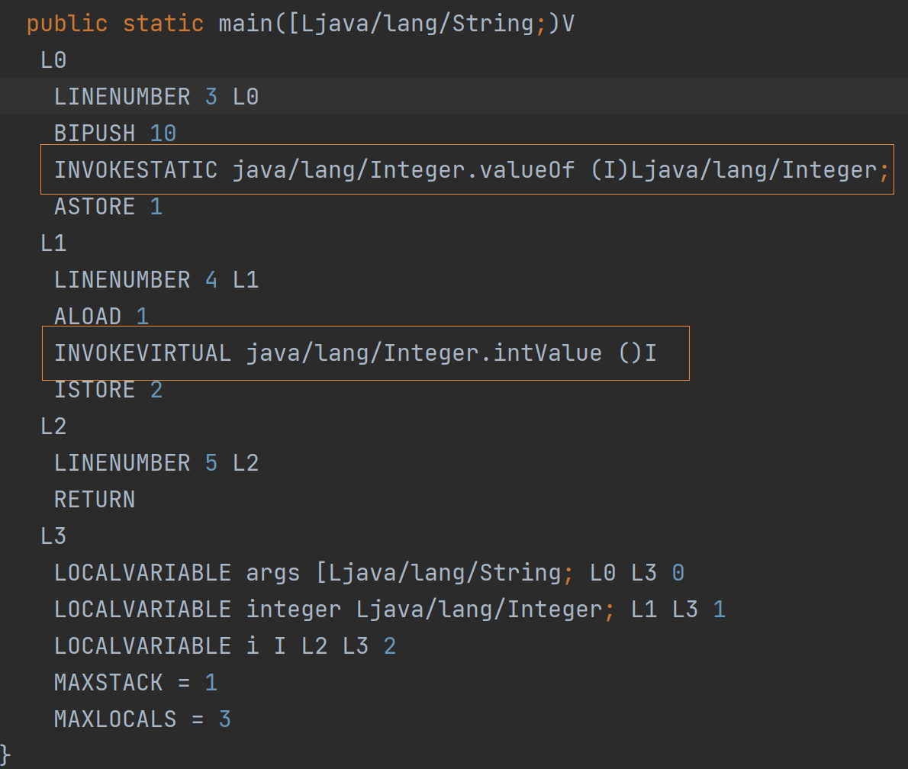
	</br></br>Integer i = 10;int n = i;字节码
</div>


### 常量池

Byte, Short, Integer, Long, Character, Boolean实现了常量池技术

String实现了常量池技术

Float, Double没有实现常量池技术

```java
//常量池
public class Main {
	public static void main(String[] args) {
		Integer a = -128, b = -128;
		System.out.println(a == b); //true 当数字处于[-128,127]区间内是相等的原因是存在常量池
		System.out.println(a.equals(b)); //true
		
        
         //new String()均是在堆上创建的对象，str.intern() 会将str添加到常量池中 并返回引用
		 String s1 = "abcdefg"; //直接放在常量池
         String s2 = new String("abcdefg"); //堆上创建
         String s3 = new String(s1); //堆上创建
         String s4 = "abcdefg"; //常量池
         String s5 = "abc" + "defg"; //常量
         String s6 = "abc" + new StringBuffer("defg").toString();


         System.out.println(s1 == s2); //false
         System.out.println(s1 == s3); //false
         System.out.println(s2 == s3); //false
         System.out.println(s1 == s4); //true
         System.out.println(s1 == s5); //true 常量 编译器就确定了
         System.out.println(s1 == s6); //false

        
         System.out.println(s1.equals(s2)); //true
         System.out.println(s1.equals(s3)); //true
         System.out.println(s2.equals(s3)); //true
         System.out.println(s1.equals(s4)); //true
         System.out.println(s1 == s2.intern()); //true

	}
}
```

### String

#### 常用API

- **char charAt(int index)**

	返回给定位置的代码单元。

- int codePointAt(int index) 5.0

	返回从给定位置开始的码点。

- int offsetByCodePoints(int startIndex, int cpCount) 5.0

	返回从startIndex位置的码点开始，位移cpCount后的码点索引。

- int compareTo(String other)

	按照字典顺序，如果字符串位于other之前，返回一个负数；如果字符串位于other之后，返回一个正数；如果两个字符串相等返回0。

- IntStream codePoints() 8.0

	将这个字符串的码点作为一个流返回。调用toArray将它们放在一个数组中。

- new String(int[] codePoints, int offset, int count) 5.0

	用数组中从 offset 开始的 count 个码点构造一个字符串。

- **boolean equals(0bject other)**

	如果字符串与 other 相等， 返回 true。

- boolean equalsIgnoreCase(String other)

	如果字符串与 other 相等 （ 忽略大小写，) 返回 tme。

- **boolean startsWith(String prefix )**

- **boolean endsWith(String suffix )**

	如果字符串以 suffix 开头或结尾， 则返回 true。

- int indexOf(String str) 

- int indexOf(String str, int fromlndex ) 

- int indexOf(int cp) 

- int indexOf(int cp, int fromlndex ) 

	返回与字符串 str 或代码点 cp 匹配的第一个子串的开始位置。这个位置从索引 0 或 fromlndex 开始计算。 如果在原始串中不存在 str， 返回 -1。

- int 1astIndexOf(String str) 

- int 1astIndexOf(String str, int fromlndex ) 

- int lastindexOf(int cp) 

- int 1astindexOf(int cp, int fromlndex ) 

	返回与字符串 str 或代码点 cp 匹配的最后一个子串的开始位置。 这个位置从原始串尾 端或 fromlndex 开始计算。 

- **int 1ength( )** 

	返回字符串的长度。 

- int codePointCount(int startlndex , int endlndex ) 5.0 

	返回 startlndex 和 endludex-l之间的代码点数量。没有配成对的代用字符将计入代码点。 

-  **String replace( CharSequence oldString,CharSequence newString)** 

	返回一个新字符串。这个字符串用 newString 代替原始字符串中所有的 oldString。可 以用 String 或 StringBuilder 对象作为 CharSequence 参数。 

- **String substring(int beginlndex )** 

- **String substring(int beginlndex, int endlndex )** 

	返回一个新字符串。这个字符串包含原始字符串中从 beginlndex 到串尾或 endlndex-l 的所有代码单元。

- **String toLowerCase( )** 

-  **String toUpperCase( )** 

	返回一个新字符串。 这个字符串将原始字符串中的大写字母改为小写，或者将原始字 符串中的所有小写字母改成了大写字母。

- **String trim( )** 

	返回一个新字符串。这个字符串将删除了原始字符串头部和尾部的空格。

- String join(CharSequence delimiter, CharSequence ... elements ) 8 

	返回一个新字符串， 用给定的定界符连接所有元素。

#### String、StringBuilder和StringBuffer区别

JDK1.9之前为char[]，JDK1.9之后为byte[]

|              | String | StringBuilder | StringBuffer |
| ------------ | ------ | ------------- | ------------ |
| 是否可修改   | 否     | 是            | 是           |
| 效率         | 低     | 高            | 中           |
| 是否线程安全 | 是     | 否            | 是           |

#### String

```java
public final class String
    implements java.io.Serializable, Comparable<String>, CharSequence {
	    private final char value[]; //底层为char数组 final修饰不可变 线程安全
}
```

#### StringBuilder & StringBuffer

```java
abstract class AbstractStringBuilder implements Appendable, CharSequence {
    /**
     * The value is used for character storage.
     */
    char[] value;
}
```

```java
public final class StringBuilder
    extends AbstractStringBuilder
    implements java.io.Serializable, CharSequence
{
 	public StringBuilder() {
        super(16);
    }
    
    public StringBuilder(int capacity) {
        super(capacity);
    }
    
    public StringBuilder(String str) {
        super(str.length() + 16);
        append(str);
    }
    
    public StringBuilder(CharSequence seq) {
        this(seq.length() + 16);
        append(seq);
    }
}
```

```java
 public final class StringBuffer
    extends AbstractStringBuilder
    implements java.io.Serializable, CharSequence
{
    private transient char[] toStringCache; //防止序列化和反序列化
     
    public StringBuffer() {
        super(16);
    }
     
    public StringBuffer(int capacity) {
        super(capacity);
    }
     
    public StringBuffer(String str) {
        super(str.length() + 16);
        append(str);
    }
     
    public StringBuffer(CharSequence seq) {
        this(seq.length() + 16);
        append(seq);
    }
     
    /**
    通过对方法加锁来保证线程安全
    **/
    @Override
    public synchronized int length() {
        return count;
    }
}
```


### 重载与重写的区别

重载：发生在同一个类中，方法名相同参数列表不同（参数类型不同、个数、顺序（类型也不同）不同），与方法返回值和访问修饰符无关，即重载的方法不能根据返回类型进行区分。

重写：发生在父子类中，方法名、参数列表必须相同，返回值小于等于父类，抛出的异常小于等于父类，访问修饰符大于等于父类（里式替换原则）；如果父类方法访问修饰符为private则子类中就不是重写。

构造器（Constructor）可以被重载，不能被重写

重载的方法不能根据返回类型进行区分，函数调用时不能指定返回类型，编译器不知道要调用哪个函数。

### [面向对象三大特征](https://snailclimb.gitee.io/javaguide/#/docs/java/basis/Java%E5%9F%BA%E7%A1%80%E7%9F%A5%E8%AF%86?id=%e9%9d%a2%e5%90%91%e5%af%b9%e8%b1%a1%e4%b8%89%e5%a4%a7%e7%89%b9%e5%be%81)

封装、继承、多态

#### 封装

封装是指把一个对象的状态信息（也就是属性）隐藏在对象内部，不允许外部对象直接访问对象的内部信息。但是可以提供一些可以被外界访问的方法来操作属性。

#### 继承

不同类型的对象，相互之间经常有一定数量的共同点。每一个对象还定义了额外的特性使得他们与众不同。继承是使用已存在的类的定义作为基础建立新类的技术，新类的定义可以增加新的数据或新的功能，也可以用父类的功能，但不能选择性地继承父类。通过使用继承，可以快速地创建新的类，可以提高代码的重用，程序的可维护性，节省大量创建新类的时间 ，提高我们的开发效率。

- 子类拥有父类对象所有的属性和方法（包括私有属性和私有方法），但是父类中的私有属性和方法子类是无法访问，**只是拥有**。
- 子类可以拥有自己属性和方法，即子类可以对父类进行扩展。
- 子类可以用自己的方式实现父类的方法。

#### 多态

表示一个对象具有多种的状态。具体表现为父类的引用指向子类的实例。

### JAVA反射

反射机制是在运行状态中，对于任意一个类，都能够知道这个类的所有属性和方法；对于任意一个对象，都能够调用它的任意一个方法和属性；这种动态获取的信息以及动态调用对象的方法的功能成为反射机制。

优点：运行期类型的判断，动态加载类，提高代码灵活度

缺点：性能比直接的代码要慢

应用场景：Spring中的xml的配置模式、动态代理设计模式也采用了反射机制

### [泛型](https://snailclimb.gitee.io/javaguide/#/docs/java/basis/Java%E5%9F%BA%E7%A1%80%E7%9F%A5%E8%AF%86?id=java-%e6%b3%9b%e5%9e%8b%e4%ba%86%e8%a7%a3%e4%b9%88%ef%bc%9f%e4%bb%80%e4%b9%88%e6%98%af%e7%b1%bb%e5%9e%8b%e6%93%a6%e9%99%a4%ef%bc%9f%e4%bb%8b%e7%bb%8d%e4%b8%80%e4%b8%8b%e5%b8%b8%e7%94%a8%e7%9a%84%e9%80%9a%e9%85%8d%e7%ac%a6%ef%bc%9f)

参数化类型，所操作的数据类型被指定为一个参数。

Java 的泛型是伪泛型，这是因为 Java 在运行期间，所有的泛型信息都会被擦掉，这也就是通常所说类型擦除 。

Java中泛型一般有三种：泛型类、泛型接口、泛型方法。

#### 常用通配符

T，E，K，V，?

- T 表示具体的一个java类型
- E表示Element
- K V代表键值对 key value
- ？表示不确定的java类型

#### 泛型类

```java
//此处T可以随便写为任意标识，常见的如T、E、K、V等形式的参数常用于表示泛型
//在实例化泛型类时，必须指定T的具体类型
public class Generic<T> {

    private T key;

    public Generic(T key) {
        this.key = key;
    }

    public T getKey() {
        return key;
    }
}

Generic<Integer> genericInteger = new Generic<Integer>(123456);
```

#### 泛型接口

```java
public interface Generator<T> {
    public T method();
}

//实现泛型接口不指定类型
class GeneratorImpl<T> implements Generator<T>{
    @Override
    public T method() {
        return null;
    }
}

//实现泛型接口指定类型
class GeneratorImpl implements Generator<String>{
    @Override
    public String method() {
        return "hello";
    }
}
```

#### 泛型方法

```java
public static <E> void printArray(E[] inputArray) {
    for (E element : inputArray) {
        System.out.printf("%s ", element);
    }
    System.out.println();
}

// 创建不同类型数组： Integer, Double 和 Character
Integer[] intArray = { 1, 2, 3 };
String[] stringArray = { "Hello", "World" };
printArray(intArray);
printArray(stringArray);
```

### IO流

#### BIO、NIO、AIO

[BIO、NIO和AIO的区别、三种IO的原理与用法](https://blog.csdn.net/u010541670/article/details/91890649)

[Java中BIO，NIO，AIO总结](https://zhuanlan.zhihu.com/p/159276195)

##### BIO(blocking I/O)

同步阻塞，一个连接为一个线程，连接一个客户端就需要启动一个线程进行处理，如果连接未断开且未做任何事，会造成不必要的开销。可通过线程池优化。相关类在java.io包中。

适用于连接数目比较小且相对固定的架构，对服务器的要求比较高，对并发有局限性。JDK1.4之前唯一的选择。

<div align='center'>
    
    </br></br>BIO
</div>

**缺点**：

- 每个请求都需要创建独立的线程
- 当并发量大的时候，需要创建大量的线程，占用系统资源
- 连接建立后，如果当前线程暂时没有数据刻度，则线程就阻塞在Read操作上，造成资源浪费

##### NIO(non-blocking IO)

JDK1.4开始,Java提供了一系列改进的输入/输出的新特性，统称为NIO(New IO)，同步非阻塞。

相关类在java.nio包及子包下，并对原java.io包中的很多类进行了改写。

NIO有三大核心部分：Channel，Buffer，Selector。

NIO面向缓冲区，数据读到一个它稍后处理的缓冲区中。

非阻塞模式，使一个线程从某通道发送请求或者读取数据，但是它仅能得到目前可用的数据，如果目前没有数据可用，就什么都不获取，会继续保持线程阻塞，直至数据变的可以读取之前，该线程可以继续做其他的事情。非阻塞写也是如此，一个线程请求写入一些数据到某通道，但不需要等待它完全写入，这个线程同时可以去做别的事情。

NIO可以用一个线程处理多个操作，并发能力远远大于BIO。

<div align='center'>
    
    </br></br>NIO Selector、Channel、Buffer关系图
</div>

- 每个Channel都会对应一个Buffer
- Selector对应一个线程，一个线程对应多个Channel
- 线程切换到哪个Channel是由事件决定的
- 数据读取、写入通过Buffer，可以双向，需要flip方法切换

##### AIO

异步非阻塞，无需线程主动切换，在相应的状态改变后，系统会同志对应的线程处理。

BIO、NIO、AIO对比


|          | BIO      | NIO                    | AIO        |
| -------- | -------- | ---------------------- | ---------- |
| IO模型   | 同步阻塞 | 同步非阻塞（多路复用） | 异步非阻塞 |
| 编程难度 | 简单     | 复杂                   | 复杂       |
| 可靠性   | 差       | 好                     | 好         |
| 吞吐量   | 低       | 高                     | 高         |

##### 各自应用场景

BIO适用于连接数目比较小且固定的架构，对服务器资源要求比较高，并发局限于应用中。

NIO适用于连接数目多且连接比较短（轻操作）的架构，比如聊天服务器，并发局限于应用中，编程较复杂。

AIO适用于连接数目多且连接比较长（重操作）的架构，比如相册服务器，充分调用OS参与并发操作，编程比较复杂。

### 异常


<div align='center'>
    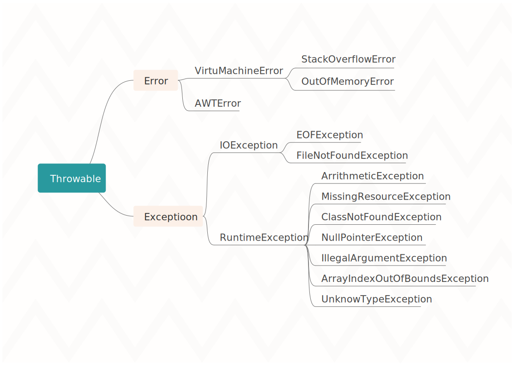
    </br></br>JAVA异常
</div>

### 集合

[JAVA集合源码](./JDK1.8Src/java/util/Collection.java)

<div align='center'>
    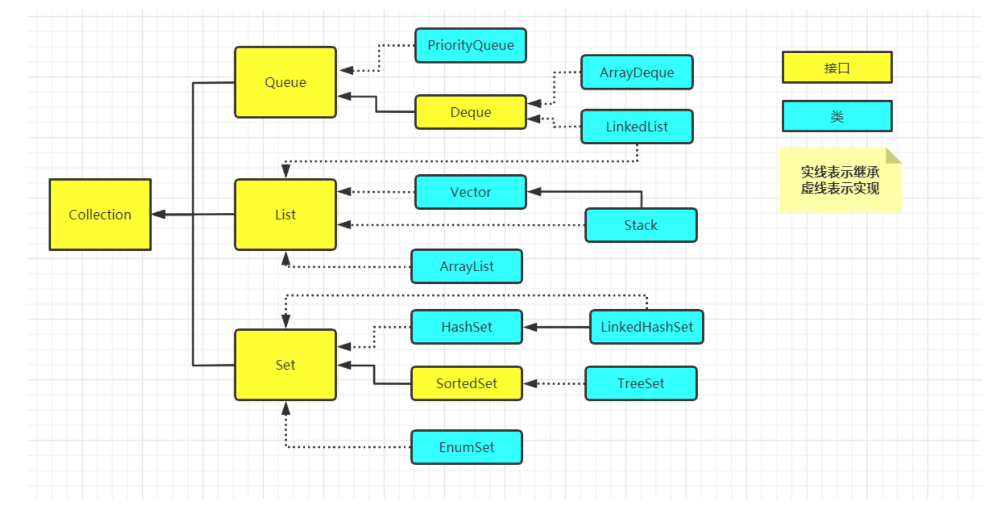
    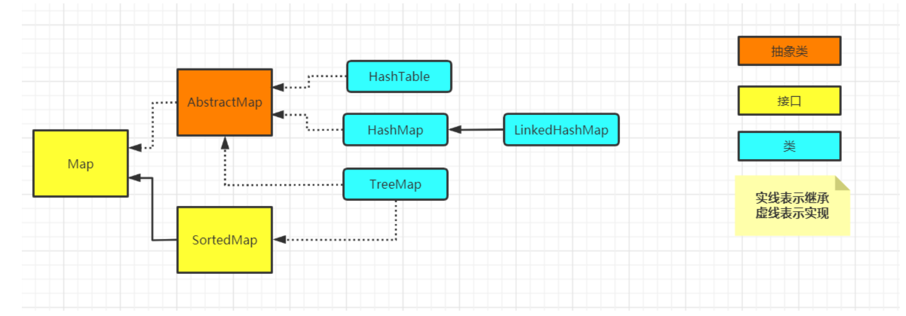
    </br></br>JAVA集合
</div>


#### List、Set、Map三者区别

- List：有序集合（存入与取出顺序相同），可存储重复元素，可存储多个null

- Set：无序集合（存入和取出顺序不一定相同），不可存储重复元素，只能存储一个null

- Map：使用键值对的方式对元素进行存储，key是无序的，且是唯一的。value值不唯一。不同的key值可以对应相同的value值。

#### List

#### Set

##### HashSet

底层是HashMap，默认构造函数是构建一个初始容量为16，负载因子为0.75的HashMap。HashSet的值存放于HashMap的key上，HashMap的value统一为PRESENT。

HashSet如何保证数据的不可重复？

通过HashCode()和equals()两个方法

#### Map

##### [HashMap](./JDK1.8Src/java/util/HashMap.java)

```java
//初始容量 16
static final int DEFAULT_INITIAL_CAPACITY = 1 << 4;
//最大容量 1 << 30
static final int MAXIMUM_CAPACITY = 1 << 30;
//默认加载因子 0.75
static final float DEFAULT_LOAD_FACTOR = 0.75f;
//转红黑树的链表阈值
static final int TREEIFY_THRESHOLD = 8;
//转链表时候红黑树节点个数阈值
static final int UNTREEIFY_THRESHOLD = 6;
//数组最小容量
static final int MIN_TREEIFY_CAPACITY = 64;


/* ---------------- Fields -------------- */

/**
* The table, initialized on first use, and resized as
* necessary. When allocated, length is always a power of two.
* (We also tolerate length zero in some operations to allow
* bootstrapping mechanics that are currently not needed.)
*/
transient Node<K,V>[] table;

//扩容门限值 capacity * load factor 当前容量到达这个值的时候进行resize()
int threshold;

/**
* The number of key-value mappings contained in this map.
*/
transient int size;

/**
* The number of times this HashMap has been structurally modified
* Structural modifications are those that change the number of mappings in
* the HashMap or otherwise modify its internal structure (e.g.,
* rehash).  This field is used to make iterators on Collection-views of
* the HashMap fail-fast.  (See ConcurrentModificationException).
*/
transient int modCount;


//Node节点 实际上还是实现了Map.Entry接口 部分代码
static class Node<K,V> implements Map.Entry<K,V> {
    //判断两个节点值是否相等
    //先判断引用是否相等  然后判断是否为Map.Entry类型 在调用Map.Entry equals方法
    public final boolean equals(Object o) {
            if (o == this)
                return true;
            if (o instanceof Map.Entry) {
                Map.Entry<?,?> e = (Map.Entry<?,?>)o;
                if (Objects.equals(key, e.getKey()) &&
                    Objects.equals(value, e.getValue()))
                    return true;
            }
            return false;
    }
    
    //计算key的hash值 如果key为null则hash值为0放在数组索引为0的位置上
    static final int hash(Object key) {
        int h;
        return (key == null) ? 0 : (h = key.hashCode()) ^ (h >>> 16);
    }
}
```


###### **HashMap底层实现**

1.7之前数组+链表，1.8之后数组+链表+红黑树

###### HashMap扩容

<div align='center'>
    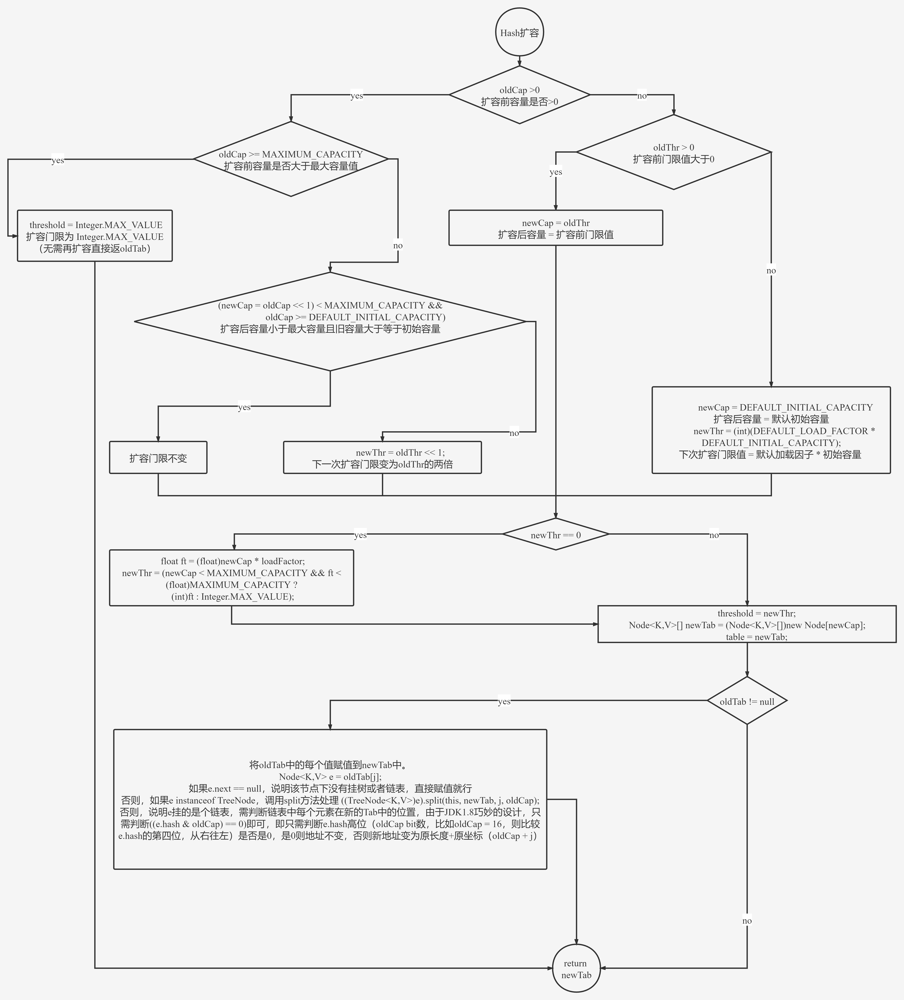
    <br/><br/>HashMap扩容
</div>


```java
    final Node<K,V>[] resize() {
        Node<K,V>[] oldTab = table;
        int oldCap = (oldTab == null) ? 0 : oldTab.length;
        int oldThr = threshold;
        int newCap, newThr = 0;
        if (oldCap > 0) {
            if (oldCap >= MAXIMUM_CAPACITY) {
                threshold = Integer.MAX_VALUE;
                return oldTab;
            }
            else if ((newCap = oldCap << 1) < MAXIMUM_CAPACITY &&
                     oldCap >= DEFAULT_INITIAL_CAPACITY)
                newThr = oldThr << 1; // double threshold
        }
        else if (oldThr > 0) // initial capacity was placed in threshold
            newCap = oldThr;
        else {               // zero initial threshold signifies using defaults
            newCap = DEFAULT_INITIAL_CAPACITY;
            newThr = (int)(DEFAULT_LOAD_FACTOR * DEFAULT_INITIAL_CAPACITY);
        }
        if (newThr == 0) {
            float ft = (float)newCap * loadFactor;
            newThr = (newCap < MAXIMUM_CAPACITY && ft < (float)MAXIMUM_CAPACITY ?
                      (int)ft : Integer.MAX_VALUE);
        }
        threshold = newThr;
        @SuppressWarnings({"rawtypes","unchecked"})
        Node<K,V>[] newTab = (Node<K,V>[])new Node[newCap];
        table = newTab;
        if (oldTab != null) {
            for (int j = 0; j < oldCap; ++j) {
                Node<K,V> e;
                if ((e = oldTab[j]) != null) {
                    oldTab[j] = null;
                    if (e.next == null)
                        newTab[e.hash & (newCap - 1)] = e;
                    else if (e instanceof TreeNode)
                        ((TreeNode<K,V>)e).split(this, newTab, j, oldCap);
                    else { // preserve order
                        Node<K,V> loHead = null, loTail = null;
                        Node<K,V> hiHead = null, hiTail = null;
                        Node<K,V> next;
                        do {
                            next = e.next;
                            if ((e.hash & oldCap) == 0) {
                                if (loTail == null)
                                    loHead = e;
                                else
                                    loTail.next = e;
                                loTail = e;
                            }
                            else {
                                if (hiTail == null)
                                    hiHead = e;
                                else
                                    hiTail.next = e;
                                hiTail = e;
                            }
                        } while ((e = next) != null);
                        if (loTail != null) {
                            loTail.next = null;
                            newTab[j] = loHead;
                        }
                        if (hiTail != null) {
                            hiTail.next = null;
                            newTab[j + oldCap] = hiHead;
                        }
                    }
                }
            }
        }
        return newTab;
    }
```

###### HashMap Put

<div align='center'>
    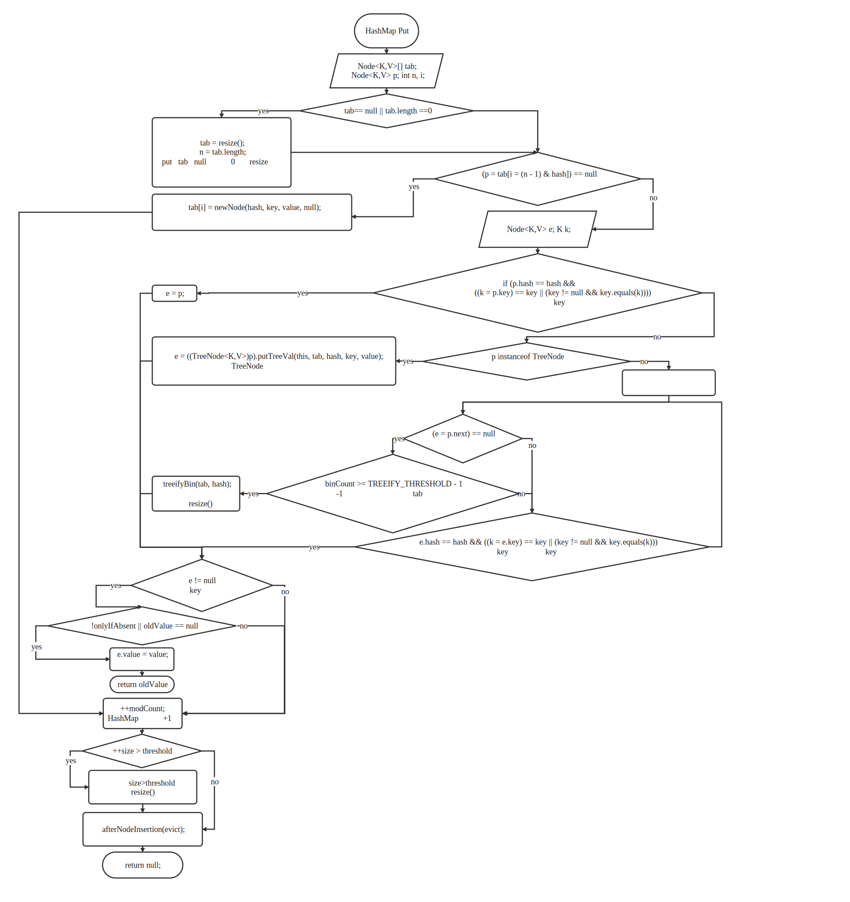
    <br/><br/>HashMap Put
</div>


```java
    /**
     * Associates the specified value with the specified key in this map.
     * If the map previously contained a mapping for the key, the old
     * value is replaced.
     *
     * @param key key with which the specified value is to be associated
     * @param value value to be associated with the specified key
     * @return the previous value associated with <tt>key</tt>, or
     *         <tt>null</tt> if there was no mapping for <tt>key</tt>.
     *         (A <tt>null</tt> return can also indicate that the map
     *         previously associated <tt>null</tt> with <tt>key</tt>.)
     */
    public V put(K key, V value) {
        return putVal(hash(key), key, value, false, true);
    }

    /**
     * Implements Map.put and related methods.
     *
     * @param hash hash for key
     * @param key the key
     * @param value the value to put
     * @param onlyIfAbsent if true, don't change existing value
     * @param evict if false, the table is in creation mode.
     * @return previous value, or null if none
     */
    final V putVal(int hash, K key, V value, boolean onlyIfAbsent,
                   boolean evict) {
        Node<K,V>[] tab; Node<K,V> p; int n, i;
        if ((tab = table) == null || (n = tab.length) == 0)
            n = (tab = resize()).length;
        if ((p = tab[i = (n - 1) & hash]) == null)
            tab[i] = newNode(hash, key, value, null);
        else {
            Node<K,V> e; K k;
            if (p.hash == hash &&
                ((k = p.key) == key || (key != null && key.equals(k))))
                e = p;
            else if (p instanceof TreeNode)
                e = ((TreeNode<K,V>)p).putTreeVal(this, tab, hash, key, value);
            else {
                for (int binCount = 0; ; ++binCount) {
                    if ((e = p.next) == null) {
                        p.next = newNode(hash, key, value, null);
                        if (binCount >= TREEIFY_THRESHOLD - 1) // -1 for 1st
                            treeifyBin(tab, hash);
                        break;
                    }
                    if (e.hash == hash &&
                        ((k = e.key) == key || (key != null && key.equals(k))))
                        break;
                    p = e;
                }
            }
            if (e != null) { // existing mapping for key
                V oldValue = e.value;
                if (!onlyIfAbsent || oldValue == null)
                    e.value = value;
                afterNodeAccess(e);
                return oldValue;
            }
        }
        ++modCount;
        if (++size > threshold)
            resize();
        afterNodeInsertion(evict);
        return null;
    }

    /**
     * Replaces all linked nodes in bin at index for given hash unless
     * table is too small, in which case resizes instead.
     */
    final void treeifyBin(Node<K,V>[] tab, int hash) {
        int n, index; Node<K,V> e;
        if (tab == null || (n = tab.length) < MIN_TREEIFY_CAPACITY)
            resize();
        else if ((e = tab[index = (n - 1) & hash]) != null) {
            TreeNode<K,V> hd = null, tl = null;
            do {
                TreeNode<K,V> p = replacementTreeNode(e, null);
                if (tl == null)
                    hd = p;
                else {
                    p.prev = tl;
                    tl.next = p;
                }
                tl = p;
            } while ((e = e.next) != null);
            if ((tab[index] = hd) != null)
                hd.treeify(tab);
        }
    }
```

**HashMap与HashSet的区别**

| HashMap                     | HashSet                             |
| --------------------------- | ----------------------------------- |
| 实现了Map接口               | 实现了Set接口                       |
| 存储键值对                  | 存储对象                            |
| key唯一，value不唯一        | 存储对象唯一                        |
| HashMap使用键值计算Hashcode | HashSet使用成员对象来计算hashcode值 |
| 速度相对较快                | 速度相对较慢                        |

###### ConcurrentHashMap

- JDK1.7

	Segment数组+HashEntry数组方式实现，Segment实现了ReentrantLock，所以Segment有锁的性质，HashEntry用于存储键值对。

- JDK1.8

	类似HashMap，Node数组+链表/红黑树，采用CAS+synchronized来保证线程安全。synchronized只锁链表或红黑树的头结点，锁的粒度更细，竞争变小，效率提高。

<div align='center'>
    
    </br></br>JDK1.7 ConcurrentHashMap
    
    </br></br>JDK1.8 ConcurrentHashMap
</div>

###### HashTable

数组+链表，链表解决哈希冲突，整个数组都是synchronized修饰的，线程安全，锁的粒度太大，竞争激烈，效率低

<div align='center'>
    
    </br></br>HashTable
</div>

###### HashMap、ConcurrentHashMap、HashMap的区别

|                              | HashMap（JDK1.8）                 | ConcurrentHashMap（JDK1.8）      | Hashtable                      |
| ---------------------------- | --------------------------------- | -------------------------------- | ------------------------------ |
| 底层实现                     | 数组+链表/红黑树                  | 数组+链表/红黑树                 | 数组+链表                      |
| 线程安全                     | 不安全                            | 安全（synchronized修饰Node节点） | 安全（synchronized修饰整个表） |
| 效率                         | 高                                | 较高                             | 低                             |
| 扩容                         | 初始16，每次扩容为原来的2倍       | 初始16，每次扩容为原来的2倍      | 初始                           |
| 是否支持null key和null value | 可以有一个null key 多个null value | 不支持                           | 不支持                         |


### 线程

[JDK1.8 Thread.java](./JDK1.8Src/java/lang/Thread.java)

##### 线程状态

- New（新创建）

	Thread thread = new Thread(task)

- Runnable（可运行）

	thread.start()

- Blocked（被阻塞）

- Waiting（等待）

- Timed waiting（计时等待）

- Terminated（被终止）

	run()方法正常退出

	没有捕获异常而异常终止

可调用getState方法获取线程当前状态

<div align='center'>
    
    </br></br>线程状态
</div>

##### 线程同步

###### synchronized(内置锁/互斥锁、可重入)

```java
package simple.jbx.java.com.singleton;

import java.lang.reflect.Constructor;

/**
 * @author simple.jbx
 * @description synchronized 实现懒汉式单例
 * @date 16:16 2021/10/15
 * @return
 **/
public class Lazy {
    private Lazy(){
        //System.out.println(Thread.currentThread().getName() + "start");
        synchronized (Lazy.class){
            if(lazy == null){
                throw new RuntimeException("不要试图使用反射破坏异常");
            }
        }
    }

    private volatile static Lazy lazy;

    //双重检测锁模式的懒汉式单例 DCL懒汉式
    public static Lazy getInstance() {
        if(lazy == null)
        {
            synchronized(Lazy.class){
                if(lazy == null)
                {
                    lazy = new Lazy();
                    //不是一个原子操作
                    /**
                     *1. 分配内存空间
                     *2. 执行构造方法，初始化对象
                     *3. 把这个对象指向这个空间
                     *
                     * 123 Thread A
                     * 132
                     *     Thread B //此时还没有完成构造
                     */
                }
            }
        }
        return lazy;
    }

    public static void main(String[] args) throws Exception {
        /*
        for(int i = 0; i < 10; i++)
        {
            new Thread(()->{
                Layz.getInstance();
            }).start();
        }*/

        //Lazy instance = Lazy.getInstance();
        Constructor<Lazy> declearedConstructor = Lazy.class.getDeclaredConstructor(null);
        declearedConstructor.setAccessible(true);

        //java10 这里两个对象用反射还是不能破坏单例  视频里的java8可以
        Lazy instance2 = declearedConstructor.newInstance();
        Lazy instance3 = declearedConstructor.newInstance();

        //System.out.println(instance);
        System.out.println(instance2);
        System.out.println(instance3);
    }
}

```

<div align='center'>
    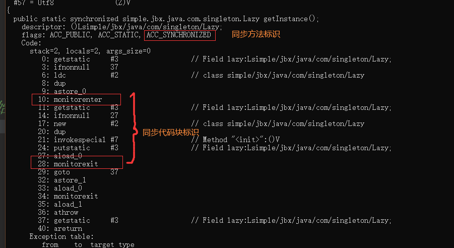
    </br></br>synchronized同步
</div>

synchronized同步语句块的实现使用的是monitorenter和monitorexit指令。

synchronized修饰的方法实现使用的是ACC_SYNCHRONIZED表示，该标识指明了该方法是一个同步方法。

两者的本质都是对对象监视器monitor的获取。

###### voliate

稍弱的同步机制，用来确保将变量的更新操作通知到其他线程。当把变量声明为volatile类型后，编译器与运行时都会注意到这个变量是共享的，因此不会将该变量上的操作与其他内存操作一起重排序。voliate变量不会被缓存在寄存器或者对其他处理器不可见的地方，因此在读取voliate类型的变量时总会返回最新写入的值。

加锁机制既可以确保可见性又可以确保原子性，而volatile变量只能确保可见性，通常用作某个操作完成、发生中断或者状态的标志。

当且仅当满足一下所有条件时，才应该使用volatile变量：

- 对变量的写入操作不依赖变量的当前值，或者能确保只有单个线程更新变量的值。
- 该变量不会与其他状态变量一起纳入不变性条件中。
- 在访问变量时不需要加锁。

```java
volatile boolean sleep;
while(!asleep) {
	countSomeSheep();
}
```

###### wait和notify

###### 局部变量（ThreadLocal）

###### 原子变量

```java
import java.util.concurrent.atomic
public class HelloServlet implements Servlet {
 	
    private final AtomicLong count = new AtomicLong(0);
    private final AtomicBoolean atomicBoolean = new AtomicBoolean(false);
    private final AtomicInteger atomicInteger = new AtomicInteger();
    private final AtomicIntegerArray atomicIntegerArray = new AtomicIntegerArray(0);
    private final AtomicLongArray atomicLongArray = new AtomicLongArray(0);
	
    public long getCount() {
        return count.get();
    }

    public void increCount() {
        count.incrementAndGet();
    }

    @Override
    public void init(ServletConfig servletConfig) throws ServletException {

    }

    @Override
    public ServletConfig getServletConfig() {
        return null;
    }

    @Override
    public void service(ServletRequest servletRequest, ServletResponse servletResponse) throws ServletException, IOException {

    }

    @Override
    public String getServletInfo() {
        return null;
    }

    @Override
    public void destroy() {

    }
}
```


###### 阻塞队列

##### 线程封闭

避免使用同步的方式就是不共享数据。如果仅在单线程内访问数据，就不需要同步。这种技术被称为线程封闭（Thread Confinement），是实现线程安全性的最简单方式之一。当某个对象封闭在一个线程中时，这种用法将自动实现线程安全性，即使被封闭的对象本身不是线程安全的。

###### Ad-hoc 线程封闭

维护线程封闭性的职责完全由程序实现来承担。非常脆弱。因此应当尽量少使用它，应该使用更强的线程封闭技术（栈封闭或ThreadLocal类）。

###### 栈封闭

只有局部变量才能访问对象。局部变量的固有属性之一就是封闭在执行线程中。它们位于执行线程的栈中，其他线程无法访问这个栈。栈封闭（也被成为线程内部使用或者线程局部使用，不要与核心类库中的ThreadLocal混淆）比Ad-hoc线程封闭更容易维护，也更加健壮。

###### ThreadLocal

更规范的方法。能使线程中的某个值与保存值的对象关联起来。ThreadLocal提供了get与set等访问接口或方法，这些方法为每个使用该变量的线程都存有一份独立的副本，因此get总是返回由当前执行线程在调用set时设置的最新值。

ThreadLocal对象通常用于防止对可变的单实例变量（Singleton）或全局变量进行共享。

当某个频繁执行的操作需要一个临时对象，例如一个缓冲区，而同时又希望避免在每次执行时都重新分配该临时对象，就可以使用这项技术。（JDK1.5之前，Integer.toString()方法使用ThreadLocal对象保存一个12B大小的缓冲区，用于对结果进行格式化，而不是使用共享的静态缓冲区），或每次调用的时候分配一个新的

#### 线程池

Exectuors:工具类、线程池的工厂类，用于创建并返回不同类型的线程池。

```java
//1.提供指定数量的线程池
ExecutorService executorService = Executors.newFixedThreadPool(10);

//2.执行指定的线程操作。需提供实现Runnable或Callable接口实现类的对象
executorService.execute(new NumberThread());//适合使用于Runnable
executorService.submit();//适合使用于Callable
//3.关闭线程池
executorService.shutdown();

//创建线程池通用构造函数
 /**
     * Creates a new {@code ThreadPoolExecutor} with the given initial
     * parameters.
     *
     * @param corePoolSize the number of threads to keep in the pool, even
     *        if they are idle, unless {@code allowCoreThreadTimeOut} is set
     * @param maximumPoolSize the maximum number of threads to allow in the
     *        pool
     * @param keepAliveTime when the number of threads is greater than
     *        the core, this is the maximum time that excess idle threads
     *        will wait for new tasks before terminating.
     * @param unit the time unit for the {@code keepAliveTime} argument
     * @param workQueue the queue to use for holding tasks before they are
     *        executed.  This queue will hold only the {@code Runnable}
     *        tasks submitted by the {@code execute} method.
     * @param threadFactory the factory to use when the executor
     *        creates a new thread
     * @param handler the handler to use when execution is blocked
     *        because the thread bounds and queue capacities are reached
     * @throws IllegalArgumentException if one of the following holds:<br>
     *         {@code corePoolSize < 0}<br>
     *         {@code keepAliveTime < 0}<br>
     *         {@code maximumPoolSize <= 0}<br>
     *         {@code maximumPoolSize < corePoolSize}
     * @throws NullPointerException if {@code workQueue}
     *         or {@code threadFactory} or {@code handler} is null
     */

/*
corePoolSize 核心线程数 线程池线程基本数量（即使没有任务，线程池所有线程是空闲状态，线程数也保持这个数）
maximumPoolSize 线程池最大线程数
keepAliveTime 当线程数大于corePoolSize时多余的线程处于空闲状态时最大存活时间
unit keepAliveTime的单位
workQueue 存放已提交但未执行的任务的工作队列
threadFactory 使用哪种工厂模式创建线程池
handler 饱和策略
*/
public ThreadPoolExecutor(int corePoolSize,
                              int maximumPoolSize,
                              long keepAliveTime,
                              TimeUnit unit,
                              BlockingQueue<Runnable> workQueue,
                              ThreadFactory threadFactory,
                              RejectedExecutionHandler handler) {···}
```

优点：

- 提高响应速度（减少了创建新线程的时间）
- 降低资源消耗（重复利用线程池中的线程，不需要每次都创建）
- 便于线程管理
	- corePoolSize：核心池大小
	- maximumPoolSize：最大线程数
	- keepAliveTime：线程没有任务时最多保持多长时间后会终止

##### 创建线程池

使用Executor静态工厂

| 方法                             | 描述                                                         |
| -------------------------------- | ------------------------------------------------------------ |
| newCachedThreadPool              | 返回一个带缓存的线程池，必要时创建新线程；空闲线程会被保留60秒 |
| newFixedThreadPool               | 包含固定数量的线程；空闲线程会一直被保留；线程数由参数决定   |
| newSingleThreadExecutor          | 只有一个线程的“池”，该线程顺序执行每一个提交的任务           |
| newScheduledThreadPool           | 用于预定执行而构建的固定线程池，替代java.util.Timer          |
| newSingleThreadScheduledExecutor | 用于预定执行而构建的单线程“池”                               |

##### 线程池常用方法

- int getLargestPoolSize() 返回线程池在该执行器生命周期中的最大尺寸

##### 生命周期

ExecutorService的声明周期有三种状态：运行、关闭、已停止。

初始创建时处于运行状态。shutdown方法将执行平缓的关闭过程：不在接受新的任务，同时等待已经提交的任务执行完成--包括那些还未开始执行的任务。shutdownNow方法将执行粗暴的关闭过程：它将尝试取消所有运行中的任务，并且不在启动队列中尚未开始执行的任务。

在ExecutorService关闭后提交的任务将由“拒绝执行处理器（Rejected Execution Handle）来处理”，它会抛弃任务，或者使得execute方法抛出一个未检查的Rejected-ExecutionException。等所有任务完成后，ExecutorService到达终止状态。可以调用awaitTermination来等待ExecutorService到达终止状态，或者通过调用isTerminated来轮询ExecutorService是否已经终止。通常在调用awaitTermination之后会立即调用shutdown，从而产生同步地关闭ExecutorService的效果。

##### 管理线程池队列任务

ThreadPoolExcutor允许提供一个BlockingQueue（阻塞队列）来保存等待执行的任务。基本的任务排队方法有3种：无解队列、有届队列和同步移交（Synchronous Handoff）。队列的选择与其他配置参数有关，例如线程池大小等。

newFixedThreadPool和newSingleThreadExecutor在默认情况会使用一个无界的LinkedBlockingQueue。如果任务到达速度大于处理速度，队列将无限制增加。

比较稳妥的策略是使用有界队列，例如ArrayBlockingQueue、有界的LinkedBlockingQueue、PriorityBlockingQueue。会引发新的问题，队列满了怎么办，需要用到下面的各种饱和策略。在使用有界队列的时候，队列的大小与线程池的大小必须一起调节。如果线程池较小而队列较大，那么有助于减少内存使用量，降低CPU使用率，还能减少上下文切换，但可能会限制吞吐量。

对于非常大的或者无界的线程池，可以通过使用SynchronousQueue来避免任务排队，以及直接将任务从生产者转移交给工作线程。SynchronousQueue不是真正意义上的队列，而是一种移交机制。要将一个任务放到SynchronousQueue中，必须有另一个空闲线程在等待接收任务。如果没有，并且线程池当前大小小于最大值，则创建一个新的线程，否则根据饱和策略，这个任务会被拒绝。只有当线程池是无界的或者可以拒绝任务的时候，SynchronousQueue才有实际价值。newCachedTHreadPool工厂方法中就使用了SynchronousQueue。

##### 饱和策略

###### AbortPolicy

Abort（中止）策略是默认的饱和策略，该策略将抛出未检查的RejectedExecutionException。调用者可以捕获这个异常，并根据需求编写处理代码。

###### CallerRunsPolicy

调用者运行策略实现了一种调节机制，该策略既不会抛弃任务，也不会抛出异常，而是将某些任务回退到调用者，从而降低新任务的流量。它不会在线程池中的某个线程执行新提交的任务，而是在一个调用了execute的主线程中执行该任务。由于执行该任务需要一定时间，因此在这段时间内主线程不会调用accept，从而到达的请求被保存在TCP的缓存队列而不是在应用程序。

###### DiscardPolicy

当新提交的任务无法保存到队列等待执行时，抛弃（Discard）策略会抛弃该任务。

###### DiscardOldestPolicy

抛弃最旧的策略会抛弃下一个将被执行的任务，然后尝试重新提交新的任务。如果工作队列是一个优先队列，则该策略会抛弃优先级最高的任务，因此最好不要将该策略与优先级队列放在一起使用。

## 并发、锁

### [Atomic原子类型](Atomic原子类型)

具有原子/原子特征的类。

<div align='center'>
    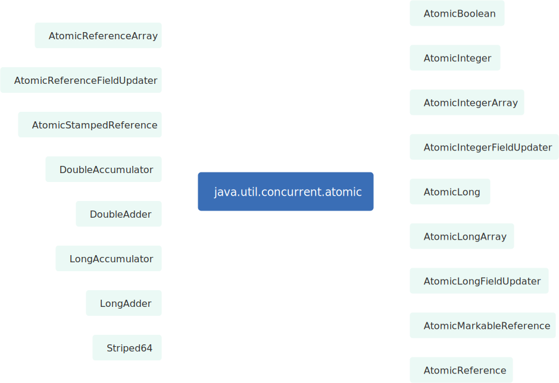
    </br></br>JUC包下包含的类（JDK1.8）
</div>

根据操作的类型可以将JUC包中的原子类分为4类。

#### 基本类型

使用原子方式更新基本类型

##### [AtomicInteger 整型原子类](https://snailclimb.gitee.io/javaguide/#/docs/java/multi-thread/Atomic%E5%8E%9F%E5%AD%90%E7%B1%BB%E6%80%BB%E7%BB%93?id=_24-atomicinteger-%e7%ba%bf%e7%a8%8b%e5%ae%89%e5%85%a8%e5%8e%9f%e7%90%86%e7%ae%80%e5%8d%95%e5%88%86%e6%9e%90)

###### 常用方法

```java
public final int get() //获取当前的值
public final int getAndSet(int newValue)//获取当前的值，并设置新的值
public final int getAndIncrement()//获取当前的值，并自增
public final int getAndDecrement() //获取当前的值，并自减
public final int getAndAdd(int delta) //获取当前的值，并加上预期的值
boolean compareAndSet(int expect, int update) //如果输入的数值等于预期值，则以原子方式将该值设置为输入值（update）
public final void lazySet(int newValue)//最终设置为newValue,使用 lazySet 设置之后可能导致其他线程在之后的一小段时间内还是可以读到旧的值。
```

```java
 // setup to use Unsafe.compareAndSwapInt for updates
private static final Unsafe unsafe = Unsafe.getUnsafe();
private static final long valueOffset;

static {
    try {
        valueOffset = unsafe.objectFieldOffset
            (AtomicInteger.class.getDeclaredField("value"));
    } catch (Exception ex) { throw new Error(ex); }
}

private volatile int value;
```

AtomicInteger 类主要利用 CAS (compare and swap) + volatile 和 native 方法来保证原子操作，从而避免 synchronized 的高开销，执行效率大为提升。

CAS的原理是拿期望的值和原本的一个值作比较，如果相同则更新成新的值。UnSafe 类的 objectFieldOffset() 方法是一个本地方法，这个方法是用来拿到“原来的值”的内存地址。另外 value 是一个volatile变量，在内存中可见，因此 JVM 可以保证任何时刻任何线程总能拿到该变量的最新值。

##### AtomicLong 长整型原子类

##### AtomicBoolean 布尔型原子类

#### 数组类型

使用原子方式更新数组中的某个元素

##### AtomicIntegerArray 整型数组原子类

##### AtomicLongArray 长整型数组原子类

##### AtomicReferenceArray  引用类型数组原子类

#### 引用类型

##### AtomicReference：引用类型原子类

##### AtomicMarkableReference：原子更新带有标记的引用类型。该类将 boolean 标记与引用关联起来。

##### AtomicStampedReference ：原子更新带有版本号的引用类型。该类将整数值与引用关联起来，可用于解决原子的更新数据和数据的版本号，可以解决使用 CAS 进行原子更新时可能出现的 ABA 问题。

#### 对象的属性修改类型

##### AtomicIntegerFieldUpdater:原子更新整型字段的更新器

##### AtomicLongFieldUpdater：原子更新长整型字段的更新器

##### AtomicReferenceFieldUpdater：原子更新引用类型里的字段


### 锁

#### [锁的级别](https://www.cnblogs.com/wuqinglong/p/9945618.html)

- 无锁状态
- 偏向锁状态
- 轻量级锁状态
- 重量级锁状态

锁可以升级，但不能降级

#### 重入锁

当某个线程请求一个由其他线程持有的锁时，发出请求的线程就会阻塞。然而，由于内置锁是可重入的，因此如果某个线程视图获得一个已经由它自己所持有的锁，那么这个请求就会成功。“重入”意味着获取锁的操作粒度是“线程”，而不是“调用”。重入的一种实现方法是，为每个锁关联一个获取计数值和一个所有者线程。当计数值为0时，这个锁就认为是没有被任何线程持有。当线程请求一个未被持有的锁时，JVM将记下锁的持有者，并且将获取计数值置为1.如果同一个线程再次获取这个锁，计数值将递增，而当线程退出同步代码块时，计数器会相应递减。当计数值为0时，这个锁将被释放。

<div align='center'>
    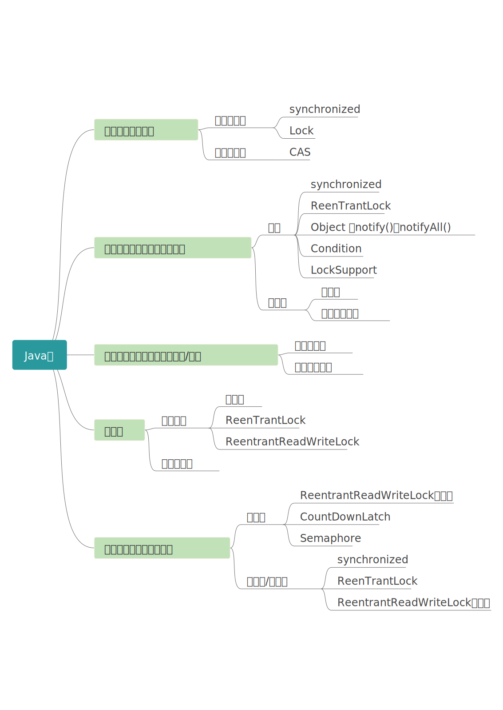
    </br></br><a href='https://zhuanlan.zhihu.com/p/56512421'>JAVA锁</a>
</div>


# JVM

## References

[1]	（日） 中村成洋著.深入Java虚拟机 JVM G1GC的算法与实现[M].北京：人民邮电出版社.2021.
[2] 	周志明著.深入理解Java虚拟机[M].北京：机械工业出版社.2019.
[3] 	华保健著.深入浅出 Java虚拟机设计与实现[M].北京：机械工业出版社.2020.
[4] 	周志明著.深入理解Java虚拟机 JVM高级特性与最佳实践[M].北京：机械工业出版社.2013.

## JAVA内存区域与内存溢出异常

<div align='center'>
    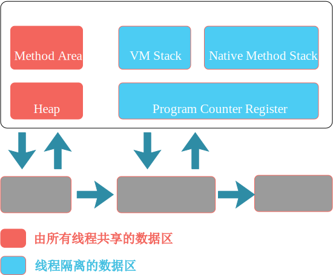
    </br></br>Java虚拟机运行时数据区
</div>

### 程序计数器

当前线程所执行的字节码行号指示器（线程私有）。

如果正在执行的是一个Java方法，则记录的是正在执行的虚拟机字节码指令的地址；如果执行的是本地方法（Native），则这个计数器的值为空（Undefinde）。并且程序计数器内存区域是唯一一个在《Java虚拟机规范》中没有规定任何OutOfMemoryError情况的区域。

### Java虚拟机栈

线程私有，生命周期与线程相同。虚拟机栈描述的是Java方法执行的线程内存模型：每个方法被执行的时候，Java虚拟机都 会同步创建一个栈帧（Stack Frame）用于存储局部变量表、操作数栈、动态连接、方法出口等信 息。每一个方法被调用直至执行完毕的过程，就对应着一个栈帧在虚拟机栈中从入栈到出栈的过程。

局部变量表存放了编译期可知的各种Java虚拟机基本数据类型（boolean、byte、char、short、int、 float、long、double）、对象引用（reference类型，它并不等同于对象本身，可能是一个指向对象起始 地址的引用指针，也可能是指向一个代表对象的句柄或者其他与此对象相关的位置）和returnAddress 类型（指向了一条字节码指令的地址）。

在《Java虚拟机规范》中，对这个内存区域规定了两类异常状况：如果线程请求的栈深度大于虚 拟机所允许的深度，将抛出StackOverflowError异常；如果Java虚拟机栈容量可以动态扩展（HotSpot不可动态扩展，申请栈空间成功不会有OOM ，如果申请时失败会出现OOM），当栈扩 展时无法申请到足够的内存会抛出OutOfMemoryError异常。

### 本地方法栈

与虚拟机栈作用相似，区别在于虚拟机栈为虚拟机执行Java方法（字节码）服务，而本地方法则是为虚拟机使用到本地（Native）方法服务。

《Java虚拟机规范》对本地方法栈中使用的语言、方式与数据结构并没有任何强制规定。Hotspot虚拟机中将本地方法栈与虚拟机栈合二为一。本地方法栈也会在栈深度溢出或者栈扩展失败时分别抛出StackOverflowError和OutOfMemoryError异常。

### Java堆


## 垃圾回收

### 概述

Garbage Collection：哪些内存需要回收、什么时候回收、如何回收

#### 判断对象是否可回收

#### 引用计数法

<div align='center'>
    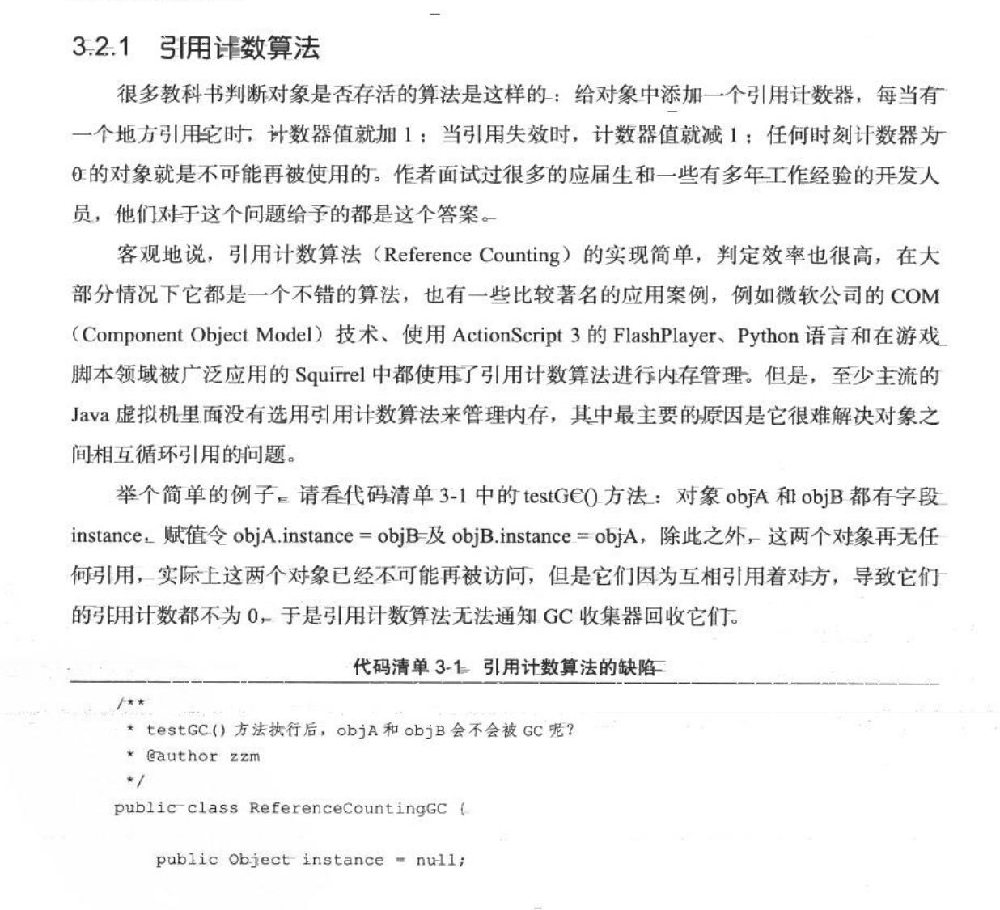
    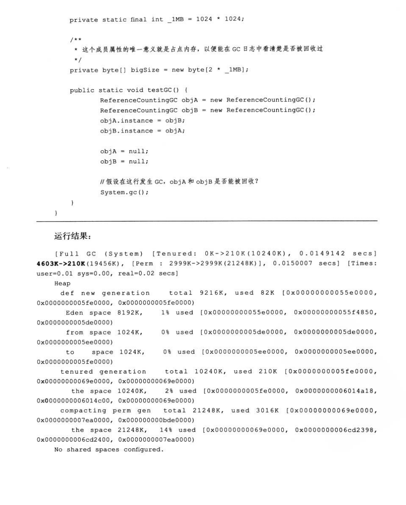
    
    </br></br>引用计数法
</div>


#### 可达性分析法

<div align='center'>
    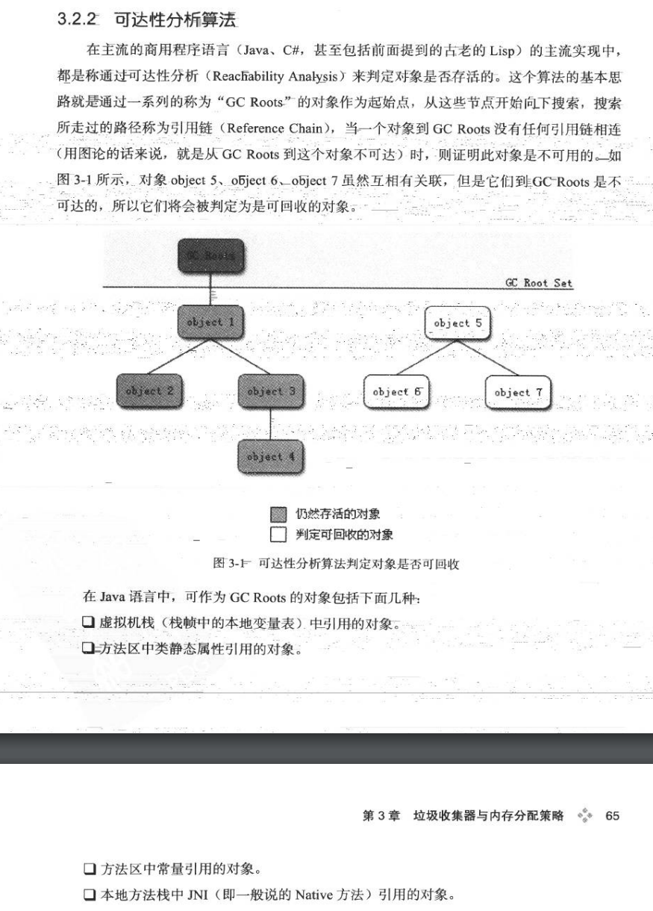
    </br></br>引用计数法
</div>


#### 引用类型

强引用

软引用

弱引用

虚引用


### 垃圾收集算法

#### 标记-清除算法

概述：分为标记和清除两个阶段

缺点：产生大量不连续碎片，有可能导致后续提前触发新的垃圾回收

<div align='center'>
    
    </br></br>标记-清除算法
</div>


#### 复制算法

概述：将总内存分为两半，每次只使用一半，当需要收集时把存活的对象复制到未使用的另一半上，当前空间直接清除。

缺点：可用最大内存为总内存的一半，代价太大。

<div align='center'>
    
    
    </br></br>复制算法
</div>


#### 标记-整理算法

<div align='center'>
    
    </br></br>标记-整理算法
</div>


#### 分代收集算法

概述：根据不同年代选取算法，新生代（少量存活），复制算法，老年代（大量存活），标记清理/标记整理

<div align='center'>
    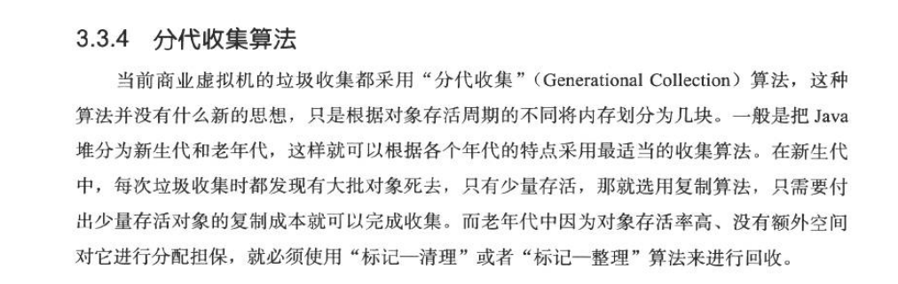
    </br></br>分代收集算法
</div>

### 垃圾收集器

[比较新的参考](https://mp.weixin.qq.com/s/oGWfEovQRx-i1dE7eiXKsA)

#### Serial收集器

<div align='center'>
    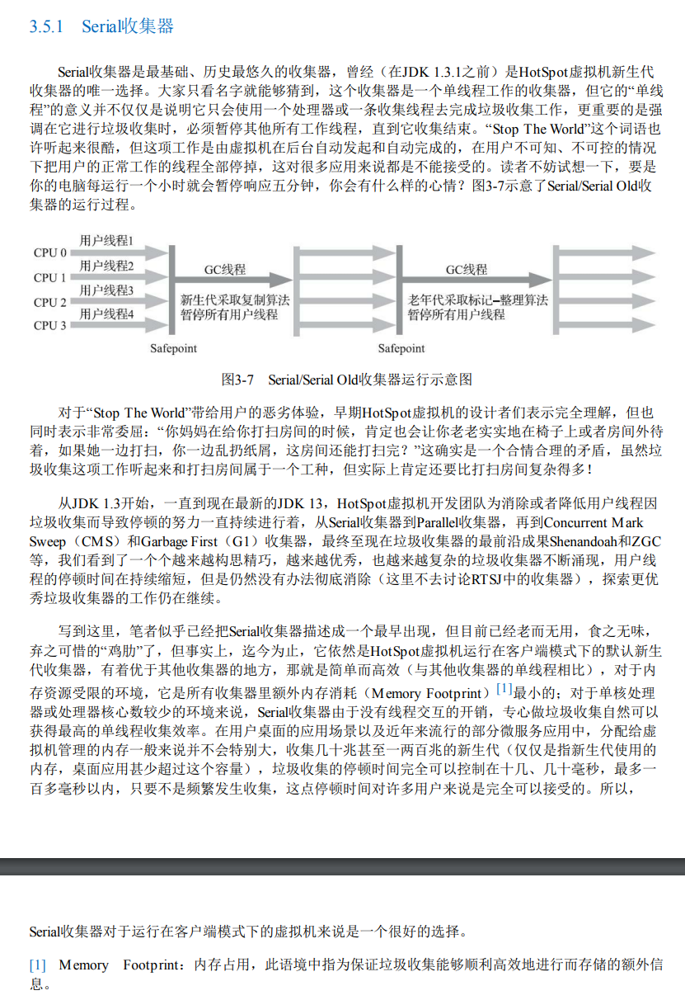
    
    </br></br>Serial收集器
</div>


#### ParNew收集器

<div align='center'>
    
    
    </br></br>ParNew收集器
</div>


#### Parallel Scavenge收集器

<div align='center'>
    
    
    </br></br>Parallel Scavenge收集器
</div>


#### Serial Old 收集器


<div align='center'>
    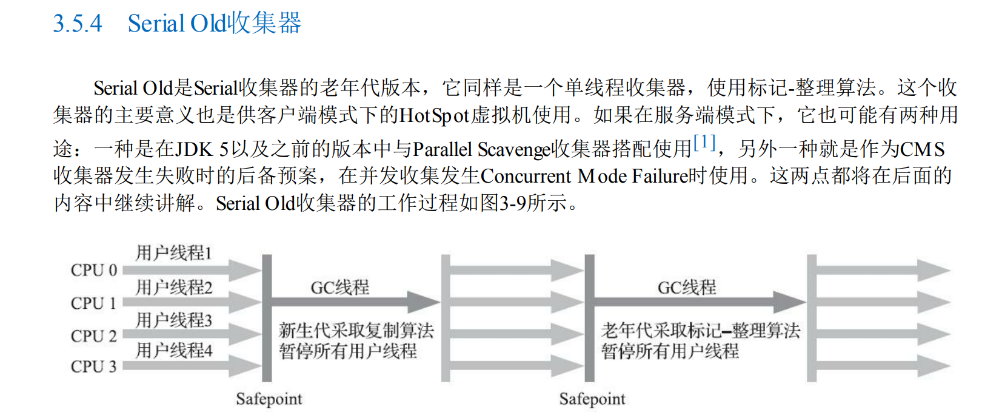
    </br></br>Serial Old收集器
</div>


#### Parallel Old 收集器

<div align='center'>
    
    </br></br>Parallel Old收集器
</div>


#### CMS 收集器

<div align='center'>
    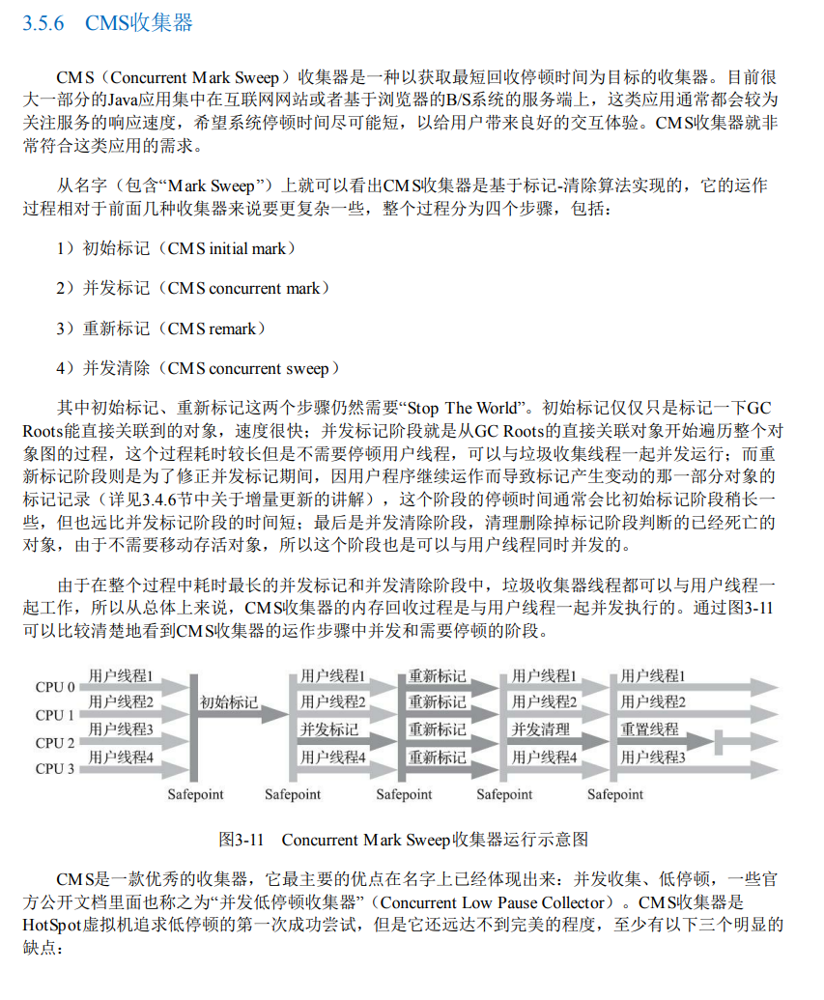
    
    
    </br></br>CMS收集器
</div>

#### G1（Garbage-First）收集器

<div align='center'>
    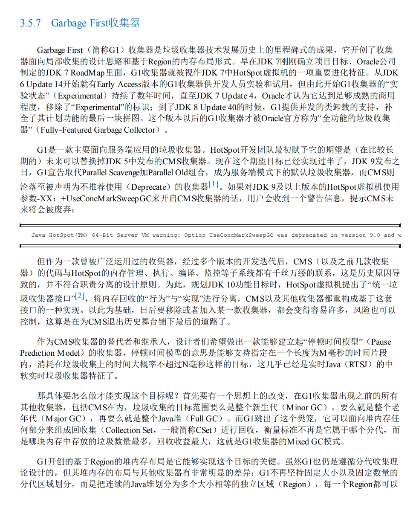
    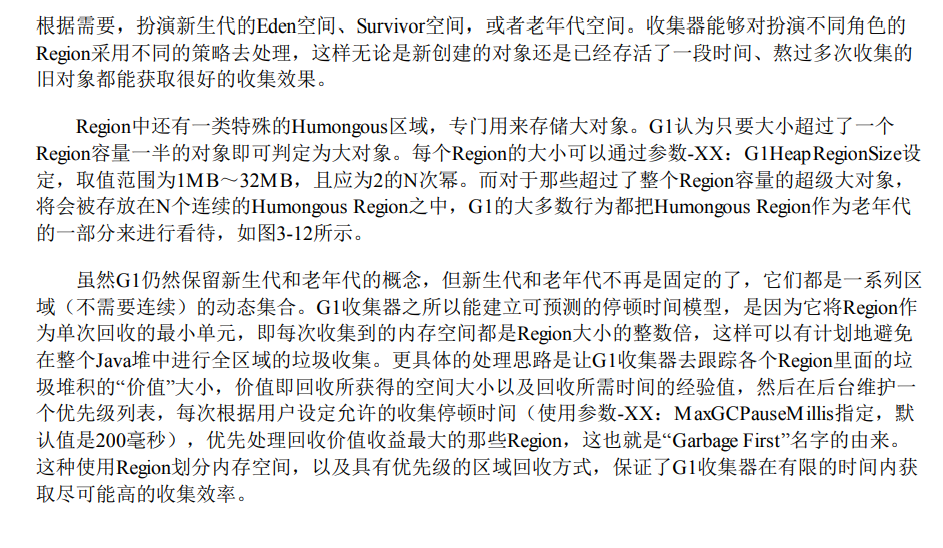
    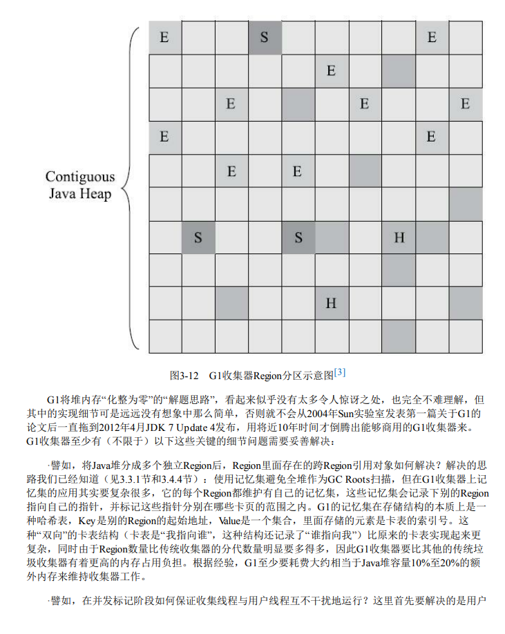
    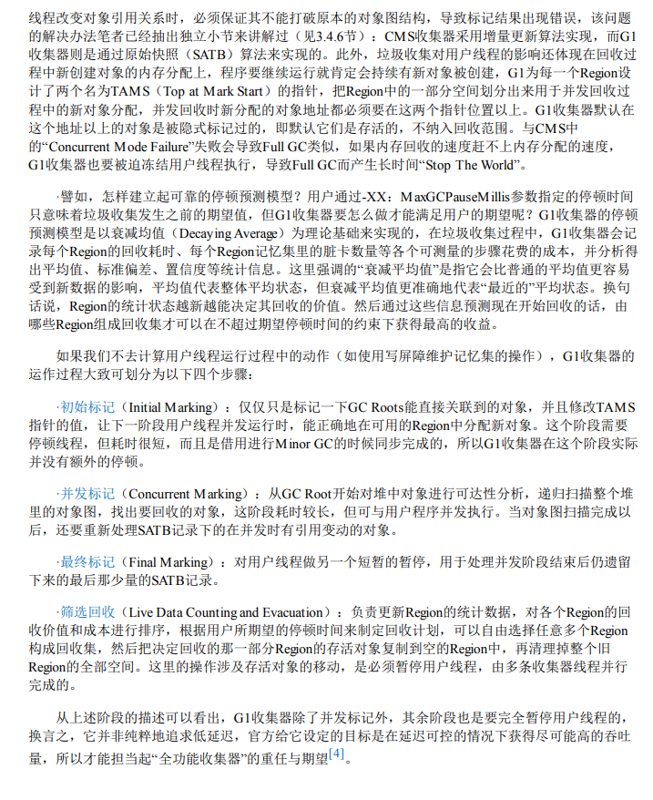
    
    
    </br></br>G1收集器
</div>


#### Epsilon（JDK11.0）低开销垃圾回收器

Epsilon 垃圾回收器的目标是开发一个控制内存分配，但是不执行任何实际的垃圾回收工作。它提供一个完全消极的 GC 实现，分配有限的内存资源，最大限度的降低内存占用和内存吞吐延迟时间各种垃圾回收器使用场景

#### ZGC（JDK11.0）可伸缩低延迟垃圾收集器

ZGC 即 Z Garbage Collector（垃圾收集器或垃圾回收器），这应该是 Java 11 中最为瞩目的特性，没有之一。ZGC 是一个可伸缩的、低延迟的垃圾收集器，主要为了满足如下目标进行设计：

- GC 停顿时间不超过 10ms
- 即能处理几百 MB 的小堆，也能处理几个 TB 的大堆
- 应用吞吐能力不会下降超过 15%（与 G1 回收算法相比）
- 方便在此基础上引入新的 GC 特性和利用 colord
- 针以及 Load barriers 优化奠定基础
- 当前只支持 Linux/x64 位平台 停顿时间在 10ms 以下，10ms 其实是一个很保守的数据，即便是 10ms 这个数据，也是 GC 调优几乎达不到的极值。根据 SPECjbb 2015 的基准测试，128G 的大堆下最大停顿时间才 1.68ms，远低于 10ms，和 G1 算法相比，改进非常明显。

JDK1.14之前只支持Linux/64 JDK1.14开始支持MacOs和Windows

```java
-XX:+UnlockExperimentalVMOptions -XX:+UseZGC
```

#### Shenandoah (JDK12.0) 一个低停顿垃圾收集器（实验阶段）

Java 12 中引入一个新的垃圾收集器：Shenandoah，它是作为一中低停顿时间的垃圾收集器而引入到 Java 12 中的，其工作原理是通过与 Java 应用程序中的执行线程同时运行，用以执行其垃圾收集、内存回收任务，通过这种运行方式，给虚拟机带来短暂的停顿时间。

Shenandoah 垃圾回收器是 Red Hat 在 2014 年宣布进行的一项垃圾收集器研究项目，旨在针对 JVM 上的内存收回实现低停顿的需求。该设计将与应用程序线程并发，通过交换 CPU 并发周期和空间以改善停顿时间，使得垃圾回收器执行线程能够在 Java 线程运行时进行堆压缩，并且标记和整理能够同时进行，因此避免了在大多数 JVM 垃圾收集器中所遇到的问题。

据 Red Hat 研发 Shenandoah 团队对外宣称，Shenandoah 垃圾回收器的暂停时间与堆大小无关，这意味着无论将堆设置为 200 MB 还是 200 GB，都将拥有一致的系统暂停时间，不过实际使用性能将取决于实际工作堆的大小和工作负载。

| 回收器                                                       | 特点                                                         | 参数                                                         | 应用场景                                                     |
| ------------------------------------------------------------ | ------------------------------------------------------------ | ------------------------------------------------------------ | ------------------------------------------------------------ |
| Serial                                                       | 新生代使用的垃圾收集器、复制算法、串行回收，会Stop the world | -XX:+UseSerialGC：使用串行垃圾收集器                         | 单CPU环境、运行在Client模式                                  |
| ParNew                                                       | 新生代、Serial多线程版本                                     | -XX:+UseParNewGC：使用ParNew收集器                    -XX:ParallelGCThreads"：指定垃圾收集的线程数量，ParNew默认开启的收集线程与CPU的数量相同； | 与CMS收集器配合工作，可控JVM参数较多，适用于Server模式下，减少系统停顿，提高系统响应速度 |
| Parallel Scavenge(JDK1.14 弃用Parallel Scavenge 和 Serial Old组合) | 新生代、关注吞吐量，JDK1.8默认收集器，与ParNew相似，采用复制算法，多线程收集，主要目标达到一个可控制的吞吐量 | -XX:MaxGCPauseMillis 控制最大垃圾收集停顿时间，大于0的毫秒数<br/>-XX:GCTimeRatio 设置垃圾收集时间占总时间的比率，0<n<100的整数,GCTimeRatio相当于设置吞吐量大小；<br/>-XX:+UseAdptiveSizePolicy  动态调整这些参数，以提供最合适的停顿时间或最大的吞吐量 | 适用于应用程序运行在多CPU上，对暂停时间没有特别高的要求，即程序主要在后台进行计算，而不需要与用户进行太多交互，eg.批量处理、订单处理、工资支付、科学计算的程序 |
| Serial Old                                                   | 老年代，单线程收集，标记整理算法                             |                                                              | 在CMS并发清除阶段系统继续运行，然后一些对象进入老年代，同时又变成垃圾对象，老年代内存不够，会自动使用Serial Old替换CMS，即强行Stop the world |
| Parallel Old                                                 | 老年代，标记整理，多线程收集，与Parallel Scavenge配合使用    |                                                              | 类似Parallel Scavenge                                        |
| CMS(JDK1.9 放弃使用 JDK1.14 禁用)                            | 老年代，标记清除，以获取最短回收停顿时间为目标，并发收集、低停顿 |                                                              | 与用户交互较多的场景；希望系统停顿时间最短，注重服务响应速度；常见的web、B/S系统的服务器上用 |
| G1                                                           | 充分利用多CPU、多核环境下的硬件优势，可以设置JVM停顿时间、新、老代混合回收、将JVM堆会分为多个Region | -XX:+UseG1GC 使用G1垃圾回收器<br/> -XX:MaxGCPauseMills  设置停顿时间 | 大内存机器（8G以上），大内存上CMS可能导致很久不回收，然后回收一次要很久，G1尽可能避免这种情况，可以控制每次回收时间 |

实际使用中大多为CMS+ParNew，以下为参数模板：

```
-Xms7500m -Xmx7500m 初始堆大小
-Xmn3000m # 新生代大小
-Xss512k  # 每个线程的堆栈大小
-XX:MaxMetaspaceSize=512m # 设置类元数据区的最大大小(限制Metaspace增长的上限，防止因为某些情况导致Metaspace无限的使用本地内存，影响到其他程序。在本机上该参数的默认值为4294967295B（大约4096MB）。)
-XX:MetaspaceSize=512m # 设置类元数据区的初始大小
-Dfile.encoding=UTF-8 # 系统文件编码格式为utf-8
-XX:+UseConcMarkSweepGC # 老年代使用CMS
-XX:+UseParNewGC # 年轻代使用ParNew
-XX:+UseCMSCompactAtFullCollection # 在FULL GC的时候， 对年老代的压缩 1.6版本后默认开启，不必显式设置，未来版本会废弃
-XX:CMSFullGCsBeforeCompaction=0  # 每次full gc整理内存碎片
-XX:CMSInitiatingOccupancyFraction=92 老年代占比92%触发full gc
-XX:SurvivorRatio=8 # Eden、Survivor比 8:1:1
-XX:+UseCMSInitiatingOccupancyOnly # 禁止hostspot自行触发CMS GC
-XX:+CMSScavengeBeforeRemark ## 在cms gc之前进行一次 minor gc 减少 remark的开销
-XX:+ParallelRefProcEnabled #并行处理 reference 加快final remak
-XX:+CMSClassUnloadingEnabled
-XX:+DisableExplicitGC ## 防止某些”大神“在代码里边执行 System.gc()
-XX:+CMSParallelInitialMarkEnabled ## 初始标记 多线程并行 一般没必要，初始标记都很快
-XX:+CMSClassUnloadingEnabled # cms回收对永久代回收,CMS收集器默认不会对永久代进行垃圾回收
-XX:ParallelGCThreads=$CPU_Count 并行收集器的线程数 此值最好配置与处理器数目相等 同样适用于CMS
-Xloggc:${PROJECT_DIR}/logs/gc.log 
-XX:+PrintGCDateStamps
-XX:+PrintGCDetails
-XX:+HeapDumpOnOutOfMemoryError
-XX:HeapDumpPath=${PROJECT_DIR}/logs/heapdump.hprof
```


## 类加载机制


<div align='center'>
    
    </br></br>类的声明周期
</div>
### 类加载过程

#### 加载

1. 通过一个类的全限定名来获取定义此类的二进制字节流。
2. 将这个字节流所代表的静态存储结构转化为方法区的运行时数据结构。
3. 在内存中生成一个代表这个类的java.lang.Class对象，作为方法区这个类的各种数据的访问入口。

#### 验证

为了确保Class文件的字节流中包含的信息符合当前虚拟机的要求，并且不会危害虚拟机自身的安全。

#### 文件格式验证

验证字节流是否符合Class文件格式的规范，并且能被当前版本的虚拟机处理。

包含（部分）：

- 是否以魔数0xCAFEBABE开头
- 主、次版本号是否再当前虚拟机处理范围内
- 常量池中的常量是否有不被支持的常量类型（检查常量tag标志）
- 指向常量的各种索引值是否有指向不存在的常量或不符合类型的常量
- CONSTANT_Utf8_info型的常量中是否有不符合UTF8编码的数据
- Class文件中各个部分及文件本身是否有被删除的或附加的其他信息

该阶段验证基于二进制字节流，通过该阶段验证，字节流会被存入内存中的方法区，后续的验证阶段都是基于方法区的存储结构进行的，不再直接操作字节流。

#### 元数据验证

对字节码描述的信息进行语义分析，以保证其描述的信息符合Java语言规范的要求。

包含（部分）：

- 这个类是否有父类（除了java.lang.Object之外，所有的类都应当有父类）
- 这个类的父类是否继承了不允许被继承的类（被final修饰的类）
- 如果这个类不是抽象类，是否实现了其父类或接口中要求实现的所有方法
- 类中的字段、方法是否与父类产生矛盾（例如覆盖了父类的final字段，或者出现不符合规则的方法重载）

该阶段验证目的是对类的元数据信息进行语义校验，保证不存在不符合Java语言规范的元数据信息。

#### 字节码验证

该阶段主要目的是通过数据流和控制流分析，确定程序语义是合法的、符合逻辑的。该阶段对类的方法体进行校验分析，保证被校验的类的方法在运行时不会做出危害虚拟机的安全事件。

StackMapTable属性，描述了方法体的所有的基本块开始时本地变量表和操作栈应有的状态，验证时期只需检查该属性中的记录是否合法即可。

#### 符号引用验证

对类自身以外（常量池中的各种符号引用）的信息进行匹配性校验，包含（部分）：

- 符号引用中通过字符串描述的全限定名是否能找到对应的类
- 在指定类中是否存在符合方法的字段描述符以及简单名称所描述的方法和字段
- 符号引用中的类、字段、方法的访问性（private、protected、public、default）是否可被当前类访问

如果所运行的全部代码（包括自己编写以及第三方包中的代码）已经被反复使用和验证过，那么实施阶段可以考虑使用-Xverify:none参数关闭大部分的类的验证措施，用以缩短虚拟机类加载的时间。

#### 准备

正式为类变量分配内存并设置类变量初始值（该数据类型的零值，赋初始值在初始化阶段）的阶段，这些变量所使用的内存都将在方法区中进行分配。这里进行内存分配的仅包含类变量（被static修饰的变量），而不包括实例变量，实例变量将会在对象实例化时随着对象一起分配在Java堆中。

| 数据类型  | 零值     |
| --------- | -------- |
| int       | 0        |
| long      | 0L       |
| short     | (short)0 |
| char      | '\u0000' |
| byte      | (byte) 0 |
| boolean   | false    |
| float     | 0.0f     |
| double    | 0.0d     |
| reference | null     |

如果类字段属性表存在ConstantValue属性，那么准备阶段变量就会被初始化为ConstantValue属性所指定的值，例如：

```java
public static final int value = 123;	
```

#### 解析

该阶段虚拟机将常量池内的符号引用替换为直接引用的过程。

- 符号引用（Symbolic References）：符号引用以一组符号来描述所引用的目标，符号可以是任何形式的字面量，只要使用时能无歧义地定位到目标即可。符号引用与虚拟机实现的内存布局无关，引用的目标不一定已经加载到内存中。
- 直接引用（Direct References）：直接引用可以是直接指向目标的指针、相对偏移量或是一个能间接定位到目标的句柄。直接引用和虚拟机实现的内存布局相关的，同一个符号引用在不同虚拟机实例上翻译出来的直接引用一般不会相同。如果有了直接引用，那引用的目标必定已经在内存中存在。

解析动作主要针对类或接口、字段、类方法、接口方法、方法类型、方法句柄和调用点限定符7类符号引用进行，分别对应于常量池的CONSTANT_Class_info、CONSTANT_Fieldref_info、CONSTANT_Methodref_info、CONSTANT_InterfaceMethodref_info、CONSTANT_MethodType_info、CONSTANT_MethodHandle_infohe和CONSTANT_InvokeDynamic_info 7种常量类型。

#### 初始化

该阶段为类加载过程的最后一步，类加载的前面几个阶段除了加载阶段用户应用程序可以通过自定义类加载器参与外，其余动作完全由虚拟机主导和控制。到了初始化阶段，才真正开始执行类中定义的Java程序代码（字节码）。

### 类加载器

类加载阶段中的“通过一个类的全限定名来获取描述此类的二进制字节流”这个动作放到Java虚拟机外部去实现，以便让应用程序自己决定如何获取所需要的类。实现这个动作的代码模块称为“类加载器”。

#### 双亲委派模型

站在Java虚拟机的角度来看，只存在两种不同的类加载器：一种是启动类加载器（Bootstrap ClassLoader），这个类加载器使用C++语言实现（仅限于HotSpot），是虚拟机自身的一部分；另外一种就是其他所有 的类加载器，这些类加载器都由Java语言实现，独立存在于虚拟机外部，并且全都继承自抽象类 java.lang.ClassLoader。并且这些加载器之间并不是继承关系，而是组合关系。

<div align='center'>
    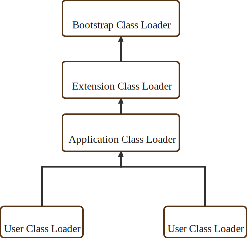
	</br></br>类加载器双亲委派模型
</div>

双亲委派模型工作过程：如果一个类加载器收到了类加载的请求，它首先不会自己去尝试加载这个类，而是把这个请求委派给自己的父类加载器去完成，每一个层次的类加载器都是如此，因此所有的加载请求最终都应该传送到最顶层的启动类加载器中，只有当父类加载器反馈自己无法完成这个加载请求（它的搜索范围中没有找到所需的类）时，子加载器才会尝试自己去完成加载。

优点：java原生的类具有最高优先级（例如java.lang.Object），即便用户创建一个与原生类相同的类（java.lang.Object），也能够始终保证原生的类被正确加载。

双亲委派模型实现（java.lang.ClassLoader）

先检查该类是否被加载，若没有则调用父类加载器的loadClass()方法，若父类加载器为空则使用启动类加载器加载，若父类加载器加载失败，抛出ClassNotFoundException异常后调用自己的findClass()方法尝试进行加载。

```java
   protected Class<?> loadClass(String name, boolean resolve)
        throws ClassNotFoundException
    {
        synchronized (getClassLoadingLock(name)) {
            // First, check if the class has already been loaded
            Class<?> c = findLoadedClass(name);
            if (c == null) {
                long t0 = System.nanoTime();
                try {
                    if (parent != null) {
                        c = parent.loadClass(name, false);
                    } else {
                        c = findBootstrapClassOrNull(name);
                    }
                } catch (ClassNotFoundException e) {
                    // ClassNotFoundException thrown if class not found
                    // from the non-null parent class loader
                }

                if (c == null) {
                    // If still not found, then invoke findClass in order
                    // to find the class.
                    long t1 = System.nanoTime();
                    c = findClass(name);

                    // this is the defining class loader; record the stats
                    sun.misc.PerfCounter.getParentDelegationTime().addTime(t1 - t0);
                    sun.misc.PerfCounter.getFindClassTime().addElapsedTimeFrom(t1);
                    sun.misc.PerfCounter.getFindClasses().increment();
                }
            }
            if (resolve) {
                resolveClass(c);
            }
            return c;
        }
    }
```

#### 破坏双亲委派模型

##### 第一次破坏

JDK1.2之前，那时候还没有双亲委派模型，但已经有了ClassLoader这个抽象类，已经有人继承这个抽象类，重写loadClass方法来实现用户自定义类加载器。

JDK1.2引入双亲委派模型，为了向前兼容，loadClass这个方法还得保留，新出了个findClass方法让用户重写，并呼吁用户不要重写loadClass而只重写findClass。

因为双亲委派的逻辑在loadClass上，但是又允许重写loadClass，重写了之后就可以破坏双亲委派模型了。

##### 第二次破坏

双亲委派模型本身缺陷导致。

Service Privider Interface（SPI）

线程上下文类加载器。

JNDI、JDBC、JCE、JAXB和JBI等。在JDK 6时，当SPI的服务提供者多于一个的时候，代码就只能根据具体提供 者的类型来硬编码判断，为了消除这种极不优雅的实现方式，JDK提供了 java.util.ServiceLoader类，以META-INF/services中的配置信息，辅以责任链模式，这才算是给SPI的加 载提供了一种相对合理的解决方案。

##### 第三次破坏

用户对程序动态性的追求而导致的，这里所说的“动态 性”指的是一些非常“热”门的名词：代码热替换（Hot Swap）、模块热部署（Hot Deployment）等。

OSGi实现模块化热部署的关键是它自定义的类加载器机制的实现，每一个程序模块（OSGi中称为 Bundle）都有一个自己的类加载器，当需要更换一个Bundle时，就把Bundle连同类加载器一起换掉以实 现代码的热替换。在OSGi环境下，类加载器不再双亲委派模型推荐的树状结构，而是进一步发展为更 加复杂的网状结构，当收到类加载请求时，OSGi将按照下面的顺序进行类搜索：

1）将以java.*开头的类，委派给父类加载器加载。 2）否则，将委派列表名单内的类，委派给父类加载器加载。 3）否则，将Import列表中的类，委派给Export这个类的Bundle的类加载器加载。 4）否则，查找当前Bundle的ClassPath，使用自己的类加载器加载。 5）否则，查找类是否在自己的Fragment Bundle中，如果在，则委派给Fragment Bundle的类加载器 加载。 6）否则，查找Dynamic Import列表的Bundle，委派给对应Bundle的类加载器加载。 7）否则，类查找失败。

##### 第四次破坏

JDK9引入模块系统后。

当收到类加载请求，会先判断该类在具名模块中是否有定义，如果有定义就自己加载了，没的话再委派给父类。

##### JAVA模块化系统（Java Platform Module System，JPMS）

<div align='center'>
    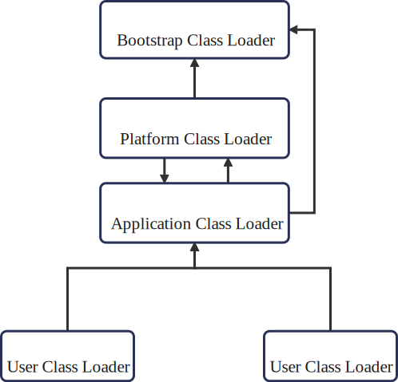
	</br></br>JDK1.9后类加载器双亲委派模型
</div>

JDK 9中虽然仍然维持着三层类加载器和双亲委派的架构，但类加载的委派关系也发生了 变动。当平台及应用程序类加载器收到类加载请求，在委派给父加载器加载前，要先判断该类是否能 够归属到某一个系统模块中，如果可以找到这样的归属关系，就要优先委派给负责那个模块的加载器 完成加载，也许这可以算是对双亲委派的第四次破坏。

<div align='center'>
    
	</br></br>JDK1.9后类加载器双亲委派模型
</div>


## [内存模型](https://zhuanlan.zhihu.com/p/29881777)

<div align='center'>
    
    </br></br>实际硬件中处理器、高速缓存、主内存间的交互关系
</div>


JAVA Memory Model（JMM），屏蔽掉各种硬件和操作系统的内存访问差异，以实现让Java程序在各种平台下都能达到一致的内存访问效果。

主要目标：定义程序中各个变量的访问规则，即在虚拟机中将变量存储到内存和从内存中取出变量这样的底层细节。这里的变量包括了实例字段、静态字段和构成数组对象的元素，但不包括局部变量与方法参数，因为后者是线程私有的。

<div align='center'>
    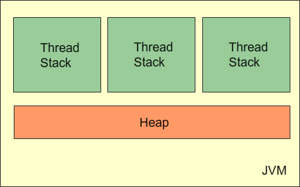
    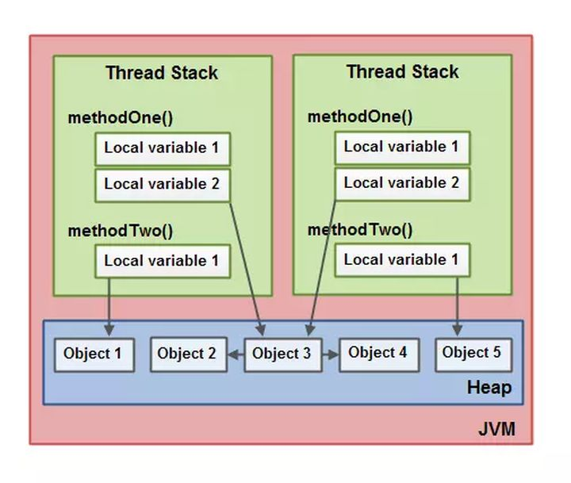
    </br></br>JMM（内存模型）
</div>

## JVM调优


# 大数据与分布式

## 常用的分布式协议与理论

## Kubernetes

### 入门


<div align='center'>
    
    
    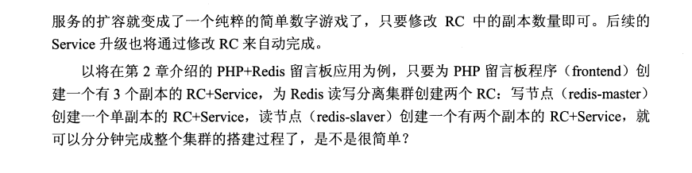
    </br></br>k8s基础知识
</div>

## 分布式操作系统

### 概述

#### 什么是分布式操作系统

是一些独立的计算机的组合，但是对于该系统的用户来说，系统就像一台计算机一样

##### 分布式操作系统相对于集中式操作系统的优点

| 项目         | 描述                                       |
| ------------ | ------------------------------------------ |
| 经济         | 微处理机提供了比大型主机更好的性价比       |
| 速度         | 分布式系统总的计算能力比单个大型主机的更强 |
| 固有的分布性 | 一些应用设计到空间上分散的机器             |
| 可靠性       | 如果一台机器崩溃，整个系统还可以运转       |
| 渐增         | 计算能力可以逐渐有所增加                   |

##### 分布式系统相对于孤立的（个人）计算机的优点

| 项目     | 描述                                           |
| -------- | ---------------------------------------------- |
| 数据共享 | 允许多个用户访问一个公共的数据库               |
| 设备共享 | 允许多个用户共享昂贵的外围设备（如彩色打印机） |
| 通信     | 使得人们之间的通信更加容易，如通过电子邮件     |
| 灵活性   | 用最有效的方式将工作负荷分配到可用的机器上     |


<div align='center'>
    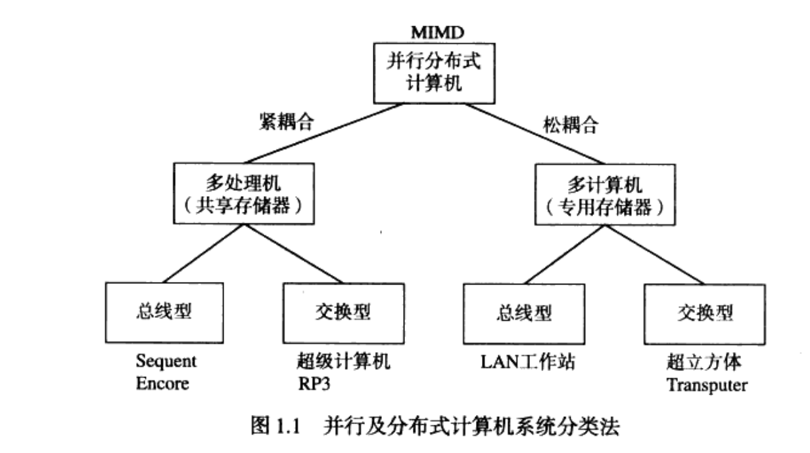
    </br></br>并行及分布式计算机系统分类法
</div>
# 生产力

## Java命令行调试

### 查看字节码

```java
javap -c xxx.class
```

## IDEA

### 快捷键

### 插件

#### Alibaba Java Coding Guidelines

Alibaba 编码规范

#### LeetCode Editor

LeetCode刷题

#### Rainbow Brackets

彩虹括号

#### Background Image Plus

更改IDEA背景

#### Maven

#### Lombok

注解 web开发

#### Bytecode Editor

查看字节码

选中要查看的.class文件然后点上方菜单view->Show ByteCode