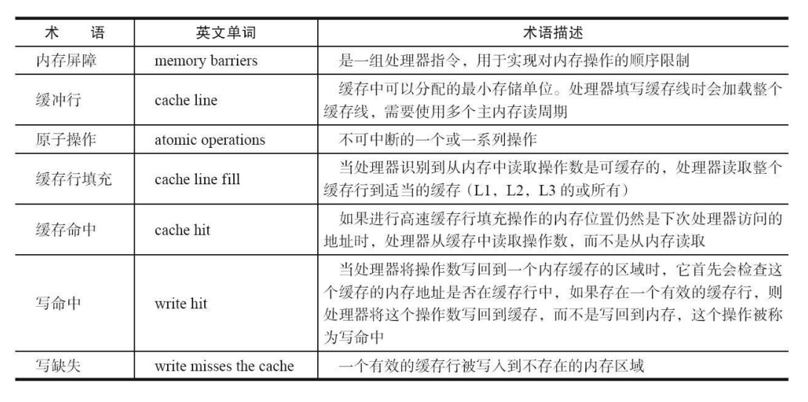

# 并发编程的挑战

## 上下文切换

对于单核CPU来说也可以支持多线程，CPU通过给每个线程分配时间片也实现这个机制。当一个线程执行完一个时间片后，CPU会进行线程切换，在切换前会保存当前线程状态，以便于下次切换回这个线程时，线程可以继续执行。

多线程不一定比单线程快，因为有线程切换等原因。

- 使用Lmbench3工具可以测量上下文切换的时长。
- 使用vmstat测量上下文切换的次数（Content Switch，CS表示上下文切换次数）。

### 如何减少上下文切换

主要方法有无锁并发编程、CAS算法、使用最少线程和使用协程。

- 无锁并发编程。多线程竞争锁时，会引起上下文切换，所以多线程处理数据时，可 以用一些办法来避免使用锁，如将数据的 ID 按照 Hash 算法取模分段，不同的线程 处理不同段的数据。
- CAS 算法。Java 的 Atomic 包使用 CAS 算法来更新数据，而不需要加锁。 
- 使用最少线程。避免创建不需要的线程，比如任务很少，但是创建了很多线程来处 理，这样会造成大量线程都处于等待状态。 
- 协程：在单线程里实现多任务的调度，并在单线程里维持多个任务间的切换。

### 减少上下文切换实战

通过减少WAITING的线程，等待的线程数少了，上下文切换次数也就少了。

## 死锁

```java
public class Main {
    private static String A = "A";
    private static String B = "B";
    public static void main(String[] args) {
        new Main().deadLock();
    }
    private void deadLock() {
        Thread t1 = new Thread(new Runnable() {
            @Override
            public void run() {
                synchronized (A) {
                    try {
                        Thread.sleep(2000);
                    } catch (InterruptedException e) {
                        e.printStackTrace();
                    }
                    synchronized (B) {
                        System.out.println("1");
                    }
                }
            }
        });
        Thread t2 = new Thread(new Runnable() {
            @Override
            public void run() {
                synchronized (B) {
                    synchronized (A) {
                        System.out.println("2");
                    }
                }
            }
        });
        t1.start();
        t2.start();
    }
}
```

避免死锁的几个常见方法：

- 避免一个线程同时获取多个锁。
- 避免一个线程在锁内同时占用多个资源，尽量保证每个锁只占用一个资源。
- 尝试使用定时锁，使用 lock.tryLock（timeout）来替代使用内部锁机制。
- 对于数据库锁，加锁和解锁必须在一个数据库连接里，否则会出现解锁失败的情况。

## 资源限制的挑战

### 什么是资源限制

硬件资源限制有带宽、硬盘读写速度、CPU速度，软件资源限制有数据库连接数和socket连接数。并发编程时要考虑这些因素。

### 资源限制引发的问题

多线程造成资源瓶颈时，多线程相比单线程不会加快程序运行速度。

### 如何解决资源限制的问题

根据不同的资源限制调整程序的并发度。

# Java并发机制的底层实现原理

## volatile的应用

volatile是轻量级的synchronized，它在多处理器开发中保证了共享变量的“可见性”。可见性的意思是当一个线程修改一个共享变量时，另外一个线程能读到这个修改的值。如果使用得当volatile比synchronized成本低，因为它不会引起线程上下文切换和调度。

### volatile的定义与实现原理

Java 语言规范第 3 版中对 volatile 的定义如下：Java 编程语言允许线程访问共享变 量，为了确保共享变量能被准确和一致地更新，线程应该确保通过排他锁单独获得这个变量。

<div align='center'>
    
    <br/><br/>CPU术语定义
</div>

有volatile变量修饰的共享变量进行写操作的时候在汇编层会有一个Lock指令。Lock前缀的指令在多核处理器下会引发两件事情。

- 将当前处理器缓存行的数据写回到系统内存。
- 写会操作会导致其他CPU里缓存了该内存地址的数据无效。

volatile实现原则：

1. ##### **==Lock前缀指令会引起处理器缓存写会内存。==**

   Lock信号会锁缓存，一般不会锁总线（开销太大）。

2. **==一个处理器的缓存写回到内存会导致其他处理器的缓存无效。==**

   IA-32和Intel 64处理器能嗅探其他处理器访问系统内存和它们的内部缓存。处理器使用嗅探技术保证它的内部缓存、系统内存和其他处理器的缓存的数据在总线上保持一致。如果通过嗅探一个处理器来检测其他处理器打算写内存地址，而这个地址当前处于共享状态，那么正在嗅探的处理器将使它的缓存行无效，在下次访问相同内存地址时，强制执行缓存行填充。

### volatile的使用优化

JDK7的并发包新增LinkedTransferQueue，会将队头、队尾节点通过追加字节方式追加到64B（一个缓存行），这样会保证队头、队尾节点不在同一缓存行，当修改其中一个的时候不会锁住另一个。

```java
/**
* 队列中的头部节点
*/
private transient final PaddedAtomicReference<QNode> head;
/**
* 队列中的尾部节点
*/
private transient final PaddedAtomicReference<QNode> tail;
static final class PaddedAtomicReference<T> extends AtomicReference T>
{
 // 使用很多 4 个字节的引用追加到 64 个字节
 Object p0, p1, p2, p3, p4, p5, p6, p7, p8, p9, pa, pb, pc, pd, pe;
 PaddedAtomicReference(T r) {
 super(r);
}
}
public class AtomicReference<V> implements java.io.Serializable {
 private volatile V value;
 // 省略其他代码
}
```


并不是所有的volatile变量都应该增加到64B，在两种场景下都不应该使用追加字节的方式。

1. 缓存行非64B宽的处理器。
2. 共享变量不会被频繁地写。

这种追加字节的方式在java7中可能不生效，它会淘汰或重新排序无用字段，需要使用其他追加字节的方式。

## synchronized的实现原理与应用

Java中的每一个对象都可以作为锁。具体表现为以下3中形式：

1. 对于普通同步方法，锁是当前实例对象。
2. 对于静态同步方法，锁是当前类的Class对象。
3. 对于同步方法块，锁是Synchronized括号里配置的对象。

JVM基于进入和退出Monitor对象来实现方法和代码块同步，但两者实现细节不同。代码块同步是使用monitorenter和monitorexit指令实现的，而方法同步是使用另外一种方式实现的。


