# 并发编程的挑战

## 上下文切换

对于单核CPU来说也可以支持多线程，CPU通过给每个线程分配时间片也实现这个机制。当一个线程执行完一个时间片后，CPU会进行线程切换，在切换前会保存当前线程状态，以便于下次切换回这个线程时，线程可以继续执行。

多线程不一定比单线程快，因为有线程切换等原因。

- 使用Lmbench3工具可以测量上下文切换的时长。
- 使用vmstat测量上下文切换的次数（Content Switch，CS表示上下文切换次数）。

### 如何减少上下文切换

主要方法有无锁并发编程、CAS算法、使用最少线程和使用协程。

- 无锁并发编程。多线程竞争锁时，会引起上下文切换，所以多线程处理数据时，可 以用一些办法来避免使用锁，如将数据的 ID 按照 Hash 算法取模分段，不同的线程 处理不同段的数据。
- CAS 算法。Java 的 Atomic 包使用 CAS 算法来更新数据，而不需要加锁。 
- 使用最少线程。避免创建不需要的线程，比如任务很少，但是创建了很多线程来处 理，这样会造成大量线程都处于等待状态。 
- 协程：在单线程里实现多任务的调度，并在单线程里维持多个任务间的切换。

### 减少上下文切换实战

通过减少WAITING的线程，等待的线程数少了，上下文切换次数也就少了。

## 死锁

```java
public class Main {
    private static String A = "A";
    private static String B = "B";
    public static void main(String[] args) {
        new Main().deadLock();
    }
    private void deadLock() {
        Thread t1 = new Thread(new Runnable() {
            @Override
            public void run() {
                synchronized (A) {
                    try {
                        Thread.sleep(2000);
                    } catch (InterruptedException e) {
                        e.printStackTrace();
                    }
                    synchronized (B) {
                        System.out.println("1");
                    }
                }
            }
        });
        Thread t2 = new Thread(new Runnable() {
            @Override
            public void run() {
                synchronized (B) {
                    synchronized (A) {
                        System.out.println("2");
                    }
                }
            }
        });
        t1.start();
        t2.start();
    }
}
```

避免死锁的几个常见方法：

- 避免一个线程同时获取多个锁。
- 避免一个线程在锁内同时占用多个资源，尽量保证每个锁只占用一个资源。
- 尝试使用定时锁，使用 lock.tryLock（timeout）来替代使用内部锁机制。
- 对于数据库锁，加锁和解锁必须在一个数据库连接里，否则会出现解锁失败的情况。

## 资源限制的挑战

### 什么是资源限制

硬件资源限制有带宽、硬盘读写速度、CPU速度，软件资源限制有数据库连接数和socket连接数。并发编程时要考虑这些因素。

### 资源限制引发的问题

多线程造成资源瓶颈时，多线程相比单线程不会加快程序运行速度。

### 如何解决资源限制的问题

根据不同的资源限制调整程序的并发度。

# Java并发机制的底层实现原理

## volatile的应用

volatile是轻量级的synchronized，它在多处理器开发中保证了共享变量的“可见性”。可见性的意思是当一个线程修改一个共享变量时，另外一个线程能读到这个修改的值。如果使用得当volatile比synchronized成本低，因为它不会引起线程上下文切换和调度。

### volatile的定义与实现原理

Java 语言规范第 3 版中对 volatile 的定义如下：Java 编程语言允许线程访问共享变 量，为了确保共享变量能被准确和一致地更新，线程应该确保通过排他锁单独获得这个变量。

<div align='center'>
    
    <br/><br/>CPU术语定义
</div>

有volatile变量修饰的共享变量进行写操作的时候在汇编层会有一个Lock指令。Lock前缀的指令在多核处理器下会引发两件事情。

- 将当前处理器缓存行的数据写回到系统内存。
- 写会操作会导致其他CPU里缓存了该内存地址的数据无效。

volatile实现原则：

1. ##### **==Lock前缀指令会引起处理器缓存写会内存。==**

   Lock信号会锁缓存，一般不会锁总线（开销太大）。

2. **==一个处理器的缓存写回到内存会导致其他处理器的缓存无效。==**

   IA-32和Intel 64处理器能嗅探其他处理器访问系统内存和它们的内部缓存。处理器使用嗅探技术保证它的内部缓存、系统内存和其他处理器的缓存的数据在总线上保持一致。如果通过嗅探一个处理器来检测其他处理器打算写内存地址，而这个地址当前处于共享状态，那么正在嗅探的处理器将使它的缓存行无效，在下次访问相同内存地址时，强制执行缓存行填充。

### volatile的使用优化

JDK7的并发包新增LinkedTransferQueue，会将队头、队尾节点通过追加字节方式追加到64B（一个缓存行），这样会保证队头、队尾节点不在同一缓存行，当修改其中一个的时候不会锁住另一个。

```java
/**
* 队列中的头部节点
*/
private transient final PaddedAtomicReference<QNode> head;
/**
* 队列中的尾部节点
*/
private transient final PaddedAtomicReference<QNode> tail;
static final class PaddedAtomicReference<T> extends AtomicReference T>
{
 // 使用很多 4 个字节的引用追加到 64 个字节
 Object p0, p1, p2, p3, p4, p5, p6, p7, p8, p9, pa, pb, pc, pd, pe;
 PaddedAtomicReference(T r) {
 super(r);
}
}
public class AtomicReference<V> implements java.io.Serializable {
 private volatile V value;
 // 省略其他代码
}
```


并不是所有的volatile变量都应该增加到64B，在两种场景下都不应该使用追加字节的方式。

1. 缓存行非64B宽的处理器。
2. 共享变量不会被频繁地写。

这种追加字节的方式在java7中可能不生效，它会淘汰或重新排序无用字段，需要使用其他追加字节的方式。

## synchronized的实现原理与应用

Java中的每一个对象都可以作为锁。具体表现为以下3中形式：

1. 对于普通同步方法，锁是当前实例对象。
2. 对于静态同步方法，锁是当前类的Class对象。
3. 对于同步方法块，锁是Synchronized括号里配置的对象。

JVM基于进入和退出Monitor对象来实现方法和代码块同步，但两者实现细节不同。代码块同步是使用monitorenter和monitorexit指令实现的，而方法同步是使用另外一种方式实现的。

### Java对象头

synchronized用的锁是存在Java对象头里的。如果对象是数组类型，则虚拟机用 3 个字宽（Word）存储对象头，如果对象是非数组类型，则用 2 字宽存储对象头。

<div align='center'>
    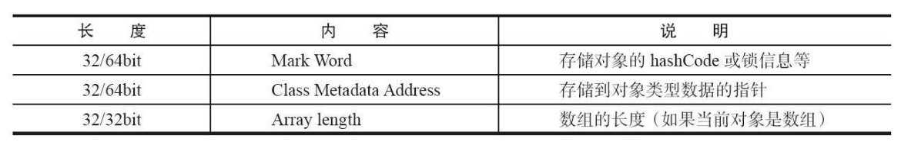
    <br/><br/>Java对象头的长度
</div>

Java 对象头里的 Mark Word 里默认存储对象的 HashCode、分代年龄和锁标记位。32 位 JVM 的 Mark Word 的默认存储结构如下。

<div align='center'>
    
    <br/><br/>Java对象头的存储结构
</div>

在运行期间，Mark Word 里存储的数据会随着锁标志位的变化而变化。

<div align='center'>
    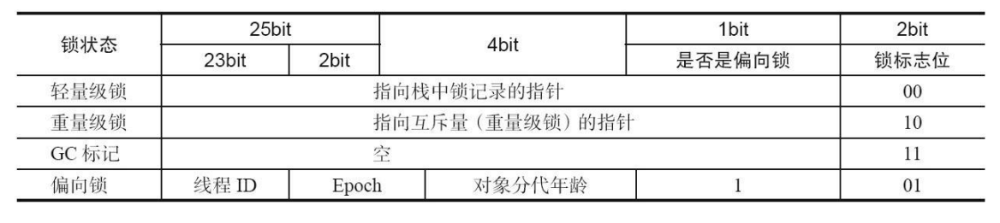
    <br/><br/>Mark Word的状态变化
    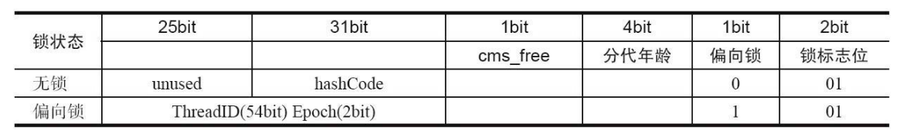
    <br/><br/>Mark Word的存储结构（64bit）
</div>

### 锁的升级与对比

锁一共有4中状态，级别从低到高依次是：无锁状态、偏向锁状态、轻量级锁状态和重量级锁状态（随竞争情况逐渐升级）锁可以升级但不能降级，目的是为了提高获得锁和释放锁的效率。

#### 偏向锁

大多数情况下，锁不仅不存在多线程竞争，且总是由同一线程多次获得，引入偏向锁。当一个线程访 问同步块并获取锁时，会在对象头和栈帧中的锁记录里存储锁偏向的线程 ID，以后该线 程在进入和退出同步块时不需要进行 CAS 操作来加锁和解锁，只需简单地测试一下对象头的 Mark Word 里是否存储着指向当前线程的偏向锁。如果测试成功，表示线程已经获得了锁。如果测试失败，则需要再测试一下 Mark Word 中偏向锁的标识是否设置成 1 （表示当前是偏向锁）：如果没有设置，则使用 CAS 竞争锁；如果设置了，则尝试使用 CAS 将对象头的偏向锁指向当前线程。

- 偏向锁的获得和撤销

	<div align='center'>
	    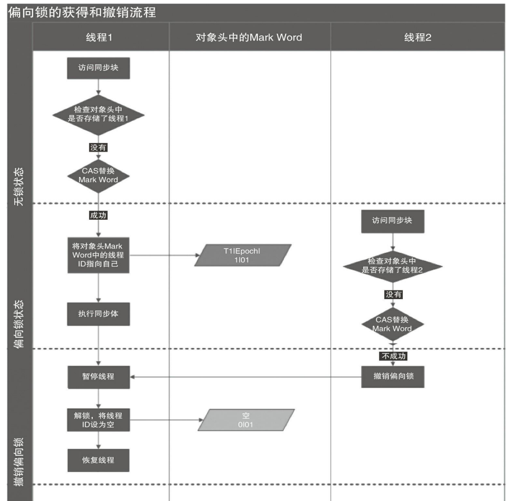
	    <br/><br/>偏向锁的获得和撤销
	</div>

- 关闭偏向锁

	偏向锁在 Java 6 和 Java 7 里是默认启用的，但是它在应用程序启动几秒钟之后才激 活，如有必要可以使用 JVM 参数来关闭延迟：-XX:BiasedLockingStartupDelay=0。如果 你确定应用程序里所有的锁通常情况下处于竞争状态，可以通过 JVM 参数关闭偏向锁： -XX:- UseBiasedLocking=false，那么程序默认会进入轻量级锁状态。

#### 轻量级锁

<div align='center'>
    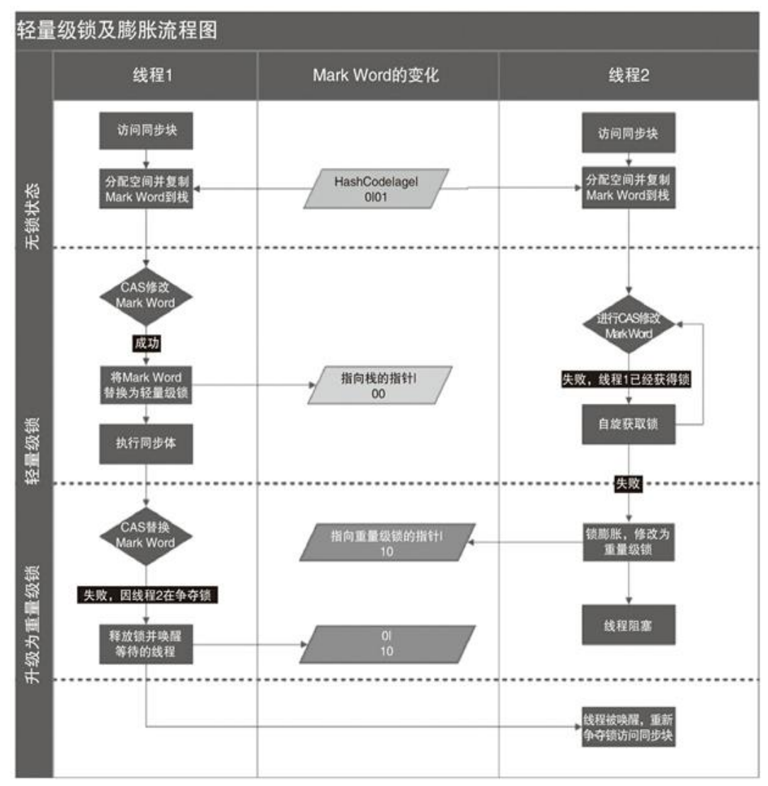
    <br/><br/>轻量级锁及膨胀流程图
</div>

- 轻量级锁加锁

	线程在执行同步块之前，JVM 会先在当前线程的栈桢中创建用于存储锁记录的空 间，并将对象头中的 Mark Word 复制到锁记录中，官方称为 Displaced Mark Word。然后 线程尝试使用 CAS 将对象头中的 Mark Word 替换为指向锁记录的指针。如果成功，当前线程获得锁，如果失败，表示其他线程竞争锁，当前线程便尝试使用自旋来获取锁。

- 轻量级锁解锁

	轻量级解锁时，会使用原子的 CAS 操作将 Displaced Mark Word替换回到对象头， 如果成功，则表示没有竞争发生。如果失败，表示当前锁存在竞争，锁就会膨胀成重量级锁。

	因为自旋会消耗 CPU，为了避免无用的自旋（比如获得锁的线程被阻塞住了），一 旦锁升级成重量级锁，就不会再恢复到轻量级锁状态。当锁处于这个状态下，其他线程 试图获取锁时，都会被阻塞住，当持有锁的线程释放锁之后会唤醒这些线程，被唤醒的 线程就会进行新一轮的夺锁之争。

- 锁的优缺点

	<div align='center'>
	    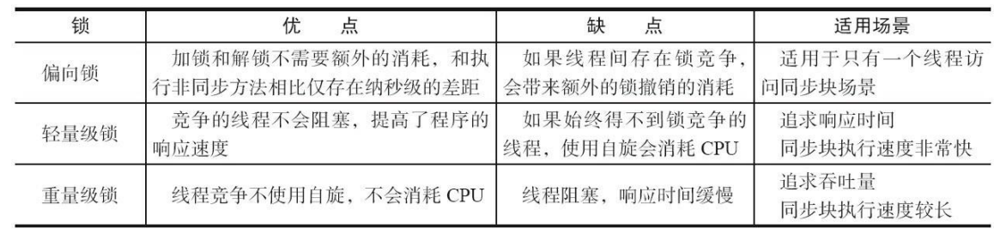
	    <br/><br/>锁的优缺点对比
	</div>

## 原子操作的实现原理

原子操作（atomic operation）：不可被中断的一个或一系列操作。

<div align='center'>
    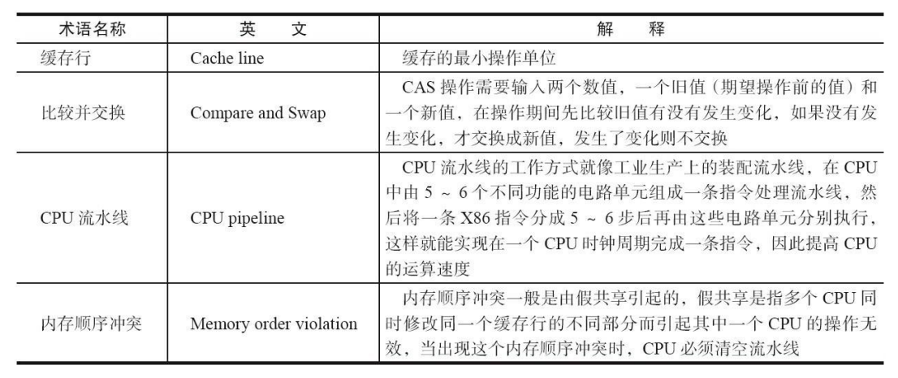
    <br/><br/>相关术语
</div>

### 处理器如何实现原子操作

处理器会自动保证基本的内存操作（读取或写入一个字节）的原子性。处理器提供总线锁定和缓存锁定两个机制来保证复杂内存操作的原子性。

#### 使用总线锁保证原子性

LOCK#信号，当一个处理器在总线上输出此信号时，其他处理器的请求将被阻塞住，那么该处理器可以独占共享内存。

#### 使用缓存锁保证原子性

总线锁开销大（锁期间CPU不能与内存通信）。如果锁住的数据在缓存中，会将数据写回主存，通过缓存一致性来保证原子性。

但是会有两种情况下处理器不会使用缓存锁定：

1. 操作的数据不能被缓存到处理器缓存中，或操作的数据跨多个缓存行，处理器会调用总线锁定。
2. 有些处理器不支持缓存锁定，就算要锁定的内存区域在缓存行中也会调用总线锁定。

针对上述两种情况，Intel处理器提供了许多Lock前缀的指令，这些指令操作的内存区域会加锁，导致其他处理器不能同时访问它。

### JAVA如何实现原子操作

通过锁和循环CAS的方式实现。

#### 使用循环CAS实现原子操作

JVM中的CAS 操作正是利用了处理器提供的CMPXCHG指令实现的。自旋 CAS 实现的基本思路就是循环进行 CAS 操作直到成功为止。

JDK并发包里提供了一些类来支持原子类操作。

```java
public class Test {
    private AtomicInteger atomicI = new AtomicInteger(0);
    private int i = 0;
    public static void main(String[] args) {
        final Test cas = new Test();
        List<Thread> ts = new ArrayList<Thread>(600);
        long start = System.currentTimeMillis();
        for (int j = 0; j < 100; j++) {
            Thread t = new Thread(new Runnable() {
                @Override
                public void run() {
                    for (int i = 0; i < 10000; i++) {
                        cas.count();
                        cas.safeCount();
                    }
                }
            });
            ts.add(t);
        }
        for (Thread t : ts) {
            t.start();
        }
        // 等待所有线程执行完成
        for (Thread t : ts) {
            try {
                t.join();
            } catch (InterruptedException e) {
                e.printStackTrace();
            }
        }
        System.out.println(cas.i);
        System.out.println(cas.atomicI.get());
        System.out.println(System.currentTimeMillis() - start);
    }
    /**
     * 使用 CAS 实现线程安全计数器
     */
    private void safeCount() {
        for (; ; ) {
            int i = atomicI.get();
            boolean suc = atomicI.compareAndSet(i, ++i);
            if (suc) {
                break;
            }
        }
    }
    /**
     * 非线程安全计数器
     */
    private void count() {
        i++;
    }
}
```

#### CAS实现原子操作的三大问题

1. ==ABA问题。==CAS通过比较值有没有变化来实现原子操作，但是如果一个值原来是A，之后变成了B，最后又变回了A，那么使用CAS检查的时候发现它的值并没有发生变化，但实际上却发生了变化。解决思路就是使用版本号。

	```java
	public boolean compareAndSet(
	 V expectedReference, // 预期引用
	 V newReference, // 更新后的引用
	 int expectedStamp, // 预期标志
	 int newStamp // 更新后的标志
	)
	```

2. ==循环时间长开销大。==CAS长时间不成功，会给CPU带来非常大的执行开销。如果 JVM 能支持处理器提供的 pause 指令，那么效率会有一定的提升。pause 指令 有两个作用：第一，它可以延迟流水线执行指令（de-pipeline），使 CPU不会消耗过多的执行资源，延迟的时间取决于具体实现的版本，在一些处理器上延迟时间是零；第二，它可以避免在退出循环的时候因内存顺序冲突（Memory Order Violation）而引起 CPU流水线被清空（CPU Pipeline Flush），从而提高 CPU 的执行效率。

3. ==只能保证一个共享变量的原子操作。==当对一个共享变量执行操作时，我们可以使用 循环 CAS 的方式来保证原子操作，但是对多个共享变量操作时，循环 CAS 就无法保证操作的原子性，这个时候就可以用锁。还有一个取巧的办法，就是把多个共享变量合并 成一个共享变量来操作。

#### 使用锁机制实现原子操作

锁机制保证了只有获得锁的线程才能够操作锁定的内存区域。JVM 内部实现了很多 种锁机制，有偏向锁、轻量级锁和互斥锁。有意思的是除了偏向锁，JVM 实现锁的方式 都用了循环 CAS，即当一个线程想进入同步块的时候使用循环 CAS 的方式来获取锁， 当它退出同步块的时候使用循环CAS释放锁。

# Java内存模型

## Java内存模型的基础

### 并发编程模型的两个关键问题

线程之间如何通信以及线程之间如何同步。

在共享内存的并发模型里，线程之间共享程序的公共状态，通过写-读内存中的公共 状态进行隐式通信。在消息传递的并发模型里，线程之间没有公共状态，线程之间必须通过发送消息来显式进行通信。

同步是指程序中用于控制不同线程间操作发生相对顺序的机制。在共享内存并发模 型里，同步是显式进行的。程序员必须显式指定某个方法或某段代码需要在线程之间互 斥执行。在消息传递的并发模型里，由于消息的发送必须在消息的接收之前，因此同步 是隐式进行的。

Java 的并发采用的是共享内存模型，Java 线程之间的通信总是隐式进行，整个通信 过程对程序员完全透明。

### Java内存模型（JMM）的抽象结构

在 Java 中，所有实例域、静态域和数组元素都存储在堆内存中，堆内存在线程之间 共享（用“共享变量”这个术语代指实例域，静态域和数组元素）。局部变量（Local Variables），方法定义参数（Java 语言规范称之为 Formal Method Parameters）和异常处理器参数（ExceptionHandler Parameters）不会在线程之间共享，它们不会有内存可见性问题，也不受内存模型的影响。

Java 线程之间的通信由 Java 内存模型（本文简称为 JMM）控制，JMM 决定一个线 程对共享变量的写入何时对另一个线程可见。从抽象的角度来看，JMM 定义了线程和主 内存之间的抽象关系：线程之间的共享变量存储在主内存（Main Memory）中，每个线 程都有一个私有的本地内存（Local Memory），本地内存中存储了该线程以读/写共享变 量的副本。本地内存是 JMM 的一个抽象概念，并不真实存在。它涵盖了缓存、写缓冲区、寄存器以及其他的硬件和编译器优化。Java 内存模型的抽象示意如图所示。

<div align='center'>
    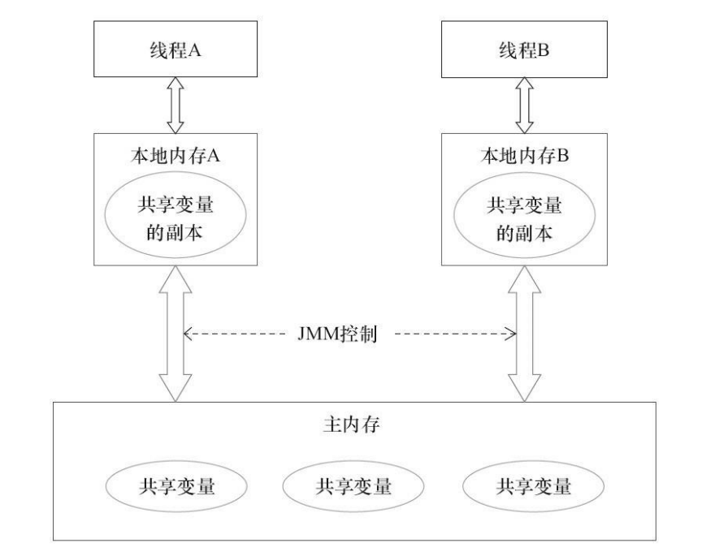
    <br/><br/>内存模型的抽象示意图
    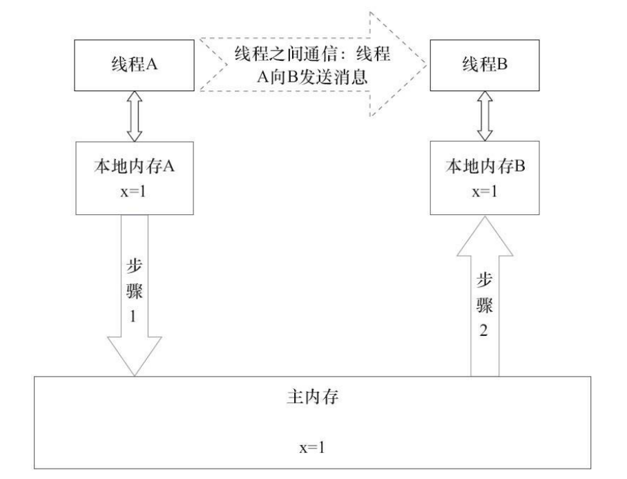
    <br/><br/>线程之间的通信图
</div>

JMM通过控制主内存与每个线程的本地内存之间的交互，来为Java程序员提供内存可见性保证。

### 从源代码到指令序列的重排序

在执行程序时，为了提高性能，编译器和处理器常常会对指令做重排序。重排序分3 种类型。

1. 编译器优化的重排序。编译器在不改变单线程程序语义的前提下，可以重新安排语句的执行顺序。
2. 指令级并行的重排序。现代处理器采用了指令级并行技术（InstructionLevelParallelism，ILP）来将多条指令重叠执行。如果不存在数据依赖性，处理器可以改变语句对应机器指令的执行顺序。
3. 内存系统的重排序。由于处理器使用缓存和读/写缓冲区，这使得加载和存储操作看上去可能是在乱序执行。

1属于编译器重排序，2和3属于处理器重排序。从Java源代码到最终实际执行的指令序列，会经历上述3种重排序。对于编译器，JMM 的编译器重排序规则会禁止特定类型 的编译器重排序（不是所有的编译器重排序都要禁止）。对于处理器重排序，JMM 的处 理器重排序规则会要求 Java 编译器在生成指令序列时，插入特定类型的内存屏障 （Memory Barriers，Intel 称之为 Memory Fence）指令，通过内存屏障指令来禁止特定类 型的处理器重排序。

JMM 属于语言级的内存模型，它确保在不同的编译器和不同的处理器平台之上，通 过禁止特定类型的编译器重排序和处理器重排序，为程序员提供一致的内存可见性保 证。

### 并发编程模型的分类

<div align='center'>
    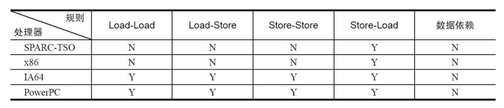
    <br/><br/>常见处理器允许的重排序类型的列表
</div>

注：

- sparc-TSO是指以TSO（Total Store Order）内存模型运行时sparc处理器的特性。
- X86包括X64及AMD64。
- ARM处理器与PowerPC内存模型类似，忽略。

为了保证内存可见性，Java 编译器在生成指令序列的适当位置会插入内存屏障指令 来禁止特定类型的处理器重排序。JMM 把内存屏障指令分为 4 类，如图。

<div align='center'>
    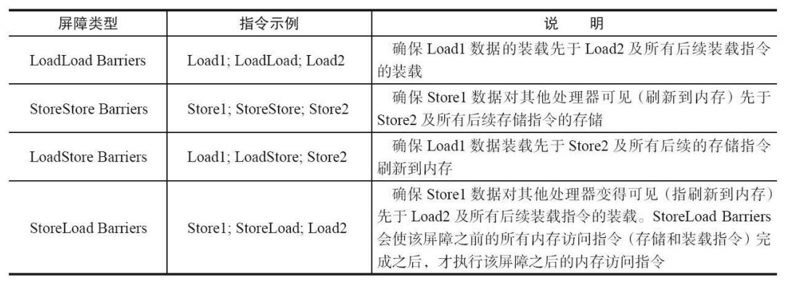
    <br/><br/>内存屏障类型表
</div>

StoreLoad Barriers 是一个“全能型”的屏障，它同时具有其他 3 个屏障的效果。现代 的多处理器大多支持该屏障（其他类型的屏障不一定被所有处理器支持）。执行该屏障开 销会很昂贵，因为当前处理器通常要把写缓冲区中的数据全部刷新到内存中（Buffer Fully Flush）。

### happens-before简介

在 JMM 中，如果一个操作执行的结果需要对另一个操作可见，那么这两个操作之间必 须要存在 happens-before 关系。这里提到的两个操作既可以是在一个线程之内，也可以 是在不同线程之间。

与程序员密切相关的 happens-before 规则如下。

- 程序顺序规则：一个线程中的每个操作，happens-before 于该线程中的任意后续操作。
- 监视器锁规则：对一个锁的解锁，happens-before 于随后对这个锁的加锁。
- volatile 变量规则：对一个 volatile 域的写，happens-before 于任意后续对这个 volatile 域的读。
- 传递性：如果 A happens-before B，且 B happens-before C，那么 A happens-before C。

**注：**两个操作之间具有 happens-before 关系，并不意味着前一个操作必须要在后一个操 作之前执行！happens-before 仅仅要求前一个操作（执行的结果）对后一个操作可见，且 前一个操作按顺序排在第二个操作之前（the first is visible to and ordered before the second）。

<div align='center'>
    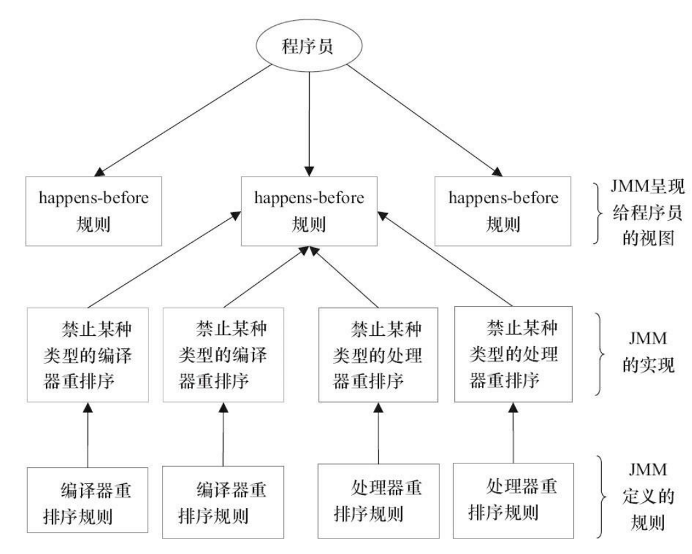
    <br/><br/>happens-before与JMM的关系
</div>

## 重排序

重排序是指编译器和处理器为了优化程序性能而对指令序列进行重新排序的一种手段。

### 数据依赖性

如果两个操作访问同一个变量，且这两个操作中有一个为写操作，此时这两个操作 之间就存在数据依赖性。数据依赖分为下列 3 种类型，如图所示。这里所说的数据依赖性仅针对单个处理器中执行的指令序列和单个线程中执行的操作，不同处理器之间和不同线程之间的数据依赖性不被编译器和处理器考虑。

<div align='center'>
    
    <br/><br/>数据依赖类型图
</div>

### as-if-serial语义

不管怎么重排序（编译器和处理器为了提高并行度），（单线程）程序的执行结果不能被改变。编译器、runtime 和处理器都必须遵守 as-if-serial 语 义。

为了遵守这个语义，存在数据依赖关系的操作不会被重排序，如果不存在数据依赖关系则有可能会被冲排序。

```java
double pi = 3.14;
double r = 1.0;
double are = pi * r * r;
```

<div align='center'>
    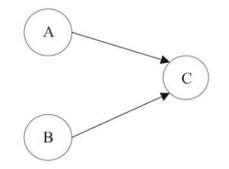
    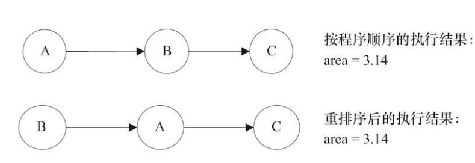
    <br/><br/>3个操作依赖关系以及程序两种执行顺序
</div>

as-if-serial 语义把单线程程序保护了起来，使得单线程无需担心重排序问题，也无需担心内存可见性问题。

### 程序顺序规则

根据 happens-before 规则，上面计算圆的面积的示例代码存在 3 个 happens-before:

1. A happens-before B。 
2. B happens-before C。 
3. A happens-before C。

这里的第 3 个 happens-before 关系，是根据 happens-before 的传递性推导出来的。这 里 A happens-before B，但实际执行时 B 却可以排在 A 之前执行（看上面的重排序后的执 行顺序）。如果 A happens-before B，JMM 并不要求 A 一定要在 B 之前执行。JMM 仅仅 要求前一个操作（执行的结果）对后一个操作可见，且前一个操作按顺序排在第二个操 作之前。这里操作 A 的执行结果不需要对操作 B 可见；而且重排序操作 A 和操作 B 后 的执行结果，与操作 A 和操作 B 按 happens-before 顺序执行的结果一致。在这种情况 下，JMM 会认为这种重排序并不非法（not illegal），JMM 允许这种重排序。

在计算机中，软件技术和硬件技术有一个共同的目标：在不改变程序执行结果的前 提下，尽可能提高并行度。编译器和处理器遵从这一目标，从 happens-before 的定义可以看出， JMM 同样遵从这一目标。

### 重排序对多线程的影响

在单线程程序中，对存在控制依赖的操作重排序，不会改变执行结果（这也是 as-ifserial 语义允许对存在控制依赖的操作做重排序的原因）；但在多线程程序中，对存在控 制依赖的操作重排序，可能会改变程序的执行结果。

## 顺序一致性

### 数据竞争与顺序一致性

当程序未正确同步时，就可能会存在数据竞争。Java 内存模型规范对数据竞争的定义如下：

在一个线程中写一个变量，在另一个线程读同一个变量，而且写和读没有通过同步来排序。

JMM 对正确同步的多线程程序的内存一致性做了如下保证。

如果程序是正确同步的，程序的执行将具有顺序一致性（Sequentially Consistent）— —即程序的执行结果与该程序在顺序一致性内存模型中的执行结果相同。这里的同步是指广义上的同步，包括对常用同步原语（synchronized、volatile 和 final）的正确使用。

### 顺序一致性内存模型

顺序一致性内存模型是一个被计算机科学家理想化了的理论参考模型，它为程序员 提供了极强的内存可见性保证。顺序一致性内存模型有两大特性。

- 一个线程中的所有操作必须按照程序的顺序来执行。
- （不管程序是否同步）所有线程都只能看到一个单一的操作执行顺序。在顺序一 致性内存模型中，每个操作都必须原子执行且立刻对所有线程可见。

<div align='center'>
    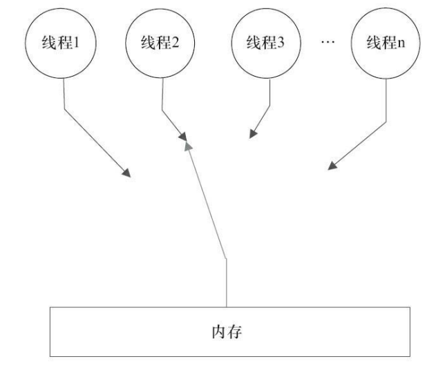
    <br/><br/>顺序一致性模型为程序员提供的视图
</div>

顺序一致性内存模型的视图在概念上，顺序一致性模型有一个单一的全局内存，这 个内存通过一个左右摆动的开关可以连接到任意一个线程，同时每一个线程必须按照程 序的顺序来执行内存读/写操作。从上面的示意图可以看出，在任意时间点最多只能有一 个线程可以连接到内存。当多个线程并发执行时，图中的开关装置能把所有线程的所有内存读/写操作串行化（即在顺序一致性模型中，所有操作之间具有全序关系）。

### 同步程序的顺序一致性效果

```java
class SynchronizedExample {
	int a = 0;
 	boolean flag = false;
 	
    public synchronized void writer() { // 获取锁
 		a = 1;
 		flag = true;
 	} // 释放锁

    public synchronized void reader() { // 获取锁
 		if (flag) {
 			int i = a;
 				……
 		} // 释放锁
 	}
}
```

<div align='center'>
    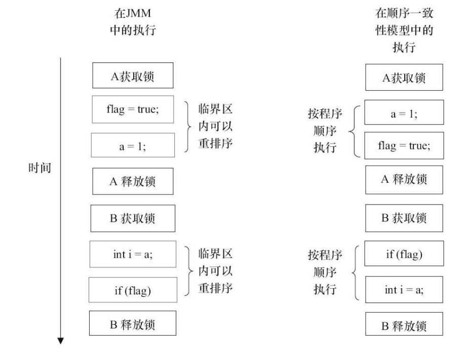
    <br/><br/>两个内存模型中的执行时序对比图
</div>

JMM 在具体实现上的基本方针为：在不改变（正确同步的） 程序执行结果的前提下，尽可能地为编译器和处理器的优化打开方便之门。

### 未同步程序的执行特性

对于未同步或未正确同步的多线程程序，JMM 只提供最小安全性：线程执行时读取 到的值，要么是之前某个线程写入的值，要么是默认值（0，Null，False），JMM 保证线程读操作读取到的值不会无中生有（Out Of Thin Air）的冒出来。为了实现最小安全性， JVM 在堆上分配对象时，首先会对内存空间进行清零，然后才会在上面分配对象（JVM 内部会同步这两个操作）。因此，在已清零的内存空间（Pre-zeroed Memory）分配对象 时，域的默认初始化已经完成了。

JMM不保证未同步程序的执行结果与该程序在顺序一致性模型中的执行结果一致。 因为如果想要保证执行结果一致，JMM 需要禁止大量的处理器和编译器的优化，这对程序的执行性能会产生很大的影响。而且未同步程序在顺序一致性模型中执行时，整体是 无序的，其执行结果往往无法预知。而且，保证未同步程序在这两个模型中的执行结果 一致没什么意义。

未同步程序在 JMM 中的执行时，整体上是无序的，其执行结果无法预知。未同步程序在两个模型中的执行特性有如下几个差异。

- 顺序一致性模型保证单线程内的操作会按程序的顺序执行，而 JMM 不保证单线程内的操作会按程序的顺序执行（比如上面正确同步的多线程程序在临界区内的重排序）。
- 顺序一致性模型保证所有线程只能看到一致的操作执行顺序，而 JMM 不保证所有线程能看到一致的操作执行顺序。
- JMM 不保证对 64 位的 long 型和 double 型变量的写操作具有原子性，而顺序一致性模型保证对所有的内存读/写操作都具有原子性（与处理器总线的工作机制密切相关，总线会同步试图并发使用总线的事务，在32位处理器上会将long或double分为两个32为的字，对一个long或者double的读/写有可能会分到两个总线事务上进行）。

<div align='center'>
    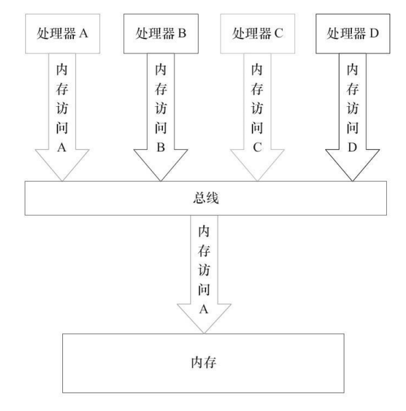
    <br/><br/>总线的工作机制
</div>

假设处理器 A，B 和 C 同时向总线发起总线事务，这时总线仲裁（Bus Arbitration） 会对竞争做出裁决，这里假设总线在仲裁后判定处理器 A 在竞争中获胜（总线仲裁会确 保所有处理器都能公平的访问内存）。此时处理器 A 继续它的总线事务，而其他两个处 理器则要等待处理器 A 的总线事务完成后才能再次执行内存访问。假设在处理器 A 执行 总线事务期间（不管这个总线事务是读事务还是写事务），处理器 D 向总线发起了总线 事务，此时处理器 D 的请求会被总线禁止。

总线的这些工作机制可以把所有处理器对内存的访问以串行化的方式来执行。在任意时间点，最多只能有一个处理器可以访问内存。这个特性确保了单个总线事务之中的内存读/写操作具有原子性。

## volatile的内存语义

### volatile的特性

