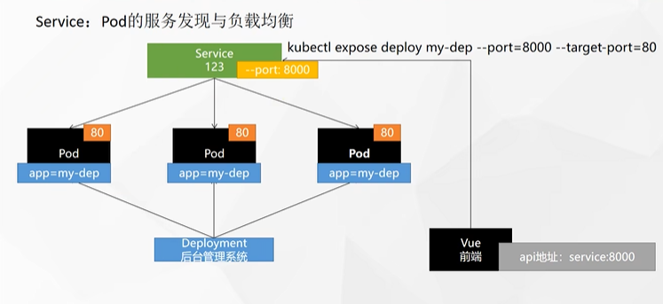

# 基础概念

## 是什么

<div align='center'>
    
</div>

应用容器化部署，分布式集群，需要一个大规模容器编排系统。

 Kubernetes 提供了一个可弹性运行分布式系统的框架。 Kubernetes 会满足扩展要求、故障转移、部署模式等。

### kubernets(k8s)特性

- **服务发现和负载均衡**

	Kubernetes 可以使用 DNS 名称或自己的 IP 地址公开容器，如果进入容器的流量很大， Kubernetes 可以负载均衡并分配网络流量，从而使部署稳定。

- **存储编排**

	Kubernetes 允许自动挂载选择的存储系统，例如本地存储、公共云提供商等。

- **自动部署和回滚**

	可以使用 Kubernetes 描述已部署容器的所需状态，它可以以受控的速率将实际状态更改为期望状态。例如，可以自动化 Kubernetes 来为你的部署创建新容器， 删除现有容器并将它们的所有资源用于新容器。

- **自动完成装箱计算**

	Kubernetes 允许指定每个容器所需 CPU 和内存（RAM）。 当容器指定了资源请求时，Kubernetes 可以做出更好的决策来管理容器的资源。

- **自我修复**

	Kubernetes 重新启动失败的容器、替换容器、杀死不响应用户定义的运行状况检查的容器，并且在准备好服务之前不将其通告给客户端。

- **密钥与配置管理**

	Kubernetes 允许存储和管理敏感信息，例如密码、OAuth 令牌和 ssh密钥。可以在不重建容器镜像的情况下部署和更新密钥和应用程序配置，也无需在堆栈配置中暴露密钥。

## 架构

### 工作方式

Kubernetes ==Cluster== **=** N ==Master== Node **+** N ==Worker== Node：N主节点+N工作节点； N>=1。

### 组件架构

<div align='center'>
    
    
</div>


#### 控制平面组件（Control Plane Components）

控制平面组件会为集群做出全局决策，比如资源的调度。 以及检测和响应集群事件，例如当不满足部署的 `replicas` 字段时， 要启动新的 [pod](https://kubernetes.io/docs/concepts/workloads/pods/pod-overview/)，集群上的一组正在运行的容器）。

控制平面组件可以在集群中的任何节点上运行。 然而，为了简单起见，设置脚本通常会在同一个计算机上启动所有控制平面组件， 并且不会在此计算机上运行用户容器。

1. kube-apiserver

	API 服务器是 Kubernetes [控制平面](https://kubernetes.io/zh-cn/docs/reference/glossary/?all=true#term-control-plane)的组件， 该组件负责公开了 Kubernetes API，负责处理接受请求的工作。 API 服务器是 Kubernetes 控制平面的前端。

	Kubernetes API 服务器的主要实现是 [kube-apiserver](https://kubernetes.io/zh/docs/reference/command-line-tools-reference/kube-apiserver/)。 `kube-apiserver` 设计上考虑了水平扩缩，也就是说，它可通过部署多个实例来进行扩缩。 你可以运行 `kube-apiserver` 的多个实例，并在这些实例之间平衡流量。

2. etcd

	`etcd` 是兼顾一致性与高可用性的键值数据库，可以作为保存 Kubernetes 所有集群数据的后台数据库。

3. kube-scheduler

	`kube-scheduler` 是[控制平面](https://kubernetes.io/zh-cn/docs/reference/glossary/?all=true#term-control-plane)的组件， 负责监视新创建的、未指定运行[节点（node）](https://kubernetes.io/zh/docs/concepts/architecture/nodes/)的 [Pods](https://kubernetes.io/docs/concepts/workloads/pods/pod-overview/)， 并选择节点来让 Pod 在上面运行。

	调度决策考虑的因素包括单个 Pod 及 Pods 集合的资源需求、软硬件及策略约束、 亲和性及反亲和性规范、数据位置、工作负载间的干扰及最后时限。

4. kube-controller-manager

	[kube-controller-manager](https://kubernetes.io/zh/docs/reference/command-line-tools-reference/kube-controller-manager/) 是[控制平面](https://kubernetes.io/zh-cn/docs/reference/glossary/?all=true#term-control-plane)的组件， 负责运行[控制器](https://kubernetes.io/zh/docs/concepts/architecture/controller/)进程。

	从逻辑上讲， 每个[控制器](https://kubernetes.io/zh/docs/concepts/architecture/controller/)都是一个单独的进程， 但是为了降低复杂性，它们都被编译到同一个可执行文件，并在同一个进程中运行。

	这些控制器包括：

	- 节点控制器（Node Controller）：负责在节点出现故障时进行通知和响应
	- 任务控制器（Job Controller）：监测代表一次性任务的 Job 对象，然后创建 Pods 来运行这些任务直至完成
	- 端点控制器（Endpoints Controller）：填充端点（Endpoints）对象（即加入 Service 与 Pod）
	- 服务帐户和令牌控制器（Service Account & Token Controllers）：为新的命名空间创建默认帐户和 API 访问令牌

5. cloud-controller-manager

	`cloud-controller-manager` 是指嵌入特定云的控制逻辑之[控制平面](https://kubernetes.io/zh-cn/docs/reference/glossary/?all=true#term-control-plane)组件。 `cloud-controller-manager` 允许你将你的集群连接到云提供商的 API 之上， 并将与该云平台交互的组件同与你的集群交互的组件分离开来。

	`cloud-controller-manager` 仅运行特定于云平台的控制器。 因此如果你在自己的环境中运行 Kubernetes，或者在本地计算机中运行学习环境， 所部署的集群不需要有云控制器管理器。

	与 `kube-controller-manager` 类似，`cloud-controller-manager` 将若干逻辑上独立的控制回路组合到同一个可执行文件中， 供你以同一进程的方式运行。 你可以对其执行水平扩容（运行不止一个副本）以提升性能或者增强容错能力。

	下面的控制器都包含对云平台驱动的依赖：

	- 节点控制器（Node Controller）：用于在节点终止响应后检查云提供商以确定节点是否已被删除
	- 路由控制器（Route Controller）：用于在底层云基础架构中设置路由
	- 服务控制器（Service Controller）：用于创建、更新和删除云提供商负载均衡器

#### Node组件

节点组件会在每个节点上运行，负责维护运行的 Pod 并提供 Kubernetes 运行环境。

1. kubelet

	`kubelet` 会在集群中每个[节点（node）](https://kubernetes.io/zh/docs/concepts/architecture/nodes/)上运行。 它保证[容器（containers）](https://kubernetes.io/zh/docs/concepts/overview/what-is-kubernetes/#why-containers)都运行在 [Pod](https://kubernetes.io/docs/concepts/workloads/pods/pod-overview/) 中。

	kubelet 接收一组通过各类机制提供给它的 PodSpecs， 确保这些 PodSpecs 中描述的容器处于运行状态且健康。 kubelet 不会管理不是由 Kubernetes 创建的容器。

2. kube-proxy

	[kube-proxy](https://kubernetes.io/zh/docs/reference/command-line-tools-reference/kube-proxy/) 是集群中每个[节点（node）](https://kubernetes.io/zh/docs/concepts/architecture/nodes/)所上运行的网络代理，实现 Kubernetes [服务（Service）](https://kubernetes.io/zh/docs/concepts/services-networking/service/) 概念的一部分。

	kube-proxy 维护节点上的一些网络规则， 这些网络规则会允许从集群内部或外部的网络会话与 Pod 进行网络通信。

	如果操作系统提供了可用的数据包过滤层，则 kube-proxy 会通过它来实现网络规则。 否则，kube-proxy 仅做流量转发。

3. 容器运行时（Container Runtime）

	容器运行环境是负责运行容器的软件。

	Kubernetes 支持许多容器运行环境，例如 [Docker](https://kubernetes.io/zh/docs/reference/kubectl/docker-cli-to-kubectl/)、 [containerd](https://containerd.io/docs/)、 [CRI-O](https://cri-o.io/#what-is-cri-o) 以及 [Kubernetes CRI (容器运行环境接口)](https://github.com/kubernetes/community/blob/master/contributors/devel/sig-node/container-runtime-interface.md) 的其他任何实现。

#### 插件（Addons）

插件使用 Kubernetes 资源（[DaemonSet](https://kubernetes.io/zh/docs/concepts/workloads/controllers/daemonset/)、 [Deployment](https://kubernetes.io/zh/docs/concepts/workloads/controllers/deployment/) 等）实现集群功能。 因为这些插件提供集群级别的功能，插件中命名空间域的资源属于 `kube-system` 命名空间。

下面描述众多插件中的几种。有关可用插件的完整列表，请参见 [插件（Addons）](https://kubernetes.io/zh/docs/concepts/cluster-administration/addons/)。

1. DNS

	尽管其他插件都并非严格意义上的必需组件，但几乎所有 Kubernetes 集群都应该有[集群 DNS](https://kubernetes.io/zh/docs/concepts/services-networking/dns-pod-service/)， 因为很多示例都需要 DNS 服务。

	集群 DNS 是一个 DNS 服务器，和环境中的其他 DNS 服务器一起工作，它为 Kubernetes 服务提供 DNS 记录。

	Kubernetes 启动的容器自动将此 DNS 服务器包含在其 DNS 搜索列表中。

2. Web界面（仪表盘）

	[Dashboard](https://kubernetes.io/zh/docs/tasks/access-application-cluster/web-ui-dashboard/) 是 Kubernetes 集群的通用的、基于 Web 的用户界面。 它使用户可以管理集群中运行的应用程序以及集群本身， 并进行故障排除。

3. 容器资源监控

	[容器资源监控](https://kubernetes.io/zh/docs/tasks/debug/debug-cluster/resource-usage-monitoring/) 将关于容器的一些常见的时间序列度量值保存到一个集中的数据库中， 并提供浏览这些数据的界面。

4. 集群层面日志

	[集群层面日志](https://kubernetes.io/zh/docs/concepts/cluster-administration/logging/)机制负责将容器的日志数据保存到一个集中的日志存储中， 这种集中日志存储提供搜索和浏览接口。

## kubeadm创建集群

首先需要为每个结点安装docker。

### 安装kubeadm

1. 基础环境&&准备工作

  ```bash
  #各个机器设置自己的域名
  hostnamectl set-hostname xxxx
  
  # 将 SELinux 设置为 permissive 模式（相当于将其禁用）
  sudo setenforce 0
  sudo sed -i 's/^SELINUX=enforcing$/SELINUX=permissive/' /etc/selinux/config
  
  #关闭swap
  swapoff -a  
  sed -ri 's/.*swap.*/#&/' /etc/fstab
  
  #允许 iptables 检查桥接流量
  cat <<EOF | sudo tee /etc/modules-load.d/k8s.conf
  br_netfilter
  EOF
  
  cat <<EOF | sudo tee /etc/sysctl.d/k8s.conf
  net.bridge.bridge-nf-call-ip6tables = 1
  net.bridge.bridge-nf-call-iptables = 1
  EOF
  sudo sysctl --system
  ```

  ```shell
  # vim /etc/docker/daemon.json
  # 选择的CRI容器进行时的cgroups管理器必须是systemd
  
  {
      "exec-opts": ["native.cgroupdriver=systemd"]
  }
  
  #重启docker
  systemctl restart docker
  ```

  开启云服务器端口（每个主机，均为入站方向）

控制面/Master

| 协议 |端口范围 | 目的 | 使用者 |
| ---- | ---- | -------- | ---- |
| TCP | 6443 | Kubernetes API server | 所有 |
| TCP | 2379-2380 | etcd server client API | kube-apiserver, etcd |
| TCP | 10250 | Kubelet API | 自身, 控制面 |
| TCP | 10257 | kube-controller-manager | 自身 |
| TCP | 10259 | kube-scheduler | 自身 |

  工作节点

| 协议 | 端口范围    | 目的              | 使用者       |
| ---- | ----------- | ----------------- | ------------ |
| TCP  | 10250       | Kubelet API       | 自身, 控制面 |
| TCP  | 30000-32767 | NodePort Services | 所有         |

[NodePort Services](https://kubernetes.io/zh/docs/concepts/services-networking/service/)是pod服务的默认端口范围。这里如果希望Master的IP也可以访问Pod服务，那么也可以给Master主机开放这些端口。

所有节点

Flannel网络组件构建Pod之间的通信时需要的配置。

| 协议 | 端口范围 | 作用                   | 使用者       |
| ---- | -------- | ---------------------- | ------------ |
| UDP  | 8472     | vxlan Overlay 网络通信 | Overlay 网络 |

2. 安装kubelet、kubeadm、kubectl

  ```bash
  cat <<EOF | sudo tee /etc/yum.repos.d/kubernetes.repo
  [kubernetes]
  name=Kubernetes
  baseurl=http://mirrors.aliyun.com/kubernetes/yum/repos/kubernetes-el7-x86_64
  enabled=1
  gpgcheck=0
  repo_gpgcheck=0
  gpgkey=http://mirrors.aliyun.com/kubernetes/yum/doc/yum-key.gpg
     http://mirrors.aliyun.com/kubernetes/yum/doc/rpm-package-key.gpg
  exclude=kubelet kubeadm kubectl
  EOF
  
  sudo yum install -y kubelet-1.20.9 kubeadm-1.20.9 kubectl-1.20.9 --disableexcludes=kubernetes
  
  sudo systemctl enable --now kubelet
  ```

### 使用kubeadm引导集群

1. 下载各个机器所需要的镜像

	```bash
	sudo tee ./images.sh <<-'EOF'
	#!/bin/bash
	images=(
	kube-apiserver:v1.20.9
	kube-proxy:v1.20.9
	kube-controller-manager:v1.20.9
	kube-scheduler:v1.20.9
	coredns:1.7.0
	etcd:3.4.13-0
	pause:3.2
	)
	for imageName in ${images[@]} ; do
	docker pull registry.cn-hangzhou.aliyuncs.com/lfy_k8s_images/$imageName
	done
	EOF
	   
	chmod +x ./images.sh && ./images.sh
	```

2. 新建虚拟网卡

  ```shell
  #主机在公网上（不同的运营商上时需要，同一个运营商可以直接使用内网地址）
  cat > /etc/sysconfig/network-scripts/ifcfg-eth0:1 <<EOF
  BOOTPROTO=static
  DEVICE=eth0:1
  IPADDR=<公网IP>
  PREFIX=32
  TYPE=Ethernet
  USERCTL=no
  ONBOOT=yes
  BROADCAST=<广播地址>
  EOF
  ```

3. 初始化主节点（Master）

  ```bash
  #主节点初始化
  kubeadm init \
  --apiserver-advertise-address=<公网IP>(或域名) \
  --control-plane-endpoint=simple-tx \
  --image-repository registry.cn-hangzhou.aliyuncs.com/lfy_k8s_images \
  --kubernetes-version v1.20.9 \
  --service-cidr=10.66.0.0/16 \
  --pod-network-cidr=10.99.0.0/16 \
  --image-repository registry.aliyuncs.com/google_containers \
  --v=5
  # service-cidr与pod-network-cidr以及各主机的网络不重叠
  ```

  ```shell
  Your Kubernetes control-plane has initialized successfully!
  
  To start using your cluster, you need to run the following as a regular user:
  
    mkdir -p $HOME/.kube
    sudo cp -i /etc/kubernetes/admin.conf $HOME/.kube/config
    sudo chown $(id -u):$(id -g) $HOME/.kube/config
  
  Alternatively, if you are the root user, you can run:
  
    export KUBECONFIG=/etc/kubernetes/admin.conf
  
  You should now deploy a pod network to the cluster.
  Run "kubectl apply -f [podnetwork].yaml" with one of the options listed at:
    https://kubernetes.io/docs/concepts/cluster-administration/addons/
  
  You can now join any number of control-plane nodes by copying certificate authorities
  and service account keys on each node and then running the following as root:
  
    kubeadm join simple-tx:6443 --token ef7ggh.vb3kf0js9q4kyl45 \
      --discovery-token-ca-cert-hash sha256:9739f149554ed76a3a7f4eb01bbc00d2532526a92e562ff5934051817fe07336 \
      --control-plane
  
  Then you can join any number of worker nodes by running the following on each as root:
  
  #工作节点加入集群
  kubeadm join simple-tx:6443 --token ef7ggh.vb3kf0js9q4kyl45 \
      --discovery-token-ca-cert-hash sha256:9739f149554ed76a3a7f4eb01bbc00d2532526a92e562ff5934051817fe07336
  ```

```shell
# 创建新令牌
kubeadm token create --print-join-command
```


  ```shell
  mkdir -p $HOME/.kube
  sudo cp -i /etc/kubernetes/admin.conf $HOME/.kube/config
  sudo chown $(id -u):$(id -g) $HOME/.kube/config
  ```

4. 修改kube-apiserver参数（Master）

	```shell
	sudo vi /etc/kubernetes/manifests/kube-apiserver.yaml
	```

	```yaml
	apiVersion: v1
	kind: Pod
	metadata:
	  annotations:
	    kubeadm.kubernetes.io/kube-apiserver.advertise-address.endpoint: 192.168.66.100:6443
	  creationTimestamp: null
	  labels:
	    component: kube-apiserver
	    tier: control-plane
	  name: kube-apiserver
	  namespace: kube-system
	spec:
	  containers:
	  - command:
	    - kube-apiserver
	    #需要修改的 advertise-address和bind-address
	    - --advertise-address=<公网IP>
	    - --bind-address=0.0.0.0
	```
	
5. 安装CNI网络插件（Master）

	使用flannel，在master节点执行

	```shell
	wget https://raw.githubusercontent.com/coreos/flannel/master/Documentation/kube-flannel.yml
	```

	```yml
	# 需要修改的地方 见注释
	      containers:
	      - name: kube-flannel
	       #image: flannelcni/flannel:v0.18.1 for ppc64le and mips64le (dockerhub limitations may apply)
	        image: rancher/mirrored-flannelcni-flannel:v0.18.1
	        command:
	        - /opt/bin/flanneld
	        args:
	        #需要修改的地方
	        - --public-ip=$(PUBLIC_IP)
	        - --iface=eth0
	        - --ip-masq
	        - --kube-subnet-mgr
	        resources:
	          requests:
	            cpu: "100m"
	            memory: "50Mi"
	          limits:
	            cpu: "100m"
	            memory: "50Mi"
	        securityContext:
	          privileged: false
	          capabilities:
	            add: ["NET_ADMIN", "NET_RAW"]
	        env:
	        #需要修改的地方
	        - name: PUBLIC_IP
	          valueFrom:
	            fieldRef:
	              fieldPath: status.podIP
	```

	```shell
	#安装flannel插件
	kubectl apply -f kube-flannel.yml
	```

6. 查看集群状态

	```
	kubectl get nodes
	```

	<div align='center'>
	    
	</div>

7. 检查系统Pods状态

	```shell
	watch -n 1 kubectl get pod -n kube-system -o wide
	```

8. 部署dashboard

	```shell
	kubectl apply -f https://raw.githubusercontent.com/kubernetes/dashboard/v2.3.1/aio/deploy/recommended.yaml
	```

	```
	kubectl edit svc kubernetes-dashboard -n kubernetes-dashboard
	```

	将type:ClusterIP改为type:NodePort

	<div align='center'>
	    
	</div>

	```shell
	#找到端口 并在安全组放行 集群任意IP:Port就可以访问
	kubectl get svc -A |grep kubernetes-dashboard
	```

	创建访问账号

	```yaml
	#创建访问账号，准备一个yaml文件； vi dash.yaml
	apiVersion: v1
	kind: ServiceAccount
	metadata:
	  name: admin-user
	  namespace: kubernetes-dashboard
	---
	apiVersion: rbac.authorization.k8s.io/v1
	kind: ClusterRoleBinding
	metadata:
	  name: admin-user
	roleRef:
	  apiGroup: rbac.authorization.k8s.io
	  kind: ClusterRole
	  name: cluster-admin
	subjects:
	- kind: ServiceAccount
	  name: admin-user
	  namespace: kubernetes-dashboard
	```

	```shell
	kubectl apply -f dash.yaml
	
	#获取访问令牌
	kubectl -n kubernetes-dashboard get secret $(kubectl -n kubernetes-dashboard get sa/admin-user -o jsonpath="{.secrets[0].name}") -o go-template="{{.data.token | base64decode}}"
	```

	<div align='center'>
	    
	</div>

9. 测试

	master节点下部署nginx

	```shell
	kubectl create deploy my-nginx --image=nginx
	kubectl expose deploy my-nginx --port=80 --type=NodePort
	```

	```shell
	# 查看nginx部署的pod信息，可以看到Pod ip 以及部署在哪一个节点上
	kubectl get pods -o wide
	
	# 节点间可以通过内网IP互相ping通
	
	# 测试NodePort
	kubectl get svc -o wide
	
	#可以通过k8s集群中任意节点IP+Port访问nginx
	```

	<div align='center'>
	    
	</div>

10. 删除K8s

	```shell
	sudo kubeadm reset				
	rm -rf /root/.kube/
	sudo rm -rf /etc/kubernetes/
	sudo rm -rf /var/lib/kubelet/
	sudo rm -rf /var/lib/dockershim
	sudo rm -rf /var/run/kubernetes
	sudo rm -rf /var/lib/cni
	sudo rm -rf /var/lib/etcd
	sudo rm -rf /etc/cni/net.d
	
	#删除k8s对本机网卡iptables转发的配置
	iptables -F && iptables -t nat -F && iptables -t mangle -F && iptables -X
	ipvsadm -C
	ipvsadm --clear 
	
	#执行ifconfig会发现还有一些虚拟veth、cni、flannel等设备都可以通过ip link delete xxx删除掉
	ip link delete xxx
	```

# 实战

## 资源创建、删除方式

- 命令行
- yaml

## Namespace

名称空间，用来对集群资源进行隔离划分（开发、测试、生产环境）。默认只隔离资源，不隔离网络。

```bash
kubectl create ns hello
kubectl delete ns hello
```

```yaml
apiVersion: v1
kind: Namespace
metadata:
  name: hello
```

## Pod

运行中的一组容器，Pod是k8s中应用的最小单位。

<div align='center'>
    
</div>

```bash
kubectl run mynginx --image=nginx

# 查看default名称空间的Pod
kubectl get pod 
# 描述
kubectl describe pod 你自己的Pod名字
# 删除
kubectl delete pod Pod名字
# 查看Pod的运行日志
kubectl logs Pod名字

# 每个Pod - k8s都会分配一个ip
kubectl get pod -owide
# 使用Pod的ip+pod里面运行容器的端口
curl 192.168.169.136
# 集群中的任意一个机器以及任意的应用都能通过Pod分配的ip来访问这个Pod
```

```yaml
#yaml 创建pod kubectl apply -f pod.yaml
apiVersion: v1
kind: Pod
metadata:
  labels:
    run: myapp
  name: myapp
spec:
  containers:
  - image: nginx
    name: nginx
  - image: tomcat:8.5.68
    name: tomcat
```

同一个Pod内的容器共享网络空间。

## Deployment

控制Pod，使Pod拥有**多副本，自愈，扩缩容**等能力。

### 多副本

```bash
kubectl create deployment mytomcat --image=tomcat:8.5.68
```

```yaml
apiVersion: apps/v1
kind: Deployment
metadata:
  labels:
    app: my-dep
  name: my-dep
spec:
  replicas: 3
  selector:
    matchLabels:
      app: my-dep
  template:
    metadata:
      labels:
        app: my-dep
    spec:
      containers:
      - image: nginx
        name: nginx
```

### 扩缩容

```bash
kubectl scale --replicas=5 deployment/my-dep

kubectl edit deployment my-dep
```

### 自愈&故障转移

- 停机
- 删除Pod
- 容器崩溃
- ....

### 滚动更新

```bash
kubectl set image deployment/my-dep nginx=nginx:1.16.1 --record
kubectl rollout status deployment/my-dep
```

### 版本回退

```bash
#历史记录
kubectl rollout history deployment/my-dep

#查看某个历史详情
kubectl rollout history deployment/my-dep --revision=2

#回滚(回到上次)
kubectl rollout undo deployment/my-dep

#回滚(回到指定版本)
kubectl rollout undo deployment/my-dep --to-revision=2
```

### More

除了`Deployment`，k8s还有 `StatefulSet` 、`DaemonSet` 、`Job`  等 类型资源。我们都称为 `工作负载`。

有状态应用使用  `StatefulSet`  部署，无状态应用使用 `Deployment` 部署

https://kubernetes.io/zh/docs/concepts/workloads/controllers/

- Deployment： 无状态应用部署，例如微服务，提供多副本功能等
- StatefuSet：有状态应用部署，例如Redis，提供稳定的存储、网络等功能
- DaemonSet：守护型应用部署，例如日志收集组件，在每个机器都运行一份
- Job/CronJob：定时任务部署，比如垃圾清理组件，可以在指定时间运行

## Service

将一组 [Pods](https://kubernetes.io/docs/concepts/workloads/pods/pod-overview/) 公开为网络服务的抽象方法,端口号在指定范围内是随机的。

可以通过IP+端口访问也可以通过域名+端口访问，域名：服务名.所在名称空间.svc，例如service-name.default.scv。

<div align='center'>
    
</div>

```bash
#暴露Deploy
kubectl expose deployment my-dep --port=8000 --target-port=80

#使用标签检索Pod
kubectl get pod -l app=my-dep
```

```yaml
apiVersion: v1
kind: Service
metadata:
  labels:
    app: my-dep
  name: my-dep
spec:
  selector:
    app: my-dep
  ports:
  - port: 8000
    protocol: TCP
    targetPort: 80
```


### ClusterIP（集群内部访问）

```bash
# 等同于没有--type的
kubectl expose deployment my-app --port=8000 --target-port=80 --type=ClusterIP
```

```yaml
apiVersion: v1
kind: Service
metadata:
  labels:
    app: my-app
  name: my-app
spec:
  ports:
  - port: 8000
    protocol: TCP
    targetPort: 80
  selector:
    app: my-dep
  type: ClusterIP
```


### NodePort（集群外也可以访问）

<div align='center'>
    
</div>


每个机器都有一个公网IP，端口范围在30000-32767之间。

```bash
kubectl expose deploy my-nginx --port=8000 --target-port=80 --type=NodePort
```

## Ingress

### 安装

Service的统一网关入口，本质还是通过nginx。

```bash
wget https://raw.githubusercontent.com/kubernetes/ingress-nginx/controller-v0.47.0/deploy/static/provider/baremetal/deploy.yaml

#修改镜像
vi deploy.yaml
#将image的值改为如下值：
registry.cn-hangzhou.aliyuncs.com/lfy_k8s_images/ingress-nginx-controller:v0.46.0

kubectl apply -f deploy.yaml

# 检查安装的结果
kubectl get pod,svc -n ingress-nginx

# 最后别忘记服务器安全组把svc暴露的端口要放行
```

### 使用

<div align='center'>
    
</div>


```yaml
apiVersion: apps/v1
kind: Deployment
metadata:
  name: hello-server
spec:
  replicas: 2
  selector:
    matchLabels:
      app: hello-server
  template:
    metadata:
      labels:
        app: hello-server
    spec:
      containers:
      - name: hello-server
        image: registry.cn-hangzhou.aliyuncs.com/lfy_k8s_images/hello-server
        ports:
        - containerPort: 9000
---
apiVersion: apps/v1
kind: Deployment
metadata:
  labels:
    app: nginx-demo
  name: nginx-demo
spec:
  replicas: 2
  selector:
    matchLabels:
      app: nginx-demo
  template:
    metadata:
      labels:
        app: nginx-demo
    spec:
      containers:
      - image: nginx
        name: nginx
---
apiVersion: v1
kind: Service
metadata:
  labels:
    app: nginx-demo
  name: nginx-demo
spec:
  selector:
    app: nginx-demo
  ports:
  - port: 8000
    protocol: TCP
    targetPort: 80
---
apiVersion: v1
kind: Service
metadata:
  labels:
    app: hello-server
  name: hello-server
spec:
  selector:
    app: hello-server
  ports:
  - port: 8000
    protocol: TCP
    targetPort: 9000
```

#### 域名访问

```yaml
apiVersion: networking.k8s.io/v1
kind: Ingress  
metadata:
  name: ingress-host-bar
spec:
  ingressClassName: nginx
  rules:
  - host: "tx.snnukf.tech"
    http:
      paths:
      - pathType: Prefix
        path: "/"
        backend:
          service:
            name: hello-server
            port:
              number: 8000
  - host: "bd.snnukf.tech"
    http:
      paths:
      - pathType: Prefix
        path: "/nginx"  # 把请求会转给下面的服务，下面的服务一定要能处理这个路径，不能处理就是404
        backend:
          service:
            name: nginx-demo  ## java，比如使用路径重写，去掉前缀nginx
            port:
              number: 8000
```

```bash
#编辑ingress配置
kubectl edit ingress ingress-name
```

#### 路径重写

```yaml
apiVersion: networking.k8s.io/v1
kind: Ingress  
metadata:
  annotations:
    nginx.ingress.kubernetes.io/rewrite-target: /$2 #把前面的路径截掉
  name: ingress-host-bar
spec:
  ingressClassName: nginx
  rules:
  - host: "hello.atguigu.com"
    http:
      paths:
      - pathType: Prefix #前缀模式
        path: "/"
        backend:
          service:
            name: hello-server
            port:
              number: 8000
  - host: "demo.atguigu.com"
    http:
      paths:
      - pathType: Prefix
        path: "/nginx(/|$)(.*)"  # 把请求会转给下面的服务，下面的服务一定要能处理这个路径，不能处理就是404
        backend:
          service:
            name: nginx-demo  ## java，比如使用路径重写，去掉前缀nginx
            port:
              number: 8000
```

#### 流量限制

```yaml
apiVersion: networking.k8s.io/v1
kind: Ingress
metadata:
  name: ingress-limit-rate
  annotations:
    nginx.ingress.kubernetes.io/limit-rps: "1" #限制每秒请求为1
spec:
  ingressClassName: nginx
  rules:
  - host: "haha.atguigu.com"
    http:
      paths:
      - pathType: Exact #精确模式
        path: "/"
        backend:
          service:
            name: nginx-demo
            port:
              number: 8000
```

## 存储抽象

docker可以将容器内存储目录挂载到物理机上，在使用K8s时，当该容器挂了时候，由于故障转移，在其他机器上在重新启动一个容器实例的时候，会丢失原有数据，因此将存储层抽象出来交给K8s统一管理，这样当故障转移时重新启动一个容器实例也不会丢失原来的数据。

K8s并未指定固定的存储层框架，常用的有Glusterfs、NFS、CephFS。

### 环境准备

#### 所有节点

```bash
#所有机器安装
yum install -y nfs-utils
```

#### 主节点

```bash
#nfs主节点
echo "/nfs/data/ *(insecure,rw,sync,no_root_squash)" > /etc/exports

mkdir -p /nfs/data
systemctl enable rpcbind --now
systemctl enable nfs-server --now
#配置生效
exportfs -r
```

#### 从节点

```bash
showmount -e 172.31.0.4 #从节点集群地址

#执行以下命令挂载 nfs 服务器上的共享目录到本机路径 /root/nfsmount
mkdir -p /nfs/data

mount -t nfs 172.31.0.4:/nfs/data /nfs/data
# 写入一个测试文件
echo "hello nfs server" > /nfs/data/test.txt
```

#### 原生方式数据挂载

缺点：容器删除时，数据不会删除。不支持对存储空间的一些自定义操作（如限制大小等）。

```yaml
apiVersion: apps/v1
kind: Deployment
metadata:
  labels:
    app: nginx-pv-demo
  name: nginx-pv-demo
spec:
  replicas: 2
  selector:
    matchLabels:
      app: nginx-pv-demo
  template:
    metadata:
      labels:
        app: nginx-pv-demo
    spec:
      containers:
      - image: nginx
        name: nginx
        volumeMounts:
        - name: html
          mountPath: /usr/share/nginx/html
      volumes:
        - name: html
          nfs:
            server: 172.31.0.4
            path: /nfs/data/nginx-pv
```

### PV&PVC

*PV：持久卷（Persistent Volume），将应用需要持久化的数据保存到指定位置*

*PVC：持久卷申明（**Persistent Volume Claim**），申明需要使用的持久卷规格*

<div align='center'>
    
</div>

#### 创建PV池

1. 静态供应

    - ```bash
        #nfs主节点
        mkdir -p /nfs/data/01
        mkdir -p /nfs/data/02
        mkdir -p /nfs/data/03
        ```

2. 创建pv

    - ```yaml
        apiVersion: v1
        kind: PersistentVolume
        metadata:
          name: pv01-10m
        spec:
          capacity:
            storage: 10M
          accessModes:
            - ReadWriteMany
          storageClassName: nfs
          nfs:
            path: /nfs/data/01
            server: 172.31.0.4
        ---
        apiVersion: v1
        kind: PersistentVolume
        metadata:
          name: pv02-1gi
        spec:
          capacity:
            storage: 1Gi
          accessModes:
            - ReadWriteMany
          storageClassName: nfs
          nfs:
            path: /nfs/data/02
            server: 172.31.0.4
        ---
        apiVersion: v1
        kind: PersistentVolume
        metadata:
          name: pv03-3gi
        spec:
          capacity:
            storage: 3Gi
          accessModes:
            - ReadWriteMany
          storageClassName: nfs
          nfs:
            path: /nfs/data/03
            server: 172.31.0.4
        ```

#### PVC创建与绑定

创建PVC

```yaml
kind: PersistentVolumeClaim
apiVersion: v1
metadata:
  name: nginx-pvc
spec:
  accessModes:
    - ReadWriteMany
  resources:
    requests:
      storage: 200Mi
  storageClassName: nfs
```

创建Pod绑定PVC

```yaml
apiVersion: apps/v1
kind: Deployment
metadata:
  labels:
    app: nginx-deploy-pvc
  name: nginx-deploy-pvc
spec:
  replicas: 2
  selector:
    matchLabels:
      app: nginx-deploy-pvc
  template:
    metadata:
      labels:
        app: nginx-deploy-pvc
    spec:
      containers:
      - image: nginx
        name: nginx
        volumeMounts:
        - name: html
          mountPath: /usr/share/nginx/html
      volumes:
        - name: html
          persistentVolumeClaim:
            claimName: nginx-pvc
```

### ConfigMap

抽取应用配置，并且可以自动更新。

#### 创建配置，redis保存到k8s的etcd；

```conf
#redis.conf
appendonly yes
```


```bash
kubectl create cm redis-conf --from-file=redis.conf
```


```yaml
#k8s创建的配置
apiVersion: v1
data: #配置的真正数据 key-value结构 key表示文件名 value配置文件的内容
  redis.conf: |
    appendonly yes
kind: ConfigMap
metadata:
  creationTimestamp: "2022-12-10T06:48:56Z"
  managedFields:
  - apiVersion: v1
    fieldsType: FieldsV1
    fieldsV1:
      f:data:
        .: {}
        f:redis.conf: {}
    manager: kubectl-create
    operation: Update
    time: "2022-12-10T06:48:56Z"
  name: redis.conf
  namespace: default
  resourceVersion: "19141206"
  uid: 7d42a7ee-f52d-4356-ae65-8bd0c451cb5c
```


#### 创建Pod

```yaml
apiVersion: v1
kind: Pod
metadata:
  name: redis
spec:
  containers:
  - name: redis
    image: redis
    command:
      - redis-server
      - "/redis-master/redis.conf"  #指的是redis容器内部的位置
    ports:
    - containerPort: 6379
    volumeMounts:
    - mountPath: /data
      name: data
    - mountPath: /redis-master
      name: config
  volumes:
    - name: data
      emptyDir: {}
    - name: config
      configMap:
        name: redis-conf
        items:
        - key: redis.conf
          path: redis.conf
```

#### 修改ConfigMap

```bash
kubectl edit cm cmName
```

#### 检查配置是否更新成功

```bash
kubectl exec -it redis -- redis-cli

127.0.0.1:6379> CONFIG GET appendonly
1) "requirepass"
2) ""
```

发现配置值未更改，由于Pod部署的中间件自己本身没有热更新的能力，需要重新启动Pod（k8s未直接提供相关命令）才能从关联的ConfigMap中获取更新后的值。
