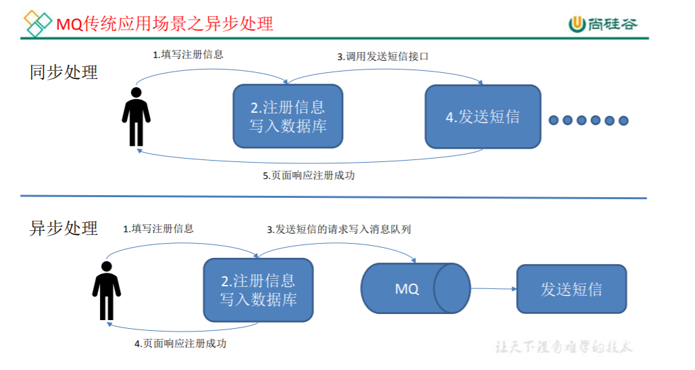
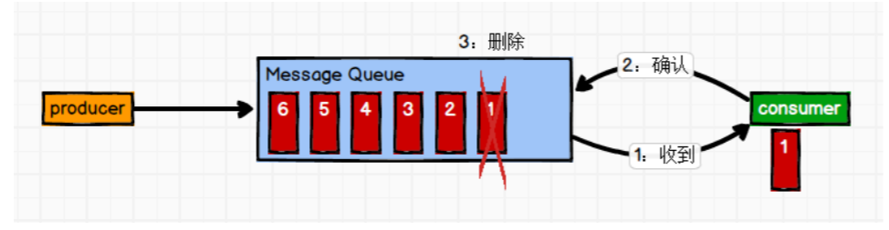
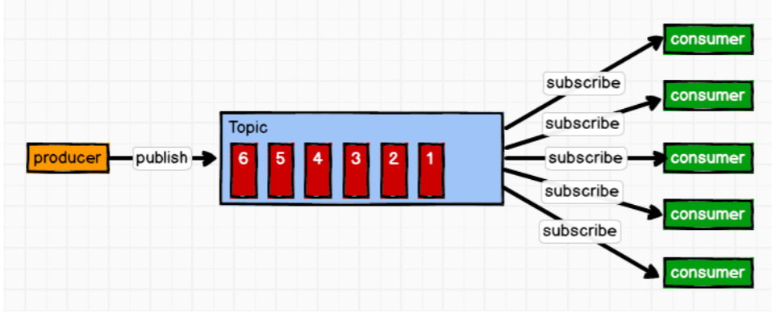
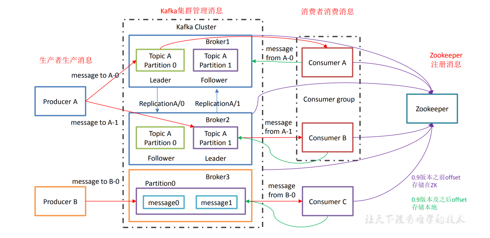

# 概述

## 定义

Kafka是一个**分布式**的基于**发布/订阅模式**的消息队列(Message Queue)，主要用于大数据实时处理领域。

## 消息队列

### 应用场景

    
      消息队列应用场景

### 使用消息队列的优点

#### 解耦

#### 可恢复性

降低了系统组件之间的耦合性，即使一部分组件失效也不会影响到整个系统。即使一个处理消息的进程挂掉，加入队列中的消息仍然可以在该进程恢复后被处理。

#### 缓冲

有助于控制和优化数据流经过系统的速度，解决生产消息和消费消息处理速度不一致的情况。

#### 灵活性和峰值处理能力

使用消息队列能够使得关键组件顶住突发访问压力。

#### 异步通信

有些消息不必要立即处理。消息队列机制提供了异步处理机制，允许用户将消息放入队列而不立即处理，待需要时在处理。

### 消息队列的两种模式

#### 点对点模式（一对一，消费者主动拉取数据，消费者消费后会清除消息）

    
      点对点模式

#### 发布/订阅模式（一对多，消费者消费数据后不会清除消息）

    
      发布/订阅模式

#### 基础架构

    
      Kafka基础架构

一个Topic可以有多个Partition。每个Partition可以分布在不同的机器上，提高并发。

Follower起到对Leader备份作用。

同一个Consumer group里的消费者不能同时消费同一Partition里的消息。

Consumer group可以提高消费能力。

Zookeeper保存Kafka一些信息以及消息者消费进度。

- Producer： 生产者产生消息，向broker发送消息。
- Consumer：消费者，从broker取消息。
- Consumer Group： 消费者组。组内每个消费者负责消费不同分区(Partition)的数据，一个分区只能由组内的一个消费者消费，消费者组之间互不影响。所有消费者都属于某个消费者组，消费者组是逻辑上的一个订阅者。
- Broker：一台kafka服务器就是一个broker。kafka集群由多个broker组成，一个broker可以容纳多个topic。
- Topic：可以理解为一个队列，生产者与消费者都是面向Topic。
- Partition：为了扩展，一个非常大的Topic可以分布到多个broker(服务器)上，一个Topic可以分为多个partition，每个partition都是一个有序队列。
- Replica：副本，该节点上的partition数据不丢失，一个topic的每个分区都有若干个副本，一个leader和若干个follower。
- leader：每个分区多个副本的“主”，生产者与消费者面向的都是leader。
- follower：每个分区多个副本的“从”，实时从leader中同步数据，保持和leader数据的同步。leader发生故障时某个follower会成为新的leader。

## 入门

## 深入

## API

## 监控

## Flume对接Kafka