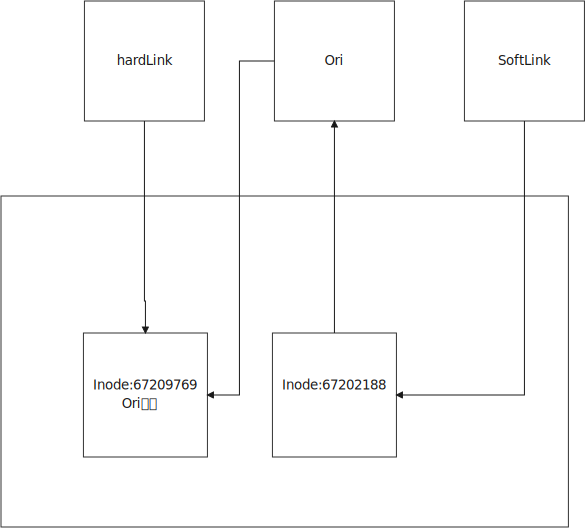

# Linux

基于Centos 7

[TOC]


# 计算机硬件软件体系

## 冯诺依曼体系结构

- 计算机处理的数据和指令一律用二进制表示
- 顺序执行程序
- 计算机硬件由运算器、控制器、存储器、输入和输出设备五大部分组成

## 计算机硬件组成

- 输入设备
- 输出设备
- 存储器
  - 存放数据和程序
  - RAM 速度快，容量小 掉电易失 逻辑IO
  - ROM 容量大，速度慢  长久保存 物理IO
- CPU（中央处理器）
  - 控制器
  - 运算器

## 硬盘分类

#### 存储介质不同分类

- 机械硬盘（Hard Disk Driver，HDD）
- 固态硬盘（Solid State Disk，SSD）

#### 顺序读写与随机读写

每个扇区能存的数据是等大的

扇区编号是不连续的（1 10 2 9 3 8 4 7 5 6）

## 网络

- IP地址
- 子网掩码
- 默认网关
- 域名服务器（DNS）

#### 网络连接模式

##### 主机模式（host-only）

- 某些特殊的网络环境中，要求将真实环境和虚拟环境隔离，这时可以采用host-only模式
- 该模式下，所有虚拟系统可相互通信，但虚拟系统和真实网络是被隔离开的

##### 桥接模式

虚拟机和宿主机之间的关系就像连接在同一个Hub上的两台电脑

有可能会产生IP冲突

##### NAT（网络地址转换）

## 软件分类

#### 应用软件

#### 系统软件

- Winwods
- Mac
- GNU/Linux

## Linux分支

- RedHat（收费）
  - Centos
    - 完全开源免费
  - 主要用于服务器版本
- Debain（免费）
  - Ubuntu
    - 视窗界面良好的Linux系统
    - 主流软件都支持的Ubuntu系统


# Linux命令

## 如何学习命令

- 命令与参数之间必须用空格隔开
- 区分大小写
- 命令帮助文档
  - help
    - 内置命令的帮助文档
  - man
    - 外部命令的帮助文档
    - yum install man man-pages -y

## 常用命令

- whereis 查询命令文件的位置
- file 查看文件的类型
- who 查看当前在线的用户
- whoami 我是谁
- pwd 我在哪儿
- uname -a 查看内核信息
- echo 打印语句
- clear 清屏
- history 历史

## 特殊字符

- .点：
  - 如果是文件名的开始，则说明当前文件是一个隐藏文件
  - . 指向当前目录
  - .. 指向当前目录的上一级目录
- $
  - 是一个变量
    - $PATH Linux的环境变量
- *
  - 通配符
- ~
  - 当前用户的家目录
  - 每个用户的家目录是不一样的
  - root用户家目录在系统根目录下
  - 其他用户的家目录在/home/用户名为家目录
- 空格
  - 命令与参数用空格隔开
- 命令的参数
  - 完整参数 --
  - 缩写 -
- /
  - 根目录

## 关机

```shell
shutdown -h now
power off
```

## 软件安装

### 软件安装限制

```shell
vim /etc/selinux/config
SELINUX=disabled
```

## 查看磁盘/内存使用情况

```shell
# 查看磁盘剩余空间
# df -B[K M G T P E Z Y]
(base) [snnuxjb@mu01 ~]$ df -BT
文件系统       1T-块  已用  可用 已用% 挂载点
devtmpfs          1T    0T    1T    0% /dev
tmpfs             1T    0T    1T    0% /dev/shm
tmpfs             1T    1T    1T    1% /run
tmpfs             1T    0T    1T    0% /sys/fs/cgroup
/dev/sda3         1T    1T    1T   46% /
/dev/sda1         1T    1T    1T    3% /boot/efi
/dev/sdb         22T    8T   13T   38% /home
tmpfs             1T    0T    1T    0% /run/user/1004
tmpfs             1T    0T    1T    0% /run/user/1002
```

```shell
# 查看内存使用情况
# free -[b k m g]
(base) [snnuxjb@mu01 ~]$ free -g
              total        used        free      shared  buff/cache   available
Mem:             62           2          14           0          45          59
Swap:            31           0          31

```

## 查看端口占用情况

## 过滤器

### grep 打印匹配行

grep pattern [file...] 简单模式：用来找到文件中的匹配文本

head/tail 打印文件开头/结尾部分

```shell
head -n 5 output.txt # 打印前5行
tail -n 5 output.txt # 打印后5行
tail -f output.txt # 循环打印（查看日志，打印文件末尾最新内容）
```


### 权限

chmod 更改文件模式

chown 更改文件所有者和用户组

### 进程

#### ps 报告当前进程快照

常用 ps aux

#### top 显示任务

#### jobs 列出活跃任务

#### kill 给一个进程发送信号

| 编号 | 名字 | 作用 |
| ---- | ---- | ---- |
| 1    | hup  | 挂起 |
| 2    | int  | 中断 |
| 9    | kill | 杀死 |
| 15   | term | 终止 |
| 18   | cont | 继续 |
| 19   | stop | 停止 |

## [网络](# Linux网络信息)

### 修改网络信息

```shell
vim /etc/sysconfig/network-scripts/ifcfg-ens33
```

### 关闭防火墙

```shell
systemctl stop firewalld
```

### ping

### ssh

### ftp

### 查看端口号占用

nestat lsof

```shell
# netstat -tunlp|grep 10000

[snnuxjb@mu01 ~]$ netstat -tunlp|grep 10000
(Not all processes could be identified, non-owned process info
 will not be shown, you would have to be root to see it all.)
tcp        0      0 0.0.0.0:10000           0.0.0.0:*               LISTEN      4463/python         
tcp6       0      0 :::10000                :::*                    LISTEN      4463/python 


# lsof -i:10000
(base) [snnuxjb@mu01 ~]$ lsof -i:10000
COMMAND    PID    USER   FD   TYPE    DEVICE SIZE/OFF NODE NAME
jupyter-n 4463 snnuxjb    5u  IPv4  54493055      0t0  TCP *:ndmp (LISTEN)
jupyter-n 4463 snnuxjb    6u  IPv6  54493056      0t0  TCP *:ndmp (LISTEN)
jupyter-n 4463 snnuxjb   10u  IPv4 112158367      0t0  TCP mu01:ndmp->10.150.195.154:vchat (ESTABLISHED)
jupyter-n 4463 snnuxjb   13u  IPv4 112158372      0t0  TCP mu01:ndmp->10.150.195.154:ms-sql-m (ESTABLISHED)

```

## 文件操作

查看下一节中的[文件操作](# Linux 文件系统)

## 服务相关

```shell
systemctl start xxx.service

systemctl stop xxx.service

systemctl restart xxx.service

systemctl status xxx.service
```

# Linux 文件系统

## 一切皆文件

- 文件系统

  - 操作系统如何管理文件，内部定义了一些规则或者定义

- 在Linux中所有的东西都是以文件的形式进行操作

- Linux维护着一个树状结构的文件模型

  - 只有一个根节点 /
  - 一个节点上可以有多个子节点

- 查找文件的方式

  - 相对路径
    - 以当前路径为基点，查找其他资源
  - 绝对路径
    - 以根目录为基准点，查找其他资源
  - 日常使用无所谓哪种方式，配置文件尽量写绝对路径

- 可以随意挂载磁盘(动态扩容)

  ```shell
  mount /dev/disk1 /usr/download
  disk2 1T
  ```

## 文件目录

<div align='center'>
    
</div>


- /bin
  - Binary 存放着二进制程序等
- /boot
  - 启动Linux的一些核心文件 包括一些链接文件和镜像文件
- /dev
  - Device 存放Linux的外部设备 在Linux中访问设备的方式和访问文件的方式是相同的
- /etc
  - 配置文件及其子目录
- /lib
  - 系统基本的动态链接共享库，类似于dll，几乎所有的应用程序都需要用到这些共享库
- /lost+found
  - 一般是空的，当非法关机后，这里就存放了一些文件
- /media
  - Linux自动识别一些设备，例如U盘、光驱等，当识别后会把识别到的设备挂载到这个目录下
- /mnt
  - 让用户临时挂载别的文件系统，可以将光盘挂载到/mnt/下，然后进入目录就可以浏览光盘里的内容
- /opt
  - 主机额外安装软件的目录
- /proc
  - 虚拟的目录，主机内存的映射，可以直接访问这个目录获取系统信息
  - 该目录下的内容在内存上，也可以直接修改里面的某些文件
  - echo 1 > /proc/sys/net/ipv4/icmp_echo_ignore_all 屏蔽ping，使得别人无法ping通主机
- /root
  - root用户的主目录
- /sbin
  - Super User bin 存放系统管理员使用的系统管理程序
- /selinux
  - Redhat/Centos所特有的目录，一个安全机制，类似于windows的防火墙，存放selinux相关文件
- /srv
  - 存放一些服务启动之后需要提取的数据
- /sys
  - 安装了2.6内核中新出现的文件系统sysfs，sysfs集成了3种文件系统信息，是内核设备树的一个直观反映
    - 针对进程信息的proc文件系统
    - 针对设备的devfs文件系统
    - 针对伪终端的devpts文件系统
  - 当一个内核对象被创建的时候，对应的文件和目录也在内核对象子系统中被创建
- /tmp
  - 存放临时文件
- /usr
  - 用户许多应用程序和文件都放在这个目录下，类似于windows下的program files
  - /bin
    - 系统用户使用的应用程序
  - /sbin
    - 管理员用户所使用的管理程序和系统守护程序
  - /src
    - 内核源代码默认的放置目录
- /var
  - 存放着不断扩充的东西，习惯将那些经常需要被修改的目录放在这个目录下，包括各种日志文件
- /run
  - 临时系统文件，存储着系统启动以来的信息，当系统重启时这个目录下的文件应该被伤处或者清除。

## 文件操作

- cd

  - 改变当前工作目录
- ls ll

  - 显示出指定目录下所有的文件
  - 文件的类型
    - -普通文件
    - d文件夹
    - l软连接
- mkdir

  - 创建文件目录
  - mkdir -p a/b/c/d/e/f 会自动创建文件父目录
  - mkdir-p lucky/{1,2,3,4} 创建多个子目录
- rmdir

  - 删除空文件夹
  - 可以安全的删除文件夹
- cp

  - 复制文件或者文件目录
  - -r 递归复制（复制文件夹的时候需要）
- mv
  - 移动文件或者文件夹
  - 修改文件名称
- rm
  - 删除文件
    - rm
    - rm -f 强制删除
  - 删除文件夹
    - rm -r
    - rm -rf
- touch
  - 如果没有就创建一个文件
  - 吐过该文件已经存在，修改文件的三个时间，将三个时间改为当前时间。
- stat
  - 查看文件状态
  - inode当前文件在文件系统的唯一标识，类似于ID
  - 时间
    - access 访问时间
    - modify 修改文件内容时间
    - change 修改文件元数据信息时间
      - 文件大小 文件所有者 文件权限(chmod)
- ln
  - 创建文件的链接
  - 软（符号）链接
    - ln -s ori slink
    - 创建一个符号，这个符号链接到原始文件，原始文件删除后，软链接就无效了
  - 硬链接
    - ln ori hlink
    - 保护某个文件不被误删除
    - 链接原始的文件
  - 链接在链接文件的时候，推荐使用文件的绝对路径，否则有可能会出现问题

<div align='center'>
    
</div>

- tail
  - -f  相当于软连接 Inode一变（原来的文件一删除，再创建同名文件）就不能监视到了
  - -F 相当于硬链接  监视同名文件
- find
  - find path-name name
- [vi/vim](# Vi&Vim)

## 文件大小

- 分区信息
  - df -h
- 指定文件目录大小
  - du -h --max-depth=1 folder
- swap
  - 一个特殊分区，以硬盘代替内存
  - 当内存使用满时，可以将一部分数据写出到swap分区

## 文件压缩

### tar

- 主要神队的问价是 xxx.tar.gz
- 解压缩
  - tar -zx(解压)v(过程)f(文件) xxx.tar.gz
  - tar -zxf xxx.tar.gz -C /dir/
- 压缩
  - tar -zc(压缩)f(文件) xxx.tar.gz(压缩后的名字) xxx(源文件)

### zip和unzip

- 安装
  - yum install zip unzip -y
- 压缩
  - zip -r tomcat.zip xxx
- 解压缩
  - unzip xxx.zip


## 计算机间的数据传输

### Windows<->Linux

-  lrzsz
  - 需要手动安装
    - yum install lrzsz -y
  - rz 上传
    - 将文件从window上传到Linux
  - sz下载
    - 将文件从Linux传输到Windows
- xftp
  - 较为通用的方式
  - MobaXstream、Xshell带的Xftp等

### Linux<->Linux

- scp 源数据地址(soucce) 目标数据地址(target)
  - -r 传文件夹
- 数据同步 rsync -rvl zookeeper-3.5.7 root@192.168.232.131:/opt

# Vi&Vim

<div align='center'>
	
</div>


<div align='center'>
    
     <br/><br/>
    
     <br/><br/>
    
     <br/><br/>
    
     <br/><br/>
    
     <br/><br/>
    
     <br/><br/>
    
</div>

## 基础

### 打开文件

- 正常打开
  - vi/vim file
- 打开文件，将光标置于第n行
  - vi/vim +n file
- 打开最后一行
  - vi/vim + file
- 打开并将光标置于指定word的位置
  - vi/vim +/word file

### 三种模式

1. 编辑模式

   - 每一个按键都有对应功能

2. 输入模式(Insert)

   - 文本编辑模式，键盘按下什么，输入什么

3. 末行（命令行）模式

   - 输入特定的命令(q wq)

#### 三种模式切换

<div align='center'>
	
</div>
- 编辑模式->输入模式
  - i 在当前位置插入数据
  - a 行首追加数据
  - o 在当前行后面开启一个新的输入行
  - I 行首
  - A 行尾追加
  - O 上一行
- 输入模式->编辑模式
  - 按下ESC
- 编辑模式->末行模式
  - :
- 末行模式->编辑模式
  - 按下ESC

#### 编辑模式

- G 最后一行
- gg 跳转到第一行
- numgg 跳转到第num行
- w 下一个单词
- numw 第num个单词
- dw 删除一个单词
- numdw 删除num个单词
- dd 删除一行
- numdd 删除num行
- u 回退到前面的操作
- . 回退u执行的操作
- yw 复制一个单词
- numyw 复制num个单词
- yy 复制一行
- numyy 复制num行
- p 粘贴
- nump zhantienum次
- x 剪贴
- numx 剪贴num个字符
- r 替换，然后输入一个字符替换
- numr 替换num个字符
- hjkl 左下上右
- ZZ 保存并退出
- ctrl+s 锁屏 ctrl+q 解锁

#### 输入模式

键盘的输入直接到文本中、

#### 末行模式

- set nu 设置行号
- set nonu 取消行号
- w 保存
- q 退出
- wq 保存并退出
- q! 强制退出，不保存
- 如果上次异常退出会保留同名隐藏文件，每次启动会提示
  - 如果确定当前文件没问题，则需删除隐藏文件
- /pattern
  - 搜索指定的字符串
  - n 向下查找 N 逆向查找
- s/ori/replace/g
  - 用replace 替换 ori
  - 替换字符串
  - g 替换当前行所有，否则只替换当前行第一个
  - 查找指定行
    - 3,8s/ori/replace/g
  - 替换全文
    - g/ori/s/replace/g

# Linux网络信息

## 主机名称

- 临时修改
  - hostname newname
- 长久修改
  - vi /etc/hostname

## DNS解析

- 域名解析服务 将域名转换为IP地址
- DNS域名劫持
  - 修改hosts文件
- 修改主机域名
  - vi /etc/hosts

## 网络相关命令

- ifconfig

  - 查看当前网卡配置信息
  - 属于net-tools中的一个命令

- netstat

  - 查看当前网络状态
  - netstat -nap
    - -n(--numeric) don't resolve names
    - -a(--all) display all sockets
    - -p(programs) display PID/Program name for sockets

  - netstat-r(--route) 路由表

- ping

  - 查看与目标主机是否能连通

- telnet

  - 远程登陆

- curl

  - restful 所有资源在网络上都有唯一的定位
  - 可以通过这个唯一定位标识指定的资源
  - curl -X GET http://www.baidu.com
    - 获取网页资源（文本形式）

## 防火墙

- Centos7+中使用firewalld代替以前的iptables

  - ```shell
    #查看防火墙状态
    systemctl status firewalld.service
    
    #临时停止firewall
    systemctl stop firewalld.service
    
    #禁止firewall 开机启动
    systemctl disable firewalld.service
    
    #查看防火墙状态，是否running
    firewall-cmd --state
    
    #重新载入配置信息，比如添加或移除规则后，需要reload
    firewall-cmd --reload
    
    #列出支持的zone
    firewall-cmd --get-zones
    
    #列出支持的服务，在列表中的服务是放行的
    firewall-cmd --get-services
    
    #查看ftp服务是否支持，返回yes或者no
    firewall-cmd --query--service ftp
    
    #临时开放ftp服务
    firewall-cmd --add-service=ftp
    
    #永久开放ftp服务
    firewall-cmd --add-service=ftp --permanent
    
    #永久移除ftp服务
    firewall-cmd --remove-service=ftp --permanent
    
    #永久添加80端口
    firewall-cmd --add-port=80/port --permanent
    ```

- 开启一个端口

  - ```shell
    #添加
    firewall-cmd --zone=public --add-port=80/tcp --permanent
    
    #重新载入
    firewall-cmd --reload
    
    #查看
    firewall-cmd --zone=public --query-port=80/tcp
    
    #删除
    firewall-cmd --zone=public --remove-port=80/tcp --permanent
    ```

## 加密算法

### 不可逆加密算法

### 对称加密算法

加密解密使用相同密钥，算法公开、计算量小。

代表性算法：DES、3DES、AES

### 非对称加密算法

代表性算法：RSA、DSA(数字签名用)

## 主机间相互免密钥

可以通过ssh命令免密钥连接到其他的主机

- 生成密钥
  - ssh-keygen -t rsa -P '' -f ~/.ssh/id_rsa
- 将公钥传递给想要免密钥登陆的主机
  - ssh-copy-id -i ~/.ssh/id_rsa.pub root@192.168.232.129

## 主机名与Host校验

<div align='center'>
    
</div>

修改/etc/ssh/ssh_config文件的配置，以后不会出现这个问题。

- StrictHostKeyChecking no
- UserKnownHostsFile ~/.ssh/konwn_hosts

# 日期和时间

## 时间命令

- date
  -  查看当前系统时间
- cal
  - 查看日历

## 日期自动同步

- 自动同步时间
  - yum install ntp -y
  - ntpdate cn.ntp.org.cn

# 用户-组-权限

## 用户

- 新增用户
  - useradd newuser
  - 会创建同名的组合家目录
- 设置密码
  - passwd password
- 删除用户
  - userdel -r deluser
  - 递归删除家目录和组
- 修改用户信息
  - usermod -l oldName newName 修改用户名
    - 家目录和组名称不会被修改
  - usermod -L luckyss 锁定用户名
  - usermod -U luckyss 解锁用户名
- 常用文件
  - cat /etc/shadow
    - 用户名和密码
  - cat /etc/passwd
    - 用户名 编号 组编号 家目录 命令目录
    - root​ : ​x:0:0:root:/root:/bin/bash

## 组

- 创建组
  - groupadd newgroup
- 删除组
  - groupdel delgroup
- 修改组名字
  - groupmod -n oldgroupname newgroupname
- 查看用户对应的组
  - groups
  - groups userxxx
    - 当创建用户的时候，会默认创建一个同名的主组
- 修改用户的组
  - usermod -g userxxx maingroup(主组，替换原来的主要组)
  - usermod -G userxxx subgroup(附属组)

## 权限

<div align='center'>
    
</div>


- 三组权限

  - r :读

  - w :写

  - x :执行

  - -:没有权限

- 权限的UGO模型
  - 三组权限
  - 属主权限 属组权限 其他权限
  - 修改文件的权限可以从 rwx 和 ugo 两个方面进行修改    
- 修改文件权限
  - 修改文件所属
    - chown n1 /var/xxx
    - chown n1:m1 /var/lucky2
    - 修改文件夹时，让子目录迭代修改
      - chown -R n1:m1 xxx
    - chgrp m2 xxx
      - 当用户的组呗修改之后 需要重新登陆才能获取新组的权限
  - 修改文件的rwx
    - chmod o+w xxx
    - chmod ug+rw xxx
    - chmod ugo-rw xxx
    - chmod 777 xxx

<div align='center'>
    
</div>


# 管道与重定向

## 管道

- 将前面命令的结果作为参数传递给后面的命令
- grep
  - 强大的文本搜索工具

## 重定向

- 改变数据输出的位置，方向
- 0 in 1 out 2 err
  - ls / 1>file 标准输出
  - ls / >file 标准输出
  - ls abcd 2>file 错误输出
- \> 替换 >> 追加
  - ls / 1>>file
- 集合使用
  - ls /etc/abc \> file 2>&1
  - ls /etc/abc \>> file 2>&1
- 信息黑洞
  - ls /etc/abc >> /dev/null 2>&1
  - 目的是为了不将信息输出到控制台或者别的文件
  - 类似的有路由黑洞

# Linux的系统进程

## 进程信息

- ps -ef
  - UID PID PPID C STIME TTY TIME CMD
  - UID 所属用户
  - PID 当前进程编号
  - PPID 当前进程编号的父进程编号
- ps -ef | grep redis
- ps -aux
  - 所有信息
- ps -aux--sort-pcpu
- top

## 后台进程

- 只需要在命令后面添加一个 &

  - ping www.baidu.com >> baidu &

- jobs -l

  - 可以查看当前的后台进程
  - 只有当前用户界面可获取到

- nohup 可以防止后台进程被挂起

  - nohup ping www.baidu.com >> baidu 2>&1 &

  

## Kill进程

kill-9 pid

# Linux软件安装

## 环境变量

当执行一个命令的时候，默认从当前路径开始查找，如果当前路径找不到命令文件，从环境变量$PATH查找。

$PATH配置文件在 /etc/profile

windows中路径之间使用分号(;)分隔，Linux中使用冒号(:)分隔。

Linux每次修改完环境变量需要重新加载文件  source /etc/profile

## 软件的安装方式

- 解压就可以使用
- 使用安装包安装(centos rpm)
- 使用源码安装

### RPM(RedHat Program Manager)安装

- RedHat Package Manager RedHat的一种包管理方式

- 通过RPM命令安装软件

  - rpm -ivh xxx.rpm

- 查询软件
  - rpm -qa | grep jdk
  - rpm -q jdk
- 卸载
  - rpm -e xxx

## 压缩包安装

- 解压文件
  - tar -zxvf xxx
- 将解压文件夹mv到要安装的目录
  - mv xxx  /opt

## yum安装

### 作用

- 管理RPM包
- 帮助安装软件
- 如果软件有其他依赖，会自动帮助安装依赖
- 类似于Maven

### 命令

- search 查询命令或软件
- info 查看包的信息
- list xxx
  - list / 查询安装的rpm包
  - list jdk 查询安装的jdk

### 更换yum源

- 安装wget
  - yum install wget -y
- 备份原始配置文件
  - mv /etc/yum.repos.d/CentOS-Base.repo /etc/yum.repos.d/CentOS-Base.repo.backup
- 使用wget获取阿里云yum源配置文件
  - wget -O /etc/yum.repos.d/CentOS-Base.repo https://mirrors.aliyun.com/repo/Centos-7.repo
- 清空以前yum源缓存
  - yum clean all
- 获取阿里云缓存
  - yum makecache

# Linux三剑客

## 普通剑客

- cut
  - 用指定的规则来切分文本
  - cut -d':' -f1,2,3 passwd | grep school
- sort
  - sort lucky
    - 对文本中的行进行排序
  - sort-t' ' -k2 lucky
    - 对每一行的数据进行切分，按照第二列进行排序
  - sort-t' ' -k2 -r lucky
    - 逆序
  - sort-t' ' -k2 -n lucky
    - 按照数值大小进行排序，如果有字母，字母在前
- wc
  - 统计simple文件单词的数量
  - wc simple
  - l w c simple
    - l line
    - w words(以空格分割)
    - c chars(字符数)

## 剑客1号--grep

- 可以对文本进行搜索
- 同时搜索多个文件
  - 从文档中查询指定的数据
- 显示匹配的行号
  - grep -n school passwd
- 显示匹配的 忽略大小写
  - grep -nvi school passwd --color=auto
- 使用正则表达式匹配
  - grep -E "[1-9]+" passed --color=auto

## 剑客2号--sed

- sed 是Stream Editor(字符流编辑器)的缩写，简称流编辑器
- sed软件从文件或管道中读取一行，处理一行，输出一行，循环往复
- 一次一行的设计使得sed软件性能很高
- vi/vim 命令打开文件是一次性将文件加载到内存

## 剑客3号--awk

- 功能十分强大，有专门的书讲解

# Shell编程

## 概述

### 名词解释

### Kernel

- 主要是和硬件打交道

### Shell

- 命令解释器
- c语言编写，既是一种命令语言也是一种程序设计语言
- Shell指一种应用程序，为用户提供了一个界面，可供访问操作系统内核的服务

### Shell两大主流

- sh
  - Bourne shell(sh), Solaris,hpux默认的shell
  - Bourne again shell(bash), Linux系统默认shell
- csh
  - C shell(csh)
  - tc shell(tcsh)

### #! 声明

- 告诉操作系统气候路径所指定的程序即是解释此脚本文件的Shell程序

- ```shell
  #! /bin/bash
  echo "Hello World !"
  ```

## Shell脚本执行

- 输入脚本的绝对路径或相对路径
  - /root/xxx.sh
  - ./xxx.sh
  - 执行的必须是一个可执行文件
- bash或sh + 脚本
  - sh xxx.sh
  - 当脚本没有执行权限(x)时，root和文件所有者通过该方式可以正常执行
- 在脚本路径前加 . 或source
  - .xxx.sh
  - source xxx.sh
- 区别
  - 前两种会新开一个bash，不同bash中的变量无法共享
  - 第三种是在同一个shell里面执行的
- export:可以将当前进程的变量传递给子进程使用
  - 篇日志profile文件的时候，所有变量前必须加export

## Shell基础入门

### Shell变量

- 定义变量时，变量名不加$，使用时加$

  - 命名只能使用英文字母、数字和下划线，首个字符不能以数字开头

  - 中间不能有空格

  - 不能使用标点符号

  - 不能使用bash里的关键字(可用help命令查看保留关键字)

- 变量的类型
  - 局部变量
    - 仅在当前shell实例中有效
  - 环境变量
    - 所有程序，包括shell启动的程序，都能访问环境变量，有些程序需要环境变量来保证其正常运行
  - Shell变量
    - 由shell程序设置的特殊变量。有一部分是环境变量，有一部分是局部变量

### Shell字符串

- shell中常用的数据类型

- 单引号

  - 单引号里的任何字符都会原样输出，里面出现的变量无效
  - 里面不能出现单独的单引号，但可成对出现，作为字符串拼接使用

- 双引号

  - 里面可以有变量

  - 可以出现转义字符

  - ```shell
    #声明字符串
    str1="hello world 1"
    str2="hellp world 2"
    
    #字符串拼接--双引号
    name='simple'
    name1="hello, "$name" !"
    name2="hello, "${name}" !"
    echo $name1
    echo $name2
    #hello, simple !
    #hello, simple !
    
    #字符串拼接--单引号
    passwd='123456'
    passwd1='hello, '$passwd' !'
    passwd2='hello, ${passwd} !'
    echo $passwd1
    echo $passwd2
    #hello, 123456 !
    #hello, ${passwd} !
    ```

### Shell数组

- bash支持一维数组（不支持多维），没有限定数组的大小

- 下标由0开始。

- ```shell
  # 定义数组 括号表示数组，数组元素用 空格 分隔
  # 数组名=(值1 值2 ... 值n)
  arrs = ("football" "basketball" "pingpang")
  
  # 读取数组
  arr=${arrs[1]}
  echo $arr
  
  # 使用@获取数组中所有元素
  echo ${arrs[@]}
  
  # 获取数组长度
  length1=${#arrs[@]}
  length2=${#arrs[*]}
  
  echo $length1
  echo $length2
  ```

### Shell注释

- 以#开头，行注释，会被编译器忽略

- 通过对每行添加 # 来设置多行注释

- 特殊的多行注释

  - ```shell
    :<<xxx
    注释内容
    xxx
    
    一般情况下xxx使用 EOF
    ```

### Shell参数传递

- 执行shell脚本时，向脚本传递参数，脚本内获取参数的格式为：$num num代表一个数字

- | 参数处理 | 参数说明                                                    |
  | -------- | ----------------------------------------------------------- |
  | $#       | 传递到脚本的参数个数                                        |
  | $*       | 以一个字符串显示所有向脚本传递的参数                        |
  | $$       | 脚本运行的当前进程ID号                                      |
  | $!       | 后台运行的最后一个进程的ID号                                |
  | $?       | 显示最后命令的退出状态，0表示没有错误，其他任何值表明有错误 |
  | $0       | 执行的文件名                                                |

## Shell进阶

### 运算符

#### 算术运算符

- | 运算符 | 说明                 | 举例         |
  | ------ | -------------------- | ------------ |
  | +      | 加法                 | expr $a + $b |
  | -      | 减法                 | expr $a - $b |
  | *      | 乘法                 | expr $a * $b |
  | /      | 除法                 | expr $a / $b |
  | %      | 取余                 | expr $a % $b |
  | =      | 赋值                 | a=$b         |
  | ==     | 相等，比较两个数字   | $a==$b       |
  | !=     | 不相等，比较两个数字 | $a!=$b       |

#### 关系运算符

- 关系运算符只支持数字，不支持字符串，除非字符串的值是数字

    ```shell
    #! /bin/bash
    
    a=10
    b=20
    
    if [ $a -eq $b ]
    then
    	echo "$a -eq $b : a == b"
    else
    	echo "$a -eq $b : a != b"
    fi
    
    if [ $a -ne $b ]
    then
    	echo "$a -ne $b : a != b"
    else
    	echo "$a -ne $b : a == b"
    fi
    
    
    if [ $a -gt $b ]
    then
    	echo "$a -gt $b : a > b"
    else
    	echo "$a -gt $b : a <= b"
    fi
    
    if [ $a -lt $b ]
    then
    	echo "$a -lt $b : a < b"
    else
    	echo "$a -lt $b : a >= b"
    fi
    
    if [ $a -ge $b ]
    then
    	echo "$a -ge $b : a >= b"
    else
    	echo "$a -ge $b : a < b"
    fi
    
    if [ $a -le $b ]
    then
    	echo "$a -ge $b : a <= b"
    else
    	echo "$a -ge $b : a > b"
    fi
    
    ```


#### 布尔运算符

```shell
#!/bin/bash

a=10
b=10

if [ $a != $b ]
then
	echo "$a != $b : a != b"
else
	echo "$a != $b : a == b"
fi	
	
if [ $a -lt 100 -a $b -gt 15 ]
then
	echo "$a < 100 && $b > 15 true"
else
	echo "$a < 100 && $b > 15 false"
fi

if [ $a -lt 100 -o $b -gt 100 ]
then
	echo "$a < 100 || $b > 100 true"
else
	echo "$a < 100 || $b > 100 false"
fi
```

#### 逻辑运算符

```shell
#!/bin/bash

a=10
b=20

if [[ $a -lt 100 && $b -gt 100 ]]
then
	echo "true"
else 
	echo "false"
fi

if [[ $a -lt 100 || $b -gt 100 ]]
then
	echo "true"
else 
	echo "false"
fi
```

#### 字符串运算符

```shell
#!/bin/bash

a="abc"
b="efg"

if [ $a = $b ]
then
	echo "$a = $b : a == b"
else 
	echo "$a = $b : a != b"
fi

if [ $a != $b ]
then
	echo "$a != $b : a != b"
else 
	echo "$a != $b : a == b"
fi
 
if [ -z $a ]
then
	echo "-z $a : a.length == 0"
else 
	echo "-z $a : a.length != 0"
fi 

if [ -n $a ]
then
	echo "-n $a : a.length != 0"
else 
	echo "-n $a : a.length == 0"
fi 

if [ $a ]
then
	echo "$a : a.empty = true"
else 
	echo "$a : a.empty = false"
fi 
```


#### 文件测试运算符

```shell
#! /bin/bash
file=/home/simple/test.sh
if [-r $file ]
then
	echo "r"
else 
	echo "!r"
fi

if [-w $file ]
then
	echo "w"
else 
	echo "!w"
fi

if [-x $file ]
then
	echo "x"
else 
	echo "!x"
fi

if [-f $file ]
then
	echo "normal file"
else 
	echo "special file"
fi

if [-d $file ]
then
	echo "dir"
else 
	echo "not dir"
fi

if [-s $file ]
then
	echo "not empty"
else 
	echo "empty"
fi

if [-e $file ]
then
	echo "exists"
else 
	echo "not exists"
fi
```

### echo打印数据

- 用于字符串的输出

### test命令

- 用于检查某个条件是否成立，可以进行数值、字符和文件三个方面的测试

- 数字 

  - | 参数 | 说明         |
    | ---- | ------------ |
    | -eq  | 等于为真     |
    | -ne  | 不等于为真   |
    | -gt  | 大于为真     |
    | -ge  | 大于等于为真 |
    | -lt  | 小于为真     |
    | -le  | 小于等于为真 |

- 字符串

  - | 参数      | 说明                |
    | --------- | ------------------- |
    | =         | 等于为真            |
    | !=        | 不等为真            |
    | -z 字符串 | 字符串长度为0为真   |
    | -n 字符串 | 字符串长度不为0为真 |

- 文件测试

  - | 参数      | 说明                           |
    | --------- | ------------------------------ |
    | -e 文件名 | 文件存在为真                   |
    | -r 文件名 | 文件存在且文件可读为真         |
    | -w 文件名 | 文件存在且文件可写为真         |
    | -x 文件名 | 文件存在且文件可执行为真       |
    | -s 文件名 | 文件存在且长度不为0为真        |
    | -d 文件名 | 为目录且存在为真               |
    | -f 文件名 | 文件存在且为普通文件为真       |
    | -c 文件名 | 文件存在且为字符型特殊文件为真 |
    | -b 文件名 | 文件存在且为块特殊文件为真     |

  - ```shell
    # 比较
    num1=100
    num2=100
    if test $[num1] -eq $[num2]
    then
    	echo "num1 == num2"
    else
    	echo "num1 != num2"
    fi
    ```

### 流程控制

#### if

```shell
if condition1
then
	cmd1
elif condition2
then
	cmd2
else
	cmdn
fi
```

#### case

```
case value in
	1)
	cmd1
	cmd2
	...
	cmdn
	;;
	2)
	cmd1
	cmd2
	...
	cmdn
	;;
esac
```

```shell
echo '输入1-5之间的数字：'
echo '你输入的数字为:'
read num
case $num in
	1) echo '1';;
	2) echo '2';;
	3) echo '3';;
	4) echo '4';;
	5) echo '5';;
esac
```

#### for

```
for var in item1 item2 ... itemn
do
	cmd1
	cmd2
	...
	cmdn
done
```

```shell
for loop in 1 2 3 4 5
do
	echo "value ==> $loop"
done

for str in 'This is a string'
do
	echo $str
done
```

#### while循环

```shell
while condition
do
	cmd
done
```

```shell
# bash let 命令，它用于执行一个或者多个表达式，变量计算中不需要加上$表示变量
#!/bin/bash
int=1
while(( $int<=5 ))
do
	echo $int
	let "int++"
done
```

#### break

```shell
#!/bin/bash
while :
do
	echo -n "输入1-5之间的数字："
	read num
	case $num in
		1|2|3|4|5) echo "num == $num";;
		*) echo "你输入的数字不在范围内 break"
		break;;
	esac
done
```

#### continue

```shell
#!/bin/bash
while :
do
	echo -n "输入1-5之间的数字："
	read num
	case $num in
		1|2|3|4|5) echo "num == $num";;
		*) 	echo "你输入的数字不在范围内 break"
			continue
			echo"game over" #不执行
		;;
	esac
done
```

### Shell函数

- 可以function fun() 也可以 fun()直接定义，不带任何返回参数
- 带返回值，可以显示加： return val，也可不加将最后一条命令结果作为返回值(0 - 255)

```sh
#!/bin/bash
# first function
demoFun() {
	echo "first fun"
}

echo "-----demoFun start-----"
demoFun
echo "-----demoFun stop-----"


funwithReturn() {
	echo "fun a + b"
	a=10
	b=6
	echo "result = $(( $a+$b ))"
	return $(( $a+$b ))
}

echo "-----funwithReturn start-----"
funwithReturn
echo "a+b == $?" #通过 $?获取函数返回值
echo "-----funwithReturn stop-----"

funwithParam(){
	echo "first para $1"
	echo "second para $2"
	echo "third para $3"
	echo "there exists $# params"
	echo "all params $*"
}

echo "-----funwithParam start-----"
funwithParam 1 2 3 4 5
echo "-----funwithParam stop-----"
```

# 系统任务设置

## 系统启动流程

- 启动计算机硬件(BIOS)
  - 读取时间
  - 选择对应的启动模式
- Linux系统，找/boot目录，引导系统启动

- 系统开始启动，读取配置文件

  - vim /etc/inittab

  - 启动时控制着计算机的运行级别 runlevel

  - | 级别 | 动作               |
    | ---- | ------------------ |
    | 0    | halt               |
    | 1    | 单用户模式         |
    | 2    | 多用户模式，无网络 |
    | 3    | 多用户完整版       |
    | 4    | 保留模式           |
    | 5    | X11，用户界面模式  |
    | 6    | reboot             |

  - 默认runlevel为3

  - 以runlevel=3开始启动对应的服务和组件

- 开始引导公共的组件或服务

  - vim /etc/rc.d/rc.sysinit

- 开始加载对应runlevel服务

  - vi /etc/rc3.d
    - K:关机时需要关闭的服务
    - S:启动时需要开启的服务
    - 数字代表了开启或者关闭的顺序
    - 所有的文件都是软链接，链接的地址为 /etc/init.d

- 启动完毕，所有服务也被加载完成

## 系统服务

- 可以使用chkconfig命令查看当前Linux主机的服务

  - 

  <div align='center'>
      
  </div>

  - 可以得到不同级别对应的每个服务本次开机自动启动

- 开机结束后，需要使用service(Centos6)和systemctl(Centos7)命令来控制服务的启动和关闭

## 开机自启动服务

- cd /etc/rc.d

- rc.local

  - mkdir -p /usr/local/scripts

- 在文件夹中创建脚本文件

  - vim xxx.sh
  - chmod a+x xxx.sh

- 在 /etc/rc.d/rc.local 文件中添加脚本的绝对路径

  - chmod a+x rc.local

- chkconfig

  - 创建开机自启动脚本文件

  - vim xxx.sh

  - ```shell
    #! /bin/bash
    #开机自启动同步时间
    yum info ntp && ntpdate cn.ntp.org.cn
    ```

  - chmod a+x xxx.sh

  - 将脚本copy到 /etc/init.d目录下

    - cp xxx.sh /etc/init.d/

  - 添加到服务

    - chkconfig --add /etc/init.d/xxx.sh

    - ```shell
      #! /bin/bash
      #chkconfig:2345 10 90
      #description:resind
      #开机自启动同步时间
      yum info ntp && ntpdate cn.ntp.org.cn
      ```

  - reboot

<div align='center'>
    
    <br/><br/>Linux启动流程
</div>

## 定时任务

- crond负责周期任务
  - systemctl status crond.service
- 添加任务，编辑当前用户的任务表
  - crontab -e
- 编辑任务
  - \* \* \* \* \* cmd
  - min hour day mon week cmd
  - \*表示任意时间
  - \-表示区间
  - ,表示分割时段 30 3,19,21 * * * cmd 每天3 19 21点30分执行命令
  - /n 表示分割， \*/5 \* \* \* \* cmd，每隔5分钟执行一次