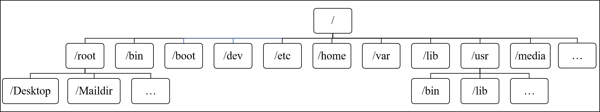
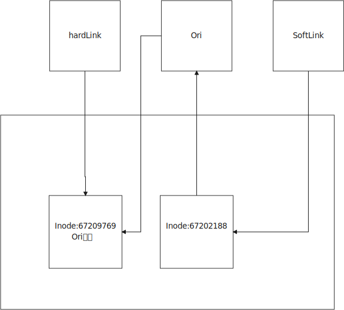

# Linux

[TOC]


# 计算机硬件软件体系

## 冯诺依曼体系结构

- 计算机处理的数据和指令一律用二进制表示
- 顺序执行程序
- 计算机硬件由运算器、控制器、存储器、输入和输出设备五大部分组成

## 计算机硬件组成

- 输入设备
- 输出设备
- 存储器
  - 存放数据和程序
  - RAM 速度快，容量小 掉电易失 逻辑IO
  - ROM 容量大，速度慢  长久保存 物理IO
- CPU（中央处理器）
  - 控制器
  - 运算器

## 硬盘分类

#### 存储介质不同分类

- 机械硬盘（Hard Disk Driver，HDD）
- 固态硬盘（Solid State Disk，SSD）

#### 顺序读写与随机读写

每个扇区能存的数据是等大的

扇区编号是不连续的（1 10 2 9 3 8 4 7 5 6）

## 网络

- IP地址
- 子网掩码
- 默认网关
- 域名服务器（DNS）

#### 网络连接模式

##### 主机模式（host-only）

- 某些特殊的网络环境中，要求将真实环境和虚拟环境隔离，这时可以采用host-only模式
- 该模式下，所有虚拟系统可相互通信，但虚拟系统和真实网络是被隔离开的

##### 桥接模式

虚拟机和宿主机之间的关系就像连接在同一个Hub上的两台电脑

有可能会产生IP冲突

##### NAT（网络地址转换）

## 软件分类

#### 应用软件

#### 系统软件

- Winwods
- Mac
- GNU/Linux

## Linux分支

- RedHat（收费）
  - Centos
    - 完全开源免费
  - 主要用于服务器版本
- Debain（免费）
  - Ubuntu
    - 视窗界面良好的Linux系统
    - 主流软件都支持的Ubuntu系统


# Linux命令

## 如何学习命令

- 命令与参数之间必须用空格隔开
- 区分大小写
- 命令帮助文档
  - help
    - 内置命令的帮助文档
  - man
    - 外部命令的帮助文档
    - yum install man man-pages -y

## 常用命令

- whereis 查询命令文件的位置
- file 查看文件的类型
- who 查看当前在线的用户
- whoami 我是谁
- pwd 我在哪儿
- uname -a 查看内核信息
- echo 打印语句
- clear 清屏
- history 历史

## 特殊字符

- .点：
  - 如果是文件名的开始，则说明当前文件是一个隐藏文件
  - . 指向当前目录
  - .. 指向当前目录的上一级目录
- $
  - 是一个变量
    - $PATH Linux的环境变量
- *
  - 通配符
- ~
  - 当前用户的家目录
  - 每个用户的家目录是不一样的
  - root用户家目录在系统根目录下
  - 其他用户的家目录在/home/用户名为家目录
- 空格
  - 命令与参数用空格隔开
- 命令的参数
  - 完整参数 --
  - 缩写 -
- /
  - 根目录

## 关机

```shell
shutdown -h now
power off
```

## 软件安装

### 软件安装限制

```shell
vim /etc/selinux/config
SELINUX=disabled
```

## 查看磁盘/内存使用情况

```shell
# 查看磁盘剩余空间
# df -B[K M G T P E Z Y]
(base) [snnuxjb@mu01 ~]$ df -BT
文件系统       1T-块  已用  可用 已用% 挂载点
devtmpfs          1T    0T    1T    0% /dev
tmpfs             1T    0T    1T    0% /dev/shm
tmpfs             1T    1T    1T    1% /run
tmpfs             1T    0T    1T    0% /sys/fs/cgroup
/dev/sda3         1T    1T    1T   46% /
/dev/sda1         1T    1T    1T    3% /boot/efi
/dev/sdb         22T    8T   13T   38% /home
tmpfs             1T    0T    1T    0% /run/user/1004
tmpfs             1T    0T    1T    0% /run/user/1002
```

```shell
# 查看内存使用情况
# free -[b k m g]
(base) [snnuxjb@mu01 ~]$ free -g
              total        used        free      shared  buff/cache   available
Mem:             62           2          14           0          45          59
Swap:            31           0          31

```

## 查看端口占用情况

## 过滤器

### grep 打印匹配行

grep pattern [file...] 简单模式：用来找到文件中的匹配文本

head/tail 打印文件开头/结尾部分

```shell
head -n 5 output.txt # 打印前5行
tail -n 5 output.txt # 打印后5行
tail -f output.txt # 循环打印（查看日志，打印文件末尾最新内容）
```


### 权限

chmod 更改文件模式

chown 更改文件所有者和用户组

### 进程

#### ps 报告当前进程快照

常用 ps aux

#### top 显示任务

#### jobs 列出活跃任务

#### kill 给一个进程发送信号

| 编号 | 名字 | 作用 |
| ---- | ---- | ---- |
| 1    | hup  | 挂起 |
| 2    | int  | 中断 |
| 9    | kill | 杀死 |
| 15   | term | 终止 |
| 18   | cont | 继续 |
| 19   | stop | 停止 |


#### killall 杀死指定名称的进程

#### shutdown 关机或重启系统

## 网络

### 修改网络信息

```shell
vim /etc/sysconfig/network-scripts/ifcfg-ens33
```

### 关闭防火墙

```shell
systemctl stop firewalld
```

### ping

### ssh

### ftp

### 查看端口号占用

nestat lsof

```shell
# netstat -tunlp|grep 10000

[snnuxjb@mu01 ~]$ netstat -tunlp|grep 10000
(Not all processes could be identified, non-owned process info
 will not be shown, you would have to be root to see it all.)
tcp        0      0 0.0.0.0:10000           0.0.0.0:*               LISTEN      4463/python         
tcp6       0      0 :::10000                :::*                    LISTEN      4463/python 


# lsof -i:10000
(base) [snnuxjb@mu01 ~]$ lsof -i:10000
COMMAND    PID    USER   FD   TYPE    DEVICE SIZE/OFF NODE NAME
jupyter-n 4463 snnuxjb    5u  IPv4  54493055      0t0  TCP *:ndmp (LISTEN)
jupyter-n 4463 snnuxjb    6u  IPv6  54493056      0t0  TCP *:ndmp (LISTEN)
jupyter-n 4463 snnuxjb   10u  IPv4 112158367      0t0  TCP mu01:ndmp->10.150.195.154:vchat (ESTABLISHED)
jupyter-n 4463 snnuxjb   13u  IPv4 112158372      0t0  TCP mu01:ndmp->10.150.195.154:ms-sql-m (ESTABLISHED)

```

## 文件操作

查看下一节中的[文件操作](# Linux 文件系统)

### 查找文件

locate 通过名字查找文件

find 在目录层次结构中搜索文件

## 压缩文件

tar

zip

rar

## 服务相关

```shell
systemctl start xxx.service

systemctl stop xxx.service

systemctl restart xxx.service

systemctl status xxx.service
```

# Linux 文件系统

## 一切皆文件

- 文件系统

  - 操作系统如何管理文件，内部定义了一些规则或者定义

- 在Linux中所有的东西都是以文件的形式进行操作

- Linux维护着一个树状结构的文件模型

  - 只有一个根节点 /
  - 一个节点上可以有多个子节点

- 查找文件的方式

  - 相对路径
    - 以当前路径为基点，查找其他资源
  - 绝对路径
    - 以根目录为基准点，查找其他资源
  - 日常使用无所谓哪种方式，配置文件尽量写绝对路径

- 可以随意挂载磁盘(动态扩容)

  ```shell
  mount /dev/disk1 /usr/download
  disk2 1T
  ```

## 文件目录

<div align='center'>
    
</div>

- /bin
  - Binary 存放着二进制程序等
- /boot
  - 启动Linux的一些核心文件 包括一些链接文件和镜像文件
- /dev
  - Device 存放Linux的外部设备 在Linux中访问设备的方式和访问文件的方式是相同的
- /etc
  - 配置文件及其子目录
- /lib
  - 系统基本的动态链接共享库，类似于dll，几乎所有的应用程序都需要用到这些共享库
- /lost+found
  - 一般是空的，当非法关机后，这里就存放了一些文件
- /media
  - Linux自动识别一些设备，例如U盘、光驱等，当识别后会把识别到的设备挂载到这个目录下
- /mnt
  - 让用户临时挂载别的文件系统，可以将光盘挂载到/mnt/下，然后进入目录就可以浏览光盘里的内容
- /opt
  - 主机额外安装软件的目录
- /proc
  - 虚拟的目录，主机内存的映射，可以直接访问这个目录获取系统信息
  - 该目录下的内容在内存上，也可以直接修改里面的某些文件
  - echo 1 > /proc/sys/net/ipv4/icmp_echo_ignore_all 屏蔽ping，使得别人无法ping通主机
- /root
  - root用户的主目录
- /sbin
  - Super User bin 存放系统管理员使用的系统管理程序
- /selinux
  - Redhat/Centos所特有的目录，一个安全机制，类似于windows的防火墙，存放selinux相关文件
- /srv
  - 存放一些服务启动之后需要提取的数据
- /sys
  - 安装了2.6内核中新出现的文件系统sysfs，sysfs集成了3种文件系统信息，是内核设备树的一个直观反映
    - 针对进程信息的proc文件系统
    - 针对设备的devfs文件系统
    - 针对伪终端的devpts文件系统
  - 当一个内核对象被创建的时候，对应的文件和目录也在内核对象子系统中被创建
- /tmp
  - 存放临时文件
- /usr
  - 用户许多应用程序和文件都放在这个目录下，类似于windows下的program files
  - /bin
    - 系统用户使用的应用程序
  - /sbin
    - 管理员用户所使用的管理程序和系统守护程序
  - /src
    - 内核源代码默认的放置目录
- /var
  - 存放着不断扩充的东西，习惯将那些经常需要被修改的目录放在这个目录下，包括各种日志文件
- /run
  - 临时系统文件，存储着系统启动以来的信息，当系统重启时这个目录下的文件应该被伤处或者清除。

## 文件操作

- cd

  - 改变当前工作目录
- ls ll

  - 显示出指定目录下所有的文件
  - 文件的类型
    - -普通文件
    - d文件夹
    - l软连接
- mkdir

  - 创建文件目录
  - mkdir -p a/b/c/d/e/f 会自动创建文件父目录
  - mkdir-p lucky/{1,2,3,4} 创建多个子目录
- rmdir

  - 删除空文件夹
  - 可以安全的删除文件夹
- cp

  - 复制文件或者文件目录
  - -r 递归复制（复制文件夹的时候需要）
- mv
  - 移动文件或者文件夹
  - 修改文件名称
- rm
  - 删除文件
    - rm
    - rm -f 强制删除
  - 删除文件夹
    - rm -r
    - rm -rf
- touch
  - 如果没有就创建一个文件
  - 吐过该文件已经存在，修改文件的三个时间，将三个时间改为当前时间。
- stat
  - 查看文件状态
  - inode当前文件在文件系统的唯一标识，类似于ID
  - 时间
    - access 访问时间
    - modify 修改文件内容时间
    - change 修改文件元数据信息时间
      - 文件大小 文件所有者 文件权限(chmod)
- ln
  - 创建文件的链接
  - 软（符号）链接
    - ln -s ori slink
    - 创建一个符号，这个符号链接到原始文件，原始文件删除后，软链接就无效了
  - 硬链接
    - ln ori hlink
    - 保护某个文件不被误删除
    - 链接原始的文件
  - 链接在链接文件的时候，推荐使用文件的绝对路径，否则有可能会出现问题

<div align='center'>
    
</div>

- tail
  - -f  相当于软连接 Inode一变（原来的文件一删除，再创建同名文件）就不能监视到了
  - -F 相当于硬链接  监视同名文件
- find
  - 