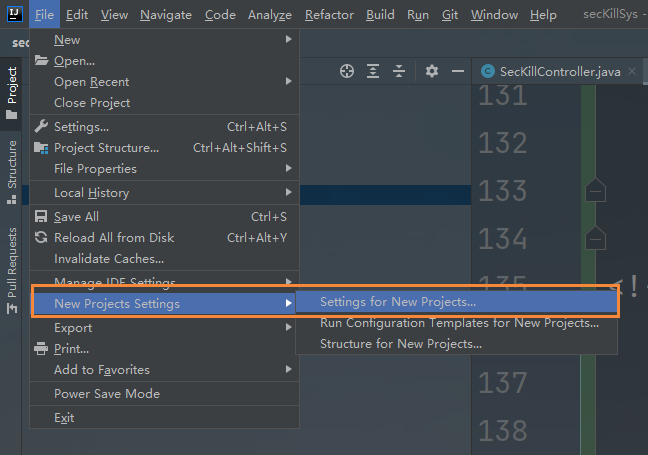
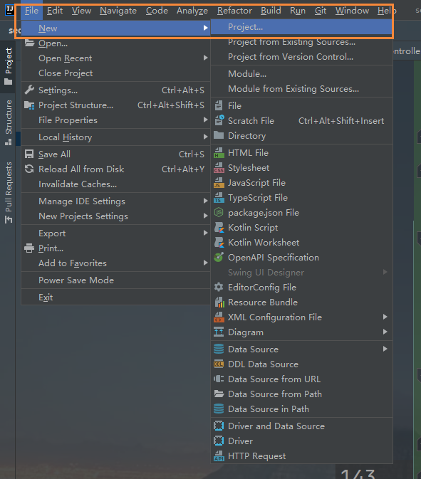
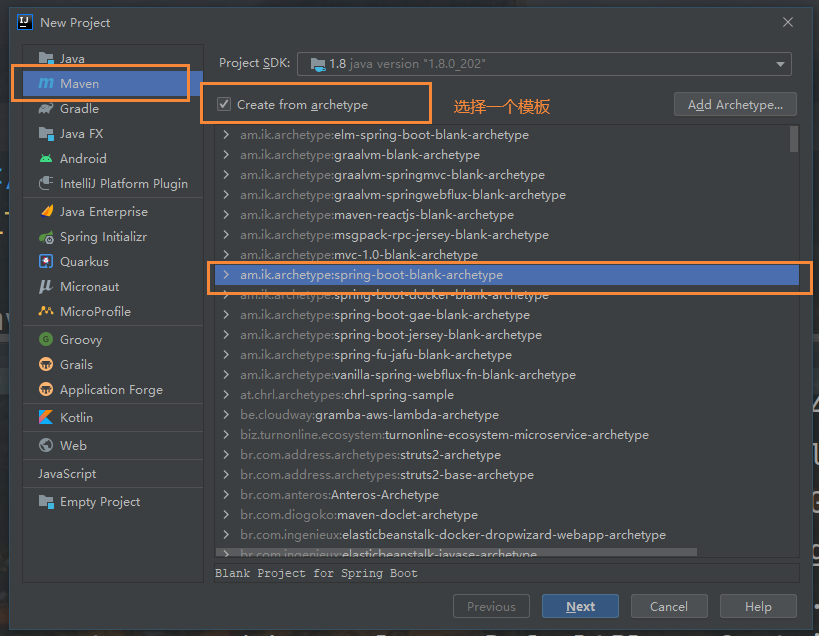
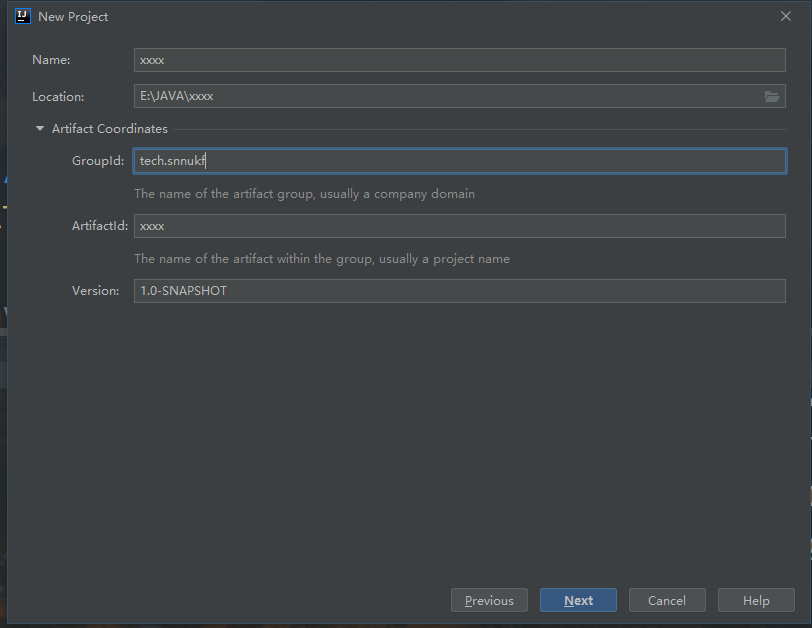
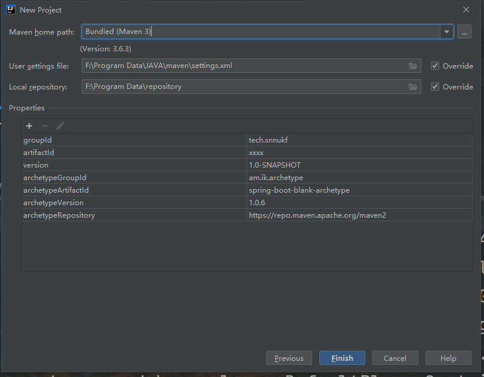

整个示例项目放在[GitHub](https://github.com/simple-jbx/MavenLearn)上。

[原始视频学习连接](https://www.bilibili.com/video/BV1Fz4y167p5)

# Maven简介

## 简介

Maven主要服务于基于java平台的项目构建，依赖管理和项目信息管理。

## 项目构建

实现自动化构建

## 项目构建工具

### Ant构建

比较老，xml脚本编写会使得xml文件特别大。对工程构建过程中的控制特别好。

### Maven

通过其描述信息来管理项目的构建，报告和文档的软件项目管理工具。支持网络下载，采用xml作为配置文件。专注于依赖管理，使用java编写。

### Gradle

集成了Ant灵活和Maven的生命周期管理，用作Android管理工具，采用DSL格式作为配置格式，更简洁。

目前Ant较老，Maven居多，文档比较齐全，gradle使用groovy编写，以后可能会有较大使用空间。

## Maven四大特性

### 依赖管理系统

使用maven来进行jar包依赖管理，需要升级的时候只需修改配置文件即可。

使用groupId、artifactId、version组成的Coordination（坐标）唯一标识一个依赖。

任何基于Maven构建的项目自身也必须定义这三项属性，生成的包可以是jar、war。

依赖示例如下：

```xml
<dependency>
    <groupId>mysql</groupId>
    <artifactId>mysql-connector-java</artifactId>
    <scope>runtime</scope>
</dependency>
```

#### groupId

定义当前Maven项目隶属的实际项目-公司名称。（jar包所在仓库路径）

#### artifactId

实际项目中的一个Maven模块项目名，推荐使用项目名称作为前缀。

#### version

定义Maven项目当前所处的版本。

### 多模块构建

项目重构会将一个项目分解为多个模块。

在Maven中可以定义一个parent POM作为一组module的聚合POM。在该POM中可以使用<modules>标签来定义一组字模块。

### 一致的项目结构

约定大于配置。制定了一套项目目录结构作为标准的Java项目结构，解决不同ide带来的文件目录不一致的问题。

### 一致的构建模型和插件机制

```xml
 <plugins>
      <plugin>
           <groupId>org.springframework.boot</groupId>
           <artifactId>spring-boot-maven-plugin</artifactId>
       </plugin>
</plugins>
```

# Maven命令

命令格式

mvn [plugin-name]:[goal-name]

## 常用命令

| 命令                   | 描述                                                   |
| ---------------------- | ------------------------------------------------------ |
| mvn -version           | 显示版本信息                                           |
| mvn clean              | 清理项目产生的临时文件，一般是模块下的target目录       |
| mvn compile            | 编译源代码，一般编译模块下的src/main/java目录          |
| mvn package            | 项目打包工具，在模块下target目录生成jar或者war等文件   |
| mvn test               | 测试命令                                               |
| mvn install            | 将打包好的项目文件（jar/war）放到本地仓库下            |
| mvn deploy             | 发布打包好的文件                                       |
| mvn site               | 生成项目相关信息的网页                                 |
| mvn eclipse:eclipse    | 将项目转化为Eclipse项目                                |
| mvn dependency:tree    | 打印出项目的整个依赖树                                 |
| mvn archetype:generage | 创建Maven的普通java项目                                |
| mvn tomcat7:run        | 在tomcat容器中运行web应用                              |
| mvn jetty:run          | 调用jetty插件的Run目标在jetty Servlet容器中启动web应用 |

运行maven命令的时候需要定位到maven项目的目录，即pom.xml文件所在的目录，否则需要通过参数来指定项目的目录。

## 命令参数

很多命令都可以携带参数执行更精确的任务。

### -D 传入属性参数

 mvn package -Dmaven.test.skip=true

表示打包的时候跳过单元测试。

### -P 使用指定的Profile配置

项目开发需要有多个环境，一般为开发，测试，预发，正式4个环境，在pom.xml中的配置如下：

```xml
<profiles>
    <profile>
        <id>dev</id>
        <properties>
            <env>dev</env>
        </properties>
        <activation>
            <activeByDefault>true</activeByDefault>
        </activation>
    </profile>
    
    <profile>
        <id>qa</id>
        <properties>
            <env>qa</env>
        </properties>
    </profile>
    
    <profile>
        <id>pre</id>
        <properties>
            <env>pre</env>
        </properties>
    </profile>
    
    <profile>
        <id>prod</id>
        <properties>
            <env>prod</env>
        </properties>
    </profile>
</profiles>

<build>
    <filters>
        <filter>
            config/${env}.properties
        </filter>
        <resources>
        	<resource>
                <directory>
                	src/main/resources
                </directory>
                <filtering>true</filtering>
            </resource>
        </resources>
    </filters>
</build>
```

profiles定义了各个环境的变量id，filters中定义了变量配置文件的地址，其中地址中的环境变量就是上面profile中定义的值，resources中定义哪些目录下的文件会被配置文件中定义的变量替换。

通过maven可以实现按不同环境进行打包部署，例如：

mvn package -Pdev -Dmaven.test.skip=true

表示打包本地环境，并跳过单元测试。

# IDEA集成Maven

### 设置Maven版本

2021.1 

<div align='center'>
    
	</br></br>IEDA配置全局Maven
</div>


# IDEA创建Maven项目


<div align='center'>
    
    
    
    
	</br></br>IEDA创建Maven项目
</div>

# Maven仓库

仓库分为本地仓库和远程仓库。

远程仓库：

- 中央仓库（默认）
- 私服
- 其他公共库

默认本地仓库路径在C盘，可以修改settings.xml指定路径。

```xml
<settings>
    <localRepository>F:/repository</localRepository>
</settings>
```

## 中央仓库

默认远程仓库

## 私服

局域网内的仓库服务，供本地用户使用。

## 其他公共库

阿里云

# Maven环境下构建多模块项目

使用maven提供的多模块构建的特性完成maven环境下多个模块的项目的管理与构建。

示例项目中包含四个模块：

- maven_parent 基模块，常说的parent（pom）
- maven_dao 数据库的访问层，例如jdbc操作（jar）
- maven_service 项目的业务逻辑层（jar）
- maven_controller 用来接收请求，响应数据（war）

## 创建步骤

1. 先创建MavenParent（不选用任何模板的maven项目）父项目。
2. 然后在MavenParent中创建MavenDAO Module（quickstart模板）。
3. 创建MavenService Module 与2.相同。
4. 创建MavenController 与2.基本一样不同的是选web模板（maven-archetype-webapp）。

## 运行

为每个模块添加对应依赖

每个模块build一下

然后先install parent 再install各个子模块

最后运行Controller

# Maven打包

可以通过pom.xml来选择不同打包环境。

## 建立对应目录结构

## 添加Profile配置

```xml
<profiles>
    <profile>
      <id>dev</id>
      <properties>
        <env>dev</env>
      </properties>
      <!--未指定环境时，默认打包dev环境-->
      <activation>
        <activeByDefault>true</activeByDefault>
      </activation>
    </profile>

    <profile>
      <id>test</id>
      <properties>
        <env>test</env>
      </properties>
    </profile>

    <profile>
      <id>product</id>
      <properties>
        <env>product</env>
      </properties>
    </profile>
  </profiles>
```


## 设置资源配置文件

```xml
	<!--放在build中-->
	<resources>
      <resource>
        <directory>src/main/resources/${env}}</directory>
      </resource>

      <resource>
        <directory>src/main/java</directory>
        <includes>
          <include>**/*.xml</include>
          <include>**/*,properties</include>
          <include>**/*.tld</include>
        </includes>
        <filtering>false</filtering>
      </resource>
    </resources>
```

## 执行打包操作

打开Run/Debug Configurations窗口，输入对应的打包命令

```
clean compile package -Pdev -Dmaven.test.skip=true
clean compile package -Ptest -Dmave.test.skip=true\
clean compile package -Pproduct -Dmave.test.skip=true
```

# Maven依赖的基本概念

## 依赖的基本配置

```xml
<?xml version="1.0" encoding="UTF-8"?>

<project xmlns="http://maven.apache.org/POM/4.0.0" xmlns:xsi="http://www.w3.org/2001/XMLSchema-instance"
  xsi:schemaLocation="http://maven.apache.org/POM/4.0.0 http://maven.apache.org/xsd/maven-4.0.0.xsd">
  <modelVersion>4.0.0</modelVersion>

  <groupId>tech.snnukf</groupId>
  <artifactId>MavenPackage</artifactId>
  <version>1.0-SNAPSHOT</version>
  <packaging>war</packaging>

  <name>MavenPackage Maven Webapp</name>
  <!-- FIXME change it to the project's website -->
  <url>http://www.example.com</url>

  <properties>
    <project.build.sourceEncoding>UTF-8</project.build.sourceEncoding>
    <maven.compiler.source>1.7</maven.compiler.source>
    <maven.compiler.target>1.7</maven.compiler.target>
  </properties>

  <!--dependencies下可以包含多个dependency-->
  <dependencies>
    <dependency>
      <!--groupId artifactId version 依赖的基本坐标-->
      <groupId>junit</groupId>
      <artifactId>junit</artifactId>
      <version>4.11</version>
      <!--依赖类型 默认jar
      <type>jar</type>-->
      <!--scope 依赖范围 compile test 
	provided 已提供依赖范围 对于编译和测试classpath有效，但在运行时无效。例如servlet-api 编译和测试的时候需要依赖，但是运行的时候容器已经提供
 	runtime 运行时依赖范围，对于测试和运行有效，但编译时无效。例如JDBC驱动
 	system 系统依赖范围 与provided依赖范围一致，但必须通过systemPath元素显式指定依赖文件的路径。但是这种往往与自身系统有关，有可能会导致不可移植，应当谨慎使用。
-->
      <scope>test</scope>
      <!--标记依赖是否可选-->
      <Optional></Optional>
      <!--用来排除传递性依赖-->
      <Exclusions></Exclusions>
    </dependency>
  </dependencies>

  <profiles>
    <profile>
      <id>dev</id>
      <properties>
        <env>dev</env>
      </properties>
      <!--未指定环境时，默认打包dev环境-->
      <activation>
        <activeByDefault>true</activeByDefault>
      </activation>
    </profile>

    <profile>
      <id>test</id>
      <properties>
        <env>test</env>
      </properties>
    </profile>

    <profile>
      <id>product</id>
      <properties>
        <env>product</env>
      </properties>
    </profile>
  </profiles>


  <build>
    <finalName>MavenPackage</finalName>
    <resources>
      <resource>
        <directory>src/main/resources/${env}</directory>
      </resource>

      <resource>
        <directory>src/main/java</directory>
        <includes>
          <include>**/*.xml</include>
          <include>**/*,properties</include>
          <include>**/*.tld</include>
        </includes>
        <filtering>false</filtering>
      </resource>
    </resources>
  </build>
</project>

```

## 依赖范围

### compile

编译依赖范围，默认。对于编译、测试以及运行都有效。

### test 

测试依赖范围，只在测试的时候需要。比如junit。

### provided

已提供依赖范围 对于编译和测试classpath有效，但在运行时无效。例如servlet-api 编译和测试的时候需要依赖，但是运行的时候容器已经提供

### runtime 

运行时依赖范围，对于测试和运行有效，但编译时无效。例如JDBC驱动

### system 

系统依赖范围 与provided依赖范围一致，但必须通过systemPath元素显式指定依赖文件的路径。但是这种往往与自身系统有关，有可能会导致不可移植，应当谨慎使用。

## 传递性依赖

传递依赖机制，使得我们使用某个jar的时候无需考虑它依赖了什么，也不用担心引入多余的依赖。Maven会解析各个直接依赖的POM，将那些必要的间接依赖，以传递性依赖的方式引入到当前项目中。

传递性依赖有可能产生冲突。

冲突场景

```
A-->B-->C(1.0)
A-->E-->C(2.0)
```

A同时存在以上两个不同版本的间接依赖C，此时就会产生冲突（选取同时适合A、B的版本）。

```xml
<dependencies>
	<dependency>
    	<groupId>A</groupId>
  		<artifactId>A</artifactId>
        <version>xxx</version>
  		<exclusions>
            <exclusion>
            	<groupId>C</groupId>
  				<artifactId>C</artifactId>
            </exclusion>
        </exclusions>
    </dependency>
    <dependency>
    	<groupId>B</groupId>
  		<artifactId>B</artifactId>
        <version>xxx</version>
    </dependency>
</dependencies>
```

