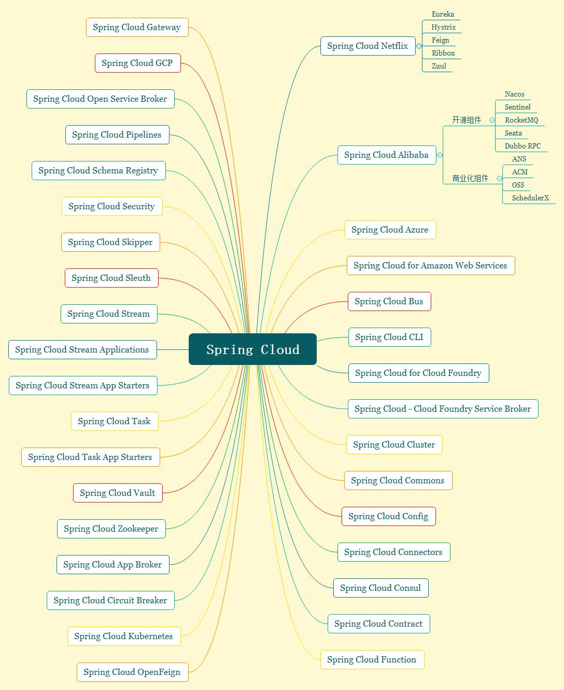
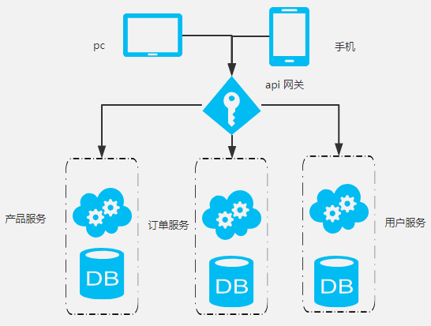
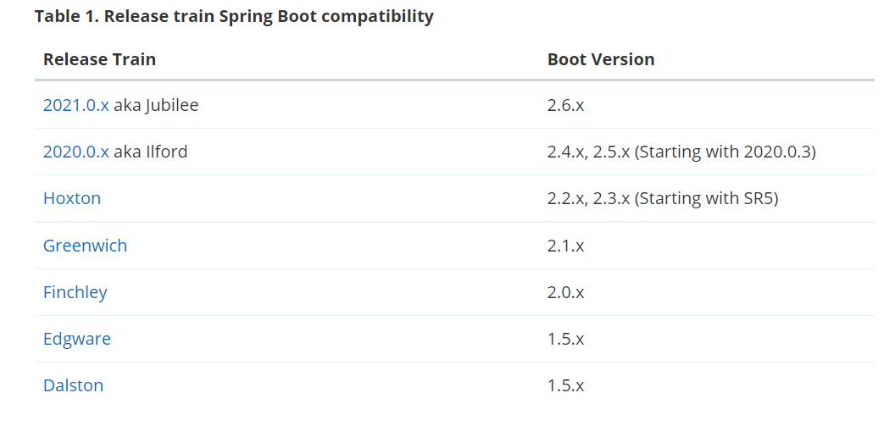
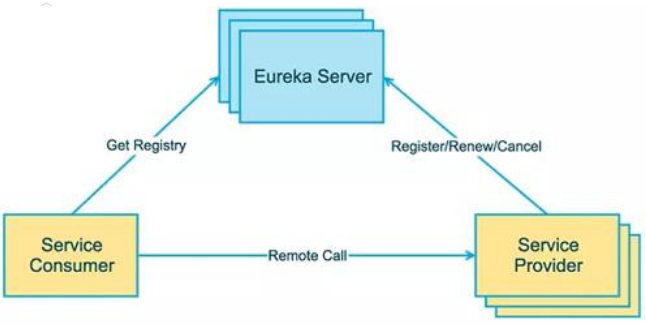
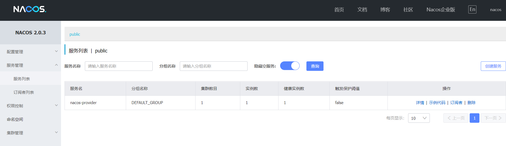
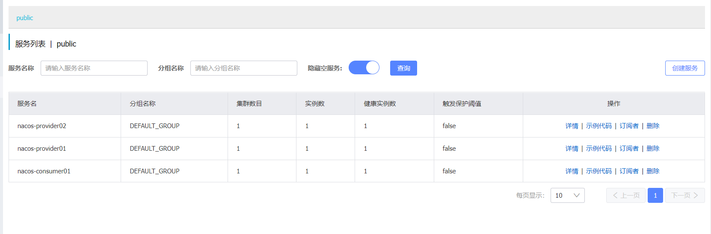
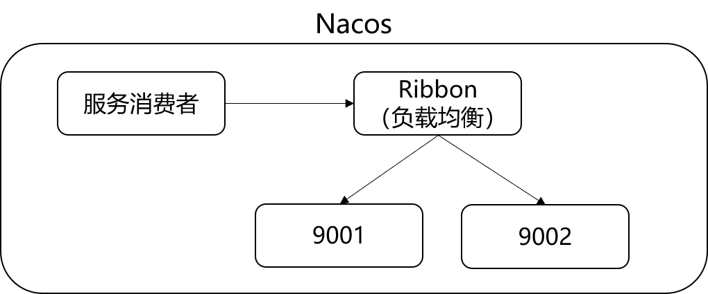

# Spring Cloud

<div align='centor'>
    
</div>


## 概述

在系统结构与设计实践中，从宏观上可以总结为三个阶段：

1. 集中式架构：把所有的功能、模块都几种到一个项目中，部署在一台服务器上，从而对外提供服务（单体架构、单体服务、单体应用）。概括讲就是只有一个项目，一个war/jar。
2. 分布式架构：把所有功能、模块拆分成不同的子项目，部署在多台不同的服务器上，子项目相互协作共同对外提供服务。
3. 微服务架构：与分布式架构一样强调系统的拆分，属于分布式架构的范畴（目前并没有统一标准定义）。

[微服务参考文章](https://martinfowler.com/articles/microservices.html)

简单地说，微服务是系统架构上的一种设计风格， 它的主旨是将一个原本独立 

的系统拆分成多个小型服务，这些小型服务都在各自独立的进程中运行，服务之

间通过基于 HTTP 的 RESTful API (controller调用controller)进行通信协作（dubbo -->dubbo协议 ） 。

被拆分后的每一个小型服务都**专注**于完成系统中的**某一项业务功能**，**职责单一，** 并且每个服务都是一个独立的项目，可以进行独立的测试、开发和部署等。 

由于各个独立的服务之间使用的是基于 HTTP 的 JSON 作为数据通信协作的基础，所以这些微服务也可以使用不同的语言来开发。

<div align='center'>
    
</div>

例如：项目里面有User模块和Order模块，但是User模块和Order模块并没有直接关系，仅仅只是一些数据需要交互，那么就可以把这2个模块单独分开来，当user需要调用order的时候，order是一个服务方，但是order需要调用user的时候，user又是服务方了， 所以，它们并不在乎谁是服务方谁是调用方，他们都是2个独立的服务，这就是微服务的概念。

## [什么是Spring Cloud](https://spring.io/projects/spring-cloud-alibaba)

Spring Cloud为开发人员提供了一些工具用来快速构建分布式系统中的一些常见模式和解决一些常见问题（例如配置管理、服务发现、断路器、智能路由、微代理、控制总线、一次性令牌、全局锁、领导选举、分布式会话、群集状态）。分布式系统的协调导致了很多样板式的代码（很多固定套路的代码），使用Spring Cloud开发人员可以快速建立实现这些模式的服务和应用程序。它们在任何分布式环境中都能很好地运行，包括开发人员自己的笔记本电脑、裸机数据中心和云计算等托管平台。

## Spring Cloud特性

Spring Cloud为分布式系统开发的典型应用场景提供良好的开箱即用的功能，比如：

- 分布式/版本化配置(Distributed/versioned configuration)
- 服务注册和发现(Service registration and discovery)
- 路由(Routing)
- 服务与服务间的调用(Service-to-service calls)
- 负载均衡(Load balancing)
- 断路器(Circuit Breakers)
- 全局锁(Global locks)
- 领导选举与集群状态(Leadership election and cluster state)
- 分布式消息传递(Distributed messaging)

## Spring Cloud主要项目

- [Spring Cloud Azure](https://spring.io/projects/spring-cloud-azure)
- [Spring Cloud Alibaba](https://spring.io/projects/spring-cloud-alibaba)
- [Spring Cloud for Amazon Web Services](https://spring.io/projects/spring-cloud-aws)
- [Spring Cloud Bus](https://spring.io/projects/spring-cloud-bus)
- [Spring Cloud Circuit Breaker](https://spring.io/projects/spring-cloud-circuitbreaker)
- [Spring Cloud CLI](https://spring.io/projects/spring-cloud-cli)
- [Spring Cloud for Cloud Foundry](https://spring.io/projects/spring-cloud-cloudfoundry)
- [Spring Cloud - Cloud Foundry Service Broker](https://spring.io/projects/spring-cloud-cloudfoundry-service-broker)
- [Spring Cloud Cluster](https://spring.io/projects/spring-cloud-cluster)
- [Spring Cloud Commons](https://spring.io/projects/spring-cloud-commons)
- [Spring Cloud Config](https://spring.io/projects/spring-cloud-config)
- [Spring Cloud Connectors](https://spring.io/projects/spring-cloud-connectors)
- [Spring Cloud Consul](https://spring.io/projects/spring-cloud-consul)
- [Spring Cloud Contract](https://spring.io/projects/spring-cloud-contract)
- [Spring Cloud Function](https://spring.io/projects/spring-cloud-function)
- [Spring Cloud Gateway](https://spring.io/projects/spring-cloud-gateway)
- [Spring Cloud GCP](https://spring.io/projects/spring-cloud-gcp)
- [Spring Cloud Kubernetes](https://spring.io/projects/spring-cloud-kubernetes)
- [Spring Cloud Netflix](https://spring.io/projects/spring-cloud-netflix)
- [Spring Cloud Open Service Broker](https://spring.io/projects/spring-cloud-open-service-broker)
- [Spring Cloud OpenFeign](https://spring.io/projects/spring-cloud-openfeign)
- [Spring Cloud Pipelines](https://spring.io/projects/spring-cloud-pipelines)
- [Spring Cloud Schema Registry](https://spring.io/projects/spring-cloud-schema-registry)
- [Spring Cloud Security](https://spring.io/projects/spring-cloud-security)
- [Spring Cloud Skipper](https://cloud.spring.io/spring-cloud-skipper)
- [Spring Cloud Sleuth](https://spring.io/projects/spring-cloud-sleuth)
- [Spring Cloud Stream](https://cloud.spring.io/spring-cloud-stream)
- [Spring Cloud Stream Applications](https://spring.io/projects/spring-cloud-stream-applications)
- [Spring Cloud Task](https://spring.io/projects/spring-cloud-task)
- [Spring Cloud Task App Starters](https://spring.io/projects/spring-cloud-task-app-starters)
- [Spring Cloud Vault](https://spring.io/projects/spring-cloud-vault)
- [Spring Cloud Zookeeper](https://spring.io/projects/spring-cloud-zookeeper)
- [Spring Cloud App Broker](https://spring.io/projects/spring-cloud-app-broker)

## Spring Cloud版本

Spring Cloud是由一系列独立项目组成的，每个独立的项目具有不同的发布节奏，每次Spring Cloud发布版本时，就会组合这一系列的子项目，Spring Cloud为了避免大家对版本号的误解，避免与子项目版本号混淆，所以Spring Cloud发布的版本是一个按照字母顺序的伦敦地铁站的名字（“天使”是第一个版本，“布里克斯顿”是第二个），字母顺序是从A-Z。当Spring Cloud里面的某些子项目出现关键性bug或重大更新，则发布序列将推出名称以“.SRX”结尾的版本，其中“X”是一个数字，比如：Greenwich SR1、Greenwich SR2、Greenwich SR3。

后面好像也开始按照年份开始命名版本了。

Spring Cloud是微服务开发的一整套解决方案，采用Spring Cloud开发，每个项目依然是使用Spring Boot。下图为Spring Cloud与Spring Boot兼容版本。

<div align='center'>
    
</div>

## Spring Cloud整体结构

<div align='center'>
    
</div>

- Service Provider： 暴露服务的服务提供方。 
- Service Consumer：调用远程服务的服务消费方。 
- EureKa Server： 服务注册中心和服务发现中心。 

# [Spring CLoud Aibaba](https://spring.io/projects/spring-cloud-alibaba#overview)

## 概述

### 简介

致力于提供微服务开发的一站式解决方案。此项目包含开发分布式应用微服务的必需组件，方便开发者通过Spring Cloud编程模型轻松使用这些组件来开发分布式应用服务。

依托Spring Cloud Alibaba，只需添加一些注解和少量配置，就可以将Spring Cloud应用接入阿里微服务解决方案，通过阿里中间件迅速搭建分布式应用系统。

### 主要功能

- **服务限流降级：**默认支持WebServlet、WebFlux、OpenFeign、RestTemplate、Spring Cloud Gateway、Zuul、Dubbo和RocketMQ限流降级功能的接入，可以在运行时通过控制台实时修改限流降级规则，还支持查看限流降级Metrics监控。
- **服务注册与发现：**适配Spring Cloud服务注册与发现标准，默认集成了Ribbon的支持。
- **分布式管理配置：**支持分布式系统中的外部化配置，配置更改时自动刷新。
- **消息驱动能力：**基于Spring Cloud Stream为微服务应用构建消息驱动能力。
- **分布式事务：**使用@GlobalTransactional注解，高效并且对业务零侵入地解决分布式事务问题。
- **阿里云对象存储：**阿里云提供的海量、安全、低成本、高可靠的云存储服务。支持在任何应用、任何时间、任何地点存储和访问任意类型的数据。
- **分布式任务调度：**提供秒级、精准、高可靠、高可用的定时（基于Cron表达式）任务调度服务。同时提供分布式的任务执行模型，如网格任务。网格任务支持海量子任务均匀分配到所有Worker（schedulerx-client）上执行。
- **阿里云短信服务：**覆盖全球的短信服务，友好、高效、智能的互联化通讯能力，帮助企业迅速搭建客户触达通道。

### 组件

- **Sentinel：**把流量作为切入点，从流量控制、熔断降级、系统负载保护等多个维度保护服务的稳定性。
- **Nacos：**一个更易于构建云原生应用的动态服务发现、配置管理和服务管理平台。
- **RocketMQ**：开源的分布式消息系统，基于高可用分布式集群技术，提供低延时、高可靠的消息发布与订阅服务。
- **Dubbo**：一款高性能Java RPC框架。
- **Seata：**易用使用的高性能微服务分布式事务解决方案。
- **Alibaba Cloud OSS：**阿里云对象存储服务。
- **Alibaba Cloud SchedulerX：**分布式任务调度，提供秒级、精准、高可靠、高可用的定时（基于Cron表达式）任务调度服务。
- **Alibaba Cloud SMS：**覆盖全球的短信服务。

## Nacos

### 简介

Nacos（Naming Configuration Service）是一个易于使用的动态服务发现、配置和管理服务平台，用于构建云原生应用程序。

**服务发现是微服务架构中的关键组件之一。**Nacos提供了一组简单易用的特性集，帮助快速实现动态服务发现、服务配置、服务元数据及流量管理。

#### 什么是Nacos

1. Nacos = 注册中心 + 配置中心
2. Nacos支持几乎所有主流烈性的“服务”发现、配置和管理，常见服务如下：
   1. Kubernetes Service
   2. gRPC & Dubbo RPC Service
   3. Spring Cloud RESTful Service

为什么使用Nacos

使用微服务会将一个项目分为多个服务，但最终呈现给用户的还是一个整体。提供远程调用服务的成为服务提供者，对应使用远程低啊用服务的称为服务消费者。实际上某个服务可以分布在多台服务器上，服务消费者怎么知道如何调用远程服务，调用哪个远程服务，这时候就需要一个中间管理者/注册中心（Nacos），服务提供者首先会在注册中心注册服务，服务消费者只需在注册中心就可以快速发现并使用服务。

#### 下载与安装

[Nacos官网](https://nacos.io/zh-cn)

[下载地址](https://github.com/alibaba/nacos/releases)

#### 运行

- Linux

  - ```shell
    sh startup.sh -m standalone
    #standlone 表示单机模式运行
    ```

- Windows

  - ```
    startup.cmd -m standalone
    ```

验证是否开启，http://localhost:8848/nacos

默认账号、密码，nacos/nacos

### Nacos服务提供者注册 

Nacos可以直接提供注册中心（Eureka）+配置中心（Config）。

[code](https://github.com/simple-jbx/SpringCloudStudy/tree/main/spring01/spring-cloud-alibaba-nacos-9001)

#### Nacos服务注册中心

服务发现是微服务架构中的关键组件之一。如果手动为每个客户端配置服务列表是一项艰巨的任务，并且也不易动态扩展。Nacos Discovery能够自动将服务注册到Nacos服务器，Nacos服务器会跟踪服务并动态刷新服务列表。此外，Nacos Discovery将服务实例的一些元数据，如主机、端口。健康检查URL、主页等注册到Nacos。

#### 引入Nacos Discovery进行服务注册/发现

<div align='center'>
    
</div>

### Nacos服务消费者注册和负载均衡

[code](https://github.com/simple-jbx/SpringCloudStudy/tree/main/spring01/spring-cloud-alibaba-consumer-8083)

<div align='center'>
    
</div>

#### 远程调用Ribbon

Ribbon是一个基于HTTP和TCP客户端负载均衡器。它虽然只是一个工具类库，但却是每一个微服务的基础设施。实际上，对于服务间调用、API网关请求转发都需要经过Ribbon负载均衡来实现。总的来说，Ribbon的主要作用是：从注册服务器拿到对应服务列表后以负载均衡的方式访问对应服务。

一般情况下，当一个模块需要从另外一个模块获取数据时就需要使用Ribbon的远程访问功能。

Nacos已经整合了Ribbon，所以只需要导入依赖即可使用。

<div align='center'>
    
</div>

#### 具体使用

RestTemplate封装了Ribbon调用过程，其中getForObject是最常用的方法，同时还要在服务消费者中配置RestTemplate：

```javascript
@Bean
@LoadBalanced
public RestTemplate restTemplate() {
    return new RestTemplate();
}

restTemplate.getForObject(arg1, arg2, arg3...);
```

第一个参数（arg1）是一个url表示被调用的目标Rest接口位置

1. url的第一部分是在Nacos中注册的服务提供者名称，如果多个服务提供者注册相同名称，Ribbon会自动寻找其中一个服务提供者，并调用接口方法。这个就是负载均衡功能。
2. url后半部分是控制器的请求路径。

第二个参数是返回值类型

1. JavaBean或者JavaBean数组类型，如果控制器返回的是List组要使用数组类型接收。

第三个参数是可变参数

1. 传递给url的动态参数，使用参数时候需要在url上使用{1}、{2}占位符。

### 验证Nacos自带负载均衡

[code](https://github.com/simple-jbx/SpringCloudStudy/tree/main/springclouod01/spring-cloud-alibaba-consumer-8083)