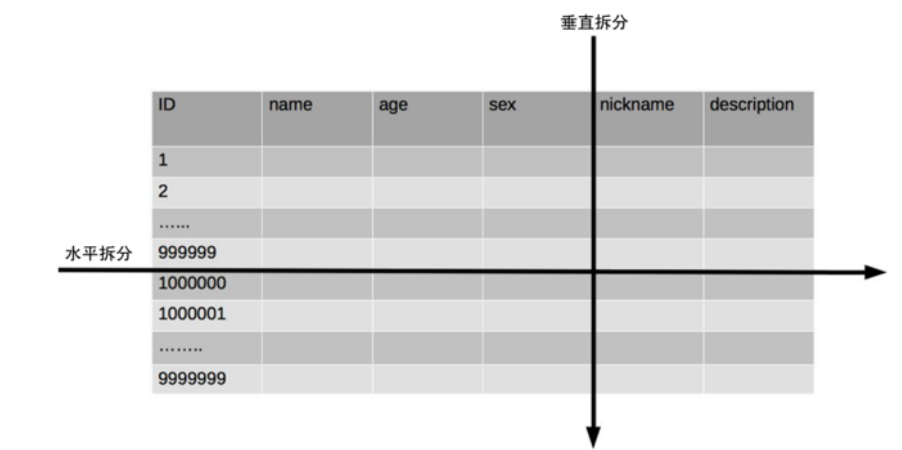
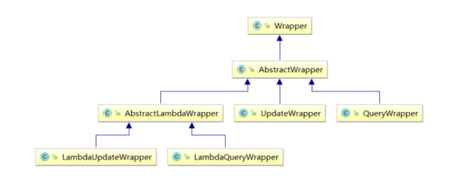

# MyBatis-Plus简介

MyBatis-Plus（简称 MP）是一个MyBatis的增强工具，在MyBatis的基础上只做增强不做改变，为简化开发、提高效率而生。

## 特性

- 无侵入：只做增强不做改变，引入它不会对现有工程产生影响，如丝般顺滑 
- 损耗小：启动即会自动注入基本CURD，性能基本无损耗，直接面向对象操作 
- 强大的CRUD 操作：内置通用 Mapper、通用Service，仅仅通过少量配置即可实现单表大部分CRUD 操作，更有强大的条件构造器，满足各类使用需求
- 支持 Lambda 形式调用：通过 Lambda 表达式，方便的编写各类查询条件，无需再担心字段写错 
- 支持主键自动生成：支持多达4 种主键策略（内含分布式唯一 ID 生成器 - Sequence），可自由 配置，完美解决主键问题 
- 支持 ActiveRecord 模式：支持 ActiveRecord 形式调用，实体类只需继承 Model 类即可进行强大的 CRUD 操作 
- 支持自定义全局通用操作：支持全局通用方法注入（ Write once, use anywhere ） 
- 内置代码生成器：采用代码或者 Maven 插件可快速生成 Mapper 、 Model 、 Service 、 Controller 层代码，支持模板引擎，更有超多自定义配置等您来使用 
- 内置分页插件：基于 MyBatis 物理分页，开发者无需关心具体操作，配置好插件之后，写分页等同于普通 List 查询 
- 分页插件支持多种数据库：支持 MySQL、MariaDB、Oracle、DB2、H2、HSQL、SQLite、 Postgre、SQLServer 等多种数据库 
- 内置性能分析插件：可输出 SQL 语句以及其执行时间，建议开发测试时启用该功能，能快速揪出慢查询 
- 内置全局拦截插件：提供全表 delete 、 update 操作智能分析阻断，也可自定义拦截规则，预防误操作

## 支持数据库

- MySQL，Oracle，DB2，H2，HSQL，SQLite，PostgreSQL，SQLServer，Phoenix，Gauss ， ClickHouse，Sybase，OceanBase，Firebird，Cubrid，Goldilocks，csiidb 
- 达梦数据库，虚谷数据库，人大金仓数据库，南大通用(华库)数据库，南大通用数据库，神通数据库，瀚高数据库

## 框架结构

<div align='center'>
    
</div>


## 代码及文档地址

- 官方地址: http://mp.baomidou.com 
- 代码发布地址: Github: https://github.com/baomidou/mybatis-plus 
- Gitee: https://gitee.com/baomidou/mybatis-plus 
- 文档发布地址: https://baomidou.com/pages/24112f

# 基本CRUD

[代码路径](https://github.com/simple-jbx/Mybatis-Plus-Springboot-Study)

```yml
# 配置MyBatis日志
mybatis-plus:
	configuration:
		log-impl: org.apache.ibatis.logging.stdout.StdOutImpl
```

## 通用Mapper

```java
//基本CURD在内置的BaseMapper中都已经得到了实现，可以直接使用

/*
 * Copyright (c) 2011-2022, baomidou (jobob@qq.com).
 *
 * Licensed under the Apache License, Version 2.0 (the "License");
 * you may not use this file except in compliance with the License.
 * You may obtain a copy of the License at
 *
 *     http://www.apache.org/licenses/LICENSE-2.0
 *
 * Unless required by applicable law or agreed to in writing, software
 * distributed under the License is distributed on an "AS IS" BASIS,
 * WITHOUT WARRANTIES OR CONDITIONS OF ANY KIND, either express or implied.
 * See the License for the specific language governing permissions and
 * limitations under the License.
 */
package com.baomidou.mybatisplus.core.mapper;

import com.baomidou.mybatisplus.core.conditions.Wrapper;
import com.baomidou.mybatisplus.core.metadata.IPage;
import com.baomidou.mybatisplus.core.toolkit.CollectionUtils;
import com.baomidou.mybatisplus.core.toolkit.Constants;
import com.baomidou.mybatisplus.core.toolkit.ExceptionUtils;
import org.apache.ibatis.annotations.Param;

import java.io.Serializable;
import java.util.Collection;
import java.util.List;
import java.util.Map;

/**
 * Mapper 继承该接口后，无需编写 mapper.xml 文件，即可获得CRUD功能
 * <p>这个 Mapper 支持 id 泛型</p>
 *
 * @author hubin
 * @since 2016-01-23
 */
public interface BaseMapper<T> extends Mapper<T> {

    /**
     * 插入一条记录
     *
     * @param entity 实体对象
     */
    int insert(T entity);

    /**
     * 根据 ID 删除
     *
     * @param id 主键ID
     */
    int deleteById(Serializable id);

    /**
     * 根据实体(ID)删除
     *
     * @param entity 实体对象
     * @since 3.4.4
     */
    int deleteById(T entity);

    /**
     * 根据 columnMap 条件，删除记录
     *
     * @param columnMap 表字段 map 对象
     */
    int deleteByMap(@Param(Constants.COLUMN_MAP) Map<String, Object> columnMap);

    /**
     * 根据 entity 条件，删除记录
     *
     * @param queryWrapper 实体对象封装操作类（可以为 null,里面的 entity 用于生成 where 语句）
     */
    int delete(@Param(Constants.WRAPPER) Wrapper<T> queryWrapper);

    /**
     * 删除（根据ID或实体 批量删除）
     *
     * @param idList 主键ID列表或实体列表(不能为 null 以及 empty)
     */
    int deleteBatchIds(@Param(Constants.COLLECTION) Collection<?> idList);

    /**
     * 根据 ID 修改
     *
     * @param entity 实体对象
     */
    int updateById(@Param(Constants.ENTITY) T entity);

    /**
     * 根据 whereEntity 条件，更新记录
     *
     * @param entity        实体对象 (set 条件值,可以为 null)
     * @param updateWrapper 实体对象封装操作类（可以为 null,里面的 entity 用于生成 where 语句）
     */
    int update(@Param(Constants.ENTITY) T entity, @Param(Constants.WRAPPER) Wrapper<T> updateWrapper);

    /**
     * 根据 ID 查询
     *
     * @param id 主键ID
     */
    T selectById(Serializable id);

    /**
     * 查询（根据ID 批量查询）
     *
     * @param idList 主键ID列表(不能为 null 以及 empty)
     */
    List<T> selectBatchIds(@Param(Constants.COLLECTION) Collection<? extends Serializable> idList);

    /**
     * 查询（根据 columnMap 条件）
     *
     * @param columnMap 表字段 map 对象
     */
    List<T> selectByMap(@Param(Constants.COLUMN_MAP) Map<String, Object> columnMap);

    /**
     * 根据 entity 条件，查询一条记录
     * <p>查询一条记录，例如 qw.last("limit 1") 限制取一条记录, 注意：多条数据会报异常</p>
     *
     * @param queryWrapper 实体对象封装操作类（可以为 null）
     */
    default T selectOne(@Param(Constants.WRAPPER) Wrapper<T> queryWrapper) {
        List<T> ts = this.selectList(queryWrapper);
        if (CollectionUtils.isNotEmpty(ts)) {
            if (ts.size() != 1) {
                throw ExceptionUtils.mpe("One record is expected, but the query result is multiple records");
            }
            return ts.get(0);
        }
        return null;
    }

    /**
     * 根据 Wrapper 条件，判断是否存在记录
     *
     * @param queryWrapper 实体对象封装操作类
     * @return
     */
    default boolean exists(Wrapper<T> queryWrapper) {
        Long count = this.selectCount(queryWrapper);
        return null != count && count > 0;
    }

    /**
     * 根据 Wrapper 条件，查询总记录数
     *
     * @param queryWrapper 实体对象封装操作类（可以为 null）
     */
    Long selectCount(@Param(Constants.WRAPPER) Wrapper<T> queryWrapper);

    /**
     * 根据 entity 条件，查询全部记录
     *
     * @param queryWrapper 实体对象封装操作类（可以为 null）
     */
    List<T> selectList(@Param(Constants.WRAPPER) Wrapper<T> queryWrapper);

    /**
     * 根据 Wrapper 条件，查询全部记录
     *
     * @param queryWrapper 实体对象封装操作类（可以为 null）
     */
    List<Map<String, Object>> selectMaps(@Param(Constants.WRAPPER) Wrapper<T> queryWrapper);

    /**
     * 根据 Wrapper 条件，查询全部记录
     * <p>注意： 只返回第一个字段的值</p>
     *
     * @param queryWrapper 实体对象封装操作类（可以为 null）
     */
    List<Object> selectObjs(@Param(Constants.WRAPPER) Wrapper<T> queryWrapper);

    /**
     * 根据 entity 条件，查询全部记录（并翻页）
     *
     * @param page         分页查询条件（可以为 RowBounds.DEFAULT）
     * @param queryWrapper 实体对象封装操作类（可以为 null）
     */
    <P extends IPage<T>> P selectPage(P page, @Param(Constants.WRAPPER) Wrapper<T> queryWrapper);

    /**
     * 根据 Wrapper 条件，查询全部记录（并翻页）
     *
     * @param page         分页查询条件
     * @param queryWrapper 实体对象封装操作类
     */
    <P extends IPage<Map<String, Object>>> P selectMapsPage(P page, @Param(Constants.WRAPPER) Wrapper<T> queryWrapper);
}

```


```java
package tech.snnukf.mybatisplusspringboot;

import org.junit.jupiter.api.Test;
import org.springframework.beans.factory.annotation.Autowired;
import org.springframework.boot.test.context.SpringBootTest;
import tech.snnukf.mybatisplusspringboot.entity.User;
import tech.snnukf.mybatisplusspringboot.mapper.UserMapper;

import java.util.Arrays;
import java.util.HashMap;
import java.util.List;
import java.util.Map;

@SpringBootTest
class MybatisPlusSpringbootApplicationTests {

    @Test
    void contextLoads() {
    }

    @Autowired(required = false)
    private UserMapper userMapper;


    @Test
    public void testSelectList0(){
    //selectList()根据MP内置的条件构造器查询一个list集合，null表示没有条件，即查询所有
        userMapper.selectList(null).forEach(System.out::println);
    }


    @Test
    public void testInsert(){
        User user = new User(null, "张三", 23, "zhangsan@atguigu.com");
        //INSERT INTO user ( id, name, age, email ) VALUES ( ?, ?, ?, ? )
        int result = userMapper.insert(user);
        System.out.println("受影响行数：" + result);
        //1475754982694199298
        System.out.println("id自动获取：" + user.getId());
    }

    @Test
    public void testDeleteById(){
        //通过id删除用户信息
        //DELETE FROM user WHERE id=?
        int result = userMapper.deleteById(1553594264166903810L);
        System.out.println("受影响行数："+result);
    }

    @Test
    public void testDeleteBatchIds(){
        //通过多个id批量删除
        //DELETE FROM user WHERE id IN ( ? , ? , ? )
        List<Long> idList = Arrays.asList(1L, 2L, 3L);
        int result = userMapper.deleteBatchIds(idList);
        System.out.println("受影响行数："+result);
    }

    @Test
    public void testDeleteByMap(){
        //根据map集合中所设置的条件删除记录
        //DELETE FROM user WHERE name = ? AND age = ?
        Map<String, Object> map = new HashMap<>();
        map.put("age", 23);
        map.put("name", "张三");
        int result = userMapper.deleteByMap(map);
        System.out.println("受影响行数："+result);
    }

    @Test
    public void testUpdateById(){
        User user = new User(4L, "admin", 22, null);
        //UPDATE user SET name=?, age=? WHERE id=?
        int result = userMapper.updateById(user);
        System.out.println("受影响行数："+result);
    }

    @Test
    public void testSelectById(){
        //根据id查询用户信息
        //SELECT id,name,age,email FROM user WHERE id=?
        User user = userMapper.selectById(4L);
        System.out.println(user);
    }

    @Test
    public void testSelectBatchIds(){
        //根据多个id查询多个用户信息
        //SELECT id,name,age,email FROM user WHERE id IN ( ? , ? )
        List<Long> idList = Arrays.asList(4L, 5L);
        List<User> list = userMapper.selectBatchIds(idList);
        list.forEach(System.out::println);
    }

    @Test
    public void testSelectByMap(){
        //通过map条件查询用户信息
        //SELECT id,name,age,email FROM user WHERE name = ? AND age = ?
        Map<String, Object> map = new HashMap<>();
        map.put("age", 22);
        map.put("name", "admin");
        List<User> list = userMapper.selectByMap(map);
        list.forEach(System.out::println);
    }
}
```

## 通用Service

对Mapper的扩充

说明:

- 通用 Service CRUD 封装[IService (opens new window)](https://gitee.com/baomidou/mybatis-plus/blob/3.0/mybatis-plus-extension/src/main/java/com/baomidou/mybatisplus/extension/service/IService.java)接口，进一步封装 CRUD 采用 `get 查询单行` `remove 删除` `list 查询集合` `page 分页` 前缀命名方式区分 `Mapper` 层避免混淆，
- 泛型 `T` 为任意实体对象
- 建议如果存在自定义通用 Service 方法的可能，请创建自己的 `IBaseService` 继承 `Mybatis-Plus` 提供的基类
- 对象 `Wrapper` 为 [条件构造器](https://baomidou.com/01.指南/02.核心功能/wrapper.html)

```java
/*
 * Copyright (c) 2011-2022, baomidou (jobob@qq.com).
 *
 * Licensed under the Apache License, Version 2.0 (the "License");
 * you may not use this file except in compliance with the License.
 * You may obtain a copy of the License at
 *
 *     http://www.apache.org/licenses/LICENSE-2.0
 *
 * Unless required by applicable law or agreed to in writing, software
 * distributed under the License is distributed on an "AS IS" BASIS,
 * WITHOUT WARRANTIES OR CONDITIONS OF ANY KIND, either express or implied.
 * See the License for the specific language governing permissions and
 * limitations under the License.
 */
package com.baomidou.mybatisplus.extension.service;

import com.baomidou.mybatisplus.core.conditions.Wrapper;
import com.baomidou.mybatisplus.core.mapper.BaseMapper;
import com.baomidou.mybatisplus.core.metadata.IPage;
import com.baomidou.mybatisplus.core.toolkit.Assert;
import com.baomidou.mybatisplus.core.toolkit.CollectionUtils;
import com.baomidou.mybatisplus.core.toolkit.Wrappers;
import com.baomidou.mybatisplus.extension.conditions.query.ChainQuery;
import com.baomidou.mybatisplus.extension.conditions.query.LambdaQueryChainWrapper;
import com.baomidou.mybatisplus.extension.conditions.query.QueryChainWrapper;
import com.baomidou.mybatisplus.extension.conditions.update.ChainUpdate;
import com.baomidou.mybatisplus.extension.conditions.update.LambdaUpdateChainWrapper;
import com.baomidou.mybatisplus.extension.conditions.update.UpdateChainWrapper;
import com.baomidou.mybatisplus.extension.kotlin.KtQueryChainWrapper;
import com.baomidou.mybatisplus.extension.kotlin.KtUpdateChainWrapper;
import com.baomidou.mybatisplus.extension.toolkit.ChainWrappers;
import com.baomidou.mybatisplus.extension.toolkit.SqlHelper;
import org.springframework.transaction.annotation.Transactional;

import java.io.Serializable;
import java.util.Collection;
import java.util.List;
import java.util.Map;
import java.util.Objects;
import java.util.function.Function;
import java.util.stream.Collectors;

/**
 * 顶级 Service
 *
 * @author hubin
 * @since 2018-06-23
 */
public interface IService<T> {

    /**
     * 默认批次提交数量
     */
    int DEFAULT_BATCH_SIZE = 1000;

    /**
     * 插入一条记录（选择字段，策略插入）
     *
     * @param entity 实体对象
     */
    default boolean save(T entity) {
        return SqlHelper.retBool(getBaseMapper().insert(entity));
    }

    /**
     * 插入（批量）
     *
     * @param entityList 实体对象集合
     */
    @Transactional(rollbackFor = Exception.class)
    default boolean saveBatch(Collection<T> entityList) {
        return saveBatch(entityList, DEFAULT_BATCH_SIZE);
    }

    /**
     * 插入（批量）
     *
     * @param entityList 实体对象集合
     * @param batchSize  插入批次数量
     */
    boolean saveBatch(Collection<T> entityList, int batchSize);

    /**
     * 批量修改插入
     *
     * @param entityList 实体对象集合
     */
    @Transactional(rollbackFor = Exception.class)
    default boolean saveOrUpdateBatch(Collection<T> entityList) {
        return saveOrUpdateBatch(entityList, DEFAULT_BATCH_SIZE);
    }

    /**
     * 批量修改插入
     *
     * @param entityList 实体对象集合
     * @param batchSize  每次的数量
     */
    boolean saveOrUpdateBatch(Collection<T> entityList, int batchSize);

    /**
     * 根据 ID 删除
     *
     * @param id 主键ID
     */
    default boolean removeById(Serializable id) {
        return SqlHelper.retBool(getBaseMapper().deleteById(id));
    }

    /**
     * 根据 ID 删除
     *
     * @param id      主键(类型必须与实体类型字段保持一致)
     * @param useFill 是否启用填充(为true的情况,会将入参转换实体进行delete删除)
     * @return 删除结果
     * @since 3.5.0
     */
    default boolean removeById(Serializable id, boolean useFill) {
        throw new UnsupportedOperationException("不支持的方法!");
    }

    /**
     * 根据实体(ID)删除
     *
     * @param entity 实体
     * @since 3.4.4
     */
    default boolean removeById(T entity) {
        return SqlHelper.retBool(getBaseMapper().deleteById(entity));
    }

    /**
     * 根据 columnMap 条件，删除记录
     *
     * @param columnMap 表字段 map 对象
     */
    default boolean removeByMap(Map<String, Object> columnMap) {
        Assert.notEmpty(columnMap, "error: columnMap must not be empty");
        return SqlHelper.retBool(getBaseMapper().deleteByMap(columnMap));
    }

    /**
     * 根据 entity 条件，删除记录
     *
     * @param queryWrapper 实体包装类 {@link com.baomidou.mybatisplus.core.conditions.query.QueryWrapper}
     */
    default boolean remove(Wrapper<T> queryWrapper) {
        return SqlHelper.retBool(getBaseMapper().delete(queryWrapper));
    }

    /**
     * 删除（根据ID 批量删除）
     *
     * @param list 主键ID或实体列表
     */
    default boolean removeByIds(Collection<?> list) {
        if (CollectionUtils.isEmpty(list)) {
            return false;
        }
        return SqlHelper.retBool(getBaseMapper().deleteBatchIds(list));
    }

    /**
     * 批量删除
     *
     * @param list    主键ID或实体列表
     * @param useFill 是否填充(为true的情况,会将入参转换实体进行delete删除)
     * @return 删除结果
     * @since 3.5.0
     */
    @Transactional(rollbackFor = Exception.class)
    default boolean removeByIds(Collection<?> list, boolean useFill) {
        if (CollectionUtils.isEmpty(list)) {
            return false;
        }
        if (useFill) {
            return removeBatchByIds(list, true);
        }
        return SqlHelper.retBool(getBaseMapper().deleteBatchIds(list));
    }

    /**
     * 批量删除(jdbc批量提交)
     *
     * @param list 主键ID或实体列表(主键ID类型必须与实体类型字段保持一致)
     * @return 删除结果
     * @since 3.5.0
     */
    @Transactional(rollbackFor = Exception.class)
    default boolean removeBatchByIds(Collection<?> list) {
        return removeBatchByIds(list, DEFAULT_BATCH_SIZE);
    }

    /**
     * 批量删除(jdbc批量提交)
     *
     * @param list    主键ID或实体列表(主键ID类型必须与实体类型字段保持一致)
     * @param useFill 是否启用填充(为true的情况,会将入参转换实体进行delete删除)
     * @return 删除结果
     * @since 3.5.0
     */
    @Transactional(rollbackFor = Exception.class)
    default boolean removeBatchByIds(Collection<?> list, boolean useFill) {
        return removeBatchByIds(list, DEFAULT_BATCH_SIZE, useFill);
    }

    /**
     * 批量删除(jdbc批量提交)
     *
     * @param list      主键ID或实体列表
     * @param batchSize 批次大小
     * @return 删除结果
     * @since 3.5.0
     */
    default boolean removeBatchByIds(Collection<?> list, int batchSize) {
        throw new UnsupportedOperationException("不支持的方法!");
    }

    /**
     * 批量删除(jdbc批量提交)
     *
     * @param list      主键ID或实体列表
     * @param batchSize 批次大小
     * @param useFill   是否启用填充(为true的情况,会将入参转换实体进行delete删除)
     * @return 删除结果
     * @since 3.5.0
     */
    default boolean removeBatchByIds(Collection<?> list, int batchSize, boolean useFill) {
        throw new UnsupportedOperationException("不支持的方法!");
    }

    /**
     * 根据 ID 选择修改
     *
     * @param entity 实体对象
     */
    default boolean updateById(T entity) {
        return SqlHelper.retBool(getBaseMapper().updateById(entity));
    }

    /**
     * 根据 UpdateWrapper 条件，更新记录 需要设置sqlset
     *
     * @param updateWrapper 实体对象封装操作类 {@link com.baomidou.mybatisplus.core.conditions.update.UpdateWrapper}
     */
    default boolean update(Wrapper<T> updateWrapper) {
        return update(null, updateWrapper);
    }

    /**
     * 根据 whereEntity 条件，更新记录
     *
     * @param entity        实体对象
     * @param updateWrapper 实体对象封装操作类 {@link com.baomidou.mybatisplus.core.conditions.update.UpdateWrapper}
     */
    default boolean update(T entity, Wrapper<T> updateWrapper) {
        return SqlHelper.retBool(getBaseMapper().update(entity, updateWrapper));
    }

    /**
     * 根据ID 批量更新
     *
     * @param entityList 实体对象集合
     */
    @Transactional(rollbackFor = Exception.class)
    default boolean updateBatchById(Collection<T> entityList) {
        return updateBatchById(entityList, DEFAULT_BATCH_SIZE);
    }

    /**
     * 根据ID 批量更新
     *
     * @param entityList 实体对象集合
     * @param batchSize  更新批次数量
     */
    boolean updateBatchById(Collection<T> entityList, int batchSize);

    /**
     * TableId 注解存在更新记录，否插入一条记录
     *
     * @param entity 实体对象
     */
    boolean saveOrUpdate(T entity);

    /**
     * 根据 ID 查询
     *
     * @param id 主键ID
     */
    default T getById(Serializable id) {
        return getBaseMapper().selectById(id);
    }

    /**
     * 查询（根据ID 批量查询）
     *
     * @param idList 主键ID列表
     */
    default List<T> listByIds(Collection<? extends Serializable> idList) {
        return getBaseMapper().selectBatchIds(idList);
    }

    /**
     * 查询（根据 columnMap 条件）
     *
     * @param columnMap 表字段 map 对象
     */
    default List<T> listByMap(Map<String, Object> columnMap) {
        return getBaseMapper().selectByMap(columnMap);
    }

    /**
     * 根据 Wrapper，查询一条记录 <br/>
     * <p>结果集，如果是多个会抛出异常，随机取一条加上限制条件 wrapper.last("LIMIT 1")</p>
     *
     * @param queryWrapper 实体对象封装操作类 {@link com.baomidou.mybatisplus.core.conditions.query.QueryWrapper}
     */
    default T getOne(Wrapper<T> queryWrapper) {
        return getOne(queryWrapper, true);
    }

    /**
     * 根据 Wrapper，查询一条记录
     *
     * @param queryWrapper 实体对象封装操作类 {@link com.baomidou.mybatisplus.core.conditions.query.QueryWrapper}
     * @param throwEx      有多个 result 是否抛出异常
     */
    T getOne(Wrapper<T> queryWrapper, boolean throwEx);

    /**
     * 根据 Wrapper，查询一条记录
     *
     * @param queryWrapper 实体对象封装操作类 {@link com.baomidou.mybatisplus.core.conditions.query.QueryWrapper}
     */
    Map<String, Object> getMap(Wrapper<T> queryWrapper);

    /**
     * 根据 Wrapper，查询一条记录
     *
     * @param queryWrapper 实体对象封装操作类 {@link com.baomidou.mybatisplus.core.conditions.query.QueryWrapper}
     * @param mapper       转换函数
     */
    <V> V getObj(Wrapper<T> queryWrapper, Function<? super Object, V> mapper);

    /**
     * 查询总记录数
     *
     * @see Wrappers#emptyWrapper()
     */
    default long count() {
        return count(Wrappers.emptyWrapper());
    }

    /**
     * 根据 Wrapper 条件，查询总记录数
     *
     * @param queryWrapper 实体对象封装操作类 {@link com.baomidou.mybatisplus.core.conditions.query.QueryWrapper}
     */
    default long count(Wrapper<T> queryWrapper) {
        return SqlHelper.retCount(getBaseMapper().selectCount(queryWrapper));
    }

    /**
     * 查询列表
     *
     * @param queryWrapper 实体对象封装操作类 {@link com.baomidou.mybatisplus.core.conditions.query.QueryWrapper}
     */
    default List<T> list(Wrapper<T> queryWrapper) {
        return getBaseMapper().selectList(queryWrapper);
    }

    /**
     * 查询所有
     *
     * @see Wrappers#emptyWrapper()
     */
    default List<T> list() {
        return list(Wrappers.emptyWrapper());
    }

    /**
     * 翻页查询
     *
     * @param page         翻页对象
     * @param queryWrapper 实体对象封装操作类 {@link com.baomidou.mybatisplus.core.conditions.query.QueryWrapper}
     */
    default <E extends IPage<T>> E page(E page, Wrapper<T> queryWrapper) {
        return getBaseMapper().selectPage(page, queryWrapper);
    }

    /**
     * 无条件翻页查询
     *
     * @param page 翻页对象
     * @see Wrappers#emptyWrapper()
     */
    default <E extends IPage<T>> E page(E page) {
        return page(page, Wrappers.emptyWrapper());
    }

    /**
     * 查询列表
     *
     * @param queryWrapper 实体对象封装操作类 {@link com.baomidou.mybatisplus.core.conditions.query.QueryWrapper}
     */
    default List<Map<String, Object>> listMaps(Wrapper<T> queryWrapper) {
        return getBaseMapper().selectMaps(queryWrapper);
    }

    /**
     * 查询所有列表
     *
     * @see Wrappers#emptyWrapper()
     */
    default List<Map<String, Object>> listMaps() {
        return listMaps(Wrappers.emptyWrapper());
    }

    /**
     * 查询全部记录
     */
    default List<Object> listObjs() {
        return listObjs(Function.identity());
    }

    /**
     * 查询全部记录
     *
     * @param mapper 转换函数
     */
    default <V> List<V> listObjs(Function<? super Object, V> mapper) {
        return listObjs(Wrappers.emptyWrapper(), mapper);
    }

    /**
     * 根据 Wrapper 条件，查询全部记录
     *
     * @param queryWrapper 实体对象封装操作类 {@link com.baomidou.mybatisplus.core.conditions.query.QueryWrapper}
     */
    default List<Object> listObjs(Wrapper<T> queryWrapper) {
        return listObjs(queryWrapper, Function.identity());
    }

    /**
     * 根据 Wrapper 条件，查询全部记录
     *
     * @param queryWrapper 实体对象封装操作类 {@link com.baomidou.mybatisplus.core.conditions.query.QueryWrapper}
     * @param mapper       转换函数
     */
    default <V> List<V> listObjs(Wrapper<T> queryWrapper, Function<? super Object, V> mapper) {
        return getBaseMapper().selectObjs(queryWrapper).stream().filter(Objects::nonNull).map(mapper).collect(Collectors.toList());
    }

    /**
     * 翻页查询
     *
     * @param page         翻页对象
     * @param queryWrapper 实体对象封装操作类 {@link com.baomidou.mybatisplus.core.conditions.query.QueryWrapper}
     */
    default <E extends IPage<Map<String, Object>>> E pageMaps(E page, Wrapper<T> queryWrapper) {
        return getBaseMapper().selectMapsPage(page, queryWrapper);
    }

    /**
     * 无条件翻页查询
     *
     * @param page 翻页对象
     * @see Wrappers#emptyWrapper()
     */
    default <E extends IPage<Map<String, Object>>> E pageMaps(E page) {
        return pageMaps(page, Wrappers.emptyWrapper());
    }

    /**
     * 获取对应 entity 的 BaseMapper
     *
     * @return BaseMapper
     */
    BaseMapper<T> getBaseMapper();

    /**
     * 获取 entity 的 class
     *
     * @return {@link Class<T>}
     */
    Class<T> getEntityClass();

    /**
     * 以下的方法使用介绍:
     *
     * 一. 名称介绍
     * 1. 方法名带有 query 的为对数据的查询操作, 方法名带有 update 的为对数据的修改操作
     * 2. 方法名带有 lambda 的为内部方法入参 column 支持函数式的
     * 二. 支持介绍
     *
     * 1. 方法名带有 query 的支持以 {@link ChainQuery} 内部的方法名结尾进行数据查询操作
     * 2. 方法名带有 update 的支持以 {@link ChainUpdate} 内部的方法名为结尾进行数据修改操作
     *
     * 三. 使用示例,只用不带 lambda 的方法各展示一个例子,其他类推
     * 1. 根据条件获取一条数据: `query().eq("column", value).one()`
     * 2. 根据条件删除一条数据: `update().eq("column", value).remove()`
     *
     */

    /**
     * 链式查询 普通
     *
     * @return QueryWrapper 的包装类
     */
    default QueryChainWrapper<T> query() {
        return ChainWrappers.queryChain(getBaseMapper());
    }

    /**
     * 链式查询 lambda 式
     * <p>注意：不支持 Kotlin </p>
     *
     * @return LambdaQueryWrapper 的包装类
     */
    default LambdaQueryChainWrapper<T> lambdaQuery() {
        return ChainWrappers.lambdaQueryChain(getBaseMapper());
    }

    /**
     * 链式查询 lambda 式
     * kotlin 使用
     *
     * @return KtQueryWrapper 的包装类
     */
    default KtQueryChainWrapper<T> ktQuery() {
        return ChainWrappers.ktQueryChain(getBaseMapper(), getEntityClass());
    }

    /**
     * 链式查询 lambda 式
     * kotlin 使用
     *
     * @return KtQueryWrapper 的包装类
     */
    default KtUpdateChainWrapper<T> ktUpdate() {
        return ChainWrappers.ktUpdateChain(getBaseMapper(), getEntityClass());
    }

    /**
     * 链式更改 普通
     *
     * @return UpdateWrapper 的包装类
     */
    default UpdateChainWrapper<T> update() {
        return ChainWrappers.updateChain(getBaseMapper());
    }

    /**
     * 链式更改 lambda 式
     * <p>注意：不支持 Kotlin </p>
     *
     * @return LambdaUpdateWrapper 的包装类
     */
    default LambdaUpdateChainWrapper<T> lambdaUpdate() {
        return ChainWrappers.lambdaUpdateChain(getBaseMapper());
    }

    /**
     * <p>
     * 根据updateWrapper尝试更新，否继续执行saveOrUpdate(T)方法
     * 此次修改主要是减少了此项业务代码的代码量（存在性验证之后的saveOrUpdate操作）
     * </p>
     *
     * @param entity 实体对象
     */
    default boolean saveOrUpdate(T entity, Wrapper<T> updateWrapper) {
        return update(entity, updateWrapper) || saveOrUpdate(entity);
    }
}
```


```java
package tech.snnukf.mybatisplusspringboot;

import org.junit.jupiter.api.Test;
import org.springframework.beans.factory.annotation.Autowired;
import org.springframework.boot.test.context.SpringBootTest;
import tech.snnukf.mybatisplusspringboot.entity.User;
import tech.snnukf.mybatisplusspringboot.service.IUserService;

import java.util.ArrayList;
import java.util.List;

/**
 * @className: MybatisPlusServiceTest
 * @description: TODO 类描述
 * @author: simple.jbx
 * @date: 2022/7/31
 **/
@SpringBootTest
public class MybatisPlusServiceTest {

    @Autowired
    private IUserService iUserService;

    @Test
    public void testGetCount() {
        // SELECT COUNT( * ) FROM user
        long count = iUserService.count();
        System.out.println("记录数 ==> " + count);
    }

    /**
     * @param:
     * @description: 批量添加
     * @return:
     * @author: simple.jbx
     * @date: 2022/7/31
     */
    @Test
    public void testInsertMore() {
        List<User> list = new ArrayList<>();

        for (int i = 0; i < 10; i++) {
            User user = new User();
            user.setName("bo" + i);
            user.setAge(20 + i);
            list.add(user);
        }

        //INSERT INTO user ( id, name, age ) VALUES ( ?, ?, ? )
        boolean res = iUserService.saveBatch(list);
        System.out.println(res);
    }
}
```


# 常用注解

## @TableName

### 问题

MyBatis-Plus在确定操作的表时，由BaseMapper的泛型决定，即实体类型决定，且默认操作的表名和实体类型的类名一致，若表名和实体类型类名不一致则会抛出异常。

### 解决

#### 通过@TableName配置

在实体类类型上添加@TableName("t_name")，标识实体类对应的表，即可成功执行SQL语句。

#### 通过全局配置解决问题

实体类所对应的表都有固定的前缀，例如`t_`或`tbl_`，此时，可以使用MyBatis-Plus提供的全局配置，为实体类所对应的表名设置默认的前缀，那么就不需要在每个实体类上通过@TableName标识实体类对应的表。

```yml
mybatis-plus:
	configuration:
		# 配置MyBatis日志
		log-impl: org.apache.ibatis.logging.stdout.StdOutImpl
	global-config:
		db-config:
		# 配置MyBatis-Plus操作表的默认前缀
			table-prefix: t_
```

## @TableId

MyBatis-Plus在实现CRUD时，会默认将id作为主键列，并在插入数据时，默认基于雪花算法的策略生成id。

### 问题

若实体类和表中表示主键的不是id，而是其他字段，例如uid，MyBatis-Plus则不能识别，会抛出异常。

### 解决

#### 通过@TableId解决。

```java
@TableId
private Long uid;
```

#### @TableId的value属性

若实体类中主键对应的属性为id，而表中表示主键的字段为uid，此时若只在属性id上添加注解 @TableId，则抛出异常Unknown column 'id' in 'field list'，即MyBatis-Plus仍然会将id作为表的 主键操作，而表中表示主键的是字段uid。

此时需要通过@TableId注解的value属性，指定表中的主键字段，@TableId("uid")或 @TableId(value="uid")。

#### @TableId的type属性

type属性用来定义主键策略

**常用主键策略**

| 值                       | 描述                                                         |
| ------------------------ | ------------------------------------------------------------ |
| IdType.ASSIGN_ID（默认） | 基于雪花算法的策略生成数据id，与数据库id是否设置自增无关。   |
| IdType.AUTO              | 使用数据库的自增策略，注意，该类型请确保数据库设置了id自增，否则无效。 |

```yml
#配置全局主键策略
mybatis-plus:
	configuration:
		# 配置MyBatis日志
		log-impl: org.apache.ibatis.logging.stdout.StdOutImpl
	global-config:
		db-config:
			# 配置MyBatis-Plus操作表的默认前缀
			table-prefix: t_
			# 配置MyBatis-Plus的主键策略
			id-type: auto
```

#### 雪花算法

在实际的业务中需要选择合适的方案去应对数据规模的增长，以应对逐渐增长的访问压力和数据量。 数据库的扩展方式主要包括：业务分库、主从复制，数据库分表。

**数据库分表**

单表数据拆分有两种方式：垂直分表和水平分表。

<div align='center'>
    
</div>

- 垂直分表
  - 垂直分表适合将表中某些不常用且占了大量空间的列拆分出去。
- 水平分表
  - 水平分表适合表行数特别大的表。水平分表相比垂直分表，会引入更多的复杂性，例如要求全局唯一的数据id该如何处理。
  - 主键自增
    - 复杂点：分段大小的选取。分段太小会导致切分后子表数量过多，增加维护复杂度；分段太大可能会 导致单表依然存在性能问题，一般建议分段大小在 100 万至 2000 万之间，具体需要根据业务选取合适 的分段大小。
    - 优点：可以随着数据的增加平滑地扩充新的表。例如，现在的用户是 100 万，如果增加到 1000 万， 只需要增加新的表就可以了，原有的数据不需要动。
    - 缺点：分布不均匀。假如按照 1000 万来进行分表，有可能某个分段实际存储的数据量只有 1 条，而 另外一个分段实际存储的数据量有 1000 万条。
  - 取模
    - 复杂点：初始表数量的确定。表数量太多维护比较麻烦，表数量太少又可能导致单表性能存在问题。
    - 优点：表分布比较均匀
    - 缺点：扩充新的表很麻烦，所有数据都要重分布
  - 雪花算法
    - 由Twitter公布的分布式主键生成算法，它能够保证不同表的主键的不重复性，以及相同表的 主键的有序性。
    - 核心思想：长度共64bit（一个long型）。首先是一个符号位，1bit标识，由于long基本类型在Java中是带符号的，最高位是符号位，正数是0，负 数是1，所以id一般是正数，最高位是0。41bit时间截(毫秒级)，存储的是时间截的差值（当前时间截 - 开始时间截)，结果约等于69.73年。 10bit作为机器的ID（5个bit是数据中心，5个bit的机器ID，可以部署在1024个节点）。 12bit作为毫秒内的流水号（意味着每个节点在每毫秒可以产生 4096 个 ID）。
    - 优点：整体上按照时间自增排序，并且整个分布式系统内不会产生ID碰撞，并且效率较高。

## @TableField

MyBatis-Plus在执行SQL语句时，要保证实体类中的属性名和 表中的字段名一致。如果实体类中的属性名和字段名不一致则需要使用这个注解。

- 情况1

  - 若实体类中的属性使用的是驼峰命名风格，而表中的字段使用的是下划线命名风格
  - 例如实体类属性userName，表中字段user_name，则会自动转换

- 情况2

  - 若实体类中的属性和表中的字段不满足情况1则需要使用该注解

  - ```java
    @TableField("username")
    private String name;
    ```

## @TableLogic

表明逻辑删除属性字段用于逻辑删除。

```java
@TableLogic
private Integer isDeleted;
```

# 条件构造器和常用接口

## wapper介绍

<div align='center'>
    
</div>

- Wrapper ： 条件构造抽象类，最顶端父类 
  - AbstractWrapper ： 用于查询条件封装，生成 sql 的 where 条件 
    - QueryWrapper ： 查询条件封装 
    - UpdateWrapper ： Update 条件封装 
    - AbstractLambdaWrapper ： 使用Lambda 语法 
      - LambdaQueryWrapper ：用于Lambda语法使用的查询Wrapper 
      - LambdaUpdateWrapper ： Lambda 更新封装Wrapper

## QueryWrapper

###  组装查询条件

```java
    @Test
    public void test01() {

        QueryWrapper<User> queryWrapper = new QueryWrapper<>();
        queryWrapper.like("name", "bo")
                        .between("age", 20, 25)
                                .isNotNull("email");
        List<User> list = userMapper.selectList(queryWrapper);
        list.forEach(System.out::println);
    }
```

### 组装排序条件

```java
@Test
public void test02(){
    //按年龄降序查询用户，如果年龄相同则按id升序排列
    //SELECT id,name,age,email FROM user ORDER BY age DESC,id ASC
    QueryWrapper<User> queryWrapper = new QueryWrapper<>();
    queryWrapper
            .orderByDesc("age")
            .orderByAsc("id");
    List<User> users = userMapper.selectList(queryWrapper);
    users.forEach(System.out::println);
}
```

### 组装删除条件

```java
@Test
public void test03(){
//删除email为空的用户
//DELETE FROM t_user WHERE (email IS NULL)
    QueryWrapper<User> queryWrapper = new QueryWrapper<>();
    queryWrapper.isNull("email");
    //条件构造器也可以构建删除语句的条件
    int result = userMapper.delete(queryWrapper);
    System.out.println("受影响的行数：" + result);
}
```

### 组装修改条件

```java
//设置条件优先级
    @Test
    public void test041() {
        //将（年龄大于20并且用户名中包含有a）或邮箱为null的用户信息修改
        QueryWrapper<User> queryWrapper = new QueryWrapper<>();
        queryWrapper
                .gt("age", 20)
                .like("name", "a")
                .or()
                .isNull("email");

        User user = new User();
        user.setName("小明");
        user.setEmail("test@snnukf.tech");

        //UPDATE user SET name=?, email=? WHERE (age > ? AND name LIKE ? OR email IS NULL)
        int result = userMapper.update(user, queryWrapper);
        System.out.println("受影响的行数 " + result);
    }


    @Test
    public void test042() {
        //将用户名中包含有a并且（年龄大于20或邮箱为null）的用户信息修改
        //Lambada中的条件优先执行
        QueryWrapper<User> queryWrapper = new QueryWrapper<>();
        queryWrapper
                .like("name", "a")
                .and(i -> i.gt("age", 20).or().isNull("email"));

        User user = new User();
        user.setName("小明");
        user.setEmail("test@snnukf.tech");

        //UPDATE user SET name=?, email=? WHERE (name LIKE ? AND (age > ? OR email IS NULL))
        int result = userMapper.update(user, queryWrapper);
        System.out.println("受影响的行数 " + result);
    }
```

### 组装select语句

```java
    @Test
    public void test05() {
        //查询用户信息的username和age字段
        //SELECT name,age FROM t_user
        QueryWrapper<User> queryWrapper = new QueryWrapper<>();
        queryWrapper.select("name", "age");
        //selectMaps()返回Map集合列表，通常配合select()使用，避免User对象中没有被查询到的列值为null
        List<Map<String, Object>> maps = userMapper.selectMaps(queryWrapper);
        maps.forEach(System.out::println);
    }
```


# Reference

[学习视频地址](https://www.bilibili.com/video/BV1VP4y1c7j7)

