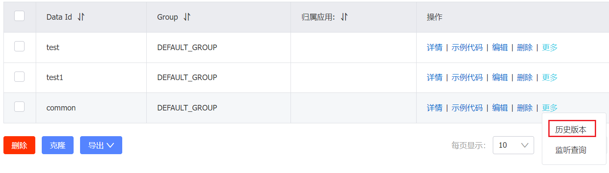
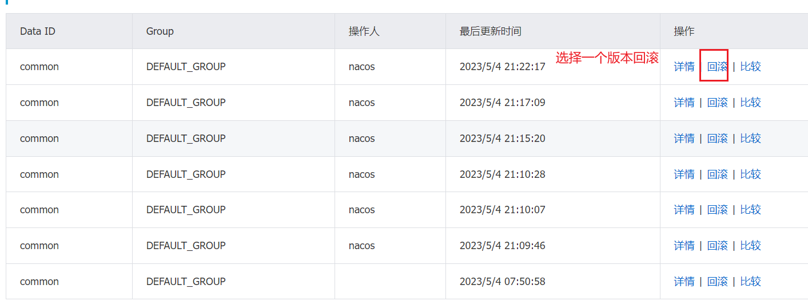
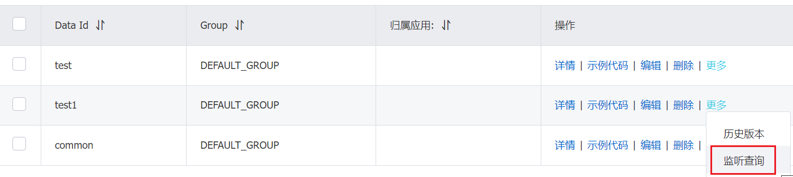
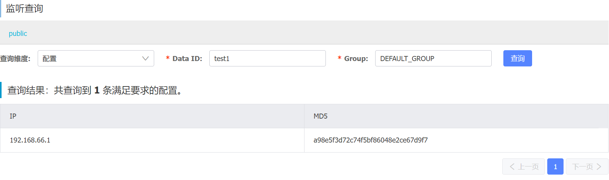

# 概述

一个更易于构建云原生应用的动态服务发现、配置管理和服务管理的平台。

[官网](https://nacos.io/zh-cn/)

[官方文档](https://nacos.io/zh-cn/docs/v2/quickstart/quick-start.html)

# 使用

单机模式启动

```shell
#使用命令参数 或者直接修改cmd中的配置
startup.cmd -m standalone
```

## Java使用Nacos

添加依赖

```xml
        <dependency>
            <groupId>com.alibaba.nacos</groupId>
            <artifactId>nacos-client</artifactId>
            <version>2.1.1</version>
        </dependency>
```

## Spring使用Nacos

添加依赖

```xml
<!-- https://mvnrepository.com/artifact/com.alibaba.nacos/nacos-spring-context -->
<dependency>
    <groupId>com.alibaba.nacos</groupId>
    <artifactId>nacos-spring-context</artifactId>
    <version>1.1.1</version>
</dependency>
```

```java
@Configuration
@ComponentScan("tech.snnukf")
@EnableNacosConfig(globalProperties = @NacosProperties(serverAddr = "127.0.0.1:8848"))
@NacosPropertySource(dataId = "test", autoRefreshed = true)
public class DefaultNacosConfig {

}
```

## Springboot使用Nacos

```java
@SpringBootApplication
@NacosPropertySource(dataId = "test", autoRefreshed = true)
public class NacosSpringbootTest {
    public static void main(String[] args) {
        SpringApplication.run(NacosSpringbootTest.class, args);
    }
}
```

## SpringCloud使用Nacos

```xml
        <!-- https://mvnrepository.com/artifact/org.springframework.cloud/spring-cloud-starter-config -->
        <dependency>
            <groupId>com.alibaba.cloud</groupId>
            <artifactId>spring-cloud-starter-alibaba-nacos-config</artifactId>
            <version>2.2.8.RELEASE</version>
        </dependency>
```

# 配置管理

## 按profile拉取配置

```yaml
spring:
  cloud:
    nacos:
      config:
        server-addr: 127.0.0.1:8848
        file-extension: yaml
        prefix: test1
        group: DEFAULT_GROUP
        namespace: public
```

拉取配置时会分为三步：

1. 拉取dataid为test的配置
2. 拉取dataid为test.yaml的配置
3. 拉取dataid为test-${spring.profiles.active}.yaml的配置

优先级从小到大（3→2→1）。

另外，拉取配置时还会加上namespace这个维度获取配置。

## 拉取多个配置

一个应用可能不止需要一个配置，有时可能需要拉取多个配置，此时可以利用

1. ```yaml
    spring.cloud.nacos.config.extension-configs[0].data-id:datasource.yaml
    ```

2. ```yaml
    spring.cloud.nacos.config.shared-configs[0].data-id:common.yaml
    ```

extension-configs和shared-configs都表示拉取额外的配置文件，区别在于：

1. shared-configs表示多个应用共享的
2. extension-configs表示本应用特有的

注意优先级：

- 主配置 > extension-configs > shared-configs
- extension-configs[2] > extension-configs[1] > extension-configs[0]
- shared-configs[2] > shared-configs[1] > shared-configs[0]

## 配置的自动刷新

主配置的自动刷新默认打开，extension-configs和shared-configs的配置自动刷新默认是关闭的

- ```yaml
    #指定配置文件扩展名
    shared-configs[0].file-extension: yaml
    #打开自动刷新
    shared-configs[0].refresh: true
    ```

需要注意的是，尽管默认情况下会自动刷新，但是对于通过@Value的使用方式，还需要在该Bean上加上@RefreshScope注解，这样才能动态的修改@Value属性，达到动态更新的最终效果。

## 历史版本回滚

可以回滚某个配置到历史版本

<div align='center'>
    
    <br/><br/>
    
</div>

## 监听查询

监听某个配置哪些应用在使用

<div align='center'>
    
    <br/><br/>
    
</div>

# 服务管理

核心：

- 服务注册
- 服务发现

通过nacos的服务注册与发现，可以使得在调用微服务时可以更加简单。

## Java SDK

### 服务注册

可以直接使用nacos提供的java sdk进行服务注册

```java
        NamingService namingService = NamingFactory.createNamingService("127.0.0.1:8848");
        namingService.registerInstance("app1", "88.88.88.88", 8888, "sz");

        NamingService namingService3 = NamingFactory.createNamingService("127.0.0.1:8848");

        Instance instance = new Instance();
        instance.setIp("55.55.55.55");
        instance.setPort(5555);
        instance.setHealthy(false);
        instance.setWeight(6.0);
        Map<String, String> instanceMeta = new HashMap<>();
        instanceMeta.put("site", "eu1");
        instance.setMetadata(instanceMeta);
        namingService3.registerInstance("app1", instance);
```


### 服务发现

```java
public class ServerDiscoveryTest {

    @Test
    public void test01() throws NacosException, IOException {
        NamingService namingService = NamingFactory.createNamingService("127.0.0.1:8848");
        namingService.getAllInstances("app1").forEach(
                System.out::println
        );
        namingService.subscribe("app1", event -> {
            if (event instanceof NamingEvent) {
                System.out.println(((NamingEvent) event).getServiceName());
                System.out.println(((NamingEvent) event).getInstances());
            }
        });

        System.in.read();
    }

    @Test
    public void test02() throws NacosException {
        NamingService namingService = NamingFactory.createNamingService("127.0.0.1:8848");
        namingService.selectInstances("app1", true).forEach(
                System.out::println
        );
    }

    @Test
    public void test03() throws NacosException {
        NamingService namingService = NamingFactory.createNamingService("127.0.0.1:8848");
        System.out.println(namingService.selectOneHealthyInstance("app1", true));
    }
}
```

## SpringCloud

添加依赖

```xml
        <dependency>
            <groupId>com.alibaba.cloud</groupId>
            <artifactId>spring-cloud-starter-alibaba-nacos-discovery</artifactId>
            <version>2.2.8.RELEASE</version>
        </dependency>
```

服务提供者的bootstrap.yaml中配置

```yaml
server:
	port: 8888
spring:
	application:
		name: test
		
	cloud:
		nacos:
			discovery:
				server-addr: 127.0.0.1:8848
```

服务调用者bootstrap.yaml中配置

```yaml
server:
  port: 9999

spring:
  application:
    name: consumer
  cloud:
    nacos:
      server-addr: 127.0.0.1:8848
```

## 高级功能

### 临时实例与持久实例

默认情况下，注册给nacos的实例都是临时实例，临时实例表示会通过客户端与服务端之间的心跳来保活，默认情况下，客户端会每隔**5s**发送一次心跳。

```java
public static final long DEFAULT_HEART_BEAT_INTERVAL = TimeUnit.SECONDS.toMillis(5);
```

在服务端，如果超过**15s**没有收到客户端的心跳，那么就会把实例标记为不健康的状态。

```java
public static final long DEFAULT_HEART_BEAT_TIMEOUT = TimeUnit.SECONDS.toMillis(15);
```

在服务端，如果超过**30s**没有收到客户端的心跳，那么就会删除实例。

```java
public static final long DEFAULT_IP_DELETE_TIMEOUT = TimeUnit.SECONDS.toMillis(30);
```

对于持久实例，即使服务实例下线了，也不会被删除。如果消费段想拿到已经下线的实例信息，则可以把实例注册为持久实例。

```yaml
 spring:	
	cloud:
		nacos:
			discovery:
				ephemeral: true #注册为非临时实例
```


### 保护阈值

可以设置一个(0,1]的比例β，如果服务的所有实例中健康实例比例小于β，则触发保护。即服务消费方会将流量打到所有的实例上（不管服务是否健康），这样就起到了保护作用。因为当健康实例比例小于β的时候，如果不采取措施，则所有的请求流量都会打到健康的实例上，这样就会给健康的实例造成过大压力。采取保护措施后，就有一部分流量可以正常走到健康实例，然后响应，有一部分流量走到不健康的实例上，这部分流量请求失败。

### 权重

设置权重，配合@LoadBanlace注解实现负载均衡。

### 集群

就近访问，消费端配置集群名称，可以实现就近访问。

```yaml
spring:
  cloud:
    nacos:
      discovery:
        cluster-name: "sz"
```

### 集群部署

修改conf/cluster文件，把nacos集群中所有节点的ip和port配置进去：

```
192.168.66.100:8848
192.168.66.101:8848
192.168.66.102:8848
```

