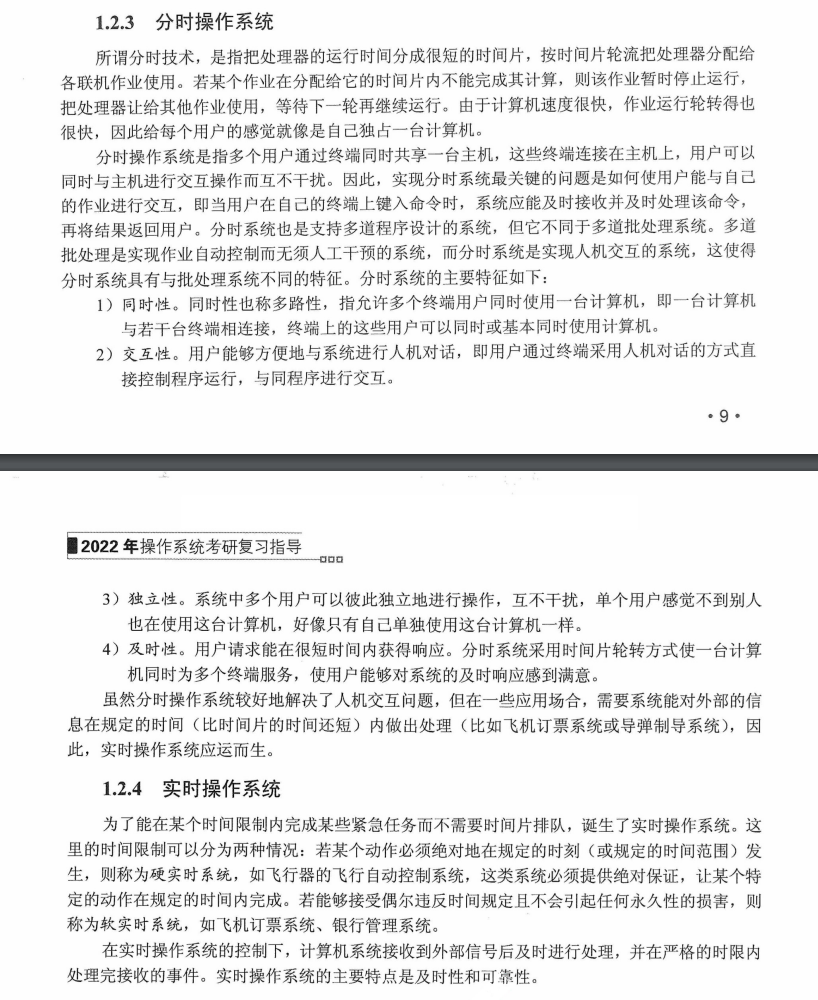
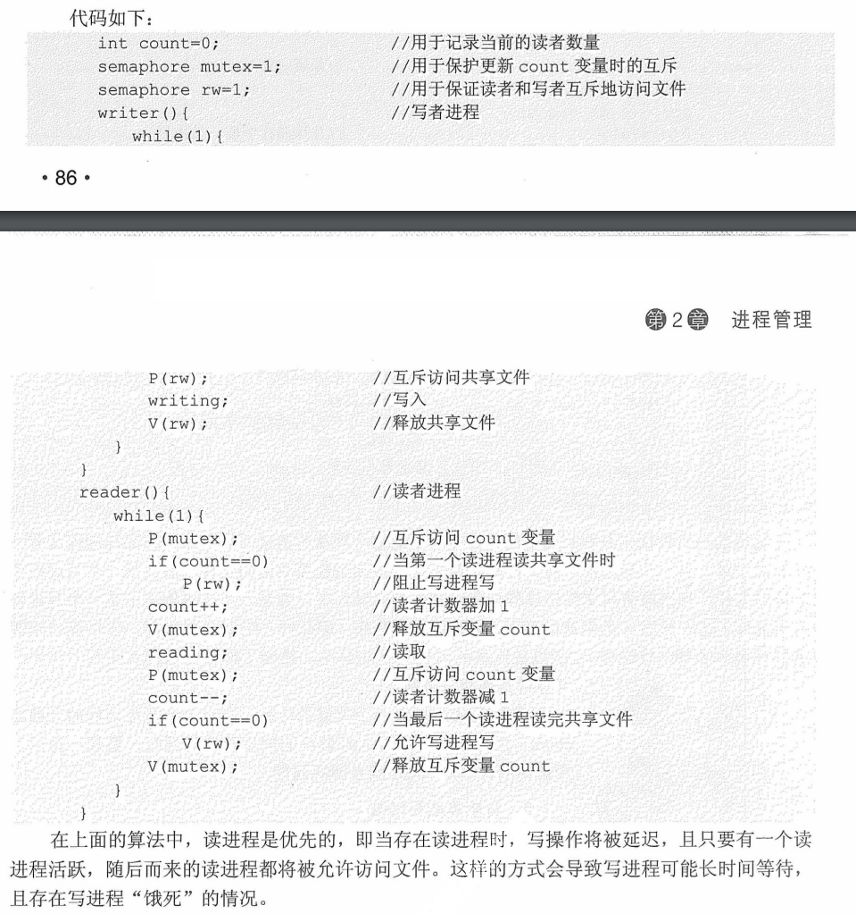
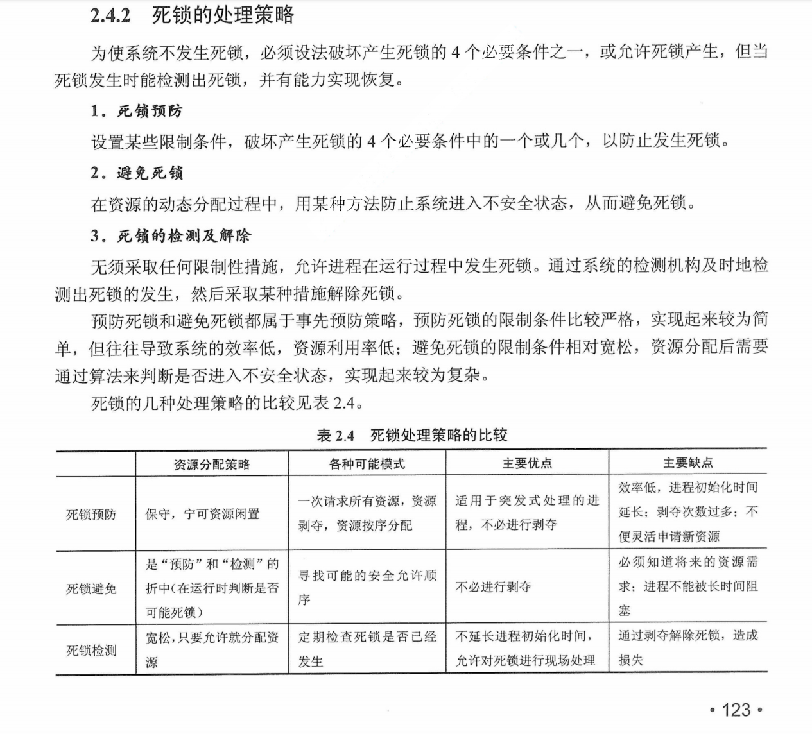
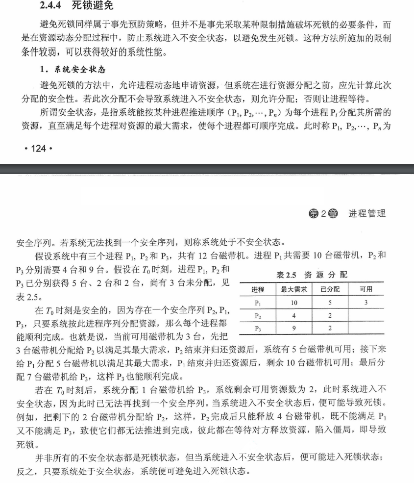
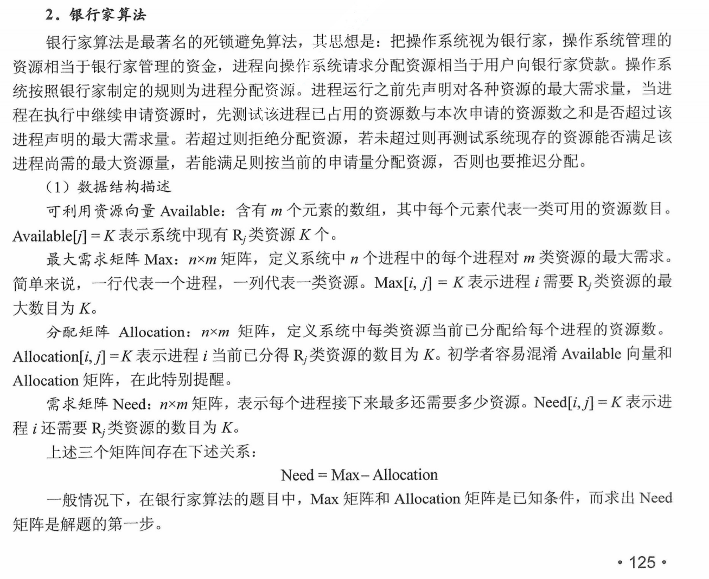
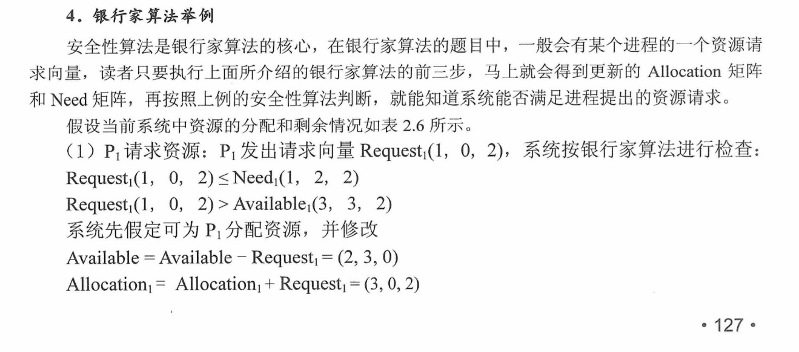
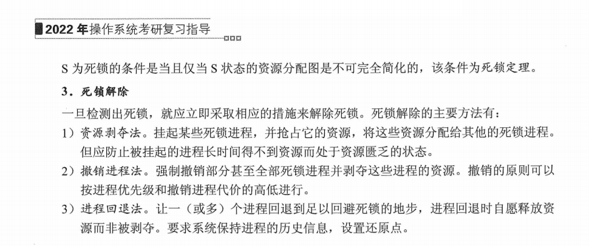
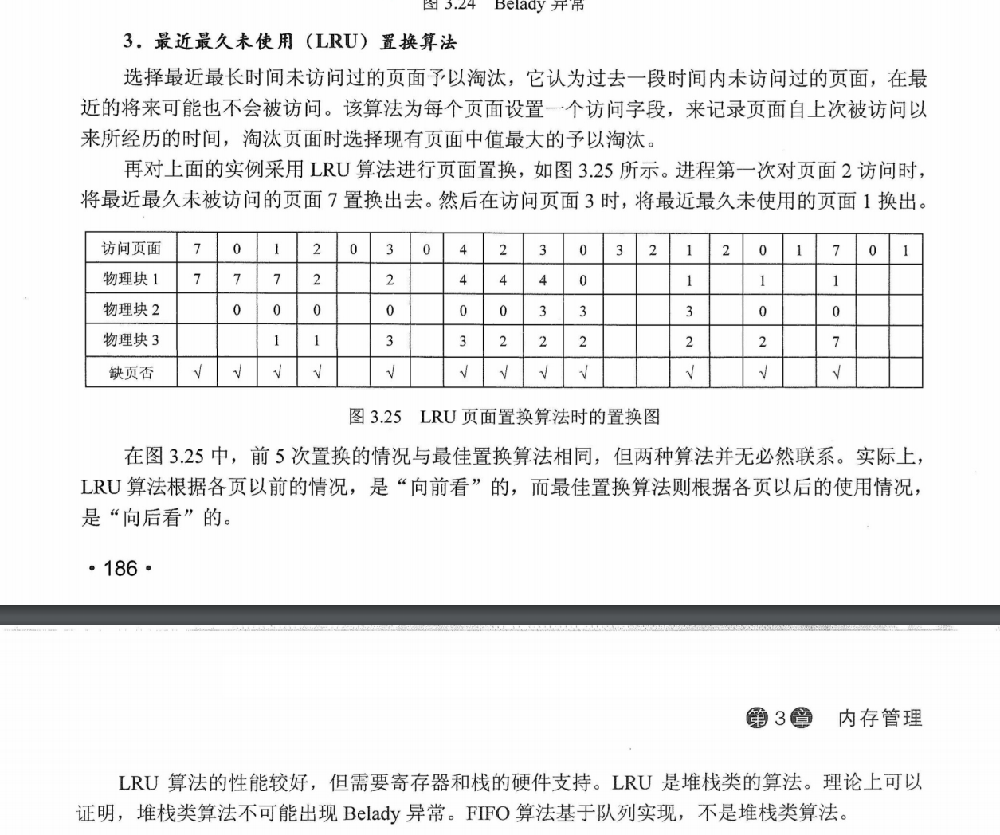
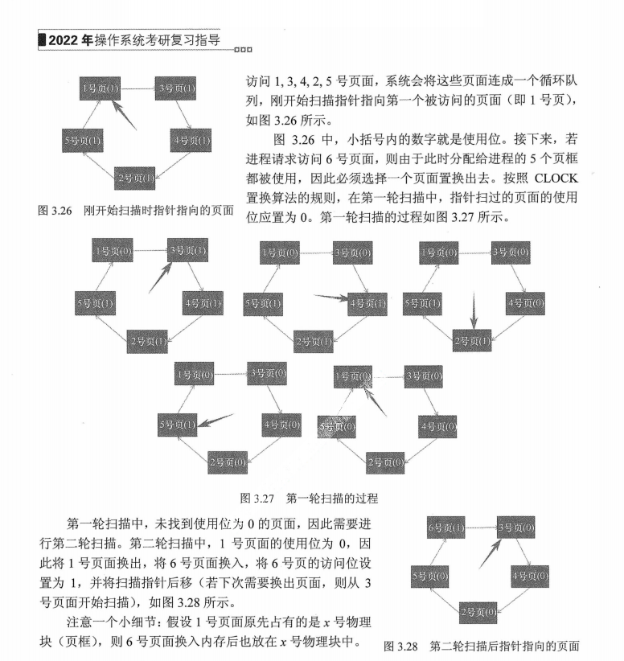

# 操作系统

## 操作系统概述

### 分时与实时操作系统

    
      分时与实时系统

分时操作系统：主流PC机器，服务器

实时操作系统：单片机，电梯控制系统、飞机、导弹、卫星

Linux分时操作系统，可以改成实时，例如UCOS

## 进程

    
      进程状态转移图

## 进程通信

### 管道

### 系统IPC（消息队列、信号量、信号、共享内存）

### Socket

## 调度算法

### 先来先服务（FCFS）

### 短作业优先（SJF）

### 优先级调度算法

###  高响应比优先调度算法

​	响应比 R_p = (等待时间  + 要求服务时间)  /  要求服务时间

### 时间片轮转

### 多级反馈队列

​	时间片片轮转 + 优先级调度

## 进程同步

### 信号量

P（wait(s)）、V(signal(s))操作

### 管程

### 经典同步问题

- 生产者-消费者问题

    

- 读者-写者问题

    
        
	  读进程优先

    
        
      读写公平法

- 哲学家进餐问题

    
        
      哲学家进餐

- 吸烟者问题

    
        
      吸烟者问题

## 死锁

### 死锁的处理策略

    
      死锁的处理策略

    
      死锁的预防

    
    
    
      死锁避免

    
    
    
    
    
      死锁避免

    
    
      死锁检测和解除

## 页面置换算法

### 最佳（OPT）置换算法

### 先进先出（FIFO）页面置换算法

### 最近最久未使用（LRU）置换算法

    
      LRU

### 时钟（Clock）置换算法（NRU ）

    
    
      NRU

### 操作系统IO模型