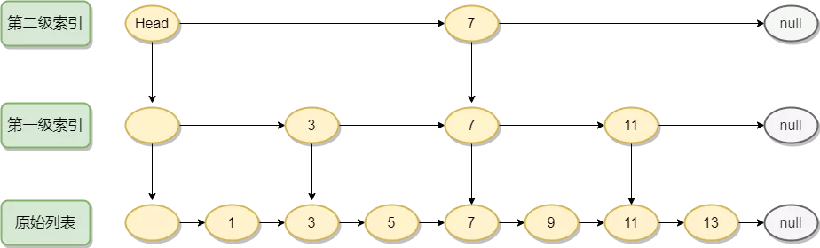
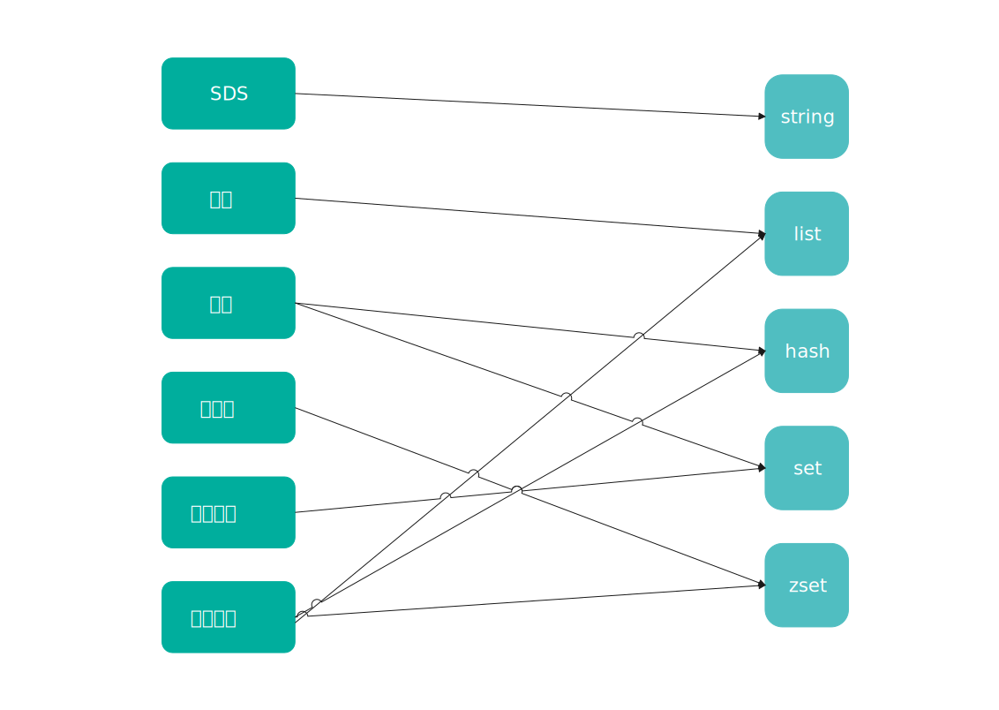
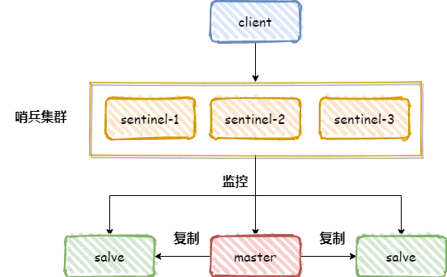
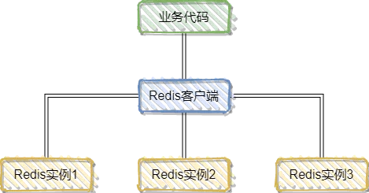
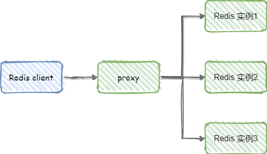
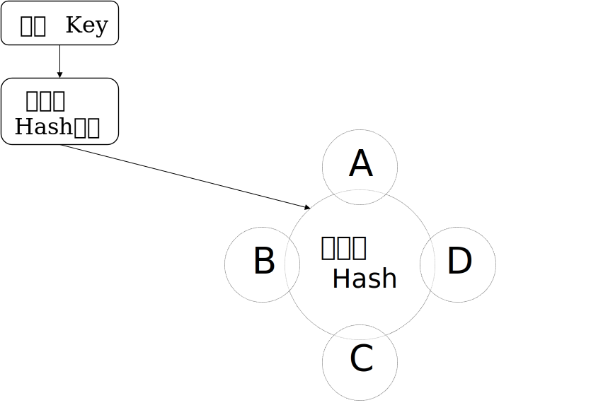
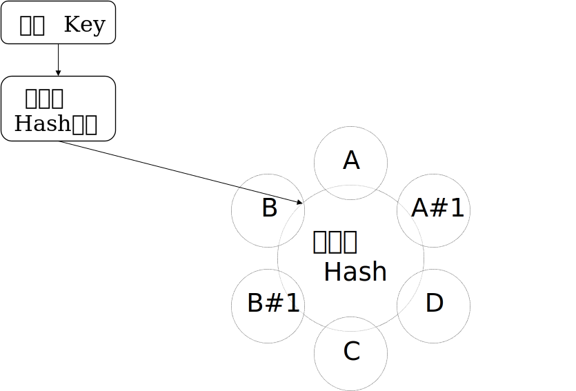

# Redis概述

## 什么是Redis

高性能非关系型key-value数据库，底层使用C编写。数据存储在内存中，读写速度非常快，每秒可达10w+。

## Redis优缺点

### 优点

- 读写性能好，读11w+，写8w+。
- 支持数据持久化。
- 数据结构丰富，支持String、List、Set、Hash等结构。
- 支持事务，支持几个操作合并后原子性执行（lua脚本）。
- 支持主从复制，主机自动将数据同步到从机，进行读写分离。

### 缺点

- 数据存储在内存中，受内存大小限制。
- 不具备自动容错及恢复功能。

## Redis与Memcached的区别和共同点

### 相同点

- 读写性能都较高
- 都是基于内存，且通常被当做缓存
- 都有过期策略
- 都是基于C语言实现的

### 不同点

| 不同点       | Redis                                               | Memcached            |
| ------------ | --------------------------------------------------- | -------------------- |
| 是否支持复制 | 支持主从复制                                        | 不支持复制           |
| key长度      | 长度最大为2GB                                       | 长度最大为250B       |
| 数据类型     | String、Hash、List、Set、ZSet等                     | 仅支持key-value型    |
| 数据持久化   | 支持                                                | 不支持               |
| 网络IO模型   | 单线程多路IO复用（6.0后也支持多线程，网络IO多线程） | 多线程的非阻塞IO模式 |
| 集群         | 支持                                                | 不支持               |

## Redis为什么这么快

- 数据及其操作均在内存中
-  数据结构简单
- 使用多路IO复用技术
- 单线程实现，避免了线程切换（6.0之前）、锁等造成的性能开销

## Redis是单线程还是多线程

Redis6.0之前是单线程，之后是多线程。

单线程IO瓶颈通常在于CPU的IO，而使用Redis几乎不可能达到CPU IO的瓶颈，因此实际使用中的瓶颈在于内存和网络，并且使用单线程可以避免线程切换、锁等造成的性能开销。

Redis6.0之后引入多线程，主要为了解决网络IO读写的瓶颈，执行命令还是单线程的。

Redis默认没有开启多线程，开启需要修改配置文件，io-threads-do-reads yes。

## Redis数据类型

常见：String、Hash、Set、List、Zset

不常见：Bitmap、HyperLogLog、Geospatial

| 数据类型 | 可以存储的值                              | 可进行的操作                                                 | 应用场景                             |
| -------- | ----------------------------------------- | ------------------------------------------------------------ | ------------------------------------ |
| String   | 字符串、整数、浮点数                      | 对整数或浮点数自增、自减                                     | 键值对缓存、常规计数：微博数、粉丝数 |
| List     | 列表（底层使用双向链表实现）              | 向列表两端添加元素，或者获取列表的某个片段                   | 存储文章ID列表、存储评论列表         |
| Set      | 无序集合（底层使用value为空的Hash来实现） | 增加/删除元素、获取集合中元素、取交集等                      | 共同好友、共同关注                   |
| ZSet     | 有序集合（底层使用Hash和跳表）            | 添加/获取/删除元素 根据分值范围或者成员获取元素 计算一个键的排名 | 去重、获取用户排名                   |
| Hash     | 包含key-value的无序散列表                 | 添加/获取/删除单个键值对 获取所有键值对 检查某个键值对是否存在 | 常用于存储对象                       |

**Bitmap**：以bit为单位的数组，数组中只能存储1 or 0，数组下标叫做偏移量。可实现统计功能，更省空间。

布隆过滤器（常用来解决缓存穿透问题）。

**HyperLogLog**：一种用于统计基数的数据集合类型，每个 HyperLogLog 键只需要花费 12 KB 内存，就可以计算接近 2^64 个不同元素的基数。

**优点**是，在输入元素的数量或者体积非常大时，计算基数所需的空间总是固定 的、并且是很小的。

**缺点**是 HyperLogLog 的统计规则是基于概率完成的，所以它给出的统计结果是有一定误差的，标准误算率是 0.81%。

**Geospatial**：主要用于存储地理位置信息，常用于定位附近的人，打车距离的计算等。

## Redis数据结构

简单动态字符串（SDS）、链表、字典、跳跃表、整数集合、压缩列表等。

### 简单动态字符串

C里面的字符串以字符数组实现，不够灵活（以 \0结尾，使用前需要预先分配长度）。

### 链表

链表是列表的底层实现之一。

### 字典

又称符号表（symbol table）、关联数组（associativearray）或映射（map），是一种用于保存键值对（key-value pair）的抽象数据结构。字典在Redis中的应用相当广泛，比如Redis的数据库就是使用字典来作为底层实现的，对数据库的增、删、查、改操作也是构建在对字典的操作之上的。

### 整数集合

整数集合（intset）是集合键的底层实现之一，当一个集合只包含整数值元素，并且这个集合的元素数量不多时，Redis就会使用整数集合作为集合键的底层实现。

### 压缩列表（ziplist）

Redis为了节约内存而开发的，是由一系列特殊编码的连续内存块组成的顺序型（sequential）数据结构。

### 跳跃表（skiplist）

有序数据结构，通过在每个结点中维持多个指向其他结点的指针，从而达到快速访问结点的目的。跳跃表结点查询复杂度平均O(logN)，最坏O(N)复杂度，还可以通过顺序性操作来批量处理节点。跳跃表是有序集合键的底层实现之一。在Redis中只有两个地方用到了跳跃表，一个是实现有序集合的键，另一个是在集群节点中只能怪用作内部数据结构。

跳跃表本质上采用的是一种空间换时间的策略，是一种可以可以进行**二分查找**的**有序链表**，跳表在原有的有序链表上增加了**多级索引**，通过索引来实现快速查询。跳表不仅能提高搜索性能，同时也可以提高插入和删除操作的性能。

**跳表相比于红黑树的优点：**

- 内存占用更少，自定义参数决定占用内存多少
- 查询性能不比红黑树差
- 实现简单，容易维护

    
	  Redis中数据结构与对象关系（左数据结构，右对象）

### 对象

基于上面的基本数据结构创建了一个对象系统。包含字符串对象、列表对象、哈希对象、集合对象和有序集合对象等五种类型的对象。

**对象系统的优点：**

- 通过这五种不同类型的对象，Redis可以在执行命令之前，根据对象的类型来判断一个对象是否可以执行给定的命令。
- 可以针对不同的使用场景，为对象设置多种不同的数据结构实现，从而优化对象在不同场景下的使用效率。
- 实现了基于引用计数技术的内存回收机制，当程序不再使用某个对象的时候，这个对象所占用的内存就会被自动释放。
- Redis还通过引用计数技术实现了对象共享机制，这一机制可以在适当的条件下，通过让多个数据库键共享同一个对象来节约内存。

    
	  Redis中数据结构与对象关系（左数据结构，右对象）

## 应用场景

1. 缓存：Redis基于内存，读写速度非常快，并且有键过期功能和键淘汰策略，可以作为缓存使用。
2. 排行榜：Redis提供的有序集合可以很方便地实现排行榜。
3. 分布式锁：Redis的setnx功能来实现分布式的锁。
4. 社交功能：共同好友、共同关注。
5. 计数器：通过String进行自增自减。
6. 消息队列：Redis提供了发布、订阅、阻塞队列等功能，可以实现一个简单的消息队列。

## Redis是单线程，如何提高CPU利用率

一个服务器上部署多个实例，把它们当做不同的服务器使用。

# Redis过期键删除策略

## 键的过期删除策略

常见的有惰性删除、定期删除、定时删除。

### 惰性删除

只有访问这个键时才会检查它是否过期，如果过期则清除。

优点：节省CPU资源

缺点：如果存在大量过期键，会浪费内存

### 定时删除

为每个设置过期时间的key都创造一个定时器，到了时间删除该键。

优点：可以定时清除过期键

缺点：占用CPU

### 定期删除

隔一段时间对一些键进行检查，删除其中过期的。惰性删除和定时删除的折中策略。

Redis中同时使用了惰性删除和定期删除两种。

## Redis内存淘汰机制

Redis基于内存，容量有限，有效的内存淘汰机制对Redis非常重要。

当Redis中数据超过最大允许内存后，就会触发Redis的内存淘汰策略。在Redis4.0之前有6中淘汰策略（前6个），Redis4.0之后又增加了两个（后两个）。

1. volatile-lru：当Redis内存不足时，会在设置了过期时间的键中使用LRU算法移除哪些最少使用的键。
2. volatile-ttl：从设置了过期时间的键中移除将要过期的。
3. volatile-random：从设置了过期时间的键中随机淘汰一些。
4. allkeys-lru：当内存空间不足时，根据LRU算法移除一些键。
5. allkeys-random：当内存空间不足时，随机移除某些键。
6. noeviction：当内存空间不足时，新的写入会报错。
7. volatile-lfu：从设置过期时间的键中移除一些最不经常使用的键。
8. allkeys-lfu：当内存不足时，从所有键中移除一些最不经常使用的键。

# Redis持久化

Redis基于内存，为了防止一些意外情况导致数据丢失，需要将数据持久化到磁盘上。

## Redis常见持久化机制以及优缺点

Redis提供了两种不同的持久化方式，一种是RDB，一种是AOF。

### RDF

Redis中默认的持久化方式，按照一定的时间间隔将内存中的数据以快照的形式保存到硬盘，恢复时将快照读取到内存中。具体操作过程是fork一个子进程，先将数据集写入临时文件，写入成功后，再替换之前的文件，用二进制压缩存储。

#### 优点

- 适合对大规模数据的恢复比AOF的启动效率高。
- 只有一个文件dump.rdb，方便持久化。
- 性能最大化，只需开始时fork出子进程，后续持久化由子进程完成，极大的避免了服务进程执行IO操作。

#### 缺点

- 数据安全性低，隔一段时间备份，如果Redis突然宕机有可能丢失数据。
- RDB通过fork子进程协助完成数据持久化工作，当数据集过大时候，有可能导致整个服务器停顿一段时间。

### AOF

以日志的形式记录服务器所处理的每一个写、删除操作，不记录读操作，以文本的方式记录，可以打开文件看到详细的操作记录。

#### 优点

- 更高的安全性，提供了3中同步策略，分别是每秒同步、每修改同步和不同步。
- 对日志文件写入采用append方式，写入过程即使出现宕机，也不会破坏日志文件中已经存在的内容。
- AOF包含一个格式清晰、易于理解的日志文件用于记录修改所有的修改操作，可以通过该文件完成数据的重建。

#### 缺点

- 同等数据量的条件下，AOF文件占用空间通常大于RDB文件。恢复大数据集时的速度低于RDB。
- AOF选择同步策略不同，效率也不同，AOF总体运行效率往往会慢与RDB。

# Redis事务

## 什么是Redis事务

Redis的事务是一个单独的隔离操作，将事务中的所有命令序列化、按顺序地执行。事务在执行的过程中，不会被其他客户端发送来的命令请求所打断，所以Redis事务是在一个队列中，一次性、顺序性、排他性地执行一系列命令。

## Redis事务的相关命令

- DISCARD：取消事务，放弃执行事务队列内的所有命令，恢复连接为非(transaction)模式，如果正在使用WATCH命令监视某个（或某些）key，则取消所有监视，等同于执行命令UNWATCH。
- EXEC：执行事务队列内的所有命令。
- MULTI：用于标记一个事务块的开始。
- UNWATCH：用于取消 WATCH命令对所有 key 的监视。如果已经执行过了EXEC或DISCARD命令，则无需再执行UNWATCH命令，因为执行EXEC命令时，开始执行事务，WATCH命令也会生效，而 DISCARD命令在取消事务的同时也会取消所有对 key 的监视，所以不需要再执行UNWATCH命令了。
- WATCH：用于标记要监视的key，以便有条件地执行事务，WATCH命令可以监控一个或多个键，一旦其中有一个键被修改（或删除），之后的事务就不会执行。

## Redis事务执行的三个阶段

1. 开始事务（MULTI）
2. 命令入列
3. 执行事务（EXEC）

## Redis事务的特性

- **Redis事务不保证原子性**，单条的Redis命令是原子性的，但事务不能保证原子性。
- **Redis事务是有隔离性的**，但没有隔离级别，事务中的所有命令都会序列化、按顺序地执行。事务在执行的过程中，不会被其他客户端发送来的命令请求所打断。（顺序性、排他性）
- **Redis事务不支持回滚**，Redis执行过程中的命令执行失败，其他命令仍然可以执行。（一次性）

## Redis事务为什么不支持回滚

在Redis的事务中，命令允许失败，但是Redis会继续执行其它的命令而不是回滚所有命令，是不支持回滚的。

**原因：**

- Redis 命令只在两种情况失败：

  - 语法错误的时候才失败（在命令输入的时候不检查语法）。
  - 要执行的key数据类型不匹配：这种错误实际上是编程错误，这应该在开发阶段被测试出来，而不是生产上。

因为不需要回滚，所以Redis内部实现简单并高效。（在Redis为什么是单线程而不是多线程也用了这个思想，实现简单并且高效）

# Redis的集群(Cluster)

Redis单机版主要有以下几个缺点：

- 不能保证数据的可靠性，服务部署在一台服务器上，一旦服务器宕机服务就不可用。
- 性能瓶颈，内存容量有限，处理能力有限

Redis集群就是为了解决Redis单机版的一些问题，Redis集群主要有以下几种方案

- Redis 主从模式
- Redis 哨兵模式
- Redis 自研
- Redis Clustert

## Redis主从模式

Redis单机版通过RDB或AOF持久化机制将数据持久化到硬盘上，但数据都存储在一台服务器上，并且读写都在同一服务器（读写不分离），如果硬盘出现问题，则会导致数据不可用。Redis主从模式就是为了解决这种问题，Redis提供了**复制**功能，在master数据库中的数据更新后，自动将更新的数据同步到slave数据库上。

    
	  Redis主从模式

主从模式解决了单机版存在的问题，但其本身又会有新的问题。其主要优缺点如下：

**优点**

- 高可靠性：在master节点出故障后，可以切换到slave节点。
- 读写分离：slave节点可以扩展master节点读能力，能够有效应对高并发读操作。

**缺点**

- 不具备自动容错和恢复能力：master节点故障后，需要手动切换，可用性较低

## Redis哨兵模式

哨兵模式主要是为了解决主从模式不具备自动容错和恢复的问题。Redis自2.6版本开始支持哨兵模式。

    
	  Redis哨兵模式

哨兵模式核心还是主从复制，相比主从模式多了竞选机制以及哨兵集群，从所有从节点中竞选出master节点。

**哨兵集群作用：**

- 监控所有服务器是否正常运行：通过发送命令返回监控服务器的运行状态，处理监控主服务器、从服务器外，**哨兵之间也相互监控**。
- 故障切换：当哨兵监测到master宕机，会自动将slave切换成master，然后通过**发布订阅模式**通知其他的从服务器，修改配置文件，让它们切换master。同时旧的master会变成salve，即使恢复也不会恢复原来的身份。

**哨兵模式优缺点**：

- **优点**
  - 解决主从模式故障不能自动切换问题。
- 缺点
  - 浪费资源，所有节点保存全量数据，当数据量过大时，主从同步会影响性能。
  - 当出现故障，竞选机制需要消耗时间，竞选的时候不能写数据，直至选举出新的master节点。
  - 只有一个master节点执行写请求，写操作会受到单机性能影响。

## 企业自研方案

为了解决哨兵模式的缺点，各大企业自行研发了一些Redis集群方案。

### 客户端分片

将分片逻辑放在Redis客户端实现，通过预先定义好的路由规则（哈希算法），把对key的访问转发到不同的Redis实例中，查询数据时把返回结果汇集。

    
	  客户端分片

**优点**

- 节点之间彼此独立，容易线性扩展，系统灵活性强。

**缺点**

- 不支持动态增删节点。
- 维护成本高（包括软件和硬件），软件方面不同项目共用一套集群，例如Java和PHP项目，但是需要写两套代码。

### 代理分片 

使用proxy作为客户端和服务端桥梁，专门用来分片。

    
	  代理分片

**优点**

- Redis集群拓扑变化时会自动调整。

**缺点**

- 每个请求都要经过代理，对于高并发的情况使用Redis的优势会打折扣。

## Redis官方集群

为了应对哨兵模式的问题，Redis 3.0中也提供了解决方案，即Redis Cluster。

该方案中采用服务端分片(Sharding)技术，没有使用一致性hash，而是采用slot(槽)，一共分为16384个槽。将请求发送到任意节点，接收到请求的结点会将查询请求发送到正确的结点上执行。

### 一致性hash

一种特殊的哈希算法，目的是解决分布式缓存问题。将key均匀映射到一组服务器上。当新增或者删除服务器（宕机）可以顺延改变映射关系。但是当组内服务器过少的时候，节点变换会对整个环中数据影响较大，容易出现数据倾斜的情况，即部分节点数据过多，部分节点数据过少。面对这种情况可以引入虚拟节点。每个虚拟节点会映射一个真实节点，最终将数据存放在虚拟节点映射的真实节点上。

    
	  一致性Hash
    
	  引入虚拟节点的一致性Hash

### Redis 哈希槽

#### 虚拟槽

# Reference

1. [Redis面试八股文第一弹](https://mp.weixin.qq.com/s/CkGr-frY3gGnABs3ViTu_w)
2. [Redis面试八股文第二弹](https://mp.weixin.qq.com/s/5tiqSuk9R3mMXP0rlmaVHw)

