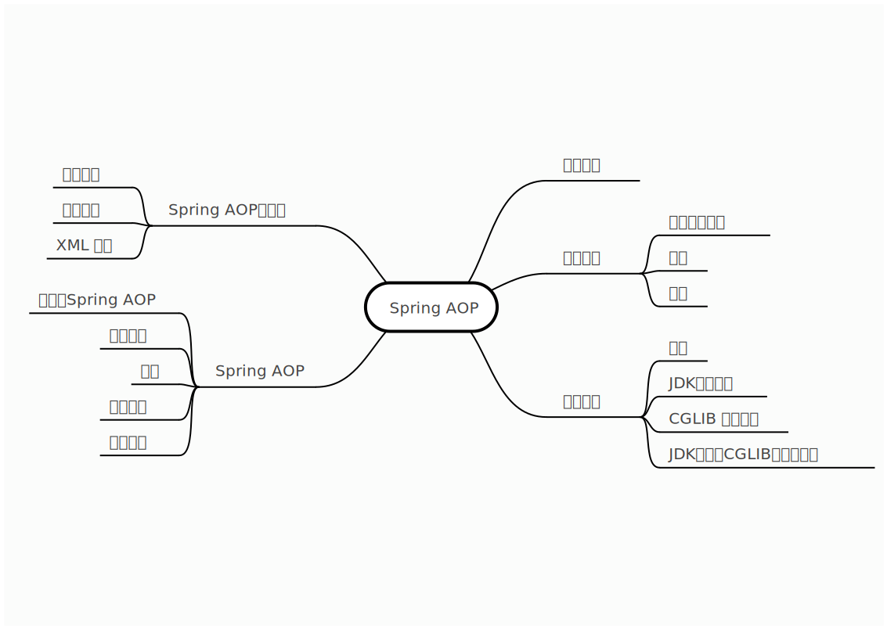
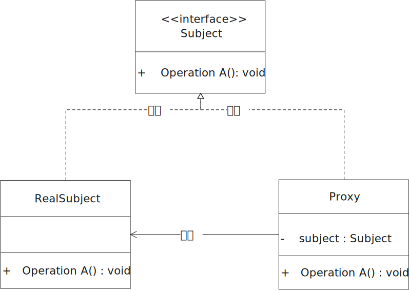

[TOC]


# Spring

[代码地址](https://github.com/simple-jbx/SpringLearning)

## Spring框架

开源JavaEE的应用程序

核心是IOC（控制反转/依赖注入）和AOP（面向切面编程）

Spring IOC 

Spring AOP

Spring JDBC + 事务

## Spring作用

各层对应的框架

- DAO层 JDBC操作 对应框架：Mybatis、Mybatis-plus
- Service层 Spring框架不是针对service层的业务逻辑的 service目前没有适合的框架
- Controller层 Servlet（接受请求 响应数据 地址配置 页面转发） 对应框架：Spring MVC

Spring基于分布式的应用程序

​		轻量级框架、配置管理、Bean对象的实例化（IOC）

集成第三方的框架

​		Mybatis、Hibernate框架（持久层框架）

​		Spring MVC

​		Spring Security权限

​		Quartz时钟框架（定时任务处理）

自带服务

​		mail邮件发送

​		Quartz时钟框架，定时任务处理-定时调度（定时短信、定时任务）

消息处理（异步处理）

## Spring模块划分

Spring IOC模块：Bean对象的实例化 Bean的创建

Spring AOP模块：动态代理 面向切面编程

Spring JDBC+事务模块

Spring web 模块

# Spring IOC

## 主要内容

<div align='center'>
    
    SpringIOC 主要内容
</div>
## Spring IOC容器Bean对象实例化模拟

这部分代码在Spring02目录下

思路：

1. 定义Bean工厂接口，提供获取bean方法
2. 定义Bean工厂接口实现类，解析配置文件，实例化Bean对象
3. 实现获取Bean方法

### 定义 Bean 属性对象

```java
package tech.snnukf.spring;

/**
 * @author simple.jbx
 * @ClassName MyBean
 * @description Bean 属性对象
 * 用来存储配置文件中bean标签对应的id和class属性值
 * @email jb.xue@qq.com
 * @github https://github.com/simple-jbx
 * @date 2021/12/30/ 19:07
 */
public class MyBean {
    private String id;
    private String clazz;

    public MyBean(String id, String clazz) {
        this.id = id;
        this.clazz = clazz;
    }

    public String getId() {
        return id;
    }

    public void setId(String id) {
        this.id = id;
    }

    public String getClazz() {
        return clazz;
    }

    public void setClazz(String clazz) {
        this.clazz = clazz;
    }
}
```

### 添加 dom4j 依赖

```xml
  <dependencies>
    <dependency>
      <groupId>dom4j</groupId>
      <artifactId>dom4j</artifactId>
      <version>1.6.1</version>
    </dependency>

    <dependency>
      <groupId>jaxen</groupId>
      <artifactId>jaxen</artifactId>
      <version>1.1.1</version>
    </dependency>
```

### 准备自定义配置文件

````xml
<?xml version="1.0" encoding="UTF-8"?>
<beans>
    <bean id="userDao" class="tech.snnukf.dao.UserDao"></bean>
    <bean id="userService" class="tech.snnukf.service.UserService"></bean>
</beans>
````

### 定义 Bean 工厂接口

```java
package tech.snnukf.spring;

/**
 * @author simple.jbx
 * @className MyFactory
 * @description 工厂接口
 * @email jb.xue@qq.com
 * @github https://github.com/simple-jbx
 * @date 2021/12/30/ 19:21
 */
public interface MyFactory {
    
    /**
     * @author simple.jbx
     * @description 通过id属性值获取对象
     * @date 19:22 2021/12/30
     * @param	id
     * @return 
     **/
    public Object getBean(String id);
}
```

### 定义 Bean 接口的实现类

```java
package tech.snnukf.spring;

import org.dom4j.Document;
import org.dom4j.Element;
import org.dom4j.XPath;
import org.dom4j.io.SAXReader;

import java.net.URL;
import java.util.ArrayList;
import java.util.HashMap;
import java.util.List;
import java.util.Map;

/**
 * @author simple.jbx
 * @ClassName 模拟Spring实现
 * 1. 通过带参构造器得到对应的配置文件
 * 2. 通过dom4j解析配置文件（xml文件），
 * 得到List集合（存放bean标签的id和class属性值）
 * 3. 通过反射得到对应的实例化对象 遍历List集合获取对应class属性，利用
 * Class.forName(class).newInstance()
 * 4. 通过id属性值获取指定的实例化对象
 * @description //TODO
 * @email jb.xue@qq.com
 * @github https://github.com/simple-jbx
 * @date 2021/12/30/ 19:22
 */
public class MyClassPathXmalApplicationContext implements MyFactory{

    /*存放从配置文件中获取到的bean标签信息（MyBean代表的是每一个bean标签）*/
    private List<MyBean> beanList;
    private Map<String, Object> beanMap = new HashMap<>();

    public MyClassPathXmalApplicationContext(String fileName) {

        /*通过dom4j解析配置文件（xml文件），得到List集合*/
        this.parseXml(fileName);

        /*通过反射得到对应的实例化对象，放置在Map对象*/
        this.instanceBean();
    }

    /**
     * @author simple.jbx
     * @description 通过反射得到对应的实例化队形，防止在Map中
     * 1. 判断对象集合是否为空，如果不为空则遍历集合，获取对象id和class属性
     * 2. 通过类的全路径名 反射得到实例化对象， Class.forName(class).newInstance()
     * 3. 将对应的id和实例化好的bean对象设置到Map对象中
     * @date 20:56 2021/12/30
     * @param
     * @return
     **/
    private void instanceBean() {
        //1.  判断对象集合是否为空，如果不为空，则遍历集合，获取对象的id和class属性
        if(beanList != null && beanList.size() > 0) {
            for (MyBean bean : beanList) {
                String id = bean.getId();
                String clazz = bean.getClazz();
                try {
                    // 2.通过类的全路径名 反射得到实例化对象
                    Object object = Class.forName(clazz).newInstance();
                    // 3.将对应的id和实例化好的bean对象设置到map对象中
                    beanMap.put(id, object);
                } catch (Exception e) {
                    e.printStackTrace();
                }
            }
        }
    }

    /**
     * @author simple.jbx
     * @description 通过dom4j解析配置文件，得到List集合
     * 1. 获取解析器
     * 2. 获取配置文件的URL
     * 3. 通过解析器解析配置文件（xml文件）
     * 4. 通过xpath语法解析，获取beans标签下的所有bean标签
     * 5. 通过指定解析语法解析文档对象，返回元素集合
     * 6. 判断元素集合是否为空
     * 7. 集合不为空，遍历集合
     * 8. 获取bean标签元素的属性（id、class属性）
     * 9. 获取MyBean对象，将id和class属性值设置到对象中，再将对象设置到MyBean的集合中
     * @date 20:41 2021/12/30
     * @param	fileName
     * @return
     **/
    private void parseXml(String fileName) {
        //1.获取解析器
        SAXReader saxReader = new SAXReader();
        //2.获取配置文件的URL
        URL url = this.getClass().getClassLoader().getResource(fileName);
        System.out.println(url);
        try {
            //3. 通过解析器配置文件
            Document document = saxReader.read(url);
            //4. 通过xpath语法解析，获取beans标签下的所有bean标签
            XPath xPath = document.createXPath("beans/bean");
            //5. 通过制定的解析语法解析文档对象，返回元素集合
            List<Element> elementList = xPath.selectNodes(document);
            if(elementList != null && elementList.size() > 0) {
                beanList = new ArrayList<>();

                //7. 如果集合不为空，遍历集合
                for (Element el : elementList) {
                    //8. 获取bean标签元素的属性（id、class）
                    String id = el.attributeValue("id");
                    String clazz = el.attributeValue("class");
                    //获取MyBean对象，将id和class属性值设置到对象中，在将对象设置到MyBean中
                    MyBean myBean = new MyBean(id, clazz);
                    beanList.add(myBean);
                }
            }

        } catch (Exception e) {
            e.printStackTrace();
        }
    }

    /**
     * @author simple.jbx
     * @description 通过id获取对应map中的value（实例化的bean对象）
     * @date 20:40 2021/12/30
     * @param	id
     * @return
     **/
    @Override
    public Object getBean(String id) {
        return beanMap.get(id);
    }
}
```

### 测试自定义 IOC 容器

```java
package tech.snnukf;

import tech.snnukf.dao.UserDao;
import tech.snnukf.service.UserService;
import tech.snnukf.spring.MyClassPathXmalApplicationContext;
import tech.snnukf.spring.MyFactory;

public class App 
{
    public static void main( String[] args )
    {
        //得到工厂实现
        MyFactory myFactory = new MyClassPathXmalApplicationContext("spring.xml");
        //得到对应的实例化对象
        UserDao userDao = (UserDao) myFactory.getBean("userDao");
        userDao.test();

        UserDao userDao02 = (UserDao) myFactory.getBean("userDao");
        userDao02.test();

        System.out.println(userDao == userDao02);

        UserService userService = (UserService) myFactory.getBean("userService");
        userService.test();
    }
}
```

## Spring IOC 核心技术

工厂模式（简单工厂 工厂方法 抽象工厂）

XML解析（Dom4j）

反射技术（实例化对象 反射获取方法 反射获取属性 反射获取构造器 反射调用方法）

策略模式（加载资源）

单例（IOC创建实例化对象）

## Spring IOC配置文件加载

### Spring 配置文件加载

spring.xml

### 根据相对路径加载资源

```java
ApplicationContext ac = new ClassPathXmlApplicationContext("spring.xml");
```

### 根据绝对路径加载资源

```java
ApplicationContext ac = new FileSystemXmlApplicationContext(path)
```

### 多配置文件加载

Spring框架启动时可以加载多个配置文件到项目环境中。

现在有service.xml dao.xml spring.xml等多个配置文件。

#### 可变参数，传入多个文件名

```java
ApplicationContext ac = new ClassPathXmlApplicationContext("spring.xml", "dao.xml", "service.xml");
```

#### 通过总的配置文件引入其他配置文件

```xml
<?xml version="1.0" encoding="UTF-8"?>
<beans xmlns="http://www.springframework.org/schema/beans"
       xmlns:xsi="http://www.w3.org/2001/XMLSchema-instance"
       xsi:schemaLocation="http://www.springframework.org/schema/beans
        https://www.springframework.org/schema/beans/spring-beans.xsd">

    <!--导入需要包含的资源文件-->
    <import resource="service.xml"></import>
    <import resource="dao.xml"></import>
</beans>
```

## Spring IOC 容器 Bean 对象实例化

### 构造器实例化 

通过默认构造器创建 空构造方法必须存在，否则创建失败。

```java
package tech.snnukf;

import org.springframework.beans.factory.BeanFactory;
import org.springframework.context.support.ClassPathXmlApplicationContext;
import tech.snnukf.dao.TypeDao;

/**
 * Hello world!
 *
 */
public class App 
{
    public static void main( String[] args )
    {
        BeanFactory beanFactory = new ClassPathXmlApplicationContext("spring02.xml");
        TypeDao typeDao = (TypeDao) beanFactory.getBean("typeDao");
        typeDao.test();
    }
}

```


### 静态工厂实例化（了解）

注：

- 要有该工厂类及工厂方法
- 工厂方法为静态的

```java
//StaticFactory.java
package tech.snnukf.factory;

import tech.snnukf.service.TypeService;

/**
 * @author simple.jbx
 * @ClassName StaticFactory
 * @description 定义静态工厂
 * @email jb.xue@qq.com
 * @github https://github.com/simple-jbx
 * @date 2022/01/04/ 21:27
 */
public class StaticFactory {
    public static TypeService createTypeService() {
        return new TypeService();
    }
}

```

```java
        //静态工厂实例化
        TypeService typeService = (TypeService) beanFactory.getBean("typeService");
        typeService.test();
```

当我们指定Spring使用静态工厂方法来创建Bean实例时，Spring将先解析配置文件，并根据配置文件指定的信息，通过反射调用静态工厂类的静态工厂方法，并将该静态工厂方法的返回值作为Bean实例，在这个过程中，Spring不再负责创建Bean实例，而是由用户提供的静态工厂方法提供创建。

### 实例化工厂实例化（了解）

注：

- 工厂方法为非静态方法
- 需要配置工厂bean，并在业务bean中配置factory-bean、factory-method属性

1.定义工厂类

```java
package tech.snnukf.factory;

import tech.snnukf.controller.TypeController;
import tech.snnukf.service.UserService;

/**
 * @author simple.jbx
 * @ClassName InstanceFactory
 * @description 定义实例化工厂
 * @email jb.xue@qq.com
 * @github https://github.com/simple-jbx
 * @date 2022/01/04/ 22:32
 */
public class InstanceFactory {
   public TypeController createTypeController() {
       return new TypeController();
   }
}
```


2.设置配置文件

```xml
    <!--
    实例化工厂
        1.定义实例化工厂bean
        2.引用工厂bean 指定工厂创建方法（非静态）
        factory-bean 工厂对象对应的id
        factory-method 工厂类的方法
    -->
    <bean id="instanceFactory" class="tech.snnukf.factory.InstanceFactory"></bean>
    <bean id="typeController" factory-bean="instanceFactory" factory-method="createTypeController"></bean>
```

3.获取实例化对象

```java
        //实例化工厂实例化
        TypeController typeController = (TypeController) beanFactory.getBean("typeController");
        typeController.test();
```

### Spring三种实例化 Bean 方式比较

- 方式一：通过bean的缺省构造函数创建，当各个bean的业务逻辑相互比较独立的时候或者和外界关联较少的时候可以使用
- 方式二：利用静态factory方法创建，可以统一管理各个bean的创建，如各个bean在创建之前需要相同的初始化处理，则可以用这个factory方法进行统一的处理
- 方式三：利用实例化factory方法创建，即将factory方法也做了业务bean来控制，可以你敢于集成其他框架的bean创建管理方法，能够使bean和factory的角色互换。

## Spring IOC 注入

[Code]()

### Spring IOC 手动装配（注入）

#### set方法注入

注：

- 属性字段需要提供set方法
- 四种方式，图见使用set方法注入

```xml
<?xml version="1.0" encoding="UTF-8"?>
<beans xmlns="http://www.springframework.org/schema/beans"
       xmlns:xsi="http://www.w3.org/2001/XMLSchema-instance"
       xsi:schemaLocation="http://www.springframework.org/schema/beans
        https://www.springframework.org/schema/beans/spring-beans.xsd">
    <bean id="userDao" class="tech.snnukf.dao.UserDao"></bean>

    <!--
        Set方法注入
            通过property属性注入
    -->
    <bean id="userService" class="tech.snnukf.service.UserService">
        <property name="userDao" ref="userDao"/>
        <property name="host" value="127.0.0.1"/>
        <property name="list">
            <list>
                <value>上海</value>
                <value>北京</value>
                <value>深圳</value>
            </list>
        </property>
        <property name="set">
            <set>
                <value>杭州</value>
                <value>天津</value>
                <value>西安</value>
            </set>
        </property>

        <property name="map">
            <map>
                <entry>
                    <key><value>周杰伦</value></key>
                    <value>晴天</value>
                </entry>
                <entry>
                    <key>
                        <value>林俊杰</value>
                    </key>
                    <value>江南</value>
                </entry>
            </map>
        </property>

        <property name="properties">
            <props>
                <prop key="bj">Beijing</prop>
                <prop key="sh">ShangHai</prop>
            </props>
        </property>
    </bean>
</beans>
```

```java
package tech.snnukf.service;

import tech.snnukf.dao.UserDao;

import java.util.List;
import java.util.Map;
import java.util.Properties;
import java.util.Set;

/**
 * @author simple.jbx
 * @ClassName UserService
 * @description //TODO
 * @email jb.xue@qq.com
 * @github https://github.com/simple-jbx
 * @date 2022/01/07/ 18:48
 */
public class UserService {

    //手动实例化
    //private UserDao userDao = new UserDao();

    //业务逻辑对象 JavaBean对象 set方法注入
    ///*
    private UserDao userDao;

    public void setUserDao(UserDao userDao) {
        this.userDao = userDao;
    }
    // */

    //常用类型 基本类型
    private String host;
    public void setHost(String host) {
        this.host = host;
    }

    //集合注入
    private List<String> list;
    public void setList(List<String> list) {
        this.list = list;
    }

    //Set 集合
    private Set<String> set;
    public void setSet(Set<String> set) {
        this.set = set;
    }
    
    //Map
    private Map<String, Object> map;

    public void setMap(Map<String, Object> map) {
        this.map = map;
    }

    //properties属性对象
    private Properties properties;

    public void setProperties(Properties properties) {
        this.properties = properties;
    }

    public void printList() {
        list.forEach((v -> System.out.println(v)));
    }

    public void printSet() {
        set.forEach((v -> System.out.println(v)));
    }

    public void printMap() {
        map.forEach(((k, v) -> System.out.println(k + "=" + v)));
    }

    public void printProperties() {
        properties.forEach(((k, v) -> System.out.println(k + "=" + v)));
    }


    public void test() {
        userDao.test();
        System.out.println(host);
        printList();
        printMap();
        printSet();
        printProperties();
        System.out.println("UserService Test...");
    }
}
```

#### 构造器注入

注：

- 提供带参构造器

```java
package tech.snnukf.service;

import tech.snnukf.dao.StudentDao;
import tech.snnukf.dao.UserDao;

import java.util.List;
import java.util.Map;
import java.util.Properties;
import java.util.Set;

/**
 * @author simple.jbx
 * @ClassName UserService
 * @description 构造器注入 需要提供带参构造器
 * @email jb.xue@qq.com
 * @github https://github.com/simple-jbx
 * @date 2022/01/07/ 18:48
 */
public class UserService02 {

    //构造器注入
    private UserDao userDao;
    private StudentDao studentDao;
    private String name;
    UserService02(UserDao userDao, StudentDao studentDao, String name) {
        this.userDao = userDao;
        this.studentDao = studentDao;
        this.name = name;
    }

    public void test() {
        userDao.test();
        studentDao.test();
        System.out.println(name);
        System.out.println("UserService02 test...");
   }
}
```

```xml
    <!--
        构造器注入
        设置构造器所需要的参数
        通过constructor-arg标签设置构造器的参数
        name:属性名称
        ref:要注入的bean对象对应的bean标签的id属性值
        value:数据具体的值
        index:参数的位置（从0开始）
    -->
    <bean id="userService02" class="tech.snnukf.service.UserService02">
        <constructor-arg name="userDao" ref="userDao"></constructor-arg>
        <constructor-arg name="name" value="127.0.0.1" index="2"></constructor-arg>
        <constructor-arg name="studentDao" ref="studentDao" index="1"></constructor-arg>
    </bean>
```

##### 循环依赖问题

构造器注入需要注入A，A依赖B B依赖A，形成循环

对于该类问题需要通过set注入解决

```java
package tech.snnukf.service;

import tech.snnukf.dao.AccountDao;

/**
 * @author simple.jbx
 * @ClassName AccountService
 * @description //TODO
 * @email jb.xue@qq.com
 * @github https://github.com/simple-jbx
 * @date 2022/01/08/ 17:19
 */
public class AccountService {
    private AccountDao accountDao;

    public void setAccountDao(AccountDao accountDao) {
        this.accountDao = accountDao;
    }
//    public AccountService(AccountDao accountDao) {
//        this.accountDao = accountDao;
//    }

    public void test() {
        System.out.println(AccountService.class.getName());
    }
}
```

```java
package tech.snnukf.dao;

import tech.snnukf.service.AccountService;

/**
 * @author simple.jbx
 * @ClassName AccountDao
 * @description 构造器注入出现循环依赖问题
 * @email jb.xue@qq.com
 * @github https://github.com/simple-jbx
 * @date 2022/01/08/ 17:19
 */
public class AccountDao {

    private AccountService accountService;

    public void setAccountService(AccountService accountService) {
        this.accountService = accountService;
    }
    //    public AccountDao(AccountService accountService) {
//        this.accountService = accountService;
//    }

    public void test() {
        System.out.println(AccountDao.class.getName());
    }
}
```

```xml
<!--    循环依赖问题 需要通过set注入解决&ndash;&gt;-->
<!--    <bean id="accountDao" class="tech.snnukf.dao.AccountDao">-->
<!--        <constructor-arg name="accountService" ref="accountService"></constructor-arg>-->
<!--    </bean>-->

<!--    <bean id="accountService" class="tech.snnukf.service.AccountService">-->
<!--        <constructor-arg name="accountDao" ref="accountDao"></constructor-arg>-->
<!--    </bean>-->

    <bean id="accountService" class="tech.snnukf.service.AccountService">
        <property name="accountDao" ref="accountDao"></property>
    </bean>

    <bean id="accountDao" class="tech.snnukf.dao.AccountDao">
        <property name="accountService" ref="accountService"></property>
    </bean>
```

#### 静态工厂注入

与实例化工厂注入一样本质上还是set方法注入。

```xml
    <!--静态工厂注入
        通过静态工厂实例化需要被注入的bean对象
    -->
<bean id="typeDao" class="tech.snnukf.factory.StaticFactory" factory-method="createTypeDao"></bean>

```

```java
package tech.snnukf.factory;

import tech.snnukf.dao.TypeDao;

/**
 * @author simple.jbx
 * @ClassName StaticFactory
 * @description 静态工厂
 * @email jb.xue@qq.com
 * @github https://github.com/simple-jbx
 * @date 2022/01/08/ 18:47
 */
public class StaticFactory {
//    定义静态方法
    public static TypeDao createTypeDao() {
        return new TypeDao();
    }
}
```

#### 实例化工厂注入

```xml
  <!-- 实例化工厂注入
            通过实例化工厂实例化需要被注入的bean对象
    -->
    <bean id="instanceFactory" class="tech.snnukf.factory.InstanceFactory"></bean>
    <bean id="typeDao" factory-bean="instanceFactory" factory-method="createTypeDao"></bean>
```

```java
package tech.snnukf.factory;

import tech.snnukf.dao.TypeDao;

/**
 * @author simple.jbx
 * @ClassName InstanceFactory
 * @description //TODO
 * @email jb.xue@qq.com
 * @github https://github.com/simple-jbx
 * @date 2022/01/08/ 18:54
 */
public class InstanceFactory {
    public TypeDao createTypeDao() {
        return new TypeDao();
    }
}
```

#### 注入方式的选择

set方式注入首选

spring2.5之后，为了简化setter方法属性注入，引入p名称空间，可以将<property>子元素简化为<bean>元素属性配置。

在配置文件中引入p名称空间

 ```xml
<?xml version="1.0" encoding="UTF-8"?>
<!--引入p名称空间 xmlns:p="http://www.springframework.org/schema/p"-->
<beans xmlns="http://www.springframework.org/schema/beans"
       xmlns:p="http://www.springframework.org/schema/p"
       xmlns:xsi="http://www.w3.org/2001/XMLSchema-instance"
       xsi:schemaLocation="http://www.springframework.org/schema/beans
       https://www.springframework.org/schema/beans/spring-beans.xsd">

<!--spring2.5之后，为了简化setter方法属性注入，引入p名称空间，可以将<property>子元素简化为<bean>元素属性配置。-->
        <bean id="userDao" class="tech.snnukf.dao.UserDao"></bean>
        <bean id="userService03" class="tech.snnukf.service.UserService03"
            p:name="127.0.0.1"
            p:userDao-ref="userDao"
        ></bean>
</beans>
 ```


### Spring IOC自动装配（注入）

完整代码见[Spring04](https://github.com/simple-jbx/SpringLearning/tree/main/Spring04)

#### 注解方式注入Bean

注解的配置，可以简化配置文件，提高开发速度，使得程序看上去更简洁。Spring中通过注解实现对应bean对象的注入，通过反射技术实现。

#### 准备环境

- 修改配置文件

```xml
<beans xmlns="http://www.springframework.org/schema/beans"
       xmlns:p="http://www.springframework.org/schema/p"
       xmlns:xsi="http://www.w3.org/2001/XMLSchema-instance"
       xmlns:context="http://www.springframework.org/schema/context"
       xsi:schemaLocation="http://www.springframework.org/schema/beans
       https://www.springframework.org/schema/beans/spring-beans.xsd
       http://www.springframework.org/schema/context
       http://www.springframework.org/schema/context/spring-context/xsd">
</beans>
```

- 开启自动化注入

```xml
<!--开启自动化装配(注入)-->
<context:annotation-config/>
<bean id="userDao" class="tech.snnukf.dao.UserDao"></bean>
<bean id="userService" class="tech.snnukf.service.Uservice"></bean>
```

- 给bean对象添加注解

#### @Resource注解

@Resource注解实现自动注入(反射)

- 默认根据属性字段名称查找对应的bean对象（属性字段的名称与bean标签的id属性值相等）
- 如果属性字段名称未找到，则会通过类型(Class类型)查找
- 属性可以提供set方法，也可以不提供set方法
- 注解可以声明在属性级别或set方法级别
- 可以设置name属性，name属性值必须与bean标签的id属性值一致；如果设置了name属性值，就只会按照name属性值查找bean队形
- 当注入接口时，如果接口只有一个实现则正常实例化；如果接口有多个实现，则需要使用name属性指定需要被实例化的bean对象

[Code](https://github.com/simple-jbx/SpringLearning/tree/main/Spring04/src/main/java/tech/snnukf/service/UserService.java)

```java
package tech.snnukf.service;

import tech.snnukf.dao.IUserDao;
import tech.snnukf.dao.UserDao;

import javax.annotation.Resource;

/**
 * @author simple.jbx
 * @ClassName UserService
 * @description //TODO
 * @email jb.xue@qq.com
 * @github https://github.com/simple-jbx
 * @date 2022/01/23/ 16:39
 */
public class UserService {

    //注入JavaBean对象
    //@Resource(name = "userDao")
    @Resource
    private UserDao userDao;

    //@Resource
    public void setUserDao(UserDao userDao) {
        this.userDao = userDao;
    }

    //注入接口
    @Resource(name = "userDaoImpl02")
    private IUserDao iUserDao;


    public void test() {
        userDao.test();
        iUserDao.test();
        System.out.println(UserService.class.getName());
    }
}

```

#### @Autowired注解

@Autowired注解实现自动化注入

- 默认通过类型(Class类型)查找bean对象，与属性字段的名称无关
- 属性可以提供set方法，也可以不提供set方法
- 注解可以声明在属性级别或set方法级别
- 可以添加@Qualifier结合使用，通过value属性值查找bean对象(value属性值必须设置，且值与bean标签的id属性值对应)

[Code](https://github.com/simple-jbx/SpringLearning/tree/main/Spring04/src/main/java/tech/snnukf/service/AccountService.java)

```java
package tech.snnukf.service;

import org.springframework.beans.factory.annotation.Autowired;
import org.springframework.beans.factory.annotation.Qualifier;
import tech.snnukf.dao.AccountDao;

/**
 * @author simple.jbx
 * @ClassName UserService02
 * @description //TODO
 * @email jb.xue@qq.com
 * @github https://github.com/simple-jbx
 * @date 2022/01/23/ 17:40
 */
public class AccountService {

    @Autowired
    @Qualifier(value = "accountDao") //需要的时候可结合使用
    private AccountDao accountDao;

    public void test() {
        accountDao.test();
        System.out.printf(AccountService.class.getName());
    }
}
```

## Spring IOC 扫描器

实际项目中有非常多的Bean，手动配置显然不能满足生产需要，Spring提供了扫描方式，对扫描到的bean对象统一管理，简化开发配置，提高效率。

### Spring IOC 扫描器配置

Spring IOC扫描器：bean对象统一管理，简化开发配置

1. 设置自动化扫描范围

   - 如果bean对象为在指定包范围，即使声明了注解，也无法实例化

   - ```xml
     <!--设置自动化扫描范围-->
     <context:commonent-scan base-package="xxx.xxx"/>
     ```

2. 使用指定的注解(声明在类级别) bean对象的id属性默认是类名称（首字母小写）

   - Dao层：@Repository
   - Service层：@Service
   - Controller层：@Controller
   - 任意类：@Component


## Bean的作用域和生命周期

### Bean作用域

默认情况下，从Spring容器中拿到的对象均是单例的。

#### Singleton作用域

<div align='center'>
    
    <br/><br/>Singleton作用域
</div>

#### prototype作用域

通过scope="prototype"设置bean的类型，每次向Spring容器请求获取bean都会返回一个全新的bean，相对于Singleton作用域来说就是不会缓存bean，每次都会创建新的bean。

#### Web应用中的作用域

1. request作用域
   - 每个请求创建新的bean。提交表单的数据必须对每次请求创建一个bean来保持这些表单数据，请求结束释放这些数据。
2. session作用域
   - 每个会话容器需要创建新bean。
3. globalSession作用域
   - 类似于session作用域，用于protlet(基于java的web组建)环境的web应用。如果在非portlet环境将视为session作用域。

### Bean生命周期

对比Servlet生命周期（容器启动加载并实例化servlet，调用servlet方法，销毁servlet）。

在Spring中，bean的生命周期包括bean定义、初始化、使用和销毁4个阶段。

#### Bean定义

通过配置文档定义Bean，在一个配置文档中可以定义多个Bean。

#### Bean初始化

默认IOC容器加载时，实例化对象。

1. 在配置文档中通过指定init-method属性来完成

   ```java
   public class RoleService {
       public void init() {
           System.out.println("RoleService init");
       }
   }
   ```

   ```xml
   <bean id="roleService" class="tech.snnukf.service.RoleService" init-method="init"></bean>
   ```

   

2. 实现org.springframework.beans.factory.InitializingBean接口

   ```java
   pulic class RoleService implements InitializindBean {
       @Override
       public void afterPropertiesSet() throws Exception {
           System.out.println("RpleService init...");
       }
   }
   ```

   ```xml
   <bean id="roleService" class="tech.snnukf.service.RoleService"></bean>
   ```

   ​		bean对象实例化过程是在Spring容器初始化时候完成的，可以通过lazy-init="true"属性延迟bean对象的初始化操作，然后在调用getBean方法时才会进行初始化。

#### Bean使用

1. 使用BeanFactory

   ```java
   BeanFactory beanFactory = new ClassPathXmlApplicationContext("spring.xml");
   RoleService roleService = (RoleService)beanFactory.getBean("roleService");
   
   ```

2. 使用ApplicationContext

   ```java
   ApplicationContext ac = new ClassPathXmlApplicationContext("spring.xml");
   UserService userService = (UserService) ac.getBean("userService");
   ```

#### Bean销毁

Spring容器会维护bean对象的管理，可以指定bean对象的销毁所要执行的方法。

1. 指定bean对象销毁所需执行的方法

   ```xml
   <bean id="roleService" class="tech.snnukf.Service.RoleService" destroy-method="destroy"></bean>
   ```

2. 通过AbstractApplicationContext对象，调用其close方法实现bean销毁过程(这个应该会关闭所有)

   ```java
   AbstractApplicationContext ac = new ClassPathXmlApplicationContext("spring.xml");
   ac.close();
   ```

# Spring AOP

## 主要内容

<div align='center'>
    
    <br/><br/>Spring AOP主要内容
</div>

## 代理模式

 为某一对象（委托类）提供一个代理（代理类），用来控制对这个对象的访问。

委托类和代理类有一个共同的父类或父接口。

代理类会对请求做预处理、过滤，将请求分配给指定对象。

生活中常见的代理模式：

​	房东委托中介租房子，新人委托婚庆公司。

代理模式的两个设计原则：

1. 代理类与委托类具有相似的行为
2. 代理类增强委托类的行为

常见代理模式：

1. 静态代理
2. 动态代理

<div align='center'>
    
</div>

## 静态代理

某个对象提供一个代理，代理角色固定，以控制对这个对象的访问。代理类和委托类有共同的父类或父接口，这样在任何使用委托类的地方都可以用代理对象代替。代理类负责请求的预处理、过滤、将请求分派给委托类处理、以及委托类执行完请求后的后续处理。

### 代理的三要素

1. 有共同的行为（结婚）--接口
2. 目标角色（新人）--实现行为
3. 代理角色（婚庆公司）--实现行为 增强目标对象行为

### 静态代理的特点

1. 目标角色固定
2. 在应用程序执行前就得到目标角色
3. 代理对象会增强目标对象行为
4. 有可能存在多个代理，产生“类爆炸”（缺点）

## 动态代理

相对于静态代理，动态代理在创建代理对象上更加灵活，动态代理类的字节码在程序运行时，由Java反射机制动态产生。它会根据需要，通过反射机制在程序运行期，动态的为目标对象创建代理对象，无需程序员手动编写它的源代码。动态代理不仅简化了编程工作，还提高了软件系统的可扩展性，因为反射机制可以生成任意类型的动态代理类。代理的行为可以代理多个方法，**即满足生产需要的同时又达到代码通用的目的。**

动态代理的两种实现方式：

1. JDK动态代理
2. CGLIB动态代理

### 动态代理的特点

1. 目标对象不固定
2. 在应用程序执行时动态创建目标对象
3. 代理对象会增强目标对象的行为

### JDK动态代理

**注：JDK动态大力的目标对象必须有接口实现。**

[Proxy类(Java8)](https://github.com/simple-jbx/SourceCode/blob/main/JAVA/JDK8Src/java/lang/reflect/Proxy.java)

Proxy类是专门完成代理的操作类，可以通过此类为一个或多个接口动态地生成实现类，此类提供了如下操作方法：

#### newProxyInstance

```java
public static Object newProxyInstance(ClassLoader loader,
                                          Class<?>[] interfaces,
                                          InvocationHandler h)
```

**IDEA中JDK动态代理文件的生成**

JDK动态代理文件的生成有两个条件：

1. 必须在main方法中执行，直接调用junit的test方法调用无法生成

2. 在main方法最前面增加配置，这样会输出代理class文件

   - ```java
           System.getProperties().put("sun.misc.ProxyGenerator.saveGeneratedFiles", "true");
     ```

**IDEA中JDK动态代理文件的查看**

1. 会在项目com.sum.proxy中

### CGLIB动态代理

JDK的动态代理机制只能代理实现了接口的类，而不能代理没有或不能实现接口的类，CGLIB是针对类来实现代理的，它的原理是对指定的目标类生成一个子类，并覆盖其中的方法实现增强，但这种方式采用继承实现代理，因此不能对final修饰的类进行代理。

#### 添加依赖

```xml
<dependency>
    <groupId>cglib</groupId>
    <artifactId>cglib</artifactId>
    <version>2.2.2</version>
</dependency>
```

#### 实现

```java
package tech.snnukf.proxy;

import net.sf.cglib.proxy.Enhancer;
import net.sf.cglib.proxy.MethodInterceptor;
import net.sf.cglib.proxy.MethodProxy;

import java.lang.reflect.Method;

/**
 * @author simple.jbx
 * @ClassName CglibInterceptor
 * @description //TODO
 * @email jb.xue@qq.com
 * @github https://github.com/simple-jbx
 * @date 2022/02/19/ 14:23
 */
public class CglibInterceptor implements MethodInterceptor {

    //目标对象
    private Object target;

    public CglibInterceptor(Object target) {
        this.target = target;
    }

    /**
     * @author simple.jbx
     * @description 获取代理对象
     * @date 14:24 2022/2/19
     * @param
     * @return
     **/
    public Object getProxy() {
        //通过Enhancer对象中的create()方法生成一个类，用于生成代理对象
        Enhancer enhancer = new Enhancer();
        enhancer.setSuperclass(target.getClass());

        //设置拦截器  回调对象为自己
        enhancer.setCallback(this);

        //生成代理类对象，并返回给调用者
        return enhancer.create();
    }

    /**
     * @author simple.jbx
     * @description 拦截器
     * 1. 目标对象的方法调用
     * 2. 行为增强
     * @date 14:29 2022/2/19
     * @param	o CGLIB动态生成的代理类实例
     * @param	method 实体类中所调用的被代理的方法的引用
     * @param	objects 参数列表
     * @param	methodProxy 生成的代理类对方法的代理引用
     * @return
     **/
    @Override
    public Object intercept(Object o, Method method, Object[] objects, MethodProxy methodProxy) throws Throwable {

        //增强行为
        System.out.println("====after====");

        //调用目标类中的方法
        Object object = methodProxy.invoke(target, objects);

        //增强行为
        System.out.println("====before====");

        return object;
    }
}
```

#### 测试

```java
package tech.snnukf.proxy;

/**
 * @author simple.jbx
 * @ClassName CglibProxyTest
 * @description //TODO
 * @email jb.xue@qq.com
 * @github https://github.com/simple-jbx
 * @date 2022/02/19/ 14:34
 */
public class CglibProxyTest {
    public static void main(String[] args) {
        //目标对象
        You you = new You();

        //拦截器
        CglibInterceptor cglibInterceptor = new CglibInterceptor(you);

        //代理对象
        Marry marry = (Marry) cglibInterceptor.getProxy();

        marry.toMarry();

        //没有接口实现的类
        User user = new User();
        CglibInterceptor cglibInterceptor2 = new CglibInterceptor(user);
        User newUser = (User) cglibInterceptor2.getProxy();
        newUser.test();
    }
}

```

### JDK代理与CGLIB代理的区别

- JDK通过实现接口，CGLIB通过继承实现代理
- JDK动态代理（目标对象存在接口时）执行效率高于CGLIB
- 如果目标对象有接口实现，选择JDK代理，没有则选CGLIB代理

## Spring AOP 

### 什么是AOP

Aspect Oriented Programing面向切面编程，相比较OOP(面向对象)来说，AOP关注的不再是程序代码中的某个类、某些方法，更多的是面到面的切入（切面）。

### AOP能做什么

主要应用于日志记录、性能统计、安全控制、事务处理等方面，实现公共功能的重复使用。

### AOP特点

1. 降低模块与模块之间的耦合度，提高业务代码的聚合度（高内聚，低耦合）。
2. 提高了代码的复用性。
3. 提高了系统的扩展性（高版本兼容低版本）。
4. 可以在不影响原有功能基础上添加新的功能。

### AOP底层实现

动态代理（JDK+CGLIB）

### AOP基本概念

#### Joinpoint（连接点）

被拦截到的每个点，Spring中指被拦截到的每个方法，Spring AOP一个连接点即代表一个方法的执行。

#### Pointcut（切入点）

对连接点进行拦截的定义（匹配规则定义 规定拦截哪些方法，对哪些方法进行处理），Spring有专门的表达式语言定义。

#### Advice（通知）

拦截到每一个连接点（每个方法）后所要做的操作

1. 前置通知（前置增强）--before() 执行方法前的通知
2. 返回通知（返回增强）--afterReturn() 方法正常结束返回后的通知
3. 异常抛出通知（异常抛出增强）--afterThrow()
4. 最终通知 --after() 无论是否发生异常，均会执行该通知
5. 环绕通知 --around 包围一个连接点（join point）的通知，如方法调用。这是最强大的一种通知类型。环绕通知可以在方法调用前后完成自定义的行为。它也会选择是否继续执行连接点或直接返回它们自己的返回值或抛出异常来结束执行。

#### Aspect（切面）

切入点与通知的结合，切入点定义了要拦截哪些类的哪些方法，通知则定义了拦截方法后要做什么，切面则是横切关注点的抽象，与类相似，类是物体特征的抽象，切面则是横切关注点抽象。

#### Target（目标对象）

被代理的目标对象

#### Weave（织入）

将切面应用到目标对象并生成代理对象的过程

#### Introduction（引入）

在不修改原有应用程序代码的情况下，在程序运行期为类动态添加放阿飞或字段的过程。

## Spring AOP的实现

### 环境搭建

#### 引入依赖

```xml
        <!-- https://mvnrepository.com/artifact/org.aspectj/aspectjweaver -->
        <dependency>
            <groupId>org.aspectj</groupId>
            <artifactId>aspectjweaver</artifactId>
            <version>1.8.9</version>
        </dependency>
```

#### 命名空间

```xml
<?xml version="1.0" encoding="UTF-8"?>
<beans xmlns="http://www.springframework.org/schema/beans"
       xmlns:xsi="http://www.w3.org/2001/XMLSchema-instance"
       xmlns:context="http://www.springframework.org/schema/context"
       xmlns:aop="http://www.springframework.org/schema/aop"
       xsi:schemaLocation="http://www.springframework.org/schema/beans
       http://www.springframework.org/schema/beans/spring-beans.xsd
       http://www.springframework.org/schema/context
       http://www.springframework.org/schema/context/spring-context.xsd
       http://www.springframework.org/schema/aop
       http://www.springframework.org/schema/aop/spring-aop.xsd">
</beans>
```

### 注解实现

```java
package tech.snnukf.aspect;

import org.aspectj.lang.ProceedingJoinPoint;
import org.aspectj.lang.annotation.*;
import org.springframework.stereotype.Component;

/**
 * @author simple.jbx
 * @ClassName LogAspect
 * @description 切面
 * 切入点和通知的抽象
 *      切入点：定义要拦截哪些类和哪些方法
 *      通知：定义了拦截之后方法要做什么
 * @email jb.xue@qq.com
 * @github https://github.com/simple-jbx
 * @date 2022/02/21/ 14:27
 */
@Component //将对象交给IOC进行实例化
@Aspect //声明当前类是一个切面
public class LogAspect {

    /**
     * @author simple.jbx
     * @description 切入点
     *      定义要拦截哪些类的哪些方法
     *      匹配规则，拦截什么方法
     *      定义切入点
     *      @Pointcut("匹配规则")
     *
     *      AOP切入点表达式
     *          1.执行所有的公共方法
     *              execution(public *(..))
     *          2.执行任意的set方法
     *              execution(* set*(..))
     *          3.设置指定包下的任意类的任意方法（指定包tech.snnukf.service）
     *              execution(* tech.snnukf.*.*(..))
     *          4.设置指定包及子包下的任意类的任意方法（指定包tech.snnukf.service）
     *              exectuion(* tech.snnukf.service..*.*(..))
     *          5.第一个 * 表示修饰范围（public private protected *表示所有范围）
     * @date 14:29 2022/2/21
     * @param
     * @return
     **/
    @Pointcut("execution(* *(..))")
    public void cut() {

    }

    /**
     * @author simple.jbx
     * @description 声明前置通知，并将通知应用到指定的切入点上
     *  目标类方法执行前，执行该通知
     * @date 14:38 2022/2/21
     * @param
     * @return
     **/
    @Before(value = "cut()")
    public void before() {
        System.out.printf("before notification");
    }

    @AfterReturning(value = "cut()")
    public void afterReturning() {
        System.out.println("afterReturning notification");
    }

    /**
     * @author simple.jbx
     * @description 最终通知 有无异常都会执行该通知
     * @date 14:40 2022/2/21
     * @param
     * @return
     **/
    @After(value = "cut()")
    public void after() {
        System.out.println("after notification");
    }

    /**
     * @author simple.jbx
     * @description 异常通知
     * @date 14:42 2022/2/21
     * @param
     * @return
     **/
    @AfterThrowing(value = "cut()", throwing = "e")
    public void afterThrow(Exception e) {
        System.out.println("throw notification");
        System.out.println("===== throw message =====");
        System.out.println(e.getMessage());
    }

    /**
     * @author simple.jbx
     * @description 环绕通知，目标类方法执行前后，都可以使用（需要显示调用 pjp.processed()）
     * @date 14:42 2022/2/21
     * @param
     * @return
     **/
    @Around(value = "cut()")
    public Object around(ProceedingJoinPoint pjp) {
        System.out.println("around after notification");
        Object object = null;

        try {
            //显示调用对应的方法
            object = pjp.proceed();
            System.out.println(pjp.getTarget());
        } catch (Throwable e) {
            e.printStackTrace();
            System.out.println("around-error notification");
        } finally {
            System.out.println("around-finally notification");
        }

        return object;
    }
}
```

### XML实现

#### 定义切面

```java
package tech.snnukf.aspect;

import org.aspectj.lang.ProceedingJoinPoint;
import org.aspectj.lang.annotation.*;
import org.springframework.stereotype.Component;

@Component //将对象交给IOC进行实例化
public class LogAspect02 {
    public void cut(){}

    public void before(){
        System.out.println("before notification");
    }

    public void afterReturn(){
        System.out.println("afterReturn notification");
    }

    public void after() {
        System.out.println("after notification");
    }

    public void afterThrow(Exception e) {
        System.out.println("=====Throw notification=====");
        System.out.println(e.getMessage());
    }


    public Object around(ProceedingJoinPoint pjp) {
        System.out.println("around after notification");
        Object object = null;

        try {
            //显示调用对应的方法
            object = pjp.proceed();
            System.out.println(pjp.getTarget());
        } catch (Throwable e) {
            e.printStackTrace();
            System.out.println("around-error notification");
        } finally {
            System.out.println("around-finally notification");
        }

        return object;
    }
}
```

#### 配置文件

```xml
<?xml version="1.0" encoding="UTF-8"?>
<beans xmlns="http://www.springframework.org/schema/beans"
       xmlns:xsi="http://www.w3.org/2001/XMLSchema-instance"
       xmlns:context="http://www.springframework.org/schema/context"
       xmlns:aop="http://www.springframework.org/schema/aop"
       xsi:schemaLocation="http://www.springframework.org/schema/beans
       http://www.springframework.org/schema/beans/spring-beans.xsd
       http://www.springframework.org/schema/context
       http://www.springframework.org/schema/context/spring-context.xsd
       http://www.springframework.org/schema/aop
       http://www.springframework.org/schema/aop/spring-aop.xsd">

    <!--开启自动扫描-->
    <context:component-scan base-package="tech.snnukf"/>

    <aop:config>
        <aop:aspect ref="logAspect02">
            <aop:pointcut id="cut" expression="execution(* tech.snnukf.service..*.*(..))"/>
            <aop:before method="before" pointcut-ref="cut"/>
            <aop:after-returning method="afterReturn" pointcut-ref="cut"/>
            <aop:after-throwing method="afterThrow" throwing="e" pointcut-ref="cut"/>
            <aop:after method="after" pointcut-ref="cut"/>
            <aop:around method="around" pointcut-ref="cut"/>
        </aop:aspect>
    </aop:config>
</beans>
```

## Spring AOP总结

### 代理模式实现三要素

1. 接口定义
2. 目标对象与代理对象必须实现统一接口
3. 代理对象持有目标对象的引用，增强目标对象行为

### 代理模式实现分类以及对应区别

1. 静态代理：手动为目标对象制作代理对象，即在程序编译阶段完成代理对象的创建
2. 动态代理：在程序运行期间动态创建目标对象对应代理对象
3. jdk动态代理：被代理目标对象必须实现某一或某一组接口，通过回调创建代理对象
4. cglib动态代理：被代理的目标对象可以不必实现接口，通过继承的方式实现
5. **动态代理相比静态代理，提高开发效率，可以批量化创建代理，提高代码复用率**

### AOP理解

1. 面向切面，相比OOP关注的是代码中的层或面
2. 解耦，提高系统扩展性
3. 提高代码复用

### AOP关键词

1. 连接点：每一个方法
2. 切入点：匹配的方法集合
3. 切面：连接点与切入点的集合决定了切面，横切关注点的抽象
4. 通知：before after afterReturn afterThrow around
5. 目标对象：被代理的对象
6. 织入：程序运行期将切面应用到目标对象，并生成代理对象的过程
7. 引入：在不修改原始代码的情况下，在程序运行期为程序动态引入方法或字段的过程

# [Spring Task定时任务](https://github.com/simple-jbx/SpringLearning/tree/main/Spring05)

## 主要内容

<div align='center'>
    
    <br/><br/>Spring Task
</div>

## 概述

定时任务是常见的需求，在java开发中主要有三种解决方案：

1. JDK自带的Timer
    - 简单易用，无法满足复杂场景
2. 第三方组件Quartz
    - 功能强大，使用起来相对笨重
3. Spring Task
    - 功能强大，简单易用，除Spring相关包无需额外的包，支持注解和配置文件两种形式

## 使用Spring Task实现定时任务

两种配置方式：xml配置、注解配置。

### 使用XML配置实现定时任务

#### [引入依赖](https://github.com/simple-jbx/SpringLearning/blob/main/Spring06/pom.xml)

#### [添加配置文件spring.xml](https://github.com/simple-jbx/SpringLearning/blob/main/Spring06/src/main/resources/spring.xml)

#### [定义定时任务方法](https://github.com/simple-jbx/SpringLearning/tree/main/Spring06/src/main/java/tech/snnukf/task/TaskJob.java)

#### 定时任务命名空间的添加

```xml
       xmlns:task="http://www.springframework.org/schema/task"
       http://www.springframework.org/schema/task
       http://www.springframework.org/schema/task/spring-task.xsd
```

#### 定时任务配置

```xml
<!--
	配置定时规则
		ref:指定的类（任务类）
		method: 指定需要运行的方法
		cron: cronExpression表达式
-->

<task:scheduled-tasks>
    <!--每隔2s执行一次任务 可配置多个定时任务-->
	<task:scheduled ref="taskJob" method="job1" cron="0/2 * * * * ?" />
    <!--每隔5s执行一次任务 可配置多个定时任务-->
	<task:scheduled ref="taskJob" method="job2" cron="0/5 * * * * ?" />
    <!--多个定时任务 在这里配置-->
</task:scheduled-tasks>
```

#### 测试定时任务

```java
public class Test
{
    public static void main( String[] args )
    {
        System.out.println( "测试定时任务！" );

        //获取Spring上下文环境
        ApplicationContext ac = new ClassPathXmlApplicationContext("spring.xml");
        //获取指定bean对象
        TaskJob taskJob = (TaskJob) ac.getBean("taskJob");
    }
}
```

### 使用注解配置实现定时任务

```java
 	@Scheduled(cron = "0/2 * * * * ?")
    public void job1() {
        System.out.println("TaskJob2 task1:" + df.format(new Date()));
    }
```

#### 配置定时任务驱动

```xml
<!--配置定时任务驱动。开启这个配置，spring才能识别@Scheduled注解-->
<task:annotation-driven />
```

## Cron表达式简介

至少有6个（也可能是7个）由空格分隔的时间元素，从左至右，这些元素定义如下：

1. 秒 

    - ```
        0-59 , - * /
        ```

2. 分钟 0-59

    - ```
        0-59 , - * /
        ```

3. 小时 0-23

    - ```
        0-23 , - * /
        ```

4. 月份中的日期 1-31

    - ```
        1-31 , - * ? / L W C
        ```

5. 月份 1-12 or JAN-DEC

    - ```
        1-12 JAN-DEC , - * /
        ```

6. 星期中的日期 1-7 or SUN-SAT

    - ```
        1-7 or SUN-SAT , - * ? / L C #
        ```

7. 年份 1970-2099(可选)

    - ```
        empty 1970-2099 , - * /
        ```

```bash
#每天10、14、16点
0 0 10,14,16 * * ?

#每月前10天 每隔15分钟
0 0,15,30,45 * 1-10 * ?

#在2022年1月1日 0点0分30秒
30 0 0 1 1 ? 2022
```

### 可用值详细分析

- *
    - 可用于所有字段，在分钟字段设为该值表示“每分钟”的含义。
- ?
    - 可以在“日”和“周”字段使用，用来指定“不明确的值”。
- -
    - 指定一个值的范围。
    - “小时”字段中设置“6-9”，表示“6-9点”。
- ,
    - 用来分隔某个字段的多个值。
    - “周”字段设置为“MON,WED,FRI”，表示“周一、三、五”。
- /
    - 指定某个字段值的增加（间隔）幅度。
    - “秒”中设置为“0/15”表示“从0开始，0,15,30,45秒”。
- L
    - 可用在“日”、“周几”这两个字段。“last”的缩写。
    - “日”字段中使用表示“一个月中的最后一天”。
    - “周几”字段表示“7 or SAT”，即星期六。
- W
    - 可用于“日”字段。用来指定给定日期的最近的工作日（周一到周五）。
- #
    - 可用于“周几”字段，表示“该月第几个周X”。
    - “6#3”表示该月第三个周五。（6表示周五，西方以星期天为1）。
    - 如果指定“#5”，该月没有第5个“周x”，则不会触发。
- C
    - 可用于“日”和“周几”字段，“calendar”的缩写。
    - 基于相关的日历所计算出的值（如果有）。如果没有关联的日历，则等同于包含全部日历。
    - “日”字段值为“5C”，表示“日历中的第一天或5号以后”。
    - “周x”字段值为“1C”，表示“日历中的第一天或者周日以后”。
    - 对于“月”和“周x”字段来说合法的字符大小写不敏感。

# Spring JDBC和事务控制

<div align='center'>
    
    <br/><br/>Spring Task
</div>

## Spring整合JDBC环境

[Code](https://gitee.com/simple-jbx/SpringLearning/tree/main/Spring07)

Spring框架同样也提供了基于JDBC的数据访问功能，使得访问持久层数据更加方便。

### 添加依赖

[Code](https://gitee.com/simple-jbx/SpringLearning/tree/main/Spring07/pom.xml)

### 添加JDBC配置文件

在src/main/resources目录下新建jdbc.properties配置文件，并设置对应的配置信息

```properties
#驱动名
jdbc.driver=com.mysql.cj.jdbc.Driver
#数据库连接
jdbc.url=jdbc:mysql//192.168.66.100:3306/dbName?useUnicode=true&characterEncoding=utf8&&serverTimezone=GMT%2B8&&useSSL=false
#数据库用户名称
jdbc.user=root
#密码
jdbc.password=123456
```

可选配置

```properties
#指定连接池的初始化连接数，取值应在minPoolSize和maxPoolSize之间，默认为3
initialPoolSize=10
#指定连接池中保留的最大连接数，默认为15
maxPoolSize=15
#指定连接池中保留的最小连接数
minPoolSize=5
#最大空闲时间，xx秒内未使用则连接被丢弃。若为0则表示永不丢弃，默认为0
maxIdleTime=60
#JDBC标准，用以控制数据源内加载的PreparedStatements数量
maxStatements=5
#每xxs检查所有连接池的空闲连接，默认为0
idleConnectionTestPeriod=60
```

### 修改Spring配置文件

```xml
<!--加载properties配置文件，用来读取配置文件中的数据-->
<context:property-placeholder location="jdbc.properties">
```

### 配置数据源

```xml
<!--配置c3p0数据源-->
<bean id = "dateSource" class="com.mchange.v2.c3p0.ComboPooledDataSource">
    <property name="driverClass" value="${jdbc.driver}"></property>
    <property name="jdbcUrl" value="${jdbc.url}"></property>
    <property name="user" value="${jdbc.user}"></property>
    <property name="password" value="${jdbc.password}"></property>
</bean>
```

### 模板类配置

Spring把JDBC中重复的操作建立成了一个模板类：org.springframework.jdbc.core.jdbcTemplate。

```xml
<bean id="jdbcTemplate" class="org.springframework.jdbc.core.JdbcTemplate">
	<property name="dataSource" ref="dateSource"></property>
</bean>
```

### JDBC测试

[Code](https://gitee.com/simple-jbx/SpringLearning/tree/main/Spring07/src/test/java/tech/snnukf)

## 持久层账户模块操作

使用spring jdbc完成账户表crud操作

### 账户接口方法定义

#### 定义实体类

[Account.java](https://gitee.com/simple-jbx/SpringLearning/tree/main/Spring07/src/main/java/tech/snnukf/entity/Account.java)

#### 定义接口类

[IAccountDao](https://gitee.com/simple-jbx/SpringLearning/tree/main/Spring07/src/main/java/tech/snnukf/dao/IAccountDao.java)

#### 定义接口实现类

[AccountDaoImpl.java](https://gitee.com/simple-jbx/SpringLearning/tree/main/Spring07/src/main/java/tech/snnukf/dao/impl/AccountDaoImpl.java)

## Spring事务控制

### 概念

#### 事务的四大特性（ACID）

- 原子性（Atomicity）
- 一致性（Consistency）
- 隔离性（Isolation）
- 持久性（Durability）

#### Spring事务核心接口

Spring并不直接管理事务，而是提供了多种事务管理器，它们将事务管理的职责委托给Hibernate或JTA等持久化机制所提供的相关平台框架的事务来实现。

Spring事务管理器的接口是`org.springframework.transaction.PlatformTransactionManager`,通过这个接口Spring为各个平台如JDBC、Hibernate等都提供了对应的事务管理器，但是具体的实现就是各个平台自己的事情了。

```java
public interface PlatformTransactionManager extends TransactionManager {
    TransactionStatus getTransaction(@Nullable TransactionDefinition var1) throws TransactionException;

    void commit(TransactionStatus var1) throws TransactionException;

    void rollback(TransactionStatus var1) throws TransactionException;
}
```

- JDBC事务

    - ```xml
        <bean id="transactionManager" class="org.springframework.transaction.DataSourceTransactionManager">
            <property name="dataSource" ref="dataSource" />
        </bean>
        ```

- Hibernate事务

    - ```xml
        <bean id="transactionManager" class="org.springframework.orm.hibernate3.HibernateTransactionManager">
            <property name="sessionFactory" ref="sessionFactory" />
        </bean>
        ```

- Java持久化Api事务（JPA）

    - ```xml
        <bean id="transactionManager" class="org.springframework.orm.jpa.JpaTransactionManager">
            <property name="sessionFactory" ref="sessionFactory" />
        </bean>
        ```

- Java原生API事务

    - 如果应用程序没有适用以上所述的事务管理，或者是跨越了多个事务管理源（比如两个或多个不同的数据源），此时需要使用JtaTransactionManager：

    - ```xml
        <bean id="transactionManager" class="org.springframework.orm.jpa.JtaTransactionManager">
            <property name="sessionFactory" ref="java:/TransactionManager" />
        </bean>
        ```

    - JtaTransactionManager将事务管理的责任委托给`javax.transaction.UserTransaction`和`javax.transaction.TransactionManager`对象，其中事务成功完成通过`UserTransaction.commit()`方法提交，事务失败通过`UserTransaction.rollback()`方法回滚。

### Spring事务控制配置

通过jdbc持久化事务，对于事务配置实现有两种方式：xml配置和注解配置。

#### xml配置

- ```xml
    <!--在spring.xml配置文件中添加事务和aop命名空间-->
    <!--事务-->
    xmlns:tx="http://www.springframework.org/schema/tx
    
    http://www.springframework.org/schema/tx
    http://www.springframework.org/schema/tx/spring-tx.xsd
    ```

- ```xml
    <!--AOP-->
    xmlns:aop="http://www.springframework.org/schema/aop
    
    http://www.springframework.org/schema/aop
    http://www.springframework.org/schema/aop/spring-aop.xsd
    ```

- ```xml
    <!--设置aop代理-->
    <aop:aspectj-autoproxy />
    ```

- ```xml
    <bean id="txManager" class="org.springframework.jdbc.datasource.DataSourceTransactionManager">
            <!--数据源-->
            <property name="dataSource" ref="dataSource" />
        </bean>
    ```

- ```xml
    <!--配置事务相关通知-->
    <!--一般来说增删改方法 propagation=Required,对于查询方法使用read-only="true"-->
    <tx:advice id="txAdvice" transaction-manager="txManager">
        <!--对以add update delete query开头的所有方法进行事务处理-->
        <tx:attributes>
            <!--定义什么方法需要使用事务 name代表的是方法名（或方法匹配）-->
            <!--匹配以 add 开头的所有方法均加入事务-->
            <tx:method name="add*" propagation="REQUIRED">
            <!--匹配以 update 开头的所有方法均加入事务-->
            <tx:method name="update*" propagation="REQUIRED">
            <!--匹配以 delete 开头的所有方法均加入事务-->
            <tx:method name="delete*" propagation="REQUIRED">
            <!--匹配以 query 开头的所有方法均加入事务-->
            <tx:method name="query*" read-only="true">
        </tx:attributes>
    </tx:advice>
    ```

- 事务传播行为介绍

    - ```java
        //如果有事务，那么加入事务，没有的话新建一个
        @Transactional(propagation=Propagation.REQUIRED) 
        
        //容器不为这个方法开启事务
        @Transactional(propagation=Propagation.NOT_SUPPORTED)
        
        //不管是否存在事务，都创建一个新的事务，原来的挂起，新的执行完毕，继续执行老的事务
        @Transactional(propagation=Propagation.REQUIRES_NEW)
        
        //必须在一个已有的事务中执行，否则抛出异常
        @Transactional(propagation=Propagation.MANDATORY)
        
        //必须在一个没有的事务中执行，否则抛出异常
        @Transactional(propagation=Propagation.NEVER)
        
        //如果其他bean调用这个方法，在其他bean中声明事务，那就用事务，如果其他bean没有声明事务，那就不用事务
        @Transactional(propagation=Propagation.SUPPORTS)
        
        //支持当前事务，如果当前事务存在，则执行一个嵌套事务，如果当前没有事务，那就新建一个事务
        @Transactional(propagation=Propagation.NESTED)
        ```

- ```xml
    <!--配置aop-->
    <!--aop切面定义（切入点和通知）-->
    <aop:config>
        <!--设置切入点 设置需要被拦截的方法-->
        <aop:pointcut expression="execution(* com.xxx.service..*.*(..) )" id="cut" />
        <!--设置通知，事务通知-->
    	<aop:advisor advice-ref="txAdvice" pointcut-ref="cut" />
    </aop:config>
    ```

#### 注解配置

```xml
<tx:annotation-driven transaction-manager="txManager" />
```

### Java Mail邮件发送封装

