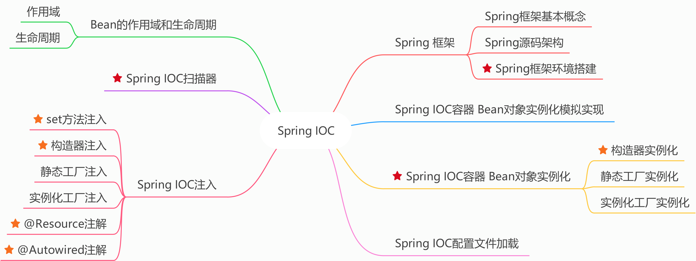

# Spring

[代码地址](https://github.com/simple-jbx/SpringLearning)

## Spring框架

开源JavaEE的应用程序

核心是IOC（控制反转/依赖注入）和AOP（面向切面编程）

Spring IOC 

Spring AOP

Spring JDBC + 事务

## Spring作用

各层对应的框架

- DAO层 JDBC操作 对应框架：Mybatis、Mybatis-plus
- Service层 Spring框架不是针对service层的业务逻辑的 service目前没有适合的框架
- Controller层 Servlet（接受请求 响应数据 地址配置 页面转发） 对应框架：Spring MVC

Spring基于分布式的应用程序

​		轻量级框架、配置管理、Bean对象的实例化（IOC）

集成第三方的框架

​		Mybatis、Hibernate框架（持久层框架）

​		Spring MVC

​		Spring Security权限

​		Quartz时钟框架（定时任务处理）

自带服务

​		mail邮件发送

​		Quartz时钟框架，定时任务处理-定时调度（定时短信、定时任务）

消息处理（异步处理）

## Spring模块划分

Spring IOC模块：Bean对象的实例化 Bean的创建

Spring AOP模块：动态代理 面向切面编程

Spring JDBC+事务模块

Spring web 模块

# Spring IOC

## 主要内容

<div align='center'>
    
    SpringIOC 主要内容
</div>
## Spring IOC容器Bean对象实例化模拟

这部分代码在Spring02目录下

思路：

1. 定义Bean工厂接口，提供获取bean方法
2. 定义Bean工厂接口实现类，解析配置文件，实例化Bean对象
3. 实现获取Bean方法

### 定义 Bean 属性对象

```java
package tech.snnukf.spring;

/**
 * @author simple.jbx
 * @ClassName MyBean
 * @description Bean 属性对象
 * 用来存储配置文件中bean标签对应的id和class属性值
 * @email jb.xue@qq.com
 * @github https://github.com/simple-jbx
 * @date 2021/12/30/ 19:07
 */
public class MyBean {
    private String id;
    private String clazz;

    public MyBean(String id, String clazz) {
        this.id = id;
        this.clazz = clazz;
    }

    public String getId() {
        return id;
    }

    public void setId(String id) {
        this.id = id;
    }

    public String getClazz() {
        return clazz;
    }

    public void setClazz(String clazz) {
        this.clazz = clazz;
    }
}
```

### 添加 dom4j 依赖

```xml
  <dependencies>
    <dependency>
      <groupId>dom4j</groupId>
      <artifactId>dom4j</artifactId>
      <version>1.6.1</version>
    </dependency>

    <dependency>
      <groupId>jaxen</groupId>
      <artifactId>jaxen</artifactId>
      <version>1.1.1</version>
    </dependency>
```

### 准备自定义配置文件

````xml
<?xml version="1.0" encoding="UTF-8"?>
<beans>
    <bean id="userDao" class="tech.snnukf.dao.UserDao"></bean>
    <bean id="userService" class="tech.snnukf.service.UserService"></bean>
</beans>
````

### 定义 Bean 工厂接口

```java
package tech.snnukf.spring;

/**
 * @author simple.jbx
 * @className MyFactory
 * @description 工厂接口
 * @email jb.xue@qq.com
 * @github https://github.com/simple-jbx
 * @date 2021/12/30/ 19:21
 */
public interface MyFactory {
    
    /**
     * @author simple.jbx
     * @description 通过id属性值获取对象
     * @date 19:22 2021/12/30
     * @param	id
     * @return 
     **/
    public Object getBean(String id);
}
```

### 定义 Bean 接口的实现类

```java
package tech.snnukf.spring;

import org.dom4j.Document;
import org.dom4j.Element;
import org.dom4j.XPath;
import org.dom4j.io.SAXReader;

import java.net.URL;
import java.util.ArrayList;
import java.util.HashMap;
import java.util.List;
import java.util.Map;

/**
 * @author simple.jbx
 * @ClassName 模拟Spring实现
 * 1. 通过带参构造器得到对应的配置文件
 * 2. 通过dom4j解析配置文件（xml文件），
 * 得到List集合（存放bean标签的id和class属性值）
 * 3. 通过反射得到对应的实例化对象 遍历List集合获取对应class属性，利用
 * Class.forName(class).newInstance()
 * 4. 通过id属性值获取指定的实例化对象
 * @description //TODO
 * @email jb.xue@qq.com
 * @github https://github.com/simple-jbx
 * @date 2021/12/30/ 19:22
 */
public class MyClassPathXmalApplicationContext implements MyFactory{

    /*存放从配置文件中获取到的bean标签信息（MyBean代表的是每一个bean标签）*/
    private List<MyBean> beanList;
    private Map<String, Object> beanMap = new HashMap<>();

    public MyClassPathXmalApplicationContext(String fileName) {

        /*通过dom4j解析配置文件（xml文件），得到List集合*/
        this.parseXml(fileName);

        /*通过反射得到对应的实例化对象，放置在Map对象*/
        this.instanceBean();
    }

    /**
     * @author simple.jbx
     * @description 通过反射得到对应的实例化队形，防止在Map中
     * 1. 判断对象集合是否为空，如果不为空则遍历集合，获取对象id和class属性
     * 2. 通过类的全路径名 反射得到实例化对象， Class.forName(class).newInstance()
     * 3. 将对应的id和实例化好的bean对象设置到Map对象中
     * @date 20:56 2021/12/30
     * @param
     * @return
     **/
    private void instanceBean() {
        //1.  判断对象集合是否为空，如果不为空，则遍历集合，获取对象的id和class属性
        if(beanList != null && beanList.size() > 0) {
            for (MyBean bean : beanList) {
                String id = bean.getId();
                String clazz = bean.getClazz();
                try {
                    // 2.通过类的全路径名 反射得到实例化对象
                    Object object = Class.forName(clazz).newInstance();
                    // 3.将对应的id和实例化好的bean对象设置到map对象中
                    beanMap.put(id, object);
                } catch (Exception e) {
                    e.printStackTrace();
                }
            }
        }
    }

    /**
     * @author simple.jbx
     * @description 通过dom4j解析配置文件，得到List集合
     * 1. 获取解析器
     * 2. 获取配置文件的URL
     * 3. 通过解析器解析配置文件（xml文件）
     * 4. 通过xpath语法解析，获取beans标签下的所有bean标签
     * 5. 通过指定解析语法解析文档对象，返回元素集合
     * 6. 判断元素集合是否为空
     * 7. 集合不为空，遍历集合
     * 8. 获取bean标签元素的属性（id、class属性）
     * 9. 获取MyBean对象，将id和class属性值设置到对象中，再将对象设置到MyBean的集合中
     * @date 20:41 2021/12/30
     * @param	fileName
     * @return
     **/
    private void parseXml(String fileName) {
        //1.获取解析器
        SAXReader saxReader = new SAXReader();
        //2.获取配置文件的URL
        URL url = this.getClass().getClassLoader().getResource(fileName);
        System.out.println(url);
        try {
            //3. 通过解析器配置文件
            Document document = saxReader.read(url);
            //4. 通过xpath语法解析，获取beans标签下的所有bean标签
            XPath xPath = document.createXPath("beans/bean");
            //5. 通过制定的解析语法解析文档对象，返回元素集合
            List<Element> elementList = xPath.selectNodes(document);
            if(elementList != null && elementList.size() > 0) {
                beanList = new ArrayList<>();

                //7. 如果集合不为空，遍历集合
                for (Element el : elementList) {
                    //8. 获取bean标签元素的属性（id、class）
                    String id = el.attributeValue("id");
                    String clazz = el.attributeValue("class");
                    //获取MyBean对象，将id和class属性值设置到对象中，在将对象设置到MyBean中
                    MyBean myBean = new MyBean(id, clazz);
                    beanList.add(myBean);
                }
            }

        } catch (Exception e) {
            e.printStackTrace();
        }
    }

    /**
     * @author simple.jbx
     * @description 通过id获取对应map中的value（实例化的bean对象）
     * @date 20:40 2021/12/30
     * @param	id
     * @return
     **/
    @Override
    public Object getBean(String id) {
        return beanMap.get(id);
    }
}
```

### 测试自定义 IOC 容器

```java
package tech.snnukf;

import tech.snnukf.dao.UserDao;
import tech.snnukf.service.UserService;
import tech.snnukf.spring.MyClassPathXmalApplicationContext;
import tech.snnukf.spring.MyFactory;

public class App 
{
    public static void main( String[] args )
    {
        //得到工厂实现
        MyFactory myFactory = new MyClassPathXmalApplicationContext("spring.xml");
        //得到对应的实例化对象
        UserDao userDao = (UserDao) myFactory.getBean("userDao");
        userDao.test();

        UserDao userDao02 = (UserDao) myFactory.getBean("userDao");
        userDao02.test();

        System.out.println(userDao == userDao02);

        UserService userService = (UserService) myFactory.getBean("userService");
        userService.test();
    }
}
```

## Spring IOC 核心技术

工厂模式（简单工厂 工厂方法 抽象工厂）

XML解析（Dom4j）

反射技术（实例化对象 反射获取方法 反射获取属性 反射获取构造器 反射调用方法）

策略模式（加载资源）

单例（IOC创建实例化对象）

## Spring IOC配置文件加载

### Spring 配置文件加载

spring.xml

### 根据相对路径加载资源

```java
ApplicationContext ac = new ClassPathXmlApplicationContext("spring.xml");
```

### 根据绝对路径加载资源

```java
ApplicationContext ac = new FileSystemXmlApplicationContext(path)
```

### 多配置文件加载

Spring框架启动时可以加载多个配置文件到项目环境中。

现在有service.xml dao.xml spring.xml等多个配置文件。

#### 可变参数，传入多个文件名

```java
ApplicationContext ac = new ClassPathXmlApplicationContext("spring.xml", "dao.xml", "service.xml");
```

#### 通过总的配置文件引入其他配置文件

```xml
<?xml version="1.0" encoding="UTF-8"?>
<beans xmlns="http://www.springframework.org/schema/beans"
       xmlns:xsi="http://www.w3.org/2001/XMLSchema-instance"
       xsi:schemaLocation="http://www.springframework.org/schema/beans
        https://www.springframework.org/schema/beans/spring-beans.xsd">

    <!--导入需要包含的资源文件-->
    <import resource="service.xml"></import>
    <import resource="dao.xml"></import>
</beans>
```

## Spring IOC 容器 Bean 对象实例化

### 构造器实例化 

通过默认构造器创建 空构造方法必须存在，否则创建失败。

```java
package tech.snnukf;

import org.springframework.beans.factory.BeanFactory;
import org.springframework.context.support.ClassPathXmlApplicationContext;
import tech.snnukf.dao.TypeDao;

/**
 * Hello world!
 *
 */
public class App 
{
    public static void main( String[] args )
    {
        BeanFactory beanFactory = new ClassPathXmlApplicationContext("spring02.xml");
        TypeDao typeDao = (TypeDao) beanFactory.getBean("typeDao");
        typeDao.test();
    }
}

```


### 静态工厂实例化（了解）

注：

- 要有该工厂类及工厂方法
- 工厂方法为静态的

```java
//StaticFactory.java
package tech.snnukf.factory;

import tech.snnukf.service.TypeService;

/**
 * @author simple.jbx
 * @ClassName StaticFactory
 * @description 定义静态工厂
 * @email jb.xue@qq.com
 * @github https://github.com/simple-jbx
 * @date 2022/01/04/ 21:27
 */
public class StaticFactory {
    public static TypeService createTypeService() {
        return new TypeService();
    }
}

```

```java
        //静态工厂实例化
        TypeService typeService = (TypeService) beanFactory.getBean("typeService");
        typeService.test();
```

当我们指定Spring使用静态工厂方法来创建Bean实例时，Spring将先解析配置文件，并根据配置文件指定的信息，通过反射调用静态工厂类的静态工厂方法，并将该静态工厂方法的返回值作为Bean实例，在这个过程中，Spring不再负责创建Bean实例，而是由用户提供的静态工厂方法提供创建。

### 实例化工厂实例化（了解）

注：

- 工厂方法为非静态方法
- 需要配置工厂bean，并在业务bean中配置factory-bean、factory-method属性

1.定义工厂类

```java
package tech.snnukf.factory;

import tech.snnukf.controller.TypeController;
import tech.snnukf.service.UserService;

/**
 * @author simple.jbx
 * @ClassName InstanceFactory
 * @description 定义实例化工厂
 * @email jb.xue@qq.com
 * @github https://github.com/simple-jbx
 * @date 2022/01/04/ 22:32
 */
public class InstanceFactory {
   public TypeController createTypeController() {
       return new TypeController();
   }
}
```


2.设置配置文件

```xml
    <!--
    实例化工厂
        1.定义实例化工厂bean
        2.引用工厂bean 指定工厂创建方法（非静态）
        factory-bean 工厂对象对应的id
        factory-method 工厂类的方法
    -->
    <bean id="instanceFactory" class="tech.snnukf.factory.InstanceFactory"></bean>
    <bean id="typeController" factory-bean="instanceFactory" factory-method="createTypeController"></bean>
```

3.获取实例化对象

```java
        //实例化工厂实例化
        TypeController typeController = (TypeController) beanFactory.getBean("typeController");
        typeController.test();
```

### Spring三种实例化 Bean 方式比较

- 方式一：通过bean的缺省构造函数创建，当各个bean的业务逻辑相互比较独立的时候或者和外界关联较少的时候可以使用
- 方式二：利用静态factory方法创建，可以统一管理各个bean的创建，如各个bean在创建之前需要相同的初始化处理，则可以用这个factory方法进行统一的处理
- 方式三：利用实例化factory方法创建，即将factory方法也做了业务bean来控制，可以你敢于集成其他框架的bean创建管理方法，能够使bean和factory的角色互换。

## Spring IOC 注入

[Code]()

### Spring IOC 手动装配（注入）

#### set方法注入

注：

- 属性字段需要提供set方法
- 四种方式，图见使用set方法注入

```xml
<?xml version="1.0" encoding="UTF-8"?>
<beans xmlns="http://www.springframework.org/schema/beans"
       xmlns:xsi="http://www.w3.org/2001/XMLSchema-instance"
       xsi:schemaLocation="http://www.springframework.org/schema/beans
        https://www.springframework.org/schema/beans/spring-beans.xsd">
    <bean id="userDao" class="tech.snnukf.dao.UserDao"></bean>

    <!--
        Set方法注入
            通过property属性注入
    -->
    <bean id="userService" class="tech.snnukf.service.UserService">
        <property name="userDao" ref="userDao"/>
        <property name="host" value="127.0.0.1"/>
        <property name="list">
            <list>
                <value>上海</value>
                <value>北京</value>
                <value>深圳</value>
            </list>
        </property>
        <property name="set">
            <set>
                <value>杭州</value>
                <value>天津</value>
                <value>西安</value>
            </set>
        </property>

        <property name="map">
            <map>
                <entry>
                    <key><value>周杰伦</value></key>
                    <value>晴天</value>
                </entry>
                <entry>
                    <key>
                        <value>林俊杰</value>
                    </key>
                    <value>江南</value>
                </entry>
            </map>
        </property>

        <property name="properties">
            <props>
                <prop key="bj">Beijing</prop>
                <prop key="sh">ShangHai</prop>
            </props>
        </property>
    </bean>
</beans>
```

```java
package tech.snnukf.service;

import tech.snnukf.dao.UserDao;

import java.util.List;
import java.util.Map;
import java.util.Properties;
import java.util.Set;

/**
 * @author simple.jbx
 * @ClassName UserService
 * @description //TODO
 * @email jb.xue@qq.com
 * @github https://github.com/simple-jbx
 * @date 2022/01/07/ 18:48
 */
public class UserService {

    //手动实例化
    //private UserDao userDao = new UserDao();

    //业务逻辑对象 JavaBean对象 set方法注入
    ///*
    private UserDao userDao;

    public void setUserDao(UserDao userDao) {
        this.userDao = userDao;
    }
    // */

    //常用类型 基本类型
    private String host;
    public void setHost(String host) {
        this.host = host;
    }

    //集合注入
    private List<String> list;
    public void setList(List<String> list) {
        this.list = list;
    }

    //Set 集合
    private Set<String> set;
    public void setSet(Set<String> set) {
        this.set = set;
    }
    
    //Map
    private Map<String, Object> map;

    public void setMap(Map<String, Object> map) {
        this.map = map;
    }

    //properties属性对象
    private Properties properties;

    public void setProperties(Properties properties) {
        this.properties = properties;
    }

    public void printList() {
        list.forEach((v -> System.out.println(v)));
    }

    public void printSet() {
        set.forEach((v -> System.out.println(v)));
    }

    public void printMap() {
        map.forEach(((k, v) -> System.out.println(k + "=" + v)));
    }

    public void printProperties() {
        properties.forEach(((k, v) -> System.out.println(k + "=" + v)));
    }


    public void test() {
        userDao.test();
        System.out.println(host);
        printList();
        printMap();
        printSet();
        printProperties();
        System.out.println("UserService Test...");
    }
}
```

#### 构造器注入

注：

- 提供带参构造器

```java
package tech.snnukf.service;

import tech.snnukf.dao.StudentDao;
import tech.snnukf.dao.UserDao;

import java.util.List;
import java.util.Map;
import java.util.Properties;
import java.util.Set;

/**
 * @author simple.jbx
 * @ClassName UserService
 * @description 构造器注入 需要提供带参构造器
 * @email jb.xue@qq.com
 * @github https://github.com/simple-jbx
 * @date 2022/01/07/ 18:48
 */
public class UserService02 {

    //构造器注入
    private UserDao userDao;
    private StudentDao studentDao;
    private String name;
    UserService02(UserDao userDao, StudentDao studentDao, String name) {
        this.userDao = userDao;
        this.studentDao = studentDao;
        this.name = name;
    }

    public void test() {
        userDao.test();
        studentDao.test();
        System.out.println(name);
        System.out.println("UserService02 test...");
   }
}
```

```xml
    <!--
        构造器注入
        设置构造器所需要的参数
        通过constructor-arg标签设置构造器的参数
        name:属性名称
        ref:要注入的bean对象对应的bean标签的id属性值
        value:数据具体的值
        index:参数的位置（从0开始）
    -->
    <bean id="userService02" class="tech.snnukf.service.UserService02">
        <constructor-arg name="userDao" ref="userDao"></constructor-arg>
        <constructor-arg name="name" value="127.0.0.1" index="2"></constructor-arg>
        <constructor-arg name="studentDao" ref="studentDao" index="1"></constructor-arg>
    </bean>
```

##### 循环依赖问题

构造器注入需要注入A，A依赖B B依赖A，形成循环

对于该类问题需要通过set注入解决

```java
package tech.snnukf.service;

import tech.snnukf.dao.AccountDao;

/**
 * @author simple.jbx
 * @ClassName AccountService
 * @description //TODO
 * @email jb.xue@qq.com
 * @github https://github.com/simple-jbx
 * @date 2022/01/08/ 17:19
 */
public class AccountService {
    private AccountDao accountDao;

    public void setAccountDao(AccountDao accountDao) {
        this.accountDao = accountDao;
    }
//    public AccountService(AccountDao accountDao) {
//        this.accountDao = accountDao;
//    }

    public void test() {
        System.out.println(AccountService.class.getName());
    }
}
```

```java
package tech.snnukf.dao;

import tech.snnukf.service.AccountService;

/**
 * @author simple.jbx
 * @ClassName AccountDao
 * @description 构造器注入出现循环依赖问题
 * @email jb.xue@qq.com
 * @github https://github.com/simple-jbx
 * @date 2022/01/08/ 17:19
 */
public class AccountDao {

    private AccountService accountService;

    public void setAccountService(AccountService accountService) {
        this.accountService = accountService;
    }
    //    public AccountDao(AccountService accountService) {
//        this.accountService = accountService;
//    }

    public void test() {
        System.out.println(AccountDao.class.getName());
    }
}
```

```xml
<!--    循环依赖问题 需要通过set注入解决&ndash;&gt;-->
<!--    <bean id="accountDao" class="tech.snnukf.dao.AccountDao">-->
<!--        <constructor-arg name="accountService" ref="accountService"></constructor-arg>-->
<!--    </bean>-->

<!--    <bean id="accountService" class="tech.snnukf.service.AccountService">-->
<!--        <constructor-arg name="accountDao" ref="accountDao"></constructor-arg>-->
<!--    </bean>-->

    <bean id="accountService" class="tech.snnukf.service.AccountService">
        <property name="accountDao" ref="accountDao"></property>
    </bean>

    <bean id="accountDao" class="tech.snnukf.dao.AccountDao">
        <property name="accountService" ref="accountService"></property>
    </bean>
```

#### 静态工厂注入

与实例化工厂注入一样本质上还是set方法注入。

```xml
    <!--静态工厂注入
        通过静态工厂实例化需要被注入的bean对象
    -->
<bean id="typeDao" class="tech.snnukf.factory.StaticFactory" factory-method="createTypeDao"></bean>

```

```java
package tech.snnukf.factory;

import tech.snnukf.dao.TypeDao;

/**
 * @author simple.jbx
 * @ClassName StaticFactory
 * @description 静态工厂
 * @email jb.xue@qq.com
 * @github https://github.com/simple-jbx
 * @date 2022/01/08/ 18:47
 */
public class StaticFactory {
//    定义静态方法
    public static TypeDao createTypeDao() {
        return new TypeDao();
    }
}
```

#### 实例化工厂注入

```xml
  <!-- 实例化工厂注入
            通过实例化工厂实例化需要被注入的bean对象
    -->
    <bean id="instanceFactory" class="tech.snnukf.factory.InstanceFactory"></bean>
    <bean id="typeDao" factory-bean="instanceFactory" factory-method="createTypeDao"></bean>
```

```java
package tech.snnukf.factory;

import tech.snnukf.dao.TypeDao;

/**
 * @author simple.jbx
 * @ClassName InstanceFactory
 * @description //TODO
 * @email jb.xue@qq.com
 * @github https://github.com/simple-jbx
 * @date 2022/01/08/ 18:54
 */
public class InstanceFactory {
    public TypeDao createTypeDao() {
        return new TypeDao();
    }
}
```

#### 注入方式的选择

set方式注入首选

spring2.5之后，为了简化setter方法属性注入，引入p名称空间，可以将<property>子元素简化为<bean>元素属性配置。

在配置文件中引入p名称空间

 ```xml
<?xml version="1.0" encoding="UTF-8"?>
<!--引入p名称空间 xmlns:p="http://www.springframework.org/schema/p"-->
<beans xmlns="http://www.springframework.org/schema/beans"
       xmlns:p="http://www.springframework.org/schema/p"
       xmlns:xsi="http://www.w3.org/2001/XMLSchema-instance"
       xsi:schemaLocation="http://www.springframework.org/schema/beans
       https://www.springframework.org/schema/beans/spring-beans.xsd">

<!--spring2.5之后，为了简化setter方法属性注入，引入p名称空间，可以将<property>子元素简化为<bean>元素属性配置。-->
        <bean id="userDao" class="tech.snnukf.dao.UserDao"></bean>
        <bean id="userService03" class="tech.snnukf.service.UserService03"
            p:name="127.0.0.1"
            p:userDao-ref="userDao"
        ></bean>
</beans>
 ```


### Spring IOC自动装配（注入）

完整代码见[Spring04](https://github.com/simple-jbx/SpringLearning/tree/main/Spring04)

#### 注解方式注入Bean

注解的配置，可以简化配置文件，提高开发速度，使得程序看上去更简洁。Spring中通过注解实现对应bean对象的注入，通过反射技术实现。

#### 准备环境

- 修改配置文件

```xml
<beans xmlns="http://www.springframework.org/schema/beans"
       xmlns:p="http://www.springframework.org/schema/p"
       xmlns:xsi="http://www.w3.org/2001/XMLSchema-instance"
       xmlns:context="http://www.springframework.org/schema/context"
       xsi:schemaLocation="http://www.springframework.org/schema/beans
       https://www.springframework.org/schema/beans/spring-beans.xsd
       http://www.springframework.org/schema/context
       http://www.springframework.org/schema/context/spring-context/xsd">
</beans>
```

- 开启自动化注入

```xml
<!--开启自动化装配(注入)-->
<context:annotation-config/>
<bean id="userDao" class="tech.snnukf.dao.UserDao"></bean>
<bean id="userService" class="tech.snnukf.service.Uservice"></bean>
```

- 给bean对象添加注解

#### @Resource注解

@Resource注解实现自动注入(反射)

- 默认根据属性字段名称查找对应的bean对象（属性字段的名称与bean标签的id属性值相等）
- 如果属性字段名称未找到，则会通过类型(Class类型)查找
- 属性可以提供set方法，也可以不提供set方法
- 注解可以声明在属性级别或set方法级别
- 可以设置name属性，name属性值必须与bean标签的id属性值一致；如果设置了name属性值，就只会按照name属性值查找bean队形
- 当注入接口时，如果接口只有一个实现则正常实例化；如果接口有多个实现，则需要使用name属性指定需要被实例化的bean对象

[Code](https://github.com/simple-jbx/SpringLearning/tree/main/Spring04/src/main/java/tech/snnukf/service/UserService.java)

```java
package tech.snnukf.service;

import tech.snnukf.dao.IUserDao;
import tech.snnukf.dao.UserDao;

import javax.annotation.Resource;

/**
 * @author simple.jbx
 * @ClassName UserService
 * @description //TODO
 * @email jb.xue@qq.com
 * @github https://github.com/simple-jbx
 * @date 2022/01/23/ 16:39
 */
public class UserService {

    //注入JavaBean对象
    //@Resource(name = "userDao")
    @Resource
    private UserDao userDao;

    //@Resource
    public void setUserDao(UserDao userDao) {
        this.userDao = userDao;
    }

    //注入接口
    @Resource(name = "userDaoImpl02")
    private IUserDao iUserDao;


    public void test() {
        userDao.test();
        iUserDao.test();
        System.out.println(UserService.class.getName());
    }
}

```

#### @Autowired注解

@Autowired注解实现自动化注入

- 默认通过类型(Class类型)查找bean对象，与属性字段的名称无关
- 属性可以提供set方法，也可以不提供set方法
- 注解可以声明在属性级别或set方法级别
- 可以添加@Qualifier结合使用，通过value属性值查找bean对象(value属性值必须设置，且值与bean标签的id属性值对应)

[Code](https://github.com/simple-jbx/SpringLearning/tree/main/Spring04/src/main/java/tech/snnukf/service/AccountService.java)

```java
package tech.snnukf.service;

import org.springframework.beans.factory.annotation.Autowired;
import org.springframework.beans.factory.annotation.Qualifier;
import tech.snnukf.dao.AccountDao;

/**
 * @author simple.jbx
 * @ClassName UserService02
 * @description //TODO
 * @email jb.xue@qq.com
 * @github https://github.com/simple-jbx
 * @date 2022/01/23/ 17:40
 */
public class AccountService {

    @Autowired
    @Qualifier(value = "accountDao") //需要的时候可结合使用
    private AccountDao accountDao;

    public void test() {
        accountDao.test();
        System.out.printf(AccountService.class.getName());
    }
}
```

## Spring IOC 扫描器

实际项目中有非常多的Bean，手动配置显然不能满足生产需要，Spring提供了扫描方式，对扫描到的bean对象统一管理，简化开发配置，提高效率。

### Spring IOC 扫描器配置

Spring IOC扫描器：bean对象统一管理，简化开发配置

1. 设置自动化扫描范围

   - 如果bean对象为在指定包范围，即使声明了注解，也无法实例化

   - ```xml
     <!--设置自动化扫描范围-->
     <context:commonent-scan base-package="xxx.xxx"/>
     ```

2. 使用指定的注解(声明在类级别) bean对象的id属性默认是类名称（首字母小写）

   - Dao层：@Repository
   - Service层：@Service
   - Controller层：@Controller
   - 任意类：@Component


## Bean的作用域和生命周期

### Bean作用域

默认情况下，从Spring容器中拿到的对象均是单例的。

#### Singleton作用域

<div align='center'>
    
    <br/><br/>Singleton作用域
</div>

#### prototype作用域

通过scope="prototype"设置bean的类型，每次向Spring容器请求获取bean都会返回一个全新的bean，相对于Singleton作用域来说就是不会缓存bean，每次都会创建新的bean。

#### Web应用中的作用域

1. request作用域
   - 每个请求创建新的bean。提交表单的数据必须对每次请求创建一个bean来保持这些表单数据，请求结束释放这些数据。
2. session作用域
   - 每个会话容器需要创建新bean。
3. globalSession作用域
   - 类似于session作用域，用于protlet(基于java的web组建)环境的web应用。如果在非portlet环境将视为session作用域。

### Bean生命周期

对比Servlet生命周期（容器启动加载并实例化servlet，调用servlet方法，销毁servlet）。

在Spring中，bean的生命周期包括bean定义、初始化、使用和销毁4个阶段。

#### Bean定义

通过配置文档定义Bean，在一个配置文档中可以定义多个Bean。

#### Bean初始化

默认IOC容器加载时，实例化对象。

1. 在配置文档中通过指定init-method属性来完成

   ```java
   public class RoleService {
       public void init() {
           System.out.println("RoleService init");
       }
   }
   ```

   ```xml
   <bean id="roleService" class="tech.snnukf.service.RoleService" init-method="init"></bean>
   ```

   

2. 实现org.springframework.beans.factory.InitializingBean接口

   ```java
   pulic class RoleService implements InitializindBean {
       @Override
       public void afterPropertiesSet() throws Exception {
           System.out.println("RpleService init...");
       }
   }
   ```

   ```xml
   <bean id="roleService" class="tech.snnukf.service.RoleService"></bean>
   ```

   ​		bean对象实例化过程是在Spring容器初始化时候完成的，可以通过lazy-init="true"属性延迟bean对象的初始化操作，然后在调用getBean方法时才会进行初始化。

#### Bean使用

1. 使用BeanFactory

   ```java
   BeanFactory beanFactory = new ClassPathXmlApplicationContext("spring.xml");
   RoleService roleService = (RoleService)beanFactory.getBean("roleService");
   
   ```

2. 使用ApplicationContext

   ```java
   ApplicationContext ac = new ClassPathXmlApplicationContext("spring.xml");
   UserService userService = (UserService) ac.getBean("userService");
   ```

#### Bean销毁

Spring容器会维护bean对象的管理，可以指定bean对象的销毁所要执行的方法。

1. 指定bean对象销毁所需执行的方法

   ```xml
   <bean id="roleService" class="tech.snnukf.Service.RoleService" destroy-method="destroy"></bean>
   ```

2. 通过AbstractApplicationContext对象，调用其close方法实现bean销毁过程(这个应该会关闭所有)

   ```java
   AbstractApplicationContext ac = new ClassPathXmlApplicationContext("spring.xml");
   ac.close();
   ```

# Spring AOP

