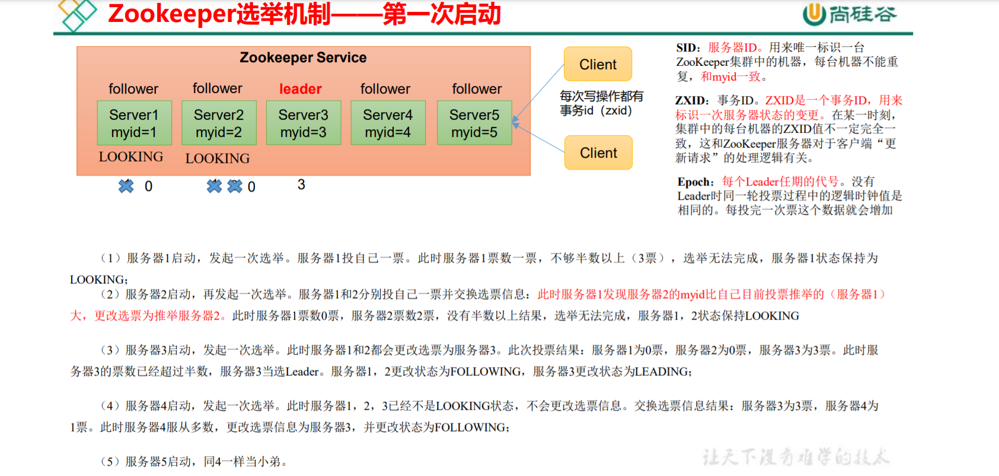
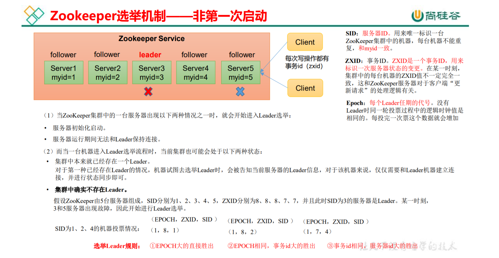

# 入门

## 概述

Zookeeper是为分布式框架提供协调服务的Apache开源项目。

**工作机制**：基于观察者模式设计的分布式服务管理框架，负责存储和管理大家都关心的数据，然后接受观察者的注册，一旦这些数据发生变化，Zookeeper就将负责通知已经在Zookeeper上注册的那些观察者做出相应的反应。

## 特点

<div align='center'>
    
</div>

- 一个Leader，多个Follower组成的集群。
- 只要**半数以上**的结点存活，集群就能正常服务。适合安装奇数台服务器。
- 全局数据一致，每个Server保存一份相同的数据，Client无论连接那个Server，数据都是一致的。
- 更新请求顺序执行，对于同一Client的更新请求按其发送顺序依次执行。
- 数据更新原子性，一次更新要么成功，要么失败。
-  实时性，当数据更新后(一段时间后)，Client能够读到最新数据。

## 数据结构

<div align='center'>
    
</div>

ZooKeeper 数据模型的结构与 Unix /Linux文件系统很类似，整体上可以看作是一棵树，每个 节点称做一个 ZNode。每一个 ZNode 默认能够存储 1MB 的数据，每个 ZNode 都可以通过其路径唯一标识。

## 应用场景

提供的服务包括：统一命名服务、统一配置管理、统一集群管理、服务器节点动态上下 线、软负载均衡等。

<div align='center'>
    
    
</div>

# 本地安装

## 本地模式安装

### 安装前准备

1. 安装JDK
2. 将zookeeper压缩包放入Linux目录下
3. 解压并将解压后的文件夹放入安装目录

### 修改配置

- 修改dataDir

### Zookeeper基本操作

- 启动Zookeeper
  - zkServer.sh start
- 查看是否启动
  - jps
- 查看状态
  - zkServer status
- 启动客户端
  - zkCli.sh
- 退出客户端
  - quit
- 停止Zookeeper
  - zkServer.sh stop

### 配置参数

- tickTime
  - 通信心跳时间，单位为ms
- initLimit
  - Leader和Follower初始连接时能容忍的最多心跳数(tickTime数量)
- syncLimit
  - LF之间同步通信时限
- dataDir
  - 保存数据目录
- clientPort
  - 客户端连接端口，一般为2181

# 集群操作

## 集群操作

### 集群安装

与本地安装一样，可以使用rsync命令或者写脚本或者docker

修改配置

```shell
server.02=192.168.232.129:28888:38888
```

server.A=B:C:D

- A：数字，A号服务器，myid中的值
- B：服务器地址
- C：Follower与Leader交换信息端口
- D：Leader宕机时用来重新选举Leader的端口

### **选举机制**

<div align='center'>
    
    
</div>

### 集群启动停止脚本

```shell
#!/bin/bash

case $1 in
"start"){
	for i in 192.168.232.128 192.168.232.129 192.168.232.130
	do
		echo ----------------- zookeeper $i start -----------------
		ssh $i "/opt/zookeeper-3.5.7/bin/zkServer.sh start"
	done
}
;;

"stop"){
	for i in 192.168.232.128 192.168.232.129 192.168.232.130
	do
		echo ----------------- zookeeper $i stop -----------------
		ssh $i "/opt/zookeeper-3.5.7/bin/zkServer.sh stop"
	done
}
;;

"status"){
	for i in 192.168.232.128 192.168.232.129 192.168.232.130
	do
		echo ----------------- zookeeper $i status -----------------
		ssh $i "/opt/zookeeper-3.5.7/bin/zkServer.sh status"
	done
}
;;
esac
```

## 客户端命令行操作

| 命令基本语法 | 功能描述                                                    |
| ------------ | ----------------------------------------------------------- |
| help         | 显示所有操作命令                                            |
| ls path      | 使用ls查看当前znode子节点 -w 监听子节点变化 -s 附加次级信息 |
| create       | 普通创建 -s 含有序列 -e 临时(重启或超时会消失)              |
| get path     | 获得节点的值 -w 监听节点内容变化 -s 附加次级信息            |
| set          | 设置节点的具体值                                            |
| stat         | 查看节点状态                                                |
| delete       | 删除节点                                                    |
| deleteall    | 递归删除节点                                                |

### 启动客户端

```sh
bin/zkCli.sh -server 192.168.232.128:2181
```

### znode节点数据信息

#### 查看当前znode中所包含的内容

```sh
[zk: 192.168.232.128:2181(CONNECTED) 1] ls /
[zookeeper]
```

#### 查看当前节点详细数据

```shell
[zk: 192.168.232.128:2181(CONNECTED) 2] ls -s /
[zookeeper]cZxid = 0x0
ctime = Wed Dec 31 16:00:00 PST 1969
mZxid = 0x0
mtime = Wed Dec 31 16:00:00 PST 1969
pZxid = 0x0
cversion = -1
dataVersion = 0
aclVersion = 0
ephemeralOwner = 0x0
dataLength = 0
numChildren = 1
```

- **cZxid** **创建节点的事务 zxid**
  - 每次修改ZooKeeper状态都会产生一个ZooKeeper事务ID。事务 ID 是 ZooKeeper 中所有修改总的次序。每次修改都有唯一的 zxid，如果 zxid1小于zxid2，那么zxid1在zxid2之前发生。
- ctime：znode 被创建的毫秒数（从 1970 年开始）
- mzxid：znode 最后更新的事务 zxid
- mtime：znode 最后修改的毫秒数（从 1970 年开始）
- pZxid：znode 最后更新的子节点 zxid
- cversion：znode 子节点变化号，znode 子节点修改次数
- **dataversion：znode 数据变化号**
- aclVersion：znode 访问控制列表的变化号
- ephemeralOwner：如果是临时节点，这个是 znode 拥有者的 session id。如果不是 临时节点则是 0。
- **dataLength：znode 的数据长度**
- **numChildren：znode 子节点数量**

### 节点类型（持久/短暂/有序号/无序号）

<div align='center'>
    
    <br/><br/>节点类型
</div>

#### 创建2个普通节点(不带序号的永久节点，创建节点的时候需要赋值)

```sh
[zk: 192.168.232.128:2181(CONNECTED) 0] create /sanguo "diaochan"
Created /sanguo
[zk: 192.168.232.128:2181(CONNECTED) 1] create /sanguo/shuguo "liubei"
Created /sanguo/shuguo
```

#### 获取节点的值

```shell
[zk: 192.168.232.128:2181(CONNECTED) 2] get -s /sanguo
diaochan
cZxid = 0x200000004
ctime = Mon Feb 07 02:53:00 PST 2022
mZxid = 0x200000004
mtime = Mon Feb 07 02:53:00 PST 2022
pZxid = 0x200000005
cversion = 1
dataVersion = 0
aclVersion = 0
ephemeralOwner = 0x0
dataLength = 8
numChildren = 1

[zk: 192.168.232.128:2181(CONNECTED) 3] get -s /sanguo/shuguo
liubei
cZxid = 0x200000005
ctime = Mon Feb 07 02:53:14 PST 2022
mZxid = 0x200000005
mtime = Mon Feb 07 02:53:14 PST 2022
pZxid = 0x200000005
cversion = 0
dataVersion = 0
aclVersion = 0
ephemeralOwner = 0x0
dataLength = 6
numChildren = 0
```

#### 创建2个带序号的永久节点

```sh
[zk: 192.168.232.128:2181(CONNECTED) 4] create /sanguo/weiguo #先创建一个普通的根节点
Created /sanguo/weiguo
[zk: 192.168.232.128:2181(CONNECTED) 5] create -s /sanguo/weiguo/zhangliao "zhangliao"
Created /sanguo/weiguo/zhangliao0000000000
[zk: 192.168.232.128:2181(CONNECTED) 6] create -s /sanguo/weiguo/zhangliao "zhangliao"
Created /sanguo/weiguo/zhangliao0000000001
[zk: 192.168.232.128:2181(CONNECTED) 7] create -s /sanguo/weiguo/xuchu "xuchu"
Created /sanguo/weiguo/xuchu0000000002
[zk: 192.168.232.128:2181(CONNECTED) 8
```

#### 创建临时节点(带序号/不带序号)

```sh
[zk: 192.168.232.128:2181(CONNECTED) 8] create -e /sanguo/wuguo "zhouyu"
Created /sanguo/wuguo
[zk: 192.168.232.128:2181(CONNECTED) 9] create -e -s /sanguo/wuguo "zhouyu"
Created /sanguo/wuguo0000000003
[zk: 192.168.232.128:2181(CONNECTED) 10] ls /sanguo
[shuguo, weiguo, wuguo, wuguo0000000003]
```

#### 修改节点数据值

```shell
[zk: 192.168.232.128:2181(CONNECTED) 11] set /sanguo/weiguo "simayi"
```

### 监听器原理

客户端注册监听它关心的目录节点，当目录节点发生变化（数据改变、节点删除、子目 录节点增加删除）时，ZooKeeper 会通知客户端。监听机制保证 ZooKeeper 保存的任何的数 据的任何改变都能快速的响应到监听了该节点的应用程序。 

<div align='center'>
    
    <br/><br/>监听器原理
</div>

#### 监听节点值的变化

```shell
[zk: 192.168.232.128:2181(CONNECTED) 11] set /sanguo/weiguo "simayi"
[zk: 192.168.232.128:2181(CONNECTED) 12] get -w /sanguo
diaochan
[zk: 192.168.232.128:2181(CONNECTED) 13] set /sanguo "xishi"

WATCHER::

WatchedEvent state:SyncConnected type:NodeDataChanged path:/sanguo
```

注册一次只能监听一次，如需要再次监听，则需要再次注册。

#### 监听节点的子节点变化(路径变化)

```shell

[zk: 192.168.232.128:2181(CONNECTED) 14] ls -w /sanguo
[shuguo, weiguo, wuguo, wuguo0000000003]
[zk: 192.168.232.128:2181(CONNECTED) 15] create /sanguo/jin "simayi"
Created /sanguo/jin
WATCHER::


WatchedEvent state:SyncConnected type:NodeChildrenChanged path:/sanguo
```

注册一次监听一次。

### 节点删除与查看

```shell
[zk: 192.168.232.128:2181(CONNECTED) 17] delete /sanguo/jin #删除单个节点
[zk: 192.168.232.128:2181(CONNECTED) 19] deleteall /sanguo/shuguo #递归删除节点
[zk: 192.168.232.128:2181(CONNECTED) 21] stat /sanguo #查看节点状态
cZxid = 0x200000004
ctime = Mon Feb 07 02:53:00 PST 2022
mZxid = 0x20000000d
mtime = Mon Feb 07 03:21:35 PST 2022
pZxid = 0x200000010
cversion = 7
dataVersion = 1
aclVersion = 0
ephemeralOwner = 0x0
dataLength = 5
numChildren = 3
bin/kafka-topics.sh --zookeeper
192.168.232.130:2181 --create --replication-factor 3 --partitions 1 --topic first
```

## 客户端API操作

### [IEDA Code](https://github.com/simple-jbx/ZooKeeperStudy)

```java
package tech.snnukf.zk;

import org.apache.zookeeper.*;
import org.apache.zookeeper.data.Stat;
import org.junit.Before;
import org.junit.Test;

import java.util.List;

/**
 * @author simple.jbx
 * @ClassName zkClient
 * @description //TODO
 * @email jb.xue@qq.com
 * @github https://github.com/simple-jbx
 * @date 2022/02/08/ 14:24
 */
public class ZKClientTest {
    private static String connectString = "192.168.232.128:2181,192.168.232.129:2181,192.168.232.130:2181";
    private static int sessionTimeout = 200000;
    private ZooKeeper zkClient = null;
	//创建客户端
    @Before
    public void init() throws Exception {
        System.out.println("---init start---");
        zkClient = new ZooKeeper(connectString, sessionTimeout, new Watcher() {
                    @Override
                    public void process(WatchedEvent watchedEvent) {
                        // 收到事件通知后的回调函数（用户的业务逻辑）
                        System.out.println(watchedEvent.getType() + "--"
                                + watchedEvent.getPath());
                        // 再次启动监听
                        try {
                            List<String> children = zkClient.getChildren("/",
                                    true);
                            for (String child : children) {
                                System.out.println(child);
                            }
                        } catch (Exception e) {
                            e.printStackTrace();
                        }
                    }
                });
        System.out.println("---init end---");
    }

    // 创建子节点
    @Test
    public void create() throws Exception {
        // 参数 1：要创建的节点的路径； 参数 2：节点数据 ； 参数 3：节点权限 参数 4：节点的类型
        String nodeCreated = zkClient.create("/people", "male".getBytes(),
                ZooDefs.Ids.OPEN_ACL_UNSAFE, CreateMode.PERSISTENT);
        System.out.println(nodeCreated);
    }

    // 获取子节点
    @Test
    public void getChildren() throws Exception {
        List<String> children = zkClient.getChildren("/", true);
        for (String child : children) {
            System.out.println(child);
        }
        // 延时阻塞
        Thread.sleep(Long.MAX_VALUE);
    }

    // 判断 znode 是否存在
    @Test
    public void exist() throws Exception {
        Stat stat = zkClient.exists("/people", false);
        System.out.println(stat == null ? "not exist" : "exist");
    }

}
```

## 客户端向服务端写数据流程

<div align='center'>
    
    
    <br/><br/>客户端向服务端写数据流程
</div>

# 案例

[Code](https://github.com/simple-jbx/ZooKeeperStudy)

## 服务器动态上下线监听案例

某分布式系统中，主节点可以有多台，可以动态上下线，任意一台客户端都能实时感知 到主节点服务器的上下线。

<div align='center'>
    
</div>

### 实现

在集群上创建 /servers节点、添加/删除server

```sh
[zk: 192.168.232.128:2181(CONNECTED) 8] create /servers "servers"
Created /servers
[zk: 192.168.232.128:2181(CONNECTED) 9] create -e -s /servers/192.168.232.128 "192.168.232.128"
Created /servers/192.168.232.1280000000000
[zk: 192.168.232.128:2181(CONNECTED) 10] create -e -s /servers/192.168.232.129 "192.168.232.129"
Created /servers/192.168.232.1290000000001
[zk: 192.168.232.128:2181(CONNECTED) 11] ls /servers
[192.168.232.1280000000000, 192.168.232.1290000000001]
[zk: 192.168.232.128:2181(CONNECTED) 12] delete /servers/192.168.232.1280000000000
```

```java
package tech.snnukf.zkcase1;
import java.io.IOException;
import java.util.ArrayList;
import java.util.List;
import org.apache.zookeeper.WatchedEvent;
import org.apache.zookeeper.Watcher;
import org.apache.zookeeper.ZooKeeper;


/**
 * @author simple.jbx
 * @ClassName DistributeClient
 * @description //TODO
 * @email jb.xue@qq.com
 * @github https://github.com/simple-jbx
 * @date 2022/02/08/ 16:36
 */
public class DistributeClient {
    private static String connectString =
            "192.168.232.128:2181,192.168.232.129:2181,192.168.232.130:2181";
    private static int sessionTimeout = 2000000;
    private ZooKeeper zk = null;
    private String parentNode = "/servers";
    // 创建到 zk 的客户端连接
    public void getConnect() throws IOException {
        zk = new ZooKeeper(connectString, sessionTimeout, new Watcher() {
                    @Override
                    public void process(WatchedEvent event) {
                    // 再次启动监听
                        try {
                            getServerList();
                        } catch (Exception e) {
                            e.printStackTrace();
                        }
                    }
                });
    }

    // 获取服务器列表信息
    public void getServerList() throws Exception {
        // 1 获取服务器子节点信息，并且对父节点进行监听
        List<String> children = zk.getChildren(parentNode, true);
        // 2 存储服务器信息列表
        ArrayList<String> servers = new ArrayList<>();
        // 3 遍历所有节点，获取节点中的主机名称信息
        for (String child : children) {
            byte[] data = zk.getData(parentNode + "/" + child,
                    false, null);
            servers.add(new String(data));
        }
        // 4 打印服务器列表信息
        System.out.println(servers);
    }

    // 业务功能
    public void business() throws Exception{
        System.out.println("client is working ...");
        Thread.sleep(Long.MAX_VALUE);
    }

    public static void main(String[] args) throws Exception {
        // 1 获取 zk 连接
        DistributeClient client = new DistributeClient();
        client.getConnect();
        // 2 获取 servers 的子节点信息，从中获取服务器信息列表
        client.getServerList();
        // 3 业务进程启动
        client.business();
    }
}
```

```java
package tech.snnukf.zkcase1;

import java.io.IOException;
import org.apache.zookeeper.CreateMode;
import org.apache.zookeeper.WatchedEvent;
import org.apache.zookeeper.Watcher;
import org.apache.zookeeper.ZooKeeper;
import org.apache.zookeeper.ZooDefs.Ids;

/**
 * @author simple.jbx
 * @ClassName DistributeServer
 * @description //TODO
 * @email jb.xue@qq.com
 * @github https://github.com/simple-jbx
 * @date 2022/02/08/ 16:33
 */
public class DistributeServer {
    private static String connectString =
            "192.168.232.128:2181,192.168.232.129:2181,192.168.232.130:2181";
    private static int sessionTimeout = 2000000;
    private ZooKeeper zk = null;
    private String parentNode = "/servers";
    // 创建到 zk 的客户端连接
    public void getConnect() throws IOException{
        zk = new ZooKeeper(connectString, sessionTimeout, new Watcher() {
                    @Override
                    public void process(WatchedEvent event) {

                    }
        });
    }

    // 注册服务器
    public void registServer(String hostname) throws Exception{
        String create = zk.create(parentNode + "/server",
                hostname.getBytes(), Ids.OPEN_ACL_UNSAFE,
                CreateMode.EPHEMERAL_SEQUENTIAL);
        System.out.println(hostname +" is online "+ create);
    }

    // 业务功能
    public void business(String hostname) throws Exception{
        System.out.println(hostname + " is working ...");
        Thread.sleep(Long.MAX_VALUE);
    }

    public static void main(String[] args) throws Exception {
        // 1 获取 zk 连接
        DistributeServer server = new DistributeServer();
        server.getConnect();
        // 2 利用 zk 连接注册服务器信息
        server.registServer(args[0]);
        // 3 启动业务功能
        server.business(args[0]);
    }

}
```

```
//Client 输出
[]
[]
client is working ...
[192.168.232.128]
[192.168.232.128, 192.168.232.129]
[192.168.232.129]
[192.168.232.128, 192.168.232.129]
```

```
//Server输出  server输入参数为 192.168.232.128
192.168.232.128 is online /servers/server0000000002
192.168.232.128 is working ...
```

## 原生ZooKeeper分布式锁案例

<div align='center'>
    
</div>

### 分布式锁实现

```java
package tech.snnukf.zkcase2;

import org.apache.zookeeper.*;
import org.apache.zookeeper.data.Stat;

import java.io.IOException;
import java.util.Collections;
import java.util.List;
import java.util.concurrent.CountDownLatch;

/**
 * @author simple.jbx
 * @ClassName Lock
 * @description //TODO
 * @email jb.xue@qq.com
 * @github https://github.com/simple-jbx
 * @date 2022/02/08/ 17:04
 */
public class DistributedLock {
    // zookeeper server 列表

    private final String connectString = "192.168.232.128:2181,192.168.232.129:2181,192.168.232.130:2181";
    // 超时时间
    private final int sessionTimeout = 2000000;
    private final ZooKeeper zk;
    private final String rootNode = "locks";
    private final String subNode = "seq-";
    // 当前 client 等待的子节点
    private String waitPath;
    //ZooKeeper 连接
    private final CountDownLatch connectLatch = new CountDownLatch(1);

    //ZooKeeper 节点等待
    private final CountDownLatch waitLatch = new CountDownLatch(1);
    // 当前 client 创建的子节点
    private String currentNode;

    // 和 zk 服务建立连接，并创建根节点
    public DistributedLock() throws IOException,
            InterruptedException, KeeperException {
        zk = new ZooKeeper(connectString, sessionTimeout, new
                Watcher() {
                    @Override
                    public void process(WatchedEvent event) {
                        // 连接建立时, 打开 latch, 唤醒 wait 在该 latch 上的线程
                        if (event.getState() ==
                                Event.KeeperState.SyncConnected) {
                            connectLatch.countDown();
                        }
                        // 发生了 waitPath 的删除事件
                        if (event.getType() ==
                                Event.EventType.NodeDeleted && event.getPath().equals(waitPath)) {
                            waitLatch.countDown();
                        }
                    }
                });
        // 等待连接建立
        connectLatch.await();
        //获取根节点状态
        Stat stat = zk.exists("/" + rootNode, false);
        //如果根节点不存在，则创建根节点，根节点类型为永久节点
        if (stat == null) {
            System.out.println("根节点不存在");
            zk.create("/" + rootNode, new byte[0],
                    ZooDefs.Ids.OPEN_ACL_UNSAFE, CreateMode.PERSISTENT);
        }
    }

    // 加锁方法
    public void zkLock() {
        try {
            //在根节点下创建临时顺序节点，返回值为创建的节点路径
            currentNode = zk.create("/" + rootNode + "/" + subNode,
                    null, ZooDefs.Ids.OPEN_ACL_UNSAFE,
                    CreateMode.EPHEMERAL_SEQUENTIAL);
            // wait 一小会, 让结果更清晰一些
            Thread.sleep(10);
            // 注意, 没有必要监听"/locks"的子节点的变化情况

            List<String> childrenNodes = zk.getChildren("/" +
                    rootNode, false);
            // 列表中只有一个子节点, 那肯定就是 currentNode , 说明 client 获得锁
            if (childrenNodes.size() == 1) {
                return;
            } else {
                //对根节点下的所有临时顺序节点进行从小到大排序
                Collections.sort(childrenNodes);
                //当前节点名称
                String thisNode = currentNode.substring(("/" +
                        rootNode + "/").length());
                //获取当前节点的位置
                int index = childrenNodes.indexOf(thisNode);
                if (index == -1) {
                    System.out.println("数据异常");
                } else if (index == 0) {
                    // index == 0, 说明 thisNode 在列表中最小, 当前
                    //client 获得锁
                    return;
                } else {
                    // 获得排名比 currentNode 前 1 位的节点
                    this.waitPath = "/" + rootNode + "/" +
                            childrenNodes.get(index - 1);
                    // 在 waitPath 上注册监听器, 当 waitPath 被删除时, zookeeper 会回调监听器的 process 方法
                    zk.getData(waitPath, true, new Stat());
                    //进入等待锁状态
                    waitLatch.await();
                    return;
                }
            }
        } catch (KeeperException e) {
            e.printStackTrace();
        } catch (InterruptedException e) {
            e.printStackTrace();
        }
    }

    // 解锁方法
    public void zkUnlock() {
        try {
            zk.delete(this.currentNode, -1);
        } catch (InterruptedException | KeeperException e) {
            e.printStackTrace();
        }
    }
}
```

### 分布式锁测试

```java
package tech.snnukf.zkcase2;
import org.apache.zookeeper.KeeperException;
import java.io.IOException;

/**
 * @author simple.jbx
 * @ClassName DistributedLockTest
 * @description //TODO
 * @email jb.xue@qq.com
 * @github https://github.com/simple-jbx
 * @date 2022/02/08/ 17:07
 */
public class DistributedLockTest {
    public static void main(String[] args) throws
            InterruptedException, IOException, KeeperException {
        // 创建分布式锁 1
        final DistributedLock lock1 = new DistributedLock();
        // 创建分布式锁 2
        final DistributedLock lock2 = new DistributedLock();
        new Thread(new Runnable() {
            @Override
            public void run() {
                // 获取锁对象
                try {
                    lock1.zkLock();
                    System.out.println("线程 1 获取锁");
                    Thread.sleep(5 * 1000);
                    lock1.zkUnlock();
                    System.out.println("线程 1 释放锁");
                } catch (Exception e) {
                    e.printStackTrace();
                }
            }
        }).start();
        new Thread(new Runnable() {
            @Override
            public void run() {
                // 获取锁对象
                try {
                    lock2.zkLock();
                    System.out.println("线程 2 获取锁");
                    Thread.sleep(5 * 1000);
                    lock2.zkUnlock();
                    System.out.println("线程 2 释放锁");
                } catch (Exception e) {
                    e.printStackTrace();
                }
            }
        }).start();
    }
}
```

## Curator框架实现分布式锁案例

### 原生的 Java API 开发存在的问题 

1. 会话连接是异步的，需要自己去处理。比如使用 CountDownLatch 。
2. Watch 需要重复注册，不然就不能生效 。
3. 开发的复杂性还是比较高的。
4. 不支持多节点删除和创建，需要自己去递归。

Curator 是一个专门解决分布式锁的框架，解决了原生 Java API 开发分布式遇到的问题。

[文档](https://curator.apache.org/index.html)

### 实现

#### 添加依赖

```xml
<dependency>
 <groupId>org.apache.curator</groupId>
 <artifactId>curator-framework</artifactId>
 <version>4.3.0</version>
</dependency>
<dependency>
 <groupId>org.apache.curator</groupId>
 <artifactId>curator-recipes</artifactId>
 <version>4.3.0</version>
</dependency>
<dependency>
 <groupId>org.apache.curator</groupId>
 <artifactId>curator-client</artifactId>
 <version>4.3.0</version>
</dependency>
```

#### 代码

```java
package tech.snnukf.zkcase3;

import org.apache.curator.RetryPolicy;
import org.apache.curator.framework.CuratorFramework;
import org.apache.curator.framework.CuratorFrameworkFactory;
import org.apache.curator.framework.recipes.locks.InterProcessLock;
import org.apache.curator.framework.recipes.locks.InterProcessMutex;
import org.apache.curator.retry.ExponentialBackoffRetry;

/**
 * @author simple.jbx
 * @ClassName CuratorLockTest
 * @description //TODO
 * @email jb.xue@qq.com
 * @github https://github.com/simple-jbx
 * @date 2022/02/09/ 18:55
 */
public class CuratorLockTest {
    private String rootNode = "/locks";
    // zookeeper server 列表
    private String connectString =
            "192.168.232.128:2181,192.168.232.129:2181,192.168.232.130:2181";
    // connection 超时时间
    private int connectionTimeout = 200000;
    // session 超时时间
    private int sessionTimeout = 2000;
    public static void main(String[] args) {
        new CuratorLockTest().test();
    }

    // 测试
    private void test() {
        // 创建分布式锁 1
        final InterProcessLock lock1 = new
                InterProcessMutex(getCuratorFramework(), rootNode);
        // 创建分布式锁 2
        final InterProcessLock lock2 = new
                InterProcessMutex(getCuratorFramework(), rootNode);
        new Thread(new Runnable() {
            @Override
            public void run() {
                // 获取锁对象
                try {
                    lock1.acquire();
                    System.out.println("线程 1 获取锁");
                    // 测试锁重入
                    lock1.acquire();
                    System.out.println("线程 1 再次获取锁");
                    Thread.sleep(5 * 1000);
                    lock1.release();
                    System.out.println("线程 1 释放锁");
                    lock1.release();
                    System.out.println("线程 1 再次释放锁");
                } catch (Exception e) {
                    e.printStackTrace();
                }
            }
        }).start();
        new Thread(new Runnable() {
            @Override
            public void run() {
                // 获取锁对象
                try {
                    lock2.acquire();
                    System.out.println("线程 2 获取锁");
                    // 测试锁重入
                    lock2.acquire();
                    System.out.println("线程 2 再次获取锁");
                    Thread.sleep(5 * 1000);
                    lock2.release();
                    System.out.println("线程 2 释放锁");
                    lock2.release();
                    System.out.println("线程 2 再次释放锁");
                } catch (Exception e) {
                    e.printStackTrace();
                }
            }
        }).start();
    }

    // 分布式锁初始化
    public CuratorFramework getCuratorFramework (){
        //重试策略，初试时间 3 秒，重试 3 次
        RetryPolicy policy = new ExponentialBackoffRetry(3000, 3);
        //通过工厂创建 Curator
        CuratorFramework client =
                CuratorFrameworkFactory.builder()
                        .connectString(connectString)
                        .connectionTimeoutMs(connectionTimeout)
                        .sessionTimeoutMs(sessionTimeout)
                        .retryPolicy(policy).build();
        //开启连接
        client.start();
        System.out.println("zookeeper 初始化完成...");
        return client;
    }

}
```

#### 执行结果

```
zookeeper 初始化完成...
zookeeper 初始化完成...
线程 2 获取锁
线程 2 再次获取锁
线程 2 释放锁
线程 2 再次释放锁
线程 1 获取锁
线程 1 再次获取锁
线程 1 释放锁
线程 1 再次释放锁
```

# Zookeeper源码（部分）分析

