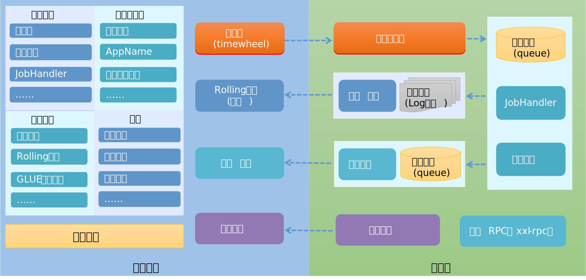

# 简介

[GitHub](https://github.com/xuxueli/xxl-job?utm_source=gold_browser_extension)

[中文文档](https://www.xuxueli.com/xxl-job/)

基于xxl-job v2.2.0

## 分布式任务调度

分布式集群模式下，如何采用集中式的任务调度方式，会带来一些问题：

1. 集群部署的定时任务如何保证不被重复执行
2. 动态调整定时任务的执行时间（不重启服务的情况）
3. 如何实现故障转移
4. 如何对定时任务进行监控
5. 如何扩、缩容...

## 分布式任务调度解决方案

- 数据库唯一约束，避免定时任务重复执行。

- 使用配置文件、redis、mysql作为调度开关。

- 使用分布式锁实现调度的控制。

- 使用分布式任务调度平台TBSchedule(淘宝)、Elastric-Job(当当)、Saturn、xxl-job(美团

    )、google cron等。

- 自研。

## xxl-job整体架构

    
	  xxl-job v2.1.0架构图

**服务端**，调度中心，web管理后台。

**客户端**，执行器，业务代码，执行定时任务。

# 搭建xxl-job定时任务调度平台

解压源代码，执行sql脚本，启动java项目。

`http://localhost:8080/xxl-job-admin/` 即可访问。

