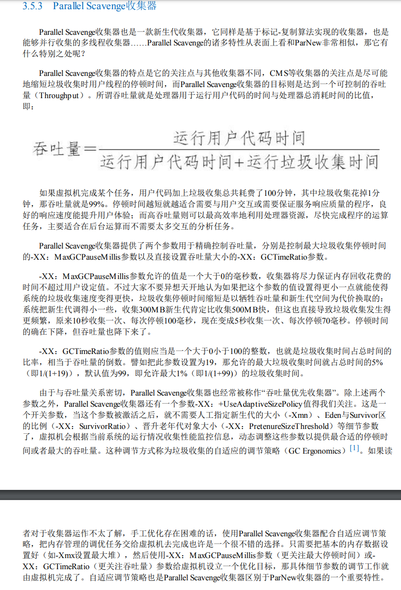
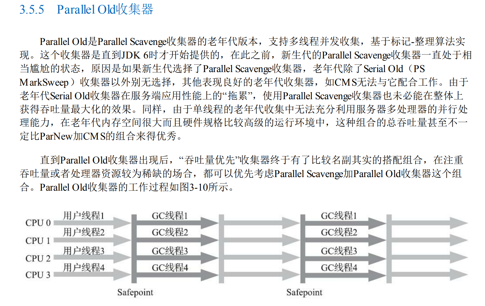
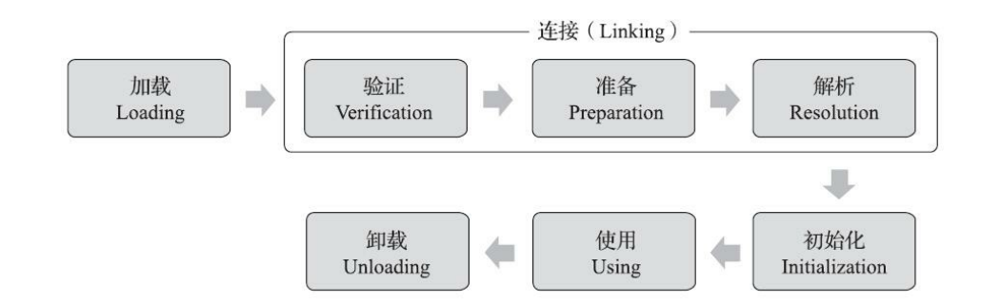

[TOC]


# 注释

所有涉及Linux源码的，均基于Linux kernel v5.15

# 刷题

##  模拟

#### [LeetCode 1583. 统计不开心的朋友](https://leetcode-cn.com/problems/count-unhappy-friends/)

## 图&树

### **拓扑排序**★★★★★

#### [LeetCode 207.课程表](https://leetcode-cn.com/problems/course-schedule/)

节点分为三种状态，未搜索、搜索中、已搜索

```java
class Solution {
        int[] visited;
        boolean valid = true;
        List<List<Integer>> edges = new ArrayList<>();
    public boolean canFinish(int numCourses, int[][] prerequisites) {
        visited = new int[numCourses];

        for (int i = 0; i < numCourses; i++) {
            edges.add(new ArrayList<Integer>());
        }

        for (int[] info : prerequisites) {
            edges.get(info[1]).add(info[0]);
        }

        for (int i = 0; i < numCourses; i++) {
            if(visited[i] == 0) {
                dfs(i);
            }
        }
        return valid ;
    }

    private void dfs(int n) {
        visited[n] = 1;

        for(int v : edges.get(n)) {
            if(visited[v] == 0) {
                dfs(v);
                if(!valid) {
                    return;
                }
            } else if(visited[v] == 1) {
                valid = false;
                return;
            }

        }
        visited[n] = 2;
    }
}
```

#### [LeetCode 210.课程表II](https://leetcode-cn.com/problems/course-schedule-ii/)

```java
class Solution {

    List<List<Integer>> infos = new ArrayList<>();
    int[] visited;
    boolean vaild = true;
    List<Integer> ans = new ArrayList<>();
    public int[] findOrder(int numCourses, int[][] prerequisites) {
        visited = new int[numCourses];

        for (int i = 0; i < numCourses; i++) {
            infos.add(new ArrayList<>());
        }

        for(int[] info : prerequisites) {
            infos.get(info[1]).add(info[0]);
        }

        for (int i = 0; i < numCourses; i++) {
            if(visited[i] == 0) {
                dfs(i);
            }
        }

        if(vaild) {
            return ans.stream().mapToInt(Integer::intValue).toArray();
        } else {
            return new int[0];
        }

    }

    private void dfs(int n) {
        visited[n] = 1;

        for(int v : infos.get(n)) {
            if(visited[v] == 0) {
                dfs(v);
                if(!vaild) {
                    return;
                }
            } else if(visited[v] == 1) {
                vaild = false;
                return;
            }
        }

        visited[n] = 2;
        ans.add(0, n);
    }
}
```

## 

### 最小生成树★★

#### [LeetCode 1584. 连接所有点的最小费用](https://leetcode-cn.com/problems/min-cost-to-connect-all-points/)

Kruskal(并查集)：贪心选（最短）边


```java
class Solution {

    class Edge {
        int len, x, y;

        public Edge(int len, int x, int y) {
            this.len = len;
            this.x = x;
            this.y = y;
        }
    }

    class DisjointSetUnion {
        int[] f;
        int[] rank;
        int n;

        public DisjointSetUnion(int n) {
            this.n = n;
            this.rank = new int[n]; //加入秩（经验）优化，把小堆加到大堆中，去掉也可以
            Arrays.fill(this.rank, 1);
            this.f = new int[n];

            for (int i = 0; i < n; i++) {
                this.f[i] = i;
            }
        }

        //查找父节点（顺带更新）
        public int find(int x) {
            return f[x] == x ? x : (f[x] = find(f[x]));
        }

        //合并两个节点
        public boolean unionSet(int x, int y) {
            int fx = find(x), fy = find(y);

            if(fx == fy) {
                return false;
            }

            if(rank[fx] < rank[fy]) {
                int temp = fx;
                fx = fy;
                fy = temp;
            }

            rank[fx] += rank[fy];
            f[fy] = fx;
            return true;
        }
    }

    public int dist(int[][] points, int x, int y) {
        return Math.abs(points[x][0] - points[y][0]) + Math.abs(points[x][1] - points[y][1]);
    }

    public int minCostConnectPoints(int[][] points) {

        int n = points.length;

        DisjointSetUnion dsu = new DisjointSetUnion(n);
        List<Edge> edges = new ArrayList<Edge>();

        for (int i = 0; i < n; i++) {
            for (int j = 0; j < n; j++) {
                edges.add(new Edge(dist(points, i, j), i, j));
            }
        }

        //对边进行排序，方便后续选边 用堆也可以
        Collections.sort(edges, new Comparator<Edge>() {
            public int compare(Edge edge1, Edge edge2) {
                return edge1.len - edge2.len;
            }
        });

        int ret = 0, num = 1;

        for (Edge edge : edges) {
            int len = edge.len, x = edge.x, y = edge.y;
            //如果这条边上的两个点属于两个集合，则合并成功，将边的长度加入ret
            if(dsu.unionSet(x, y)) {
                ret += len;
                num++;

                if(num == n) {
                    break;
                }
            }
        }
        return ret;
    }
}
```

### 欧拉回路/欧拉通路

#### Hierholzer 算法

Hierholzer 算法用于在连通图中寻找欧拉路径，其流程如下：

从起点出发，进行深度优先搜索。

每次沿着某条边从某个顶点移动到另外一个顶点的时候，都需要删除这条边。

如果没有可移动的路径，则将所在节点加入到栈中，并返回。

当我们顺序地考虑该问题时，我们也许很难解决该问题，因为我们无法判断当前节点的哪一个分支是「死胡同」分支。

不妨倒过来思考。我们注意到只有那个入度与出度差为 11 的节点会导致死胡同。而该节点必然是最后一个遍历到的节点。我们可以改变入栈的规则，当我们遍历完一个节点所连的所有节点后，我们才将该节点入栈（即逆序入栈）。

对于当前节点而言，从它的每一个非「死胡同」分支出发进行深度优先搜索，都将会搜回到当前节点。而从它的「死胡同」分支出发进行深度优先搜索将不会搜回到当前节点。也就是说当前节点的死胡同分支将会优先于其他非「死胡同」分支入栈。

这样就能保证我们可以「一笔画」地走完所有边，最终的栈中逆序地保存了「一笔画」的结果。我们只要将栈中的内容反转，即可得到答案。

##### [LeetCode 332. 重新安排行程](https://leetcode-cn.com/problems/reconstruct-itinerary/)

```java
class Solution {
    Map<String, PriorityQueue<String>> map = new HashMap<String, PriorityQueue<String>>();
    List<String> itinerary = new LinkedList<String>();

    public List<String> findItinerary(List<List<String>> tickets) {
        for (List<String> ticket : tickets) {
            String src = ticket.get(0), dst = ticket.get(1);
            if (!map.containsKey(src)) {
                map.put(src, new PriorityQueue<String>());
            }
            map.get(src).offer(dst);
        }
        dfs("JFK");
        Collections.reverse(itinerary);
        return itinerary;
    }

    public void dfs(String curr) {
        while (map.containsKey(curr) && map.get(curr).size() > 0) {
            String tmp = map.get(curr).poll();
            dfs(tmp);
        }
        itinerary.add(curr);
    }
}
```


##### [LeetCode 753. 破解保险箱](https://leetcode-cn.com/problems/cracking-the-safe/)


### 字典树★★

### 线段树

```java
class SegmentTree {
    
    int n;
    int[] tree;
    
    public SegmentTree(int[] nums) {
        int n = nums.length;
        tree = new int[n << 1];
        buildTree(nums);
    }
    
    private void buildTree(int[] nums) {
		//构造tree的n - 2n-1部分
		for (int i = n, j = 0; i < n << 1; i++, j++) {
			tree[i] = nums[j];
		}
		//构造tree的1-n-1部分
		for (int i = n - 1; i > 0; i--) {
			tree[i] = tree[i << 1] + tree[(i << 1) + 1];
		}
	}

	public void update(int i, int val) {
        i += n;//nums的索引与tree的索引相差n
        tree[i] = val;
        while (i > 0) {
            int left = i;
            int right = i;
            if (i & 1 == 0) {
                right = i + 1;//i为左孩子
            } 
            else {
                left = i - 1;//i为右孩子
            } 
            tree[i >> 1] = tree[left] + tree[right];
            i >>= 1;
        }
    }

    public int sumRange(int i, int j) {
        //nums的索引与tree的索引相差n
        i += n;
        j += n;
        int sum = 0;
        while (i <= j) {
            //目的是维持[i,j]我左右孩子，或者一个节点本身
            if (i & 1 == 1) {//i为右孩子
                sum += tree[i];
                i++;
            }
            
            if (j & 1 == 0) {//j为左孩子
                sum += tree[j];
                j--;
            }
            i >>= 1;
            j >>= 1;
        }
        return sum;
    }
}
```


##  数学

###  快速幂

```java
private static long quickPow(long x, long y, long mod) {
    long ans = 1L;
    while (y > 0) {
        if((y & 1) == 1) {
            ans *= x;
        }
        x *= x;
        x %= mod;
        ans %= mod;
        y >>= 1;
    }
        return ans;
}
```

###  矩阵快速幂

#### [LeetCode 552. 学生出勤记录 II](https://leetcode-cn.com/problems/student-attendance-record-ii/)

```java
public long[][] pow(long[][] mat, int n) {
    long[][] ret = {{1, 0, 0, 0, 0, 0}}; //初始矩阵  相当于快速幂中的1
    while (n > 0) {
        if ((n & 1) == 1) {
            ret = multiply(ret, mat);
        }
        n >>= 1;
        mat = multiply(mat, mat);
    }
    return ret;
}

//矩阵相乘
public long[][] multiply(long[][] a, long[][] b) {
    int rows = a.length, columns = b[0].length, temp = b.length;
    long[][] c = new long[rows][columns];
    for (int i = 0; i < rows; i++) {
        for (int j = 0; j < columns; j++) {
            for (int k = 0; k < temp; k++) {
                c[i][j] += a[i][k] * b[k][j];
                c[i][j] %= MOD;
            }
        }
    }
    return c;
}
```


###  动态规划★★★★

找准状态转移方程

#### [LeetCode 552. 学生出勤记录 II](https://leetcode-cn.com/problems/student-attendance-record-ii/)

#### [LeetCode 300. 最长递增子序列](https://leetcode-cn.com/problems/longest-increasing-subsequence/)

#### [LeetCode 673. 最长递增子序列的个数](https://leetcode-cn.com/problems/number-of-longest-increasing-subsequence/)

##  贪心★★

##  二分法★★★★★

##  二叉查找（搜索、排序，BST）树★★★★★


<div align='center'>
    
</div>

#### [LeetCode 96. 不同的二叉搜索树](https://leetcode-cn.com/problems/unique-binary-search-trees/)

假设有n个结点，值为1-n，问有所少中不同的二叉搜索树。

卡特兰数

<div align='center'>
    
</div>

```java

class Solution {
    public int numTrees(int n) {
        // 提示：我们在这里需要用 long 类型防止计算过程中的溢出
        long C = 1;
        for (int i = 0; i < n; ++i) {
            C = C * 2 * (2 * i + 1) / (i + 2);
        }
        return (int) C;
    }
}
```

#### [LeetCode 108. 将有序数组转换为二叉搜索树](https://leetcode-cn.com/problems/convert-sorted-array-to-binary-search-tree/)

将有序数组转为高度平衡的二叉搜索树，三种方法，1：中序遍历，每次以(left + right) >> 1 位置处数字为根节点；2：中序遍历，每次选取(left + right + 1) >> 1处的数字作为根节点；3：中序遍历，每次选取(left + right ) >> 1 、(left + right + 1) >> 1任一位置处的数字作为根节点。

```java
class Solution {
    public TreeNode sortedArrayToBST(int[] nums) {
        return createBST(nums, 0, nums.length - 1);
    }

    public TreeNode createBST(int[] nums, int left, int right) {
        if(left > right) {
            return null;
        }

        int mid = (left + right) >> 1;
        TreeNode root = new TreeNode(nums[mid]);
        root.left = createBST(nums, left, mid - 1);
        root.right = createBST(nums, mid + 1, right);
        return root;
    }
}
```


##  并查集★★

##  分治法★★★


##  哈希表★★★★★

##  堆★★★

## 差分数组

#### [LeetCode 1109. 航班预订统计](https://leetcode-cn.com/problems/corporate-flight-bookings/)

## 扫描线


# 面试知识

##  数据结构

###  排序

####  插入排序

- 直接插入排序

线性（挨个）比较，找到待插入位置后，移动元素，插入待插入元素

```java
void InsertSort(ElemType[] A, int n) {
	for(int i = 2; i <= n; i++) { //依次将A[2]-A[n]插入前面已排序序列
		if(A[i] < A[i - 1]) {	//若A[i]小于A[i - 1],将A[i]插入有序表
			A[0] = A[i];		//复制为哨兵
			for(int j = i - 1; A[0] < A[j]; --j) { //从后往前查找待插入位置
				A[j + 1] = A[j];
			}
			A[j + 1] = A[0];
		}
	}
}
```

- 折半插入排序

二分比较过程，先确定待插入位置，然后移动元素，将待插入元素复制到待插入位置

```java
void InsertSort(ElemType[] A, int n) {
	for(int i = 2; i <= n; i++) {
		A[0] = A[i];
		int low = 1, high = i - 1, mid;
        //二分待插入位置
		while(low <= high) {
			mid = (low + high) >> 1;
			if(A[mid] > A[0]) {
				high = mid - 1;
			} else {
				low = mid + 1;
			}
		}
		
        //元素后移，空出待插入位置
		for(int j = i - 1; j >= high + 1; j--) {
			A[j + 1] = A[j];
		}
		
		A[high + 1] = A[0];
	}
}
```

- 希尔排序

```java
void ShellSort(ElemType[] A, int n) {
	for(dk = n >> 1; dk >= 1; dk >>= 1) {
		for(int i = dk + 1; i <= n; i++) {
			if(A[i] < A[i - dk]) {
				A[0] = A[i];
				for(int j = i - dk; j > 0 && A[0] < A[j]; j-= dk) {
					A[j + dk] = A[j];
				}
				A[j + dk] = A[0];
			}
		}
	}
}
```

####  交换排序

- 冒泡排序

```java
void BubbleSort(ElemType[] A, int n) {
	boolean flag = false;
	for(int i = 0; i < n - 1; i++) {
		flag = false;
		for(int j = n - 1; j > i; j--) {
			if(A[j - 1] > A[j]) {
				int temp = A[j - 1];
				A[j - 1] = A[j];
				A[j] = temp;
				flag = true;
			}
		}
		if(flag == false) {
			return;
		}
	}
}
```

- 快速排序

```java
void QuickSort(ElemType A[], int low, int high) {
	if(low < high) {
		//Partition() 划分操作 将表A[low,high]划分为满足条件的两个子表（以第一个元素为哨兵，左边子表均小于它，右			//边子表均大于它）
		int pivotpos = Partition(A, low, high);//划分
		QuickSort(A, low, povptpos-1); //依次对两个子表进行递归排序
		QuickSort(A, pivotpos+1, high);
	}
}

//一趟划分操作
int Partition(ElemType A[], int low, int high) {
	ElemType pivot = A[low]; //将当前表中第一个元素设为枢轴，对表进行划分
	while(low < high) {
		while(low < high && A[high] >= pivot) {
			--high;
		}
		A[low] = A[high]; //将比枢轴小的元素移动到左端
		
		while(low < high && A[low] <= pivot) {
			++low;
		}
		A[high] = A[low]; //将比枢轴大的元素移动到右端
	}
	A[low] = pivot; //枢轴元素存放的最终位置
	return low; //返回存放枢轴的最终位置
}
```

####  选择排序

- 简单选择排序

每一趟在后面n-i+1(i=1,2,···,n-1)个待排序元素中选取关键字最小的元素，作为有序子序列的第i个元素，知道第n-1躺做完。

```java
//贪心 每次选择当前子列表最小的放在子列表首部
void SelectSort(ElemType[] A, int n) {
	for(int i = 0; i < n - 1; i++) {
		min = i;
		for(int j = i + 1; j < n; j++) {
			if(A[j] < A[min]) {
				min = j;
			}
		}
		if(min != i) {
			swap(A[i], A[min]);
		}
	}
}
```

- 堆排序（大根堆、小根堆）

堆顶最大（小）

```java
void BuildMaxHeap(ElemType[] A, int len) {
	for(int i = len >> 1; i > 0; i--) { //从 i=[n>>1] ~ 1,反复调整堆
		HeadAdjust(A, i, len);
	}
}

void HeadAdjust(ElemType[] A, int k, int len) {
	//将元素k为根的子树进行调整
	A[0] = A[k]; //A[0] temp store the root of subTree
	for(i = k << 1; i <= len; i <<= 1) { //沿k较大的子节点向下筛选
		if(i < len && A[i] < A[i+1]) {
			i++; //取key较大的子节点的下标
		}
		
		if(A[0] >= A[i]) {
			break;
		} else {
			A[k] = A[i]; //将A[i]调整到双亲节点上
			k = i;
		}
	}
	A[k] = A[0]; //被筛选的结点的值放入最终位置
}

void HeapSort(ElemType[] A, int len) {
    BuildMaxHeap(A, len);
    for(i = len; i > 1; i--) { //n-1 趟交换和建堆
        Swap(A[i], A[1]); //输出堆顶元素（和堆底元素交换）
        HeadAdjust(A, 1, i - 1); //调整，把剩余的i-1个元素整理成堆
    }
}
```


####  归并排序和基数排序

```java
   //合并两个有序数组
   public static int[] mergeSort(int[] nums1, int[] nums2) {
        if(nums1 == null || nums1.length == 0) {
            return nums2;
        } else if(nums2 == null || nums2.length == 0) {
            return nums1;
        }

        int n1Len = nums1.length, n2Len = nums2.length;
        int[] res = new int[n1Len + n2Len];
        int p1 = 0, p2 = 0, count = 0;
        while (p1 < n1Len && p2 < n2Len) {
            while (p1 < n1Len && p2 < n2Len && nums1[p1] <= nums2[p2]) {
                res[count++] = nums1[p1];
                p1++;
            }

            while (p2 < n2Len && p1 < n1Len && nums1[p1] > nums2[p2]) {
                res[count++] = nums2[p2];
                p2++;
            }
        }

        if(p1 == n1Len) {
            for (int i = p2; i < n2Len; i++) {
                res[count++] = nums2[i];
            }
        } else if(p2 == n2Len) {
            for (int i = p1; i < n1Len; i++) {
                res[count++] = nums1[i];
            }
        }
        return res;
    }
```

<div align='center'>
    
     
</div>


#### 常用内部排序比较


| 算法种类     | 时间复杂度 |            |            | 空间复杂度 | 是否稳定 |
| ------------ | ---------- | ---------- | ---------- | ---------- | -------- |
|              | 最好情况   | 平均情况   | 最坏情况   |            |          |
| 直接插入排序 | O(n)       | O(n^2)     | O(n^2)     | O(1)       | 是       |
| 冒泡排序     | O(n)       | O(n^2)     | O(n^2)     | O(1)       | 是       |
| 简单选择排序 | O(n^2)     | O(n^2)     | O(n^2)     | O(1)       | 否       |
| 希尔排序     | -          | -          | -          | O(1)       | 否       |
| 快速排序     | O(nlog2 n) | O(nlog2 n) | O(n^2)     | O(log2 n)  | 否       |
| 堆排序       | O(nlog2 n) | O(nlog2 n) | O(nlog2 n) | O(1)       | 否       |
| 2路归并排序  | O(nlog2 n) | O(nlog2 n) | O(nlog2 n) | O(n)       | 是       |
| 基数排序     | O(d(n+r))  | O(d(n+r))  | O(d(n+r))  | O(r)       | 是       |
|              |            |            |            |            |          |

### 树

#### B树

#### B+树

#### 红黑树

## 操作系统

### 操作系统概述

#### 分时与实时操作系统

<div align='center'>
    
    <br/><br/>分时与实时系统
</div>

分时操作系统：主流PC机器，服务器

实时操作系统：单片机，电梯控制系统、飞机、导弹、卫星

Linux分时操作系统，可以改成实时，例如UCOS

### 进程通信

#### 管道

#### 系统IPC（消息队列、信号量、信号、共享内存）

#### Socket

### 调度算法

#### 先来先服务（FCFS）

#### 短作业优先（SJF）

#### 优先级调度算法

####  高响应比优先调度算法

​	响应比 R_p = (等待时间  + 要求服务时间)  /  要求服务时间

#### 时间片轮转

#### 多级反馈队列

​	时间片片轮转 + 优先级调度

### 进程同步

#### 信号量

P（wait(s)）、V(signal(s))操作

#### 管程

#### 经典同步问题

- 生产者-消费者问题

<div align='center'>
    
</div>

- 读者-写者问题

<div align='center'>
    
        
	</br></br>读进程优先
</div>


<div align='center'>
    
        
    </br></br>读写公平法
</div>

- 哲学家进餐问题

<div align='center'>
    
        
    </br></br>哲学家进餐
</div>


- 吸烟者问题

<div align='center'>
    
        
    </br></br>吸烟者问题
</div>

### 死锁

#### 死锁的处理策略

<div align='center'>
    
    </br></br>死锁的处理策略
</div>

<div align='center'>
    
    </br></br>死锁的预防
</div>


<div align='center'>
    
    
    
    </br></br>死锁避免
</div>


<div align='center'>
    
    
    
    
    
    </br></br>死锁避免
</div>


<div align='center'>
    
    
    </br></br>死锁检测和解除
</div>

### 页面置换算法

#### 最佳（OPT）置换算法

#### 先进先出（FIFO）页面置换算法

#### 最近最久未使用（LRU）置换算法

<div align='center'>
    
    </br></br>LRU
</div>
#### 时钟（Clock）置换算法（NRU ）

<div align='center'>
    
    
    </br></br>NRU
</div>
#### 操作系统IO模型

### Linux

#### 常用命令

##### 查看磁盘/内存使用情况

```shell
# 查看磁盘剩余空间
# df -B[K M G T P E Z Y]
(base) [snnuxjb@mu01 ~]$ df -BT
文件系统       1T-块  已用  可用 已用% 挂载点
devtmpfs          1T    0T    1T    0% /dev
tmpfs             1T    0T    1T    0% /dev/shm
tmpfs             1T    1T    1T    1% /run
tmpfs             1T    0T    1T    0% /sys/fs/cgroup
/dev/sda3         1T    1T    1T   46% /
/dev/sda1         1T    1T    1T    3% /boot/efi
/dev/sdb         22T    8T   13T   38% /home
tmpfs             1T    0T    1T    0% /run/user/1004
tmpfs             1T    0T    1T    0% /run/user/1002
```

```shell
# 查看内存使用情况
# free -[b k m g]
(base) [snnuxjb@mu01 ~]$ free -g
              total        used        free      shared  buff/cache   available
Mem:             62           2          14           0          45          59
Swap:            31           0          31

```

##### 查看端口占用情况

##### 过滤器

###### grep 打印匹配行

grep pattern [file...] 简单模式：用来找到文件中的匹配文本

head/tail 打印文件开头/结尾部分

```shell
head -n 5 output.txt # 打印前5行
tail -n 5 output.txt # 打印后5行
tail -f output.txt # 循环打印（查看日志，打印文件末尾最新内容）
```


##### 权限

chmod 更改文件模式

chown 更改文件所有者和用户组

##### 进程

###### ps 报告当前进程快照

常用 ps aux

###### top 显示任务

###### jobs 列出活跃任务

###### kill 给一个进程发送信号

| 编号 | 名字 | 作用 |
| ---- | ---- | ---- |
| 1    | hup  | 挂起 |
| 2    | int  | 中断 |
| 9    | kill | 杀死 |
| 15   | term | 终止 |
| 18   | cont | 继续 |
| 19   | stop | 停止 |


###### killall 杀死指定名称的进程

###### shutdown 关机或重启系统

##### 网络

###### ping

###### ssh

###### ftp

###### 查看端口号占用

nestat lsof

```shell
# netstat -tunlp|grep 10000

[snnuxjb@mu01 ~]$ netstat -tunlp|grep 10000
(Not all processes could be identified, non-owned process info
 will not be shown, you would have to be root to see it all.)
tcp        0      0 0.0.0.0:10000           0.0.0.0:*               LISTEN      4463/python         
tcp6       0      0 :::10000                :::*                    LISTEN      4463/python 


# lsof -i:10000
(base) [snnuxjb@mu01 ~]$ lsof -i:10000
COMMAND    PID    USER   FD   TYPE    DEVICE SIZE/OFF NODE NAME
jupyter-n 4463 snnuxjb    5u  IPv4  54493055      0t0  TCP *:ndmp (LISTEN)
jupyter-n 4463 snnuxjb    6u  IPv6  54493056      0t0  TCP *:ndmp (LISTEN)
jupyter-n 4463 snnuxjb   10u  IPv4 112158367      0t0  TCP mu01:ndmp->10.150.195.154:vchat (ESTABLISHED)
jupyter-n 4463 snnuxjb   13u  IPv4 112158372      0t0  TCP mu01:ndmp->10.150.195.154:ms-sql-m (ESTABLISHED)

```


##### 查找文件

locate 通过名字查找文件

find 在目录层次结构中搜索文件

##### 压缩文件

tar

zip

rar

### 任务调度机制 

### 文件系统

#### INode节点

## 计算机网络

TCP/IP四、五、七层模型

### 应用层

#### HTTPS

##### 对称加密与非对称加密

###### 对称加密

对称加密指加密和解密使用同一密钥，优点是运算速度快，缺点是如何安全将密钥传输给另一方。常见的对称加密算法有DES、AES等。

###### 非对称加密

非对称加密指的是加密和解密使用不同的密钥（公钥 私钥），公钥加密的信息只有私钥才能解密，私钥加密的信息只有公钥才能解密。优点是解决了对称加密中存在的问题。缺点是运算速度慢。常见的非对称加密算法有RSA、DSA、ECC等。

HTTPS实质上是非对称加密传输对称密钥，对称加密传输报文，从而保证通信效率。

**简化流程：**服务端生成一对非对称密钥，将公钥发给客户端。客户端生成对称密钥，用服务端发来的公钥进行加密，加密后发给服务端。服务端收到后用私钥进行解密，得到客户端的对称密钥。然后通信双方就可以使用对称密钥进行高效的通信了。

##### HTTPS加密过程

1. 客户端向服务器发起第一次握手请求，告诉服务器客户端所支持的SSL的版本、加密算法以及密钥长度等信息。
2. 服务端将自己的公钥发给数字认证机构，数字认证机构利用自己的私钥对服务器的公钥进行数字签名，并给服务器颁发公钥证书。
3. 服务端将证书发给客户端。
4. 客户端利用数字认证机构的公钥，向数字证书认证机构验证公钥证书上的数字签名，确认服务器公开密钥的真实性。
5. 客户端使用服务端公开密钥加密自己生成的对称密钥，发给服务端。
6. 服务端收到后利用私钥解密信息，获得客户端发来的对称密钥。
7. 通信双方可用对称密钥来加密解密信息。

<div align='center'>
    
    <br/><br/>HTTPS加密过程
</div>


### 传输层

#### 传输控制协议（Transmission Control Protocol，TCP）

<div align='center'>
    
    <br/><br/>TCP包头
</div>

##### 三次握手

<div align='center'>
    
    <br/><br/>TCP三次握手
</div>

###### 为什么三次握手

主要有两方面的原因：

1. TCP是双工通信，为了确保客户端->服务器、服务器->客户端之间的链路都是通的，需要三次握手。服务端能收到客户端的SYN包说明客户端->服务器之间的链路是通的，但不能保证服务器发给客户端的SYN包能顺利到达，假若是两次（一次）握手并且服务器发给客户端的这个SYN包丢失了，会导致出现问题，客户端认为服务端没有和它建立链接，而服务端认为它已经和客户端建立了链接，再如果这时候服务端已经分配了相关资源还会造成资源的浪费。
2. 防止已失效的请求到达服务端（这点最重要），如果是已失效的报文，如果是两次（一次）握手的话，服务端会直接建立链接会造成资源浪费。

###### 建立链接是初始序列号怎么得来的

根据双方地址、端口计算得到的

```c
//net/ipv4/tcp_ipv4.c
	/*
	 * 如果write_seq字段值为零，则说明该传输控制块还
	 * 未设置初始序号，因此需调用secure_tcp_sequence_number()，
	 * 根据双方的地址、端口、系统时间计算初始序列号，同时根据
	 * 发送需要和当前时间得到用于设置IP首部ID域的值。
	 */
	if (!tp->write_seq)
		tp->write_seq = secure_tcp_sequence_number(inet->inet_saddr,
							   inet->inet_daddr,
							   inet->inet_sport,
							   usin->sin_port);

	inet->inet_id = tp->write_seq ^ jiffies;
```

```c
#ifdef CONFIG_INET
static u32 seq_scale(u32 seq)
{
	/*
	 *	As close as possible to RFC 793, which
	 *	suggests using a 250 kHz clock.
	 *	Further reading shows this assumes 2 Mb/s networks.
	 *	For 10 Mb/s Ethernet, a 1 MHz clock is appropriate.
	 *	For 10 Gb/s Ethernet, a 1 GHz clock should be ok, but
	 *	we also need to limit the resolution so that the u32 seq
	 *	overlaps less than one time per MSL (2 minutes).
	 *	Choosing a clock of 64 ns period is OK. (period of 274 s)
	 */
	return seq + (ktime_get_real_ns() >> 6);
}
#endif

u64 siphash_3u32(const u32 first, const u32 second, const u32 third,
		 const siphash_key_t *key)
{
	u64 combined = (u64)second << 32 | first;
	PREAMBLE(12)
	v3 ^= combined;
	SIPROUND;
	SIPROUND;
	v0 ^= combined;
	b |= third;
	POSTAMBLE
        
    /*
    /lib/siphash.c
    #define PREAMBLE(len) \
	u64 v0 = 0x736f6d6570736575ULL; \
	u64 v1 = 0x646f72616e646f6dULL; \
	u64 v2 = 0x6c7967656e657261ULL; \
	u64 v3 = 0x7465646279746573ULL; \
	u64 b = ((u64)(len)) << 56; \
	v3 ^= key->key[1]; \
	v2 ^= key->key[0]; \
	v1 ^= key->key[1]; \
	v0 ^= key->key[0];
	
	#define SIPROUND \
	do { \
	v0 += v1; v1 = rol64(v1, 13); v1 ^= v0; v0 = rol64(v0, 32); \
	v2 += v3; v3 = rol64(v3, 16); v3 ^= v2; \
	v0 += v3; v3 = rol64(v3, 21); v3 ^= v0; \
	v2 += v1; v1 = rol64(v1, 17); v1 ^= v2; v2 = rol64(v2, 32); \
	} while (0)
	
	#define POSTAMBLE \
	v3 ^= b; \
	SIPROUND; \
	SIPROUND; \
	v0 ^= b; \
	v2 ^= 0xff; \
	SIPROUND; \
	SIPROUND; \
	SIPROUND; \
	SIPROUND; \
	return (v0 ^ v1) ^ (v2 ^ v3);
    */
}

u32 secure_tcp_seq(__be32 saddr, __be32 daddr,
		   __be16 sport, __be16 dport)
{
	u32 hash;

	net_secret_init();
	hash = siphash_3u32((__force u32)saddr, (__force u32)daddr,
			    (__force u32)sport << 16 | (__force u32)dport,
			    &net_secret);
	return seq_scale(hash);
}
```


##### 四次挥手

<div align='center'>
    
    <br/><br/>TCP四次挥手
</div>
###### 为什么四次挥手

双工通信，确保两个链接都正常关闭。

###### TIME-WAIT和CLOSE-WAIT的区别

TIME-WAIT是主动关闭形成的，当第四次挥手报文发出后，主动关闭链接的一方进入TIME-WAIT状态。

CLOSE-WAIT是被动关闭形成的，当收到主动关闭链接方的FIN报文后，返回ACK报文并进入CLOSE-WAIT状态


##### 拥塞控制

##### 流量控制

###### 滑动窗口

##### TCP如何保证可靠重传

- 校验和

	TCP校验和覆盖TCP首部及TCP数据，而IP首部中的校验和只覆盖IP的首部，不覆盖IP数据报中的任何数据。

	计算校验和与IP类似，每16位字取反后相加，但TCP长度可以为奇数字节，在计算校验和时不足16位的填充0，但填充的字节可能不会被传送。

	计算校验和时TCP段包含一个12B的伪首部，目的是让TCP double check 检查数据是否已经正确到达目的地（IP有没有错接，接受非本IP的，接受非本应用的）。

	如果校验和为0，则最终校验结果为16位全1（65535，二进制反码），如果传送的校验和为0，则说明发送端没有计算校验和。

	<div align='center'>
	    
	    <br/><br/>计算校验和的伪首部
	</div>

	<div align='center'>
	    
	    
	    <br/><br/>输入TCP段的校验和检测
	    
	    <br/><br/>输出TCP段的校验和检测
	</div>

	
- 序列号

- 超时重传

- 流量控制

- 拥塞避免

##### TCP粘包

#### 用户数据报协议（User Datagram Protocol， UDP）

#### TCP与UDP区别

|      | 是否面向连接 | 可靠性 | 传输形式   | 传输效率 | 消耗资源 | 应用场景      | 首部字节 |
| ---- | ------------ | ------ | ---------- | -------- | -------- | ------------- | -------- |
| TCP  | 面向连接     | 可靠   | 字节流     | 慢       | 多       | 文件/邮件传输 | 20-60    |
| UDP  | 无连接       | 不可靠 | 数据报文段 | 块       | 少       | 视频/语音传输 | 8        |


### 网络层	

#### IP与MAC的区别

IP为逻辑地址，MAC为硬件地址。IP有可能发生变化，不固定，屏蔽了硬件差异。MAC地址是固定的，每个硬件唯一。

IP地址是地域相关的，对于同一个子网上的设备，IP前缀是一样的，便于路由，而MAC分布不规律。

IP地址可以理解为快递的收件地址，MAC地址可以理解为收件人，在一次网络通信中二者是缺一不可的。

### 物理链路层

## JAVA

### JAVA基础

#### 自动拆装箱

```java
        Integer integer = Integer.valueOf(1);
        int intValue = integer.intValue();

        Short aShort = Short.valueOf((short) 1);
        short shortValue = aShort.shortValue();

        Long aLong = Long.valueOf(1L);
        long longValue = aLong.longValue();

        Float aFloat = Float.valueOf(1.1f);//1.1 默认double 1.1f表示float
        float floatValue = aFloat.floatValue();

        Double aDouble = Double.valueOf(1.1);
        double doubleValue = aDouble.doubleValue();
        
        Boolean aBoolean = Boolean.valueOf(true);
        boolean booleanValue = aBoolean.booleanValue();

        Byte aByte = Byte.valueOf((byte) 1);
        byte byteValue = aByte.byteValue();

        Character character = Character.valueOf('1');
        char c = character.charValue();

		float f = 1.1f;//1.1编译不能通过 1.1为double 高转低有可能会有精度损失，需要强制转换，
							//但低转高不需要，不会有精度损失
		float ff = 1.1;
        double d = f;
```

#### 常量池

Byte, Short, Integer, Long, Character, Boolean实现了常量池技术

String实现了常量池技术

Float, Double没有实现常量池技术

```java
//常量池
public class Main {
	public static void main(String[] args) {
		Integer a = -128, b = -128;
		System.out.println(a == b); //true 当数字处于[-128,127]区间内是相等的原因是存在常量池
		System.out.println(a.equals(b)); //true
		
        
         //new String()均是在堆上创建的对象，str.intern() 会将str添加到常量池中 并返回引用
		String s1 = "abcdefg"; //直接放在常量池
         String s2 = new String("abcdefg"); //堆上创建
         String s3 = new String(s1); //堆上创建
         String s4 = "abcdefg"; //常量池
         String s5 = "abc" + "defg"; //常量
         String s6 = "abc" + new StringBuffer("defg").toString();


         System.out.println(s1 == s2); //false
         System.out.println(s1 == s3); //false
         System.out.println(s2 == s3); //false
         System.out.println(s1 == s4); //true
         System.out.println(s1 == s5); //true 常量 编译器就确定了
         System.out.println(s1 == s6); //false

        
         System.out.println(s1.equals(s2)); //true
         System.out.println(s1.equals(s3)); //true
         System.out.println(s2.equals(s3)); //true
         System.out.println(s1.equals(s4)); //true
         System.out.println(s1 == s2.intern()); //true

	}
}
```

#### String API

- char charAt(int index)

	返回给定位置的代码单元。

- int codePointAt(int index) 5.0

	返回从给定位置开始的码点。

- int offsetByCodePoints(int startIndex, int cpCount) 5.0

	返回从startIndex位置的码点开始，位移cpCount后的码点索引。

- int compareTo(String other)

	按照字典顺序，如果字符串位于other之前，返回一个负数；如果字符串位于other之后，返回一个正数；如果两个字符串相等返回0。

- IntStream codePoints() 8.0

	将这个字符串的码点作为一个流返回。调用toArray将它们放在一个数组中。

- new String(int[] codePoints, int offset, int count) 5.0

	用数组中从 offset 开始的 count 个码点构造一个字符串。

- boolean equals(0bject other)

	如果字符串与 other 相等， 返回 true。

- boolean equalsIgnoreCase(String other)

	如果字符串与 other 相等 （ 忽略大小写，) 返回 tme。

- boolean startsWith(String prefix )

- boolean endsWith(String suffix )

	如果字符串以 suffix 开头或结尾， 则返回 true。

- int indexOf(String str) 

- int indexOf(String str, int fromlndex ) 

- int indexOf(int cp) 

- int indexOf(int cp, int fromlndex ) 

	返回与字符串 str 或代码点 cp 匹配的第一个子串的开始位置。这个位置从索引 0 或 fromlndex 开始计算。 如果在原始串中不存在 str， 返回 -1。

- int 1astIndexOf(String str) 

- int 1astIndexOf(String str, int fromlndex ) 

- int lastindexOf(int cp) 

- int 1astindexOf(int cp, int fromlndex ) 

	返回与字符串 str 或代码点 cp 匹配的最后一个子串的开始位置。 这个位置从原始串尾 端或 fromlndex 开始计算。 

- int 1ength( ) 

	返回字符串的长度。 

- int codePointCount(int startlndex , int endlndex ) 5.0 

	返回 startlndex 和 endludex-l之间的代码点数量。没有配成对的代用字符将计入代码点。 

-  String replace( CharSequence oldString,CharSequence newString) 

	返回一个新字符串。这个字符串用 newString 代替原始字符串中所有的 oldString。可 以用 String 或 StringBuilder 对象作为 CharSequence 参数。 

- String substring(int beginlndex ) 

- String substring(int beginlndex, int endlndex ) 

	返回一个新字符串。这个字符串包含原始字符串中从 beginlndex 到串尾或 endlndex-l 的所有代码单元。

- String toLowerCase( ) 

-  String toUpperCase( ) 

	返回一个新字符串。 这个字符串将原始字符串中的大写字母改为小写，或者将原始字 符串中的所有小写字母改成了大写字母。

- String trim( ) 

	返回一个新字符串。这个字符串将删除了原始字符串头部和尾部的空格。

- String join(CharSequence delimiter, CharSequence ... elements ) 8 

	返回一个新字符串， 用给定的定界符连接所有元素。

#### 重载与重写的区别

重载：发生在同一个类中，方法名相同参数列表不同（参数类型不同、个数、顺序（类型也不同）不同），与方法返回值和访问修饰符无关，即重载的方法不能根据返回类型进行区分。

重写：发生在父子类中，方法名、参数列表必须相同，返回值小于等于父类，抛出的异常小于等于父类，访问修饰符大于等于父类（里式替换原则）；如果父类方法访问修饰符为private则子类中就不是重写。

构造器（Constructor）可以被重载，不能被重写

重载的方法不能根据返回类型进行区分，函数调用时不能指定返回类型，编译器不知道要调用哪个函数。

#### 面向对象三大特征

封装、继承、多态

#### JAVA反射

反射机制是在运行状态中，对于任意一个类，都能够知道这个类的所有属性和方法；对于任意一个对象，都能够调用它的任意一个方法和属性；这种动态获取的信息以及动态调用对象的方法的功能成为反射机制。

优点：运行期类型的判断，动态加载类，提高代码灵活度

缺点：性能比直接的代码要慢

应用场景：Spring中的xml的配置模式、动态代理设计模式也采用了反射机制

#### IO流

##### BIO、NIO、AIO

[BIO、NIO和AIO的区别、三种IO的原理与用法](https://blog.csdn.net/u010541670/article/details/91890649)

[Java中BIO，NIO，AIO总结](https://zhuanlan.zhihu.com/p/159276195)

###### BIO(blocking I/O)

同步阻塞，一个连接为一个线程，连接一个客户端就需要启动一个线程进行处理，如果连接未断开且未做任何事，会造成不必要的开销。可通过线程池优化。相关类在java.io包中。

适用于连接数目比较小且相对固定的架构，对服务器的要求比较高，对并发有局限性。JDK1.4之前唯一的选择。

<div align='center'>
    
    </br></br>BIO
</div>

**缺点**：

- 每个请求都需要创建独立的线程
- 当并发量大的时候，需要创建大量的线程，占用系统资源
- 连接建立后，如果当前线程暂时没有数据刻度，则线程就阻塞在Read操作上，造成资源浪费

###### NIO(non-blocking IO)

JDK1.4开始,Java提供了一系列改进的输入/输出的新特性，统称为NIO(New IO)，同步非阻塞。

相关类在java.nio包及子包下，并对原java.io包中的很多类进行了改写。

NIO有三大核心部分：Channel，Buffer，Selector。

NIO面向缓冲区，数据读到一个它稍后处理的缓冲区中。

非阻塞模式，使一个线程从某通道发送请求或者读取数据，但是它仅能得到目前可用的数据，如果目前没有数据可用，就什么都不获取，会继续保持线程阻塞，直至数据变的可以读取之前，该线程可以继续做其他的事情。非阻塞写也是如此，一个线程请求写入一些数据到某通道，但不需要等待它完全写入，这个线程同时可以去做别的事情。

NIO可以用一个线程处理多个操作，并发能力远远大于BIO。

<div align='center'>
    
    </br></br>NIO Selector、Channel、Buffer关系图
</div>

- 每个Channel都会对应一个Buffer
- Selector对应一个线程，一个线程对应多个Channel
- 线程切换到哪个Channel是由事件决定的
- 数据读取、写入通过Buffer，可以双向，需要flip方法切换

###### AIO

异步非阻塞，无需线程主动切换，在相应的状态改变后，系统会同志对应的线程处理。

BIO、NIO、AIO对比


|          | BIO      | NIO                    | AIO        |
| -------- | -------- | ---------------------- | ---------- |
| IO模型   | 同步阻塞 | 同步非阻塞（多路复用） | 异步非阻塞 |
| 编程难度 | 简单     | 复杂                   | 复杂       |
| 可靠性   | 差       | 好                     | 好         |
| 吞吐量   | 低       | 高                     | 高         |

###### 各自应用场景

BIO适用于连接数目比较小且固定的架构，对服务器资源要求比较高，并发局限于应用中。

NIO适用于连接数目多且连接比较短（轻操作）的架构，比如聊天服务器，并发局限于应用中，编程较复杂。

AIO适用于连接数目多且连接比较长（重操作）的架构，比如相册服务器，充分调用OS参与并发操作，编程比较复杂。

#### 集合

[JAVA集合源码](./JDK1.8Src/java/util/Collection.java)

<div align='center'>
    
    
    </br></br>JAVA集合
</div>


#### List、Set、Map三者区别

- List：有序集合（存入与取出顺序相同），可存储重复元素，可存储多个null

- Set：无序集合（存入和取出顺序不一定相同），不可存储重复元素，只能存储一个null

- Map：使用键值对的方式对元素进行存储，key是无序的，且是唯一的。value值不唯一。不同的key值可以对应相同的value值。

##### List

##### Set

###### HashSet

底层是HashMap，默认构造函数是构建一个初始容量为16，负载因子为0.75的HashMap。HashSet的值存放于HashMap的key上，HashMap的value统一为PRESENT。

HashSet如何保证数据的不可重复？

通过HashCode()和equals()两个方法

##### Map

###### HashMap

**HashMap底层实现**

1.7之前数组+链表，1.8之后数组+链表+红黑树

**HashMap与HashSet的区别**

| HashMap                     | HashSet                             |
| --------------------------- | ----------------------------------- |
| 实现了Map接口               | 实现了Set接口                       |
| 存储键值对                  | 存储对象                            |
| key唯一，value不唯一        | 存储对象唯一                        |
| HashMap使用键值计算Hashcode | HashSet使用成员对象来计算hashcode值 |
| 速度相对较快                | 速度相对较慢                        |

###### ConcurrentHashMap

- JDK1.7

	Segment数组+HashEntry数组方式实现，Segment实现了ReentrantLock，所以Segment有锁的性质，HashEntry用于存储键值对。

- JDK1.8

	类似HashMap，Node数组+链表/红黑树，采用CAS+synchronized来保证线程安全。synchronized只锁链表或红黑树的头结点，锁的粒度更细，竞争变小，效率提高。

<div align='center'>
    
    </br></br>JDK1.7 ConcurrentHashMap
    
    </br></br>JDK1.8 ConcurrentHashMap
</div>

###### HashTable

数组+链表，链表解决哈希冲突，整个数组都是synchronized修饰的，线程安全，锁的粒度太大，竞争激烈，效率低

<div align='center'>
    
    </br></br>HashTable
</div>

###### HashMap、ConcurrentHashMap、HashMap的区别

|                              | HashMap（JDK1.8）                 | ConcurrentHashMap（JDK1.8）      | Hashtable                      |
| ---------------------------- | --------------------------------- | -------------------------------- | ------------------------------ |
| 底层实现                     | 数组+链表/红黑树                  | 数组+链表/红黑树                 | 数组+链表                      |
| 线程安全                     | 不安全                            | 安全（synchronized修饰Node节点） | 安全（synchronized修饰整个表） |
| 效率                         | 高                                | 较高                             | 低                             |
| 扩容                         | 初始16，每次扩容为原来的2倍       | 初始16，每次扩容为原来的2倍      | 初始                           |
| 是否支持null key和null value | 可以有一个null key 多个null value | 不支持                           | 不支持                         |


#### 线程

#### 线程池

Exectuors:工具类、线程池的工厂类，用于创建并返回不同类型的线程池。

```java
//1.提供指定数量的线程池
ExecutorService executorService = Executors.newFixedThreadPool(10);

//2.执行指定的线程操作。需提供实现Runnable或Callable接口实现类的对象
executorService.execute(new NumberThread());//适合使用于Runnable
executorService.submit();//适合使用于Callable
//3.关闭线程池
executorService.shutdown();

//创建线程池通用构造函数
 /**
     * Creates a new {@code ThreadPoolExecutor} with the given initial
     * parameters.
     *
     * @param corePoolSize the number of threads to keep in the pool, even
     *        if they are idle, unless {@code allowCoreThreadTimeOut} is set
     * @param maximumPoolSize the maximum number of threads to allow in the
     *        pool
     * @param keepAliveTime when the number of threads is greater than
     *        the core, this is the maximum time that excess idle threads
     *        will wait for new tasks before terminating.
     * @param unit the time unit for the {@code keepAliveTime} argument
     * @param workQueue the queue to use for holding tasks before they are
     *        executed.  This queue will hold only the {@code Runnable}
     *        tasks submitted by the {@code execute} method.
     * @param threadFactory the factory to use when the executor
     *        creates a new thread
     * @param handler the handler to use when execution is blocked
     *        because the thread bounds and queue capacities are reached
     * @throws IllegalArgumentException if one of the following holds:<br>
     *         {@code corePoolSize < 0}<br>
     *         {@code keepAliveTime < 0}<br>
     *         {@code maximumPoolSize <= 0}<br>
     *         {@code maximumPoolSize < corePoolSize}
     * @throws NullPointerException if {@code workQueue}
     *         or {@code threadFactory} or {@code handler} is null
     */

/*
corePoolSize 核心线程数 线程池线程基本数量（即使没有任务，线程池所有线程是空闲状态，线程数也保持这个数）
maximumPoolSize 线程池最大线程数
keepAliveTime 当线程数大于corePoolSize时多余的线程处于空闲状态时最大存活时间
unit keepAliveTime的单位
workQueue 存放已提交但未执行的任务的工作队列
threadFactory 使用哪种工厂模式创建线程池
handler 饱和策略
*/
public ThreadPoolExecutor(int corePoolSize,
                              int maximumPoolSize,
                              long keepAliveTime,
                              TimeUnit unit,
                              BlockingQueue<Runnable> workQueue,
                              ThreadFactory threadFactory,
                              RejectedExecutionHandler handler) {···}
```

优点：

- 提高响应速度（减少了创建新线程的时间）
- 降低资源消耗（重复利用线程池中的线程，不需要每次都创建）
- 便于线程管理
	- corePoolSize：核心池大小
	- maximumPoolSize：最大线程数
	- keepAliveTime：线程没有任务时最多保持多长时间后会终止

##### 创建线程池

使用Executor静态工厂

| 方法                             | 描述                                                         |
| -------------------------------- | ------------------------------------------------------------ |
| newCachedThreadPool              | 返回一个带缓存的线程池，必要时创建新线程；空闲线程会被保留60秒 |
| newFixedThreadPool               | 包含固定数量的线程；空闲线程会一直被保留；线程数由参数决定   |
| newSingleThreadExecutor          | 只有一个线程的“池”，该线程顺序执行每一个提交的任务           |
| newScheduledThreadPool           | 用于预定执行而构建的固定线程池，替代java.util.Timer          |
| newSingleThreadScheduledExecutor | 用于预定执行而构建的单线程“池”                               |

##### 线程池常用方法

- int getLargestPoolSize() 返回线程池在该执行器生命周期中的最大尺寸

##### 生命周期

ExecutorService的声明周期有三种状态：运行、关闭、已停止。

初始创建时处于运行状态。shutdown方法将执行平缓的关闭过程：不在接受新的任务，同时等待已经提交的任务执行完成--包括那些还未开始执行的任务。shutdownNow方法将执行粗暴的关闭过程：它将尝试取消所有运行中的任务，并且不在启动队列中尚未开始执行的任务。

在ExecutorService关闭后提交的任务将由“拒绝执行处理器（Rejected Execution Handle）来处理”，它会抛弃任务，或者使得execute方法抛出一个未检查的Rejected-ExecutionException。等所有任务完成后，ExecutorService到达终止状态。可以调用awaitTermination来等待ExecutorService到达终止状态，或者通过调用isTerminated来轮询ExecutorService是否已经终止。通常在调用awaitTermination之后会立即调用shutdown，从而产生同步地关闭ExecutorService的效果。

##### 管理线程池队列任务

ThreadPoolExcutor允许提供一个BlockingQueue（阻塞队列）来保存等待执行的任务。基本的任务排队方法有3种：无解队列、有届队列和同步移交（Synchronous Handoff）。队列的选择与其他配置参数有关，例如线程池大小等。

newFixedThreadPool和newSingleThreadExecutor在默认情况会使用一个无界的LinkedBlockingQueue。如果任务到达速度大于处理速度，队列将无限制增加。

比较稳妥的策略是使用有界队列，例如ArrayBlockingQueue、有界的LinkedBlockingQueue、PriorityBlockingQueue。会引发新的问题，队列满了怎么办，需要用到下面的各种饱和策略。在使用有界队列的时候，队列的大小与线程池的大小必须一起调节。如果线程池较小而队列较大，那么有助于减少内存使用量，降低CPU使用率，还能减少上下文切换，但可能会限制吞吐量。

对于非常大的或者无界的线程池，可以通过使用SynchronousQueue来避免任务排队，以及直接将任务从生产者转移交给工作线程。SynchronousQueue不是真正意义上的队列，而是一种移交机制。要将一个任务放到SynchronousQueue中，必须有另一个空闲线程在等待接收任务。如果没有，并且线程池当前大小小于最大值，则创建一个新的线程，否则根据饱和策略，这个任务会被拒绝。只有当线程池是无界的或者可以拒绝任务的时候，SynchronousQueue才有实际价值。newCachedTHreadPool工厂方法中就使用了SynchronousQueue。

##### 饱和策略

###### AbortPolicy

Abort（中止）策略是默认的饱和策略，该策略将抛出未检查的RejectedExecutionException。调用者可以捕获这个异常，并根据需求编写处理代码。

###### CallerRunsPolicy

调用者运行策略实现了一种调节机制，该策略既不会抛弃任务，也不会抛出异常，而是将某些任务回退到调用者，从而降低新任务的流量。它不会在线程池中的某个线程执行新提交的任务，而是在一个调用了execute的主线程中执行该任务。由于执行该任务需要一定时间，因此在这段时间内主线程不会调用accept，从而到达的请求被保存在TCP的缓存队列而不是在应用程序，

###### DiscardPolicy

当新提交的任务无法保存到队列等待执行时，抛弃（Discard）策略会抛弃该任务。

###### DiscardOldestPolicy

抛弃最旧的策略会抛弃下一个将被执行的任务，然后尝试重新提交新的任务。如果工作队列是一个优先队列，则该策略会抛弃优先级最高的任务，因此最好不要将该策略与优先级队列放在一起使用。

### 垃圾回收

#### 概述

Garbage Collection：哪些内存需要回收、什么时候回收、如何回收

##### 判断对象是否可回收

##### 引用计数法

<div align='center'>
    
    
    
    </br></br>引用计数法
</div>


##### 可达性分析法

<div align='center'>
    
    </br></br>引用计数法
</div>

##### 引用类型

强引用

软引用

弱引用

虚引用


#### 垃圾收集算法

##### 标记-清除算法

概述：分为标记和清除两个阶段

缺点：产生大量不连续碎片，有可能导致后续提前触发新的垃圾回收

<div align='center'>
    
    </br></br>标记-清除算法
</div>


##### 复制算法

概述：将总内存分为两半，每次只使用一半，当需要收集时把存活的对象复制到未使用的另一半上，当前空间直接清除。

缺点：可用最大内存为总内存的一半，代价太大。

<div align='center'>
    
    
    </br></br>复制算法
</div>

##### 标记-整理算法

<div align='center'>
    
    </br></br>标记-整理算法
</div>

##### 分代收集算法

概述：根据不同年代选取算法，新生代（少量存活），复制算法，老年代（大量存活），标记清理/标记整理

<div align='center'>
    
    </br></br>分代收集算法
</div>

#### 垃圾收集器

##### Serial收集器

<div align='center'>
    
    
    </br></br>Serial收集器
</div>

##### ParNew收集器

<div align='center'>
    
    
    </br></br>ParNew收集器
</div>

##### Parallel Scavenge收集器

<div align='center'>
    
    
    </br></br>Parallel Scavenge收集器
</div>

##### Serial Old 收集器


<div align='center'>
    
    </br></br>Serial Old收集器
</div>

##### Parallel Old 收集器

<div align='center'>
    
    </br></br>Parallel Old收集器
</div>

##### CMS 收集器

<div align='center'>
    
    
    
    </br></br>CMS收集器
</div>
##### G1（Garbage-First）收集器

<div align='center'>
    
    
    
    
    
    
    </br></br>G1收集器
</div>

##### 各种垃圾回收器使用场景

| 回收器            | 特点                                                         | 参数                                                         | 应用场景                                                     |
| ----------------- | ------------------------------------------------------------ | ------------------------------------------------------------ | ------------------------------------------------------------ |
| Serial            | 新生代使用的垃圾收集器、复制算法、串行回收，会Stop the world | -XX:+UseSerialGC：使用串行垃圾收集器                         | 单CPU环境、运行在Client模式                                  |
| ParNew            | 新生代、Serial多线程版本                                     | -XX:+UseParNewGC：使用ParNew收集器                    -XX:ParallelGCThreads"：指定垃圾收集的线程数量，ParNew默认开启的收集线程与CPU的数量相同； | 与CMS收集器配合工作，可控JVM参数较多，适用于Server模式下，减少系统停顿，提高系统响应速度 |
| Parallel Scavenge | 新生代、关注吞吐量，JDK1.8默认收集器，与ParNew相似，采用复制算法，多线程收集，主要目标达到一个可控制的吞吐量 | -XX:MaxGCPauseMillis 控制最大垃圾收集停顿时间，大于0的毫秒数<br/>-XX:GCTimeRatio 设置垃圾收集时间占总时间的比率，0<n<100的整数,GCTimeRatio相当于设置吞吐量大小；<br/>-XX:+UseAdptiveSizePolicy  动态调整这些参数，以提供最合适的停顿时间或最大的吞吐量 | 适用于应用程序运行在多CPU上，对暂停时间没有特别高的要求，即程序主要在后台进行计算，而不需要与用户进行太多交互，eg.批量处理、订单处理、工资支付、科学计算的程序 |
| Serial Old        | 老年代，单线程收集，标记整理算法                             |                                                              | 在CMS并发清除阶段系统继续运行，然后一些对象进入老年代，同时又变成垃圾对象，老年代内存不够，会自动使用Serial Old替换CMS，即强行Stop the world |
| Parallel Old      | 老年代，标记整理，多线程收集，与Parallel Scavenge配合使用    |                                                              | 类似Parallel Scavenge                                        |
| CMS               | 老年代，标记清除，以获取最短回收停顿时间为目标，并发收集、低停顿 |                                                              | 与用户交互较多的场景；希望系统停顿时间最短，注重服务响应速度；常见的web、B/S系统的服务器上用 |
| G1                | 充分利用多CPU、多核环境下的硬件优势，可以设置JVM停顿时间、新、老代混合回收、将JVM堆会分为多个Region | -XX:+UseG1GC 使用G1垃圾回收器<br/> -XX:MaxGCPauseMills  设置停顿时间 | 大内存机器（8G以上），大内存上CMS可能导致很久不回收，然后回收一次要很久，G1尽可能避免这种情况，可以控制每次回收时间 |

实际使用中大多为CMS+ParNew，以下为参数模板：

```
-Xms7500m -Xmx7500m 初始堆大小
-Xmn3000m # 新生代大小
-Xss512k  # 每个线程的堆栈大小
-XX:MaxMetaspaceSize=512m # 设置类元数据区的最大大小(限制Metaspace增长的上限，防止因为某些情况导致Metaspace无限的使用本地内存，影响到其他程序。在本机上该参数的默认值为4294967295B（大约4096MB）。)
-XX:MetaspaceSize=512m # 设置类元数据区的初始大小
-Dfile.encoding=UTF-8 # 系统文件编码格式为utf-8
-XX:+UseConcMarkSweepGC # 老年代使用CMS
-XX:+UseParNewGC # 年轻代使用ParNew
-XX:+UseCMSCompactAtFullCollection # 在FULL GC的时候， 对年老代的压缩 1.6版本后默认开启，不必显式设置，未来版本会废弃
-XX:CMSFullGCsBeforeCompaction=0  # 每次full gc整理内存碎片
-XX:CMSInitiatingOccupancyFraction=92 老年代占比92%触发full gc
-XX:SurvivorRatio=8 # Eden、Survivor比 8:1:1
-XX:+UseCMSInitiatingOccupancyOnly # 禁止hostspot自行触发CMS GC
-XX:+CMSScavengeBeforeRemark ## 在cms gc之前进行一次 minor gc 减少 remark的开销
-XX:+ParallelRefProcEnabled #并行处理 reference 加快final remak
-XX:+CMSClassUnloadingEnabled
-XX:+DisableExplicitGC ## 防止某些”大神“在代码里边执行 System.gc()
-XX:+CMSParallelInitialMarkEnabled ## 初始标记 多线程并行 一般没必要，初始标记都很快
-XX:+CMSClassUnloadingEnabled # cms回收对永久代回收,CMS收集器默认不会对永久代进行垃圾回收
-XX:ParallelGCThreads=$CPU_Count 并行收集器的线程数 此值最好配置与处理器数目相等 同样适用于CMS
-Xloggc:${PROJECT_DIR}/logs/gc.log 
-XX:+PrintGCDateStamps
-XX:+PrintGCDetails
-XX:+HeapDumpOnOutOfMemoryError
-XX:HeapDumpPath=${PROJECT_DIR}/logs/heapdump.hprof
```


#### 类加载机制


<div align='center'>
    
    </br></br>类的声明周期
</div>

##### 加载

##### 验证

##### 准备

##### 解析

##### 初始化

#### 并发、锁

#### [内存模型](https://zhuanlan.zhihu.com/p/29881777)

<div align='center'>
    
    </br></br>实际硬件中处理器、高速缓存、主内存间的交互关系
</div>

JAVA Memory Model（JMM），屏蔽掉各种硬件和操作系统的内存访问差异，以实现让Java程序在各种平台下都能达到一致的内存访问效果。

主要目标：定义程序中各个变量的访问规则，即在虚拟机中将变量存储到内存和从内存中取出变量这样的底层细节。这里的变量包括了实例字段、静态字段和构成数组对象的元素，但不包括局部变量与方法参数，因为后者是线程私有的。

<div align='center'>
    
    
    </br></br>JMM（内存模型）
</div>
## [设计模式](./DensigPatten.md)

#### 开闭原则

对修改封闭，对扩展开放

- 软件测试时只需测试扩展的部分

- 可提高代码可复用性

- 可提高软件可维护性

#### 里氏替换原则

子类能够代替父类，且父类出现的地方子类一定能够出现。

子类可以扩展父类的功能，但不能改变父类原有的功能。

- 子类可以实现父类的抽象方法，但不能覆盖父类的非抽象方法
- 子类中可以增加自己特有的方法
- 当子类的方法重载父类的方法时，方法的前置条件（即方法的输入参数）要比父类的方法更宽松
- 当子类的方法实现父类的方法时（重写/重载或实现抽象方法），方法的后置条件（即方法的的输出/返回值）要比父类的方法更严格或相等

#### 依赖倒置原则

#### 单一职责（功能）原则

一个类应该有且仅有一个引起它变化的原因（功能尽可能单一）。

#### 接口隔离原则

#### 迪米特法则

#### 合成复用原则

主要分为三种：创建型、结构型、行为型。

创建型：单例、原型、工厂方法、抽象工厂、建造者

结构型：代理、适配器、桥接、装饰、外观、享元、组合

行为型：模板、策略、命令、职责链、状态、观察者、中介者、迭代器、备忘录、解释器

### 单例模式


<div align='center'>
    
    </br></br>单例模式
</div>

```java
//饿汉式
public class Hungry {
    private Hungry(){}
    private final static Hungry HUNGRY = new Hungry();
    public static Hungry getInstance(){
        return HUNGRY;
    }
}

//静态内部类实现单例
public class Holder {
    private Holder() {}

    public static Holder getInstance(){
        return InnerClass.HOLDER;
    }

    public static class InnerClass{
        private static final Holder HOLDER = new Holder();
    }
}


//懒汉式单例
public class Lazy {
    private Lazy(){
        //System.out.println(Thread.currentThread().getName() + "start");
        synchronized (Lazy.class){
            if(lazy == null){
                throw new RuntimeException("不要试图使用反射破坏异常");
            }
        }
    }

    private volatile static Lazy lazy;

    //双重检测锁模式的懒汉式单例 DCL懒汉式
    public static Lazy getInstance() {
        if(lazy == null)
        {
            synchronized (Lazy.class){
                if(lazy == null)
                {
                    lazy = new Lazy();
                    //不是一个原子操作
                    /**
                     *1. 分配内存空间
                     *2. 执行构造方法，初始化对象
                     *3. 把这个对象指向这个空间
                     *
                     * 123 Thread A
                     * 132
                     *     Thread B //此时还没有完成构造
                     */
                }
            }
        }
        return lazy;
    }
}
```


### 简单工厂模式


<div align='center'>
    
    </br></br>简单工厂模式
</div>

```java
//操作类
package simpleFactory;

/**
 * @author simple.jbx
 */
abstract class Operation {
    private double numA = 0, numB = 0;

    public double getNumA() {
        return numA;
    }

    public void setNumA(double numA) {
        this.numA = numA;
    }

    public double getNumB() {
        return numB;
    }

    public void setNumB(double numB) {
        this.numB = numB;
    }

    public abstract double getResult();
}

class OperationAdd extends Operation {
    @Override
    public double getResult() {
        return getNumA() + getNumB();
    }
}

class OperationSub extends Operation {
    @Override
    public double getResult() {
        return getNumA() - getNumB();
    }
}

class OperationMul extends Operation {
    @Override
    public double getResult() {
        return getNumA() * getNumB();
    }
}

class OperationDiv extends Operation{
    @Override
    public double getResult() {
        if(0.0 == getNumB()) {
            System.out.println("Error:被除数不能为0");
            return 0.0;
        } else {
            return getNumA() / getNumB();
        }
    }
}

//运算类
public class OperationFactory {
    public static Operation createOperation(String operate) {
        Operation oper = null;
        switch (operate) {
            case "+" :
                oper = new OperationAdd();
                break; //这里不加break可以编译通过 C#不允许穿透 java c等可以
            case "-" :
                oper = new OperationSub();
                break;
            case "*" :
                oper = new OperationMul();
                break;
            case "/" :
                oper = new OperationDiv();
                break;
            default:
                break;
        }
        return oper;
    }

    public static void main(String[] args) {
        Operation oper = OperationFactory.createOperation("+");
        oper.setNumA(1.0);
        oper.setNumB(2.0);
        System.out.println(oper.getResult());
    }
}

```

### 代理模式

## 数据库

### 三/五范式

- 第一范式：确保每列保持原子性，数据表中的所有字段值都是不可分解的原子值。
- 第二范式：确保表中的每列都和主键相关。
- 第三范式：确保每列都和主键列直接相关而不是间接相关。
- BC范式（BCNF）：消除主属性对键的部分和传递函数依赖。
- 第四范式：消除非平凡且非函数依赖的多值依赖。


<div align='center'>
    
    </br></br>规范化过程
</div>

<div align='center'>
    
    </br></br>各种范式之间的关系
</div>

### 主键和外键

|      | 主键                                       | 外键                                                 | 索引                               |
| ---- | ------------------------------------------ | ---------------------------------------------------- | ---------------------------------- |
| 定义 | 唯一标识一条记录，不能有重复的，不允许为空 | 表的外键是另一表的主键, 外键可以有重复的, 可以是空值 | 该字段没有重复值，但可以有一个空值 |
| 作用 | 用来保证数据完整性                         | 用来和其他表建立联系用的                             | 是提高查询排序的速度               |
| 个数 | 主键只能有一个                             | 一个表可以有多个外键                                 | 一个表可以有多个索引               |


### 数据库的事务

#### 什么是数据库的事务

数据库事务是访问并可能操作各种数据项的一个数据库操作序列，这些操作要么全部执行，要么全部不执行，是一个不可分割的工作单位。事务由事务开始与事务结束之间执行的全部数据库操作组成。

#### 事务的四大特性（ACID）

- 原子性：指包含事务的操作要么全部执行成功，要么全部失败回滚。
- 一致性：指事务在执行前后状态是一致的。
- 隔离性：一个事务所进行的修改在最终提交之前，对其他事务是不可见的。
- 持久性：数据一旦提交，其所作的修改将永久地保存到数据库中。

#### 数据库并发一致性问题

当多个事务并发执行时，可能会出现以下问题：

- 脏读：事务A更新了数据，但还没有提交，这时事务B读取到事务A更新后的数据，然后事务A回滚了，事务B读取到的数据就成为脏数据了。

- 不可重复度：事务A对数据进行多次读取，事务B在事务A多次读取的过程中执行了更新操作，并提交了，导致事务A多次读取到的数据并不一致。

- 幻读：事务A在读取数据后，事务B向事务A读取的数据中插入了几条数据，事务A再次读取数据的时候发现多了几条数据，和之前读取的数据不一致。

- 丢失修改：事务A和事务B都对同一个数据进行修改，事务A先修改，事务B随后修改，事务B的修改覆盖了事务A的修改。

#### 数据库的隔离级别

- 未提交读：一个事务在提交前，它的修改对其他事务也是可见的

- 提交读：一个事务提交后，它的修改才能被其他事务看到

- 可重复度：在同一个事务中多次读取到的数据是一致的

- 串行化：需要加锁实现，会前置事务串行执行

事务的隔离级别分别可以解决数据库的脏读、不可重复读、幻读等问题。

| 隔离级别 | 脏读   | 不可重复读 | 幻读   |
| -------- | ------ | ---------- | ------ |
| 未提交读 | 允许   | 允许       | 允许   |
| 提交读   | 不允许 | 允许       | 允许   |
| 可重复读 | 不允许 | 不允许     | 允许   |
| 串行化   | 不允许 | 不允许     | 不允许 |

##### 隔离级别如何实现

事务的隔离机制主要是依靠锁机制和MVCC实现的，提交读和可重复读可以通过MVCC实现，串行化可以通过锁机制实现。

#### MVCC

MVCC(multiple version concurrent control)是一种控制并发的方法，主要用来提高数据库的并发性能。

### 索引

索引是对数据库表中的一列或者多列的值进行排序一种结构，使用索引可以快速访问数据表中的特定信息。

#### 索引优缺点

**优点**：

- 加快检索速度

- 将随机IO变为顺序IO（B+树的叶子结点是连接在一起的）

- 加快表与表之间的连接

**缺点**：

- 占用物理空间

- 创建和维护索引都需要花费时间（对数据进行增删改的时候都要维护索引）

#### 索引的数据结构

B+树、哈希表（B+树、哈希索引）。InnoDB引擎的索引类型有B+树、哈希索引，默认索引类型为B+树索引。

B+树索引

#### 索引的种类

- 主键索引：数据列不允许重复，不能为null，一个表只能有一个主键索引。

- 组合索引：由多个列值组成的索引。

- 唯一索引：数据列不允许重复，可以为null，索引列的值必须唯一，如果是组合索引，则列值的组合必须唯一。

- 全文索引：对文本的内容进行索引。

- 普通索引：基本的索引类型，可以为null。

#### B树和B+树的区别

#### 索引为什么使用B+树而不用B树

#### 聚簇索引和非聚簇索引

主要区别是**数据和索引是否分开存储**。

**聚簇索引：**将数据和索引放到一起存储，索引结构的叶子结点保留了数据行。

**非聚簇索引：**将数据和索引分开存储，索引叶子结点存储的是指向数据行的地址。

#### 索引的使用场景

- 对于中大型表建立索引非常有效，对于非常小的表，一般全部表扫描。
- 对于超大型的表，建立和维护索引的代价也会非常高，可以考虑分区。
- 增删改非常多的，查询比较少的没必要建立索引。
- 多个字段经常被查询的可以考虑联合索引。
- 字段多且字段值没有重复的时候考虑唯一索引。
- 字段多且有重复的时候考虑普通索引。

#### 如何对索引进行优化

- 索引列不能是表达式的一部分。
- 将区分度高的索引放在前面
- 尽量少使用select *

#### 创建与删除索引

#### 索引的设计原则

- 出现在where后面的列或者连接句子中指定的列，不会出现在where条件中的字段不适合创建索引。
- 索引列值的可能越多，索引效果越好（唯一性太差的字段不适合建立索引）。
- 尽量使用短索引，对于较长字符串进行索引时应该指定一个较短的前缀长度，较小的索引涉及到的磁盘I/O较少，并且索引高速缓存中的块可以容纳更多的键值，会使得查询速度更快。
- 尽量使用最左前缀。
- 不要过度使用索引，每个索引都需要额外的物理空间，维护也需要花费时间，所以索引不是越多越好。

- 较频繁作为查询条件的字段

- 更新太频繁的字段不适合创建索引

#### 索引在什么情况下会失效

- 条件中有 or。
- 索引列参与计算。
- 在索引的类型上进行数据类型的隐形转换
- 在索引中使用函数
- 在使用like查询时以%开头（模糊查询）
- 在索引上使用！、=、<>进行判断
- 索引字段上使用 is null/is not null判断时

## 大数据与分布式

### 常用的分布式协议与理论

### Kubernetes

#### 入门


<div align='center'>
    
    
    
    </br></br>k8s基础知识
</div>

### 分布式操作系统

#### 概述

##### 什么是分布式操作系统

是一些独立的计算机的组合，但是对于该系统的用户来说，系统就像一台计算机一样

##### 分布式操作系统相对于集中式操作系统的优点

| 项目         | 描述                                       |
| ------------ | ------------------------------------------ |
| 经济         | 微处理机提供了比大型主机更好的性价比       |
| 速度         | 分布式系统总的计算能力比单个大型主机的更强 |
| 固有的分布性 | 一些应用设计到空间上分散的机器             |
| 可靠性       | 如果一台机器崩溃，整个系统还可以运转       |
| 渐增         | 计算能力可以逐渐有所增加                   |

##### 分布式系统相对于孤立的（个人）计算机的优点

| 项目     | 描述                                           |
| -------- | ---------------------------------------------- |
| 数据共享 | 允许多个用户访问一个公共的数据库               |
| 设备共享 | 允许多个用户共享昂贵的外围设备（如彩色打印机） |
| 通信     | 使得人们之间的通信更加容易，如通过电子邮件     |
| 灵活性   | 用最有效的方式将工作负荷分配到可用的机器上     |


<div align='center'>
    
    </br></br>并行及分布式计算机系统分类法
</div>

