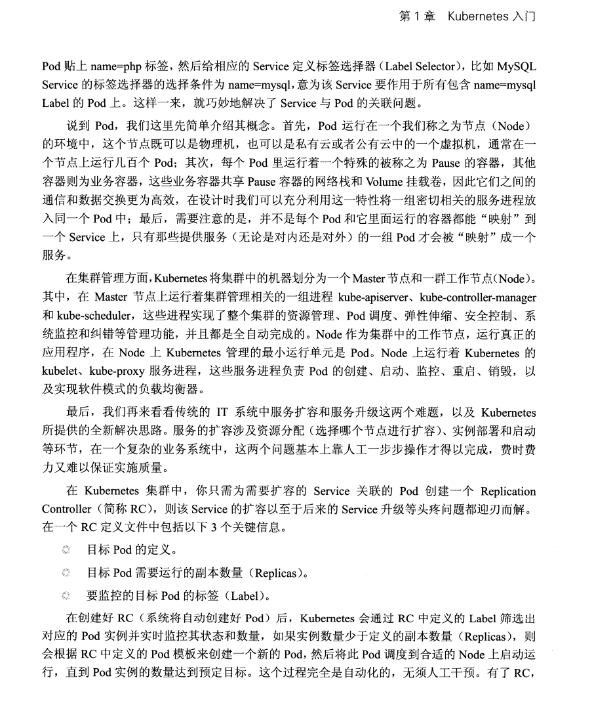

# 大数据与分布式

## 常用的分布式协议与理论

## Kubernetes

### 入门

    
    
    
      k8s基础知识

## 分布式操作系统

### 概述

#### 什么是分布式操作系统

是一些独立的计算机的组合，但是对于该系统的用户来说，系统就像一台计算机一样

##### 分布式操作系统相对于集中式操作系统的优点

| 项目         | 描述                                       |
| ------------ | ------------------------------------------ |
| 经济         | 微处理机提供了比大型主机更好的性价比       |
| 速度         | 分布式系统总的计算能力比单个大型主机的更强 |
| 固有的分布性 | 一些应用设计到空间上分散的机器             |
| 可靠性       | 如果一台机器崩溃，整个系统还可以运转       |
| 渐增         | 计算能力可以逐渐有所增加                   |

##### 分布式系统相对于孤立的（个人）计算机的优点

| 项目     | 描述                                           |
| -------- | ---------------------------------------------- |
| 数据共享 | 允许多个用户访问一个公共的数据库               |
| 设备共享 | 允许多个用户共享昂贵的外围设备（如彩色打印机） |
| 通信     | 使得人们之间的通信更加容易，如通过电子邮件     |
| 灵活性   | 用最有效的方式将工作负荷分配到可用的机器上     |

    
      并行及分布式计算机系统分类法

