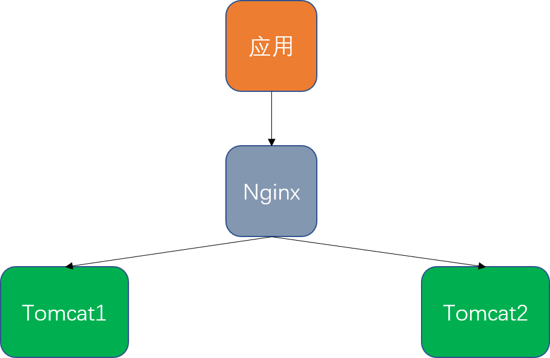
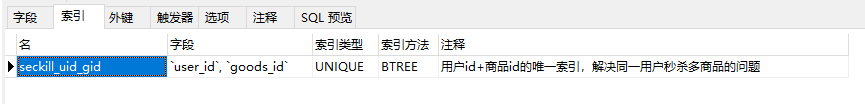

# [秒杀系统](https://www.bilibili.com/video/BV1sf4y1L7KE)


## 技术点与实施方案

<div align='center'>
    
	</br></br>秒杀系统技术点与方案
</div>


### 技术点总结

#### 前端

- Thymeleaf
	- 与html搭配实现动态页面（类似html+jsp）
	- 使用简单，只需创建Controller然后在resources/templates下创建对应的html即可
	- Thymeleaf页面跳转需要通过Controller来跳转，不能直接通过html，否则会出错
- Bootstrap
- Jqueryy

#### 后端

- SpringBoot

- MybaitsPlus（基于Mybaits封装）

- Lombok（注解）

#### 中间件

- RabbitMQ（异步 流量均分）

- Redis（缓存、数据库、消息中间件）

### 秒杀方案

- 功能开发
	- 商品列表
	- 商品详情
	- 秒杀
	- 订单详情
- 分布式Session
	- 用户登陆
	- 共享Session
- 压力测试
	- JMeter入门
	- 自定义变量
	- 正式压测
- 页面优化
	- 缓存
	- 静态化分离
- 服务优化
	- RabbitMQ消息队列
	- 接口优化
	- 分布式锁
- 接口安全
	- 隐藏秒杀地址
	- 验证码
	- 接口限流

### 如何设计一个秒杀系统

稳（高性能）、准（一致性）、快（高可用）

- 高性能。涉及大量并发读、写，支持高并发访问非常关键。

- 一致性。商品库存的实现方式同样关键。

- 高可用。难免会遇到考虑不到的情况，要保证系统的高可用性和准确性。

## 项目实施

### 项目搭建

- IDEA创建Spring项目
-  pom.xml 添加依赖  
- 设置配置文件
- 测试能够运行


### 公共结果返回对象

RespBeanEnum.java

```java
package tech.snnukf.seckillsys.vo;

import lombok.AllArgsConstructor;
import lombok.ToString;
import lombok.Getter;

/**
 * 返回状态枚举
 * @author simple.jbx
 * @email jb.xue@qq.com
 * @github https://github.com/simple-jbx
 * @ClassName RespBeanEnum
 * @description:
 * @date 2021年10月01日 15:22
 */
@ToString
@Getter
@AllArgsConstructor
public enum RespBeanEnum {
    //通用
    SUCCESS(200, "SUCCESS"),
    ERROR(500, "服务端异常"),

    //登陆模块 5002xx
    LOGIN_ERROR(500210, "用户名或密码不正确"),
    MOBILE_ERROR(500211, "手机号码格式不正确"),
    MOBILE_NOT_EXIST(500212, "手机号码不存在"),
    BIND_ERROR(500213, "参数校验异常"),
    PASSWORD_UPDATE_FAIL(500214, "密码更新失败"),
    SESSION_ERROR(500215, "用户不存在"),

    //秒杀模块 5005xx
    EMPTY_STOCK(500500, "库存不足"),
    REPEATE_ERROR(500501, "该商品每个人限购一件"),
    SECKILL_ERROR(500502, "抢购失败，请重试"),
    REQUEST_ILLEGAL(500503, "请求非法，请重试"),
    ERROR_CAPTCHA(500504, "验证码错误，请重新输入"),
    ACCESS_LIMIT_REACHED(500505, "访问过于频繁，请稍后再试"),


    //订单模块5003xx
    ORDER_NOT_EXIST(500300, "订单信息不存在"),
    ;

    private final Integer code;
    private final String message;
}

```

RespBean.java 返回结果对象

```java
package tech.snnukf.seckillsys.vo;

import lombok.*;

/**
 * 返回结果对象
 * @author jb.xue@qq.com https://github.com/simple-jbx
 * @ClassName RespBean
 * @description: 公共返回对象枚举
 * @date 2021年10月01日 11:06
 */
@Data
@NoArgsConstructor
@AllArgsConstructor
public class RespBean {
    private long code;
    private String message;
    private Object obj;

    /**
     * @author simple.jbx https://github.com/simple-jbx
     * @description success result
     * @date 15:24 2021/10/1
     * @param
     * @return tech.snnukf.seckillsys.vo.RespBean
     **/
    public static RespBean success() {
        return new RespBean(RespBeanEnum.SUCCESS.getCode(), RespBeanEnum.SUCCESS.getMessage(), null);
    }

    public static RespBean success(Object obj) {
        return new RespBean(RespBeanEnum.SUCCESS.getCode(), RespBeanEnum.SUCCESS.getMessage(), obj);
    }

    /**
     * @author simple.jbx
     * @email jb.xue@qq.com
     * @github https://github.com/simple-jbx     * @description 失败返回结果
     * @date 15:27 2021/10/1
     * @param	respBeanEnum
     * @return tech.snnukf.seckillsys.vo.RespBean
     **/
    public static RespBean error(RespBeanEnum respBeanEnum) {
        return new RespBean(respBeanEnum.getCode(), respBeanEnum.getMessage(), null);
    }

    public static RespBean error(RespBeanEnum respBeanEnum, Object obj) {
        return new RespBean(respBeanEnum.getCode(), respBeanEnum.getMessage(), obj);
    }
}

```


### 用户登陆

- 密码 md5两次加密 客户端做一次加密  服务端做一次加密 双重加密，提高安全性 详见 MD5Util.java

#### 逆向工程

使用MybatisPlus提供的AutoGenerator 根据数据库创建响应类、接口 

详见generator项目

#### 登陆功能

登陆页面 -> LoginController -> UserService

##### 校验工具类

校验手机号，ValidatorUtil.java

```java
package tech.snnukf.seckillsys.utils;

import org.apache.commons.lang3.StringUtils;

import java.util.regex.Matcher;
import java.util.regex.Pattern;

/**
 * @author simple.jbx
 * @ClassName ValidatorUtil
 * @description //TODO
 * @email jb.xue@qq.com
 * @github https://github.com/simple-jbx
 * @date 2021年10月01日 16:00
 */
public class ValidatorUtil {
    private static final Pattern mobile_pattern = Pattern.compile("[1]([3-9])[0-9]{9}$");

    public static boolean isMobile(String mobile) {
        if(StringUtils.isEmpty(mobile)) {
            return false;
        }

        Matcher matcher = mobile_pattern.matcher(mobile);
        return matcher.matches();
    }
}

```

##### LoginController

```java
package tech.snnukf.seckillsys.controller;

import lombok.extern.slf4j.Slf4j;
import org.springframework.beans.factory.annotation.Autowired;
import org.springframework.stereotype.Controller;
import org.springframework.web.bind.annotation.RequestMapping;
import org.springframework.web.bind.annotation.ResponseBody;
import tech.snnukf.seckillsys.service.IUserService;
import tech.snnukf.seckillsys.vo.LoginVo;
import tech.snnukf.seckillsys.vo.RespBean;

import javax.servlet.http.HttpServletRequest;
import javax.servlet.http.HttpServletResponse;
import javax.validation.Valid;

/**
 * @author simple.jbx
 * @ClassName LoginController
 * @description:
 * @date 2021年09月30日 16:04
 */
@Controller
@RequestMapping("/login")
@Slf4j
public class LoginController {

    @Autowired
    private IUserService userService;

    /**
     * @author simple.jbx
     * @email jb.xue@qq.com
     * @github https://github.com/simple-jbx
     * @description 跳转登陆页面
     * @date 16:06 2021/9/30
     * @param		
     * @return String
     **/
    @RequestMapping("/toLogin")
    public String toLogin() {
        return "login";
    }

    /**
     * @author simple.jbx
     * @description 登陆功能
     * @date 15:40 2021/10/1
     * @param	loginVo	
     * @return tech.snnukf.seckillsys.vo.RespBean
     **/
    @RequestMapping("/doLogin")
    @ResponseBody
    public RespBean doLogin(@Valid LoginVo loginVo, HttpServletRequest request, HttpServletResponse response) {
        return userService.doLogin(loginVo, request, response);
    }
}

```

##### 登陆Service

IUserService.java & UserService.java

```java
package tech.snnukf.seckillsys.service;

import tech.snnukf.seckillsys.pojo.User;
import com.baomidou.mybatisplus.extension.service.IService;
import tech.snnukf.seckillsys.vo.RespBean;
import tech.snnukf.seckillsys.vo.LoginVo;

import javax.servlet.http.HttpServletRequest;
import javax.servlet.http.HttpServletResponse;

/**
 * <p>
 *  服务类
 * </p>
 *
 * @author simple.jbx
 * @email jb.xue@qq.com
 * @github https://github.com/simple-jbx
 * */
public interface IUserService extends IService<User> {

    /**
     * @return tech.snnukf.seckillsys.vo.RespBean
     * @author simple.jbx
     * @description Login
     * @date 15:48 2021/10/1
     * @param    loginVo
     * @param request
     * @param response
     **/
    RespBean doLogin(LoginVo loginVo, HttpServletRequest request, HttpServletResponse response);


    /**
     * @author simple.jbx
     * @description 根据Cookie获取用户
     * @date 15:14 2021/11/25
     * @param	userTicket
     * @param	request
     * @param	response
     * @return tech.snnukf.seckillsys.pojo.User
     **/
    User getUserByCookie(String userTicket, HttpServletRequest request, HttpServletResponse response);


    /**
     * @author simple.jbx
     * @description 更新密码
     * @date 16:22 2021/10/30
     * @param	userTicket
     * @param	password
     * @return tech.snnukf.seckillsys.vo.RespBean
     **/
    RespBean updatePassword(String userTicket, String password, HttpServletRequest request,
                            HttpServletResponse response);
}

```

##### 登陆页面

login.html

#### 参数校验

在每个需要校验参数的地方写校验代码会比较麻烦，使用validation组件设置校验模板，然后根据自定义注解来进行参数校验

##### 自定义注解参数校验

```java
package tech.snnukf.seckillsys.validator;

import tech.snnukf.seckillsys.vo.IsMobileValidator;

/**
 * @author simple.jbx
 * @ClassName isMobile
 * @description 验证手机号
 * @email jb.xue@qq.com
 * @github https://github.com/simple-jbx
 * @date 2021年10月07日 15:02
 */
@java.lang.annotation.Target({java.lang.annotation.ElementType.METHOD, java.lang.annotation.ElementType.FIELD,
        java.lang.annotation.ElementType.ANNOTATION_TYPE, java.lang.annotation.ElementType.CONSTRUCTOR,
        java.lang.annotation.ElementType.PARAMETER, java.lang.annotation.ElementType.TYPE_USE})
@java.lang.annotation.Retention(java.lang.annotation.RetentionPolicy.RUNTIME)
@java.lang.annotation.Documented
@javax.validation.Constraint(validatedBy = {IsMobileValidator.class})
public @interface IsMobile {

    boolean required() default true;

    java.lang.String message() default "手机号码格式错误";

    java.lang.Class<?>[] groups() default {};

    java.lang.Class<? extends javax.validation.Payload>[] payload() default {};

    @java.lang.annotation.Target({java.lang.annotation.ElementType.METHOD,
            java.lang.annotation.ElementType.FIELD, java.lang.annotation.ElementType.ANNOTATION_TYPE,
            java.lang.annotation.ElementType.CONSTRUCTOR, java.lang.annotation.ElementType.PARAMETER,
            java.lang.annotation.ElementType.TYPE_USE})
    @java.lang.annotation.Retention(java.lang.annotation.RetentionPolicy.RUNTIME)
    @java.lang.annotation.Documented
    static @interface List {
        javax.validation.constraints.NotNull[] value();
    }
}
```

这样只需要在需要验证的类对应的属性上加上注解就可以了，LoginVo

```java
package tech.snnukf.seckillsys.vo;

import lombok.Data;
import org.hibernate.validator.constraints.Length;
import tech.snnukf.seckillsys.validator.IsMobile;

import javax.validation.constraints.NotNull;

/**
 * @author simple.jbx
 * @ClassName LoginVo
 * @description //TODO
 * @email jb.xue@qq.com
 * @github https://github.com/simple-jbx
 * @date 2021年10月01日 15:39
 */
@Data
public class LoginVo `{
    @NotNull
    @IsMobile
    private String mobile;

    @NotNull
    @Length(min=32)
    private String password;
}

```

然后对需要验证的对象前加@Valid注解即可

```java
/**
 * @author simple.jbx
 * @description 登陆功能
 * @date 15:40 2021/10/1
 * @param	loginVo	
 * @return tech.snnukf.seckillsys.vo.RespBean
 **/
@RequestMapping("/doLogin")
@ResponseBody
public RespBean doLogin(@Valid LoginVo loginVo, HttpServletRequest request, HttpServletResponse response) {
    return userService.doLogin(loginVo, request, response);
}
```
### 异常处理

SpringBoot全局异常处理方式主要有两种：

- 使用@ControllerAdvice和@ExceptionHandler注解
- 使用ErrorController类来实现

这两种方式的主要区别：

- @ControllerAdvice方式只能处理控制器抛出的异常，此时请求已经进入控制器中。
- ErrorController类方式可以处理所有的异常，包括未进入控制器的异常，比如404、401等错误。
- 如果两者同时存在，则@ControllerAdvice方式处理控制器抛出的异常，ErrorController类方式处理未进入控制器的异常。
- @ControllerAdvice方式可以定义多个拦截方法，拦截不同的异常类，并且可以获取抛出异常的信息，自由度更大。

秒杀系统中使用的是ControllerAdvice方式。

```java
package tech.snnukf.seckillsys.exception;

import lombok.AllArgsConstructor;
import lombok.Data;
import lombok.NoArgsConstructor;
import tech.snnukf.seckillsys.vo.RespBeanEnum;

/**
 * @author simple.jbx
 * @ClassName GlobalException
 * @description 全局异常
 * @email jb.xue@qq.com
 * @github https://github.com/simple-jbx
 * @date 2021年10月07日 15:30
 */
@Data
@NoArgsConstructor
@AllArgsConstructor
public class GlobalException extends RuntimeException{
    private RespBeanEnum respBeanEnum;
}

```

```java
package tech.snnukf.seckillsys.exception;

import org.springframework.validation.BindException;
import org.springframework.web.bind.annotation.ExceptionHandler;
import org.springframework.web.bind.annotation.RestControllerAdvice;
import tech.snnukf.seckillsys.vo.RespBean;
import tech.snnukf.seckillsys.vo.RespBeanEnum;


/**
 * @author simple.jbx
 * @ClassName GlobalExceptionHandler
 * @description //TODO
 * @email jb.xue@qq.com
 * @github https://github.com/simple-jbx
 * @date 2021年10月07日 15:32
 */
@RestControllerAdvice
public class GlobalExceptionHandler {

    @ExceptionHandler(Exception.class)
    public RespBean ExceptionHandler(Exception e) {
        if(e instanceof GlobalException) {
            GlobalException ex = (GlobalException) e;
            return RespBean.error(ex.getRespBeanEnum());
        } else if(e instanceof BindException) {
            BindException ex = (BindException) e;
            RespBean respBean = RespBean.error(RespBeanEnum.BIND_ERROR);
            respBean.setMessage("参数异常：" + ex.getBindingResult().getAllErrors().get(0).getDefaultMessage());
            return respBean;
        }
        return RespBean.error(RespBeanEnum.ERROR);
    }
}
```


### 完善登陆功能

#### 使用Session和Cookie保存登陆用户信息。

Session存储在服务端，存储信息比较多。

Cookie存储在客户端，存储信息有限。

#### 分布式Session解决同步问题

实际项目可能部署在多个服务器上，配合Nginx的时候会出现登陆问题。由于Nginx默认使用负载均衡策略（轮询），请求将会按照时间顺序逐一分发到后端应用上。

<div align='center'>
    
</div>


##### 解决方案

###### Session复制

- 优点
	- 无需修改代码，只需修改Tomcat配置
- 缺点
	- Session同步传输占用内网带宽
	- 多台Tomcat同步性能指数级下降
	- Session占用内存，无法有效水平扩展

###### 前端存储

- 优点
	- 不占服务端内存
- 缺点
	- 存在安全风险
	- 数据大小收Cookie限制
	- 占用外网带宽

###### Session粘滞

- 优点
	- 无需修改代码
	- 服务端可水平扩展
- 缺点
	- 增加新机器，会重新Hash，导致重新登陆
	- 应用重启，会重新登陆

###### 后端集中存储

- 优点
	- 安全
	- 容易水平扩展
- 缺点
	- 增加复杂度
	- 需要修改代码

###### Spring Session + Redis实现分布式session

这种方式无需修改代码，session会存储在redis上，好处是无需修改代码，不好的地方时，由于redis是key-value结构无法定制value信息。

添加依赖

```xml
 <!--spring data redis 依赖-->
        <dependency>
            <groupId>org.springframework.boot</groupId>
            <artifactId>spring-boot-starter-data-redis</artifactId>
        </dependency>

        <!--commons-pool2 对象池依赖-->
        <dependency>
            <groupId>org.apache.commons</groupId>
            <artifactId>commons-pool2</artifactId>
        </dependency>

        <!--spring session依赖-->
        <dependency>
            <groupId>org.springframework.session</groupId>
            <artifactId>spring-session-data-redis</artifactId>
        </dependency>
```

添加配置

```yml
spring:
  #  thymelaef 配置
  thymeleaf:
    cache: false

  #redis 配置
  redis:
  #服务器地址
    host: 192.168.152.130
    port: 6379
    #数据库
    database: 0
    #超时时间
    timeout: 10000ms
    lettuce:
      pool:
      #最大连接数
        max-active : 8
        #最大连接阻塞等待时间，默认-1
        max-wait: 10000ms
        #最大空闲连接，默认8
        max-idle: 200
        #最小空闲连接，默认0
        min-idle: 5
```

###### 单独使用Redis实现

单独使用Redis，可以将定制的信息（用户信息）存入Redis中。

Redis配置类，当往Redis中存储数据中时，对数据进行序列化，key->String, value->json。

序列化依赖JsonUtil.java，对象与json字符串相互转换。

```java
package tech.snnukf.seckillsys.config;

import org.springframework.context.annotation.Bean;
import org.springframework.context.annotation.Configuration;
import org.springframework.core.io.ClassPathResource;
import org.springframework.data.redis.connection.RedisConnectionFactory;
import org.springframework.data.redis.core.RedisTemplate;
import org.springframework.data.redis.core.script.DefaultRedisScript;
import org.springframework.data.redis.serializer.GenericJackson2JsonRedisSerializer;
import org.springframework.data.redis.serializer.StringRedisSerializer;

/**
 * @author simple.jbx
 * @ClassName RedisConfig
 * @description Redis配置类
 * @email jb.xue@qq.com
 * @github https://github.com/simple-jbx
 * @date 2021年10月08日 17:09
 */
@Configuration
public class RedisConfig {

    @Bean
    public RedisTemplate<String, Object> redisTemplate(RedisConnectionFactory redisConnectionFactory) {
        RedisTemplate<String, Object> redisTemplate = new RedisTemplate<>();
        //key Serializer
        redisTemplate.setKeySerializer(new StringRedisSerializer());
        //value Serializer
        redisTemplate.setValueSerializer(new GenericJackson2JsonRedisSerializer());
        //hash type key serializer
        redisTemplate.setHashKeySerializer(new StringRedisSerializer());
        //hash type value serializer
        redisTemplate.setHashValueSerializer(new GenericJackson2JsonRedisSerializer());

        //注入连接工厂
        redisTemplate.setConnectionFactory(redisConnectionFactory);
        return redisTemplate;
    }

    @Bean
    public DefaultRedisScript<Long> script() {
        DefaultRedisScript<Long> redisScript = new DefaultRedisScript<>();

        //lock.lua 脚本位置和application.yml同级目录
        redisScript.setLocation(new ClassPathResource("stock.lua"));
        redisScript.setResultType(Long.class);
        return redisScript;
    }
}

```


#### 优化登陆

这样当参数中需要User是可以自动获取

UserArgumentResolver.java

```java
package tech.snnukf.seckillsys.config;

import lombok.extern.slf4j.Slf4j;
import org.apache.commons.lang3.StringUtils;
import org.springframework.beans.factory.annotation.Autowired;
import org.springframework.core.MethodParameter;
import org.springframework.stereotype.Component;
import org.springframework.web.bind.support.WebDataBinderFactory;
import org.springframework.web.context.request.NativeWebRequest;
import org.springframework.web.method.support.HandlerMethodArgumentResolver;
import org.springframework.web.method.support.ModelAndViewContainer;
import tech.snnukf.seckillsys.pojo.User;
import tech.snnukf.seckillsys.service.IUserService;
import tech.snnukf.seckillsys.utils.CookieUtil;

import javax.servlet.http.HttpServletRequest;
import javax.servlet.http.HttpServletResponse;

/**
 * @author simple.jbx
 * @ClassName UserArgumentResolve
 * @description 用户自定义参数
 * @email jb.xue@qq.com
 * @github https://github.com/simple-jbx
 * @date 2021年10月08日 19:46
 */
@Component
@Slf4j
public class UserArgumentResolve implements HandlerMethodArgumentResolver {
    @Autowired
    private IUserService userService;

    @Override
    public boolean supportsParameter(MethodParameter parameter) {
        Class<?> clazz = parameter.getParameterType();
        return clazz == User.class;
    }

    @Override
    public Object resolveArgument(MethodParameter parameter, ModelAndViewContainer mavContainer,
                                  NativeWebRequest webRequest, WebDataBinderFactory binderFactory) throws Exception {
        HttpServletRequest request =
                webRequest.getNativeRequest(HttpServletRequest.class);
        HttpServletResponse response =
                webRequest.getNativeResponse(HttpServletResponse.class);
        String ticket = CookieUtil.getCookieValue(request, "userTicket");
        if (StringUtils.isEmpty(ticket)) {
            return null;
        }

        return userService.getUserByCookie(ticket, request, response);
    }
}
```

WebConfig.java

```java
package tech.snnukf.seckillsys.config;

import org.springframework.beans.factory.annotation.Autowired;
import org.springframework.context.annotation.Configuration;
import org.springframework.web.method.support.HandlerMethodArgumentResolver;
import org.springframework.web.servlet.config.annotation.EnableWebMvc;
import org.springframework.web.servlet.config.annotation.InterceptorRegistry;
import org.springframework.web.servlet.config.annotation.ResourceHandlerRegistry;
import org.springframework.web.servlet.config.annotation.WebMvcConfigurer;

import java.util.List;

/**
 * @author simple.jbx
 * @ClassName WebConfig
 * @description MVC Config
 * @email jb.xue@qq.com
 * @github https://github.com/simple-jbx
 * @date 2021年10月08日 19:43
 */
@Configuration
@EnableWebMvc
public class WebConfig implements WebMvcConfigurer {
    @Autowired
    private UserArgumentResolve userArgumentResolve;

    @Autowired
    private AccessLimitInterceptor accessLimitInterceptor;

    @Override
    public void addArgumentResolvers(List<HandlerMethodArgumentResolver> resolvers) {
        resolvers.add(userArgumentResolve);
    }
    
    //将静态资源放在/static目录下，如果无法访问则需要修改配置
    @Override
    public void addResourceHandlers(ResourceHandlerRegistry registry) {
        registry.addResourceHandler("/**").addResourceLocations("classpath:/static/");
    }

    @Override
    public void addInterceptors(InterceptorRegistry registry) {
        registry.addInterceptor(accessLimitInterceptor);
    }
}
```

### 秒杀功能

#### 商品列表页

##### 用逆向工程生成所需的类

##### 自定义其他所需的类

###### GoodsVo

同时查询商品表和秒杀商品表的返回对象

```java
package tech.snnukf.seckillsys.vo;

import lombok.AllArgsConstructor;
import lombok.Data;
import lombok.NoArgsConstructor;
import tech.snnukf.seckillsys.pojo.Goods;

import java.math.BigDecimal;
import java.util.Date;

/**
 * @author simple.jbx
 * @ClassName GoodsVo
 * @description 商品返回对象
 * @email jb.xue@qq.com
 * @github https://github.com/simple-jbx
 * @date 2021年10月11日 12:20
 */
@Data
@NoArgsConstructor
@AllArgsConstructor
public class GoodsVo extends Goods {
    private Integer stockCount;

    private BigDecimal seckillPrice;

    private Date startDate;

    private Date endDate;
}

```

###### GoodsMapper

- GoodsMapper.java

```java
javapackage tech.snnukf.seckillsys.mapper;

import com.baomidou.mybatisplus.core.mapper.BaseMapper;
import tech.snnukf.seckillsys.pojo.Goods;
import tech.snnukf.seckillsys.vo.GoodsVo;

import java.util.List;

/**
 * <p>
 *  Mapper 接口
 * </p>
 *
 * @author simple.jbx
 */
public interface GoodsMapper extends BaseMapper<Goods> {

    /**
     * @author simple.jbx
     * @description 获取商品列表
     * @date 15:20 2021/10/12
     * @param  
     * @return java.util.List<tech.snnukf.seckillsys.vo.GoodsVo>
     **/
    List<GoodsVo> findGoodsVo();

    /**
     * @author simple.jbx
     * @description 获取商品详情
     * @date 15:14 2021/10/12
     * @param
     * @return java.lang.String
     **/
    GoodsVo findGoodsVoByGoodsId(Long goodsId);
}
```

- GoodsMapper.xml

```java
<?xml version="1.0" encoding="UTF-8"?>
<!DOCTYPE mapper PUBLIC "-//mybatis.org//DTD Mapper 3.0//EN" "http://mybatis.org/dtd/mybatis-3-mapper.dtd">
<mapper namespace="tech.snnukf.seckillsys.mapper.GoodsMapper">

    <!-- 通用查询映射结果 -->
    <resultMap id="BaseResultMap" type="tech.snnukf.seckillsys.pojo.Goods">
        <id column="id" property="id" />
        <result column="goods_name" property="goodsName" />
        <result column="goods_title" property="goodsTitle" />
        <result column="goods_img" property="goodsImg" />
        <result column="goods_detail" property="goodsDetail" />
        <result column="goods_price" property="goodsPrice" />
        <result column="goods_stock" property="goodsStock" />
    </resultMap>

    <!-- 通用查询结果列 -->
    <sql id="Base_Column_List">
        id, goods_name, goods_title, goods_img, goods_detail, goods_price, goods_stock
    </sql>

    <!--获取商品列表-->
    <select id = "findGoodsVo" resultType="tech.snnukf.seckillsys.vo.GoodsVo">
        select
            g.id,
            g.goods_name,
            g.goods_title,
            g.goods_img,
            g.goods_detail,
            g.goods_price,
            g.goods_stock,
            sg.seckill_price,
            sg.stock_count,
            sg.start_date,
            sg.end_date
        from
            t_goods g
                left join t_seckill_goods as sg on g.id = sg.goods_id
    </select>

    <!--获取商品详情-->
    <select id="findGoodsVoByGoodsId" resultType="tech.snnukf.seckillsys.vo.GoodsVo">
        SELECT
            g.id,
            g.goods_name,
            g.goods_title,
            g.goods_img,
            g.goods_detail,
            g.goods_price,
            g.goods_stock,
            sg.seckill_price,
            sg.stock_count,
            sg.start_date,
            sg.end_date
        FROM
            t_goods g
                LEFT JOIN t_seckill_goods AS sg ON g.id = sg.goods_id
        WHERE
            g.id=#{goodsId}
    </select>
</mapper>

```

###### GoodsService

- IGoodService.java

```java
package tech.snnukf.seckillsys.service;

import com.baomidou.mybatisplus.extension.service.IService;
import org.springframework.stereotype.Service;
import tech.snnukf.seckillsys.pojo.Goods;
import tech.snnukf.seckillsys.vo.GoodsVo;

import java.util.List;

/**
 * <p>
 *  服务类
 * </p>
 *
 * @author simple.jbx
 */
public interface IGoodsService extends IService<Goods> {

    /**
     * @author simple.jbx
     * @description 获取商品列表
     * @date 12:24 2021/10/11
     * @param	
     * @return java.util.List<tech.snnukf.seckillsys.vo.GoodsVo>
     **/
    List<GoodsVo> findGoodsVo();

    /**
     * @author simple.jbx
     * @description 获取商品详情
     * @date 15:14 2021/10/12
     * @param	goodsId
     * @return java.lang.String
     **/
    GoodsVo findGoodsVoByGoodsId(Long goodsId);
}
```

- GoodsSeviceImpl.java

```java
package tech.snnukf.seckillsys.service.impl;

import com.baomidou.mybatisplus.extension.service.impl.ServiceImpl;
import org.springframework.beans.factory.annotation.Autowired;
import org.springframework.stereotype.Service;
import tech.snnukf.seckillsys.mapper.GoodsMapper;
import tech.snnukf.seckillsys.pojo.Goods;
import tech.snnukf.seckillsys.service.IGoodsService;
import tech.snnukf.seckillsys.vo.GoodsVo;

import java.util.List;

/**
 * <p>
 *  服务实现类
 * </p>
 *
 * @author simple.jbx
 */
@Service
public class GoodsServiceImpl extends ServiceImpl<GoodsMapper, Goods> implements IGoodsService {

    @Autowired
    private GoodsMapper goodMapper;

    @Override
    public List<GoodsVo> findGoodsVo() {
        return goodMapper.findGoodsVo();
    }

    /**
     * @author simple.jbx
     * @description 获取商品详情
     * @date 15:12 2021/10/12
     * @param	goodsId
     * @return java.lang.String
     **/
    @Override
    public GoodsVo findGoodsVoByGoodsId(Long goodsId) {
        return goodMapper.findGoodsVoByGoodsId(goodsId);
    }
}
```

###### GoodsController

- GoodsController.java

```java
package tech.snnukf.seckillsys.controller;

import lombok.extern.slf4j.Slf4j;
import org.apache.commons.lang3.StringUtils;
import org.springframework.beans.factory.annotation.Autowired;
import org.springframework.data.redis.core.RedisTemplate;
import org.springframework.data.redis.core.ValueOperations;
import org.springframework.http.StreamingHttpOutputMessage;
import org.springframework.stereotype.Controller;
import org.springframework.ui.Model;
import org.springframework.web.bind.annotation.CookieValue;
import org.springframework.web.bind.annotation.PathVariable;
import org.springframework.web.bind.annotation.RequestMapping;
import org.springframework.web.bind.annotation.ResponseBody;
import org.thymeleaf.context.WebContext;
import org.thymeleaf.spring5.view.ThymeleafViewResolver;
import tech.snnukf.seckillsys.config.UserContext;
import tech.snnukf.seckillsys.pojo.User;
import tech.snnukf.seckillsys.service.IGoodsService;
import tech.snnukf.seckillsys.service.IUserService;
import tech.snnukf.seckillsys.vo.DetailVo;
import tech.snnukf.seckillsys.vo.GoodsVo;
import tech.snnukf.seckillsys.vo.RespBean;

import javax.servlet.http.HttpServletRequest;
import javax.servlet.http.HttpServletResponse;
import javax.servlet.http.HttpSession;
import javax.xml.crypto.Data;
import java.util.Date;
import java.util.concurrent.TimeUnit;

/**
 * @author simple.jbx
 * @ClassName GoodsController
 * windows 优化前 QPS 500-600(测三次)
 *         Redis缓存后 1700-2000
 * Linux 优化前 QPS 2491-3200(测三次)
 *          Redis缓存后 2900-6000
 * @description //TODO
 * @email jb.xue@qq.com
 * @github https://github.com/simple-jbx
 * @date 2021年10月07日 17:36
 */
@Slf4j
@Controller
@RequestMapping("/goods")
public class GoodsController {

    @Autowired
    private IUserService userService;

    @Autowired
    private IGoodsService goodsService;

    @Autowired
    private RedisTemplate redisTemplate;

    @Autowired
    ThymeleafViewResolver thymeleafViewResolver;

    @RequestMapping(value = "/toList", produces = "text/html;charset=utf-8")
    @ResponseBody
    public String toList(Model model, User user, HttpServletRequest request,
                         HttpServletResponse response) {

        //Redis中获取页面，如果不为空，直接返回页面
        ValueOperations valueOperations = redisTemplate.opsForValue();
        String html = (String)valueOperations.get("goodsList");
        if(!StringUtils.isEmpty(html)) {
            return html;
        }

        log.info("toList ==> " + user);
        model.addAttribute("user", user);
        model.addAttribute("goodsList", goodsService.findGoodsVo());

        //Redis中无缓存 手动渲染
        WebContext webContext= new WebContext(request, response,
                request.getServletContext(),
                request.getLocale(), model.asMap());
        html = thymeleafViewResolver.getTemplateEngine().process("goodsList", webContext);
        if(!StringUtils.isEmpty(html)) {
            valueOperations.set("goodsList", html, 60, TimeUnit.SECONDS);
        }
        return html;
    }


    @RequestMapping(value = "/toDetail/{goodsId}")
    @ResponseBody
    public RespBean toDetail(User user, @PathVariable Long goodsId) {

        GoodsVo goodsVo = goodsService.findGoodsVoByGoodsId(goodsId);
        Date startDate = goodsVo.getStartDate();
        Date endDate = goodsVo.getEndDate();
        Date nowDate = new Date();

        //seckill status
        int secKillStatus = 0;

        int remainSeconds = 0;

        //未开始
        if(nowDate.before(startDate)) {
            remainSeconds = (int)((startDate.getTime() - nowDate.getTime()) / 1000);
        }else if(nowDate.after(endDate)){
            //已结束
            secKillStatus = 2;
            remainSeconds = -1;
        } else {
            //进行中
            secKillStatus = 1;
            remainSeconds = 0;
        }

        DetailVo detailVo = new DetailVo();
        detailVo.setUser(user);
        detailVo.setGoodsVo(goodsVo);
        detailVo.setSeckillStatus(secKillStatus);
        detailVo.setRemainSeconds(remainSeconds);

        return RespBean.success(detailVo);
    }
}

```

#### 商品详情页

##### GoodsMapper

- GoodsMapper.java
- GoodsMapper.xml

##### GoodsService

- IGoodsService.java
- GoodsServiceImpl.java

##### GoodsController

- GoodsController.java
- goodsDetail.html

#### 秒杀功能实现

##### OrderService

- IOrderService.java

```java
package tech.snnukf.seckillsys.service;

import com.baomidou.mybatisplus.extension.service.IService;
import tech.snnukf.seckillsys.pojo.Order;
import tech.snnukf.seckillsys.pojo.User;
import tech.snnukf.seckillsys.vo.GoodsVo;
import tech.snnukf.seckillsys.vo.OrderDetailVo;

/**
 * <p>
 *  服务类
 * </p>
 *
 * @author simple.jbx
 */
public interface IOrderService extends IService<Order> {

    /**
     * @author simple.jbx
     * @description 秒杀
     * @date 20:02 2021/11/1
     * @param	user
     * @param	goods
     * @return tech.snnukf.seckillsys.pojo.Order
     **/
    Order seckill(User user, GoodsVo goods);

    /**
     * @author simple.jbx
     * @description 订单详情
     * @date 20:44 2021/10/30
     * @param	orderId
     * @return tech.snnukf.seckillsys.vo.OrderDetailVo
     **/
    OrderDetailVo detail(Long orderId);


    /**
     * @author simple.jbx
     * @description 获取秒杀地址
     * @date 19:51 2021/11/22
     * @param	user
     * @param	goodsId
     * @return java.lang.String
     **/
    String createPath(User user, Long goodsId);

    /**
     * @author simple.jbx
     * @description 校验秒杀地址
     * @date 19:59 2021/11/22
     * @param    user
     * @param    goodsId
     * @param path
     * @return boolean
     **/
    boolean checkPath(User user, Long goodsId, String path);

    /**
     * @author simple.jbx
     * @description 校验验证码
     * @date 20:41 2021/11/22
     * @param	user
     * @param	goodsId
     * @param	captcha
     * @return java.lang.Boolean
     **/
    Boolean chechCaptcha(User user, Long goodsId, String captcha);
}

```

- OrderServiceImpl.java

```java
package tech.snnukf.seckillsys.service.impl;

import com.baomidou.mybatisplus.core.conditions.query.QueryWrapper;
import com.baomidou.mybatisplus.core.conditions.update.UpdateWrapper;
import com.baomidou.mybatisplus.extension.service.impl.ServiceImpl;
import lombok.Data;
import lombok.EqualsAndHashCode;
import lombok.ToString;
import org.apache.commons.lang3.StringUtils;
import org.springframework.beans.factory.annotation.Autowired;
import org.springframework.data.redis.core.RedisTemplate;
import org.springframework.data.redis.core.ValueOperations;
import org.springframework.stereotype.Service;
import org.springframework.transaction.annotation.Transactional;
import tech.snnukf.seckillsys.exception.GlobalException;
import tech.snnukf.seckillsys.mapper.OrderMapper;
import tech.snnukf.seckillsys.pojo.Order;
import tech.snnukf.seckillsys.pojo.SeckillGoods;
import tech.snnukf.seckillsys.pojo.SeckillOrder;
import tech.snnukf.seckillsys.pojo.User;
import tech.snnukf.seckillsys.service.IGoodsService;
import tech.snnukf.seckillsys.service.IOrderService;
import tech.snnukf.seckillsys.service.ISeckillGoodsService;
import tech.snnukf.seckillsys.service.ISeckillOrderService;
import tech.snnukf.seckillsys.utils.MD5Util;
import tech.snnukf.seckillsys.utils.UUIDUtil;
import tech.snnukf.seckillsys.vo.GoodsVo;
import tech.snnukf.seckillsys.vo.OrderDetailVo;
import tech.snnukf.seckillsys.vo.RespBeanEnum;

import java.util.Date;
import java.util.LinkedList;
import java.util.List;
import java.util.UUID;
import java.util.concurrent.TimeUnit;

/**
 * <p>
 *  服务实现类
 * </p>
 *
 * @author simple.jbx
 */
@Service
public class OrderServiceImpl extends ServiceImpl<OrderMapper, Order> implements IOrderService {
    @Autowired
    private ISeckillOrderService seckillOrderService;

    @Autowired
    private OrderMapper orderMapper;

    @Autowired
    private ISeckillGoodsService seckillGoodsService;

    @Autowired
    private IGoodsService goodsService;

    @Autowired
    private RedisTemplate redisTemplate;

    /**
     * @author simple.jbx
     * @description 秒杀
     * @date 09:58 2021/10/17
     * @param	user
     * @param	goods
     * @return tech.snnukf.seckillsys.pojo.Order
     **/
    @Transactional
    @Override
    public Order seckill(User user, GoodsVo goods) {

        ValueOperations valueOperations = redisTemplate.opsForValue();

        //秒杀商品减库存
        SeckillGoods seckillGoods = seckillGoodsService.getOne(new QueryWrapper<SeckillGoods>()
            .eq("goods_id", goods.getId()));
        seckillGoods.setStockCount(seckillGoods.getStockCount() - 1);
        boolean seckillGoodsResult = seckillGoodsService.update(new UpdateWrapper<SeckillGoods>()
                .setSql("stock_count = stock_count - 1").eq("goods_id", goods.getId())
                .gt("stock_count", 0));

        if(seckillGoods.getStockCount() < 1) {
            valueOperations.set("isStockEmpty:" + goods.getId(), 0);
            return null;
        }

        //生成订单
        Order order = new Order();
        order.setUserId(user.getId());
        order.setGoodsId(goods.getId());
        order.setDeliveryAddrId(0L);
        order.setGoodsName(goods.getGoodsName());
        order.setGoodsCount(1);
        order.setGoodsPrice(seckillGoods.getSeckillPrice());
        order.setOrderChannel(1);
        order.setStatus(0);
        order.setCreateDate(new Date());
        orderMapper.insert(order);

        //秒杀订单
        SeckillOrder seckillOrder= new SeckillOrder();
        seckillOrder.setUserId(user.getId());
        seckillOrder.setOrderId(order.getId());
        seckillOrder.setGoodsId(goods.getId());
        seckillOrderService.save(seckillOrder);
        redisTemplate.opsForValue().set("order:"+user.getId()+":"+goods.getId(), seckillOrder);
        return order;
    }

    /**
     * @author simple.jbx
     * @description 订单详情
     * @date 20:46 2021/10/30
     * @param	orderId
     * @return tech.snnukf.seckillsys.vo.OrderDetailVo
     **/
    @Override
    public OrderDetailVo detail(Long orderId) {
        if (orderId == null) {
            throw new GlobalException(RespBeanEnum.ORDER_NOT_EXIST);
        }
        Order order = orderMapper.selectById(orderId);
        GoodsVo goodsVo = goodsService.findGoodsVoByGoodsId(order.getGoodsId());
        OrderDetailVo detail = new OrderDetailVo();
        detail.setOrder(order);
        detail.setGoodsVo(goodsVo);
        return detail;
    }

    /**
     * @author simple.jbx
     * @description 获取秒杀地址
     * @date 19:52 2021/11/22
     * @param	user
     * @param	goodsId
     * @return java.lang.String
     **/
    @Override
    public String createPath(User user, Long goodsId) {
        String str = MD5Util.md5(UUIDUtil.uuid() + "seckill");
        redisTemplate.opsForValue().set("seckillPath:" + user.getId() + ":" + goodsId,str,
            60, TimeUnit.SECONDS);
        return str;
    }

    /**
     * @author simple.jbx
     * @description 校验秒杀地址
     * @date 20:00 2021/11/22
     * @param	user
     * @param	goodsId
     * @param	path
     * @return boolean
     **/
    @Override
    public boolean checkPath(User user, Long goodsId, String path) {
        if(user == null || goodsId < 0 || StringUtils.isEmpty(path)) {
            return false;
        }

        String redisPath = (String) redisTemplate.opsForValue().get("seckillPath:" + user.getId() +
                ":" + goodsId);
        return path.equals(redisPath);
    }

    @Override
    public Boolean chechCaptcha(User user, Long goodsId, String captcha) {
        if(user == null || goodsId < 0 || StringUtils.isEmpty(captcha)) {
            return false;
        }

        String redisCaptcha = (String) redisTemplate.opsForValue().get("captcha:" +
                user.getId() + ":" + goodsId);
        return captcha.equals(redisCaptcha);
    }
}

```

##### SeckillController

```java
package tech.snnukf.seckillsys.controller;

import com.wf.captcha.ArithmeticCaptcha;
import lombok.extern.slf4j.Slf4j;
import org.springframework.beans.factory.InitializingBean;
import org.springframework.beans.factory.annotation.Autowired;
import org.springframework.data.redis.core.RedisTemplate;
import org.springframework.data.redis.core.ValueOperations;
import org.springframework.data.redis.core.script.RedisScript;
import org.springframework.stereotype.Controller;
import org.springframework.ui.Model;
import org.springframework.util.CollectionUtils;
import org.springframework.web.bind.annotation.PathVariable;
import org.springframework.web.bind.annotation.RequestMapping;
import org.springframework.web.bind.annotation.RequestMethod;
import org.springframework.web.bind.annotation.ResponseBody;
import tech.snnukf.seckillsys.config.AccessLimit;
import tech.snnukf.seckillsys.exception.GlobalException;
import tech.snnukf.seckillsys.pojo.Order;
import tech.snnukf.seckillsys.pojo.SeckillMessage;
import tech.snnukf.seckillsys.pojo.SeckillOrder;
import tech.snnukf.seckillsys.pojo.User;
import tech.snnukf.seckillsys.rabbitmq.MQSender;
import tech.snnukf.seckillsys.service.IGoodsService;
import tech.snnukf.seckillsys.service.IOrderService;
import tech.snnukf.seckillsys.service.ISeckillOrderService;
import tech.snnukf.seckillsys.utils.JsonUtil;
import tech.snnukf.seckillsys.vo.GoodsVo;
import tech.snnukf.seckillsys.vo.RespBean;
import tech.snnukf.seckillsys.vo.RespBeanEnum;

import javax.servlet.http.HttpServletRequest;
import javax.servlet.http.HttpServletResponse;
import java.io.IOException;
import java.util.*;
import java.util.concurrent.TimeUnit;

/**
 * @author simple.jbx
 * @ClassName SecKillController
 * @description 秒杀Controller
 * Windows 优化前 QPS 800
 *         页面缓存 QPS 1400
 *         优化QPS（进一步减少数据库操作 redis判断是否重复抢购 是否没库存了） 2500
 * @email jb.xue@qq.com
 * @github https://github.com/simple-jbx
 * @date 2021/10/17/ 09:42
 */
@Slf4j
@Controller
@RequestMapping("/secKill")
public class SecKillController implements InitializingBean {

    @Autowired
    private IGoodsService goodsService;

    @Autowired
    private ISeckillOrderService seckillOrderService;

    @Autowired
    private IOrderService orderService;

    @Autowired
    private RedisTemplate redisTemplate;

    @Autowired
    private MQSender mqSender;

    @Autowired
    private RedisScript<Long> redisScript;

    private Map<Long, Boolean> EmptyStockMap = new HashMap<>();

    /**
     * @author simple.jbx
     * @description 秒杀
     * @date 09:43 2021/10/17
     * @param	user
     * @param	goodsId
     * @return java.lang.String
     **/
    @RequestMapping(value = "/{path}/doSeckill", method = RequestMethod.POST)
    @ResponseBody
    public RespBean doSeckill(@PathVariable String path, User user, Long goodsId) {
        if(user == null) {
            return RespBean.error(RespBeanEnum.SESSION_ERROR);
        }

        ValueOperations valueOperations = redisTemplate.opsForValue();

        boolean check = orderService.checkPath(user, goodsId, path);
        if(!check) {
            return RespBean.error(RespBeanEnum.REQUEST_ILLEGAL);
        }

        //判断是否重复抢购
        SeckillOrder seckillOrder = (SeckillOrder)redisTemplate.opsForValue()
                .get("order:" + user.getId() + ":" + goodsId);

        if(seckillOrder != null) {
            return RespBean.error(RespBeanEnum.REPEATE_ERROR);
        }

        //内存标记，减少Redis访问
        if(EmptyStockMap.get(goodsId)) {
            return RespBean.error(RespBeanEnum.EMPTY_STOCK);
        }

        //预减库存
        Long stock = valueOperations.decrement("seckillGoods:" + goodsId);

        if(stock < 0) {
            valueOperations.increment("seckillGoods:" + goodsId);
            EmptyStockMap.put(goodsId, true);
            return RespBean.error(RespBeanEnum.EMPTY_STOCK);
        }

        SeckillMessage seckillMessage = new SeckillMessage(user, goodsId);
        mqSender.sendSeckillMessage(JsonUtil.object2JsonStr(seckillMessage));

        return RespBean.success(0);

//        //Redis分布式锁预减库存 释放锁得时机不好把握  不如上面那个方法
//        Boolean isLock = valueOperations.setIfAbsent("lock", user.getId(),
//                50, TimeUnit.MILLISECONDS);
//
//        if(isLock) {
//            List<String> scriptKeysList = new ArrayList<>(2);
//            scriptKeysList.add("lock");
//            scriptKeysList.add("seckillGoods:" + goodsId);
//            Long stock = (Long) redisTemplate.execute(redisScript, scriptKeysList, user.getId());
//            if(stock < 0) {
//                valueOperations.increment("seckillGoods:" + goodsId);
//                EmptyStockMap.put(goodsId, true);
//                return RespBean.error(RespBeanEnum.EMPTY_STOCK);
//            }
//
//            SeckillMessage seckillMessage = new SeckillMessage(user, goodsId);
//            mqSender.sendSeckillMessage(JsonUtil.object2JsonStr(seckillMessage));
//
//            return RespBean.success(0);
//        } else {
//            return RespBean.error(RespBeanEnum.SECKILL_ERROR);
//        }


//        Order order = orderService.seckill(user, goods);


//        GoodsVo goods = goodsService.findGoodsVoByGoodsId(goodsId);
//
//        //判断库存
//        if(goods.getStockCount() < 1) {
//            return RespBean.error(RespBeanEnum.EMPTY_STOCK);
//        }


//        //判断是否重复抢购
//        SeckillOrder seckillOrder = seckillOrderService.getOne(new QueryWrapper<SeckillOrder>().eq("user_id",
//                user.getId()).eq("goods_id", goodsId));


//        Order order = orderService.seckill(user, goods);
//        System.out.println("seckill success");
//        return RespBean.success(order);
    }

    /**
     * @author simple.jbx
     * @description 系统初始化，把商品库存数量加载到Redis
     * @date 19:24 2021/11/8
     * @param
     * @return void
     **/
    @Override
    public void afterPropertiesSet() throws Exception {
        List<GoodsVo> list = goodsService.findGoodsVo();
        if(CollectionUtils.isEmpty(list)) {
            return;
        }

        list.forEach(goodsVo -> {
                    redisTemplate.opsForValue().set("seckillGoods:" + goodsVo.getId(),
                            goodsVo.getStockCount());
                    EmptyStockMap.put(goodsVo.getId(), false);
                });
    }


    /**
     * @author simple.jbx
     * @description 获取秒杀结果
     * @date 19:50 2021/11/9
     * @param	goodsId
     * @return tech.snnukf.seckillsys.vo.RespBean
     **/
    @RequestMapping(value = "/result", method = RequestMethod.GET)
    @ResponseBody
    public RespBean getResult(User user, Long goodsId) {
        if(user == null) {
            return RespBean.error(RespBeanEnum.SESSION_ERROR);
        }

        Long orderId = seckillOrderService.getResult(user, goodsId);
        return RespBean.success(orderId);
    }

    @AccessLimit(second=5, maxCount=5, needLogin=true)
    @RequestMapping(value = "/path", method = RequestMethod.GET)
    @ResponseBody
    public RespBean getPath(User user, Long goodsId, String captcha) {
        if(user == null) {
            return RespBean.error(RespBeanEnum.SESSION_ERROR);
        }

        Boolean check = orderService.chechCaptcha(user, goodsId, captcha);
        if(!check) {
            return RespBean.error(RespBeanEnum.ERROR_CAPTCHA);
        }

        String str = orderService.createPath(user, goodsId);
        return RespBean.success(str);
    }

    @RequestMapping(value = "/captcha", method = RequestMethod.GET)
    public void  verifyCode(User user, Long goodsId, HttpServletResponse response) {
        if(user == null || goodsId < 0) {
            throw new GlobalException(RespBeanEnum.REQUEST_ILLEGAL);
        }

        //设置请求头为输出图片类型
        response.setContentType("image/jpg");
        response.setHeader("Pargam", "No-cache");
        response.setHeader("Cache-Control", "no-cache");
        response.setDateHeader("Expires", 0);

        //生成验证码，将结果放入Redis
        ArithmeticCaptcha captcha = new ArithmeticCaptcha();
        redisTemplate.opsForValue().set("captcha:" + user.getId() + ":" + goodsId,
                captcha.text(), 300, TimeUnit.SECONDS);
        try {
            captcha.out(response.getOutputStream());
        } catch (IOException e) {
            log.error("验证码生成失败", e.getMessage());
        }
    }
}
```

##### 订单详情页

- OrderDetail.html

## 系统压测

### JMeter压测

创建线程组 

配置原件->HTTP默认请求 

取样器->HTTP请求

监听器->聚合报告、图形结果、表格

#### 配置不同的用户

##### 创建测试用户

UserUtil.java

```java
package tech.snnukf.seckillsys.utils;

import com.fasterxml.jackson.databind.ObjectMapper;
import com.fasterxml.jackson.databind.json.JsonMapper;
import tech.snnukf.seckillsys.pojo.User;
import tech.snnukf.seckillsys.vo.RespBean;

import javax.jws.soap.SOAPBinding;
import java.io.*;
import java.lang.reflect.Field;
import java.net.HttpURLConnection;
import java.net.URL;
import java.sql.Connection;
import java.sql.DriverManager;
import java.sql.PreparedStatement;
import java.sql.Timestamp;
import java.util.ArrayList;
import java.util.Date;
import java.util.List;

/**
 * @author simple.jbx
 * @ClassName UserUtil
 * @description 生成用户工具类
 * @email jb.xue@qq.com
 * @github https://github.com/simple-jbx
 * @date 2021/10/22/ 20:53
 */
public class UserUtil {
    private static void createUser(int count) throws Exception{
        List<User> userList = new ArrayList<>(count);

        for (int i = 0; i < count; i++) {
            User user = new User();
            user.setId(15000000000L + i);
            user.setNickname("user" + i);
            user.setSlat("a1b2c3d");
            user.setPassword(MD5Util.inputPassToDBPass("112233", user.getSlat()));
            user.setLoginCount(1);
            user.setRegisterDate(new Date());
            userList.add(user);
        }

        System.out.println("create user");
        //insert into db
        Connection conn = getConn();
        String sql = "insert into t_user(login_count, nickname, register_date, slat, password, id) " +
                "values(?,?,?,?,?,?)";
        PreparedStatement preparedStatement = conn.prepareStatement(sql);
        for (int i = 0; i < userList.size(); i++) {
            User user = userList.get(i);
            preparedStatement.setInt(1, user.getLoginCount());
            preparedStatement.setString(2, user.getNickname());
            preparedStatement.setTimestamp(3, new Timestamp(user.getRegisterDate().getTime()));
            preparedStatement.setString(4, user.getSlat());
            preparedStatement.setString(5, user.getPassword());
            preparedStatement.setLong(6, user.getId());
            preparedStatement.addBatch();
        }

        preparedStatement.executeBatch();
        preparedStatement.clearParameters();
        conn.close();
        System.out.println("insert into db");

        //create cookie
        String urlString = "http://localhost:8080/login/doLogin";
        File file = new File("F:\\Desktop\\config.txt");
        if(file.exists()) {
            file.delete();
        }

        RandomAccessFile raf = new RandomAccessFile(file, "rw");
        raf.seek(0);
        for (int i = 0; i < userList.size(); i++) {
            User user = userList.get(i);
            URL url = new URL(urlString);
            HttpURLConnection co = (HttpURLConnection) url.openConnection();
            co.setRequestMethod("POST");
            co.setDoOutput(true);
            OutputStream out= co.getOutputStream();
            String params = "mobile=" + user.getId() + "&password=" + MD5Util.inputPass2FormPass("112233");
            out.write(params.getBytes());
            out.flush();
            InputStream inputStream = co.getInputStream();
            ByteArrayOutputStream bout = new ByteArrayOutputStream();
            byte[] buff = new byte[1024];
            int len = 0;
            while ((len = inputStream.read(buff)) >= 0) {
                bout.write(buff, 0, len);
            }
            inputStream.close();
            bout.close();
            String response = new String(bout.toByteArray());
            ObjectMapper mapper = new ObjectMapper();
            RespBean respBean = mapper.readValue(response, RespBean.class);
            String userTicket = (String) respBean.getObj();
            System.out.println("create userTicket :" + user.getId());
            String row = user.getId() + "," + userTicket;
            raf.seek(raf.length());
            raf.write(row.getBytes());
            raf.write("\r\n".getBytes());
            System.out.println("write to file :" + user.getId());
        }
        raf.close();
        System.out.println("over");
    }

    private static Connection getConn() throws Exception {
        final String url = "jdbc:mysql://192.168.152.130:3306/sec_kill_sys?useUnicode=true&useSSL=false&characterEncoding=utf8";
        final String username = "root";
        final String password = "41512241";
        final String driver = "com.mysql.cj.jdbc.Driver";

        Class.forName(driver);
        return DriverManager.getConnection(url, username, password);
    }

    public static void main(String[] args) throws Exception{
        createUser(5000);
    }
}

```


## 页面优化

### 页面缓存

商品列表轻易不更换  将其缓存到redis中 提升访问速度

同样也适用于其他内容不经常更改的页面

```java
//Redis中无缓存 手动渲染
        WebContext webContext= new WebContext(request, response,
                request.getServletContext(),
                request.getLocale(), model.asMap());
        html = thymeleafViewResolver.getTemplateEngine().process("goodsList", webContext);
        if(!StringUtils.isEmpty(html)) {
            valueOperations.set("goodsList", html, 60, TimeUnit.SECONDS);
        }
```

### 对象缓存

将常用的对象缓存到redis中  例如用户User对象，但需注意，当用户信息更改时候需要删除redis中旧的缓存

### 静态资源缓存

```properties
web:
    #静态资源处理
    resources:
      cache:
        cachecontrol:
          #cache超时时间
          max-age: 3600
      chain:
        cache: true
        enabled: true
        compressed: true
```


## 页面静态化

### 商品详情页面静态化 & 秒杀静态化

商品详情变更较少，秒杀状态会变  将不变的静态化为html 剩余的用ajax调用 将原来的thymleaf动态页面转为html静态页面+ajax调用

但是在springboot中还是得通过Controller来转到html页面

秒杀的时候 通过ajax调用

```java
    @RequestMapping(value = "/toDetail/{goodsId}")
    @ResponseBody
    public RespBean toDetail(User user, @PathVariable Long goodsId) {

        GoodsVo goodsVo = goodsService.findGoodsVoByGoodsId(goodsId);
        Date startDate = goodsVo.getStartDate();
        Date endDate = goodsVo.getEndDate();
        Date nowDate = new Date();

        //seckill status
        int secKillStatus = 0;

        int remainSeconds = 0;

        //未开始
        if(nowDate.before(startDate)) {
            remainSeconds = (int)((startDate.getTime() - nowDate.getTime()) / 1000);
        }else if(nowDate.after(endDate)){
            //已结束
            secKillStatus = 2;
            remainSeconds = -1;
        } else {
            //进行中
            secKillStatus = 1;
            remainSeconds = 0;
        }

        DetailVo detailVo = new DetailVo();
        detailVo.setUser(user);
        detailVo.setGoodsVo(goodsVo);
        detailVo.setSeckillStatus(secKillStatus);
        detailVo.setRemainSeconds(remainSeconds);

        return RespBean.success(detailVo);
    }
```


## 订单详情静态化

### 订单详情静态化

与商品详情页面静态化类似 转为html+ajax调用 

## 针对库存超卖问题

在秒杀订单表中建立B树索引，使用user_id和goods_id作为索引字段，并将订单存入redis 使用redis判断是否重复抢购

<div align='center'>
    
	</br></br>创建索引防止重复抢购
</div>


在减库存的时候使用事务(@Transactional) 保证原子性

```java
	//OrderServiceImpl.java
	@Transactional
	@Override
	public Order seckill(User user, GoodsVo goods) {
		ValueOperations valueOperations = redisTemplate.opsForValue();
		//秒杀商品表减库存
		SeckillGoods seckillGoods = seckillGoodsService.getOne(new QueryWrapper<SeckillGoods>().eq("goods_id",
				goods.getId()));
		seckillGoods.setStockCount(seckillGoods.getStockCount() - 1);
		boolean result = seckillGoodsService.update(new UpdateWrapper<SeckillGoods>().setSql("stock_count = " +
				"stock_count-1").eq(
				"goods_id", goods.getId()).gt("stock_count", 0));
		if (seckillGoods.getStockCount() < 1) {
			//判断是否还有库存
			valueOperations.set("isStockEmpty:" + goods.getId(), "0");
			return null;
		}
		//生成订单
		Order order = new Order();
		order.setUserId(user.getId());
		order.setGoodsId(goods.getId());
		order.setDeliveryAddrId(0L);
		order.setGoodsName(goods.getGoodsName());
		order.setGoodsCount(1);
		order.setGoodsPrice(seckillGoods.getSeckillPrice());
		order.setOrderChannel(1);
		order.setStatus(0);
		order.setCreateDate(new Date());
		orderMapper.insert(order);
		//生成秒杀订单
		SeckillOrder seckillOrder = new SeckillOrder();
		seckillOrder.setUserId(user.getId());
		seckillOrder.setOrderId(order.getId());
		seckillOrder.setGoodsId(goods.getId());
		seckillOrderService.save(seckillOrder);
		valueOperations.set("order:" + user.getId() + ":" + goods.getId(), seckillOrder);
		return order;
	}
```

Redis中预减库存  使用decrement 也能保证原子性

```java
 /** SeckillController.java
     * @author simple.jbx
     * @description 秒杀
     * @date 09:43 2021/10/17
     * @param	user
     * @param	goodsId
     * @return java.lang.String
     **/
    @RequestMapping(value = "/{path}/doSeckill", method = RequestMethod.POST)
    @ResponseBody
    public RespBean doSeckill(@PathVariable String path, User user, Long goodsId) {
        if(user == null) {
            return RespBean.error(RespBeanEnum.SESSION_ERROR);
        }

        ValueOperations valueOperations = redisTemplate.opsForValue();

        boolean check = orderService.checkPath(user, goodsId, path);
        if(!check) {
            return RespBean.error(RespBeanEnum.REQUEST_ILLEGAL);
        }

        //判断是否重复抢购
        SeckillOrder seckillOrder = (SeckillOrder)redisTemplate.opsForValue()
                .get("order:" + user.getId() + ":" + goodsId);

        if(seckillOrder != null) {
            return RespBean.error(RespBeanEnum.REPEATE_ERROR);
        }

        //内存标记，减少Redis访问
        if(EmptyStockMap.get(goodsId)) {
            return RespBean.error(RespBeanEnum.EMPTY_STOCK);
        }

        //预减库存
        Long stock = valueOperations.decrement("seckillGoods:" + goodsId);

        if(stock < 0) {
            valueOperations.increment("seckillGoods:" + goodsId);
            EmptyStockMap.put(goodsId, true);
            return RespBean.error(RespBeanEnum.EMPTY_STOCK);
        }

        SeckillMessage seckillMessage = new SeckillMessage(user, goodsId);
        mqSender.sendSeckillMessage(JsonUtil.object2JsonStr(seckillMessage));

        return RespBean.success(0);
    }
```

## 消息队列

消息队列+ redis 减少访问数据库

安装Erlang安装rabbitmq 

配置控制台

### Fanout模式

广播模式 将受到的消息发送给所有绑定的队列

### Direct模式

单播模式

route key

### Topic模式

组播(可以实现单播也可以实现广播)

实际使用较多

通配符 * #

### Headers模式

## Redis分布式锁

需要把握加锁和释放锁的时机   加锁 如果遇到网络等问题需要及时释放锁（设置TTL） 释放锁的时候，在并发情况下有可能释放的不是自己的锁，会导致问题，因此释放锁的时候需要判断是不是自己的锁

```java
    Boolean isLock = valueOperations.setIfAbsent("lock", user.getId(),
	           50, TimeUnit.MILLISECONDS);
	if(isLock) {
        //加锁成功 执行业务代码
        
    }
```

```lua
#业务脚本 
if redis.call("get",KEYS[1]) == ARGV[1] then
    if (redis.call('exists', KEYS[2]) == 1) then
       local stock = tonumber(redis.call('get', KEYS[2]));
       if (stock > 0) then
          redis.call('incrby', KEYS[2], -1)
          return stock
       end
        return 0
    end
    return redis.call("del",KEYS[1])
else
    return 0
end
```

下面这个代码实现感觉比自己脚本实现分布式锁好一些

```java
Long stock = valueOperations.decrement("seckillGoods:" + goodsId);
```

## 安全优化

### 秒杀地址隐藏

### 验证码及校验

### 服务限流（微服务）

#### 计数器

单位时间内访问次数

一般设置为最大QPS的70%-80%

但是会存在临界问题以及浪费资源问题，即前一分钟末尾到后一分钟头部（不足单位时间内）达到最大QPS，但是宏观上单位时间内并未超过服务器所能承受的最大QPS。还有若请求都几种在某个时间段，则剩余的时间会导致服务器空闲，资源浪费。

#### 漏桶

队列 

#### 令牌桶

队列 + 令牌  可以应对大量请求

拿到令牌的请求被放行

#### 通用接口限流

ThreadLocal 线程封闭 线程私有

# 遇到问题

秒杀的时候一直在刷新无法获取结果，因为业务层生成秒杀订单的时候始终都是0L，而前端在判断数据是0L的时候回重新请求结果

解决，设置抢购中的代码为-1（这个其实不是bug，不过为了安全起见一并改了），并且修改秒杀订单的代码，将真正的秒杀订单id填入。

[字符集](https://mp.weixin.qq.com/s/X_OV4aUeJiFN9DIWMNpICA)