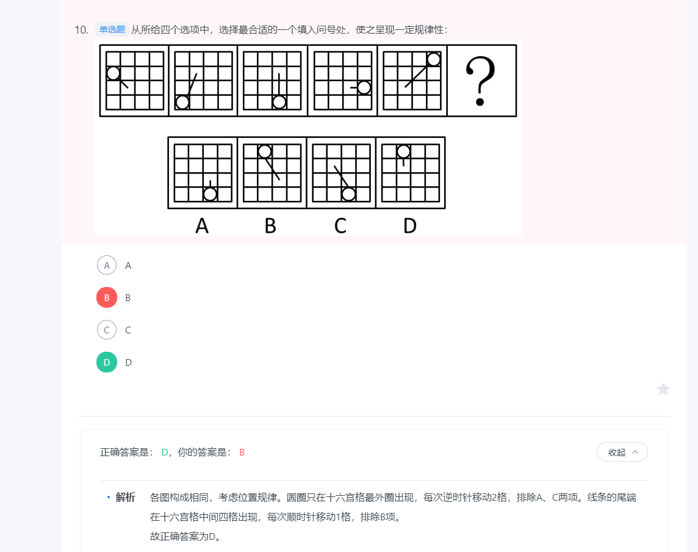

# 图形推理

## 一笔画（日/田）

[行测图推：怎么快速通过奇点判断一笔画?](https://zhuanlan.zhihu.com/p/349426540)

- 首先是连通图
- 判断奇点，奇点为0或2就属于一笔画（奇点：从一点引出的线条数为奇数）

 
    

## 数量规律、面积规律

 
    
      扇形面积 
    
      切点数 
    
      
    

## 属性规律

 
    
    

## 黑白运算

异或 和 或 与

 
    

## 位置规律

 
    

### 旋转

 
    

## 样式规律

 
    
      相邻两列黑白运算

## 特殊规律

### 图形间关系

 
    
      相邻两列黑白运算

