# 12因子

## [1. 基准代码](https://12factor.net/zh_cn/codebase)

### 一份基准代码，多份部署

## [2. 依赖](https://12factor.net/zh_cn/dependencies)

### 显式声明依赖关系

## [3. 配置](https://12factor.net/zh_cn/config)

### 在环境中存储配置

## [4. 后端服务](https://12factor.net/zh_cn/backing-services)

### 把后端服务当作附加资源

## [5. 构建，发布，运行](https://12factor.net/zh_cn/build-release-run)

### 严格分离构建和运行

## [6. 进程](https://12factor.net/zh_cn/processes)

### 以一个或多个无状态进程运行应用

## [7. 端口绑定](https://12factor.net/zh_cn/port-binding)

### 通过端口绑定提供服务

## [8. 并发](https://12factor.net/zh_cn/concurrency)

### 通过进程模型进行扩展

## [9. 易处理](https://12factor.net/zh_cn/disposability)

### 快速启动和优雅终止可最大化健壮性

## [10. 开发环境与线上环境等价](https://12factor.net/zh_cn/dev-prod-parity)

### 尽可能的保持开发，预发布，线上环境相同

## [11. 日志](https://12factor.net/zh_cn/logs)

### 把日志当作事件流

## [12. 管理进程](https://12factor.net/zh_cn/admin-processes)

### 后台管理任务当作一次性进程运行

# 云计算的三种服务模式

    
      <a href="http://c.biancheng.net/view/3787.html">云计算的 3 种服务模式</a>

## [IaaS](http://c.biancheng.net/view/3788.html)

IaaS 是“Infrastructure as a Service”的首字母缩写，意思是基础设施即服务，即把 IT 系统的基础设施层作为服务出租出去。由云服务提供商把 IT 系统的基础设施建设好，并对计算设备进行池化，然后直接对外出租硬件服务器、虚拟主机、存储或网络设施（负载均衡器、防火墙、公网IP地址及诸如 DNS 等基础服务）等。

云服务提供商负责管理机房基础设施、计算机网络、磁盘柜、服务器和虚拟机，租户自己安装和管理操作系统、数据库、中间件、应用软件和数据信息，所以 IaaS 云服务的消费者一般是掌握一定技术的系统管理员，如图所示。

    
      IaaS

## [PaaS](http://c.biancheng.net/view/3791.html)

PaaS 是“Platform as a Service”的首字母缩写，意为平台即服务，即把 IT 系统的平台软件层作为服务出租出去，如图 1 所示。

相比于 IaaS 云服务提供商，PaaS 云服务提供商要做的事情增加了，他们需要准备机房、布好网络、购买设备、安装操作系统、数据库和中间件，即把基础设施层和平台软件层都搭建好，然后在平台软件层上划分“小块”（习惯称之为容器）并对外出租。

PaaS 云服务提供商也可以从其他 IaaS 云服务提供商那里租赁计算资源，然后自己部署平台软件层。另外，为了让消费者能直接在云端开发调试程序，PaaS 云服务提供商还得安装各种开发调试工具。相反，租户要做的事情相比 IaaS 要少很多，租户只要开发和调试软件或者安装、配置和使用应用软件即可。PaaS 云服务的消费者主要包括以下人员。

- 程序开发人员：写代码、编译、调试、运行、部署、代码版本控制等，一揽子解决。
- 程序测试人员。
- 软件部署人员：把软件部署到 PaaS 云端，便于管理不同版本之间的冲突。
- 应用软件管理员：便于配置、调优和监视程序运行性能。
- 应用程序最终用户：这时 PaaS 云服务相当于 SaaS 云服务。

    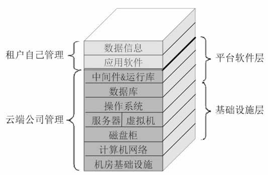
      PaaS

## [SaaS](http://c.biancheng.net/view/3792.html)

SaaS 是“Software as a Service”的首字母缩写，意为软件即服务。简言之，就是软件部署在云端，让用户通过因特网来使用它，即云服务提供商把 IT 系统的应用软件层作为服务出租出去，而消费者可以使用任何云终端设备接入计算机网络，然后通过网页浏览器或者编程接口使用云端的软件。这进一步降低了租户的技术门槛，应用软件也无须自己安装了，而是直接使用软件，如图所示。

    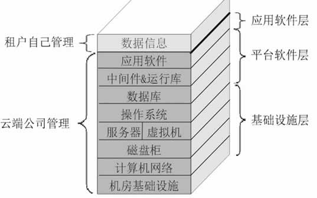
      SaaS

SaaS 云服务提供商有 3 种选择：

1. 租用别人的 IaaS 云服务，自己再搭建和管理平台软件层和应用软件层。
2. 租用别人的 PaaS 云服务，自己再部署和管理应用软件层。
3. 自己搭建和管理基础设施层、平台软件层和应用软件层。

# 什么是云原生

## 什么是云原生

    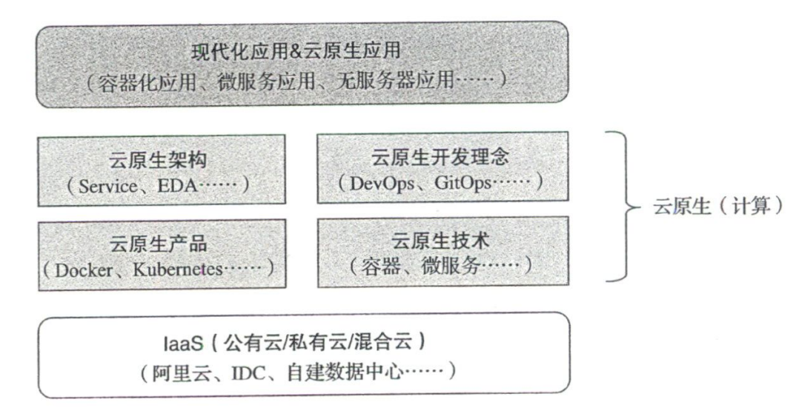
      云原生相关概念之间的关系

所以云原生（或者说云原生计算）应当包括云原生技术、云原生产品、云原生架构以及 构建现代化应用的开发理念,如DevOps,具体说明如下

1. 云原生产品和云原生技术需要基于公有云、私有云或混合云的云基础设施（IaaS）
2. 云原生架构和云原生开发理念是基于云原生技术和产品构建或实现的。注意，对 于不是基于云原生技术或者产品的架构和理念’如基于传统物理服务器发布、构建的 DevOps,是不会被划分到云原生范畴的
3. 现代化应用和云原生应用是基于云原生的架构和开发理念构建或实现的。

## 云原生是云计算的再升级

### 重塑研发流水线

容器、Git

### 重新定义软件交付模式

基于容器和Kubernets的交付平台，可以屏蔽底层不同硬件环境的差异。

    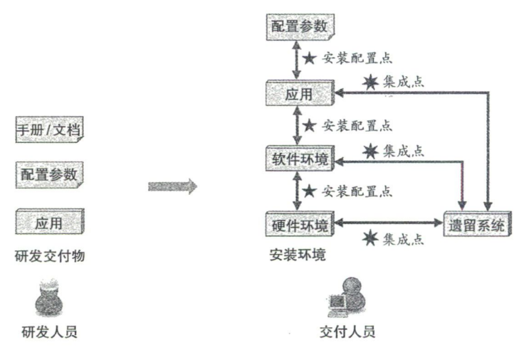
    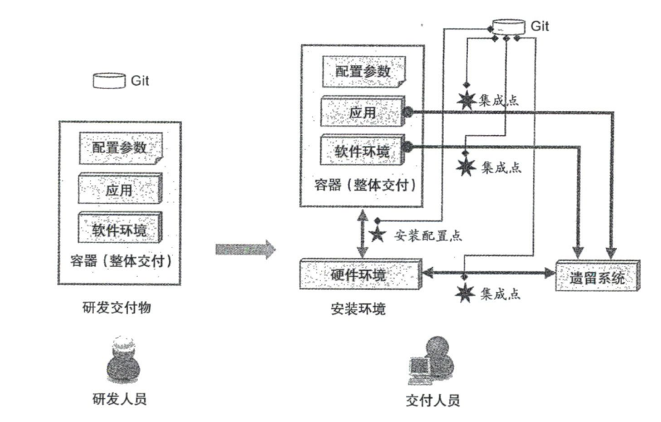
      传统（上）与云原生（下）交付模式

相较于传统模式，云原生软件交付模式主要有如下几个变化：

1. 利用容器做整体交付。
2. 将Git作为“Single Version of Truth”（唯一真实版本）。
3. 声明式API。很多软件交付都是“告诉”系统需要做什么’特别是脚本中往往会写明如何进行部署;而声明式API首先是“告诉”系统期望的目标状态是什么,比如’在这种环境下部署需要用到两个实例’其次才是脚本或工具需要做什么才能交付这个目标状态（即如何做）。声明式API本身并不复杂’实际上它是—种开发理念的彻底升级,因为系统更多 的是关注需要什么（达到什么状态）,所有的“如何做”都是围绕这个目标状态来服务的。
4. 尽量采用OpenAPI作为系统间的集成方式。

### 运维模式的升级

云原生运维可以基于标准化基础设施的运维’通过完整的可观测性实现系统中各类异 常的实时可见,也可以结合声明式API实现自动化运维。

### 应用架构的升级

应用使用云原生技术有如下两种方式。

1. re-platform：这种方式是在不重构代码或不重写代码的情况下,尽量采用云原生技术,比如，使用容器对应用进行打包和部署’把Kafka替换为云服务，把MySQL替换为RDS（RclationalDatabaseService，关系型数据库服务），等等。
2. re-build：这种方式需要重构甚至完全重写应用，比如，把单体架构（Architecture）改为微服务架构，实施存储状态分离，务实现采用Servless技术编写，采用事件驱动架构，等等。

### 组织结构的升级

云原生的升级还会涉及IT文化的升级以及IT组织结构的升级。

## 构建现代化应用

### 现代化应用特点

| 特点              | 描述                                                         |
| ----------------- | ------------------------------------------------------------ |
| Web Scale（弹性） | 应用可以随着业务峰值自动扩展,具备应对WebScale流量的水平扩缩容能力 |
| 可观测和度量      | 应用具备很强的可观测性,具备服务调用、服务提供的细颗粒度SLA度量 |
| 高可用和容灾      | 任何主机的故障（包括数据中心在内的故障）,都不会对业务的可用性带来影响 |
| 灰度发布          | 应用可似根据机器、分组、用户组、地理位置等多个属性进行灰度升级 |
| 可管理            | 具备版本机制，通过标准API集成,符合配置管理的最佳实践         |
| API优先           | 所有的应用都基于API生态（特别是BaaS），任何组件都提供了API以及SLA |
| 基于容器技术      | 容器是现代化应用的“一等公民”，生产流水线和应用本身都基于容器构建 |
| 灵活选择语言      | 技术与开发语言的强绑定时代已经过去,基于云原生架构的应用可以自由选用自 己认为开发速度最快的语言 |
| 微服务架构        | 按领域把复杂的软件细分为多个微服务,每个领域分别进行迭代，通过标准化接 口来规定服务间的访问 |
| 无状态的应用      | 通过收敛和云服务重新设计有状态组件,让应用具备横向扩展能力    |
| DevOps            | 采用DevOps而不是瀑布模型构建应用’利用CI／CD提升发布频率      |
| 自动化交付和运维  | 利用GitOps、OAM（OpenApplicationModel,开放应用模型）、不可变基础设施 等云原生理念进行自动化交付和运维 |
| 策略驱动          | 软件的配置、运行、升级等策略也是一种声明式描述               |
| 认证和鉴权        | 应用天生带有认证、鉴权的安全体系，数据在传输和保存前加密,以防止信息从 内部泄露 |

### 云原生架构能为企业带来什么价值

1. 创新速度加快
2. 用户体验提升
3. 成本优化
4. 业务风险降低
5. 人才结构会改变，运维数量减少，支出逐步转移到业务的核心人员上

## 案例：阿里巴巴云原生发展实践

    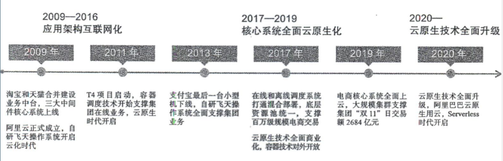
      阿里巴巴的云原生实践之路

# 云原生架构的定义和原则

## 云原生架构定义

从技术的角度出发，云原生架构是基于云原生技术的一组架构原则和设计模式的集合， 旨在帮助企业和开发人员充分利用云平台所提供的平台化能力和弹性资源能力。

    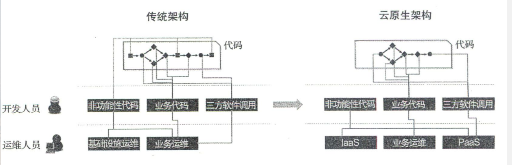
      传统架构与云原生架构对比

### 云原生架构带来的优势

- 降低研发成本和项目维护复杂度
	- 虚拟机层面
	- 容器层面
	- 云服务层面
- 加快软件迭代速度，降低管理和运行成本
	- 面向单机资源变为面向云服务于云API研发
	- 高度自动化的软件交付能力

## 云原生架构原则

### 服务化原则

    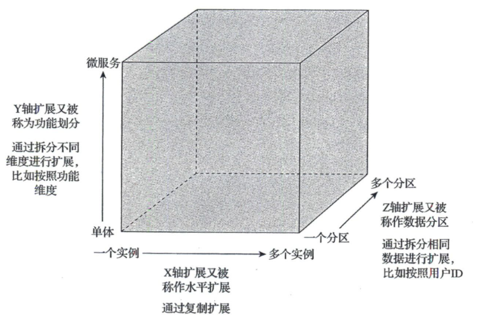
      应用服务化扩展

服务化设计原则是指通过服务化架构拆分不同生命周期的业务单元，实现业务单元的独立迭代，从而加快整体的迭代速度，保证迭代的稳定性。同时，服务化架构采用的是面向接口编程方式，增加了软件的复用程度，增强了水平扩展的能力。服务化设计原则还强调在架构层面抽象化业务模块之间的关系，从而帮助业务模块实现基于服务流量（而非网络流量）的策略控制和治理，而无须关注这些服务是基于何种编程语言开发的。

### 弹性原则

弹性原则是指系统部署规模可以随着业务量变化自动调整大小，而无须根据事先的容 量规划准备固定的硬件和软件资源。优秀的弹性能力不仅能够改变企业的IT成本模式，使得企业不用再考虑额外的软硬件资源成本支出（闲置成本）,也能更好地支持业务规模的爆发式扩张，不再因为软硬件资源储备不足而留下遗憾。

要想构建弹性的系统结构，需要遵循如下四个基本原则。

1. 按功能切割应用
	- 一个大型的复杂系统可能由成百上千个服务组成’架构师在设计架构时，需要遵循的原则是：将相关的逻辑放到一起，不相关的逻辑拆解到独立的服务中，各服务之间通过标 准的服务发现（ServiceDjscovcry）找到对方’并使用标准的接口进行通信。各服务之间松 藕合’这使得每一个服务能够各自独立地完成弹性伸缩，从而避免服务上下游关联故障的发生。
2. 支持水平切分
	- 按功能切割应用并没有完全解决弹性的问题。一个应用被拆解为众多服务后，随着用户流量的增长，单个服务最终也会遇到系统瓶颈。因此在设计上，每个服务都需要具备可 水平切分的能力，以便将服务切分为不同的逻辑单元，由每个单元处理一部分用户流量，从而使服务自身具备良好的扩展能力。这其中最大的挑战在于数据库系统，因为数据库系统自身是有状态的，所以合理地切分数据并提供正确的事务机制将是一个非常复杂的工程。不过，在云原生时代，云平台所提供的云原生数据库服务可以解决大部分复杂的分布式系统问题，因此，如果企业是通过云平台提供的能力来构建弹性系统，自然就会拥有数据库系统的弹性能力。
3. 自动化部署
	- 系统突发流量通常无法预计，因此常用的解决方案是，通过人工扩容系统的方式，使系统具备支持更大规模用户访问的能力。在完成架构拆分之后，弹性系统还需要具备自动化部署能力，以便根据既定的规则或者外部流量突发信号触发系统的自动化扩容功能，满足系统对于缩短突发流量影响时长的及时性要求，同时在峰值时段结束后自动缩容系统，降低系统运行的资源占用成本。
4. 支持服务降级
	- 弹性系统需要提前设计异常应对方案，比如，对服务进行分级治理，在弹性机制失效、弹性资源不足或者流量峰值超出预期等异常情况下，系统架构需要具备服务降级的能力，通过降低部分非关键服务的质量，或者关闭部分增强功能来让出资源，并扩容重要功能对应的服务容量，以确保产品的主要功能不受影响。

### 可观测原则

可观测性更强调主动性，在云计算这样的分布式系统中’主动通 过日志、链路跟踪和度量等手段，让一次APP点击所产生的多次服务调用耗时、返回值和参数都清晰可见，甚至可以下钻到每次第三方软件调用、SQL请求、节点拓扑、网络响应等信息中。运维、开发和业务人员通过这样的观测能力可以实时掌握软件的运行情况，并获得前所未有的关联分析能力’以便不断优化业务的健康度和用户体验。

要想构建可观测性体系，需要遵循如下三个基本原则。

1. 数据的全面采集
	- 指标
	- 链路跟踪
	- 日志
2. 数据的关联分析
3. 统一监控视图与展现

### 韧性原则

韧性是指当软件所依赖的软硬件组件出现异常时，软件所表现出来的抵御能力。这些异常通常包括硬件故障、硬件资源瓶颈（如CPU或网卡带宽耗尽）、业务流量超出软件设计承受能力、影响机房正常工作的故障或灾难、所依赖软件发生故障等可能造成业务不可用的潜在影响因素。

韧性原则的实践与常见架构主要包括服务异步化能力、重试／限流／降级／熔断／反 压、主从模式、集群模式、多AZ（Avajlablljty Zone，可用区）的高可用、单元化、跨区域 （Region）容灾、异地多活容灾等。

### 所有过程自动化原则

技术是把“双刃剑’’，容器、微服务、DevOps以及大量第三方组件的使用，在降低分 布式复杂性和提升迭代速度的同时，也提高了软件技术栈的复杂度，加大了组件规模，从 而不可避免地导致了软件交付的复杂性。如果控制不当’应用就会无法体会到云原生技术的优势。通过IaC、GjtOps、OAM、Operator和大量自动化交付工具在CI／CD（持续集成／ 持续交付）流水线中的实践，企业可以标准化企业内部的软件交付过程，也可以在标准化的基础上实现自动化，即通过配置数据自描述和面问终态的交付过程，实现整个软件交付和 运维的自动化。

要想实现大规模的自动化，需要遵循如下四个基本原则。

1. 标准化
2. 面向终态
	- 面向终态是指声明式地描述基础设施和应用的期望配置，持续关注应用的实际运行状态，使系统自身反复地变更和调整直至趋近终态的-种思想。面向终态的原则强调应该避 免直接通过工单系统、工作流系统组装-系列过程式的命令来变更应用,而是通过设置终态。让系统自己决策如何执行变更。
3. 关注点分离
4. 面向失败设计

### 零信任原则

“永不信任，永远验证”

传统安全架构的边界是物理网络，而零信任安全架构的边界则是身份’这个身份包括人的身份、设备的身份、应用的身份等。

要想实现零信任安全架构，需要遵循如下三个基本原则。

1. 显式验证
2. 最少权限
3. 假设被攻破
	- 不能基于IP配置安全策略
	- 身份应该成为基础设施
	- 标准的发布流水线

总体来说,整个零信任模型的建设包括身份、设备、应用、基础设施、网络、数据等 几个部分。

### 架构持续演进原则

在工程实践中很少有从—开始就能够被明确 定义并适用于整个软件生命周期的架构模式，而是需要在一定范围内不断重构，以适应变化的技术和业务需求。云原生架构本身也应该且必须具备持续演进的能力，而不是 —个封闭式的、被设计后一成不变的架构。

#### 演进式架构的特点和价值

演进式架构是指在软件开发的初始阶段，就通过具有可扩展性和松藕合的设计，让后 续可能发生的变更更加容易、升级性重构的成本更低，并且能够发生在开发实践、发布实 践和整体敏捷度等软件生命周期中的任何阶段。

#### 演进式架构的应用

在面向业务研发的应用架构中，演进式架构通常与微服务设计密不可分。

而在平台研发层面，演进式架构更多地体现为基于“能力”的架构（CapabiIityOriented Architccmre，COA）。

#### 云原生下的架构演进

在云原生时代，开发应用模型（OpenApplication Model，OAM）正在迅速成为演进式架构推进的重要 助力。

# 云原生架构的模式和反模式

对应代码设计中的设计模式。

## 服务化架构模式

也称为面向服务的架构（SOA），在通信双方（服务提供者和服务消费者）间约定好服务规约，然后基于该规约发布和调用服务。服务化架构模式设计的核心价值体现在如下三个方面：

1. 更好地面向服务（Business Oriented）

	通信双方都是基于自己的实际业务需求来设计接口的（服务规约），所以具有更多的业务特性，阅读和理解也非常方便，容易在业务人员和技术人员之间共享。

2. 松耦合和灵活性（Loose Coupling & Flexibility）

	双方在约定好服务规约之后，只要遵循该规约即可。除了该规约之外，彼此之间再没有其他的限制和约束，双方体现出很好的松耦合关系。

3. 服务共享和复用（Shared Service）

	服务通常是可共享的，多个服务消费者可以同时调用共享服务。当然，这其中可能会 涉及安全和隔离等问题。

在实际开发中，具体可用于实现服务规约的技术方案主要有三种，分别是服务接口定义、IDL定义和OpenAPI。

### 服务接口定义

服务接口定义是指对应的编程语言对服务接口的描述。

### IDL定义

IDL定义是指通过IDL（Interface Definition Language,接口定义语言）对服务进行规约定义。

### [OPenAPI](https://swagger.io/specification/)

OpenAPI是基于HTTPREST通信的接口规范。

Kubernetes 1.16.0对应的[OpenAPI](https://editor.swagger.io/)规范。

OpenAPI提供的工具非常多’参考地址为 https://openapi.tools

实际的服务运维和服务调用还需考虑服务分组、服务版本和服务元信息等。

1. 服务分组

	服务分组的目的主要是满足不同的地理空间和服务等级需求，例如在不同的数据中心， 即便是相同的服务，也要通过不同的集群部署方式来区分。另外，考虑到服务等级要求，如针对给VIP客户提供更可靠的服务，也会涉及同样的服务在不同分组中的不同要求。当然，实际情况复杂多样，可能还会通过其他维度来对服务分组。

2. 服务版本

	服务发布后，随着需求的变更，我们需要在原有的服务规约上提供更多服务接口，其中一些可能还会涉及具体的逻辑变更。虽然我们竭力想要做到服务的接口兼容，但可能无 法总是满足实际的需求。此时，我们需要推出服务的新版本，用于区分之前服务的接口规约。这也是为什么—些HTTP REST服务的URL路径中经常会看到v1、v2这样的版本信息。

3. 服务元

	当管理的服务数量较多的时候就需要为服务添加一些元信息，如服务描述、服务提供者信息、服务的标签等，以便于管理服务。

## Service Mesh化架构模式

Service Mesh（服务网格）是专用的基础结构层，主要用于保障服务之间安全、快速和可靠的通信。构建云原生应用程序就需要一个ServiceMesh。

ServiceMesh中一些关键信息：

1. Service Mesh是基础设施层在某些场景中可能要与其他基础设施交互，如基础网络、PaaS平台、运维系统等。
2. Service Mesh可用于解决各服务之间的通信问题。
3. Service Mesh是安全、快速和可靠的。
4. 构建云原生应用，Service Mesh不可或缺的,众多微服务应用间相互通信是Service Mesh擅长的。

Service Mesh架构主要有三种模式：Sidecar、服务注册与发现模式、中心划Broker模式。

### Sidecar模式

典型方案：Istio+Envoy结构。其中Istio主要负责控制面（Control Panel）的管控，Envoy负责数据面（Data Plane）的网络流量转发，相当于本地（客户端）代理。两者结合实现了Istio的4大目标：连接（Connect）、安全（Security）、控制（Control）和观测（Observe）。

服务间不是直接调用，而是先连接Envoy，通过Envoy代理人代理。

使用代理优点：

1. 服务路由和可靠性保证

	应用和网络连接（调用）解耦，有代理人实现

2. 隔离性和安全性

	代理人能够起到防火墙作用

3. 为应用减负

	代理人可以实现协议解析/转换、数据序列化和反序列化，进一步解耦

4. 服务调用的可观测性

	代理人相当于一个切面，可以完成日志收集等工作

Istio+Envoy方案缺点：

1. 对Kubernetes的依赖

2. 性能损失和资源浪费

	相比直连模式，代理会增加性能和资源额外开销

3. 开发成本增加

	代理导致

### 服务注册和发现模式（Nacos）

    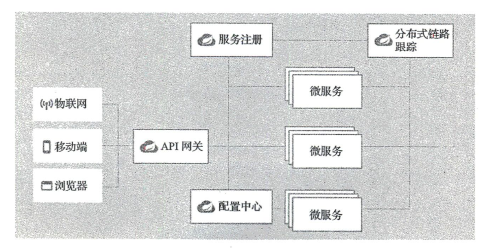
      Spring Cloud典型架构

### 中心化Broker模式

    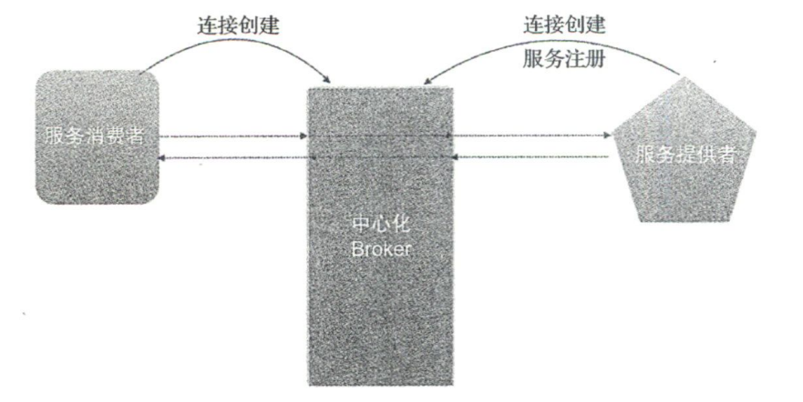
      中心化Broker模式整体流程

中心化Broker模式的优势：

1. **无端口监听。**传统的服务提供者首先需要启动本地的监听端口，然后接收来自其他应用的服务请求。而Broker模式则是由服务提供者主动创建到Broker的连接，然后复用该连接处理来自Broker的服务请求。
2. **无网络要求。**Broker介入后，只需要与Broker能正常通信就可以。
3. **无底层设施依赖。**
4. **无服务注册依赖，无负载均衡要求。**服务请求全部由Broker转发，不需要关心负载均衡等问题。
5. **简化运维。**运维只需管理Broker服务器。

虽然Broker有着很多优势，但Broker模式并不流行，主要有两个原因：

1. **异步化架构**。当应对庞大的访问流量时，需要异步化架构。
2. **协议适配和单点故障**。Broker处于中心，需要对入口和出口流量中的协议进行适配和转发，如何处理的不好会导致性能下降或者单点故障等。

[RSocket](https://rsocket.io/)和Broker的相互配合使得基于Broker的Service Mesh方案成为可能。

Rsocket是一个异步二进制中消息通信协议，该协议采用连接复用技术，在连接复用的基础上支持4个通信模型，具体如下：

1. Request/Response：请求/响应模型，如HTTP1.1、RPC等。
2. Request/Stream：流式数据请求模型，如消息订阅Pub/Sub模型
3. Fire-and-Forget：数据发送后无须响应，性能更高，但存在一定的消息丢失风险。主要用在一些高性能、非关键数据的网络传输场景，如日志传入、Metrics上报等。
4. Channel：双向发送数据模式，主要应用在IM聊天、双向消息推送等场景。

    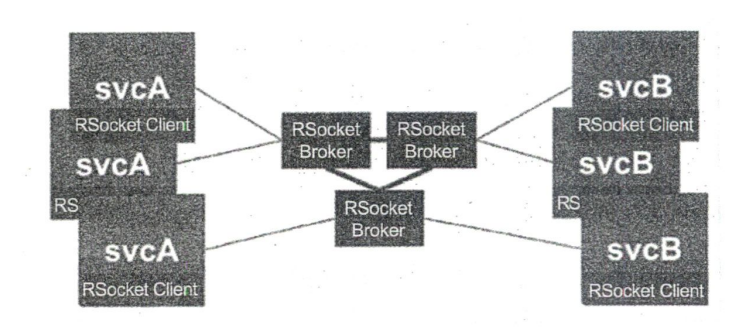
      RSocket Broker典型的通信场景

在这种场景下，所有的微服务都作为RSocket Client连接到中心画的RSocket Broker集群上。当有一个应用想要调用其他服务时，调用请求通过RSocket协议将消息发给Broker，然后Broker根据服务路由表，将对应的请求转发给服务提供者，在请求处理完成后，再由Broker负责将响应转发给服务调用放。整个通信过程是异步的，不会出现阻塞情况，提升了CPU利用率，提升了系统的处理能力。

## Serverless架构模式

指由云平台提供应用运行时需要的服务器，并且动态管理应用运行时需要的资源分配。开发者无需关注环境配置、容量规划和运维操作等。通常，云平台将Serverless以函数的方式（FaaS）提供给开发者。不同厂商的Serverless平台的部署方式和API等都不太一样，但是Serverless平台会遵循CNCF Serverless白皮书开发规范。

## 计算存储分离模式

针对计算存储分离模式，厂商提供了完备的存储方案°简单的存储方案如KV、分布式缓存、文件存储等，复杂的存储方案如文件系统挂载、块服务，这些存储方案同时解决了海量存储、数据备份等问题，可以很好地帮助我们实现计算和存储分离，实现无状态的架构设计。

在云原生架构中，应用可以将有状态部分委托给云，应用本身聚焦在计算部分，以解 决分布式复杂性问题。常见的有状态部分包括会话数据、信息、各类文件、业务基础数据 （如产品、地址库等）、业务配置参数、计算中间状态等。

## 分布式事务模式

在采用微服务架构的场景中，通常不会使用数据库共享模式，而是遵循每个微服务单独使用一个数据库的设计原则。但是这种设计面临一个问题：当某个业务贯穿于多个微服务的时候，微服务中的数据属于不同的数据库，彼此的事务都是独立的，如何保证数据的一致性？

分布式事务实现主要有5种模式：

1. 两阶段提交（2PC）
2. 最终一致性BASE
3. 预留资源的TCC
4. 补偿机制的Saga
5. 高效的AT

### 两阶段提交

分两步提交，典型的有XA协议。XA协议是数据库事务管理器的标准接口。XA资源支持事务提交和回滚，一般由数据库实现，可以存在于各个微服务应用中。事务管理器在第一阶段会先创建一个全局的事务ID（xid），接下来向各个XA资源询问是否就绪，如果XA资源的回复全是Yes，并给出了对应的本地事务ID，则事务管理器将进人第二阶段，开始发起分布式事务提交；如果任意一个XA资源的回复是No，则由事务管理器对所有的XA资源发送对应的xid事务回滚，总的来说，每个XA资源都会参与到整个事务链中，并在全局事务管理器中通过全局事务ID和每个XA资源的子事务ID协调后做出统一响应，如统一提交和统一回滚。

两阶段提交设计逻辑简单明了，但实际应用中任然存在一些问题：

1. **同步阻塞问题：**当一个全局事务涉及多个XA资源时，如果某个XA资源被占用，那么该全局事务就只能等待该XA资源的响应，从而处于阻塞中，导致整个系统的处理能力降低。
2. **单点故障：**整个分布式事务是一个链，一旦有一个XA资源出现故障，则整体都不可用。
3. **潜在数据不一致风险**：如果在阶段二，由于网络问题，事务管理器只向部分XA资源发送commit消息，则只会有部分XA资源接收到commit消息，整体数据就会出现不— 致的问题。另外，如果在发送commit消息时，事务管理器出现了错误，如岩机等，那么也会出现数据不一致的问题。

### BASE

Basically Available、Soft state（软状态）和Eventually consistent（最终一致性）三个短语的简写。BASE是对CAP定理（Consistency、Availability、Partition tolerance）中一致性和可用性权衡的结果。

1. **基本可用：**指在分布式系统出现不可预知的故障时，允许损失系统的部分特性来换取系统的可用性。
2. **软状态：**指运行系统中的数据存在中间状态，并认为该中间状态不会影响系统的整 体可用性和最终一致性，即允许系统在不同节点的数据副本之间进行数据同步时存在延时。
3. **最终一致性：**强调的是系统中所有的数据副本在经过一段时间的同步后，最终状态能达到一致。

在分布式环境下，传统ACID事务会让系统的可用性降低、响应时间变长，这可能达不到系统的要求，因此实际生产中使用柔性事务是一个非常好的选择。

### TCC

Try、Confim和Cancel的简称，将事务的提交过程分为try-confirm-cancel三个阶段。try阶段完成业务检查、预留业务资源；confirm阶段使用预留的资源执行业务操作；cancel阶段取消执行业务操作，释放预留的资源。

TCC与 2PC都需要事务的参与者实现对应的接口。TCC的事务参与者必须实现try、confirm、cancel三个接口。TCC事务的流程如下：

1. 事务协调器发起事务请求，调用所有事务参与者的try接口完成资源的预留，这时候并没有真正执行业务，而是为后面具体要执行的业务预留资源。如果该阶段有参与者的try接口返回错误，则无法预留资源。如果资源不够，事务协调器则调用所有参与者的 cancel接口回滚预留的资源。事务协调器有幂等和重试机制，以确保参与者的cancel接口被调用并回滚预留的资源。
2. 如果事务协调器发现所有参与者的try接口都返回成功，则调用所有参与者的 confirm接口。如果协调器发现所有参与者的confirm接口都成功了，则分布式事务结束。如果协调器发现有些参与者的confirm接口返回失败，则调用所有参与者的cancel接口进行资源回滚。如果由于网络原因，协调器没有收到回执，则会进行重试。如果在既定的重试次数或者时间段内依然失败，协调器则会触发其他参与者的cancel接口进行资源回滚。如果协调器一直没有收到确认，则会保留当前事务的状态，方便后续的事务补偿操作，如收到参与者返回后进行回滚操作，或者人工介人进行对应的数据修复，确保数据的最终—致。

TCC采用了资源加锁粒度较小的柔性事务，将一个大的事务划分为多个独立的小的事务。每一个小的事务采取资源预留的机制进行事务处理。对于整个事务链来说，无法做到原子级别的事务提交，所以也就无法保证某一时刻的数据一致性，只能保证最终的数据— 致性。

### Saga

主要用来解决长事务，是一种补偿协议。在该模式下，一个分布式事务内会有多个参与者，每个参与者都是一个带有补偿逻辑的服务，即该服务可以根据业务场景实现正向操作和逆向回滚操作。

在Saga模式中，也存在一个事务管理器。在分布式事务的执行过程中，该事务管理器负责依次执行各个服务的正向操作。如果所有正向操作执行成功，那么整体分布式事务就可以提交并执行成功；如果任何一个服务的正向操作执行失败，那么事务管理器就会回退，执行前面各个服务的逆向回滚操作，让分布式事务回到初始状态，从而达到整体事务回滚的目的。

Saga需要开发者实现服务的正向逻辑和补偿逻辑，传统的事务管理器是没有实现补偿逻辑的。Saga模式非常适用于流程长且需要保证事务最终一致性的业务操作。Saga模式通常是基于事件驱动设计的，每个服务都是异步执行的，不存在加锁、资源等待和阻塞的情况，CPU利用率高。

### AT（Automatic Transaction）

无侵入的分布式事务模式。AI模式保持了Spring事务的编程风格，通过一行注解就可实现分布式事务，学习成本较低，无须资源实现XA协议，所以其应用范围更广。

## 可观测架构模式

可观测性（Observability）主要是指了解程序内部运行情况的能力。应用发布上线后希望了解应用内部运行情况，即便发生错误或者崩溃也能够记录相关数据（飞机黑匣子）。目前，关于可观测性的架构设计主要涉及三个部分：日志（logging）、度量（Metrics）和追踪（Tracing）。

### 日志

要想了解系统的运行情况，最简单的方法就是查看日志。日志技术已经非常成熟，云厂商基本都会提供日志服务，或者自行安装成熟的日志处理系统（ElasticStack等）。

### 度量

不仅包括CPU负载、内存使用量等技术指标的度量，还包括非常多的业务度量（Business Metrics），如每分钟的交易额、交易量等。对于这些业务度量参数，在做架构设计的时候，需要以参考指标的方式全部罗列出来，以便观测上线后的数据，并做出相应的业务决策。

度量统计的是窗口期的数据，无需再次计算，从而节约了计算资源；也不需要保存窗口期中的每一条具体数据，可以节约存储资源；对于用户来说，由于数据经过了窗口期的预处理，查询响应速度也会更快。

总体来说，度量部分处理的是可观测性数据中的垂直场景。当我们更关注某—窗口期的聚合数据，同时关注点主要聚焦于数据的趋势和对比时，度量刚好能够满足这类需求。

典型的度量指标主要由以下5部分组成：

1. **名称**：名称表示该度量指标代表的一席，可以采用类似域名点（.）分隔，或使用下划线（_）分隔（Prometheus度量系统采用）。
2. **时间点**：采集度量的时间点，通常由度量框架自动设置。
3. **数字值**：度量值只能为数字值，不能为字符串等其他值。
4. **类型**：典型的类型分为计数器、直方图、平均比率、计时器、计量表等。
5. **标签**：主要包括一些元信息，如来源服务器标识、应用名称、分组信息、运行环境等。标签是为了方便后续的度量查询和再聚合处理。

度量系统的一些预警规则：

1. 阈值预警：当某一度量指标的值低于或者高于某一预设值时，就会触发警报。例如：CPU的负载。
2. 同期数据对比：在某些场景可以通过同期数据对比来判断问题。
3. 趋势预警：主要针对计数器类型设置的预警，如果度量值出现激增或者骤降就会预警。

大多数云厂商也提供了度量集成化服务，如阿里云的Prometheus。

### 追踪

## 事件驱动架构模式

## 网关架构模式

## 混沌工程模式

## 声明式设计模式

## 典型的云原生架构反模式

# 云原生技术及概念介绍

## 容器技术

## DevOps技术

## 微服务

## Serverless

## 开放应用模型

## Service Mesh技术

## 分布式消息队列

## 云原生数据库技术

## 云原生大数据

## 云原生AI

## 云端开发

## 云原生安全

# 阿里巴巴云原生架构设计

## 云原生架构的四个不同成熟阶段

## ACNA的概念

## 云原生架构成熟度模型

## 如何向云原生架构迁移

## 架构风险控制

# 不同行业的云原生架构实践

## 完美日记的云原生之路

## 突围数字化转型，云原生赋能特步新零售

## 落地云原生，联通构建新一代云化业务支撑系统

## 申通快递核心业务系统云原生之路

# 云原生架构的发展趋势

## 容器技术的发展趋势

## 基于云原生的新一代应用编程界面的发展趋势

## Serverless发展趋势

## 采用云原生技术的软件交付模式

## 云原生大数据发展趋势

## 云原生数据库的发展趋势