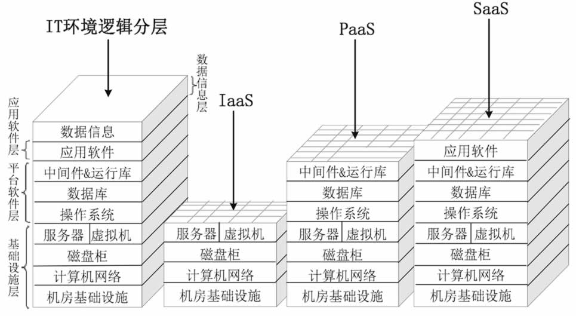
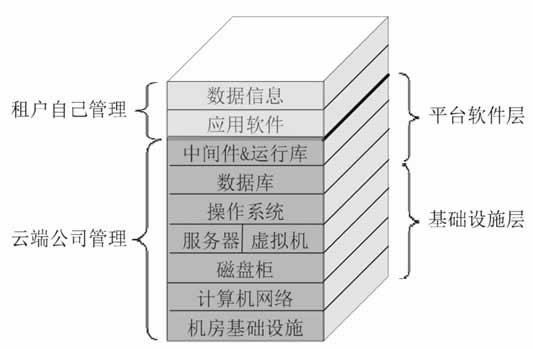
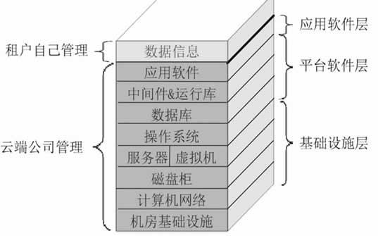
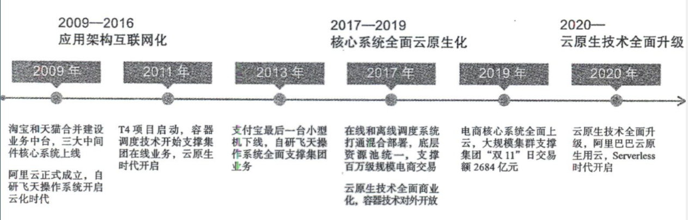
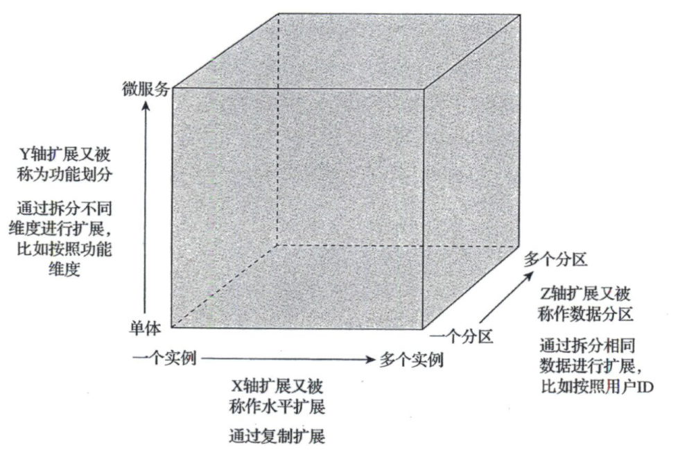
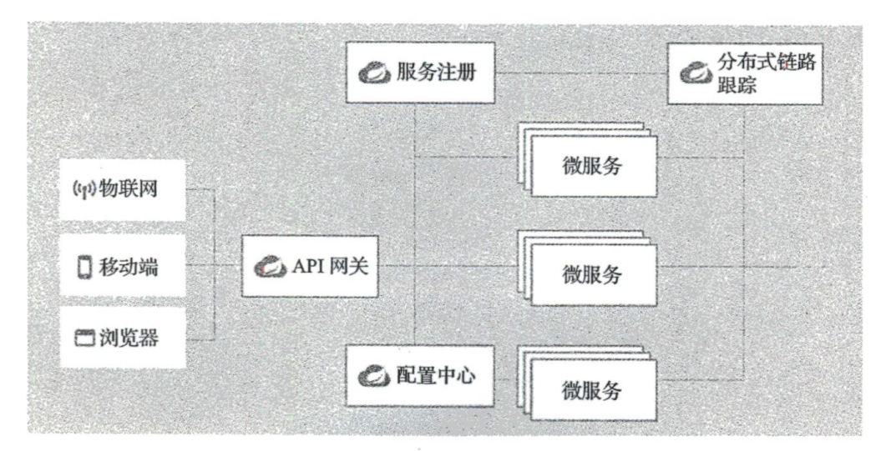
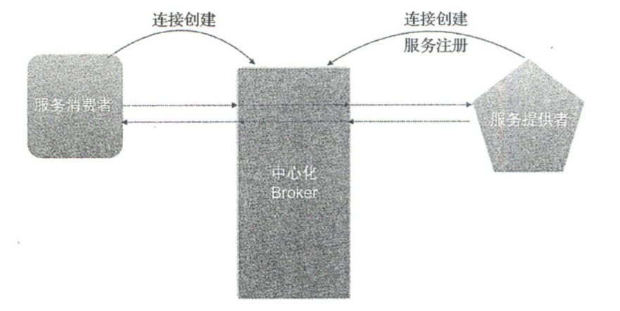
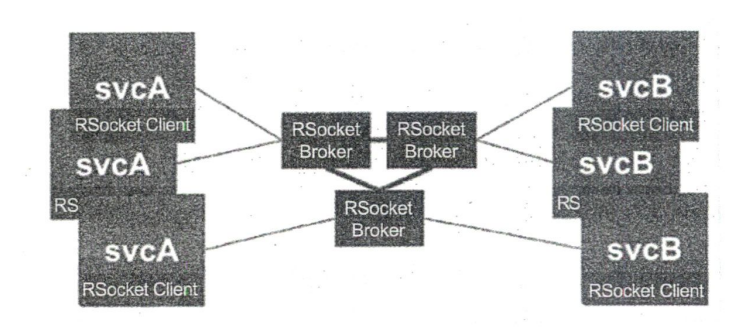
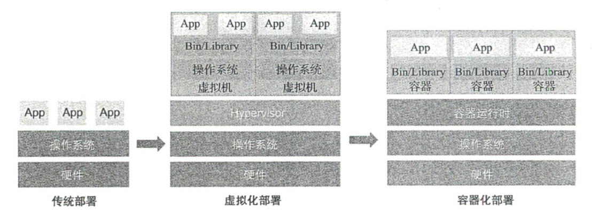
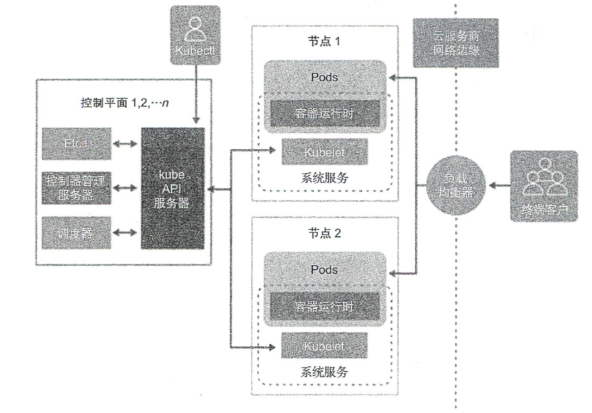

# 12因子

## [1. 基准代码](https://12factor.net/zh_cn/codebase)

### 一份基准代码，多份部署

## [2. 依赖](https://12factor.net/zh_cn/dependencies)

### 显式声明依赖关系

## [3. 配置](https://12factor.net/zh_cn/config)

### 在环境中存储配置

## [4. 后端服务](https://12factor.net/zh_cn/backing-services)

### 把后端服务当作附加资源

## [5. 构建，发布，运行](https://12factor.net/zh_cn/build-release-run)

### 严格分离构建和运行

## [6. 进程](https://12factor.net/zh_cn/processes)

### 以一个或多个无状态进程运行应用

## [7. 端口绑定](https://12factor.net/zh_cn/port-binding)

### 通过端口绑定提供服务

## [8. 并发](https://12factor.net/zh_cn/concurrency)

### 通过进程模型进行扩展

## [9. 易处理](https://12factor.net/zh_cn/disposability)

### 快速启动和优雅终止可最大化健壮性

## [10. 开发环境与线上环境等价](https://12factor.net/zh_cn/dev-prod-parity)

### 尽可能的保持开发，预发布，线上环境相同

## [11. 日志](https://12factor.net/zh_cn/logs)

### 把日志当作事件流

## [12. 管理进程](https://12factor.net/zh_cn/admin-processes)

### 后台管理任务当作一次性进程运行

# 云计算的三种服务模式

    
      <a href="http://c.biancheng.net/view/3787.html">云计算的 3 种服务模式</a>

## [IaaS](http://c.biancheng.net/view/3788.html)

IaaS 是“Infrastructure as a Service”的首字母缩写，意思是基础设施即服务，即把 IT 系统的基础设施层作为服务出租出去。由云服务提供商把 IT 系统的基础设施建设好，并对计算设备进行池化，然后直接对外出租硬件服务器、虚拟主机、存储或网络设施（负载均衡器、防火墙、公网IP地址及诸如 DNS 等基础服务）等。

云服务提供商负责管理机房基础设施、计算机网络、磁盘柜、服务器和虚拟机，租户自己安装和管理操作系统、数据库、中间件、应用软件和数据信息，所以 IaaS 云服务的消费者一般是掌握一定技术的系统管理员，如图所示。

    
      IaaS

## [PaaS](http://c.biancheng.net/view/3791.html)

PaaS 是“Platform as a Service”的首字母缩写，意为平台即服务，即把 IT 系统的平台软件层作为服务出租出去，如图 1 所示。

相比于 IaaS 云服务提供商，PaaS 云服务提供商要做的事情增加了，他们需要准备机房、布好网络、购买设备、安装操作系统、数据库和中间件，即把基础设施层和平台软件层都搭建好，然后在平台软件层上划分“小块”（习惯称之为容器）并对外出租。

PaaS 云服务提供商也可以从其他 IaaS 云服务提供商那里租赁计算资源，然后自己部署平台软件层。另外，为了让消费者能直接在云端开发调试程序，PaaS 云服务提供商还得安装各种开发调试工具。相反，租户要做的事情相比 IaaS 要少很多，租户只要开发和调试软件或者安装、配置和使用应用软件即可。PaaS 云服务的消费者主要包括以下人员。

- 程序开发人员：写代码、编译、调试、运行、部署、代码版本控制等，一揽子解决。
- 程序测试人员。
- 软件部署人员：把软件部署到 PaaS 云端，便于管理不同版本之间的冲突。
- 应用软件管理员：便于配置、调优和监视程序运行性能。
- 应用程序最终用户：这时 PaaS 云服务相当于 SaaS 云服务。

    
      PaaS

## [SaaS](http://c.biancheng.net/view/3792.html)

SaaS 是“Software as a Service”的首字母缩写，意为软件即服务。简言之，就是软件部署在云端，让用户通过因特网来使用它，即云服务提供商把 IT 系统的应用软件层作为服务出租出去，而消费者可以使用任何云终端设备接入计算机网络，然后通过网页浏览器或者编程接口使用云端的软件。这进一步降低了租户的技术门槛，应用软件也无须自己安装了，而是直接使用软件，如图所示。

    
      SaaS

SaaS 云服务提供商有 3 种选择：

1. 租用别人的 IaaS 云服务，自己再搭建和管理平台软件层和应用软件层。
2. 租用别人的 PaaS 云服务，自己再部署和管理应用软件层。
3. 自己搭建和管理基础设施层、平台软件层和应用软件层。

# 什么是云原生

## 什么是云原生

    
      云原生相关概念之间的关系

所以云原生（或者说云原生计算）应当包括云原生技术、云原生产品、云原生架构以及构建现代化应用的开发理念,如DevOps,具体说明如下

1. 云原生产品和云原生技术需要基于公有云、私有云或混合云的云基础设施（IaaS）
2. 云原生架构和云原生开发理念是基于云原生技术和产品构建或实现的。注意，对 于不是基于云原生技术或者产品的架构和理念，如基于传统物理服务器发布、构建的 DevOps,是不会被划分到云原生范畴的
3. 现代化应用和云原生应用是基于云原生的架构和开发理念构建或实现的。

## 云原生是云计算的再升级

### 重塑研发流水线

容器、Git

### 重新定义软件交付模式

基于容器和Kubernets的交付平台，可以屏蔽底层不同硬件环境的差异。

    
    
      传统（上）与云原生（下）交付模式

相较于传统模式，云原生软件交付模式主要有如下几个变化：

1. 利用容器做整体交付。
2. 将Git作为“Single Version of Truth”（唯一真实版本）。
3. 声明式API。很多软件交付都是“告诉”系统需要做什么’特别是脚本中往往会写明如何进行部署;而声明式API首先是“告诉”系统期望的目标状态是什么,比如’在这种环境下部署需要用到两个实例’其次才是脚本或工具需要做什么才能交付这个目标状态（即如何做）。声明式API本身并不复杂’实际上它是—种开发理念的彻底升级,因为系统更多 的是关注需要什么（达到什么状态）,所有的“如何做”都是围绕这个目标状态来服务的。
4. 尽量采用OpenAPI作为系统间的集成方式。

### 运维模式的升级

云原生运维可以基于标准化基础设施的运维’通过完整的可观测性实现系统中各类异 常的实时可见,也可以结合声明式API实现自动化运维。

### 应用架构的升级

应用使用云原生技术有如下两种方式。

1. re-platform：这种方式是在不重构代码或不重写代码的情况下,尽量采用云原生技术,比如，使用容器对应用进行打包和部署’把Kafka替换为云服务，把MySQL替换为RDS（RclationalDatabaseService，关系型数据库服务），等等。
2. re-build：这种方式需要重构甚至完全重写应用，比如，把单体架构（Architecture）改为微服务架构，实施存储状态分离，务实现采用Servless技术编写，采用事件驱动架构，等等。

### 组织结构的升级

云原生的升级还会涉及IT文化的升级以及IT组织结构的升级。

## 构建现代化应用

### 现代化应用特点

| 特点              | 描述                                                         |
| ----------------- | ------------------------------------------------------------ |
| Web Scale（弹性） | 应用可以随着业务峰值自动扩展,具备应对WebScale流量的水平扩缩容能力 |
| 可观测和度量      | 应用具备很强的可观测性,具备服务调用、服务提供的细颗粒度SLA度量 |
| 高可用和容灾      | 任何主机的故障（包括数据中心在内的故障）,都不会对业务的可用性带来影响 |
| 灰度发布          | 应用可似根据机器、分组、用户组、地理位置等多个属性进行灰度升级 |
| 可管理            | 具备版本机制，通过标准API集成,符合配置管理的最佳实践         |
| API优先           | 所有的应用都基于API生态（特别是BaaS），任何组件都提供了API以及SLA |
| 基于容器技术      | 容器是现代化应用的“一等公民”，生产流水线和应用本身都基于容器构建 |
| 灵活选择语言      | 技术与开发语言的强绑定时代已经过去,基于云原生架构的应用可以自由选用自 己认为开发速度最快的语言 |
| 微服务架构        | 按领域把复杂的软件细分为多个微服务,每个领域分别进行迭代，通过标准化接 口来规定服务间的访问 |
| 无状态的应用      | 通过收敛和云服务重新设计有状态组件,让应用具备横向扩展能力    |
| DevOps            | 采用DevOps而不是瀑布模型构建应用’利用CI／CD提升发布频率      |
| 自动化交付和运维  | 利用GitOps、OAM（OpenApplicationModel,开放应用模型）、不可变基础设施 等云原生理念进行自动化交付和运维 |
| 策略驱动          | 软件的配置、运行、升级等策略也是一种声明式描述               |
| 认证和鉴权        | 应用天生带有认证、鉴权的安全体系，数据在传输和保存前加密,以防止信息从 内部泄露 |

### 云原生架构能为企业带来什么价值

1. 创新速度加快
2. 用户体验提升
3. 成本优化
4. 业务风险降低
5. 人才结构会改变，运维数量减少，支出逐步转移到业务的核心人员上

## 案例：阿里巴巴云原生发展实践

    
      阿里巴巴的云原生实践之路

# 云原生架构的定义和原则

## 云原生架构定义

从技术的角度出发，云原生架构是基于云原生技术的一组架构原则和设计模式的集合， 旨在帮助企业和开发人员充分利用云平台所提供的平台化能力和弹性资源能力。

    
      传统架构与云原生架构对比

### 云原生架构带来的优势

- 降低研发成本和项目维护复杂度
	- 虚拟机层面
	- 容器层面
	- 云服务层面
- 加快软件迭代速度，降低管理和运行成本
	- 面向单机资源变为面向云服务于云API研发
	- 高度自动化的软件交付能力

## 云原生架构原则

### 服务化原则

    
      应用服务化扩展

服务化设计原则是指通过服务化架构拆分不同生命周期的业务单元，实现业务单元的独立迭代，从而加快整体的迭代速度，保证迭代的稳定性。同时，服务化架构采用的是面向接口编程方式，增加了软件的复用程度，增强了水平扩展的能力。服务化设计原则还强调在架构层面抽象化业务模块之间的关系，从而帮助业务模块实现基于服务流量（而非网络流量）的策略控制和治理，而无须关注这些服务是基于何种编程语言开发的。

### 弹性原则

弹性原则是指系统部署规模可以随着业务量变化自动调整大小，而无须根据事先的容 量规划准备固定的硬件和软件资源。优秀的弹性能力不仅能够改变企业的IT成本模式，使得企业不用再考虑额外的软硬件资源成本支出（闲置成本）,也能更好地支持业务规模的爆发式扩张，不再因为软硬件资源储备不足而留下遗憾。

要想构建弹性的系统结构，需要遵循如下四个基本原则。

1. 按功能切割应用
	- 一个大型的复杂系统可能由成百上千个服务组成’架构师在设计架构时，需要遵循的原则是：将相关的逻辑放到一起，不相关的逻辑拆解到独立的服务中，各服务之间通过标 准的服务发现（ServiceDjscovcry）找到对方’并使用标准的接口进行通信。各服务之间松 藕合’这使得每一个服务能够各自独立地完成弹性伸缩，从而避免服务上下游关联故障的发生。
2. 支持水平切分
	- 按功能切割应用并没有完全解决弹性的问题。一个应用被拆解为众多服务后，随着用户流量的增长，单个服务最终也会遇到系统瓶颈。因此在设计上，每个服务都需要具备可 水平切分的能力，以便将服务切分为不同的逻辑单元，由每个单元处理一部分用户流量，从而使服务自身具备良好的扩展能力。这其中最大的挑战在于数据库系统，因为数据库系统自身是有状态的，所以合理地切分数据并提供正确的事务机制将是一个非常复杂的工程。不过，在云原生时代，云平台所提供的云原生数据库服务可以解决大部分复杂的分布式系统问题，因此，如果企业是通过云平台提供的能力来构建弹性系统，自然就会拥有数据库系统的弹性能力。
3. 自动化部署
	- 系统突发流量通常无法预计，因此常用的解决方案是，通过人工扩容系统的方式，使系统具备支持更大规模用户访问的能力。在完成架构拆分之后，弹性系统还需要具备自动化部署能力，以便根据既定的规则或者外部流量突发信号触发系统的自动化扩容功能，满足系统对于缩短突发流量影响时长的及时性要求，同时在峰值时段结束后自动缩容系统，降低系统运行的资源占用成本。
4. 支持服务降级
	- 弹性系统需要提前设计异常应对方案，比如，对服务进行分级治理，在弹性机制失效、弹性资源不足或者流量峰值超出预期等异常情况下，系统架构需要具备服务降级的能力，通过降低部分非关键服务的质量，或者关闭部分增强功能来让出资源，并扩容重要功能对应的服务容量，以确保产品的主要功能不受影响。

### 可观测原则

可观测性更强调主动性，在云计算这样的分布式系统中’主动通 过日志、链路跟踪和度量等手段，让一次APP点击所产生的多次服务调用耗时、返回值和参数都清晰可见，甚至可以下钻到每次第三方软件调用、SQL请求、节点拓扑、网络响应等信息中。运维、开发和业务人员通过这样的观测能力可以实时掌握软件的运行情况，并获得前所未有的关联分析能力’以便不断优化业务的健康度和用户体验。

要想构建可观测性体系，需要遵循如下三个基本原则。

1. 数据的全面采集
	- 指标
	- 链路跟踪
	- 日志
2. 数据的关联分析
3. 统一监控视图与展现

### 韧性原则

韧性是指当软件所依赖的软硬件组件出现异常时，软件所表现出来的抵御能力。这些异常通常包括硬件故障、硬件资源瓶颈（如CPU或网卡带宽耗尽）、业务流量超出软件设计承受能力、影响机房正常工作的故障或灾难、所依赖软件发生故障等可能造成业务不可用的潜在影响因素。

韧性原则的实践与常见架构主要包括服务异步化能力、重试／限流／降级／熔断／反 压、主从模式、集群模式、多AZ（Avajlablljty Zone，可用区）的高可用、单元化、跨区域 （Region）容灾、异地多活容灾等。

### 所有过程自动化原则

技术是把“双刃剑’’，容器、微服务、DevOps以及大量第三方组件的使用，在降低分 布式复杂性和提升迭代速度的同时，也提高了软件技术栈的复杂度，加大了组件规模，从 而不可避免地导致了软件交付的复杂性。如果控制不当’应用就会无法体会到云原生技术的优势。通过IaC、GjtOps、OAM、Operator和大量自动化交付工具在CI／CD（持续集成／ 持续交付）流水线中的实践，企业可以标准化企业内部的软件交付过程，也可以在标准化的基础上实现自动化，即通过配置数据自描述和面问终态的交付过程，实现整个软件交付和 运维的自动化。

要想实现大规模的自动化，需要遵循如下四个基本原则。

1. 标准化
2. 面向终态
	- 面向终态是指声明式地描述基础设施和应用的期望配置，持续关注应用的实际运行状态，使系统自身反复地变更和调整直至趋近终态的-种思想。面向终态的原则强调应该避 免直接通过工单系统、工作流系统组装-系列过程式的命令来变更应用,而是通过设置终态。让系统自己决策如何执行变更。
3. 关注点分离
4. 面向失败设计

### 零信任原则

“永不信任，永远验证”

传统安全架构的边界是物理网络，而零信任安全架构的边界则是身份’这个身份包括人的身份、设备的身份、应用的身份等。

要想实现零信任安全架构，需要遵循如下三个基本原则。

1. 显式验证
2. 最少权限
3. 假设被攻破
	- 不能基于IP配置安全策略
	- 身份应该成为基础设施
	- 标准的发布流水线

总体来说,整个零信任模型的建设包括身份、设备、应用、基础设施、网络、数据等 几个部分。

### 架构持续演进原则

在工程实践中很少有从—开始就能够被明确 定义并适用于整个软件生命周期的架构模式，而是需要在一定范围内不断重构，以适应变化的技术和业务需求。云原生架构本身也应该且必须具备持续演进的能力，而不是 —个封闭式的、被设计后一成不变的架构。

#### 演进式架构的特点和价值

演进式架构是指在软件开发的初始阶段，就通过具有可扩展性和松藕合的设计，让后 续可能发生的变更更加容易、升级性重构的成本更低，并且能够发生在开发实践、发布实 践和整体敏捷度等软件生命周期中的任何阶段。

#### 演进式架构的应用

在面向业务研发的应用架构中，演进式架构通常与微服务设计密不可分。

而在平台研发层面，演进式架构更多地体现为基于“能力”的架构（CapabiIityOriented Architccmre，COA）。

#### 云原生下的架构演进

在云原生时代，开发应用模型（OpenApplication Model，OAM）正在迅速成为演进式架构推进的重要 助力。

# 云原生架构的模式和反模式

对应代码设计中的设计模式。

## 服务化架构模式

也称为面向服务的架构（SOA），在通信双方（服务提供者和服务消费者）间约定好服务规约，然后基于该规约发布和调用服务。服务化架构模式设计的核心价值体现在如下三个方面：

1. 更好地面向服务（Business Oriented）

	通信双方都是基于自己的实际业务需求来设计接口的（服务规约），所以具有更多的业务特性，阅读和理解也非常方便，容易在业务人员和技术人员之间共享。

2. 松耦合和灵活性（Loose Coupling & Flexibility）

	双方在约定好服务规约之后，只要遵循该规约即可。除了该规约之外，彼此之间再没有其他的限制和约束，双方体现出很好的松耦合关系。

3. 服务共享和复用（Shared Service）

	服务通常是可共享的，多个服务消费者可以同时调用共享服务。当然，这其中可能会 涉及安全和隔离等问题。

在实际开发中，具体可用于实现服务规约的技术方案主要有三种，分别是服务接口定义、IDL定义和OpenAPI。

### 服务接口定义

服务接口定义是指对应的编程语言对服务接口的描述。

### IDL定义

IDL定义是指通过IDL（Interface Definition Language,接口定义语言）对服务进行规约定义。

### [OPenAPI](https://swagger.io/specification/)

OpenAPI是基于HTTPREST通信的接口规范。

Kubernetes 1.16.0对应的[OpenAPI](https://editor.swagger.io/)规范。

OpenAPI提供的工具非常多’参考地址为 https://openapi.tools

实际的服务运维和服务调用还需考虑服务分组、服务版本和服务元信息等。

1. 服务分组

	服务分组的目的主要是满足不同的地理空间和服务等级需求，例如在不同的数据中心， 即便是相同的服务，也要通过不同的集群部署方式来区分。另外，考虑到服务等级要求，如针对给VIP客户提供更可靠的服务，也会涉及同样的服务在不同分组中的不同要求。当然，实际情况复杂多样，可能还会通过其他维度来对服务分组。

2. 服务版本

	服务发布后，随着需求的变更，我们需要在原有的服务规约上提供更多服务接口，其中一些可能还会涉及具体的逻辑变更。虽然我们竭力想要做到服务的接口兼容，但可能无 法总是满足实际的需求。此时，我们需要推出服务的新版本，用于区分之前服务的接口规约。这也是为什么—些HTTP REST服务的URL路径中经常会看到v1、v2这样的版本信息。

3. 服务元

	当管理的服务数量较多的时候就需要为服务添加一些元信息，如服务描述、服务提供者信息、服务的标签等，以便于管理服务。

## Service Mesh化架构模式

Service Mesh（服务网格）是专用的基础结构层，主要用于保障服务之间安全、快速和可靠的通信。构建云原生应用程序就需要一个ServiceMesh。

ServiceMesh中一些关键信息：

1. Service Mesh是基础设施层在某些场景中可能要与其他基础设施交互，如基础网络、PaaS平台、运维系统等。
2. Service Mesh可用于解决各服务之间的通信问题。
3. Service Mesh是安全、快速和可靠的。
4. 构建云原生应用，Service Mesh不可或缺的,众多微服务应用间相互通信是Service Mesh擅长的。

Service Mesh架构主要有三种模式：Sidecar、服务注册与发现模式、中心划Broker模式。

### Sidecar模式

典型方案：Istio+Envoy结构。其中Istio主要负责控制面（Control Panel）的管控，Envoy负责数据面（Data Plane）的网络流量转发，相当于本地（客户端）代理。两者结合实现了Istio的4大目标：连接（Connect）、安全（Security）、控制（Control）和观测（Observe）。

服务间不是直接调用，而是先连接Envoy，通过Envoy代理人代理。

使用代理优点：

1. 服务路由和可靠性保证

	应用和网络连接（调用）解耦，有代理人实现

2. 隔离性和安全性

	代理人能够起到防火墙作用

3. 为应用减负

	代理人可以实现协议解析/转换、数据序列化和反序列化，进一步解耦

4. 服务调用的可观测性

	代理人相当于一个切面，可以完成日志收集等工作

Istio+Envoy方案缺点：

1. 对Kubernetes的依赖

2. 性能损失和资源浪费

	相比直连模式，代理会增加性能和资源额外开销

3. 开发成本增加

	代理导致

### 服务注册和发现模式（Nacos）

    
      Spring Cloud典型架构

### 中心化Broker模式

    
      中心化Broker模式整体流程

中心化Broker模式的优势：

1. **无端口监听。**传统的服务提供者首先需要启动本地的监听端口，然后接收来自其他应用的服务请求。而Broker模式则是由服务提供者主动创建到Broker的连接，然后复用该连接处理来自Broker的服务请求。
2. **无网络要求。**Broker介入后，只需要与Broker能正常通信就可以。
3. **无底层设施依赖。**
4. **无服务注册依赖，无负载均衡要求。**服务请求全部由Broker转发，不需要关心负载均衡等问题。
5. **简化运维。**运维只需管理Broker服务器。

虽然Broker有着很多优势，但Broker模式并不流行，主要有两个原因：

1. **异步化架构**。当应对庞大的访问流量时，需要异步化架构。
2. **协议适配和单点故障**。Broker处于中心，需要对入口和出口流量中的协议进行适配和转发，如何处理的不好会导致性能下降或者单点故障等。

[RSocket](https://rsocket.io/)和Broker的相互配合使得基于Broker的Service Mesh方案成为可能。

Rsocket是一个异步二进制中消息通信协议，该协议采用连接复用技术，在连接复用的基础上支持4个通信模型，具体如下：

1. Request/Response：请求/响应模型，如HTTP1.1、RPC等。
2. Request/Stream：流式数据请求模型，如消息订阅Pub/Sub模型
3. Fire-and-Forget：数据发送后无须响应，性能更高，但存在一定的消息丢失风险。主要用在一些高性能、非关键数据的网络传输场景，如日志传入、Metrics上报等。
4. Channel：双向发送数据模式，主要应用在IM聊天、双向消息推送等场景。

    
      RSocket Broker典型的通信场景

在这种场景下，所有的微服务都作为RSocket Client连接到中心画的RSocket Broker集群上。当有一个应用想要调用其他服务时，调用请求通过RSocket协议将消息发给Broker，然后Broker根据服务路由表，将对应的请求转发给服务提供者，在请求处理完成后，再由Broker负责将响应转发给服务调用放。整个通信过程是异步的，不会出现阻塞情况，提升了CPU利用率，提升了系统的处理能力。

## Serverless架构模式

指由云平台提供应用运行时需要的服务器，并且动态管理应用运行时需要的资源分配。开发者无需关注环境配置、容量规划和运维操作等。通常，云平台将Serverless以函数的方式（FaaS）提供给开发者。不同厂商的Serverless平台的部署方式和API等都不太一样，但是Serverless平台会遵循CNCF Serverless白皮书开发规范。

## 计算存储分离模式

针对计算存储分离模式，厂商提供了完备的存储方案°简单的存储方案如KV、分布式缓存、文件存储等，复杂的存储方案如文件系统挂载、块服务，这些存储方案同时解决了海量存储、数据备份等问题，可以很好地帮助我们实现计算和存储分离，实现无状态的架构设计。

在云原生架构中，应用可以将有状态部分委托给云，应用本身聚焦在计算部分，以解 决分布式复杂性问题。常见的有状态部分包括会话数据、信息、各类文件、业务基础数据 （如产品、地址库等）、业务配置参数、计算中间状态等。

## 分布式事务模式

在采用微服务架构的场景中，通常不会使用数据库共享模式，而是遵循每个微服务单独使用一个数据库的设计原则。但是这种设计面临一个问题：当某个业务贯穿于多个微服务的时候，微服务中的数据属于不同的数据库，彼此的事务都是独立的，如何保证数据的一致性？

分布式事务实现主要有5种模式：

1. 两阶段提交（2PC）
2. 最终一致性BASE
3. 预留资源的TCC
4. 补偿机制的Saga
5. 高效的AT

### 两阶段提交

分两步提交，典型的有XA协议。XA协议是数据库事务管理器的标准接口。XA资源支持事务提交和回滚，一般由数据库实现，可以存在于各个微服务应用中。事务管理器在第一阶段会先创建一个全局的事务ID（xid），接下来向各个XA资源询问是否就绪，如果XA资源的回复全是Yes，并给出了对应的本地事务ID，则事务管理器将进人第二阶段，开始发起分布式事务提交；如果任意一个XA资源的回复是No，则由事务管理器对所有的XA资源发送对应的xid事务回滚，总的来说，每个XA资源都会参与到整个事务链中，并在全局事务管理器中通过全局事务ID和每个XA资源的子事务ID协调后做出统一响应，如统一提交和统一回滚。

两阶段提交设计逻辑简单明了，但实际应用中任然存在一些问题：

1. **同步阻塞问题：**当一个全局事务涉及多个XA资源时，如果某个XA资源被占用，那么该全局事务就只能等待该XA资源的响应，从而处于阻塞中，导致整个系统的处理能力降低。
2. **单点故障：**整个分布式事务是一个链，一旦有一个XA资源出现故障，则整体都不可用。
3. **潜在数据不一致风险**：如果在阶段二，由于网络问题，事务管理器只向部分XA资源发送commit消息，则只会有部分XA资源接收到commit消息，整体数据就会出现不— 致的问题。另外，如果在发送commit消息时，事务管理器出现了错误，如岩机等，那么也会出现数据不一致的问题。

### BASE

Basically Available、Soft state（软状态）和Eventually consistent（最终一致性）三个短语的简写。BASE是对CAP定理（Consistency、Availability、Partition tolerance）中一致性和可用性权衡的结果。

1. **基本可用：**指在分布式系统出现不可预知的故障时，允许损失系统的部分特性来换取系统的可用性。
2. **软状态：**指运行系统中的数据存在中间状态，并认为该中间状态不会影响系统的整 体可用性和最终一致性，即允许系统在不同节点的数据副本之间进行数据同步时存在延时。
3. **最终一致性：**强调的是系统中所有的数据副本在经过一段时间的同步后，最终状态能达到一致。

在分布式环境下，传统ACID事务会让系统的可用性降低、响应时间变长，这可能达不到系统的要求，因此实际生产中使用柔性事务是一个非常好的选择。

### TCC

Try、Confim和Cancel的简称，将事务的提交过程分为try-confirm-cancel三个阶段。try阶段完成业务检查、预留业务资源；confirm阶段使用预留的资源执行业务操作；cancel阶段取消执行业务操作，释放预留的资源。

TCC与 2PC都需要事务的参与者实现对应的接口。TCC的事务参与者必须实现try、confirm、cancel三个接口。TCC事务的流程如下：

1. 事务协调器发起事务请求，调用所有事务参与者的try接口完成资源的预留，这时候并没有真正执行业务，而是为后面具体要执行的业务预留资源。如果该阶段有参与者的try接口返回错误，则无法预留资源。如果资源不够，事务协调器则调用所有参与者的 cancel接口回滚预留的资源。事务协调器有幂等和重试机制，以确保参与者的cancel接口被调用并回滚预留的资源。
2. 如果事务协调器发现所有参与者的try接口都返回成功，则调用所有参与者的 confirm接口。如果协调器发现所有参与者的confirm接口都成功了，则分布式事务结束。如果协调器发现有些参与者的confirm接口返回失败，则调用所有参与者的cancel接口进行资源回滚。如果由于网络原因，协调器没有收到回执，则会进行重试。如果在既定的重试次数或者时间段内依然失败，协调器则会触发其他参与者的cancel接口进行资源回滚。如果协调器一直没有收到确认，则会保留当前事务的状态，方便后续的事务补偿操作，如收到参与者返回后进行回滚操作，或者人工介人进行对应的数据修复，确保数据的最终—致。

TCC采用了资源加锁粒度较小的柔性事务，将一个大的事务划分为多个独立的小的事务。每一个小的事务采取资源预留的机制进行事务处理。对于整个事务链来说，无法做到原子级别的事务提交，所以也就无法保证某一时刻的数据一致性，只能保证最终的数据— 致性。

### Saga

主要用来解决长事务，是一种补偿协议。在该模式下，一个分布式事务内会有多个参与者，每个参与者都是一个带有补偿逻辑的服务，即该服务可以根据业务场景实现正向操作和逆向回滚操作。

在Saga模式中，也存在一个事务管理器。在分布式事务的执行过程中，该事务管理器负责依次执行各个服务的正向操作。如果所有正向操作执行成功，那么整体分布式事务就可以提交并执行成功；如果任何一个服务的正向操作执行失败，那么事务管理器就会回退，执行前面各个服务的逆向回滚操作，让分布式事务回到初始状态，从而达到整体事务回滚的目的。

Saga需要开发者实现服务的正向逻辑和补偿逻辑，传统的事务管理器是没有实现补偿逻辑的。Saga模式非常适用于流程长且需要保证事务最终一致性的业务操作。Saga模式通常是基于事件驱动设计的，每个服务都是异步执行的，不存在加锁、资源等待和阻塞的情况，CPU利用率高。

### AT（Automatic Transaction）

无侵入的分布式事务模式。AI模式保持了Spring事务的编程风格，通过一行注解就可实现分布式事务，学习成本较低，无须资源实现XA协议，所以其应用范围更广。

## 可观测架构模式

可观测性（Observability）主要是指了解程序内部运行情况的能力。应用发布上线后希望了解应用内部运行情况，即便发生错误或者崩溃也能够记录相关数据（飞机黑匣子）。目前，关于可观测性的架构设计主要涉及三个部分：日志（logging）、度量（Metrics）和追踪（Tracing）。

### 日志

要想了解系统的运行情况，最简单的方法就是查看日志。日志技术已经非常成熟，云厂商基本都会提供日志服务，或者自行安装成熟的日志处理系统（ElasticStack等）。

### 度量

不仅包括CPU负载、内存使用量等技术指标的度量，还包括非常多的业务度量（Business Metrics），如每分钟的交易额、交易量等。对于这些业务度量参数，在做架构设计的时候，需要以参考指标的方式全部罗列出来，以便观测上线后的数据，并做出相应的业务决策。

度量统计的是窗口期的数据，无需再次计算，从而节约了计算资源；也不需要保存窗口期中的每一条具体数据，可以节约存储资源；对于用户来说，由于数据经过了窗口期的预处理，查询响应速度也会更快。

总体来说，度量部分处理的是可观测性数据中的垂直场景。当我们更关注某—窗口期的聚合数据，同时关注点主要聚焦于数据的趋势和对比时，度量刚好能够满足这类需求。

典型的度量指标主要由以下5部分组成：

1. **名称**：名称表示该度量指标代表的一席，可以采用类似域名点（.）分隔，或使用下划线（_）分隔（Prometheus度量系统采用）。
2. **时间点**：采集度量的时间点，通常由度量框架自动设置。
3. **数字值**：度量值只能为数字值，不能为字符串等其他值。
4. **类型**：典型的类型分为计数器、直方图、平均比率、计时器、计量表等。
5. **标签**：主要包括一些元信息，如来源服务器标识、应用名称、分组信息、运行环境等。标签是为了方便后续的度量查询和再聚合处理。

度量系统的一些预警规则：

1. 阈值预警：当某一度量指标的值低于或者高于某一预设值时，就会触发警报。例如：CPU的负载。
2. 同期数据对比：在某些场景可以通过同期数据对比来判断问题。
3. 趋势预警：主要针对计数器类型设置的预警，如果度量值出现激增或者骤降就会预警。

大多数云厂商也提供了度量集成化服务，如阿里云的Prometheus。

### 追踪

微服务架构后基本上是分布式的架构设计。一个简单的HTTP请求可能设计5个以上的应用，一旦出现问题，就会很难定位。追踪链可以将整个请求在不同应用和系统中的操作信息串联起来。我们只要输人 traceId，就可以在追踪系统中了解整个调用链的详细信息。

追踪系统的基本元素：

1. traceId：用来标识一个追踪链，如64/128位长的字符串。traceId通常在请求的入口处生成。产品环境中只会采样部分请求。在测试环境中建议对所有请求开启追踪。
2. spanId：在一个追踪链中记录一个跨时间段的操作。一个追踪链是由多个区间组成的，区间提供具体的操作信息。区间的生成会涉及用用中的代码，称之为区间的埋点。
3. parentId：在追踪链中对一些区间进行分组，可以根据不同的应用对区间进行归类。

### 事件流订阅

Java飞行记录器（Java Flight Recorder，JFR），基于事件流（Event Stream）的推送涉及，可以在应用中定义各种JFR事件，然后再业务流程中触发这些时间。这种方式更灵活，随时开启，随时分析，随时退出，实时性高。

## 事件驱动架构模式

一种基于事件进行的通信架构。事件的生成、捕获、通信、监听处理和持久化都是核心结构。

### 事件

指对发生在过去某一时间点状态变化的记录。由于事件是已经发生过的，因此事件是不可改变的（只读的）。

事件包含发生的事件、类型、承载的数据信息。有一些规范用于描述事件，例如[CloudEvents](https://cloudevents.io/)。

### 事件的生成和消费

事件的架构模式主要是发布/订阅（Pub/Sub）模式、事件持久化模式和时间溯源（Event Sourcing）模式等。事件溯源模式将不可改变的事件以只增（Append Only）序列化的方式保存在消息系统中，并确保对象的当前状态可以通过时间回放的机制进行重建。

### 事件异步通信

事件是依赖消息的通信完成通信和消费的，而消息通信的核心就是异步的架构设计。如果事件是自产自销的（单进程）当然不需要借助消息机制，但是分布式场景中，事件通信还是依赖消息来实现的。

### 数据变更捕获

数据变更捕获就是非常典型的事件驱动模式。在事件发布后，不同的订阅方做出不同的业务反应。

### 读写分离

读写分离是数据变更捕获的外部延展，能否做到读写分离是界定微服务应用好坏非常重要的依据。

    
	  读写分离结构

## 网关架构模式

网关也称统一接入层，主要负责处理南北流向（North-South Traffic）的网络请求。对于大型系统或微服务架构来说，统一域名、安全证书、流量统计、限流和防攻击等都可以在网关完成。

网关需要面对流量挑战，要求网关具备高可靠性、低延时等。网关还可以具有负载均衡的作用。

    
	  Spring云体系网关架构

## 混沌工程模式

对应用进行混沌测试，模拟出各种异常情况与多种测试方法相结合。

## 声明式设计模式

也称为声明式编程，主要目的是通过对目标的描述，让计算机明白要达到的目标，而非过程。与之对应的是命令式编程，强调每一步该如何执行。声明式设计一些常见特性：

1. **可读性：**采用领域特定语言（DomainˉSpeci门cLanguage，DSL）。DSL更接近自然表达方式，相比编程语言更容易阅读和理解。
2. **简洁：**代码量更小，逻辑更简单。
3. **复用：**声明式设计要表达的是目的，而不是流程。
4. **幂等性：**无需关心。
5. **错误恢复：**不关心，由系统处理。
6. **透明：**底层技术细节对用户头透明。

## 典型的云原生架构反模式

云原生架构中的一些陷阱（反模式）。

### 庞大的单体应用

### 单体应用“硬拆”为微服务

领域驱动设计（Domain-Driven Design，DDD）。DDD的子域主要分为三种类型，分别为核心子域、普通子域和支持子域。

### 缺乏自动化能力的微服务

### 架构不能充分使用云的弹性能力

    
	  云计算服务架构

### 技术架构与组织能力不匹配

# 云原生技术及概念介绍

## 容器技术

Kubernetes

### 容器技术的背景与价值

容器作为标准化软件单元，可用于将应用及其所有依赖项整体打包，使应用不再受到环境的限制，从而可以在不同计算环境之间快速、可靠地运行。

Docker容器基于操作系统虚拟化技术，具有共享操作系统内核、轻量、无资源损耗、 秒级启动等优势，极大地提升了系统的应用部署密度和弹性。更重要的是，Docker提出了创新的应用打包规范，即Docker镜像，它实现了应用与运行环境的解藕，使应用可以在不同计算环境间一致、可靠地运行。

    
	  传统、虚拟化和容器化三种部署模式的对比

Kubernetes屏蔽了底层架构的差异，以优良的可移植性，帮助应用在包括数据中心、云端、边缘计算等不同环境中运行时保证一致性。

### 典型的容器技术

1. 容器编排

	Kubemetes已成为资源调度和容器编排的事实标准，广泛应用于自动部署、扩展和管理容器化应用中。Kubemetes提供了分布式应用管理的核心能力，具体列举如下。

	- **资源调度：**根据应用请求的资源量（如CPU、内存或GPU等设备资源）,在集群中 选择合适的节点来运行应用。
	- **应用部署与管理：**支持应用的自动发布与回滚，以及与应用相关的配置管理；也可 以自动化编排存储卷，让存储卷与容器应用的生命周期相关联。
	- **自动修复：**Kubemetes可以监测集群中所有的宿主机,当宿主机或OS出现故障时, 节点健康检查会自动迁移应用；Kubemetes还支持应用的自愈，从而极大地简化了 运维管理的复杂度。
	- **服务发现与负载均衡：**通过Servicc资源发现各种应用服务，结合DNS（域名系统） 和多种负载均衡机制，支持容器化应用之间的相互通信。
	- **弹性伸缩：**Kubernetes可用于监测业务上所承担的负载，如果这个业务的CPU利用率过高，或者响应时间过长，就会自动扩容该业务。

	Kubemetes的控制平面包含四个主要的组件：APIServer（API服务器）、Controller Manager（控制器管理服务器）、Scheduler（调度器）和Etcd。

	

	    
		  k8s控制平面架构示意图
	

	K8s在容器编排中有一些关键的设计理念，如下：

	- 声明式API
	- 可扩展性架构
	- 可移植性

2. 安全容器

	以Dockcr为代表的RunC容器共享宿主机内核，仅通过Namespaces和Cgroups实现隔离，在实际生产环境中，尤其是在多租户的场景下，其安全性受到了极大的挑战。

	安全容器通过技术手段提升隔离性，有效减小了攻击面，并带来了-些额外的好处，比如，安全隔离、性能隔离、故障隔离等。 结合隔离技术实现的安全容器方案，共包含以下三类。

	- 用户态内核：谷歌的gVisior。
	- LibOS：UniKernel、Nabla-Containers。
	- MicroVM：轻量虚拟化，对传统虚拟化技术进行才加。Kata-Containers和Firecracker。

3. 边缘容器

	云向边缘下沉。边缘应用对容器技术提出了新的需求，具体如下：

	- 资源协同：云-边-端。
	- 应用协同
	- 智能协同
	- 数据协同
	- 轻量化：受限于边缘设备的资源，必须轻量化。

	OpenYurt（阿里开源），主打“云-边一体化”的概念。技术方案有以下特点：

	- 对原生K8s零侵入。
	- 无缝转换。
	- 系统开销低。

	

	    
		  Open Yurt架构图
	

### 应用场景案例：申通基于K8s的云原生化

- API化。

- 应用和数据迁移。

- 服务集成。

	

	    
		  云原生PaaS服务集成
	

- 服务高可用

	- 支持多可用区部署架构，由用户自定义分配比例。
	- 容器集群内故障迁移。
	- AZ（Avaliable Zone，可用区）故障整体容器迁移。

	

	    
		  ACK集群多层级高可用示意图
	

	

	    
		  监控采集示意图
	

	监控体系在同一个Pod里面部署了两个容器：一个是业务容器，一个是Logtai容器。应用只需要按照运维设定的目录将业务日志打包，即可完成监控数据的采集。

## DevOps技术

DevOps（Development+Operations）作为一组过程、方法与系统的统称。旨在促进开发（应用程序或软件工程）、技术运营和质量保障（QA）部 门之间的沟通、协作与整合。

### 技术背景与价值

基本思想是持续交付（Continuous Delivery，CD），让软件的构建、测试和发布变得更加快捷可靠，尽量简化系统流程，缩短从提交到最终安全部署至生产系统的时间。

### 原则与技术

1. 原则：文化（Culture）、自动化（Automation）、度量（Measurement）和共享四个方面（CAMS）。
	1. 文化：核心解决的是人与业务、人与人的问题，即如何提高研发效率，加强团队协作。
	2. 自动化：DevOps目标就是小步快跑、快速迭代、频繁发布。
	3. 度量：建立正确的分析指标。
	4. 共享：可见度、透明性、知识共享。
2. 理性的期待：DevOps还有很长的路要走。
3. DevOps工具链
	1. 项目协作
	2. 代码管理
	3. 构建
	4. 测试
	5. 制品库
	6. 交付
	7. 流水线
	8. 运维
4. IaC和GitOps

  1. 声明式运维IaC

     幂等性

     复杂抽象性

  2. GitOps

### 阿里巴巴DevOps实践

    
	  交付链路流程

## 微服务

### 设计约束原则与典型架构

1. 设计约束原则

   1. 微服务个体约束

      一个设计良好的微服务应用，所完成的功能在业务域的划分上应相互独立。微服务的“微”并不是为了微而微，而是按照问题域对单体应用做合理拆分。

      微服务还应该具备正交分解特性，在职责划分上专注于特定业务并将之做好，即遵守 SOLID原则中的单一职责原则（Single Responsibility Principle，SRP）。微服务修改或发布时，不应该影响到同一系统中另一个微服务的业务交互。

   2. 微服务与微服务之间的横向关系

      可发现性和可交互性。

   3. 微服务与数据层之间的纵向约束

      微服务领域提倡数据存储隔离（Data Storage Segregation，DSS）原则，即数据是微服务的私有资产，必须通过当前微服务提供的API来访问数据，否则数据层就会产生藕合，违背高内聚低糯合的原则。同时，出于性能考虑，建议采取读写分离方式，分离高频的读操作和低频的写操作。

      同样地，由于容器调度会对底层设施的稳定性产生不可预知的影响，在设计微服务时，应当尽量遵循无状态设计原则，这就意味着上层应用与底层基础设施的解藕，微服务可以在不同容器间自由调度。对于有数据存取（即有状态）的微服务而言，通常使用计算与存储分离的方式，将数据下沉到分布式存储，从而在一定程度上实现无状态化。

   4. 全局视角下的微服务分布式约束

      从微服务系统设计开始，就需要考虑以下因素。

      - 高效运维整个系统，技术上要准备全自动化的CI／CD流水线，以满足对开发效率的诉求，并在这个基础上支持蓝绿部署、灰度发布、金丝雀发布等不同发布策略，以满足对业务发布稳定性的诉求。
      - 面对复杂系统，全链路、实时和多维度的可观测能力成为标配。为了及时、有效地防范各类运维风险，需要从微服务体系的多种事件源汇聚并分析相关数据，然后在 中心化的监控系统中进行多维度展现。微服务不断拆分的过程中，发现故障的时效性和根因分析的精确性始终是开发、运维人员的核心诉求。

2. 典型架构

   

       
   	  第一代微服务架构模式 
       
   	  第二代微服务架构模式
   

   

   
   

   

       
   	  第三代微服务架构模式 
       
   	  第四代微服务架构模式
   

### 阿里巴巴Dubbo实践

ApacheDubbo作为一款源自阿里巴巴的开源高性能RPC（Rcmote Procedure Call，远程 过程调用）框架，其特性包括基于透明接口的RPC、智能负载均衡、自动服务注册和发现、可扩展性高、运行时流量路由与可视化的服务治理。

## Serverless

Serverless把主机管理、操作系统管理、资源分配、扩容甚至应用逻辑的全部组件都外包了出去，把它们看作某种形式的服务。

构建Serverless应用程序意味着开发人员可以将精力专注于核心业务代码上，而无须管理和操作云端或本地的服务器或运行时。Serverless真正做到了在部署应用时无须涉及基础设施的建设，自动构建、部署和启动服务。

### 技术背景与价值

基础设施即服务（Infrastructure as a Service，IaaS）和容器技术是云的基础设施，可以为上层应用的运行提供海量低成本的计算资源。以Kubemetes为代表的容器编排服务是支撑云原生应用的操作系统，负责高效管理基础设施资源。面向特定领域的后端云服务 （Backend as a Service，BaaS）提供了性能高度优化、抽象度更高的API，成为构建云原生应用的重要元素。

随着BaaS云服务体系日趋完善，完全基于云平台所提供的全托管、Serverless化云服务快速构建弹性、高可用的云原生应用已成为可能，Serverless计算应运而生。Serverless消除了服务器等底层基础设施的运维复杂度，让开发人员能够更好地专注于业务逻辑的设计与实现。Serverless计算包含如下特征。

- 全托管的计算服务。
- 通用性。
- 自动的弹性伸缩。
- 按量计费。

FaaS（Function as a Service，功能即服务）是Serverless中最具代表性的服务形态。它把应用逻辑拆分为多个函数，并通过事件驱动的方式触发执行每个函数，例如，当对象存储服务（Object Storage Service，OSS）中产生的上传／删除对象等事件能够自动、可靠地触发FaaS处理，且每个环节都具有弹性和高可用性时，业务就能够快速实现大规模数捉的实时并行处理。同样，通过消息中间件和函数计算的集成，业务可以快速实现大规模消息的实时处理。

### 典型技术与架构

    
	  传统的弹性计算服务、Serverless容器和函数计算对比

1. 计算资源弹性调度
   1. 容错
   2. 资源利用率
   3. 性能
   4. 数据驱动
2. 流量控制
3. 安全性

### 应用场景案例：越光医疗巧用Serverless容器提升诊断准确度

越光医疗是一家移动医疗设备研发商，主要提供医疗智能设备、云端医用级医疗信息处理算法系统、移动管理交互应用软件等产品。实际场景中在某天会出现流量高峰期，以往是预定资源或者手动扩容。阿里云推出弹性容器实例（Elastic Container Instance，ECI），越光医疗边成为其种子用户。利用Serverless容器极速扩/缩容。使用ECI只需专注于业务应用的容器镜像即可。

## 开放应用模型

开放应用模型（Open Application Model，OAM）是描述应用程序及其实现的解耀的规范。开放应用模型旨在为云端应用开发者、运维人员、云基础设施管理人员和云平台构建 一套标准化应用架构与管理体系，提升云端应用交付与运维的效率和体验。在实施DevOps 时通常需要维护开发（Dev）和部署（Ops）之间的描述，以帮助协调交付工作流，而OAM 规范的目标就是要促进这一过程。OAM的既定目标是“让简单的应用程序变得更简单，让复杂的应用程序更易于管理”。

### OAM的技术背景与价值

OAM的目标：旨在将应用程序描述与应用程序在基础设施中的部署及管理方式区分开来。本质是为了解耦K8s中显存的各种资源，让每个角色的关注点更加集中和专注。将应用程序定义与集群运营细节区分开来，能够确保开发人员专注于应用程序中的关键元素，而不必为部署场景的运营细节而分神。

### OAM的典型原则与架构

1. 开放应用模型的核心技术思想
2. 开放应用模型的核心概念
   1. 应用组件依赖
   2. 应用运维特征
   3. 应用配置

### 应用场景案例：KubeVela基于K8sOAM实现

对于业务开发和运维人员来说KubeVela就是一个开箱即用的PaaS或Serverless平台。KubeVela主要解决了如下几类问题：

1. 可插拔式的能力模块
2. 工作负载与运维能力标准化交互机制

KubeVela还提供了一些基础功能：

1. 组件版本管理
2. 组件间的依赖关系与参数传递
3. 组件运维策略

    
	  基于OAM构建的K8s应用管理平台

## Service Mesh技术

也称为服务网格，因为每台主机上同时运行了业务逻辑代码和代理（称为Sidecar）。服务之间通过Sidecar发现和调用目标服务，从而在服务之间形成一种网络状依赖关系，然后通过一种独立部署的称为控制平面（Control Plane）的独立组件来集中配置这种依赖调用关系，以及进行路由流量调拨等操作。

### 典型技术与架构

    
	  Service Mesh典型架构

### 应用场景案例：阿里巴巴Service Mesh实践

    
	  阿里巴巴Service Mesh的案例

## 分布式消息队列

### 背景与动机

消息认列管理器在将消息从源中继到目标时充当中间人的角色，消息队列的主要目的 是提供路由并保证消息的可靠传递；如果发送消息时接收者不可用，那么消息队列会保留消息，直到可以成功传递为止。常用于应用解藕、异步通信、流量削峰、日志收集、缓存更新、数据同步、事务最终一致性等典型场景。

在云原生时代，消息队列不仅串联解藕了不同的微服务，而且随着Serverless、Service Mesh等技术的广泛应用，分布式消息队列的使用场景也得到进一步的扩展，从可靠异步传输链路的基础设施，逐渐演变为事件传递的中枢神经，连接着各种各样的云服务、云应用和SaaS产品，提升了产品的集成与被集成能力。消息形态也从单纯的消息裸数据，逐渐转变为更高维度的事件抽象。

### 典型技术与架构

主流的消息队列有RocketMQ、Kafka、Pulsar、RabbitMQ等。

分布式消息队列包含以下几个模块：

- 客户端
- 注册中心
- 计算节点
- 存储引擎

云原生时代，对消息队列有着更高的需求：

- 高SLA
- 高性能
- 极致弹性
- 标准
- 原生事件支持

    
	  消息队列的功能架构

### 应用场景案例：阿里巴巴的RocketMQ实践

主要优点：

1. 异步解耦
2. 削峰填谷
3. 事务最终一致性

    
	  未添加RocketMQ用户下单流程 
    
	  添加RocketMQ用户下单流程

## 云原生数据库技术

### 典型技术

1. 云原生关系型数据库（优点）（阿里PolarDB）

   1. 资源池化，大容量，高性价比。
   2. 提供极致弹性。
   3. 强大的容灾能力及可靠性。
   4. 完全托管。
   5. 智能化+自动化管控平台。

2. 云原生多模数据库（涉及技术）

   1. 多模计算技术
   2. 生态兼容能力
   3. 数据库Serverless化

3. 数据库安全

   1. 网络和账号访问控制

      IP白名单、安全组

   2. 数据库访问传输加密

   3. 数据库透明加密和存储加密

   4. 端到端的全链路加密

   5. 备份容灾安全

## 云原生大数据

### 技术背景与价值

- 弹性伸缩
- 简单易用
- 性能卓越

### 典型技术

1. 数据仓库

   1. 统一平台，支持多使用场景。
   2. 增强了数据实时捕获、实时分析的能力，提供更实时的决策支持能力。
   3. 融合高级分析能力。
   4. 处理多样化数据。
   5. 数据在线服务能力。

   

       
   	  云原生数据仓库架构示意图 
   

2. 数据湖

   1. 数据湖存储企业的全部数据，包括来自业务系统的关系数据以及来自移动应用程 序、IoT设备和社交媒体的非关系数据；而数据仓库只存储关系数据。数据湖直接 存储全部原始数据，数据保真度高。
   2. 数据湖收集数据时无须设计好数据结构，不需要像数据仓库那样事先定义模式，而是在分析时根据业务场景再给出模式，从而使数据收集更加敏捷。
   3. 数据湖除了支持商业智能（Business Intelligence，BI）之外，逐步加大机器学习的比重。数据湖由于实时计算技术的加 持，可以做到数据实时入湖。
   4. 大数据技术的发展使得低成本存储全部原始数据和进行各种计算分析成为可能，这 一点是传统的数据仓库无法想象的。

   

       
   	  数据湖架构 
   

   
3. 实时计算

   实时（流式）计算作为一项核心的大数据处理技术，广泛应用于查询连续数据流，并且能够在数据到达之后的很短一段时间内完成预定义的执行逻辑。

4. 数据治理

   数据治理在技术上的核心分层包括元数据采集层、存储层、计算层和服务层。

## 云原生AI

### 典型技术

1. 云原生AI训练平台
2. 云原生在线推理服务平台
3. 云原生AI服务编排

## 云端开发

### 云端开发的技术背景与价值

1. 云端开发的优势
   1. 开箱即用
   2. 弹性的计算资源
   3. 多人协作
2. 云端开发的困难
   1. 云上和本地的差异
      1. 编码和调试体验
      2. 对大型复杂项目的支持
      3. 与本地工具的联动
   2. 陌生的开发生态（云服务与端应用开发的不同）
   3. 隐形成本（云上使用成本）

## 云原生安全

### 云原生安全的典型技术

1. 零信任

   零信任的核心思想是默认情况下不应该信任网络内部和外部的任何人、设备或系统，而是需要基于认证和授权重构访问控制的信任基础。

   1. lstio零信任方案
   2. Calico零信任方案
   3. Cilium零信任方案
   4. 阿里巴巴Workload鉴权零信任方案

2. DevSecOps

3. 云原生安全可信

   1. 可信计算技术
   2. 加密计算技术

# 阿里巴巴云原生架构设计

## 云原生架构的四个不同成熟阶段

软件能力成熟度模型（Capability Maturity Model for software，CMM），作为一种评估软件实施能力和帮助企业改善软件质量的方法，对于软件企业在软件的定义、实施、度量、 控制和改善等各个阶段的管理工作都进行了详细描述。CMM包含初始级、可重复级、定义级、管理级和优化级5 个级别，共计l8个过程域、52个目标，以及300多个关键实践。

    
	  云原生架构成熟度的四个阶段

## ACNA（Alibaba Cloud Native Architecting）的概念

## 云原生架构成熟度模型

### 6个评估维度

    
	  评估维度与成熟模型

### 评估模型和实施指导和工作表

### 服务化能力的评估

### 弹性能力的评估

### 无服务器化程度的评估

### 可观测性的评估

### 韧性能力的评估

### 自动化能力的评估

## 如何向云原生架构迁移

### 现有产品的迁移路径

    
	  现有产品的迁移路径

## 架构风险控制

# 不同行业的云原生架构实践

### 特步

    
     
    
	  特步全渠道业务中台总体规划示意图

### 联通

    
      cBSS业务系统云原生架构技术方案
    
	  cBSS业务系统划分

# 云原生架构的发展趋势

## 容器技术的发展趋势

    

## Serverless发展趋势

1. 从离线业务到在线业务
2. 加速推动基础设施和服务Serverless化
3. 实现最佳性能功耗比和性价比
4. 更小的镜像实现更快的分发速度
5. 解决FaaS状态传递的中间层研究

## 采用云原生技术的软件交付模式

OAM项目是云原生时代的应用标准定义与架构模型。OAM为云端应用管理者提供 了一套描述应用的规范’应用管理者只要遵守这个规范’就可以编写出一个自包含、自描述的应用定义文件。这个应用定义文件实际上由**应用组件**和**应用特征**两部分组成。

1. 应用组件

   软件开发人员通过—个声明式描述定义要部署和管理的应用：是JavaWeb网站、容器还是函数？这个应用是通过Kubcmetes还是云服务器运行？需要注意的是，这个应用描述是基于开发人员的视角对应用本身的开发和运行方式进行叙述，不包括任何与应用运维和基础设施相关的细节。

2. 应用特征

   软件的部署和运维是通过另一个声明式描述来定义这个应用的运维特征的。

## 云原生大数据发展趋势

1. 大数据实时化
2. 数据湖仓一体化
   1. 元数据管理技术
   2. 多计算场景融合
3. 大数据与人工智能的进一步融合

## 云原生数据库的发展趋势

1. 数据库将实现“自动驾驶”
2. 数据库与大数据技术的进一步融合
3. 面向IoT和5G的多模数据库将快速发展
4. 安全成为云原生数据库的基本盘

# 常见（29种）分布式设计模式

## 访问令牌模式

访问令牌模式（Access Token Pattern）主要用于在服务调用时识别调用者的身份，然后基于调用者的身份信息进行访问控制、流量管控、计费等操作。典型的访问令牌如JWT（JSON Web Token〉。

## Actor模型

Actor模型（Actor Model）是一个基于消息的异步通信模型，参与者（Actor）彼此独立且包含一个私有的消息队列，该消息队列用于接收并缓存其他参与者发过来的消息，然后依次处理队列中的消息，最后将结果转发给其他参与者。

## API网关模式

API网关模式（API gateway pattern）是位于客户端和后端服务之间的桥接系统，主要用于协调、处理客户端的请求并返回相应的结果。API网关主要负责服务路由、负载均衡、 流量控制、身份验证和安全控制。网关统一采集的数据可为后续的计费、监控、分析、策 略、警报和安全防护提供分析的基础。

## 面向切面设计

面向切面设计（Aspect-Oriented Architecture）是一种通过预编译或者运行期动态代理的方式，实现统一维护程序功能的技术，如统一日志记录、权限验证、数据采集等。

## 代理人架构

代理人架构（Broker Architecture）主要包括三个部分：代理人（broker）、客户端（client）和服务提供者（provider）。客户端不会与服务提供者直接通信，而是将服务请求发送给代理人，然后代理人将请求转发给服务提供者，最后再将处理结果返回给客户端。代理人架构可以解耦通信各方，通信透明且对服务提供者无感，增加可维护性，易于动态扩展。由于 多了一层与代理人的交互，因此通信的效率会有所下降。

## 浏览器/服务端模式

测览器／服务端模式（Browser Server Pattern）由两部分组成：服务器和多个Web客户端。服务器为多个客户端提供服务。Web客户端通过网络访问远端的服务器，如浏览器／Web服务器、电子邮件等。

## 断路器模式

断路器模式（Circuit Breaker Pattern）是将受保护的服务封装在一个可以被监控的断路器对象中。断路器会监控服务最近失败的次数，当失败次数达到极限时，断路器就会跳闸，所有后继调用不会发往受保护的服务，而是由断路器对象直接返回错误。在跳闸后，断路器会定期探测服务是否恢复，一旦恢复，断路器就会重新打开，接受后继的调用。

## 命令与查询责任分离

命令与查询责任分离（Command-Query Responsibility Segregation，CQRS）将对象的方法分为命令和查询两类，其中，命令会改变对象的状态，而查询只返回结果，不会改变系统的状态。命令和查询的职责分离能够提高系统的性能、可扩展性、稳定性和安全性。

## 分布式跟踪

分布式跟踪（Distributed Tracing）是指在整个分布式系统中跟踪一个用户请求的过程，包括数据采集、数据传输、数据存储、数据分析和数据可视化。通过分布式追踪可以了解用户交互背后的整个调用链，它是调试和监控微服务的关键工具。

## 领域驱动设计

领域驱动设计（Domain Driven Design，DDD）是将软件的实现连接到持续进化的模型中，以满足复杂的软件开发需求。领域驱动设计的前提是基于边界（bounded context）的领域进行划分，把项目的重点放在核心领域（core domain）上。在领域内，技术和域界专家以完善的概念模式迭代地解决特定领域的问题。

## 事件总线模式

事件总线模式（Event-bus Pattern）是基于发布／订阅（Pub／Sub）模型的数据传输方式，其中事件可以为任意对象，通常是一个进程内部组件之间进行通信。事件发送方并不用了 解事件消费方，使组件间能够更好地解耦。

## 事件驱动设计

事件驱动设计（Event Driven Architecture）是基于事件的分布式异步架构设计’核心是事件的触发、订阅和传输。事件驱动设计为松散藕合方式，事件发起者并不知道哪些使用者在监听事件。在分布式情况下，事件主要由消息系统承载传输事件载体和维护订阅关系。

## 异常追踪

异常追踪（Exception Tracking）是指追踪系统中发生的各种异常。我们都知道，系统可能发生错误，但是在某些情况下查找这些错误非常麻烦，如操作系统的内核、部署到客户机房的应用系统，或者运行在客户笔记本上的独立程序等，这就需要一套标准的异常采集和追踪系统，以便快速修复系统和软件中的问题。

## 健康度检查接口

健康度检查接口（Health Check API）是服务对外部提供自身的健康度情况，这样当服务出现问题时，服务消费方可以快速定位问题所在。目前，大多数云服务厂商都会提供服务健康度报告。

## 六边形架构

六边形架构（Hexagonal Architecture）又称为端口适配器模式。六边形架构将系统分为内部和外部，内部代表具体的业务逻辑，外部代表基础设施和其他应用等。内部和外部之间通过端口通信。端口代表协议，通常是以API呈现。端口的具体实现是适配器，负责对接具体的外部系统或内部逻辑。该架构可以非常容易地实现外部替换、依赖倒置、自动测试等功能。

## Lambda架构

Lambda架构（Lambda Architecture）是—种数据处理体系，旨在通过批处理和流处理的方式处理大量数据。该架构通过批处理数据提供了全面而准确的视图，同时使用实时流处理提供了在线数据的视图平衡延迟、吞吐量和容错能力。Lambda架构由批处理、速度 （或实时）处理以及用于响应查询的服务层组成。

## 分层模式

分层模式（Layered Pattern）是将复杂的系统拆解为结构化的子任务，每一个子任务服务于特定的抽象层，同时也为上一层的子任务提供服务，通常是四层架构：UI表示层、服务接口层、业务逻辑层和数据访问层。

## 日志聚合模式

日志聚合模式（Log Aggregate Pattern）是从整个公司的基础架构、应用程序、容器、数据库、移动应用等方面采集日志，并保存在一个中央位置。这些日志包含时间戳、来源、 状态、严重性等信息，经结构化处理后，可以用于分析和搜索等。

## 主从模式

主从模式（Master-slave Pattern）由两部分组成：主节点和从属节点。主节点负责将工作分配给对应的从属节点，并根据从属节点返回的响应给出最终的结果。典型的主从模式如数据库复制、进程内多线程调度等。

## Metrics聚合模式

Metrics聚合模式（Metrics Aggregate Pattern）是从整个公司的基础架构、应用程序、 容器、数据库、移动应用等方面采集Metrics，并保存在一个中央位置，然后基于Metrics 信息进行统一的查询和展现。

## 微内核架构

微内核架构（Microkernel Architecture）有时也称为插件化架构，主要由微型核心和插 件模块组成。插件模块运行在—个隔离的环境中，可以进行动态加载和卸载。微型核心可以加载不同的插件模块，以达到灵活扩展系统功能的目的，同时系统也是稳定和安全的。

## 微服务架构

微服务架构（Micro Service Architecture）是指将系统划分为多个互相连接的微服务，每个微服务完成某个特定的功能，最终由多个微服务共同完成系统的功能。

## 多层分布式架构

多层分布式架构（Multi-tier Distributed Architecture）将整个分布式系统划分为多个层 次，如接收外部请求的web应用／API网关层服务者核心业务逻辑的应用层，还有负责状态维护的数据存储层。每一层都负责特定的逻辑，最终组合完成整个分布式系统的架构。 出于性能或者架构的要求，多层分布式架构可能会分成不同的层，如写服务会设计典型的 三层结构，而查询服务可能只会设计web层和数据索引服务层。

## 反应式编程

反应式编程（Reactive Programming）是一种面向数据流和变化、传播和响应的声明式编程范式，可以很方便地表达静态或动态的数据流，而相关的计算模型会将变化的值通过数据流自动进行传播，数据流的监听方会做出相应的响应。

## 无服务器架构

无服务器架构（Serverless Architecture）是一种新的云计算模型，是指以平台服务（PaaS）为基础，为构建程序提供—个微型架构，终端客户不需要部署、配置或管理服务器服务，代码运行所需要的服务器服务皆由云端平台提供。其中，最典型的场景就是FaaS。有时无服务器架构也被称为FaaS。

## 边车模式

边车模式（Sidecar Pattern）是指将应用程序的部分功能独立出来，形成单独的进程并运行，然后通过进程间的通信完成功能调用。边车模式允许为应用程序添加额外的功能，但是不需要应用程序进行配置或更改代码。边车应用可为原应用程序提供如可观察性、监 控、日志记录、断路器等功能。

## 服务发现架构

服务发现架构（Service Discovery Architecture）主要包括服务注册和服务发现。服务注册是指服务提供者向服务注册中心登记其能提供的服务列表；服务发现是指服务消费者向 注册中心查询能够提供某一服务的提供者信息，如IP和端口号，然后依据这些信息和服务提供者建立连接，完成服务的调用。

## 面向服务架构

面向服务架构（Service-Oriented Architecture）是一种分布式运算的软件设计方法，软件的某一组件（调用者）可以通过网络上的通用协议调用另一软件组件（服务提供者）提供的服务接口。面向服务架构包含如下特性：服务会运行一定的商业逻辑，调用者并不需要了解该服务的背后实现，服务可能由其他服务组成。面向服务架构将服务定义和服务实现分开，服务运行在不同的服务器上，并通过网络被访问，这极大地提高了服务的复用性，从而提升软件的开发速度。

## 项目模板结构

项目模板结构（Template Project Structure）是指依据项目模板或项目生成服务快速创建应用。项目模板除了可以快速创建应用之外，还可以保证新建的项目都遵循统一的规范，如统一的配置、日志记录、数据采集等，以便进行统一运维利推进规范。