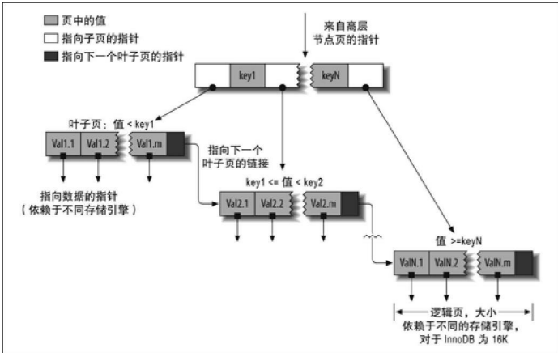

# 创建高性能索引

索引是存储引擎用于快速找到记录的一种数据结构。

当表中数据量越来越大的时候，索引对性能的影响也越显著。随着数据量增大，不恰当的索引也会造成性能急剧下降。（索引对SDD性能影响要小于HDD）

## 索引基础

索引可类比书的目录。在MySQL中，存储引擎使用索引和我们看书查找目录类似。

索引可以包含一个或者多个列的值。如果索引包含多个列，那么列的顺序也很重要，MySQL只能高效地使用最左前缀列。
如果使用ORM（对象关系映射）工具依然需要关心索引，除非只生成非常基本的查询，否则ORM很难生成合适索引的查询。

### 索引的类型

索引是存储引擎层实现的，并没有统一的索引标准。

#### B-Tree索引

使用B-Tree数据结构来存储数据。B-Tree通常意味着所有的值都是按顺序存储的，并且每一个叶子页到根的距离相同。

    

B-Tree索引能够加快访问数据的速度，因为存储引擎不再需要进行全表扫描来获取需要的数据，取而代之的是从索引的根节点（图示并未画出）开始进行搜索。根节点的槽中 存放了指向子节点的指针，存储引擎根据这些指针向下层查找。通过比较节点页的值和要 查找的值可以找到合适的指针进入下层子节点，这些指针实际上定义了子节点页中值的上 限和下限。最终存储引擎要么是找到对应的值，要么该记录不存在。

叶子节点的指针指向的是被索引的数据，而不是其他的节点页（不同引擎的“指针”类型不同）。在根节 点和叶子节点之间可能有很多层节点页。树的深度和表的大小直接相关。

B-Tree对索引列是顺序组织存储的，所以很适合查找范围数据。

可以使用B-Tree索引的查询类型。B-Tree索引适用于全键值、键值范围或键前缀查 找。其中键前缀查找只适用于根据最左前缀的查找。

- **全值匹配：**和索引中的所有列进行匹配
- **匹配最左前缀：**只使用搜因第一列
- **匹配列前缀：**匹配某一列的值的开头部分
- **匹配范围值：**
- **精确匹配某一列并范围匹配另外一列：**
- **只访问索引的查询：**即查询只需要访问索引，而无须访问 数据行

# 查询性能优化

高性能也离不开合理的查询设计。查询优化、索引优化、库表结构优化需要齐头并进，一个不落。

# Reference

1. BARON SCBWARTZ，PETER ZAITSEV，VADIM TKACBENKO著；宁海元，周振兴，彭立勋等译. 高性能MySQL 第3版[M]. 北京：电子工业出版社, 2013.05.